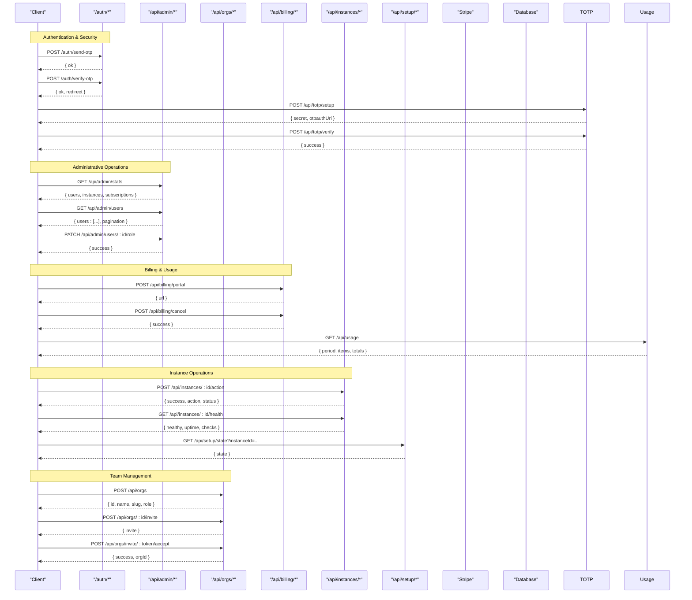
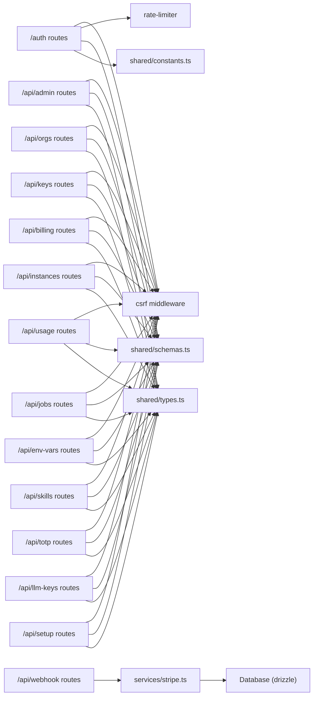

# API Reference

<cite>
**Referenced Files in This Document**
- [index.ts](file://packages/api/src/index.ts)
- [auth.ts](file://packages/api/src/routes/auth.ts)
- [api.ts](file://packages/api/src/routes/api.ts)
- [webhooks.ts](file://packages/api/src/routes/webhooks.ts)
- [admin.ts](file://packages/api/src/routes/admin.ts)
- [admin-audit.ts](file://packages/api/src/routes/admin-audit.ts)
- [api-keys.ts](file://packages/api/src/routes/api-keys.ts)
- [billing.ts](file://packages/api/src/routes/billing.ts)
- [instance-actions.ts](file://packages/api/src/routes/instance-actions.ts)
- [orgs.ts](file://packages/api/src/routes/orgs.ts)
- [usage.ts](file://packages/api/src/routes/usage.ts)
- [scheduled-jobs.ts](file://packages/api/src/routes/scheduled-jobs.ts)
- [env-vars.ts](file://packages/api/src/routes/env-vars.ts)
- [custom-skills.ts](file://packages/api/src/routes/custom-skills.ts)
- [totp.ts](file://packages/api/src/routes/totp.ts)
- [llm-keys.ts](file://packages/api/src/routes/llm-keys.ts)
- [setup.ts](file://packages/api/src/routes/setup.ts)
- [csrf.ts](file://packages/api/src/middleware/csrf.ts)
- [rate-limiter.ts](file://packages/api/src/lib/rate-limiter.ts)
- [schemas.ts](file://packages/shared/src/schemas.ts)
- [types.ts](file://packages/shared/src/types.ts)
- [constants.ts](file://packages/shared/src/constants.ts)
- [stripe.ts](file://packages/api/src/services/stripe.ts)
</cite>

## Update Summary
**Changes Made**
- Added comprehensive documentation for new administrative endpoints under /api/admin
- Documented organization management endpoints under /api/orgs
- Added API key management endpoints under /api/keys
- Documented billing management endpoints under /api/billing
- Added instance action endpoints under /api/instances
- Documented usage tracking endpoints under /api/usage
- Added scheduled job management under /api/jobs
- Documented environment variable management under /api/env-vars
- Added custom skills management under /api/skills
- Added TOTP 2FA endpoints under /api/totp
- Documented LLM key management under /api/llm-keys
- Added setup wizard endpoints under /api/setup
- Updated core components section to reflect expanded API surface
- Enhanced dependency analysis with new route groups

## Table of Contents
1. [Introduction](#introduction)
2. [Project Structure](#project-structure)
3. [Core Components](#core-components)
4. [Architecture Overview](#architecture-overview)
5. [Detailed Component Analysis](#detailed-component-analysis)
6. [Dependency Analysis](#dependency-analysis)
7. [Performance Considerations](#performance-considerations)
8. [Troubleshooting Guide](#troubleshooting-guide)
9. [Conclusion](#conclusion)
10. [Appendices](#appendices)

## Introduction
This document provides a comprehensive API reference for SparkClaw's expanded backend ecosystem. The platform now includes extensive administrative capabilities, team management, security features, and advanced instance operations beyond the original authentication, subscription, and webhook endpoints. The API supports enterprise-grade features including organization management, API key provisioning, billing administration, instance lifecycle management, and advanced operational controls.

## Project Structure
The API server is implemented using Elysia with modular route groups covering authentication, administration, team management, security, billing, instance operations, and more. The entrypoint initializes CORS, registers all route groups, and starts the server.

```mermaid
graph TB
Entry["packages/api/src/index.ts<br/>Server bootstrap"] --> CORS["CORS enabled<br/>origin from env"]
Entry --> AuthRoutes["packages/api/src/routes/auth.ts<br/>/auth/*"]
Entry --> ApiRoutes["packages/api/src/routes/api.ts<br/>/api/*"]
Entry --> WebhookRoutes["packages/api/src/routes/webhooks.ts<br/>/api/webhook/*"]
Entry --> AdminRoutes["packages/api/src/routes/admin.ts<br/>/api/admin/*"]
Entry --> OrgRoutes["packages/api/src/routes/orgs.ts<br/>/api/orgs/*"]
Entry --> ApiKeysRoutes["packages/api/src/routes/api-keys.ts<br/>/api/keys/*"]
Entry --> BillingRoutes["packages/api/src/routes/billing.ts<br/>/api/billing/*"]
Entry --> InstanceActionsRoutes["packages/api/src/routes/instance-actions.ts<br/>/api/instances/*"]
Entry --> UsageRoutes["packages/api/src/routes/usage.ts<br/>/api/usage/*"]
Entry --> JobsRoutes["packages/api/src/routes/scheduled-jobs.ts<br/>/api/jobs/*"]
Entry --> EnvVarsRoutes["packages/api/src/routes/env-vars.ts<br/>/api/env-vars/*"]
Entry --> SkillsRoutes["packages/api/src/routes/custom-skills.ts<br/>/api/skills/*"]
Entry --> TOTPRoutes["packages/api/src/routes/totp.ts<br/>/api/totp/*"]
Entry --> LLMKeysRoutes["packages/api/src/routes/llm-keys.ts<br/>/api/llm-keys/*"]
Entry --> SetupRoutes["packages/api/src/routes/setup.ts<br/>/api/setup/*"]
AuthRoutes --> Schemas["packages/shared/src/schemas.ts"]
AuthRoutes --> Types["packages/shared/src/types.ts"]
AuthRoutes --> Constants["packages/shared/src/constants.ts"]
AuthRoutes --> CSRF["packages/api/src/middleware/csrf.ts"]
AuthRoutes --> RateLimiter["packages/api/src/lib/rate-limiter.ts"]
AdminRoutes --> Schemas
AdminRoutes --> Types
AdminRoutes --> CSRF
ApiRoutes --> Schemas
ApiRoutes --> Types
ApiRoutes --> Constants
ApiRoutes --> StripeSvc["packages/api/src/services/stripe.ts"]
WebhookRoutes --> StripeSvc
```



**Diagram sources**
- [index.ts](file://packages/api/src/index.ts#L36-L58)
- [auth.ts](file://packages/api/src/routes/auth.ts#L1-L80)
- [admin.ts](file://packages/api/src/routes/admin.ts#L37-L254)
- [orgs.ts](file://packages/api/src/routes/orgs.ts#L22-L393)
- [api-keys.ts](file://packages/api/src/routes/api-keys.ts#L13-L119)
- [billing.ts](file://packages/api/src/routes/billing.ts#L12-L85)
- [instance-actions.ts](file://packages/api/src/routes/instance-actions.ts#L12-L170)
- [usage.ts](file://packages/api/src/routes/usage.ts#L48-L111)
- [scheduled-jobs.ts](file://packages/api/src/routes/scheduled-jobs.ts#L45-L211)
- [env-vars.ts](file://packages/api/src/routes/env-vars.ts#L11-L103)
- [custom-skills.ts](file://packages/api/src/routes/custom-skills.ts#L48-L173)
- [totp.ts](file://packages/api/src/routes/totp.ts#L73-L254)
- [llm-keys.ts](file://packages/api/src/routes/llm-keys.ts#L13-L112)
- [setup.ts](file://packages/api/src/routes/setup.ts#L23-L257)

**Section sources**
- [index.ts](file://packages/api/src/index.ts#L1-L78)

## Core Components
The expanded API now includes multiple specialized route groups:

**Authentication & Security**
- Authentication endpoints under /auth: OTP generation, verification, and logout
- TOTP 2FA endpoints under /api/totp: setup, verification, and disable operations
- Session-based authentication with CSRF protection

**Administrative Operations**
- Admin endpoints under /api/admin: dashboard statistics, user management, instance monitoring
- Admin audit logging under /api/admin/audit: comprehensive activity tracking

**Team & Organization Management**
- Organization endpoints under /api/orgs: creation, member management, invitations
- Role-based access control with owner/admin/member hierarchy

**Developer Tools & Security**
- API key management under /api/keys: creation, listing, deletion with scoped permissions
- LLM key management under /api/llm-keys: provider-specific key storage
- Environment variable management under /api/env-vars: secure configuration storage

**Billing & Usage**
- Billing endpoints under /api/billing: Stripe portal, subscription cancellation, account deletion
- Usage tracking under /api/usage: monthly consumption analytics

**Instance Operations**
- Instance actions under /api/instances: start/stop/restart, health monitoring, log streaming
- Scheduled jobs under /api/jobs: cron-based task management
- Custom skills under /api/skills: sandboxed code execution

**Setup & Configuration**
- Setup wizard under /api/setup: guided instance configuration

Security features:
- CSRF protection via middleware
- IP+email-scoped rate limiting for OTP endpoints
- Session-based authentication for protected routes
- Stripe webhook signature verification
- Database-level access controls and foreign key constraints

**Section sources**
- [auth.ts](file://packages/api/src/routes/auth.ts#L19-L80)
- [admin.ts](file://packages/api/src/routes/admin.ts#L37-L254)
- [admin-audit.ts](file://packages/api/src/routes/admin-audit.ts#L8-L74)
- [orgs.ts](file://packages/api/src/routes/orgs.ts#L22-L393)
- [api-keys.ts](file://packages/api/src/routes/api-keys.ts#L13-L119)
- [billing.ts](file://packages/api/src/routes/billing.ts#L12-L85)
- [instance-actions.ts](file://packages/api/src/routes/instance-actions.ts#L12-L170)
- [usage.ts](file://packages/api/src/routes/usage.ts#L48-L111)
- [scheduled-jobs.ts](file://packages/api/src/routes/scheduled-jobs.ts#L45-L211)
- [env-vars.ts](file://packages/api/src/routes/env-vars.ts#L11-L103)
- [custom-skills.ts](file://packages/api/src/routes/custom-skills.ts#L48-L173)
- [totp.ts](file://packages/api/src/routes/totp.ts#L73-L254)
- [llm-keys.ts](file://packages/api/src/routes/llm-keys.ts#L13-L112)
- [setup.ts](file://packages/api/src/routes/setup.ts#L23-L257)

## Architecture Overview
High-level flow of requests across the expanded API ecosystem.



**Diagram sources**
- [auth.ts](file://packages/api/src/routes/auth.ts#L21-L79)
- [admin.ts](file://packages/api/src/routes/admin.ts#L40-L253)
- [billing.ts](file://packages/api/src/routes/billing.ts#L21-L84)
- [instance-actions.ts](file://packages/api/src/routes/instance-actions.ts#L21-L169)
- [setup.ts](file://packages/api/src/routes/setup.ts#L40-L256)
- [orgs.ts](file://packages/api/src/routes/orgs.ts#L68-L392)
- [stripe.ts](file://packages/api/src/services/stripe.ts#L20-L43)

## Detailed Component Analysis

### Authentication & Security Endpoints

#### Authentication Endpoints
- Base path: /auth
- Methods: POST
- Security: CSRF enforced for non-safe methods; IP+email scoped rate limits; session cookies for verified users.

Endpoints:
- POST /auth/send-otp
  - Purpose: Send an OTP to the provided email address.
  - Request body: { email: string }
  - Responses: 200 OK: { ok: true }, 400 Bad Request: { error: "Invalid email" }, 429 Too Many Requests
  - Rate limit: Max 3 per email per 10 minutes.

- POST /auth/verify-otp
  - Purpose: Verify OTP and create a session cookie.
  - Request body: { email: string, code: string }
  - Responses: 200 OK: { ok: true, redirect: "/dashboard" }, 401 Unauthorized: { error: "Invalid or expired code" }

- POST /auth/logout
  - Purpose: Terminate the current session.
  - Request body: none
  - Responses: 200 OK: { ok: true, redirect: "/" }

#### TOTP 2FA Endpoints
- Base path: /api/totp
- Methods: GET, POST
- Security: Session-based authentication required.

Endpoints:
- GET /api/totp/status
  - Purpose: Check if TOTP is enabled and has backup codes.
  - Responses: 200 OK with { enabled: boolean, hasBackupCodes: boolean }

- POST /api/totp/setup
  - Purpose: Generate new TOTP secret and backup codes.
  - Responses: 200 OK with { secret, otpauthUri, backupCodes }

- POST /api/totp/verify
  - Purpose: Verify TOTP code and enable 2FA.
  - Request body: { code: string }
  - Responses: 200 OK: { success: true }, 400 Bad Request

- POST /api/totp/disable
  - Purpose: Disable TOTP 2FA after verification.
  - Request body: { code: string }
  - Responses: 200 OK: { success: true }, 400 Bad Request

**Section sources**
- [auth.ts](file://packages/api/src/routes/auth.ts#L19-L80)
- [totp.ts](file://packages/api/src/routes/totp.ts#L73-L254)
- [schemas.ts](file://packages/shared/src/schemas.ts#L9-L16)
- [schemas.ts](file://packages/shared/src/schemas.ts#L98-L101)

### Administrative Endpoints

#### Admin Dashboard & Management
- Base path: /api/admin
- Methods: GET, POST, PATCH
- Security: Admin-only access required.

Endpoints:
- GET /api/admin/stats
  - Purpose: Retrieve system statistics and metrics.
  - Responses: 200 OK with counts and distributions.

- GET /api/admin/users
  - Purpose: List users with pagination and search.
  - Query parameters: page (number), search (string)
  - Responses: 200 OK with paginated user list.

- GET /api/admin/instances
  - Purpose: List instances with filtering by status.
  - Query parameters: page (number), status (string)
  - Responses: 200 OK with paginated instance list.

- PATCH /api/admin/users/:id/role
  - Purpose: Update user role (user/admin).
  - Request body: { role: string }
  - Responses: 200 OK: { success: true }, 400 Bad Request

- GET /api/admin/users/:id
  - Purpose: Get detailed user information.
  - Responses: 200 OK with user details and associated data.

- GET /api/admin/check
  - Purpose: Check if current user has admin privileges.
  - Responses: 200 OK with { isAdmin: boolean, user }

**Section sources**
- [admin.ts](file://packages/api/src/routes/admin.ts#L37-L254)

#### Admin Audit Logging
- Base path: /api/admin/audit
- Methods: GET
- Security: Admin-only access required.

Endpoints:
- GET /api/admin/audit
  - Purpose: Retrieve audit log entries.
  - Query parameters: page (number), action (string)
  - Responses: 200 OK with paginated audit logs and pagination metadata.

**Section sources**
- [admin-audit.ts](file://packages/api/src/routes/admin-audit.ts#L8-L74)

### Team & Organization Management

#### Organization Operations
- Base path: /api/orgs
- Methods: GET, POST, PATCH, DELETE
- Security: Session-based authentication required.

Endpoints:
- GET /api/orgs
  - Purpose: List organizations the user belongs to.
  - Responses: 200 OK with organization list.

- POST /api/orgs
  - Purpose: Create a new organization.
  - Request body: { name: string }
  - Responses: 200 OK with organization details, 409 Conflict for duplicate names.

- GET /api/orgs/:id
  - Purpose: Get organization details.
  - Responses: 200 OK with organization info.

- GET /api/orgs/:id/members
  - Purpose: List organization members.
  - Responses: 200 OK with member list.

- POST /api/orgs/:id/invite
  - Purpose: Invite user to organization.
  - Request body: { email: string, role: "owner" | "admin" | "member" }
  - Responses: 200 OK with invitation details.

- POST /api/orgs/invite/:token/accept
  - Purpose: Accept organization invitation.
  - Responses: 200 OK with success and orgId.

- PATCH /api/orgs/:id/members/:memberId
  - Purpose: Update member role.
  - Request body: { role: string }
  - Responses: 200 OK: { success: true }

- DELETE /api/orgs/:id/members/:memberId
  - Purpose: Remove member from organization.
  - Responses: 200 OK: { success: true }

- DELETE /api/orgs/:id
  - Purpose: Delete organization (owner only).
  - Responses: 200 OK: { success: true }

**Section sources**
- [orgs.ts](file://packages/api/src/routes/orgs.ts#L22-L393)
- [schemas.ts](file://packages/shared/src/schemas.ts#L117-L128)
- [types.ts](file://packages/shared/src/types.ts#L69-L76)

### Developer Tools & Security

#### API Key Management
- Base path: /api/keys
- Methods: GET, POST, DELETE
- Security: Session-based authentication required.

Endpoints:
- GET /api/keys
  - Purpose: List user's API keys.
  - Responses: 200 OK with key list (values masked).

- POST /api/keys
  - Purpose: Create new API key.
  - Request body: { name: string, scopes: string[], expiresInDays?: number }
  - Responses: 200 OK with key details (full key only returned on creation).

- DELETE /api/keys/:id
  - Purpose: Delete API key.
  - Responses: 200 OK: { success: true }

**Section sources**
- [api-keys.ts](file://packages/api/src/routes/api-keys.ts#L13-L119)
- [schemas.ts](file://packages/shared/src/schemas.ts#L89-L95)
- [types.ts](file://packages/shared/src/types.ts#L71-L104)

#### LLM Key Management
- Base path: /api/llm-keys
- Methods: GET, POST, DELETE
- Security: Session-based authentication required.

Endpoints:
- GET /api/llm-keys
  - Purpose: List user's LLM keys.
  - Responses: 200 OK with key list.

- POST /api/llm-keys
  - Purpose: Add new LLM provider key.
  - Request body: { provider: string, name: string, apiKey: string }
  - Responses: 200 OK with key details.

- DELETE /api/llm-keys/:id
  - Purpose: Delete LLM key.
  - Responses: 200 OK: { success: true }

**Section sources**
- [llm-keys.ts](file://packages/api/src/routes/llm-keys.ts#L13-L112)
- [schemas.ts](file://packages/shared/src/schemas.ts#L105-L111)
- [types.ts](file://packages/shared/src/types.ts#L70-L139)

#### Environment Variables
- Base path: /api/env-vars
- Methods: GET, POST, PATCH, DELETE
- Security: Session-based authentication required.

Endpoints:
- GET /api/env-vars
  - Purpose: List environment variables for an instance.
  - Query parameters: instanceId (required)
  - Responses: 200 OK with masked values.

- POST /api/env-vars
  - Purpose: Create new environment variable.
  - Request body: { instanceId: string, key: string, value: string, isSecret: boolean }
  - Responses: 200 OK: { success: true, id }.

- PATCH /api/env-vars/:id
  - Purpose: Update environment variable value.
  - Request body: { value: string }
  - Responses: 200 OK: { success: true }

- DELETE /api/env-vars/:id
  - Purpose: Delete environment variable.
  - Responses: 200 OK: { success: true }

**Section sources**
- [env-vars.ts](file://packages/api/src/routes/env-vars.ts#L11-L103)
- [schemas.ts](file://packages/shared/src/schemas.ts#L167-L176)
- [types.ts](file://packages/shared/src/types.ts#L177-L184)

### Billing & Usage Management

#### Billing Operations
- Base path: /api/billing
- Methods: POST, DELETE
- Security: Session-based authentication required.

Endpoints:
- POST /api/billing/portal
  - Purpose: Create Stripe billing portal session.
  - Responses: 200 OK: { url }, 400 Bad Request

- POST /api/billing/cancel
  - Purpose: Cancel active subscription.
  - Responses: 200 OK: { success: true }, 400 Bad Request

- DELETE /api/billing/account
  - Purpose: Delete user account and all associated data.
  - Responses: 200 OK: { success: true }

#### Usage Tracking
- Base path: /api/usage
- Methods: GET
- Security: Session-based authentication required.

Endpoints:
- GET /api/usage
  - Purpose: Get current month's usage summary.
  - Responses: 200 OK with usage items and totals.

- GET /api/usage/history
  - Purpose: Get usage history for specified months.
  - Query parameters: months (1-24, default 6)
  - Responses: 200 OK with historical usage data.

**Section sources**
- [billing.ts](file://packages/api/src/routes/billing.ts#L12-L85)
- [usage.ts](file://packages/api/src/routes/usage.ts#L48-L111)
- [types.ts](file://packages/shared/src/types.ts#L141-L150)

### Instance Operations

#### Instance Actions & Monitoring
- Base path: /api/instances
- Methods: POST, GET
- Security: Session-based authentication required.

Endpoints:
- POST /api/instances/:id/action
  - Purpose: Start, stop, or restart instance.
  - Request body: { action: "start" | "stop" | "restart" }
  - Responses: 200 OK: { success: true, action, status }, 400 Bad Request

- GET /api/instances/:id/health
  - Purpose: Get detailed health status and metrics.
  - Responses: 200 OK with health check results.

- GET /api/instances/:id/logs
  - Purpose: Stream or retrieve recent logs.
  - Query parameters: instanceId (required)
  - Responses: 200 OK with log stream (SSE) or JSON array.

#### Scheduled Jobs
- Base path: /api/jobs
- Methods: GET, POST, PATCH, DELETE
- Security: Session-based authentication required.

Endpoints:
- GET /api/jobs
  - Purpose: List scheduled jobs.
  - Query parameters: instanceId (optional)
  - Responses: 200 OK with job list.

- POST /api/jobs
  - Purpose: Create new scheduled job.
  - Request body: { instanceId: string, name: string, cronExpression: string, taskType: string, config?: object }
  - Responses: 200 OK with job details.

- PATCH /api/jobs/:id
  - Purpose: Update scheduled job.
  - Request body: Partial job update fields
  - Responses: 200 OK with updated job details.

- DELETE /api/jobs/:id
  - Purpose: Delete scheduled job.
  - Responses: 200 OK: { success: true }

#### Custom Skills
- Base path: /api/skills
- Methods: GET, POST, PATCH, DELETE, POST
- Security: Session-based authentication required.

Endpoints:
- GET /api/skills
  - Purpose: List custom skills for an instance.
  - Query parameters: instanceId (required)
  - Responses: 200 OK with skill list.

- POST /api/skills
  - Purpose: Create new custom skill.
  - Request body: { instanceId: string, name: string, description?: string, language: string, code: string, triggerType?: string, triggerValue?: string, timeout?: number }
  - Responses: 200 OK: { success: true, id }.

- PATCH /api/skills/:id
  - Purpose: Update custom skill.
  - Request body: Partial skill update fields
  - Responses: 200 OK: { success: true }

- DELETE /api/skills/:id
  - Purpose: Delete custom skill.
  - Responses: 200 OK: { success: true }

- POST /api/skills/:id/execute
  - Purpose: Execute skill in sandboxed environment.
  - Responses: 200 OK with execution result.

**Section sources**
- [instance-actions.ts](file://packages/api/src/routes/instance-actions.ts#L12-L170)
- [scheduled-jobs.ts](file://packages/api/src/routes/scheduled-jobs.ts#L45-L211)
- [custom-skills.ts](file://packages/api/src/routes/custom-skills.ts#L48-L173)
- [schemas.ts](file://packages/shared/src/schemas.ts#L205-L207)
- [schemas.ts](file://packages/shared/src/schemas.ts#L134-L147)
- [schemas.ts](file://packages/shared/src/schemas.ts#L183-L201)
- [types.ts](file://packages/shared/src/types.ts#L152-L201)

### Setup & Configuration

#### Setup Wizard
- Base path: /api/setup
- Methods: GET, POST
- Security: Session-based authentication required.

Endpoints:
- GET /api/setup/state
  - Purpose: Get current setup wizard state.
  - Query parameters: instanceId (required)
  - Responses: 200 OK with wizard state.

- POST /api/setup/save
  - Purpose: Save setup wizard data.
  - Request body: Complete setup data
  - Responses: 200 OK: { success: true }

- POST /api/setup/channel
  - Purpose: Save channel credentials.
  - Request body: { instanceId: string, type: string, credentials: object }
  - Responses: 200 OK: { success: true }

- DELETE /api/setup/channel/:type
  - Purpose: Delete channel configuration.
  - Query parameters: instanceId (required)
  - Responses: 200 OK: { success: true }

**Section sources**
- [setup.ts](file://packages/api/src/routes/setup.ts#L23-L257)
- [schemas.ts](file://packages/shared/src/schemas.ts#L72-L85)
- [types.ts](file://packages/shared/src/types.ts#L295-L310)

### Subscription Management Endpoints

- Base path: /api
- Methods: GET, POST
- Authentication: Required (session cookie). Unauthorized responses are handled centrally.

Endpoints:
- GET /api/me
  - Purpose: Retrieve current user information and subscription status.
  - Responses: 200 OK: MeResponse, 401 Unauthorized

- POST /api/checkout
  - Purpose: Create a Stripe Checkout session for a selected plan.
  - Request body: { plan: "starter" | "pro" | "scale" }
  - Responses: 200 OK: { url: string }, 400 Bad Request, 401 Unauthorized

- GET /api/instance
  - Purpose: Retrieve instance details linked to the user's subscription.
  - Responses: 200 OK: InstanceResponse, 401 Unauthorized

Validation rules:
- Plan enum validated via Zod schema.
- Session verification performed via middleware resolver.

**Section sources**
- [api.ts](file://packages/api/src/routes/api.ts#L11-L86)
- [schemas.ts](file://packages/shared/src/schemas.ts#L18-L20)
- [types.ts](file://packages/shared/src/types.ts#L81-L175)

### Webhook Endpoints

- Base path: /api/webhook
- Method: POST
- Security: Signature verification required; missing or invalid signatures return errors.

Endpoint:
- POST /api/webhook/stripe
  - Purpose: Process Stripe webhook events.
  - Headers: stripe-signature: string (required)
  - Supported event types:
    - checkout.session.completed
    - customer.subscription.updated
    - customer.subscription.deleted
  - Responses: 200 OK: { received: true }, 400 Bad Request, 500 Internal Server Error

Signature verification:
- Uses Stripe SDK with configured webhook secret.

**Section sources**
- [webhooks.ts](file://packages/api/src/routes/webhooks.ts#L5-L49)
- [stripe.ts](file://packages/api/src/services/stripe.ts#L20-L26)
- [stripe.ts](file://packages/api/src/services/stripe.ts#L45-L106)

## Dependency Analysis



**Diagram sources**
- [index.ts](file://packages/api/src/index.ts#L36-L58)
- [auth.ts](file://packages/api/src/routes/auth.ts#L1-L80)
- [admin.ts](file://packages/api/src/routes/admin.ts#L1-L254)
- [orgs.ts](file://packages/api/src/routes/orgs.ts#L1-L393)
- [api-keys.ts](file://packages/api/src/routes/api-keys.ts#L1-L119)
- [billing.ts](file://packages/api/src/routes/billing.ts#L1-L85)
- [instance-actions.ts](file://packages/api/src/routes/instance-actions.ts#L1-L170)
- [usage.ts](file://packages/api/src/routes/usage.ts#L1-L111)
- [scheduled-jobs.ts](file://packages/api/src/routes/scheduled-jobs.ts#L1-L211)
- [env-vars.ts](file://packages/api/src/routes/env-vars.ts#L1-L103)
- [custom-skills.ts](file://packages/api/src/routes/custom-skills.ts#L1-L173)
- [totp.ts](file://packages/api/src/routes/totp.ts#L1-L254)
- [llm-keys.ts](file://packages/api/src/routes/llm-keys.ts#L1-L112)
- [setup.ts](file://packages/api/src/routes/setup.ts#L1-L257)
- [webhooks.ts](file://packages/api/src/routes/webhooks.ts#L1-L49)

**Section sources**
- [index.ts](file://packages/api/src/index.ts#L1-L78)

## Performance Considerations
- In-memory rate limiter:
  - Periodic cleanup runs every minute to remove expired entries.
  - Remaining quota can be queried via the rate limiter utility.
- Instance operations:
  - Health checks use timeouts to prevent hanging requests.
  - Log streaming uses Server-Sent Events for real-time updates.
- Database optimization:
  - Pagination implemented across listing endpoints.
  - Indexes on frequently queried columns (user_id, instance_id, timestamps).
- Queue processing:
  - Optional Redis-based queue for background tasks.
  - Direct provisioning fallback when queue unavailable.
- Recommendations:
  - Scale horizontally behind a load balancer.
  - Consider external caching for rate limits in clustered deployments.
  - Monitor Stripe webhook delivery and retry mechanisms.
  - Implement connection pooling for database operations.

**Section sources**
- [rate-limiter.ts](file://packages/api/src/lib/rate-limiter.ts#L14-L58)
- [instance-actions.ts](file://packages/api/src/routes/instance-actions.ts#L35-L59)
- [index.ts](file://packages/api/src/index.ts#L29-L34)

## Troubleshooting Guide
Common issues and resolutions across the expanded API:

**Authentication & Security**
- 400 Bad Request on /auth/send-otp or /auth/verify-otp:
  - Cause: Invalid email format or OTP code format.
  - Resolution: Ensure email is valid and OTP is 6 digits.
- 429 Too Many Requests:
  - Cause: Rate limit exceeded for authentication operations.
  - Resolution: Wait until the rate limit window elapses.
- 401 Unauthorized on admin endpoints:
  - Cause: Missing or invalid session cookie.
  - Resolution: Re-authenticate via /auth/send-otp and /auth/verify-otp.

**Administrative Operations**
- 403 Forbidden on /api/admin endpoints:
  - Cause: Non-admin user attempting administrative operations.
  - Resolution: Ensure user has admin privileges.
- 404 Not Found on resource operations:
  - Cause: Resource doesn't exist or doesn't belong to user.
  - Resolution: Verify resource IDs and ownership.

**Team Management**
- 409 Conflict on organization creation:
  - Cause: Duplicate organization name.
  - Resolution: Use unique organization name.
- 403 Forbidden on member management:
  - Cause: Insufficient permissions (must be owner/admin).
  - Resolution: Ensure proper role assignment.

**Instance Operations**
- 502 Bad Gateway on instance actions:
  - Cause: Communication failure with OpenClaw instance.
  - Resolution: Check instance connectivity and retry.
- 400 Bad Request on scheduled jobs:
  - Cause: Invalid cron expression or missing instance ownership.
  - Resolution: Validate cron syntax and ensure proper instance access.

**Billing & Usage**
- 400 Bad Request on billing operations:
  - Cause: No active subscription or billing account.
  - Resolution: Verify subscription status and billing setup.
- 400 Bad Request on usage queries:
  - Cause: Invalid months parameter.
  - Resolution: Use months between 1 and 24.

**Security & Compliance**
- 400 Bad Request on API key operations:
  - Cause: Invalid scope or input validation failure.
  - Resolution: Check scope values and input format.
- 400 Bad Request on TOTP operations:
  - Cause: Invalid TOTP code or setup state.
  - Resolution: Verify TOTP code and ensure proper setup flow.

**Section sources**
- [auth.ts](file://packages/api/src/routes/auth.ts#L22-L51)
- [admin.ts](file://packages/api/src/routes/admin.ts#L179-L197)
- [orgs.ts](file://packages/api/src/routes/orgs.ts#L173-L277)
- [instance-actions.ts](file://packages/api/src/routes/instance-actions.ts#L21-L60)
- [billing.ts](file://packages/api/src/routes/billing.ts#L21-L84)
- [api-keys.ts](file://packages/api/src/routes/api-keys.ts#L48-L92)

## Conclusion
This comprehensive API reference documents SparkClaw's expanded ecosystem of endpoints covering authentication, administrative operations, team management, security features, billing management, instance operations, and developer tools. The platform now supports enterprise-grade functionality with robust security measures, comprehensive audit logging, and flexible operational controls. The documentation emphasizes validation, rate limiting, CSRF protection, secure session handling, and proper access controls across all endpoint groups.

## Appendices

### Endpoint Reference Summary

**Authentication & Security**
- POST /auth/send-otp - Body: { email } - Responses: 200, 400, 429
- POST /auth/verify-otp - Body: { email, code } - Responses: 200, 400, 401, 429
- POST /auth/logout - Body: none - Responses: 200
- GET /api/totp/status - Responses: 200, 401
- POST /api/totp/setup - Responses: 200, 400, 401
- POST /api/totp/verify - Body: { code } - Responses: 200, 400, 401
- POST /api/totp/disable - Body: { code } - Responses: 200, 400, 401

**Administrative Operations**
- GET /api/admin/stats - Responses: 200, 401
- GET /api/admin/users - Query: page, search - Responses: 200, 401
- GET /api/admin/instances - Query: page, status - Responses: 200, 401
- PATCH /api/admin/users/:id/role - Body: { role } - Responses: 200, 400, 401, 403, 404
- GET /api/admin/users/:id - Responses: 200, 401, 404
- GET /api/admin/check - Responses: 200, 401

**Team Management**
- GET /api/orgs - Responses: 200, 401
- POST /api/orgs - Body: { name } - Responses: 200, 400, 401, 409
- GET /api/orgs/:id - Responses: 200, 401, 404
- GET /api/orgs/:id/members - Responses: 200, 401, 404
- POST /api/orgs/:id/invite - Body: { email, role } - Responses: 200, 400, 401, 403, 404, 409
- POST /api/orgs/invite/:token/accept - Responses: 200, 400, 401, 404
- PATCH /api/orgs/:id/members/:memberId - Body: { role } - Responses: 200, 400, 401, 403, 404
- DELETE /api/orgs/:id/members/:memberId - Responses: 200, 400, 401, 403, 404
- DELETE /api/orgs/:id - Responses: 200, 400, 401, 403, 404

**Developer Tools & Security**
- GET /api/keys - Responses: 200, 401
- POST /api/keys - Body: { name, scopes, expiresInDays? } - Responses: 200, 400, 401
- DELETE /api/keys/:id - Responses: 200, 400, 401, 404
- GET /api/llm-keys - Responses: 200, 401
- POST /api/llm-keys - Body: { provider, name, apiKey } - Responses: 200, 400, 401
- DELETE /api/llm-keys/:id - Responses: 200, 400, 401, 404
- GET /api/env-vars - Query: instanceId - Responses: 200, 400, 401, 404
- POST /api/env-vars - Body: { instanceId, key, value, isSecret } - Responses: 200, 400, 401, 404
- PATCH /api/env-vars/:id - Body: { value } - Responses: 200, 400, 401, 403, 404
- DELETE /api/env-vars/:id - Responses: 200, 400, 401, 403, 404

**Billing & Usage**
- POST /api/billing/portal - Responses: 200, 400, 401
- POST /api/billing/cancel - Responses: 200, 400, 401
- DELETE /api/billing/account - Responses: 200, 401
- GET /api/usage - Responses: 200, 401
- GET /api/usage/history - Query: months - Responses: 200, 401

**Instance Operations**
- POST /api/instances/:id/action - Body: { action } - Responses: 200, 400, 401, 404
- GET /api/instances/:id/health - Responses: 200, 400, 401, 404
- GET /api/instances/:id/logs - Responses: 200, 400, 401, 404
- GET /api/jobs - Query: instanceId? - Responses: 200, 401
- POST /api/jobs - Body: { instanceId, name, cronExpression, taskType, config? } - Responses: 200, 400, 401, 404
- PATCH /api/jobs/:id - Body: partial update - Responses: 200, 400, 401, 404
- DELETE /api/jobs/:id - Responses: 200, 400, 401, 404
- GET /api/skills - Query: instanceId - Responses: 200, 400, 401, 404
- POST /api/skills - Body: { instanceId, name, description?, language, code, triggerType?, triggerValue?, timeout? } - Responses: 200, 400, 401, 404
- PATCH /api/skills/:id - Body: partial update - Responses: 200, 400, 401, 403, 404
- DELETE /api/skills/:id - Responses: 200, 400, 401, 403, 404
- POST /api/skills/:id/execute - Responses: 200, 400, 401, 403, 404

**Setup & Configuration**
- GET /api/setup/state - Query: instanceId - Responses: 200, 400, 401
- POST /api/setup/save - Body: complete setup data - Responses: 200, 400, 401, 404
- POST /api/setup/channel - Body: { instanceId, type, credentials } - Responses: 200, 400, 401, 404
- DELETE /api/setup/channel/:type - Query: instanceId - Responses: 200, 400, 401, 404

**Subscription Management**
- GET /api/me - Responses: 200, 401
- POST /api/checkout - Body: { plan } - Responses: 200, 400, 401
- GET /api/instance - Responses: 200, 401

**Webhooks**
- POST /api/webhook/stripe - Headers: stripe-signature - Responses: 200, 400, 500

### Request/Response Schemas

**Shared schemas**
- sendOtpSchema: { email: string }
- verifyOtpSchema: { email: string, code: string }
- createCheckoutSchema: { plan: "starter" | "pro" | "scale" }
- createApiKeySchema: { name: string, scopes: string[], expiresInDays?: number }
- verifyTotpSchema: { code: string }
- createLlmKeySchema: { provider: string, name: string, apiKey: string }
- createOrgSchema: { name: string }
- inviteOrgMemberSchema: { email: string, role: "owner" | "admin" | "member" }
- updateOrgMemberRoleSchema: { role: "owner" | "admin" | "member" }
- createScheduledJobSchema: { instanceId: string, name: string, cronExpression: string, taskType: string, config?: object }
- updateScheduledJobSchema: { name?: string, cronExpression?: string, config?: object, enabled?: boolean }
- createEnvVarSchema: { instanceId: string, key: string, value: string, isSecret: boolean }
- updateEnvVarSchema: { value: string }
- createCustomSkillSchema: { instanceId: string, name: string, description?: string, language: string, code: string, triggerType?: string, triggerValue?: string, timeout?: number }
- updateCustomSkillSchema: { description?: string, code?: string, enabled?: boolean, triggerType?: string, triggerValue?: string, timeout?: number }
- instanceActionSchema: { action: "start" | "stop" | "restart" }
- saveSetupSchema: Complete setup data structure
- saveChannelCredentialsSchema: { instanceId: string, type: string, credentials: object }

**Response types**
- MeResponse: user + subscription + instance limits + 2FA status
- ApiKeyResponse: key metadata with masked values
- OrgResponse: organization details with member count
- OrgMemberResponse: member details with role
- LlmKeyResponse: LLM key metadata
- UsageSummary: monthly usage with totals
- ScheduledJobResponse: job configuration and scheduling
- InstanceResponse: instance status and configuration
- EnvVarResponse: environment variable with masking
- CustomSkillResponse: skill definition and execution metadata
- InstanceHealthResponse: health check results
- AuditLogResponse: administrative action record

**Section sources**
- [schemas.ts](file://packages/shared/src/schemas.ts#L9-L214)
- [types.ts](file://packages/shared/src/types.ts#L81-L311)

### Client Implementation Examples

**JavaScript (fetch)**
```javascript
// Authentication & Security
fetch("/auth/send-otp", { method: "POST", credentials: "include", headers: { "Content-Type": "application/json" }, body: JSON.stringify({ email: "user@example.com" }) })
fetch("/auth/verify-otp", { method: "POST", credentials: "include", headers: { "Content-Type": "application/json" }, body: JSON.stringify({ email: "user@example.com", code: "123456" }) })
fetch("/auth/logout", { method: "POST", credentials: "include" })
fetch("/api/totp/setup", { method: "POST", credentials: "include" })
fetch("/api/totp/verify", { method: "POST", credentials: "include", headers: { "Content-Type": "application/json" }, body: JSON.stringify({ code: "123456" }) })

// Administrative Operations
fetch("/api/admin/stats", { method: "GET", credentials: "include" })
fetch("/api/admin/users?page=1&search=user", { method: "GET", credentials: "include" })
fetch("/api/admin/users/:id/role", { method: "PATCH", credentials: "include", headers: { "Content-Type": "application/json" }, body: JSON.stringify({ role: "admin" }) })

// Team Management
fetch("/api/orgs", { method: "GET", credentials: "include" })
fetch("/api/orgs", { method: "POST", credentials: "include", headers: { "Content-Type": "application/json" }, body: JSON.stringify({ name: "My Org" }) })
fetch("/api/orgs/:id/invite", { method: "POST", credentials: "include", headers: { "Content-Type": "application/json" }, body: JSON.stringify({ email: "member@example.com", role: "member" }) })

// Developer Tools & Security
fetch("/api/keys", { method: "GET", credentials: "include" })
fetch("/api/keys", { method: "POST", credentials: "include", headers: { "Content-Type": "application/json" }, body: JSON.stringify({ name: "key-name", scopes: ["instance:read"], expiresInDays: 30 }) })
fetch("/api/env-vars?instanceId=...", { method: "GET", credentials: "include" })
fetch("/api/env-vars", { method: "POST", credentials: "include", headers: { "Content-Type": "application/json" }, body: JSON.stringify({ instanceId: "...", key: "ENV_KEY", value: "secret", isSecret: true }) })

// Billing & Usage
fetch("/api/billing/portal", { method: "POST", credentials: "include" })
fetch("/api/billing/cancel", { method: "POST", credentials: "include" })
fetch("/api/usage", { method: "GET", credentials: "include" })
fetch("/api/usage/history?months=6", { method: "GET", credentials: "include" })

// Instance Operations
fetch("/api/instances/:id/action", { method: "POST", credentials: "include", headers: { "Content-Type": "application/json" }, body: JSON.stringify({ action: "start" }) })
fetch("/api/instances/:id/health", { method: "GET", credentials: "include" })
fetch("/api/instances/:id/logs", { method: "GET", credentials: "include" })
fetch("/api/jobs", { method: "GET", credentials: "include" })
fetch("/api/jobs", { method: "POST", credentials: "include", headers: { "Content-Type": "application/json" }, body: JSON.stringify({ instanceId: "...", name: "backup", cronExpression: "0 2 * * *", taskType: "backup" }) })
fetch("/api/skills?instanceId=...", { method: "GET", credentials: "include" })
fetch("/api/skills", { method: "POST", credentials: "include", headers: { "Content-Type": "application/json" }, body: JSON.stringify({ instanceId: "...", name: "cleanup", language: "python", code: "print('cleanup')", triggerType: "schedule", cronExpression: "0 0 * * *" }) })

// Setup & Configuration
fetch("/api/setup/state?instanceId=...", { method: "GET", credentials: "include" })
fetch("/api/setup/save", { method: "POST", credentials: "include", headers: { "Content-Type": "application/json" }, body: JSON.stringify({ instanceId: "...", instanceName: "My Instance", timezone: "UTC", channels: [], aiConfig: {}, features: {} }) })
```

**Python (requests)**
```python
import requests

# Authentication & Security
requests.post("https://your-api.example.com/auth/send-otp", json={"email": "user@example.com"}, cookies=cookies)
requests.post("https://your-api.example.com/auth/verify-otp", json={"email": "user@example.com", "code": "123456"}, cookies=cookies)
requests.post("https://your-api.example.com/api/totp/setup", cookies=cookies)
requests.post("https://your-api.example.com/api/totp/verify", json={"code": "123456"}, cookies=cookies)

# Administrative Operations
requests.get("https://your-api.example.com/api/admin/stats", cookies=cookies)
requests.get("https://your-api.example.com/api/admin/users?page=1&search=user", cookies=cookies)
requests.patch("https://your-api.example.com/api/admin/users/:id/role", json={"role": "admin"}, cookies=cookies)

# Team Management
requests.get("https://your-api.example.com/api/orgs", cookies=cookies)
requests.post("https://your-api.example.com/api/orgs", json={"name": "My Org"}, cookies=cookies)
requests.post("https://your-api.example.com/api/orgs/:id/invite", json={"email": "member@example.com", "role": "member"}, cookies=cookies)

# Developer Tools & Security
requests.get("https://your-api.example.com/api/keys", cookies=cookies)
requests.post("https://your-api.example.com/api/keys", json={"name": "key-name", "scopes": ["instance:read"], "expiresInDays": 30}, cookies=cookies)
requests.get("https://your-api.example.com/api/env-vars?instanceId=...", cookies=cookies)
requests.post("https://your-api.example.com/api/env-vars", json={"instanceId": "...", "key": "ENV_KEY", "value": "secret", "isSecret": True}, cookies=cookies)

# Billing & Usage
requests.post("https://your-api.example.com/api/billing/portal", cookies=cookies)
requests.post("https://your-api.example.com/api/billing/cancel", cookies=cookies)
requests.get("https://your-api.example.com/api/usage", cookies=cookies)
requests.get("https://your-api.example.com/api/usage/history?months=6", cookies=cookies)

# Instance Operations
requests.post("https://your-api.example.com/api/instances/:id/action", json={"action": "start"}, cookies=cookies)
requests.get("https://your-api.example.com/api/instances/:id/health", cookies=cookies)
requests.get("https://your-api.example.com/api/instances/:id/logs", cookies=cookies)
requests.get("https://your-api.example.com/api/jobs", cookies=cookies)
requests.post("https://your-api.example.com/api/jobs", json={"instanceId": "...", "name": "backup", "cronExpression": "0 2 * * *", "taskType": "backup"}, cookies=cookies)
requests.get("https://your-api.example.com/api/skills?instanceId=...", cookies=cookies)
requests.post("https://your-api.example.com/api/skills", json={"instanceId": "...", "name": "cleanup", "language": "python", "code": "print('cleanup')", "triggerType": "schedule", "cronExpression": "0 0 * * *"}, cookies=cookies)

# Setup & Configuration
requests.get("https://your-api.example.com/api/setup/state?instanceId=...", cookies=cookies)
requests.post("https://your-api.example.com/api/setup/save", json={"instanceId": "...", "instanceName": "My Instance", "timezone": "UTC", "channels": [], "aiConfig": {}, "features": {}}, cookies=cookies)
```

**cURL**
```bash
# Authentication & Security
curl -X POST https://your-api.example.com/auth/send-otp -H "Content-Type: application/json" -d '{"email":"user@example.com"}' -c cookies.txt
curl -X POST https://your-api.example.com/auth/verify-otp -H "Content-Type: application/json" -d '{"email":"user@example.com","code":"123456"}' -b cookies.txt -c cookies.txt
curl -X POST https://your-api.example.com/api/totp/setup -b cookies.txt -c cookies.txt
curl -X POST https://your-api.example.com/api/totp/verify -H "Content-Type: application/json" -d '{"code":"123456"}' -b cookies.txt -c cookies.txt

# Administrative Operations
curl -X GET https://your-api.example.com/api/admin/stats -b cookies.txt
curl -X GET "https://your-api.example.com/api/admin/users?page=1&search=user" -b cookies.txt
curl -X PATCH https://your-api.example.com/api/admin/users/:id/role -H "Content-Type: application/json" -d '{"role":"admin"}' -b cookies.txt -c cookies.txt

# Team Management
curl -X GET https://your-api.example.com/api/orgs -b cookies.txt
curl -X POST https://your-api.example.com/api/orgs -H "Content-Type: application/json" -d '{"name":"My Org"}' -b cookies.txt -c cookies.txt
curl -X POST https://your-api.example.com/api/orgs/:id/invite -H "Content-Type: application/json" -d '{"email":"member@example.com","role":"member"}' -b cookies.txt -c cookies.txt

# Developer Tools & Security
curl -X GET https://your-api.example.com/api/keys -b cookies.txt
curl -X POST https://your-api.example.com/api/keys -H "Content-Type: application/json" -d '{"name":"key-name","scopes":["instance:read"],"expiresInDays":30}' -b cookies.txt -c cookies.txt
curl -X GET "https://your-api.example.com/api/env-vars?instanceId=..." -b cookies.txt
curl -X POST https://your-api.example.com/api/env-vars -H "Content-Type: application/json" -d '{"instanceId":"...","key":"ENV_KEY","value":"secret","isSecret":true}' -b cookies.txt -c cookies.txt

# Billing & Usage
curl -X POST https://your-api.example.com/api/billing/portal -b cookies.txt -c cookies.txt
curl -X POST https://your-api.example.com/api/billing/cancel -b cookies.txt -c cookies.txt
curl -X GET https://your-api.example.com/api/usage -b cookies.txt
curl -X GET "https://your-api.example.com/api/usage/history?months=6" -b cookies.txt

# Instance Operations
curl -X POST https://your-api.example.com/api/instances/:id/action -H "Content-Type: application/json" -d '{"action":"start"}' -b cookies.txt -c cookies.txt
curl -X GET https://your-api.example.com/api/instances/:id/health -b cookies.txt
curl -X GET https://your-api.example.com/api/instances/:id/logs -b cookies.txt
curl -X GET https://your-api.example.com/api/jobs -b cookies.txt
curl -X POST https://your-api.example.com/api/jobs -H "Content-Type: application/json" -d '{"instanceId":"...","name":"backup","cronExpression":"0 2 * * *","taskType":"backup"}' -b cookies.txt -c cookies.txt
curl -X GET "https://your-api.example.com/api/skills?instanceId=..." -b cookies.txt
curl -X POST https://your-api.example.com/api/skills -H "Content-Type: application/json" -d '{"instanceId":"...","name":"cleanup","language":"python","code":"print(\"cleanup\")","triggerType":"schedule","cronExpression":"0 0 * * *"}' -b cookies.txt -c cookies.txt

# Setup & Configuration
curl -X GET "https://your-api.example.com/api/setup/state?instanceId=..." -b cookies.txt
curl -X POST https://your-api.example.com/api/setup/save -H "Content-Type: application/json" -d '{"instanceId":"...","instanceName":"My Instance","timezone":"UTC","channels":[],"aiConfig":{},"features":{}}' -b cookies.txt -c cookies.txt
```

### Integration Guidelines

**Frontend Integration**
- Enable credentials for cross-origin requests to support session cookies.
- Store and send session cookies automatically for authenticated endpoints.
- Implement CSRF protection by ensuring same-origin policy and origin header matches WEB_URL.
- Handle different authentication states (2FA enabled/disabled) in UI.
- Implement proper error handling for all endpoint categories.

**Backend Integration**
- Use the Stripe webhook secret to verify signatures for billing events.
- Implement idempotent handlers for subscription updates and cancellations.
- Monitor rate-limit windows and adjust client behavior accordingly.
- Implement proper error handling for administrative operations.
- Use database transactions for multi-step operations (organization invites, setup wizard).

**Security Best Practices**
- Always use HTTPS in production to protect cookies and sensitive data.
- Implement proper input validation and sanitization for all endpoints.
- Use role-based access control for administrative operations.
- Implement audit logging for all sensitive operations.
- Regularly review and rotate API keys and secrets.
- Monitor and alert on unusual administrative activities.

**Performance Optimization**
- Implement client-side caching for read-only endpoints.
- Use pagination for large datasets (user lists, audit logs, usage history).
- Implement connection pooling for database operations.
- Consider implementing exponential backoff for retry logic.
- Monitor API response times and implement circuit breakers for downstream dependencies.