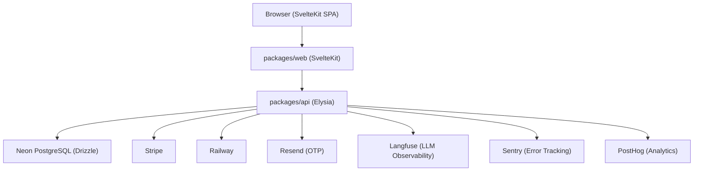
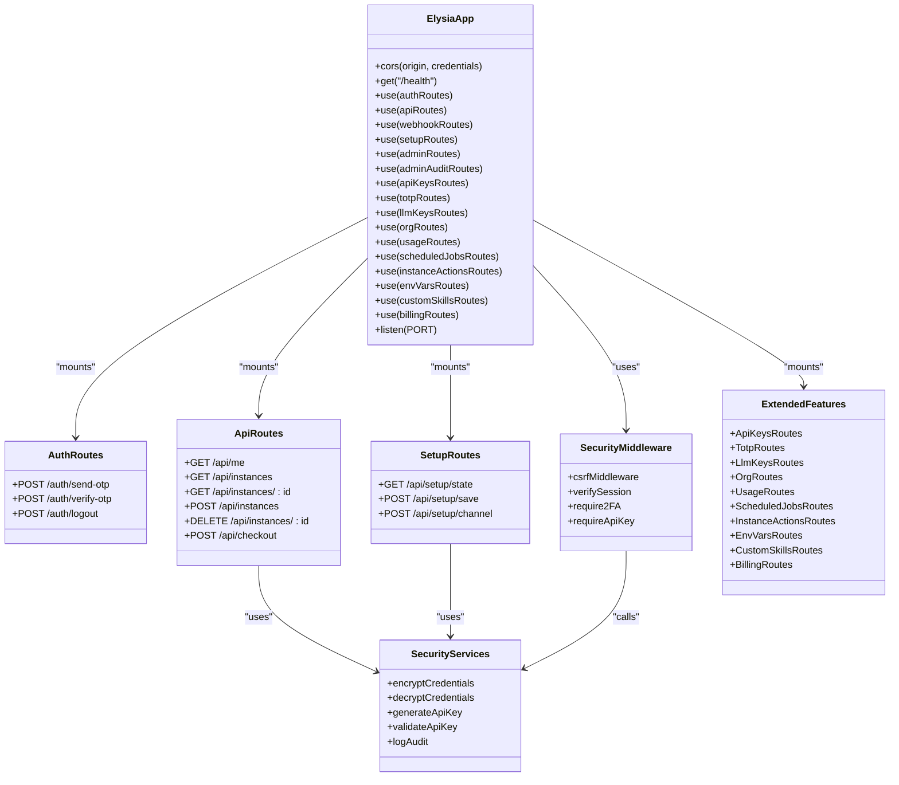
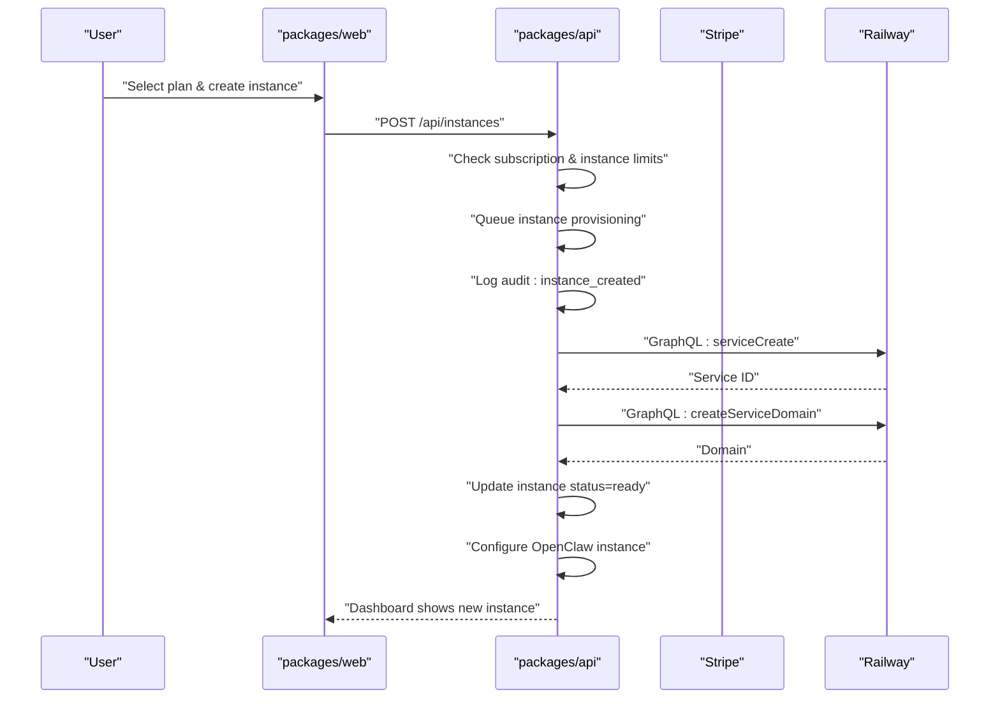
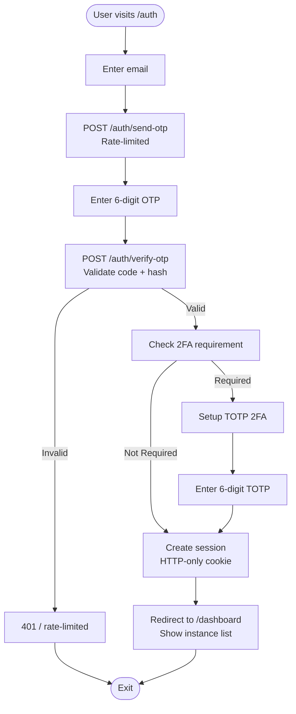
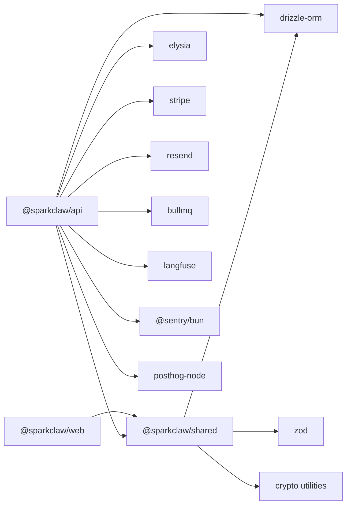

# Architecture & Design

<cite>
**Referenced Files in This Document**
- [package.json](file://package.json)
- [drizzle.config.ts](file://drizzle.config.ts)
- [PRD.md](file://PRD.md)
- [packages/api/package.json](file://packages/api/package.json)
- [packages/web/package.json](file://packages/web/package.json)
- [packages/shared/package.json](file://packages/shared/package.json)
- [packages/api/src/index.ts](file://packages/api/src/index.ts)
- [packages/api/src/routes/api.ts](file://packages/api/src/routes/api.ts)
- [packages/api/src/routes/setup.ts](file://packages/api/src/routes/setup.ts)
- [packages/api/src/services/stripe.ts](file://packages/api/src/services/stripe.ts)
- [packages/api/src/services/railway.ts](file://packages/api/src/services/railway.ts)
- [packages/shared/src/db/schema.ts](file://packages/shared/src/db/schema.ts)
- [packages/shared/src/types.ts](file://packages/shared/src/types.ts)
- [packages/shared/src/constants.ts](file://packages/shared/src/constants.ts)
- [packages/shared/src/schemas.ts](file://packages/shared/src/schemas.ts)
- [docs/plans/2026-03-09-multi-instance-design.md](file://docs/plans/2026-03-09-multi-instance-design.md)
- [docs/plans/2026-03-09-multi-instance-plan.md](file://docs/plans/2026-03-09-multi-instance-plan.md)
- [docs/plans/2026-03-09-full-roadmap.md](file://docs/plans/2026-03-09-full-roadmap.md)
</cite>

## Update Summary
**Changes Made**
- Updated multi-instance architecture patterns and database schema changes
- Added comprehensive security infrastructure including 2FA, API keys, and audit logging
- Enhanced observability stack with Langfuse integration and improved monitoring
- Expanded feature roadmap with advanced security, team support, and mission control capabilities
- Updated API endpoints to support instance management and enhanced provisioning workflows

## Table of Contents
1. [Introduction](#introduction)
2. [Project Structure](#project-structure)
3. [Core Components](#core-components)
4. [Architecture Overview](#architecture-overview)
5. [Detailed Component Analysis](#detailed-component-analysis)
6. [Multi-Instance Design Patterns](#multi-instance-design-patterns)
7. [Enhanced Security Infrastructure](#enhanced-security-infrastructure)
8. [Advanced Observability Stack](#advanced-observability-stack)
9. [Dependency Analysis](#dependency-analysis)
10. [Performance Considerations](#performance-considerations)
11. [Troubleshooting Guide](#troubleshooting-guide)
12. [Conclusion](#conclusion)
13. [Appendices](#appendices)

## Introduction
SparkClaw is a managed hosting and control plane for OpenClaw, evolved from a single-instance system to a comprehensive multi-instance platform. The system now supports multiple OpenClaw instances per user based on subscription tiers, with enhanced security infrastructure including 2FA, API keys, and comprehensive audit logging. The architecture leverages a Bun monorepo with seven specialized packages—web, api, shared, and extended feature modules—to separate concerns and enable independent development and deployment. The backend utilizes Elysia on Bun with advanced security middleware, the frontend employs SvelteKit with reactive state management, and database operations are abstracted via Drizzle ORM over a Neon PostgreSQL instance. The system now includes sophisticated observability with Langfuse integration, comprehensive error tracking with Sentry, and advanced product analytics through PostHog.

## Project Structure
SparkClaw uses an enhanced Bun workspace monorepo with seven specialized packages:
- packages/web: SvelteKit-based frontend with reactive state management and multi-instance dashboard
- packages/api: Elysia-based backend with comprehensive security middleware, multi-instance orchestration, and extended feature modules
- packages/shared: Shared types, validation schemas, constants, database schema/ORM client, and security utilities
- Extended feature packages: api-keys, audit, totp, llm-keys, organizations, usage, scheduled-jobs, instance-actions, env-vars, custom-skills, billing, and observability modules

The root workspace coordinates development scripts, TypeScript configuration, and Drizzle migrations. The PRD and detailed design documents outline the end-to-end flows, infrastructure dependencies, and deployment topology with enhanced security and observability features.

```mermaid
graph TB
subgraph "Root Workspace"
RootPkg["package.json"]
DrizzleCfg["drizzle.config.ts"]
end
subgraph "Frontend (packages/web)"
WebPkg["packages/web/package.json"]
WebSrc["SvelteKit app with reactive state"]
end
subgraph "Backend (packages/api)"
ApiPkg["packages/api/package.json"]
ApiEntry["packages/api/src/index.ts"]
ApiRoutes["packages/api/src/routes/* (7 route groups)"]
ApiServices["packages/api/src/services/*"]
ApiMiddleware["packages/api/src/middleware/*"]
end
subgraph "Extended Features"
ApiKeyRoutes["api-keys routes"]
AuditRoutes["audit routes"]
TotpRoutes["2FA routes"]
LlmKeysRoutes["BYOK routes"]
OrgRoutes["organization routes"]
UsageRoutes["usage tracking routes"]
ScheduledJobsRoutes["job scheduling routes"]
InstanceActionsRoutes["instance management routes"]
EnvVarsRoutes["environment variables routes"]
CustomSkillsRoutes["custom skills routes"]
BillingRoutes["billing management routes"]
end
subgraph "Shared (packages/shared)"
SharedPkg["packages/shared/package.json"]
Types["packages/shared/src/types.ts"]
Schema["packages/shared/src/db/schema.ts"]
Constants["packages/shared/src/constants.ts"]
Schemas["packages/shared/src/schemas.ts"]
end
RootPkg --> WebPkg
RootPkg --> ApiPkg
RootPkg --> SharedPkg
ApiEntry --> ApiRoutes
ApiRoutes --> ApiServices
ApiServices --> Schema
ApiMiddleware --> Schema
WebSrc --> Types
WebSrc --> Schema
ApiKeyRoutes --> Schema
AuditRoutes --> Schema
TotpRoutes --> Schema
LlmKeysRoutes --> Schema
OrgRoutes --> Schema
UsageRoutes --> Schema
ScheduledJobsRoutes --> Schema
InstanceActionsRoutes --> Schema
EnvVarsRoutes --> Schema
CustomSkillsRoutes --> Schema
BillingRoutes --> Schema
```



**Diagram sources**
- [package.json](file://package.json#L1-L23)
- [drizzle.config.ts](file://drizzle.config.ts#L1-L13)
- [packages/api/package.json](file://packages/api/package.json#L1-L30)
- [packages/web/package.json](file://packages/web/package.json#L1-L31)
- [packages/shared/package.json](file://packages/shared/package.json#L1-L27)
- [packages/api/src/index.ts](file://packages/api/src/index.ts#L1-L78)
- [packages/api/src/routes/api.ts](file://packages/api/src/routes/api.ts#L1-L207)
- [packages/shared/src/db/schema.ts](file://packages/shared/src/db/schema.ts#L1-L527)
- [packages/shared/src/types.ts](file://packages/shared/src/types.ts#L1-L311)
- [packages/shared/src/constants.ts](file://packages/shared/src/constants.ts#L29-L34)
- [packages/shared/src/schemas.ts](file://packages/shared/src/schemas.ts#L22-L25)

**Section sources**
- [package.json](file://package.json#L1-L23)
- [drizzle.config.ts](file://drizzle.config.ts#L1-L13)
- [PRD.md](file://PRD.md#L193-L247)

## Core Components
- **Enhanced Elysia backend (packages/api)**: Provides comprehensive security middleware, multi-instance orchestration, 2FA enforcement, API key management, audit logging, and extended feature modules for advanced operations.
- **SvelteKit frontend (packages/web)**: Implements reactive state management, multi-instance dashboard, instance switching, and comprehensive UI components for advanced feature management.
- **Extended shared library (packages/shared)**: Defines comprehensive domain types, validation schemas, security constants, database schema with advanced tables, and security utilities for encryption and authentication.
- **Database**: Neon PostgreSQL with Drizzle ORM for schema-first migrations, supporting advanced security tables and multi-instance relationships.
- **Enhanced external services**: Stripe for billing, Railway for instance hosting, Resend for OTP emails, Sentry for error tracking, PostHog for product analytics, and Langfuse for LLM observability.

Key implementation references:
- Enhanced backend entrypoint with comprehensive route mounting: [packages/api/src/index.ts](file://packages/api/src/index.ts#L1-L78)
- Multi-instance API routes with security middleware: [packages/api/src/routes/api.ts](file://packages/api/src/routes/api.ts#L1-L207)
- Setup routes with instance-specific operations: [packages/api/src/routes/setup.ts](file://packages/api/src/routes/setup.ts#L603-L800)
- Multi-instance database schema with advanced relationships: [packages/shared/src/db/schema.ts](file://packages/shared/src/db/schema.ts#L114-L187)
- Enhanced types with security and multi-instance support: [packages/shared/src/types.ts](file://packages/shared/src/types.ts#L81-L175)
- Multi-instance constants and security configurations: [packages/shared/src/constants.ts](file://packages/shared/src/constants.ts#L29-L34)

**Section sources**
- [packages/api/src/index.ts](file://packages/api/src/index.ts#L1-L78)
- [packages/api/src/routes/api.ts](file://packages/api/src/routes/api.ts#L1-L207)
- [packages/api/src/routes/setup.ts](file://packages/api/src/routes/setup.ts#L603-L800)
- [packages/shared/src/db/schema.ts](file://packages/shared/src/db/schema.ts#L114-L187)
- [packages/shared/src/types.ts](file://packages/shared/src/types.ts#L81-L175)
- [packages/shared/src/constants.ts](file://packages/shared/src/constants.ts#L29-L34)

## Architecture Overview
The system follows an enhanced separation of concerns with comprehensive security and multi-instance support:
- packages/web handles user-facing pages with reactive state management and multi-instance switching.
- packages/api encapsulates business logic, authentication, billing, provisioning, and extended security features.
- packages/shared centralizes shared contracts, database schema, security utilities, and multi-instance configurations.
- Extended feature packages provide specialized functionality for advanced operations.

Data and control flow:
- Authentication: Enhanced email OTP with 2FA, session cookies, CSRF protection, and API key authentication.
- Billing: Stripe Checkout sessions and webhook verification with usage tracking.
- Provisioning: Railway GraphQL API orchestration with multi-instance support and enhanced error handling.
- Security: Comprehensive audit logging, encryption utilities, and role-based access control.
- Observability: Sentry, PostHog, and Langfuse for comprehensive monitoring and analytics.



**Diagram sources**
- [packages/api/src/index.ts](file://packages/api/src/index.ts#L1-L78)
- [packages/api/src/routes/api.ts](file://packages/api/src/routes/api.ts#L1-L207)
- [packages/shared/src/db/schema.ts](file://packages/shared/src/db/schema.ts#L1-L527)

## Detailed Component Analysis

### Enhanced Backend (Elysia) Component Model


**Diagram sources**
- [packages/api/src/index.ts](file://packages/api/src/index.ts#L1-L78)
- [packages/api/src/routes/api.ts](file://packages/api/src/routes/api.ts#L1-L207)
- [packages/api/src/routes/setup.ts](file://packages/api/src/routes/setup.ts#L603-L800)

**Section sources**
- [packages/api/src/index.ts](file://packages/api/src/index.ts#L1-L78)
- [packages/api/src/routes/api.ts](file://packages/api/src/routes/api.ts#L1-L207)
- [packages/api/src/routes/setup.ts](file://packages/api/src/routes/setup.ts#L603-L800)

### Multi-Instance Provisioning Flow


**Diagram sources**
- [packages/api/src/routes/api.ts](file://packages/api/src/routes/api.ts#L117-L160)
- [packages/api/src/routes/setup.ts](file://packages/api/src/routes/setup.ts#L768-L788)
- [docs/plans/2026-03-09-multi-instance-design.md](file://docs/plans/2026-03-09-multi-instance-design.md#L48-L58)

**Section sources**
- [docs/plans/2026-03-09-multi-instance-design.md](file://docs/plans/2026-03-09-multi-instance-design.md#L48-L58)
- [docs/plans/2026-03-09-multi-instance-plan.md](file://docs/plans/2026-03-09-multi-instance-plan.md#L597-L600)

### Enhanced Database Schema and Relationships
```mermaid
erDiagram
USERS {
uuid id PK
varchar email UK
varchar role
timestamptz created_at
timestamptz updated_at
}
OTP_CODES {
uuid id PK
varchar email
varchar code_hash
timestamptz expires_at
timestamptz used_at
timestamptz created_at
}
SESSIONS {
uuid id PK
uuid user_id FK
varchar token UK
timestamptz expires_at
timestamptz created_at
}
SUBSCRIPTIONS {
uuid id PK
uuid user_id UK FK
varchar plan
varchar stripe_customer_id
varchar stripe_subscription_id UK
varchar status
timestamptz current_period_end
timestamptz created_at
timestamptz updated_at
}
INSTANCES {
uuid id PK
uuid user_id FK
uuid subscription_id FK
varchar railway_project_id
varchar railway_service_id
varchar custom_domain
text railway_url
text url
varchar status
varchar domain_status
boolean setup_completed
varchar instance_name
varchar timezone
jsonb ai_config
jsonb features
text error_message
timestamptz created_at
timestamptz updated_at
}
API_KEYS {
uuid id PK
uuid user_id FK
varchar name
varchar key_hash UK
varchar key_prefix
json scopes
timestamptz last_used_at
timestamptz expires_at
timestamptz created_at
timestamptz updated_at
}
AUDIT_LOGS {
uuid id PK
uuid user_id FK
uuid instance_id FK
varchar action
json metadata
varchar ip
timestamptz created_at
}
TOTP_SECRETS {
uuid id PK
uuid user_id UK FK
text encrypted_secret
boolean enabled
json backup_codes
timestamptz created_at
timestamptz updated_at
}
LLM_KEYS {
uuid id PK
uuid user_id FK
varchar provider
varchar name
text encrypted_key
timestamptz last_used_at
timestamptz created_at
timestamptz updated_at
}
ORGANIZATIONS {
uuid id PK
varchar name
varchar slug UK
uuid owner_id FK
timestamptz created_at
timestamptz updated_at
}
ORG_MEMBERS {
uuid id PK
uuid org_id FK
uuid user_id FK
varchar role
timestamptz created_at
timestamptz updated_at
}
USAGE_RECORDS {
uuid id PK
uuid user_id FK
uuid instance_id FK
varchar type
integer quantity
varchar period
json metadata
timestamptz created_at
timestamptz updated_at
}
SCHEDULED_JOBS {
uuid id PK
uuid instance_id FK
varchar name
varchar cron_expression
varchar task_type
json config
boolean enabled
timestamptz last_run_at
timestamptz next_run_at
timestamptz created_at
timestamptz updated_at
}
ENV_VARS {
uuid id PK
uuid instance_id FK
varchar key
text encrypted_value
boolean is_secret
timestamptz created_at
timestamptz updated_at
}
CUSTOM_SKILLS {
uuid id PK
uuid instance_id FK
varchar name
text description
varchar language
text code
boolean enabled
varchar trigger_type
varchar trigger_value
integer timeout
timestamptz last_run_at
varchar last_run_status
text last_run_output
timestamptz created_at
timestamptz updated_at
}
USERS ||--o{ OTP_CODES : "has"
USERS ||--o{ SESSIONS : "has"
USERS ||--|| SUBSCRIPTIONS : "has"
USERS ||--o{ API_KEYS : "has"
USERS ||--o{ AUDIT_LOGS : "has"
USERS ||--|| TOTP_SECRETS : "has"
USERS ||--o{ LLM_KEYS : "has"
USERS ||--o{ ORG_MEMBERS : "has"
USERS ||--o{ USAGE_RECORDS : "has"
SUBSCRIPTIONS ||--o{ INSTANCES : "has"
INSTANCES ||--o{ CHANNEL_CONFIGS : "has"
INSTANCES ||--o{ AUDIT_LOGS : "has"
INSTANCES ||--o{ USAGE_RECORDS : "has"
INSTANCES ||--o{ SCHEDULED_JOBS : "has"
INSTANCES ||--o{ ENV_VARS : "has"
INSTANCES ||--o{ CUSTOM_SKILLS : "has"
ORGANIZATIONS ||--o{ ORG_MEMBERS : "has"
ORGANIZATIONS ||--o{ AUDIT_LOGS : "has"
```

**Diagram sources**
- [packages/shared/src/db/schema.ts](file://packages/shared/src/db/schema.ts#L19-L527)

**Section sources**
- [packages/shared/src/db/schema.ts](file://packages/shared/src/db/schema.ts#L19-L527)
- [PRD.md](file://PRD.md#L422-L505)

### Enhanced Authentication and Session Management Flow


**Diagram sources**
- [PRD.md](file://PRD.md#L85-L98)
- [packages/api/src/routes/api.ts](file://packages/api/src/routes/api.ts#L40-L54)

**Section sources**
- [PRD.md](file://PRD.md#L85-L98)
- [packages/api/src/routes/api.ts](file://packages/api/src/routes/api.ts#L40-L54)

## Multi-Instance Design Patterns

### Plan-Based Instance Limits
The system now supports tiered instance limits based on subscription plans:
- Starter: 1 instance
- Pro: 3 instances  
- Scale: 10 instances

These limits are enforced at both the API level and UI level to prevent unauthorized instance creation.

### Database Schema Changes
Key modifications to support multi-instance architecture:
- Removed unique constraints from instances.userId and instances.subscriptionId
- Updated relationships to support one-to-many relationships between users/subscriptions and instances
- Added instanceName field for user-friendly instance identification
- Enhanced audit logging with instance-specific tracking

### API Endpoint Evolution
New multi-instance endpoints:
- GET /api/instances: List all user instances with pagination and filtering
- GET /api/instances/:id: Retrieve specific instance details with validation
- POST /api/instances: Create new instance with plan limit checking
- DELETE /api/instances/:id: Delete instance with proper cleanup
- Enhanced /api/me: Now includes instanceLimit and instanceCount fields

### Frontend Implementation
- Instance switcher in navigation bar with dropdown menu
- Dashboard grid showing all instances with status indicators
- Instance creation flow with plan limit validation
- Individual instance management interfaces

**Section sources**
- [docs/plans/2026-03-09-multi-instance-design.md](file://docs/plans/2026-03-09-multi-instance-design.md#L1-L98)
- [docs/plans/2026-03-09-multi-instance-plan.md](file://docs/plans/2026-03-09-multi-instance-plan.md#L1-L82)
- [packages/shared/src/constants.ts](file://packages/shared/src/constants.ts#L29-L34)
- [packages/shared/src/types.ts](file://packages/shared/src/types.ts#L81-L94)
- [packages/shared/src/db/schema.ts](file://packages/shared/src/db/schema.ts#L114-L187)
- [packages/api/src/routes/api.ts](file://packages/api/src/routes/api.ts#L93-L182)

## Enhanced Security Infrastructure

### Two-Factor Authentication (2FA)
Comprehensive 2FA implementation using TOTP:
- New totp_secrets table with encrypted secrets
- Backup codes for recovery scenarios
- Optional 2FA enforcement after OTP verification
- Separate TOTP routes for setup, verification, and management

### API Key Management
Secure programmatic access control:
- Dedicated api_keys table with hashed keys
- Granular scope-based permissions (instance:read, instance:write, setup:read, setup:write)
- Key prefixes for easy identification
- Expiration date support and usage tracking
- Alternative authentication method to session cookies

### Audit Logging System
Comprehensive audit trail for all operations:
- New audit_logs table capturing all user actions
- Instance-specific audit entries
- IP address tracking and metadata storage
- Admin-only access to audit reports
- Integration with all major system operations

### Enhanced Encryption
- AES-256-GCM encryption for sensitive data at rest
- Per-instance key derivation from SESSION_SECRET
- Encrypted storage of channel credentials and LLM keys
- Decryption only occurs during runtime operations
- Secure key rotation and management

### Role-Based Access Control
- User roles (user, admin) with different permission levels
- Organization membership with role hierarchy (owner, admin, member)
- Granular permissions for instance operations
- Team-based collaboration with selective access

**Section sources**
- [docs/plans/2026-03-09-full-roadmap.md](file://docs/plans/2026-03-09-full-roadmap.md#L22-L35)
- [packages/shared/src/db/schema.ts](file://packages/shared/src/db/schema.ts#L276-L325)
- [packages/shared/src/types.ts](file://packages/shared/src/types.ts#L64-L77)
- [packages/api/src/routes/api.ts](file://packages/api/src/routes/api.ts#L67-L90)

## Advanced Observability Stack

### Langfuse Integration
Comprehensive LLM observability:
- Real-time token usage tracking per instance
- Latency monitoring and cost analysis
- Performance metrics collection
- Integration with Prism gateway for unified observability
- Historical trend analysis and reporting

### Enhanced Error Tracking
- Sentry integration for comprehensive error monitoring
- Structured logging with contextual information
- Performance monitoring and alerting
- Distributed tracing for complex workflows
- Custom error categories and severity levels

### Product Analytics Enhancement
- PostHog integration for behavioral analytics
- Feature flag management and experimentation
- User journey tracking and funnel analysis
- A/B testing support for UI changes
- Custom event tracking for business metrics

### Health Monitoring
- Comprehensive health check endpoints
- Database connection pool monitoring
- External service dependency tracking
- Resource utilization metrics
- Automated alerting for degraded performance

**Section sources**
- [docs/plans/2026-03-09-full-roadmap.md](file://docs/plans/2026-03-09-full-roadmap.md#L65-L77)
- [packages/api/package.json](file://packages/api/package.json#L16-L21)
- [packages/api/src/index.ts](file://packages/api/src/index.ts#L26-L27)

## Dependency Analysis
- packages/api depends on Elysia, Stripe SDK, Resend SDK, Drizzle ORM, BullMQ, Langfuse, Sentry, PostHog, and @sparkclaw/shared.
- packages/web depends on SvelteKit, reactive state management, and @sparkclaw/shared.
- packages/shared depends on Drizzle ORM, Neon driver, Zod for validation, and encryption utilities.
- Extended feature packages depend on shared utilities and database schema.
- Root workspace defines Bun workspaces and scripts to build and run all packages.



**Diagram sources**
- [packages/web/package.json](file://packages/web/package.json#L28-L29)
- [packages/api/package.json](file://packages/api/package.json#L11-L24)
- [packages/shared/package.json](file://packages/shared/package.json#L17-L21)

**Section sources**
- [packages/web/package.json](file://packages/web/package.json#L1-L31)
- [packages/api/package.json](file://packages/api/package.json#L1-L30)
- [packages/shared/package.json](file://packages/shared/package.json#L1-L27)

## Performance Considerations
- API latency targets: sub-200ms p95 for reads, sub-500ms p95 for writes with enhanced security overhead.
- Frontend: SvelteKit with reactive state management and optimized bundle splitting for multi-instance dashboard.
- Database: Neon's serverless Postgres with connection pooling, schema indexes, and enhanced security table performance.
- Provisioning: Asynchronous background jobs with BullMQ queue system, bounded retries, and exponential backoff.
- Security: Encryption overhead handled asynchronously to minimize impact on user operations.
- Observability: Langfuse integration with batching and caching for performance optimization.

## Troubleshooting Guide
Common areas to inspect:
- Stripe webhook verification failures: ensure WEBHOOK_SECRET is set and signatures are validated.
- Railway API errors: check RAILWAY_API_TOKEN and project/environment IDs; confirm retry/backoff behavior.
- Session and CSRF issues: verify SameSite/Lax cookies and Origin header validation for non-webhook POST endpoints.
- 2FA setup failures: verify TOTP secret encryption and backup code generation.
- API key authentication issues: check key hashes, scopes, and expiration dates.
- Database connectivity: confirm DATABASE_URL and Drizzle migrations applied.
- Multi-instance limit violations: verify PLAN_INSTANCE_LIMITS configuration and subscription status.

Operational checks:
- Health endpoint: GET /health on the API server.
- Idempotency: Replaying Stripe events should not duplicate records.
- Security: Verify audit logs for suspicious activities and encryption key rotation.
- Multi-instance: Test instance creation limits and switching between instances.

**Section sources**
- [packages/api/src/index.ts](file://packages/api/src/index.ts#L41-L41)
- [packages/api/src/routes/api.ts](file://packages/api/src/routes/api.ts#L117-L160)
- [docs/plans/2026-03-09-multi-instance-design.md](file://docs/plans/2026-03-09-multi-instance-design.md#L48-L58)

## Conclusion
SparkClaw's enhanced architecture provides a comprehensive multi-instance platform with advanced security and observability features. The system now supports scalable instance management with plan-based limits, comprehensive security infrastructure including 2FA and API keys, and sophisticated observability with Langfuse integration. The Bun monorepo structure enables independent development and deployment of specialized feature modules while maintaining cohesive functionality. The enhanced backend leverages Elysia with comprehensive security middleware, while the frontend uses SvelteKit with reactive state management for an intuitive multi-instance experience. Drizzle ORM and Neon PostgreSQL provide a secure, scalable database layer with advanced security tables. The event-driven provisioning pipeline integrates Stripe and Railway with enhanced error handling and monitoring. This foundation supports enterprise-grade deployment and continued architectural evolution outlined in the comprehensive roadmap.

## Appendices

### Deployment Topology
- packages/web: Deployed to Vercel or Cloudflare Pages with SvelteKit adapter-auto and reactive state optimization.
- packages/api: Deployed to Railway (or Fly.io) as a long-running Bun/Elysia service with BullMQ queue workers.
- packages/shared: Internal import-only package, not deployed independently.
- Extended feature packages: Deployed as part of the main API service with dedicated route groups.

**Section sources**
- [PRD.md](file://PRD.md#L240-L247)

### Infrastructure Requirements
- Runtime: Bun with enhanced security middleware and encryption utilities
- Frontend: SvelteKit with reactive state management and multi-instance dashboard
- Backend: Elysia (TypeScript) with comprehensive security features
- Database: Neon PostgreSQL (Drizzle ORM) with advanced security tables
- Payments: Stripe (Checkout + Webhooks) with usage tracking
- Hosting: Railway (OpenClaw instances) with multi-instance support
- Email: Resend (OTP) with enhanced security
- Monitoring: Sentry (errors), PostHog (analytics), Langfuse (LLM observability)

**Section sources**
- [PRD.md](file://PRD.md#L193-L208)

### Enhanced Security Controls
- Transport encryption: HTTPS everywhere with enhanced certificate management.
- Session cookies: HTTP-only, Secure, SameSite=Lax with 30-day expiry.
- CSRF protection: SameSite=Lax plus Origin header validation for state-changing endpoints; webhook endpoints are signature-verified.
- 2FA enforcement: Optional TOTP 2FA with backup codes and encrypted storage.
- API key authentication: Bearer token authentication with granular scopes.
- Input validation: Zod schemas across API boundaries with enhanced security validation.
- Secrets management: AES-256 encryption with per-instance key derivation.
- Audit logging: Comprehensive tracking of all user actions and system events.
- Rate limiting: Enhanced rate limiting for OTP, verification, and instance creation.

**Section sources**
- [PRD.md](file://PRD.md#L399-L411)

### Scalability and Availability Targets
- Availability target: ~99.9% uptime with enhanced redundancy and failover.
- Auto-restart and health checks on Railway/Fly.io for the API with enhanced monitoring.
- Globally distributed CDN for the frontend with reactive state caching.
- Neon auto-scaling and connection pooling for the database with enhanced security.
- BullMQ queue system for reliable background job processing.
- Multi-instance provisioning with horizontal scaling support.

**Section sources**
- [PRD.md](file://PRD.md#L412-L419)

### Comprehensive Roadmap for Architectural Evolution
- Phase 1: Multi-instance support, enhanced security (2FA, API keys, audit logs), and comprehensive observability stack.
- Phase 2: Team/Organization support, BYOK (Bring Your Own Key) for LLM providers, and usage-based billing add-ons.
- Phase 3: Mission control dashboard with per-instance analytics, scheduled jobs, deployment management, and backup/restore capabilities.
- Phase 4: App integrations, custom skills plugin system, REST API for programmatic control, and mobile application support.
- Phase 5: Platform expansion with additional channels, environment promotion, data residency, and ecosystem partnerships.

**Section sources**
- [docs/plans/2026-03-09-full-roadmap.md](file://docs/plans/2026-03-09-full-roadmap.md#L1-L179)