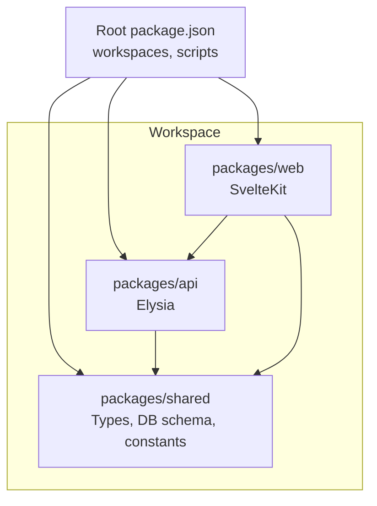
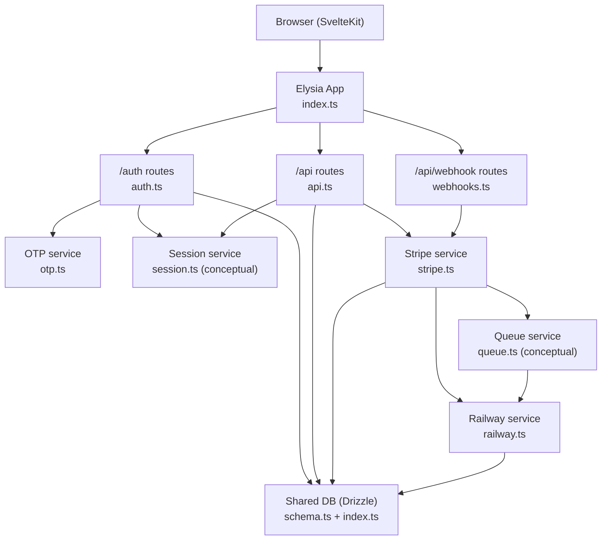
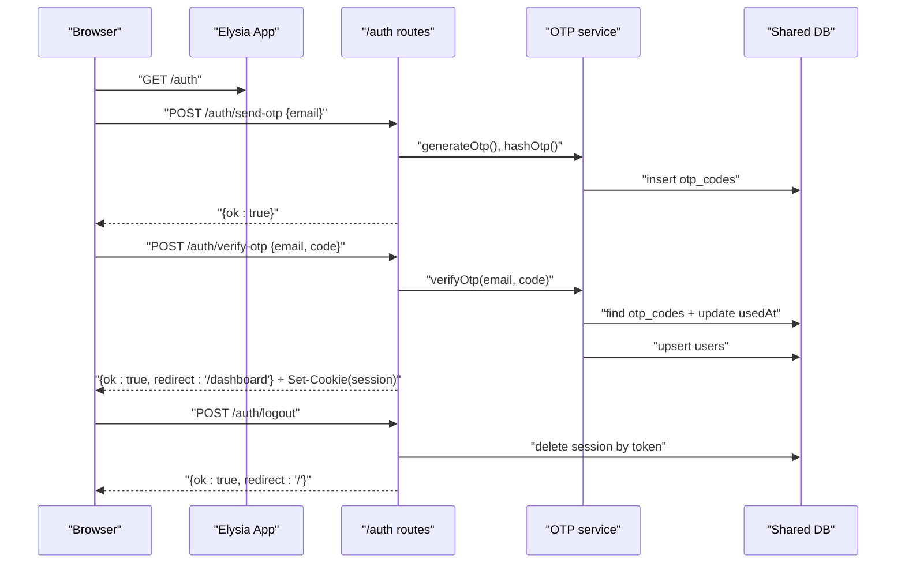
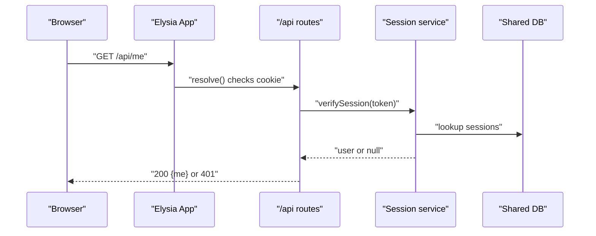
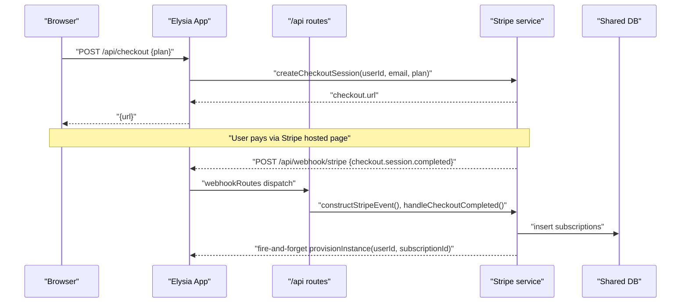
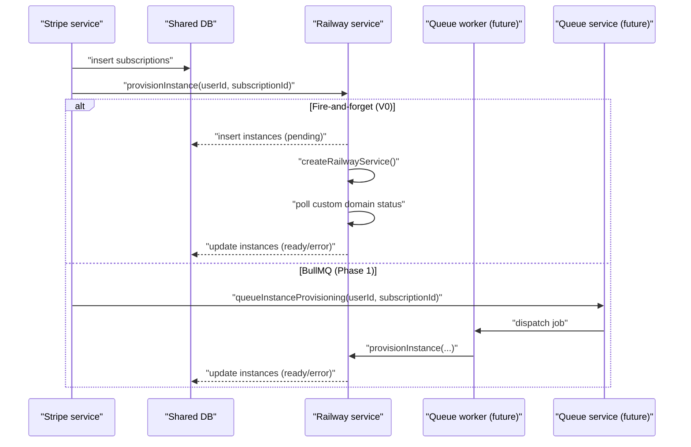
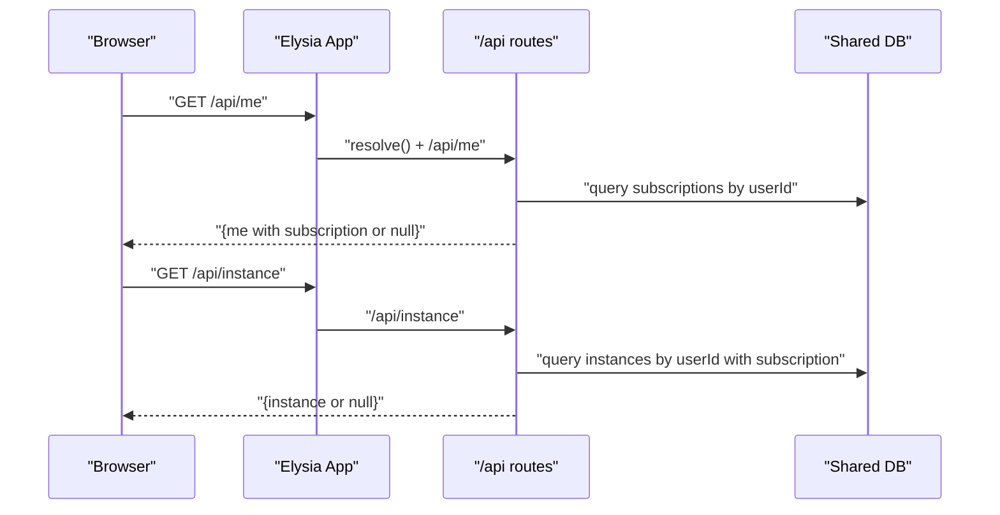
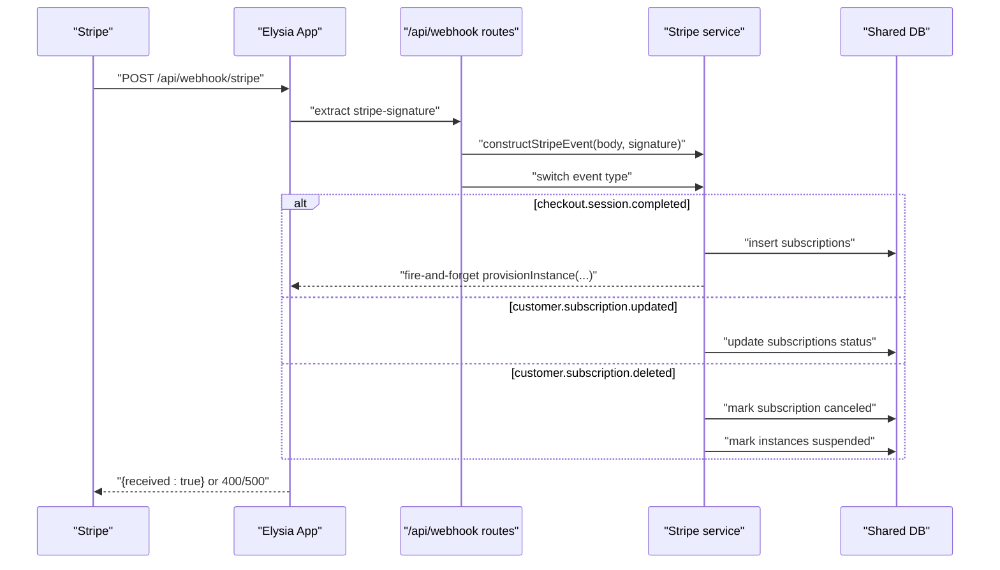
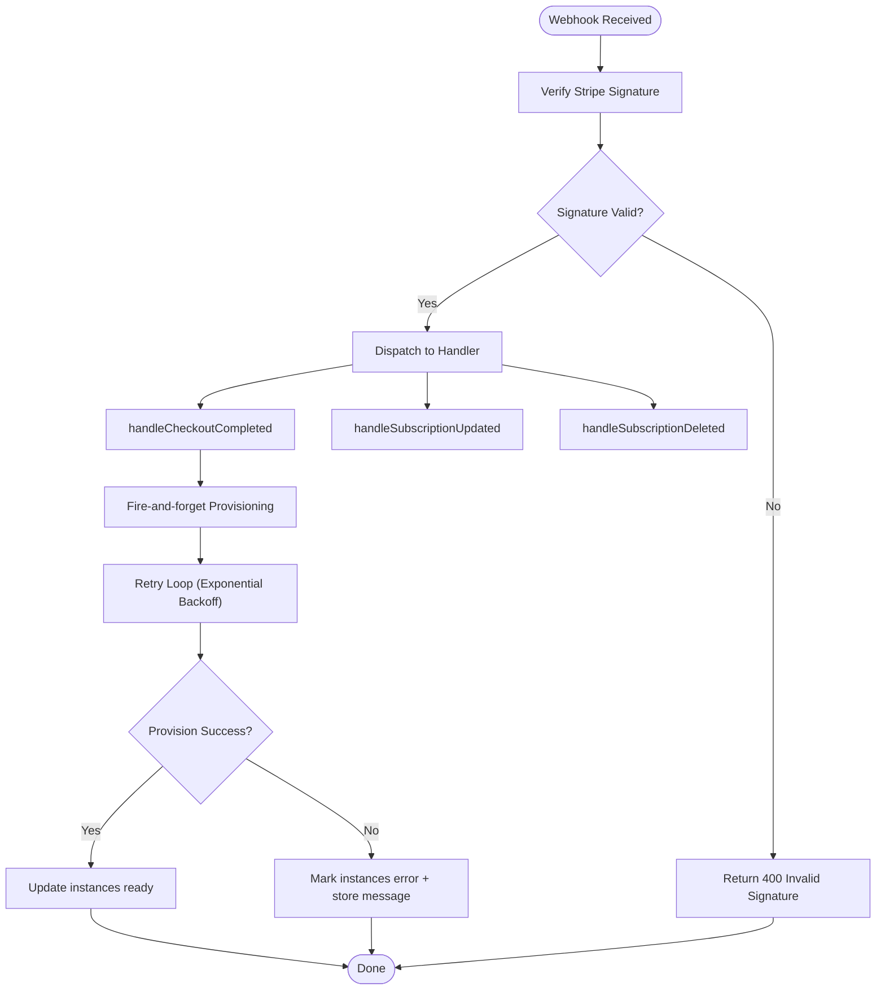
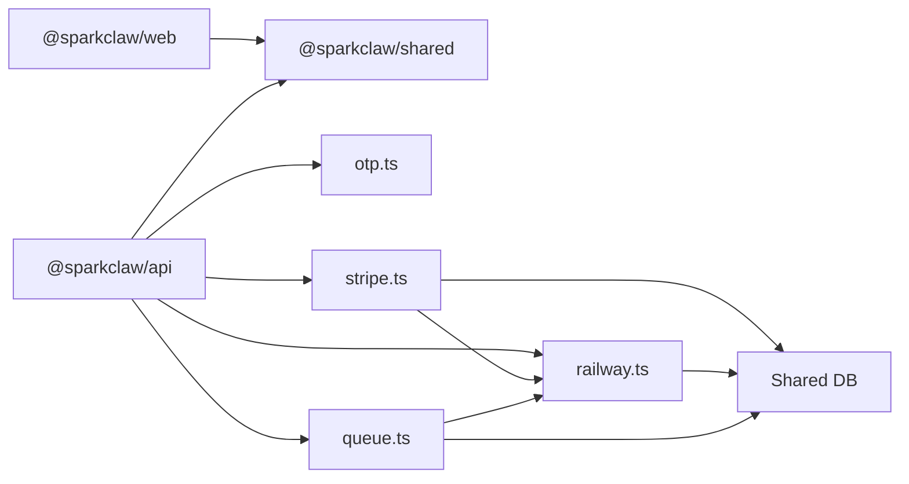

# Component Interactions

<cite>
**Referenced Files in This Document**
- [package.json](file://package.json)
- [PRD.md](file://PRD.md)
- [packages/api/src/index.ts](file://packages/api/src/index.ts)
- [packages/api/src/routes/auth.ts](file://packages/api/src/routes/auth.ts)
- [packages/api/src/routes/api.ts](file://packages/api/src/routes/api.ts)
- [packages/api/src/routes/webhooks.ts](file://packages/api/src/routes/webhooks.ts)
- [packages/api/src/services/otp.ts](file://packages/api/src/services/otp.ts)
- [packages/api/src/services/stripe.ts](file://packages/api/src/services/stripe.ts)
- [packages/api/src/services/railway.ts](file://packages/api/src/services/railway.ts)
- [packages/api/src/services/queue.ts](file://packages/api/src/services/queue.ts)
- [packages/api/src/middleware/csrf.ts](file://packages/api/src/middleware/csrf.ts)
- [packages/shared/src/types.ts](file://packages/shared/src/types.ts)
</cite>

## Table of Contents
1. [Introduction](#introduction)
2. [Project Structure](#project-structure)
3. [Core Components](#core-components)
4. [Architecture Overview](#architecture-overview)
5. [Detailed Component Analysis](#detailed-component-analysis)
6. [Dependency Analysis](#dependency-analysis)
7. [Performance Considerations](#performance-considerations)
8. [Troubleshooting Guide](#troubleshooting-guide)
9. [Conclusion](#conclusion)

## Introduction
This document explains how SparkClaw’s components interact to deliver a seamless user experience from authentication through subscription management and instance provisioning. It documents request/response patterns between the web and API packages, the event-driven background job architecture for provisioning, and error propagation/retry strategies. Sequence diagrams illustrate typical workflows: new user registration, returning user login, and instance management.

## Project Structure
SparkClaw is a Bun workspace monorepo with three packages:
- packages/web: SvelteKit frontend (landing, pricing, auth UI, dashboard)
- packages/api: Elysia backend (routes, services, middleware)
- packages/shared: Shared types, schemas, database schema, and constants

**Diagram sources**
- [package.json](file://package.json#L1-L23)
- [packages/api/src/index.ts](file://packages/api/src/index.ts#L1-L25)

**Section sources**
- [package.json](file://package.json#L1-L23)

## Core Components
- API entrypoint initializes CORS, registers routes, and listens on the configured port.
- Authentication routes implement OTP send/verify and logout with rate limiting and CSRF protection.
- Protected API routes require session verification and expose user info and instance details.
- Stripe webhook routes validate signatures and dispatch to handlers for checkout completion and subscription updates.
- Services encapsulate OTP generation/hashing, session creation/deletion, Stripe checkout creation and webhook handling, and Railway provisioning.
- Middleware enforces CSRF on non-webhook endpoints.
- Shared types define API response shapes and domain enums.

**Section sources**
- [packages/api/src/index.ts](file://packages/api/src/index.ts#L1-L25)
- [packages/api/src/routes/auth.ts](file://packages/api/src/routes/auth.ts#L1-L80)
- [packages/api/src/routes/api.ts](file://packages/api/src/routes/api.ts#L1-L86)
- [packages/api/src/routes/webhooks.ts](file://packages/api/src/routes/webhooks.ts#L1-L49)
- [packages/api/src/middleware/csrf.ts](file://packages/api/src/middleware/csrf.ts#L1-L16)
- [packages/shared/src/types.ts](file://packages/shared/src/types.ts#L1-L55)

## Architecture Overview
The system follows a request-response pattern between the web and API packages, with event-driven background jobs handling long-running provisioning tasks. Stripe webhooks trigger asynchronous provisioning via either a fire-and-forget approach or a BullMQ queue (planned upgrade path).

**Diagram sources**
- [packages/api/src/index.ts](file://packages/api/src/index.ts#L1-L25)
- [packages/api/src/routes/auth.ts](file://packages/api/src/routes/auth.ts#L1-L80)
- [packages/api/src/routes/api.ts](file://packages/api/src/routes/api.ts#L1-L86)
- [packages/api/src/routes/webhooks.ts](file://packages/api/src/routes/webhooks.ts#L1-L49)
- [packages/api/src/services/otp.ts](file://packages/api/src/services/otp.ts#L1-L59)
- [packages/api/src/services/stripe.ts](file://packages/api/src/services/stripe.ts#L1-L107)
- [packages/api/src/services/railway.ts](file://packages/api/src/services/railway.ts#L1-L291)
- [packages/api/src/services/queue.ts](file://packages/api/src/services/queue.ts#L1-L101)

## Detailed Component Analysis

### Authentication Flow (Email OTP)
This flow covers new and returning users who authenticate via email OTP. It includes rate limiting, OTP hashing/storage, session creation, and logout.

**Diagram sources**
- [packages/api/src/routes/auth.ts](file://packages/api/src/routes/auth.ts#L1-L80)
- [packages/api/src/services/otp.ts](file://packages/api/src/services/otp.ts#L1-L59)
- [packages/shared/src/types.ts](file://packages/shared/src/types.ts#L1-L55)

**Section sources**
- [packages/api/src/routes/auth.ts](file://packages/api/src/routes/auth.ts#L1-L80)
- [packages/api/src/services/otp.ts](file://packages/api/src/services/otp.ts#L1-L59)
- [PRD.md](file://PRD.md#L85-L99)

### Protected API Access and Session Guard
Protected endpoints require a valid session cookie. The resolver verifies the session and attaches the user to the context, returning 401 otherwise.

**Diagram sources**
- [packages/api/src/routes/api.ts](file://packages/api/src/routes/api.ts#L1-L86)

**Section sources**
- [packages/api/src/routes/api.ts](file://packages/api/src/routes/api.ts#L11-L33)

### Subscription Management and Checkout
Authenticated users can create a Stripe Checkout session. After payment, Stripe redirects back and sends a webhook to update subscription state and trigger provisioning.

**Diagram sources**
- [packages/api/src/routes/api.ts](file://packages/api/src/routes/api.ts#L76-L85)
- [packages/api/src/routes/webhooks.ts](file://packages/api/src/routes/webhooks.ts#L1-L49)
- [packages/api/src/services/stripe.ts](file://packages/api/src/services/stripe.ts#L28-L72)

**Section sources**
- [packages/api/src/routes/api.ts](file://packages/api/src/routes/api.ts#L76-L85)
- [packages/api/src/routes/webhooks.ts](file://packages/api/src/routes/webhooks.ts#L1-L49)
- [packages/api/src/services/stripe.ts](file://packages/api/src/services/stripe.ts#L28-L72)
- [PRD.md](file://PRD.md#L100-L130)

### Instance Provisioning (Railway)
After a successful checkout, the system creates a subscription and triggers provisioning. The current implementation uses a fire-and-forget approach; a future upgrade will use BullMQ for reliable background jobs.

**Diagram sources**
- [packages/api/src/services/stripe.ts](file://packages/api/src/services/stripe.ts#L68-L72)
- [packages/api/src/services/railway.ts](file://packages/api/src/services/railway.ts#L177-L291)
- [packages/api/src/services/queue.ts](file://packages/api/src/services/queue.ts#L1-L101)

**Section sources**
- [packages/api/src/services/railway.ts](file://packages/api/src/services/railway.ts#L177-L291)
- [packages/api/src/services/queue.ts](file://packages/api/src/services/queue.ts#L1-L101)
- [PRD.md](file://PRD.md#L131-L167)

### Dashboard Data Retrieval
The dashboard requires subscription and instance details. The API joins subscription and instance data to present plan, status, and URL.

**Diagram sources**
- [packages/api/src/routes/api.ts](file://packages/api/src/routes/api.ts#L34-L75)
- [packages/shared/src/types.ts](file://packages/shared/src/types.ts#L35-L55)

**Section sources**
- [packages/api/src/routes/api.ts](file://packages/api/src/routes/api.ts#L34-L75)
- [packages/shared/src/types.ts](file://packages/shared/src/types.ts#L35-L55)

### Webhook Processing and Subscription Updates
Stripe webhooks are validated and dispatched to handlers. The system handles checkout completion, subscription updates, and deletion.

**Diagram sources**
- [packages/api/src/routes/webhooks.ts](file://packages/api/src/routes/webhooks.ts#L1-L49)
- [packages/api/src/services/stripe.ts](file://packages/api/src/services/stripe.ts#L45-L106)

**Section sources**
- [packages/api/src/routes/webhooks.ts](file://packages/api/src/routes/webhooks.ts#L1-L49)
- [packages/api/src/services/stripe.ts](file://packages/api/src/services/stripe.ts#L45-L106)
- [PRD.md](file://PRD.md#L118-L130)

### Error Propagation and Retry Mechanisms
- OTP and verify rate limits prevent abuse and return 429.
- Session guard returns 401 for missing/expired tokens.
- Stripe webhook handler validates signatures; invalid signature returns 400; processing failures return 500.
- Provisioning retries with exponential backoff and marks instance as error on final failure.
- Queue worker supports configurable attempts/backoff (future).

**Diagram sources**
- [packages/api/src/routes/webhooks.ts](file://packages/api/src/routes/webhooks.ts#L6-L48)
- [packages/api/src/services/stripe.ts](file://packages/api/src/services/stripe.ts#L20-L26)
- [packages/api/src/services/railway.ts](file://packages/api/src/services/railway.ts#L198-L289)

**Section sources**
- [packages/api/src/routes/auth.ts](file://packages/api/src/routes/auth.ts#L28-L52)
- [packages/api/src/routes/api.ts](file://packages/api/src/routes/api.ts#L13-L33)
- [packages/api/src/routes/webhooks.ts](file://packages/api/src/routes/webhooks.ts#L8-L44)
- [packages/api/src/services/railway.ts](file://packages/api/src/services/railway.ts#L198-L289)
- [PRD.md](file://PRD.md#L164-L166)

## Dependency Analysis
- packages/web depends on @sparkclaw/shared for types and constants.
- packages/api depends on @sparkclaw/shared for DB schema, types, and constants.
- API routes depend on services for OTP, session, Stripe, and Railway.
- Services depend on shared DB and environment variables.

**Diagram sources**
- [package.json](file://package.json#L1-L23)
- [packages/api/src/services/otp.ts](file://packages/api/src/services/otp.ts#L1-L59)
- [packages/api/src/services/stripe.ts](file://packages/api/src/services/stripe.ts#L1-L107)
- [packages/api/src/services/railway.ts](file://packages/api/src/services/railway.ts#L1-L291)
- [packages/api/src/services/queue.ts](file://packages/api/src/services/queue.ts#L1-L101)

**Section sources**
- [package.json](file://package.json#L1-L23)

## Performance Considerations
- API response targets are defined for reads and writes.
- OTP delivery target is under 30 seconds.
- Instance provisioning target is under 5 minutes.
- Recommendations:
  - Keep database connections pooled and warm.
  - Use CDN for frontend assets.
  - Cache non-sensitive configuration in API.
  - Monitor webhook delivery and retry Stripe events if delayed.

[No sources needed since this section provides general guidance]

## Troubleshooting Guide
Common issues and remedies:
- Authentication failures
  - Verify OTP rate limits and expiration.
  - Confirm session cookie attributes (HttpOnly, Secure, SameSite).
- Protected route errors
  - Ensure valid session cookie is present and unexpired.
- Checkout and webhook issues
  - Validate Stripe signature header presence and correctness.
  - Check webhook secret configuration and idempotency.
- Provisioning failures
  - Review Railway API errors and retry logs.
  - Confirm environment variables and project configuration.
  - Investigate custom domain DNS status polling.

**Section sources**
- [packages/api/src/routes/auth.ts](file://packages/api/src/routes/auth.ts#L28-L52)
- [packages/api/src/routes/api.ts](file://packages/api/src/routes/api.ts#L13-L33)
- [packages/api/src/routes/webhooks.ts](file://packages/api/src/routes/webhooks.ts#L6-L48)
- [packages/api/src/services/railway.ts](file://packages/api/src/services/railway.ts#L198-L289)
- [PRD.md](file://PRD.md#L654-L674)

## Conclusion
SparkClaw’s architecture cleanly separates concerns across web and API packages, with robust authentication, protected endpoints, and Stripe-powered subscription management. Provisioning leverages an event-driven background job system, currently fire-and-forget and planned for a resilient queue-backed approach. The documented flows and diagrams provide a blueprint for extending functionality while maintaining reliability and clear error handling.