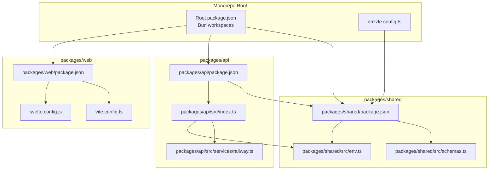
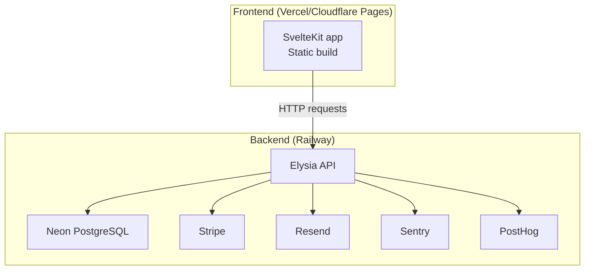
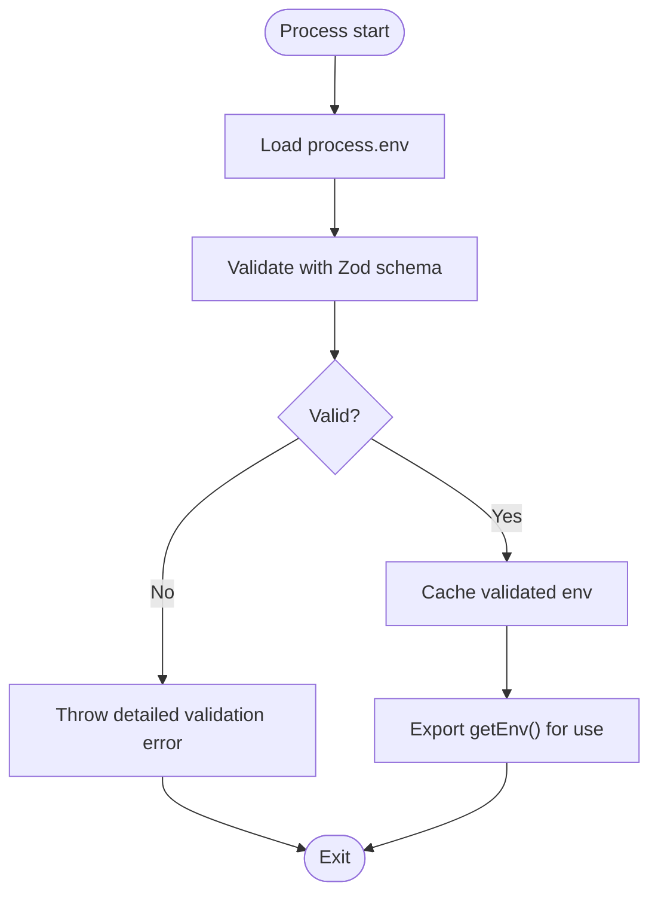
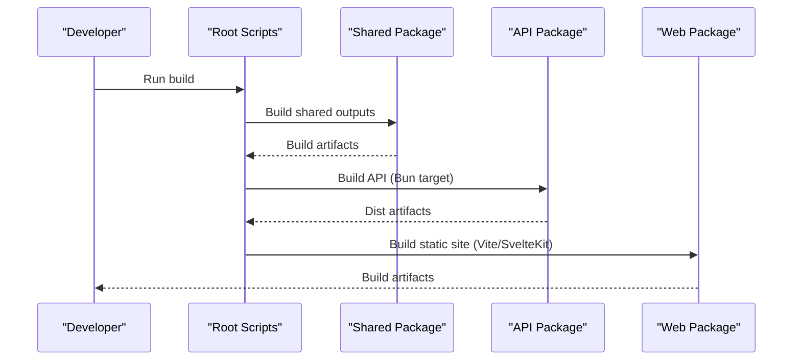
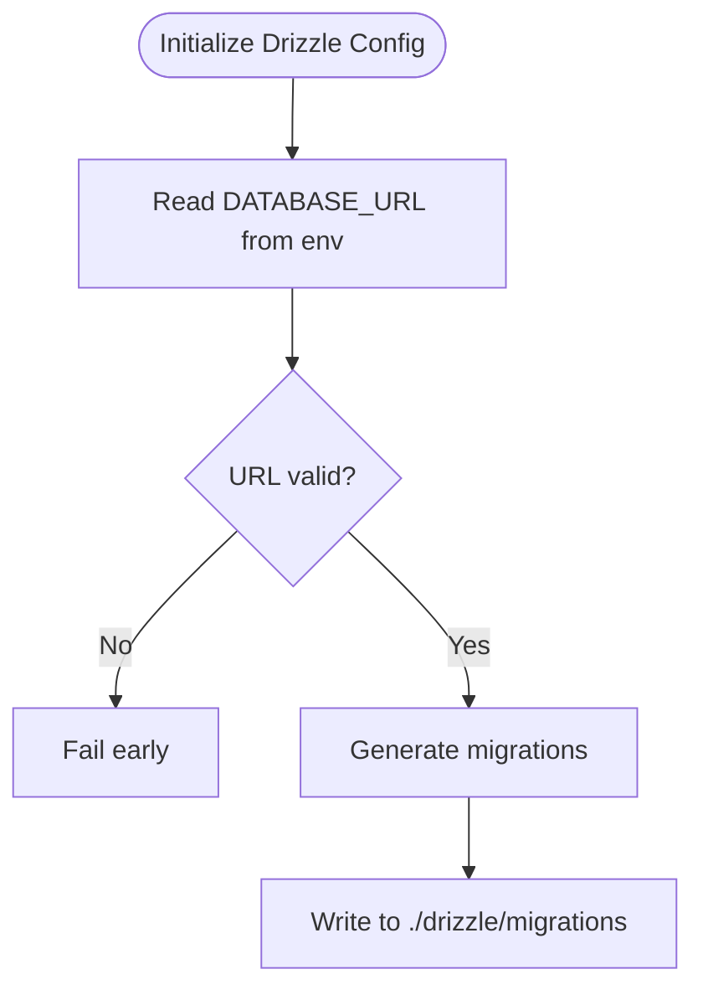
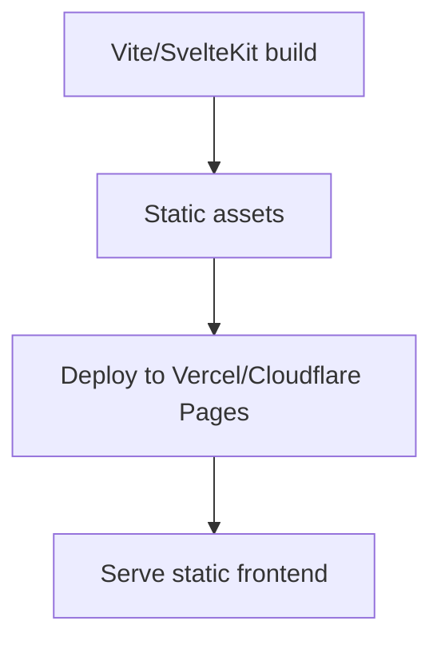
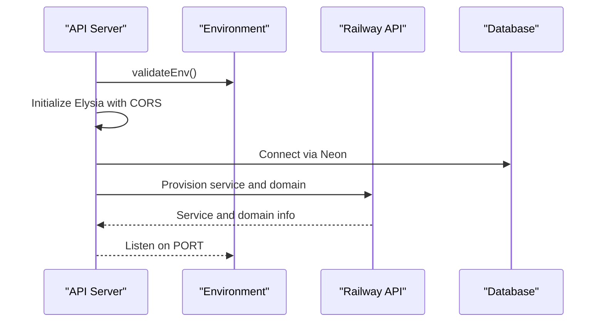
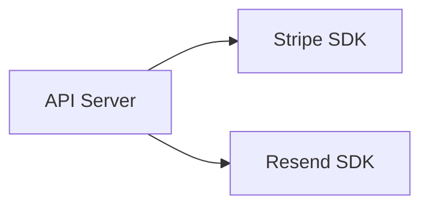
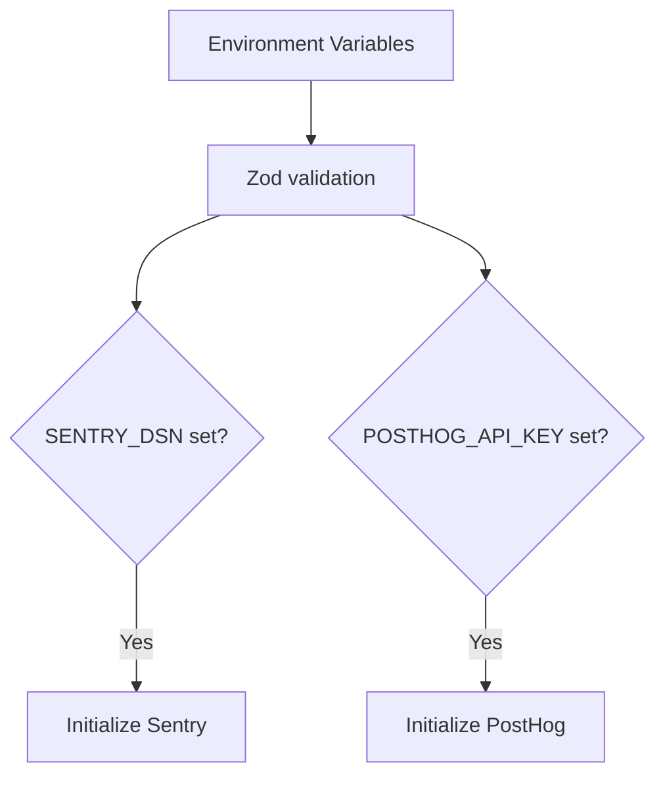
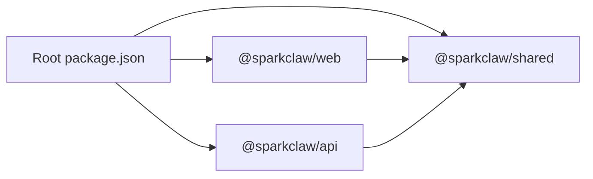

# Deployment Architecture

<cite>
**Referenced Files in This Document**
- [package.json](file://package.json)
- [drizzle.config.ts](file://drizzle.config.ts)
- [packages/api/package.json](file://packages/api/package.json)
- [packages/web/package.json](file://packages/web/package.json)
- [packages/shared/package.json](file://packages/shared/package.json)
- [packages/shared/src/env.ts](file://packages/shared/src/env.ts)
- [packages/shared/src/schemas.ts](file://packages/shared/src/schemas.ts)
- [packages/api/src/index.ts](file://packages/api/src/index.ts)
- [packages/api/src/services/railway.ts](file://packages/api/src/services/railway.ts)
- [packages/web/svelte.config.js](file://packages/web/svelte.config.js)
- [packages/web/vite.config.ts](file://packages/web/vite.config.ts)
</cite>

## Table of Contents
1. [Introduction](#introduction)
2. [Project Structure](#project-structure)
3. [Core Components](#core-components)
4. [Architecture Overview](#architecture-overview)
5. [Detailed Component Analysis](#detailed-component-analysis)
6. [Dependency Analysis](#dependency-analysis)
7. [Performance Considerations](#performance-considerations)
8. [Troubleshooting Guide](#troubleshooting-guide)
9. [Conclusion](#conclusion)
10. [Appendices](#appendices)

## Introduction
This document describes SparkClaw’s multi-environment deployment architecture. It explains how the static frontend is deployed via Vercel/Cloudflare Pages and how the serverless backend runs on Railway. It also documents environment configuration management using Zod validation, infrastructure requirements (Railway compute, Neon PostgreSQL, Stripe, Resend), and operational practices for CI/CD, rollbacks, monitoring (Sentry, PostHog), and the build pipeline using Bun workspaces.

## Project Structure
SparkClaw uses a monorepo organized into three packages:
- packages/web: Static SvelteKit frontend built with Vite and deployed to Vercel/Cloudflare Pages.
- packages/api: Elysia-based serverless API running on Railway with database, payment, and email integrations.
- packages/shared: Shared utilities, Zod environment validation, database schemas, and constants used by both web and API.

**Diagram sources**
- [package.json](file://package.json#L1-L23)
- [drizzle.config.ts](file://drizzle.config.ts#L1-L13)
- [packages/web/package.json](file://packages/web/package.json#L1-L29)
- [packages/web/svelte.config.js](file://packages/web/svelte.config.js#L1-L14)
- [packages/web/vite.config.ts](file://packages/web/vite.config.ts#L1-L8)
- [packages/api/package.json](file://packages/api/package.json#L1-L27)
- [packages/api/src/index.ts](file://packages/api/src/index.ts#L1-L25)
- [packages/api/src/services/railway.ts](file://packages/api/src/services/railway.ts#L1-L291)
- [packages/shared/package.json](file://packages/shared/package.json#L1-L24)
- [packages/shared/src/env.ts](file://packages/shared/src/env.ts#L1-L45)
- [packages/shared/src/schemas.ts](file://packages/shared/src/schemas.ts#L1-L26)

**Section sources**
- [package.json](file://package.json#L1-L23)
- [drizzle.config.ts](file://drizzle.config.ts#L1-L13)
- [packages/web/package.json](file://packages/web/package.json#L1-L29)
- [packages/api/package.json](file://packages/api/package.json#L1-L27)
- [packages/shared/package.json](file://packages/shared/package.json#L1-L24)

## Core Components
- Environment validation and configuration:
  - Zod-based schema enforces required environment variables and defaults for safe runtime configuration.
  - Centralized validation and retrieval functions ensure all services consume validated settings.
- Build and workspace orchestration:
  - Root scripts coordinate building shared, API, and web packages using Bun workspaces.
- Database and migrations:
  - Drizzle ORM with a configuration that reads DATABASE_URL from environment variables.
- Frontend deployment:
  - SvelteKit/Vite build produces a static site suitable for Vercel/Cloudflare Pages.
- Backend deployment:
  - Elysia server listens on a port configured via environment variables and is intended for Railway serverless execution.
- Provisioning and domains:
  - Railway service creation and custom domain management are handled programmatically with retry and polling logic.

**Section sources**
- [packages/shared/src/env.ts](file://packages/shared/src/env.ts#L1-L45)
- [package.json](file://package.json#L5-L16)
- [drizzle.config.ts](file://drizzle.config.ts#L7-L9)
- [packages/web/package.json](file://packages/web/package.json#L6-L13)
- [packages/api/src/index.ts](file://packages/api/src/index.ts#L9-L20)
- [packages/api/src/services/railway.ts](file://packages/api/src/services/railway.ts#L177-L291)

## Architecture Overview
The deployment architecture separates concerns across environments:
- Static frontend (Vercel/Cloudflare Pages): Builds and serves the SvelteKit app statically.
- Serverless backend (Railway): Hosts the Elysia API with database, payment, and email integrations.
- Infrastructure services: Neon PostgreSQL, Stripe, Resend, Sentry, and PostHog.

**Diagram sources**
- [packages/web/package.json](file://packages/web/package.json#L6-L13)
- [packages/api/package.json](file://packages/api/package.json#L11-L21)
- [packages/api/src/index.ts](file://packages/api/src/index.ts#L1-L25)
- [drizzle.config.ts](file://drizzle.config.ts#L7-L9)

## Detailed Component Analysis

### Environment Configuration Management
- Schema-driven validation ensures required variables are present and properly formatted.
- Defaults are provided for non-critical variables, while sensitive keys enforce prefixes and formats.
- Centralized getters prevent accidental use of unvalidated environment values.

**Diagram sources**
- [packages/shared/src/env.ts](file://packages/shared/src/env.ts#L28-L44)

**Section sources**
- [packages/shared/src/env.ts](file://packages/shared/src/env.ts#L1-L45)

### Build Pipeline with Bun Workspaces
- Root scripts orchestrate building shared, API, and web packages in the correct order.
- Web uses Vite/SvelteKit; API builds with Bun target; shared builds TypeScript outputs consumed by others.

**Diagram sources**
- [package.json](file://package.json#L8-L8)
- [packages/web/package.json](file://packages/web/package.json#L6-L13)
- [packages/api/package.json](file://packages/api/package.json#L7-L10)
- [packages/shared/package.json](file://packages/shared/package.json#L6-L13)

**Section sources**
- [package.json](file://package.json#L5-L16)
- [packages/web/package.json](file://packages/web/package.json#L6-L13)
- [packages/api/package.json](file://packages/api/package.json#L7-L10)
- [packages/shared/package.json](file://packages/shared/package.json#L6-L13)

### Database and Migrations
- Drizzle configuration reads DATABASE_URL from environment variables and generates migrations to the migrations directory.
- Neon PostgreSQL is used as the serverless database driver.

**Diagram sources**
- [drizzle.config.ts](file://drizzle.config.ts#L3-L12)
- [packages/shared/package.json](file://packages/shared/package.json#L16-L16)

**Section sources**
- [drizzle.config.ts](file://drizzle.config.ts#L1-L13)
- [packages/shared/package.json](file://packages/shared/package.json#L14-L18)

### Frontend Deployment (Vercel/Cloudflare Pages)
- SvelteKit adapter is auto-detected; production deployments should align with adapter capabilities.
- Build artifacts are produced via Vite and served statically by Vercel/Cloudflare Pages.

**Diagram sources**
- [packages/web/svelte.config.js](file://packages/web/svelte.config.js#L1-L14)
- [packages/web/vite.config.ts](file://packages/web/vite.config.ts#L1-L8)
- [packages/web/package.json](file://packages/web/package.json#L6-L13)

**Section sources**
- [packages/web/svelte.config.js](file://packages/web/svelte.config.js#L1-L14)
- [packages/web/vite.config.ts](file://packages/web/vite.config.ts#L1-L8)
- [packages/web/package.json](file://packages/web/package.json#L6-L13)

### Backend Deployment (Railway)
- Elysia server initializes with CORS configured from environment variables and listens on a configurable port.
- Railway integration provisions services and custom domains, with retry and polling logic.

**Diagram sources**
- [packages/api/src/index.ts](file://packages/api/src/index.ts#L9-L20)
- [packages/shared/src/env.ts](file://packages/shared/src/env.ts#L14-L16)
- [packages/api/src/services/railway.ts](file://packages/api/src/services/railway.ts#L177-L291)

**Section sources**
- [packages/api/src/index.ts](file://packages/api/src/index.ts#L1-L25)
- [packages/api/src/services/railway.ts](file://packages/api/src/services/railway.ts#L1-L291)
- [packages/shared/src/env.ts](file://packages/shared/src/env.ts#L1-L45)

### Payment and Email Integrations
- Stripe integration is declared in dependencies; checkout and webhook routes are defined in the API.
- Resend integration is declared in dependencies; email sending utilities are available in the API.

**Diagram sources**
- [packages/api/package.json](file://packages/api/package.json#L14-L16)
- [packages/api/src/routes/webhooks.ts](file://packages/api/src/routes/webhooks.ts#L1-L50)
- [packages/api/src/services/stripe.ts](file://packages/api/src/services/stripe.ts#L1-L50)

**Section sources**
- [packages/api/package.json](file://packages/api/package.json#L1-L27)

### Monitoring Setup (Sentry, PostHog)
- Optional DSNs and API keys are supported in environment validation for Sentry and PostHog.
- These can be wired into the API and/or frontend at initialization time.

**Diagram sources**
- [packages/shared/src/env.ts](file://packages/shared/src/env.ts#L17-L18)

**Section sources**
- [packages/shared/src/env.ts](file://packages/shared/src/env.ts#L1-L45)

## Dependency Analysis
- packages/web depends on @sparkclaw/shared for shared types and constants.
- packages/api depends on @sparkclaw/shared and integrates database, payment, and email libraries.
- Root package.json coordinates workspace builds and development tasks.

**Diagram sources**
- [package.json](file://package.json#L4-L4)
- [packages/web/package.json](file://packages/web/package.json#L26-L26)
- [packages/api/package.json](file://packages/api/package.json#L18-L18)
- [packages/shared/package.json](file://packages/shared/package.json#L6-L13)

**Section sources**
- [package.json](file://package.json#L1-L23)
- [packages/web/package.json](file://packages/web/package.json#L1-L29)
- [packages/api/package.json](file://packages/api/package.json#L1-L27)
- [packages/shared/package.json](file://packages/shared/package.json#L1-L24)

## Performance Considerations
- Prefer static asset delivery via Vercel/Cloudflare Pages for optimal CDN performance.
- Keep API cold-start times low by minimizing initialization work and deferring heavy operations.
- Use environment-driven defaults to avoid unnecessary runtime checks.
- Ensure database connections leverage connection pooling and reuse where applicable.

## Troubleshooting Guide
Common environment validation failures:
- Missing or malformed environment variables cause immediate startup errors with a consolidated list of issues.
- Verify DATABASE_URL format, Stripe secret/webhook keys, Resend API key, session secret length, and domain-related settings.

Railway provisioning issues:
- Provisioning attempts are retried with exponential backoff; timeouts or persistent errors update instance records with error messages.
- Monitor DNS verification status and custom domain readiness.

Build and workspace issues:
- Confirm Bun workspaces are initialized and scripts execute in the correct order.
- Validate Vite/SvelteKit build completes without missing adapters or plugins.

**Section sources**
- [packages/shared/src/env.ts](file://packages/shared/src/env.ts#L30-L39)
- [packages/api/src/services/railway.ts](file://packages/api/src/services/railway.ts#L266-L290)
- [package.json](file://package.json#L5-L16)

## Conclusion
SparkClaw’s deployment architecture cleanly separates the static frontend from the serverless backend, leveraging Vercel/Cloudflare Pages and Railway respectively. Robust environment validation with Zod ensures safe runtime configuration, while Bun workspaces streamline the build pipeline. Infrastructure dependencies (Neon, Stripe, Resend) integrate with the API, and optional monitoring (Sentry, PostHog) can be enabled via environment variables. The Railway provisioning module automates service and domain lifecycle management, supporting scalable multi-tenant deployments.

## Appendices

### Infrastructure Requirements
- Compute: Railway serverless platform for API execution.
- Database: Neon PostgreSQL for relational storage.
- Payments: Stripe for checkout and webhooks.
- Email: Resend for transactional emails.
- Monitoring: Sentry DSN and PostHog API key (optional).

**Section sources**
- [packages/api/package.json](file://packages/api/package.json#L11-L21)
- [packages/shared/src/env.ts](file://packages/shared/src/env.ts#L4-L22)

### CI/CD and Rollback Strategies
- Build and test:
  - Use root scripts to build shared, API, and web packages.
  - Run type checking and tests before deployment.
- Deployments:
  - Frontend: Build and deploy static assets to Vercel/Cloudflare Pages.
  - Backend: Package and deploy the API to Railway; configure environment variables per environment.
- Rollbacks:
  - Pin artifact versions in CI and tag releases.
  - Promote previous working versions to production if current deployment fails.
  - For Railway, redeploy previous commit or image tag; for Vercel/Cloudflare Pages, revert to a known-good deployment.

[No sources needed since this section provides general guidance]