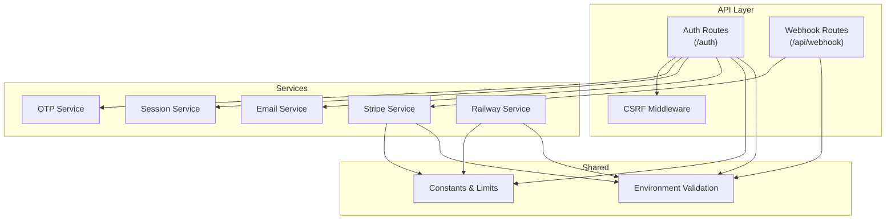
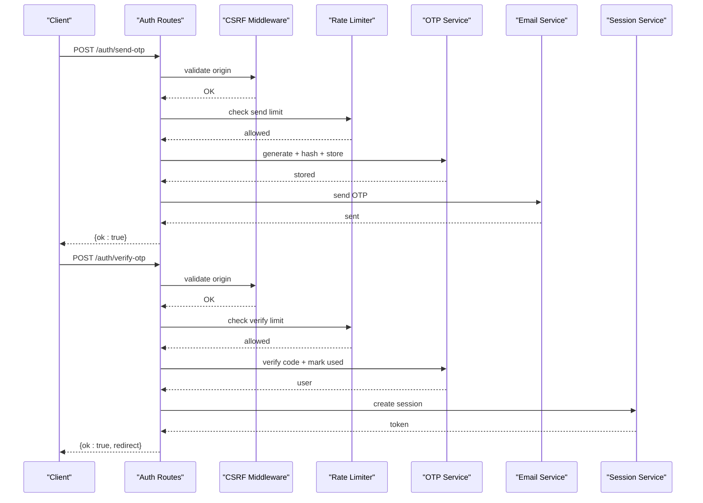
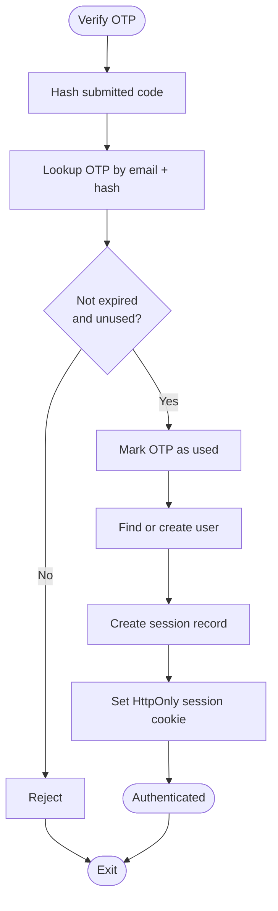
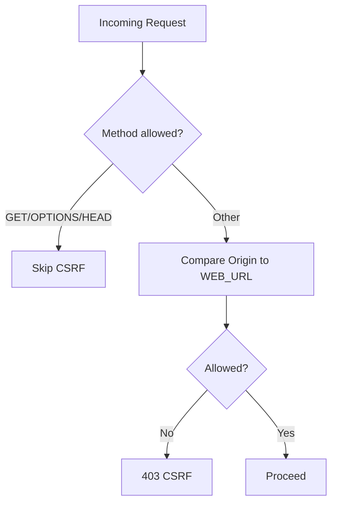
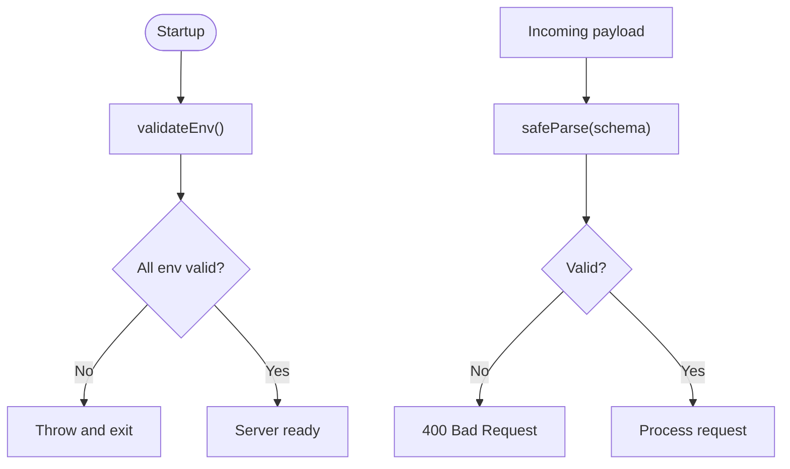
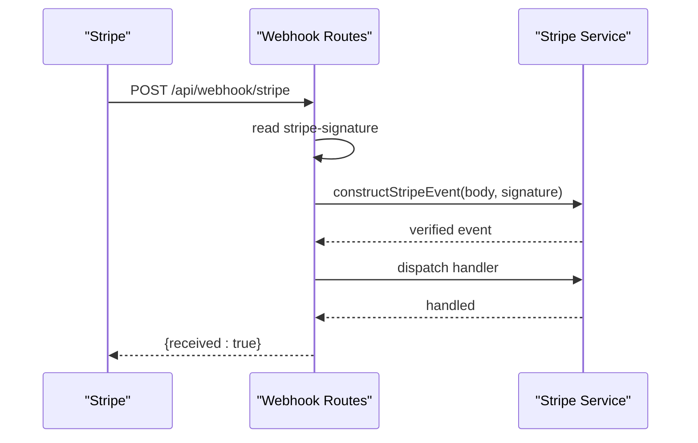
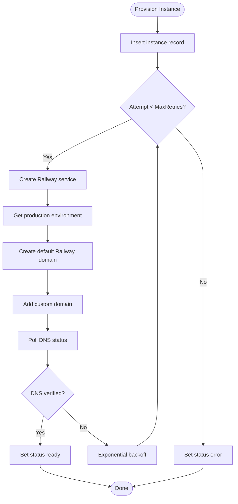
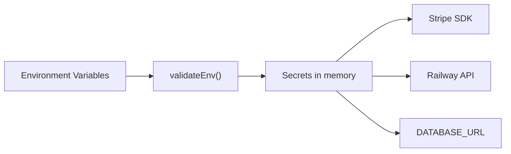
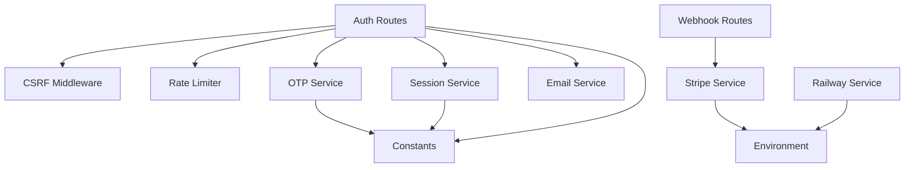

# Security Patterns

<cite>
**Referenced Files in This Document**
- [auth.ts](file://packages/api/src/routes/auth.ts)
- [csrf.ts](file://packages/api/src/middleware/csrf.ts)
- [rate-limiter.ts](file://packages/api/src/lib/rate-limiter.ts)
- [constants.ts](file://packages/shared/src/constants.ts)
- [env.ts](file://packages/shared/src/env.ts)
- [otp.ts](file://packages/api/src/services/otp.ts)
- [session.ts](file://packages/api/src/services/session.ts)
- [email.ts](file://packages/api/src/lib/email.ts)
- [stripe.ts](file://packages/api/src/services/stripe.ts)
- [railway.ts](file://packages/api/src/services/railway.ts)
- [webhooks.ts](file://packages/api/src/routes/webhooks.ts)
- [drizzle.config.ts](file://drizzle.config.ts)
</cite>

## Table of Contents
1. [Introduction](#introduction)
2. [Project Structure](#project-structure)
3. [Core Components](#core-components)
4. [Architecture Overview](#architecture-overview)
5. [Detailed Component Analysis](#detailed-component-analysis)
6. [Dependency Analysis](#dependency-analysis)
7. [Performance Considerations](#performance-considerations)
8. [Troubleshooting Guide](#troubleshooting-guide)
9. [Conclusion](#conclusion)
10. [Appendices](#appendices)

## Introduction
This document presents SparkClaw’s security patterns and implementation. It covers authentication with time-bound OTPs, rate limiting, secure session management, CSRF protection, CORS alignment, input validation, and external integration safeguards (Stripe webhooks and Railway API). It also documents environment-driven secret management, audit logging, and operational best practices for email delivery, payment processing, and instance provisioning.

## Project Structure
Security-relevant modules are organized by responsibility:
- Authentication and session management live under the API routes and services.
- External integrations (payment and infrastructure) are encapsulated in dedicated services.
- Shared constants and environment validation enforce consistent security defaults and secret handling.
- Webhook routing isolates third-party event ingestion and validates signatures.

**Diagram sources**
- [auth.ts](file://packages/api/src/routes/auth.ts#L1-L80)
- [csrf.ts](file://packages/api/src/middleware/csrf.ts#L1-L16)
- [otp.ts](file://packages/api/src/services/otp.ts#L1-L59)
- [session.ts](file://packages/api/src/services/session.ts#L1-L43)
- [email.ts](file://packages/api/src/lib/email.ts#L1-L34)
- [stripe.ts](file://packages/api/src/services/stripe.ts#L1-L107)
- [railway.ts](file://packages/api/src/services/railway.ts#L1-L291)
- [webhooks.ts](file://packages/api/src/routes/webhooks.ts#L1-L49)
- [constants.ts](file://packages/shared/src/constants.ts#L1-L28)
- [env.ts](file://packages/shared/src/env.ts#L1-L45)

**Section sources**
- [auth.ts](file://packages/api/src/routes/auth.ts#L1-L80)
- [csrf.ts](file://packages/api/src/middleware/csrf.ts#L1-L16)
- [rate-limiter.ts](file://packages/api/src/lib/rate-limiter.ts#L1-L59)
- [constants.ts](file://packages/shared/src/constants.ts#L1-L28)
- [env.ts](file://packages/shared/src/env.ts#L1-L45)
- [otp.ts](file://packages/api/src/services/otp.ts#L1-L59)
- [session.ts](file://packages/api/src/services/session.ts#L1-L43)
- [email.ts](file://packages/api/src/lib/email.ts#L1-L34)
- [stripe.ts](file://packages/api/src/services/stripe.ts#L1-L107)
- [railway.ts](file://packages/api/src/services/railway.ts#L1-L291)
- [webhooks.ts](file://packages/api/src/routes/webhooks.ts#L1-L49)
- [drizzle.config.ts](file://drizzle.config.ts#L1-L13)

## Core Components
- Authentication and OTP:
  - OTP generation, hashing, storage with expiry, and verification with single-use enforcement.
  - Rate limiting for send and verify actions keyed by client IP and email.
- Session Management:
  - Secure, HttpOnly session cookie with configurable expiry and SameSite/Lax.
- CSRF Protection:
  - Origin-based CSRF validation excluding webhook paths.
- External Integrations:
  - Stripe webhook signature verification and event handling.
  - Railway API authentication via bearer token with robust error handling and polling.
- Environment and Secrets:
  - Strict environment validation with Zod, secrets loaded from environment variables.
- Audit Logging:
  - Structured logs for sensitive operations and failures.

**Section sources**
- [auth.ts](file://packages/api/src/routes/auth.ts#L1-L80)
- [csrf.ts](file://packages/api/src/middleware/csrf.ts#L1-L16)
- [rate-limiter.ts](file://packages/api/src/lib/rate-limiter.ts#L1-L59)
- [constants.ts](file://packages/shared/src/constants.ts#L1-L28)
- [env.ts](file://packages/shared/src/env.ts#L1-L45)
- [otp.ts](file://packages/api/src/services/otp.ts#L1-L59)
- [session.ts](file://packages/api/src/services/session.ts#L1-L43)
- [email.ts](file://packages/api/src/lib/email.ts#L1-L34)
- [stripe.ts](file://packages/api/src/services/stripe.ts#L1-L107)
- [railway.ts](file://packages/api/src/services/railway.ts#L1-L291)
- [webhooks.ts](file://packages/api/src/routes/webhooks.ts#L1-L49)

## Architecture Overview
The security architecture centers on layered controls: input validation, rate limiting, cryptographic OTP handling, secure session cookies, CSRF origin checks, and verified external webhooks.

**Diagram sources**
- [auth.ts](file://packages/api/src/routes/auth.ts#L19-L71)
- [csrf.ts](file://packages/api/src/middleware/csrf.ts#L3-L15)
- [rate-limiter.ts](file://packages/api/src/lib/rate-limiter.ts#L17-L34)
- [otp.ts](file://packages/api/src/services/otp.ts#L19-L58)
- [email.ts](file://packages/api/src/lib/email.ts#L13-L33)
- [session.ts](file://packages/api/src/services/session.ts#L13-L21)

## Detailed Component Analysis

### Authentication Security Model
- OTP lifecycle:
  - Generation produces a 6-digit numeric code.
  - SHA-256 hashing is used for storage; verification compares hashed values and enforces expiry and single-use.
  - Expiry is enforced server-side and prevents replay.
- Rate limiting:
  - Separate limits for send and verify actions, keyed by client IP and email.
  - Windows and thresholds configured centrally.
- Session management:
  - Secure cookie with HttpOnly, SameSite=Lax, and production-aware Secure flag.
  - Token generated cryptographically and stored with expiry.
- Logout:
  - Server-side session deletion and client cookie removal.

**Diagram sources**
- [otp.ts](file://packages/api/src/services/otp.ts#L27-L58)
- [session.ts](file://packages/api/src/services/session.ts#L13-L21)
- [auth.ts](file://packages/api/src/routes/auth.ts#L41-L71)

**Section sources**
- [auth.ts](file://packages/api/src/routes/auth.ts#L19-L71)
- [otp.ts](file://packages/api/src/services/otp.ts#L6-L58)
- [session.ts](file://packages/api/src/services/session.ts#L13-L42)
- [rate-limiter.ts](file://packages/api/src/lib/rate-limiter.ts#L17-L34)
- [constants.ts](file://packages/shared/src/constants.ts#L16-L23)

### CSRF Protection and CORS Alignment
- CSRF:
  - Origin header checked against configured WEB_URL.
  - GET/OPTIONS/HEAD bypass CSRF checks; webhook paths are excluded.
- CORS:
  - Aligns with CSRF origin policy by restricting allowed origin to WEB_URL.

**Diagram sources**
- [csrf.ts](file://packages/api/src/middleware/csrf.ts#L4-L15)

**Section sources**
- [csrf.ts](file://packages/api/src/middleware/csrf.ts#L1-L16)
- [env.ts](file://packages/shared/src/env.ts#L14-L14)

### Input Validation Strategies
- Zod-based environment validation at startup ensures required secrets and URLs are present and conform to expected formats.
- Route-level parsing with schema-based validation rejects malformed payloads before downstream processing.

**Diagram sources**
- [env.ts](file://packages/shared/src/env.ts#L28-L44)
- [auth.ts](file://packages/api/src/routes/auth.ts#L22-L26)

**Section sources**
- [env.ts](file://packages/shared/src/env.ts#L1-L45)
- [auth.ts](file://packages/api/src/routes/auth.ts#L22-L26)

### External Service Integrations

#### Stripe Webhook Signature Verification
- Signature verification uses the official library with the configured webhook secret.
- Event routing handles checkout completion, subscription updates, and cancellations.
- Robust error logging for invalid signatures and processing failures.

**Diagram sources**
- [webhooks.ts](file://packages/api/src/routes/webhooks.ts#L5-L48)
- [stripe.ts](file://packages/api/src/services/stripe.ts#L20-L26)
- [stripe.ts](file://packages/api/src/services/stripe.ts#L45-L106)

**Section sources**
- [webhooks.ts](file://packages/api/src/routes/webhooks.ts#L1-L49)
- [stripe.ts](file://packages/api/src/services/stripe.ts#L1-L107)
- [env.ts](file://packages/shared/src/env.ts#L5-L6)

#### Railway API Authentication and Provisioning
- Authentication via Bearer token from environment variable.
- Idempotent provisioning with exponential backoff and retry limits.
- Custom domain generation and DNS readiness polling with status updates.

**Diagram sources**
- [railway.ts](file://packages/api/src/services/railway.ts#L177-L290)

**Section sources**
- [railway.ts](file://packages/api/src/services/railway.ts#L13-L34)
- [railway.ts](file://packages/api/src/services/railway.ts#L177-L290)
- [constants.ts](file://packages/shared/src/constants.ts#L25-L28)
- [env.ts](file://packages/shared/src/env.ts#L10-L11)

### Data Encryption and Secret Management
- Secrets are loaded from environment variables and validated at startup.
- Cryptographic randomness is used for OTP hashing and session tokens.
- Database credentials are supplied via environment variable and configured for migrations.

**Diagram sources**
- [env.ts](file://packages/shared/src/env.ts#L28-L44)
- [stripe.ts](file://packages/api/src/services/stripe.ts#L11-L18)
- [railway.ts](file://packages/api/src/services/railway.ts#L13-L21)
- [drizzle.config.ts](file://drizzle.config.ts#L7-L9)

**Section sources**
- [env.ts](file://packages/shared/src/env.ts#L1-L45)
- [otp.ts](file://packages/api/src/services/otp.ts#L11-L17)
- [session.ts](file://packages/api/src/services/session.ts#L6-L11)
- [drizzle.config.ts](file://drizzle.config.ts#L7-L9)

### Audit Logging
- Structured logging for OTP delivery, webhook processing, provisioning attempts, and errors.
- Logs include contextual fields (user IDs, instance IDs, statuses) for traceability.

**Section sources**
- [email.ts](file://packages/api/src/lib/email.ts#L32-L32)
- [webhooks.ts](file://packages/api/src/routes/webhooks.ts#L37-L47)
- [railway.ts](file://packages/api/src/services/railway.ts#L207-L207)
- [railway.ts](file://packages/api/src/services/railway.ts#L236-L236)
- [railway.ts](file://packages/api/src/services/railway.ts#L289-L289)

## Dependency Analysis
- Route-layer dependencies:
  - Auth route depends on CSRF middleware, rate limiter, OTP service, session service, and email service.
  - Webhook route depends on Stripe service for signature verification and event handling.
- Shared dependencies:
  - Constants define limits and expiry windows.
  - Environment validation centralizes secret requirements.
- Infrastructure:
  - Railway service depends on environment variables and performs GraphQL queries.
  - Stripe service depends on environment variables and constructs events.

**Diagram sources**
- [auth.ts](file://packages/api/src/routes/auth.ts#L1-L80)
- [csrf.ts](file://packages/api/src/middleware/csrf.ts#L1-L16)
- [rate-limiter.ts](file://packages/api/src/lib/rate-limiter.ts#L1-L59)
- [otp.ts](file://packages/api/src/services/otp.ts#L1-L59)
- [session.ts](file://packages/api/src/services/session.ts#L1-L43)
- [email.ts](file://packages/api/src/lib/email.ts#L1-L34)
- [webhooks.ts](file://packages/api/src/routes/webhooks.ts#L1-L49)
- [stripe.ts](file://packages/api/src/services/stripe.ts#L1-L107)
- [railway.ts](file://packages/api/src/services/railway.ts#L1-L291)
- [constants.ts](file://packages/shared/src/constants.ts#L1-L28)
- [env.ts](file://packages/shared/src/env.ts#L1-L45)

**Section sources**
- [auth.ts](file://packages/api/src/routes/auth.ts#L1-L80)
- [webhooks.ts](file://packages/api/src/routes/webhooks.ts#L1-L49)
- [env.ts](file://packages/shared/src/env.ts#L1-L45)
- [constants.ts](file://packages/shared/src/constants.ts#L1-L28)

## Performance Considerations
- Rate limiter uses an in-memory Map with periodic cleanup; consider Redis-backed store for horizontal scaling.
- OTP and session operations are lightweight; ensure database connection pooling and indexes on lookup fields.
- Webhook processing is synchronous; consider offloading heavy work to a queue if throughput increases.
- Railway provisioning includes exponential backoff and bounded retries to avoid thundering herd.

[No sources needed since this section provides general guidance]

## Troubleshooting Guide
- Missing or invalid environment variables:
  - Startup throws with a consolidated list of missing/invalid keys.
- CSRF failures:
  - Verify origin matches WEB_URL; ensure frontend and backend share the same origin.
- OTP send/verify rate limits:
  - Check rate limiter keys and windows; confirm client IP resolution.
- Stripe webhook signature errors:
  - Confirm webhook secret and endpoint configuration; inspect logs for “Invalid signature”.
- Railway provisioning timeouts:
  - Review DNS propagation and environment selection; check logs for “Custom domain provisioning timeout”.

**Section sources**
- [env.ts](file://packages/shared/src/env.ts#L30-L36)
- [csrf.ts](file://packages/api/src/middleware/csrf.ts#L11-L14)
- [rate-limiter.ts](file://packages/api/src/lib/rate-limiter.ts#L44-L52)
- [webhooks.ts](file://packages/api/src/routes/webhooks.ts#L18-L21)
- [railway.ts](file://packages/api/src/services/railway.ts#L265-L266)

## Conclusion
SparkClaw’s security model combines cryptographic OTP handling, strict environment validation, rate limiting, CSRF origin checks, secure session cookies, and verified external webhooks. These patterns provide strong defaults while remaining extensible for future enhancements such as centralized rate limiting, structured audit trails, and advanced threat detection.

[No sources needed since this section summarizes without analyzing specific files]

## Appendices

### Best Practices Checklist
- Email delivery:
  - Use a dedicated sender address and include clear action instructions; avoid exposing raw codes in templates.
- Payment processing:
  - Always verify webhook signatures; handle unhandled events defensively; log outcomes for reconciliation.
- Instance provisioning:
  - Enforce retry caps and backoff; monitor DNS readiness; surface errors with context for operators.

[No sources needed since this section provides general guidance]