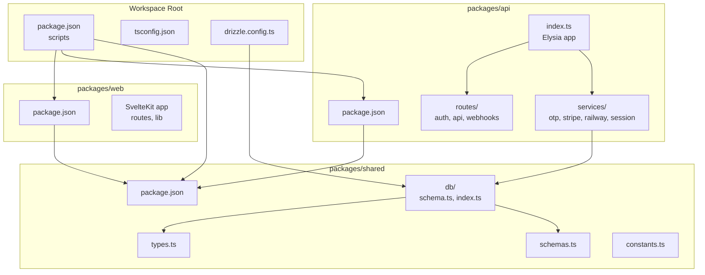
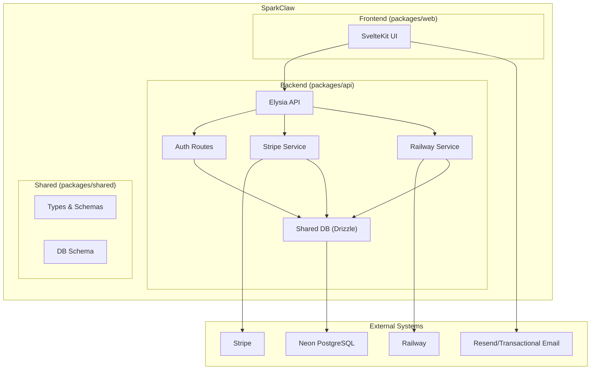
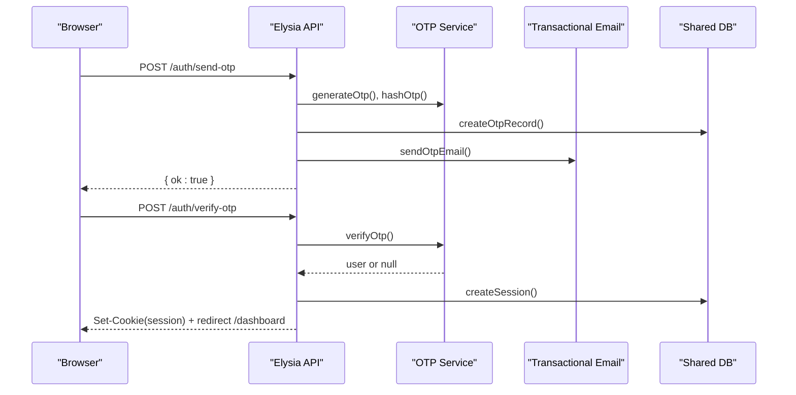
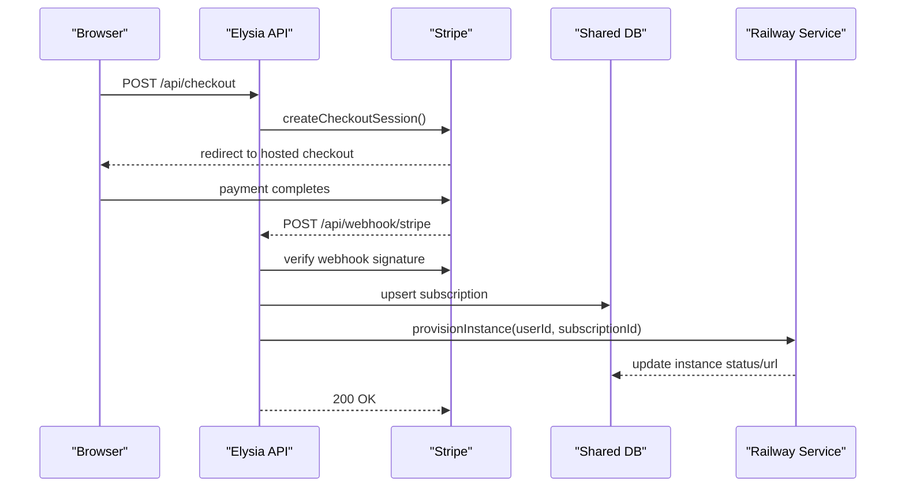
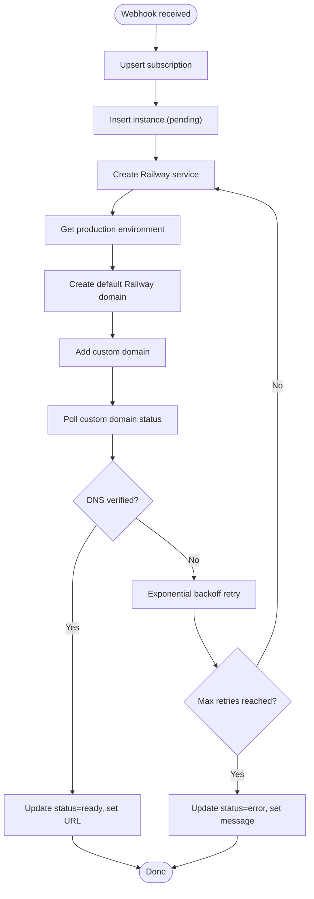
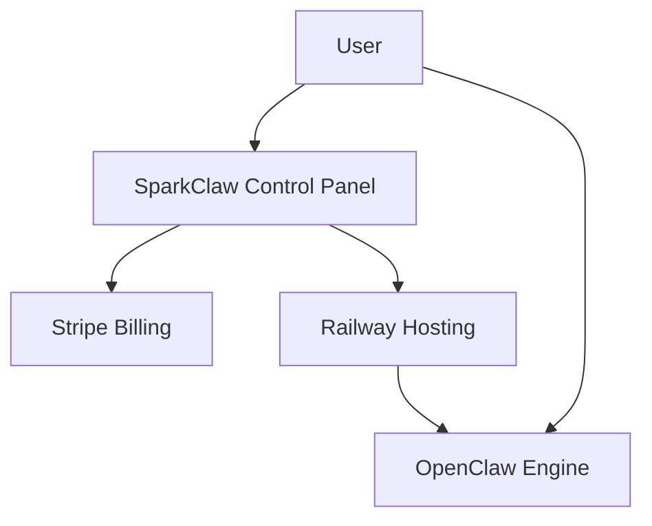
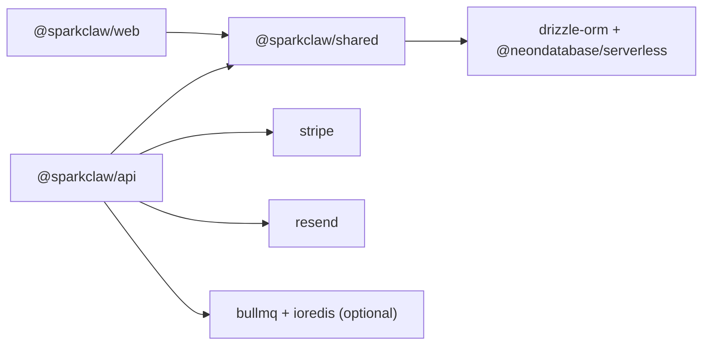

# System Overview

<cite>
**Referenced Files in This Document**
- [package.json](file://package.json)
- [tsconfig.json](file://tsconfig.json)
- [drizzle.config.ts](file://drizzle.config.ts)
- [PRD.md](file://PRD.md)
- [packages/api/package.json](file://packages/api/package.json)
- [packages/web/package.json](file://packages/web/package.json)
- [packages/shared/package.json](file://packages/shared/package.json)
- [packages/api/src/index.ts](file://packages/api/src/index.ts)
- [packages/api/src/routes/auth.ts](file://packages/api/src/routes/auth.ts)
- [packages/api/src/services/stripe.ts](file://packages/api/src/services/stripe.ts)
- [packages/api/src/services/railway.ts](file://packages/api/src/services/railway.ts)
- [packages/shared/src/db/schema.ts](file://packages/shared/src/db/schema.ts)
</cite>

## Table of Contents
1. [Introduction](#introduction)
2. [Project Structure](#project-structure)
3. [Core Components](#core-components)
4. [Architecture Overview](#architecture-overview)
5. [Detailed Component Analysis](#detailed-component-analysis)
6. [Dependency Analysis](#dependency-analysis)
7. [Performance Considerations](#performance-considerations)
8. [Troubleshooting Guide](#troubleshooting-guide)
9. [Conclusion](#conclusion)
10. [Appendices](#appendices)

## Introduction
SparkClaw is a managed hosting solution and control panel for the OpenClaw AI assistant framework. It eliminates DevOps complexity for creators and teams by automating user authentication, Stripe billing, and Railway instance provisioning. The system is designed as a monorepo with three packages: web (SvelteKit frontend), api (Elysia backend), and shared (common types, schemas, and database definitions). The managed hosting approach ensures users can sign up, subscribe, and receive a ready-to-use OpenClaw instance within minutes, without manual infrastructure management.

## Project Structure
SparkClaw uses a Bun workspace monorepo with three primary packages:
- packages/web: SvelteKit-based frontend for landing, authentication, pricing, and dashboard.
- packages/api: Elysia-based backend exposing REST endpoints, authentication, Stripe webhooks, and provisioning logic.
- packages/shared: Shared TypeScript types, Zod schemas, constants, and Drizzle database schema and client exports.

The root workspace scripts orchestrate development and build commands across packages, while tsconfig.json defines consistent TypeScript compilation settings. Drizzle configuration points to the shared schema for generating migrations against a PostgreSQL database (Neon).



**Diagram sources**
- [package.json](file://package.json#L1-L23)
- [tsconfig.json](file://tsconfig.json#L1-L22)
- [drizzle.config.ts](file://drizzle.config.ts#L1-L13)
- [packages/web/package.json](file://packages/web/package.json#L1-L29)
- [packages/api/package.json](file://packages/api/package.json#L1-L27)
- [packages/shared/package.json](file://packages/shared/package.json#L1-L24)
- [packages/api/src/index.ts](file://packages/api/src/index.ts#L1-L25)
- [packages/shared/src/db/schema.ts](file://packages/shared/src/db/schema.ts#L1-L146)

**Section sources**
- [package.json](file://package.json#L1-L23)
- [tsconfig.json](file://tsconfig.json#L1-L22)
- [drizzle.config.ts](file://drizzle.config.ts#L1-L13)

## Core Components
- Elysia API server: Initializes CORS, mounts authentication, API, and webhook routes, and exposes a health endpoint. It validates environment variables and listens on the configured port.
- Authentication module: Implements email-based OTP login with rate limiting, secure session creation, and logout.
- Stripe integration: Creates checkout sessions, verifies webhook signatures, and handles subscription lifecycle events to trigger provisioning.
- Railway provisioning: Spawns an instance via the Railway GraphQL API, manages custom domain assignment, polls for readiness, and updates instance status.
- Shared database: Drizzle schema defines users, sessions, OTP codes, subscriptions, and instances with appropriate relations and indexes.

**Section sources**
- [packages/api/src/index.ts](file://packages/api/src/index.ts#L1-L25)
- [packages/api/src/routes/auth.ts](file://packages/api/src/routes/auth.ts#L1-L80)
- [packages/api/src/services/stripe.ts](file://packages/api/src/services/stripe.ts#L1-L107)
- [packages/api/src/services/railway.ts](file://packages/api/src/services/railway.ts#L1-L291)
- [packages/shared/src/db/schema.ts](file://packages/shared/src/db/schema.ts#L1-L146)

## Architecture Overview
SparkClaw’s system boundary spans three layers:
- Frontend (packages/web): SvelteKit app serving landing, auth, pricing, and dashboard pages.
- Backend (packages/api): Elysia server handling authentication, Stripe webhooks, and provisioning.
- Data (packages/shared + PostgreSQL via Neon): Shared schema and ORM for persistence.

Technology stack highlights:
- Bun runtime with workspaces for fast builds and development.
- Elysia for high-performance backend APIs.
- SvelteKit for the frontend with SSR/static rendering.
- Drizzle ORM with PostgreSQL (Neon) for type-safe database operations.
- Stripe for hosted checkout and webhooks.
- Railway for automated instance provisioning.



**Diagram sources**
- [PRD.md](file://PRD.md#L193-L208)
- [packages/api/src/index.ts](file://packages/api/src/index.ts#L1-L25)
- [packages/api/src/routes/auth.ts](file://packages/api/src/routes/auth.ts#L1-L80)
- [packages/api/src/services/stripe.ts](file://packages/api/src/services/stripe.ts#L1-L107)
- [packages/api/src/services/railway.ts](file://packages/api/src/services/railway.ts#L1-L291)
- [packages/shared/src/db/schema.ts](file://packages/shared/src/db/schema.ts#L1-L146)

## Detailed Component Analysis

### Authentication Flow (Email OTP)
The authentication flow is designed for simplicity and security:
- Clients submit an email to initiate OTP generation.
- The server validates input, enforces rate limits, creates a hashed OTP record, and sends an email.
- On verification, the server checks the OTP, creates a session, sets a secure cookie, and redirects to the dashboard.



**Diagram sources**
- [packages/api/src/routes/auth.ts](file://packages/api/src/routes/auth.ts#L1-L80)
- [packages/api/src/services/stripe.ts](file://packages/api/src/services/stripe.ts#L1-L107)

**Section sources**
- [packages/api/src/routes/auth.ts](file://packages/api/src/routes/auth.ts#L1-L80)

### Stripe Billing and Webhook Handling
Stripe is used for hosted checkout and subscription management:
- The backend creates a checkout session with metadata linking to the user and plan.
- Upon successful payment, Stripe redirects to the dashboard and triggers a webhook.
- Webhook handlers verify signatures, update subscription records, and trigger asynchronous provisioning.



**Diagram sources**
- [packages/api/src/services/stripe.ts](file://packages/api/src/services/stripe.ts#L1-L107)
- [packages/api/src/services/railway.ts](file://packages/api/src/services/railway.ts#L1-L291)
- [PRD.md](file://PRD.md#L100-L130)

**Section sources**
- [packages/api/src/services/stripe.ts](file://packages/api/src/services/stripe.ts#L1-L107)

### Railway Instance Provisioning
Provisioning is orchestrated asynchronously after successful payment:
- The backend inserts an instance record with pending status and generates a custom domain.
- The Railway service creates a service in the configured project, assigns domains, and polls for readiness.
- On success, the instance URL is stored; otherwise, the status is updated with an error message.



**Diagram sources**
- [packages/api/src/services/railway.ts](file://packages/api/src/services/railway.ts#L177-L291)

**Section sources**
- [packages/api/src/services/railway.ts](file://packages/api/src/services/railway.ts#L1-L291)

### Data Model and Schema
The shared database schema defines core entities and their relationships:
- users: unique email, timestamps.
- sessions: foreign key to users, unique token, expiry.
- otp_codes: hashed OTP, expiry, per-email rate limiting support.
- subscriptions: one-per-user, Stripe identifiers, status, billing period.
- instances: one-per-subscription, Railway identifiers, custom/public URLs, status, error messages.

```mermaid
erDiagram
USERS {
uuid id PK
varchar email UK
timestamp created_at
timestamp updated_at
}
OTP_CODES {
uuid id PK
varchar email
varchar code_hash
timestamp expires_at
timestamp used_at
timestamp created_at
}
SESSIONS {
uuid id PK
uuid user_id FK
varchar token UK
timestamp expires_at
timestamp created_at
}
SUBSCRIPTIONS {
uuid id PK
uuid user_id UK FK
varchar plan
varchar stripe_customer_id
varchar stripe_subscription_id UK
varchar status
timestamp current_period_end
timestamp created_at
timestamp updated_at
}
INSTANCES {
uuid id PK
uuid user_id FK
uuid subscription_id UK FK
varchar railway_project_id
varchar railway_service_id
varchar custom_domain
text railway_url
text url
varchar status
varchar domain_status
text error_message
timestamp created_at
timestamp updated_at
}
USERS ||--o{ SESSIONS : "has"
USERS ||--o{ OTP_CODES : "has"
USERS ||--|| SUBSCRIPTIONS : "has"
SUBSCRIPTIONS ||--|| INSTANCES : "has"
```

**Diagram sources**
- [packages/shared/src/db/schema.ts](file://packages/shared/src/db/schema.ts#L1-L146)

**Section sources**
- [packages/shared/src/db/schema.ts](file://packages/shared/src/db/schema.ts#L1-L146)

### System Context Within OpenClaw Ecosystem
SparkClaw sits alongside the OpenClaw project, providing managed hosting and a control panel:
- OpenClaw remains the core AI assistant engine.
- SparkClaw provisions and hosts OpenClaw instances on Railway.
- Users access SparkClaw’s dashboard to manage subscriptions and instances, while OpenClaw’s own setup and configuration are accessed via the instance URL.



[No sources needed since this diagram shows conceptual workflow, not actual code structure]

## Dependency Analysis
- packages/web depends on @sparkclaw/shared for types, schemas, and constants.
- packages/api depends on @sparkclaw/shared for database access and validation, and integrates Stripe, Resend, and Railway services.
- packages/shared depends on drizzle-orm and @neondatabase/serverless for database operations and exports typed schema and client.



**Diagram sources**
- [packages/web/package.json](file://packages/web/package.json#L25-L27)
- [packages/api/package.json](file://packages/api/package.json#L11-L21)
- [packages/shared/package.json](file://packages/shared/package.json#L14-L18)

**Section sources**
- [packages/web/package.json](file://packages/web/package.json#L1-L29)
- [packages/api/package.json](file://packages/api/package.json#L1-L27)
- [packages/shared/package.json](file://packages/shared/package.json#L1-L24)

## Performance Considerations
- API response targets and frontend performance goals are defined in the PRD, emphasizing fast landing page loads and low-latency API responses.
- Database connections leverage Neon’s serverless Postgres with auto-scaling and connection pooling.
- Asynchronous provisioning avoids blocking webhook responses, improving throughput and user experience.

[No sources needed since this section provides general guidance]

## Troubleshooting Guide
Common areas to investigate:
- Authentication failures: Verify OTP generation, hashing, and rate-limiting logic; confirm email delivery and cookie settings.
- Stripe webhook issues: Confirm signature verification, idempotent handling, and retry mechanisms for transient errors.
- Provisioning failures: Check Railway API responses, custom domain DNS status polling, and exponential backoff behavior; inspect stored error messages.
- Database connectivity: Ensure DATABASE_URL is correct and migrations have been applied using Drizzle Kit.

**Section sources**
- [packages/api/src/routes/auth.ts](file://packages/api/src/routes/auth.ts#L1-L80)
- [packages/api/src/services/stripe.ts](file://packages/api/src/services/stripe.ts#L1-L107)
- [packages/api/src/services/railway.ts](file://packages/api/src/services/railway.ts#L1-L291)
- [drizzle.config.ts](file://drizzle.config.ts#L1-L13)

## Conclusion
SparkClaw delivers a streamlined path from sign-up to a working OpenClaw instance by combining SvelteKit front-end, Elysia backend, and shared database abstractions. The managed hosting model removes DevOps overhead, while Stripe and Railway integrations automate billing and provisioning. The monorepo structure with Bun workspaces enables efficient development and deployment across web, API, and shared packages.

## Appendices
- Deployment targets and import conventions are documented in the PRD, including adapter configurations for SvelteKit and long-running server deployments for the API.

**Section sources**
- [PRD.md](file://PRD.md#L240-L256)