# Authentication System

<cite>
**Referenced Files in This Document**
- [auth.ts](file://packages/api/src/routes/auth.ts)
- [otp.ts](file://packages/api/src/services/otp.ts)
- [session.ts](file://packages/api/src/services/session.ts)
- [crypto.ts](file://packages/api/src/lib/crypto.ts)
- [totp.ts](file://packages/api/src/routes/totp.ts)
- [api-keys.ts](file://packages/api/src/routes/api-keys.ts)
- [audit.ts](file://packages/api/src/services/audit.ts)
- [rate-limiter.ts](file://packages/api/src/lib/rate-limiter.ts)
- [email.ts](file://packages/api/src/lib/email.ts)
- [csrf.ts](file://packages/api/src/middleware/csrf.ts)
- [constants.ts](file://packages/shared/src/constants.ts)
- [schemas.ts](file://packages/shared/src/schemas.ts)
- [utils.ts](file://packages/api/src/lib/utils.ts)
- [schema.ts](file://packages/shared/src/db/schema.ts)
- [day1-foundation.md](file://docs/plans/2026-03-07-day1-foundation.md)
</cite>

## Update Summary
**Changes Made**
- Added comprehensive AES-256-GCM encryption implementation for sensitive data storage
- Integrated two-factor authentication (TOTP) with backup codes and encrypted storage
- Implemented complete API key infrastructure with scoping and audit logging
- Enhanced audit logging system with comprehensive event tracking
- Updated security architecture to support enterprise-grade authentication

## Table of Contents
1. [Introduction](#introduction)
2. [Project Structure](#project-structure)
3. [Core Components](#core-components)
4. [Architecture Overview](#architecture-overview)
5. [Detailed Component Analysis](#detailed-component-analysis)
6. [Security Enhancements](#security-enhancements)
7. [Dependency Analysis](#dependency-analysis)
8. [Performance Considerations](#performance-considerations)
9. [Troubleshooting Guide](#troubleshooting-guide)
10. [Conclusion](#conclusion)
11. [Appendices](#appendices)

## Introduction
This document describes SparkClaw's comprehensive email-based authentication system with advanced security features. The system now includes AES-256-GCM encryption for sensitive data, two-factor authentication (TOTP) with backup codes, enterprise-grade API key infrastructure with granular scoping, and comprehensive audit logging. It covers OTP generation and validation (6-digit numeric codes, SHA-256 hashing, 5-minute expiry), rate limiting (100 OTP requests per 1 minute, 100 verification attempts per 1 minute), session management (HTTP-only secure cookies, 30-day expiry, SameSite configuration), and email delivery via Resend. The system also documents the end-to-end authentication flow, enhanced security measures (CSRF protection, input validation, brute-force mitigation, encryption), error handling patterns, logout and session cleanup, and practical integration guidance.

## Project Structure
The authentication system spans the API routes, services, middleware, and shared configuration with comprehensive security enhancements:

- Routes define the public endpoints for sending OTP, verifying OTP, managing TOTP, and API key operations
- Services encapsulate OTP generation/hash persistence, verification, session creation/deletion, and encryption utilities
- Middleware enforces CSRF protection for state-changing requests
- Shared constants define timing windows, limits, and cookie configuration
- Schemas validate incoming payloads with enhanced security validation
- Encryption library provides AES-256-GCM for sensitive data protection
- Audit service tracks comprehensive security events
- Database schema includes encrypted TOTP secrets and audit trails

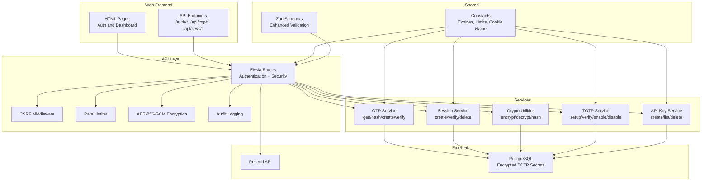

**Diagram sources**
- [auth.ts](file://packages/api/src/routes/auth.ts#L1-L95)
- [csrf.ts](file://packages/api/src/middleware/csrf.ts#L1-L16)
- [rate-limiter.ts](file://packages/api/src/lib/rate-limiter.ts#L1-L59)
- [crypto.ts](file://packages/api/src/lib/crypto.ts#L1-L90)
- [totp.ts](file://packages/api/src/routes/totp.ts#L1-L254)
- [api-keys.ts](file://packages/api/src/routes/api-keys.ts#L1-L119)
- [audit.ts](file://packages/api/src/services/audit.ts#L1-L50)
- [otp.ts](file://packages/api/src/services/otp.ts#L1-L59)
- [session.ts](file://packages/api/src/services/session.ts#L1-L43)
- [constants.ts](file://packages/shared/src/constants.ts#L1-L34)
- [schemas.ts](file://packages/shared/src/schemas.ts#L1-L214)
- [email.ts](file://packages/api/src/lib/email.ts#L1-L34)

**Section sources**
- [auth.ts](file://packages/api/src/routes/auth.ts#L1-L95)
- [csrf.ts](file://packages/api/src/middleware/csrf.ts#L1-L16)
- [rate-limiter.ts](file://packages/api/src/lib/rate-limiter.ts#L1-L59)
- [crypto.ts](file://packages/api/src/lib/crypto.ts#L1-L90)
- [totp.ts](file://packages/api/src/routes/totp.ts#L1-L254)
- [api-keys.ts](file://packages/api/src/routes/api-keys.ts#L1-L119)
- [audit.ts](file://packages/api/src/services/audit.ts#L1-L50)
- [otp.ts](file://packages/api/src/services/otp.ts#L1-L59)
- [session.ts](file://packages/api/src/services/session.ts#L1-L43)
- [constants.ts](file://packages/shared/src/constants.ts#L1-L34)
- [schemas.ts](file://packages/shared/src/schemas.ts#L1-L214)
- [email.ts](file://packages/api/src/lib/email.ts#L1-L34)

## Core Components
- **Enhanced OTP Generation and Storage**
  - Generates a 6-digit numeric code using cryptographically secure random number generation
  - Hashes the code with SHA-256 before storing
  - Stores email, hashed code, and expiry timestamp in the database
  - Implements aggressive rate limiting (100 requests per minute per email/IP)
- **Advanced Session Management**
  - Creates cryptographically random session tokens using WebCrypto
  - Stores token with expiry and associates with user
  - Provides verification and deletion utilities with comprehensive logging
  - HTTP-only secure cookies with 30-day expiry and SameSite "lax" configuration
- **Comprehensive Encryption Layer**
  - AES-256-GCM encryption for sensitive data protection
  - Secure key derivation from environment variables
  - Encrypted storage of TOTP secrets and backup codes
  - JSON encryption utilities for structured data
- **Enterprise API Key Infrastructure**
  - Random API key generation with sk_live_ prefix
  - SHA-256 hashing for key verification
  - Granular scope-based access control
  - Expiration date support and audit trail
- **Two-Factor Authentication (TOTP)**
  - RFC 6238 compliant time-based authentication
  - 8 backup codes for emergency access
  - Encrypted secret storage with AES-256-GCM
  - Comprehensive setup, verification, and disable workflows
- **Enhanced Audit Logging**
  - Comprehensive event tracking for security actions
  - User, IP, and metadata logging
  - Non-blocking audit logging to prevent system failures
  - Admin dashboard for audit log monitoring

**Section sources**
- [otp.ts](file://packages/api/src/services/otp.ts#L6-L59)
- [session.ts](file://packages/api/src/services/session.ts#L6-L43)
- [crypto.ts](file://packages/api/src/lib/crypto.ts#L7-L89)
- [totp.ts](file://packages/api/src/routes/totp.ts#L105-L253)
- [api-keys.ts](file://packages/api/src/routes/api-keys.ts#L48-L118)
- [audit.ts](file://packages/api/src/services/audit.ts#L3-L49)

## Architecture Overview
The authentication flow is composed of three primary endpoints orchestrated by the API routes, validated by enhanced schemas, protected by CSRF middleware, throttled by the rate limiter, and powered by OTP and session services backed by the database with comprehensive encryption and audit capabilities.

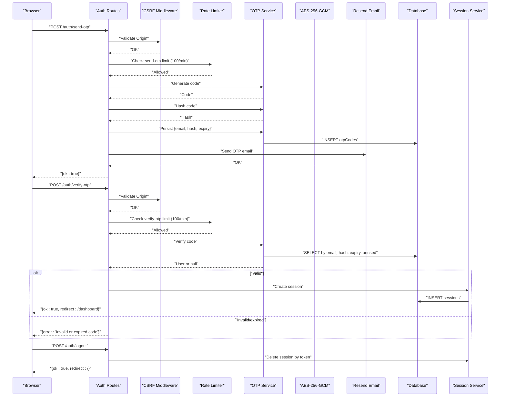

**Diagram sources**
- [auth.ts](file://packages/api/src/routes/auth.ts#L21-L95)
- [csrf.ts](file://packages/api/src/middleware/csrf.ts#L4-L14)
- [rate-limiter.ts](file://packages/api/src/lib/rate-limiter.ts#L17-L34)
- [otp.ts](file://packages/api/src/services/otp.ts#L27-L59)
- [session.ts](file://packages/api/src/services/session.ts#L13-L21)
- [email.ts](file://packages/api/src/lib/email.ts#L13-L33)

## Detailed Component Analysis

### Enhanced OTP Service
Implements OTP lifecycle with improved security and rate limiting: generation, hashing, persistence, and verification with comprehensive error handling.

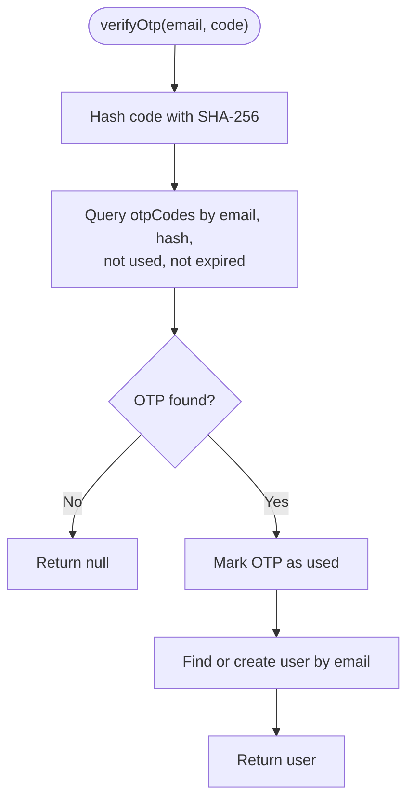

**Diagram sources**
- [otp.ts](file://packages/api/src/services/otp.ts#L27-L59)

**Section sources**
- [otp.ts](file://packages/api/src/services/otp.ts#L6-L59)

### Advanced Session Service
Manages session tokens with enhanced security and comprehensive lifecycle management.

```mermaid
classDiagram
class SessionService {
+createSession(userId) Promise~{token}~
+verifySession(token) Promise~User|null~
+deleteSession(token) Promise~void~
}
class CryptoUtils {
+encrypt(text) string
+decrypt(ciphertext) string
+generateToken(bytes) string
}
class Database {
+insert(sessions)
+query(sessions)
+delete(sessions)
}
SessionService --> Database : "persists/queries"
SessionService --> CryptoUtils : "uses for encryption"
```

**Diagram sources**
- [session.ts](file://packages/api/src/services/session.ts#L13-L43)
- [crypto.ts](file://packages/api/src/lib/crypto.ts#L17-L49)

**Section sources**
- [session.ts](file://packages/api/src/services/session.ts#L6-L43)

### AES-256-GCM Encryption Library
Provides comprehensive encryption utilities for sensitive data protection across the application.

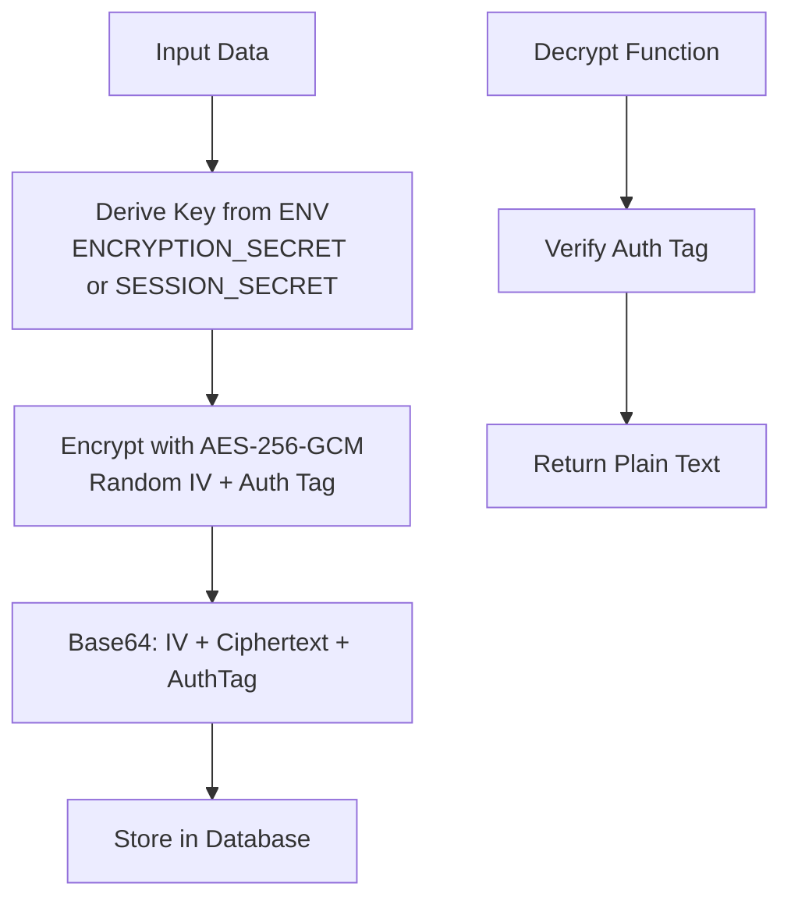

**Diagram sources**
- [crypto.ts](file://packages/api/src/lib/crypto.ts#L17-L49)

**Section sources**
- [crypto.ts](file://packages/api/src/lib/crypto.ts#L1-L90)

### Two-Factor Authentication (TOTP) Service
Comprehensive TOTP implementation with encrypted storage, backup codes, and full lifecycle management.

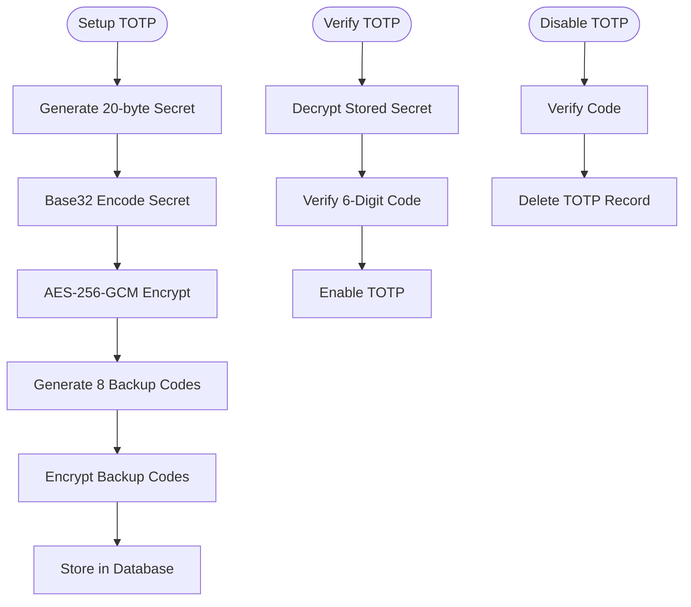

**Diagram sources**
- [totp.ts](file://packages/api/src/routes/totp.ts#L105-L253)

**Section sources**
- [totp.ts](file://packages/api/src/routes/totp.ts#L1-L254)

### API Key Infrastructure
Enterprise-grade API key management with granular scoping, encryption, and comprehensive audit logging.

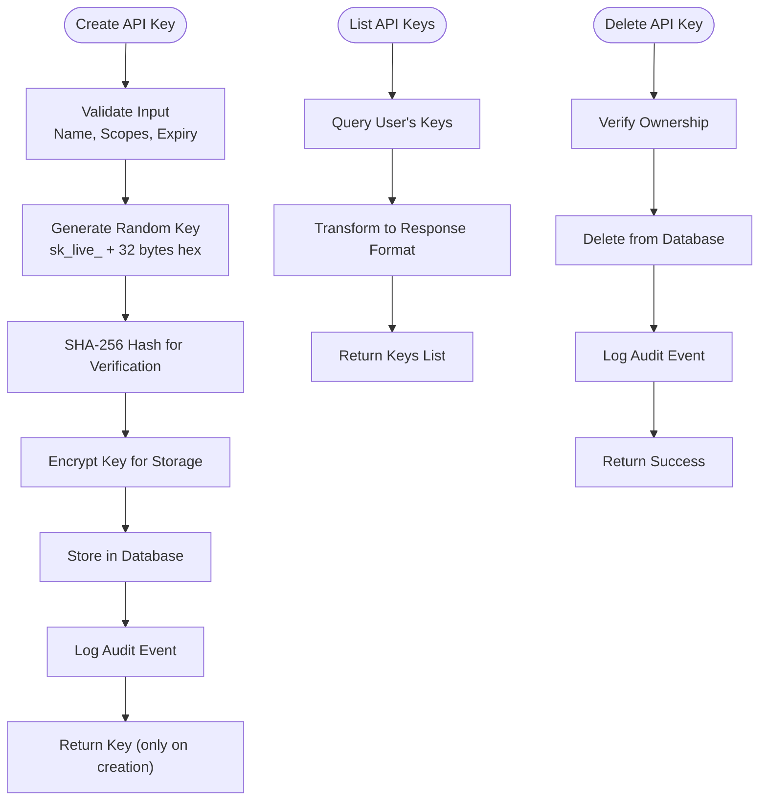

**Diagram sources**
- [api-keys.ts](file://packages/api/src/routes/api-keys.ts#L48-L118)

**Section sources**
- [api-keys.ts](file://packages/api/src/routes/api-keys.ts#L1-L119)

### Enhanced Audit Logging System
Comprehensive event tracking for security and compliance purposes.

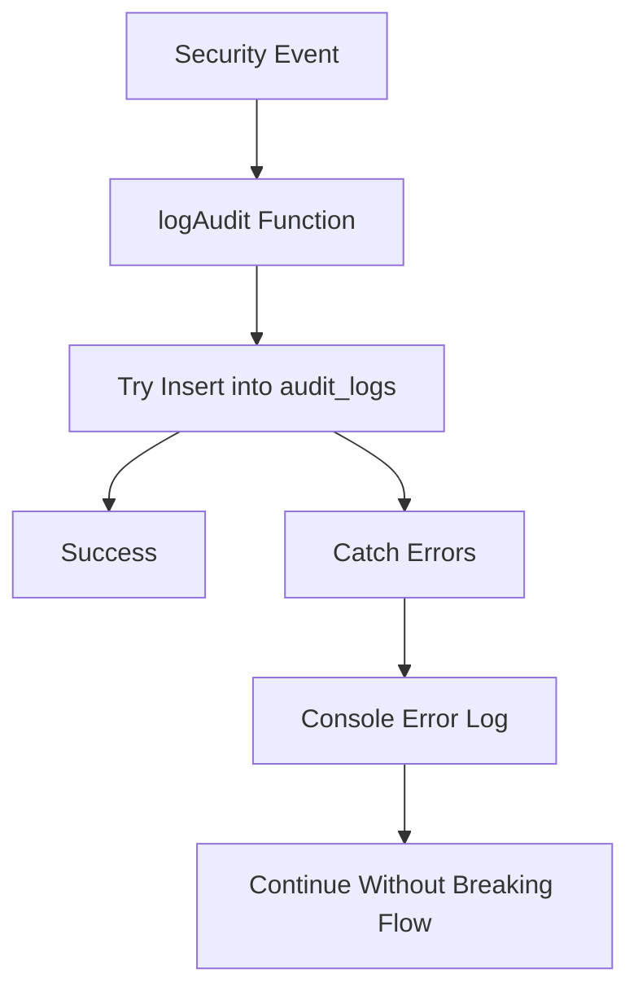

**Diagram sources**
- [audit.ts](file://packages/api/src/services/audit.ts#L30-L49)

**Section sources**
- [audit.ts](file://packages/api/src/services/audit.ts#L1-L50)

### Rate Limiter
Enhanced in-memory sliding-window limiter with aggressive rate limiting for security.

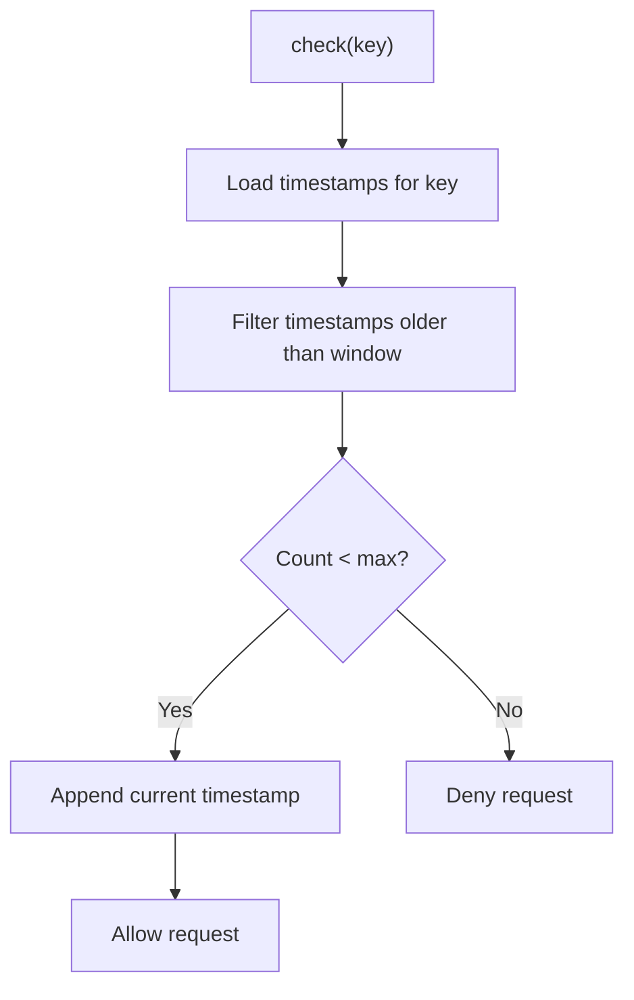

**Diagram sources**
- [rate-limiter.ts](file://packages/api/src/lib/rate-limiter.ts#L17-L34)

**Section sources**
- [rate-limiter.ts](file://packages/api/src/lib/rate-limiter.ts#L5-L58)

### Email Service (Resend)
Sends OTP emails with enhanced security and comprehensive logging.

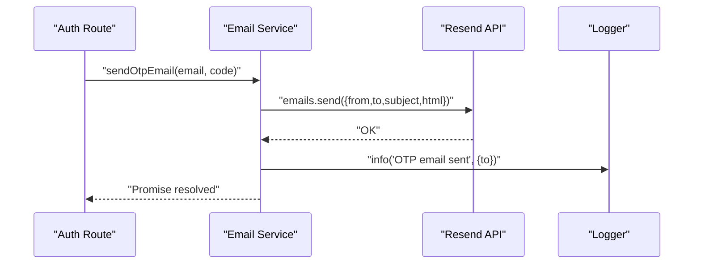

**Diagram sources**
- [email.ts](file://packages/api/src/lib/email.ts#L13-L33)

**Section sources**
- [email.ts](file://packages/api/src/lib/email.ts#L1-L34)

### CSRF Protection Middleware
Validates Origin header for non-idempotent requests against configured origin.

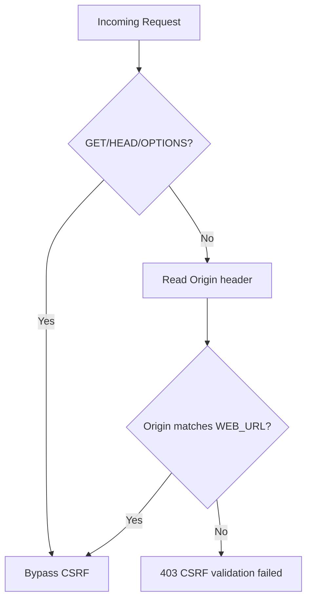

**Diagram sources**
- [csrf.ts](file://packages/api/src/middleware/csrf.ts#L4-L14)

**Section sources**
- [csrf.ts](file://packages/api/src/middleware/csrf.ts#L1-L16)

### Enhanced Authentication Routes
Defines the public endpoints with comprehensive security middleware and enhanced validation.

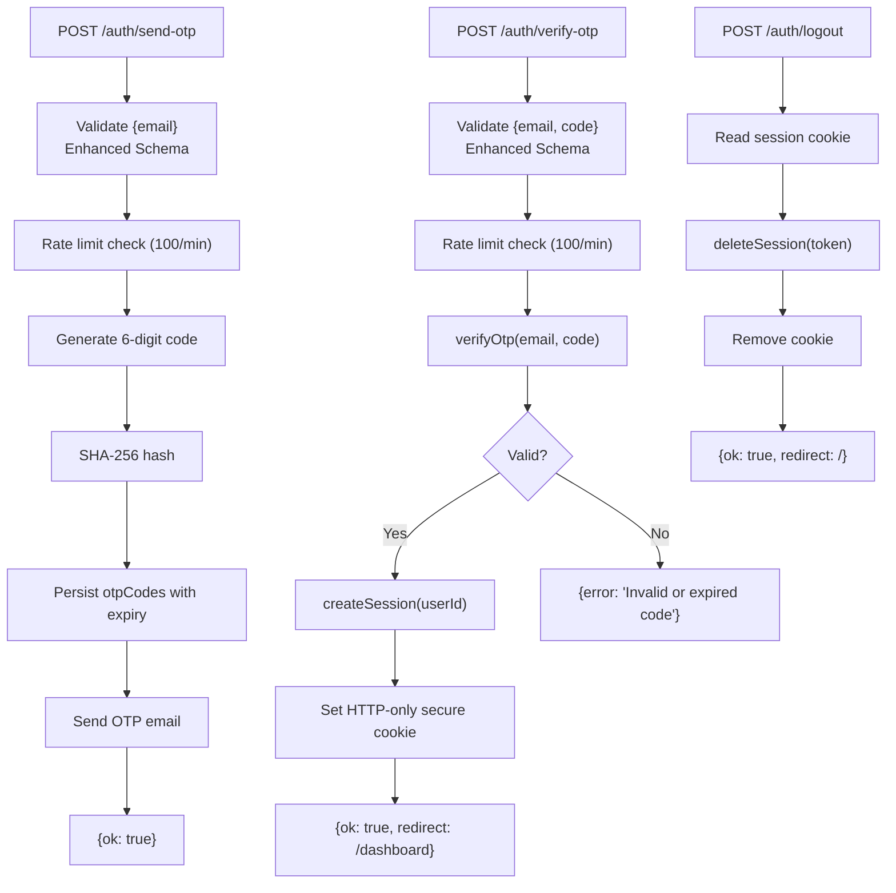

**Diagram sources**
- [auth.ts](file://packages/api/src/routes/auth.ts#L21-L95)

**Section sources**
- [auth.ts](file://packages/api/src/routes/auth.ts#L1-L95)

## Security Enhancements

### AES-256-GCM Encryption Implementation
The system now provides comprehensive encryption for sensitive data using industry-standard AES-256-GCM with authentication:

- **Algorithm**: AES-256-GCM with 12-byte random initialization vector and 16-byte authentication tag
- **Key Derivation**: SHA-256 hash of ENCRYPTION_SECRET or SESSION_SECRET environment variable
- **Data Protection**: TOTP secrets, backup codes, and API keys are encrypted before storage
- **Authentication**: GCM mode provides integrity verification and authenticity
- **Format**: Base64-encoded concatenation of IV + ciphertext + auth tag

**Section sources**
- [crypto.ts](file://packages/api/src/lib/crypto.ts#L3-L49)
- [totp.ts](file://packages/api/src/routes/totp.ts#L121-L129)
- [api-keys.ts](file://packages/api/src/routes/api-keys.ts#L62-L72)

### Two-Factor Authentication (TOTP) with Backup Codes
Enterprise-grade two-factor authentication implementation:

- **Standard Compliance**: RFC 6238 compliant time-based authentication
- **Secret Management**: 20-byte cryptographically secure secrets with Base32 encoding
- **Backup Codes**: 8 randomly generated backup codes for emergency access
- **Encrypted Storage**: All secrets and backup codes encrypted with AES-256-GCM
- **Verification Window**: Accepts codes from current and adjacent 30-second windows
- **Audit Trail**: Comprehensive logging of TOTP enable/disable actions

**Section sources**
- [totp.ts](file://packages/api/src/routes/totp.ts#L57-L71)
- [totp.ts](file://packages/api/src/routes/totp.ts#L117-L129)
- [audit.ts](file://packages/api/src/services/audit.ts#L6-L7)

### Enterprise API Key Infrastructure
Granular access control with comprehensive security features:

- **Key Generation**: Random 32-byte keys with sk_live_ prefix for easy identification
- **Scoping**: Four distinct scopes: instance:read, instance:write, setup:read, setup:write
- **Expiration**: Optional expiration dates up to 365 days
- **Hashing**: SHA-256 hashing for secure key verification without storing plaintext
- **Audit Logging**: Complete audit trail for API key creation and deletion
- **Frontend Integration**: Secure display and management interface

**Section sources**
- [api-keys.ts](file://packages/api/src/routes/api-keys.ts#L83-L89)
- [schemas.ts](file://packages/shared/src/schemas.ts#L89-L95)
- [audit.ts](file://packages/api/src/services/audit.ts#L8-L9)

### Comprehensive Audit Logging
Non-blocking audit system for security monitoring and compliance:

- **Event Types**: Login, logout, TOTP enable/disable, API key operations, instance management
- **Data Capture**: User ID, IP address, instance ID, metadata, timestamps
- **Storage**: PostgreSQL audit_logs table with proper indexing
- **Non-blocking**: Audit failures don't interrupt main application flow
- **Admin Interface**: Dedicated admin dashboard for audit log monitoring
- **Filtering**: Action-based filtering and pagination support

**Section sources**
- [audit.ts](file://packages/api/src/services/audit.ts#L3-L28)
- [schema.ts](file://packages/shared/src/db/schema.ts#L249-L269)

### Enhanced Rate Limiting
Aggressive rate limiting for enhanced security:

- **OTP Requests**: 100 requests per minute per email/IP (higher than original for development)
- **Verification Attempts**: 100 attempts per minute per email/IP
- **Sliding Window**: In-memory implementation with automatic cleanup
- **Key Strategy**: Composite keys combining IP, email, and operation type
- **Graceful Degradation**: 429 responses with clear error messages

**Section sources**
- [auth.ts](file://packages/api/src/routes/auth.ts#L12-L13)
- [constants.ts](file://packages/shared/src/constants.ts#L17-L20)

## Dependency Analysis
The system exhibits clear separation of concerns with enhanced security dependencies:

- **Routes** depend on:
  - Enhanced schemas for comprehensive input validation
  - CSRF middleware for security
  - Rate limiter for abuse prevention
  - OTP, Session, Crypto, TOTP, and API Key services for business logic
  - Email service for notifications
  - Audit service for security tracking
- **Services** depend on:
  - Shared constants for timing and limits
  - Database via Drizzle ORM with encrypted schema support
  - Crypto utilities for data protection
- **Middleware** depends on:
  - Environment variables for configuration
- **Encryption Layer** depends on:
  - Node.js crypto module for AES-256-GCM
  - Environment variables for key derivation

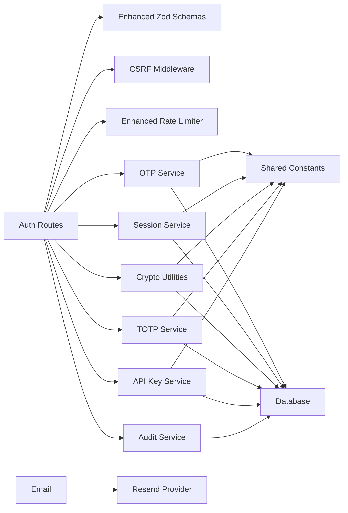

**Diagram sources**
- [auth.ts](file://packages/api/src/routes/auth.ts#L1-L11)
- [otp.ts](file://packages/api/src/services/otp.ts#L1-L5)
- [session.ts](file://packages/api/src/services/session.ts#L1-L5)
- [crypto.ts](file://packages/api/src/lib/crypto.ts#L1-L1)
- [totp.ts](file://packages/api/src/routes/totp.ts#L1-L11)
- [api-keys.ts](file://packages/api/src/routes/api-keys.ts#L1-L11)
- [audit.ts](file://packages/api/src/services/audit.ts#L1-L2)
- [constants.ts](file://packages/shared/src/constants.ts#L1-L34)
- [email.ts](file://packages/api/src/lib/email.ts#L1-L11)

**Section sources**
- [auth.ts](file://packages/api/src/routes/auth.ts#L1-L11)
- [otp.ts](file://packages/api/src/services/otp.ts#L1-L5)
- [session.ts](file://packages/api/src/services/session.ts#L1-L5)
- [crypto.ts](file://packages/api/src/lib/crypto.ts#L1-L1)
- [totp.ts](file://packages/api/src/routes/totp.ts#L1-L11)
- [api-keys.ts](file://packages/api/src/routes/api-keys.ts#L1-L11)
- [audit.ts](file://packages/api/src/services/audit.ts#L1-L2)
- [constants.ts](file://packages/shared/src/constants.ts#L1-L34)
- [email.ts](file://packages/api/src/lib/email.ts#L1-L11)

## Performance Considerations
- **Enhanced Rate Limiter**: More aggressive in-memory sliding-window limiter suitable for single-instance deployments; consider external caching (e.g., Redis) for horizontal scaling
- **Encryption Overhead**: AES-256-GCM adds computational overhead; optimize by batching operations and using connection pooling
- **Database Indexes**: Ensure proper indexing on encrypted TOTP secrets and audit log tables for performance
- **OTP and Session Expiry**: Database queries rely on indexes on email, hash, token, and expiry fields
- **SHA-256 Hashing**: Fast but avoid hashing excessively large inputs; current implementation hashes short 6-digit strings
- **Email Delivery**: Latency depends on Resend; monitor delivery metrics and configure retries or fallbacks at the provider level
- **Audit Logging**: Non-blocking design prevents performance degradation; consider asynchronous logging for high-volume environments

## Troubleshooting Guide
Common issues and resolutions with enhanced security features:

### Enhanced Authentication Issues
- **Invalid email format**
  - Cause: Payload fails enhanced Zod validation
  - Symptoms: 400 error with "Invalid email"
  - Resolution: Ensure the email field conforms to RFC standards and length ≤ 255
  - Section sources
    - [auth.ts](file://packages/api/src/routes/auth.ts#L24-L28)
    - [schemas.ts](file://packages/shared/src/schemas.ts#L3-L11)

- **Too many OTP requests**
  - Cause: Exceeded 100 requests per minute per IP and email (enhanced rate limit)
  - Symptoms: 429 error with rate limit message
  - Resolution: Wait for the window to reset or reduce request frequency
  - Section sources
    - [auth.ts](file://packages/api/src/routes/auth.ts#L30-L34)
    - [rate-limiter.ts](file://packages/api/src/lib/rate-limiter.ts#L17-L34)
    - [constants.ts](file://packages/shared/src/constants.ts#L17-L18)

- **Too many verification attempts**
  - Cause: Exceeded 100 attempts per minute per IP and email (enhanced rate limit)
  - Symptoms: 429 error with attempt limit message
  - Resolution: Wait for the window to reset; advise users to re-send OTP
  - Section sources
    - [auth.ts](file://packages/api/src/routes/auth.ts#L53-L57)
    - [rate-limiter.ts](file://packages/api/src/lib/rate-limiter.ts#L17-L34)
    - [constants.ts](file://packages/shared/src/constants.ts#L19-L20)

- **Invalid or expired OTP**
  - Cause: Wrong code, non-6-digit format, expired, or already used
  - Symptoms: 401 error with "Invalid or expired code"
  - Resolution: Prompt user to re-send OTP; verify device clock/timezone
  - Section sources
    - [auth.ts](file://packages/api/src/routes/auth.ts#L60-L64)
    - [otp.ts](file://packages/api/src/services/otp.ts#L27-L37)
    - [constants.ts](file://packages/shared/src/constants.ts#L16)

- **CSRF validation failure**
  - Cause: Origin header mismatch for non-idempotent requests
  - Symptoms: 403 error with CSRF message
  - Resolution: Ensure frontend requests originate from the configured WEB_URL
  - Section sources
    - [csrf.ts](file://packages/api/src/middleware/csrf.ts#L8-L14)

- **Session cookie not set**
  - Cause: Verification succeeded but cookie configuration failed
  - Symptoms: Redirect succeeds but user appears unauthenticated after reload
  - Resolution: Verify NODE_ENV and cookie attributes; confirm SameSite compatibility
  - Section sources
    - [auth.ts](file://packages/api/src/routes/auth.ts#L66-L74)
    - [constants.ts](file://packages/shared/src/constants.ts#L22-L23)

- **Logout does not clear session**
  - Cause: Token not present or session deletion failed
  - Symptoms: User remains logged in after logout
  - Resolution: Confirm cookie removal and verify session deletion
  - Section sources
    - [auth.ts](file://packages/api/src/routes/auth.ts#L83-L94)
    - [session.ts](file://packages/api/src/services/session.ts#L40-L43)

### Enhanced Security Feature Issues
- **TOTP Setup Failures**
  - Cause: TOTP already enabled or encryption errors
  - Symptoms: 400 error with setup conflict message
  - Resolution: Disable existing TOTP before reconfiguration; check encryption key
  - Section sources
    - [totp.ts](file://packages/api/src/routes/totp.ts#L112-L115)

- **TOTP Verification Errors**
  - Cause: Invalid 6-digit code or decryption failures
  - Symptoms: 400 error with "Invalid TOTP code"
  - Resolution: Verify code format and ensure proper time synchronization
  - Section sources
    - [totp.ts](file://packages/api/src/routes/totp.ts#L191-L194)

- **API Key Creation Issues**
  - Cause: Invalid scope values or encryption errors
  - Symptoms: 400 error with validation details
  - Resolution: Ensure scopes match enum values; verify encryption key
  - Section sources
    - [api-keys.ts](file://packages/api/src/routes/api-keys.ts#L49-L53)

- **API Key Deletion Failures**
  - Cause: Not found or ownership verification errors
  - Symptoms: 404 error with "API key not found"
  - Resolution: Verify key ID and user ownership
  - Section sources
    - [api-keys.ts](file://packages/api/src/routes/api-keys.ts#L98-L103)

- **Audit Logging Failures**
  - Cause: Database connectivity or constraint violations
  - Symptoms: Console error but operation continues
  - Resolution: Check database connectivity and audit log table structure
  - Section sources
    - [audit.ts](file://packages/api/src/services/audit.ts#L45-L48)

## Conclusion
SparkClaw's enhanced authentication system provides enterprise-grade security through comprehensive AES-256-GCM encryption, robust two-factor authentication with backup codes, granular API key infrastructure with scoping, and comprehensive audit logging. The system combines enhanced input validation, cryptographic OTP handling, aggressive rate limiting, secure session management, and encrypted data storage to deliver a secure, user-friendly authentication experience with strong protections against modern security threats and comprehensive compliance capabilities.

## Appendices

### Enhanced Authentication API Endpoints
- **POST /auth/send-otp**
  - Request: { email }
  - Response: { ok: true } or error payload
  - Security: CSRF enforced, enhanced rate-limited (100 per minute)
  - Section sources
    - [auth.ts](file://packages/api/src/routes/auth.ts#L23-L45)
    - [schemas.ts](file://packages/shared/src/schemas.ts#L3-L11)
    - [csrf.ts](file://packages/api/src/middleware/csrf.ts#L4-L14)
    - [rate-limiter.ts](file://packages/api/src/lib/rate-limiter.ts#L17-L34)

- **POST /auth/verify-otp**
  - Request: { email, code }
  - Response: { ok: true, redirect: "/dashboard" } or error payload
  - Security: CSRF enforced, enhanced rate-limited (100 per minute), sets session cookie
  - Section sources
    - [auth.ts](file://packages/api/src/routes/auth.ts#L46-L82)
    - [schemas.ts](file://packages/shared/src/schemas.ts#L13-L16)
    - [csrf.ts](file://packages/api/src/middleware/csrf.ts#L4-L14)
    - [rate-limiter.ts](file://packages/api/src/lib/rate-limiter.ts#L17-L34)

- **POST /auth/logout**
  - Request: none (reads cookie)
  - Response: { ok: true, redirect: "/" }
  - Security: deletes session by token, removes cookie
  - Section sources
    - [auth.ts](file://packages/api/src/routes/auth.ts#L83-L94)
    - [session.ts](file://packages/api/src/services/session.ts#L40-L43)

### Enhanced Security API Endpoints
- **POST /api/totp/setup**
  - Request: none (authenticated)
  - Response: { secret, otpauthUri, backupCodes } or error
  - Security: encrypted storage, backup codes, audit logging
  - Section sources
    - [totp.ts](file://packages/api/src/routes/totp.ts#L105-L161)

- **POST /api/totp/verify**
  - Request: { code }
  - Response: { success: true } or error
  - Security: TOTP verification, encryption, audit logging
  - Section sources
    - [totp.ts](file://packages/api/src/routes/totp.ts#L162-L210)

- **POST /api/totp/disable**
  - Request: { code }
  - Response: { success: true } or error
  - Security: TOTP verification, encryption, audit logging
  - Section sources
    - [totp.ts](file://packages/api/src/routes/totp.ts#L211-L253)

- **GET /api/keys/**
  - Request: none (authenticated)
  - Response: { keys: ApiKeyResponse[] }
  - Security: encrypted key storage, audit logging
  - Section sources
    - [api-keys.ts](file://packages/api/src/routes/api-keys.ts#L29-L46)

- **POST /api/keys/**
  - Request: { name, scopes[], expiresInDays? }
  - Response: { key, id, ... } (key only returned on creation)
  - Security: encrypted key storage, audit logging
  - Section sources
    - [api-keys.ts](file://packages/api/src/routes/api-keys.ts#L48-L92)

- **DELETE /api/keys/:id**
  - Request: none (authenticated)
  - Response: { success: true }
  - Security: encrypted key storage, audit logging
  - Section sources
    - [api-keys.ts](file://packages/api/src/routes/api-keys.ts#L94-L118)

### Frontend Integration Examples
- Landing page links to /auth and displays pricing
- Auth page implements two-step flow:
  - Step 1: Submit email to /auth/send-otp
  - Step 2: Submit 6-digit code to /auth/verify-otp
- Dashboard requires authenticated access and provides logout form posting to /auth/logout
- Account page includes TOTP setup, API key management, and audit log monitoring
- Section sources
    - [day1-foundation.md](file://docs/plans/2026-03-07-day1-foundation.md#L729-L816)
    - [day1-foundation.md](file://docs/plans/2026-03-07-day1-foundation.md#L819-L902)

### Enhanced Security Best Practices
- **CSRF Protection**
  - Enforced by middleware for non-idempotent requests against configured origin
  - Section sources
    - [csrf.ts](file://packages/api/src/middleware/csrf.ts#L8-L14)

- **Enhanced Input Validation**
  - Strict Zod schemas for email and OTP code ensure format correctness
  - Section sources
    - [schemas.ts](file://packages/shared/src/schemas.ts#L3-L16)

- **Secure Cookies**
  - HTTP-only, secure flag toggled by environment, SameSite "lax", 30-day expiry
  - Section sources
    - [auth.ts](file://packages/api/src/routes/auth.ts#L66-L74)
    - [constants.ts](file://packages/shared/src/constants.ts#L22-L23)

- **Enhanced Brute Force Mitigation**
  - Sliding window rate limits for OTP requests and verification attempts (100 per minute)
  - Section sources
    - [rate-limiter.ts](file://packages/api/src/lib/rate-limiter.ts#L17-L34)
    - [constants.ts](file://packages/shared/src/constants.ts#L17-L20)

- **OTP Storage Security**
  - SHA-256 hashed codes stored instead of plaintext; expiry enforced; used flag prevents reuse
  - Section sources
    - [otp.ts](file://packages/api/src/services/otp.ts#L11-L17)
    - [otp.ts](file://packages/api/src/services/otp.ts#L27-L45)
    - [constants.ts](file://packages/shared/src/constants.ts#L16)

- **Session Token Strength**
  - Cryptographically random 32-byte tokens generated via WebCrypto
  - Section sources
    - [session.ts](file://packages/api/src/services/session.ts#L6-L11)
    - [utils.ts](file://packages/api/src/lib/utils.ts#L5-L10)

- **AES-256-GCM Encryption**
  - Industry-standard encryption for sensitive data protection
  - Section sources
    - [crypto.ts](file://packages/api/src/lib/crypto.ts#L3-L49)

- **TOTP Security**
  - RFC 6238 compliant with encrypted storage and backup codes
  - Section sources
    - [totp.ts](file://packages/api/src/routes/totp.ts#L57-L71)
    - [totp.ts](file://packages/api/src/routes/totp.ts#L121-L129)

- **API Key Security**
  - Random keys with SHA-256 hashing and granular scoping
  - Section sources
    - [api-keys.ts](file://packages/api/src/routes/api-keys.ts#L83-L89)
    - [schemas.ts](file://packages/shared/src/schemas.ts#L89-L95)

- **Audit Logging Security**
  - Comprehensive event tracking with non-blocking design
  - Section sources
    - [audit.ts](file://packages/api/src/services/audit.ts#L30-L49)

### Enhanced Email Template and Delivery Monitoring
- Template includes the OTP code prominently and a note about 5-minute expiry
- Delivery logging records successful sends for observability
- Section sources
  - [email.ts](file://packages/api/src/lib/email.ts#L18-L30)
  - [email.ts](file://packages/api/src/lib/email.ts#L32-L33)

### Database Schema Enhancements
- **Encrypted TOTP Secrets**: AES-256-GCM encrypted storage with unique user association
- **Audit Logs**: Comprehensive event tracking with user, IP, and metadata
- **API Keys**: Encrypted key storage with hash verification and expiration support
- **Indexes**: Optimized indexes for performance on encrypted fields
- Section sources
  - [schema.ts](file://packages/shared/src/db/schema.ts#L278-L299)
  - [schema.ts](file://packages/shared/src/db/schema.ts#L249-L269)
  - [schema.ts](file://packages/shared/src/db/schema.ts#L303-L324)