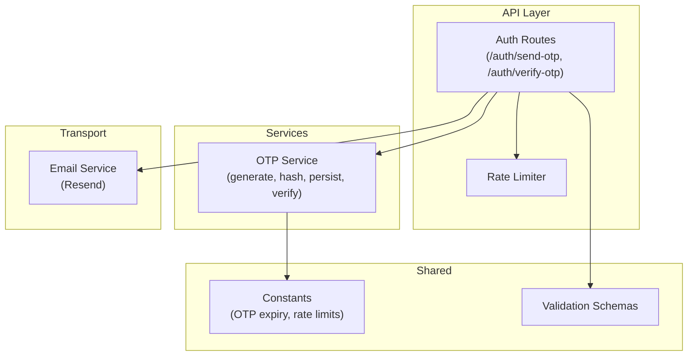
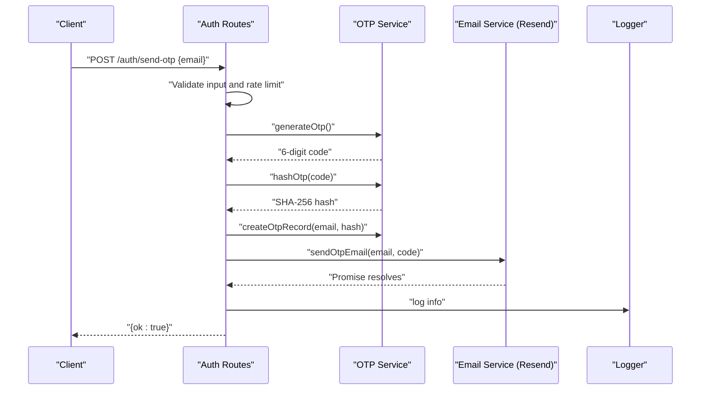
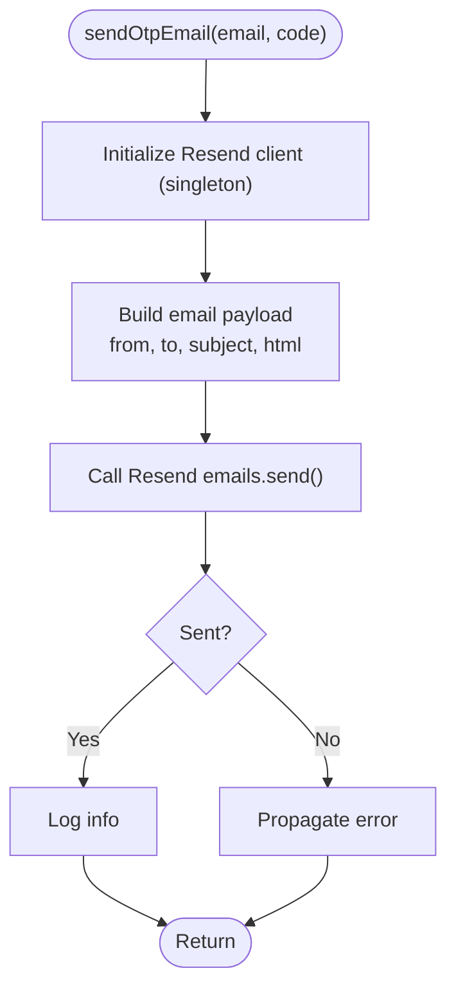
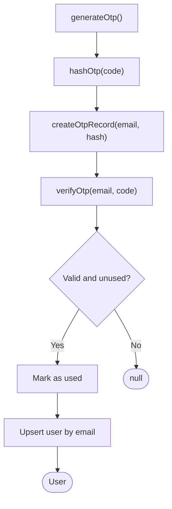
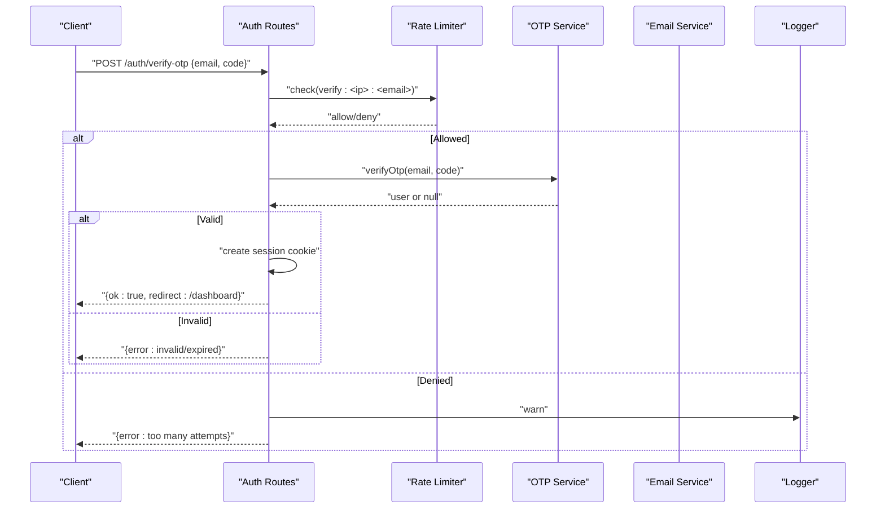
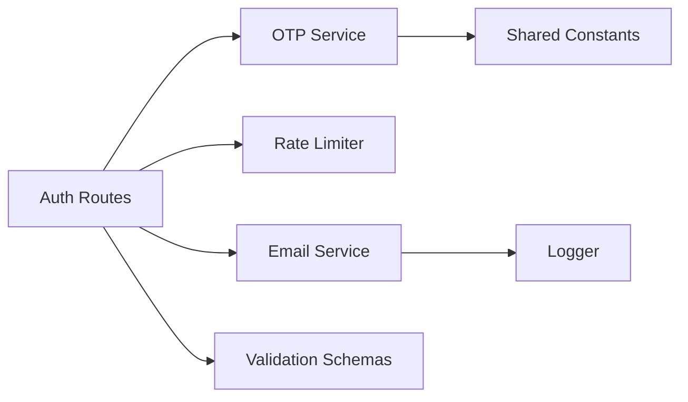

# Email Delivery

<cite>
**Referenced Files in This Document**
- [email.ts](file://packages/api/src/lib/email.ts)
- [otp.ts](file://packages/api/src/services/otp.ts)
- [auth.ts](file://packages/api/src/routes/auth.ts)
- [logger.ts](file://packages/api/src/lib/logger.ts)
- [rate-limiter.ts](file://packages/api/src/lib/rate-limiter.ts)
- [constants.ts](file://packages/shared/src/constants.ts)
- [schemas.ts](file://packages/shared/src/schemas.ts)
- [PRD.md](file://PRD.md)
</cite>

## Table of Contents
1. [Introduction](#introduction)
2. [Project Structure](#project-structure)
3. [Core Components](#core-components)
4. [Architecture Overview](#architecture-overview)
5. [Detailed Component Analysis](#detailed-component-analysis)
6. [Dependency Analysis](#dependency-analysis)
7. [Performance Considerations](#performance-considerations)
8. [Troubleshooting Guide](#troubleshooting-guide)
9. [Conclusion](#conclusion)

## Introduction
This document explains the email delivery system integrated with Resend for SparkClaw’s OTP authentication. It covers the OTP email template structure, HTML formatting, and the end-to-end delivery workflow. It also documents error handling, rate limiting, and logging around email delivery, along with configuration and environment setup. Finally, it provides guidance on customization, fallback strategies, and troubleshooting common email delivery issues.

## Project Structure
The email delivery system spans three primary areas:
- Email transport and delivery: Resend integration for OTP emails
- OTP lifecycle: generation, hashing, persistence, and verification
- API surface: endpoints that trigger OTP sending and verification, with rate limiting and logging

**Diagram sources**
- [auth.ts](file://packages/api/src/routes/auth.ts#L1-L80)
- [rate-limiter.ts](file://packages/api/src/lib/rate-limiter.ts#L1-L59)
- [otp.ts](file://packages/api/src/services/otp.ts#L1-L59)
- [email.ts](file://packages/api/src/lib/email.ts#L1-L34)
- [constants.ts](file://packages/shared/src/constants.ts#L1-L28)
- [schemas.ts](file://packages/shared/src/schemas.ts#L1-L26)

**Section sources**
- [auth.ts](file://packages/api/src/routes/auth.ts#L1-L80)
- [email.ts](file://packages/api/src/lib/email.ts#L1-L34)
- [otp.ts](file://packages/api/src/services/otp.ts#L1-L59)
- [rate-limiter.ts](file://packages/api/src/lib/rate-limiter.ts#L1-L59)
- [constants.ts](file://packages/shared/src/constants.ts#L1-L28)
- [schemas.ts](file://packages/shared/src/schemas.ts#L1-L26)

## Core Components
- Resend-based email transport: encapsulated in a singleton Resend client initialized from the RESEND_API_KEY environment variable. OTP emails are sent with a concise HTML template.
- OTP service: generates a 6-digit code, hashes it, persists it with an expiration, and verifies it during login.
- Auth routes: validate input, enforce rate limits, trigger OTP creation and email delivery, and manage sessions upon successful verification.
- Logging and rate limiting: structured logging for operational visibility and in-process rate-limiting to prevent abuse.

**Section sources**
- [email.ts](file://packages/api/src/lib/email.ts#L1-L34)
- [otp.ts](file://packages/api/src/services/otp.ts#L1-L59)
- [auth.ts](file://packages/api/src/routes/auth.ts#L1-L80)
- [rate-limiter.ts](file://packages/api/src/lib/rate-limiter.ts#L1-L59)
- [logger.ts](file://packages/api/src/lib/logger.ts#L1-L34)
- [constants.ts](file://packages/shared/src/constants.ts#L16-L27)
- [schemas.ts](file://packages/shared/src/schemas.ts#L3-L16)

## Architecture Overview
The email delivery workflow integrates with Resend to send OTP emails. The flow is initiated by the auth routes, which coordinate OTP generation, persistence, and delivery.

**Diagram sources**
- [auth.ts](file://packages/api/src/routes/auth.ts#L21-L40)
- [otp.ts](file://packages/api/src/services/otp.ts#L6-L25)
- [email.ts](file://packages/api/src/lib/email.ts#L13-L33)
- [logger.ts](file://packages/api/src/lib/logger.ts#L29-L33)

## Detailed Component Analysis

### Email Service (Resend)
- Initialization: A singleton Resend client is lazily created using the RESEND_API_KEY environment variable.
- Delivery: Sends a transactional OTP email with a minimal HTML template containing the code, expiration notice, and a “not requested” message.
- Logging: Emits an info log entry after successful dispatch.

**Diagram sources**
- [email.ts](file://packages/api/src/lib/email.ts#L6-L33)

**Section sources**
- [email.ts](file://packages/api/src/lib/email.ts#L1-L34)

### OTP Service
- Generation: Produces a random 6-digit numeric code.
- Hashing: Uses SHA-256 to hash the code before storage.
- Persistence: Inserts a record with email, hash, and expiration timestamp.
- Verification: Validates the code against stored hash, expiration, and “used” status, marks the code as used, and ensures a user record exists.

**Diagram sources**
- [otp.ts](file://packages/api/src/services/otp.ts#L6-L58)

**Section sources**
- [otp.ts](file://packages/api/src/services/otp.ts#L1-L59)

### Auth Routes (OTP Send and Verify)
- Validation: Uses Zod schemas to validate incoming requests.
- Rate Limiting: Enforces per-IP and per-email limits for OTP send and verify operations.
- OTP Lifecycle: Generates, hashes, persists, and sends the OTP; on verify, creates a session cookie and redirects to the dashboard.
- Logging: Emits warnings for rate-limited requests and info for successful sends.

**Diagram sources**
- [auth.ts](file://packages/api/src/routes/auth.ts#L41-L71)
- [rate-limiter.ts](file://packages/api/src/lib/rate-limiter.ts#L17-L42)
- [logger.ts](file://packages/api/src/lib/logger.ts#L29-L33)

**Section sources**
- [auth.ts](file://packages/api/src/routes/auth.ts#L1-L80)
- [rate-limiter.ts](file://packages/api/src/lib/rate-limiter.ts#L1-L59)
- [logger.ts](file://packages/api/src/lib/logger.ts#L1-L34)
- [schemas.ts](file://packages/shared/src/schemas.ts#L13-L16)
- [constants.ts](file://packages/shared/src/constants.ts#L16-L20)

### Template Structure and HTML Formatting
- From address: Sender identity is set to a branded “SparkClaw <noreply@sparkclaw.com>”.
- Subject: Includes the OTP code for easy copy/paste.
- HTML body: Centered layout with a large, spaced code for readability, an expiration notice, and a “not requested” instruction. Inline styles ensure basic rendering across clients.

Customization tips:
- Branding: Adjust the sender name and domain to match your brand.
- Styling: Keep inline styles for maximum client compatibility; avoid external resources.
- Accessibility: Ensure sufficient color contrast and readable font sizes.

**Section sources**
- [email.ts](file://packages/api/src/lib/email.ts#L13-L30)

### Configuration and Environment Setup
- Resend API key: Provided via the RESEND_API_KEY environment variable.
- OTP behavior: Expiration and rate limits are defined in shared constants.
- Validation: Input schemas enforce email format and OTP length.

Recommended environment variables:
- RESEND_API_KEY
- NODE_ENV (for cookie security flags)

**Section sources**
- [email.ts](file://packages/api/src/lib/email.ts#L8)
- [constants.ts](file://packages/shared/src/constants.ts#L16-L20)
- [schemas.ts](file://packages/shared/src/schemas.ts#L3-L6)

### Delivery Monitoring and Logging
- Successful sends: Logged with an info entry including the recipient email.
- Rate-limited requests: Logged with a warning entry for operational insights.
- Error propagation: Transport errors bubble up to the caller; wrap calls with try/catch to centralize error handling and alerting.

**Section sources**
- [email.ts](file://packages/api/src/lib/email.ts#L32-L33)
- [logger.ts](file://packages/api/src/lib/logger.ts#L29-L33)
- [auth.ts](file://packages/api/src/routes/auth.ts#L363-L364)

## Dependency Analysis
The email delivery system exhibits low coupling and clear separation of concerns:
- Auth routes depend on OTP service, rate limiter, and email service.
- OTP service depends on shared constants for expiration and on the database layer for persistence.
- Email service depends on Resend and the logger.
- Shared schemas and constants provide cross-cutting validation and configuration.

**Diagram sources**
- [auth.ts](file://packages/api/src/routes/auth.ts#L1-L80)
- [otp.ts](file://packages/api/src/services/otp.ts#L1-L59)
- [rate-limiter.ts](file://packages/api/src/lib/rate-limiter.ts#L1-L59)
- [email.ts](file://packages/api/src/lib/email.ts#L1-L34)
- [logger.ts](file://packages/api/src/lib/logger.ts#L1-L34)
- [constants.ts](file://packages/shared/src/constants.ts#L1-L28)
- [schemas.ts](file://packages/shared/src/schemas.ts#L1-L26)

**Section sources**
- [auth.ts](file://packages/api/src/routes/auth.ts#L1-L80)
- [otp.ts](file://packages/api/src/services/otp.ts#L1-L59)
- [rate-limiter.ts](file://packages/api/src/lib/rate-limiter.ts#L1-L59)
- [email.ts](file://packages/api/src/lib/email.ts#L1-L34)
- [logger.ts](file://packages/api/src/lib/logger.ts#L1-L34)
- [constants.ts](file://packages/shared/src/constants.ts#L1-L28)
- [schemas.ts](file://packages/shared/src/schemas.ts#L1-L26)

## Performance Considerations
- OTP send latency: The PRD targets OTP delivery within a specific threshold; ensure network connectivity and minimal processing overhead in the auth routes.
- Rate limiting: Prevents bursty traffic and protects downstream services; tune limits based on observed usage patterns.
- Logging volume: Structured logs help diagnose issues without impacting performance; avoid excessive formatting in hot paths.

[No sources needed since this section provides general guidance]

## Troubleshooting Guide
Common issues and resolutions:
- Missing or invalid RESEND_API_KEY
  - Symptom: Transport errors when sending emails.
  - Resolution: Confirm the environment variable is set and valid.
  - Section sources
    - [email.ts](file://packages/api/src/lib/email.ts#L8)

- Rate limit exceeded
  - Symptom: 429 responses for OTP send or verify.
  - Resolution: Reduce client-side retries, inform users of cooldown, and adjust shared rate limits if appropriate.
  - Section sources
    - [auth.ts](file://packages/api/src/routes/auth.ts#L28-L32)
    - [auth.ts](file://packages/api/src/routes/auth.ts#L48-L52)
    - [rate-limiter.ts](file://packages/api/src/lib/rate-limiter.ts#L17-L42)
    - [constants.ts](file://packages/shared/src/constants.ts#L17-L20)

- Invalid email or OTP format
  - Symptom: 400 responses for OTP send or verify.
  - Resolution: Ensure client-side validation matches shared schemas.
  - Section sources
    - [schemas.ts](file://packages/shared/src/schemas.ts#L3-L6)
    - [schemas.ts](file://packages/shared/src/schemas.ts#L13-L16)

- Expired or already used OTP
  - Symptom: 401 responses on verify.
  - Resolution: Inform users to request a new code; confirm database entries reflect expected expiration and usage.
  - Section sources
    - [otp.ts](file://packages/api/src/services/otp.ts#L27-L37)

- Delivery failures and monitoring
  - Symptom: Emails not received despite successful API responses.
  - Resolution: Check spam/junk folders, validate domain reputation and DNS records (SPF/DKIM), and review logs for transport errors.
  - Section sources
    - [email.ts](file://packages/api/src/lib/email.ts#L32-L33)
    - [logger.ts](file://packages/api/src/lib/logger.ts#L29-L33)

- Compliance and deliverability
  - Best practices: Use a verified sender domain, configure SPF/DKIM, provide a clear unsubscribe mechanism if applicable, and avoid trigger words that increase spam likelihood.
  - Section sources
    - [PRD.md](file://PRD.md#L640-L651)

## Conclusion
The email delivery system leverages Resend for reliable OTP delivery, with robust validation, rate limiting, and logging. By following the configuration and troubleshooting guidance, you can maintain high deliverability and a smooth user experience for email-based authentication.