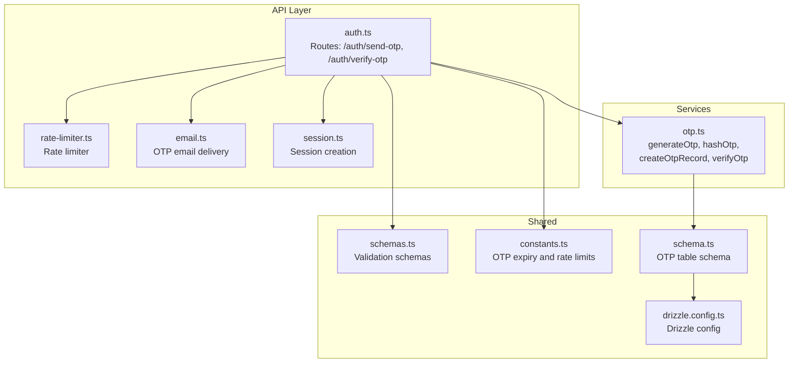
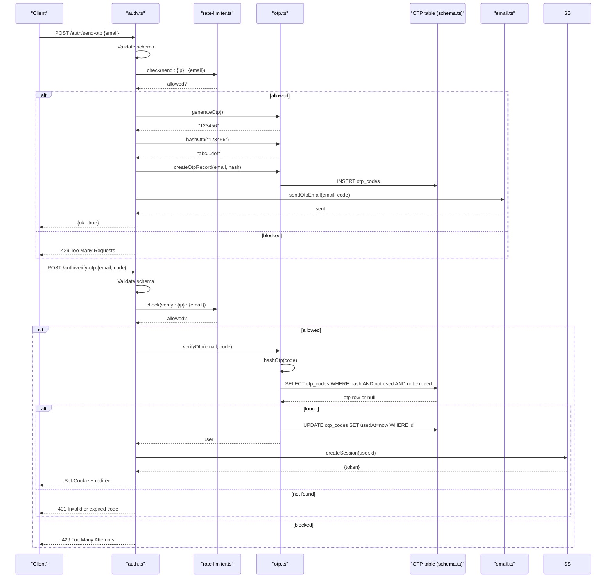
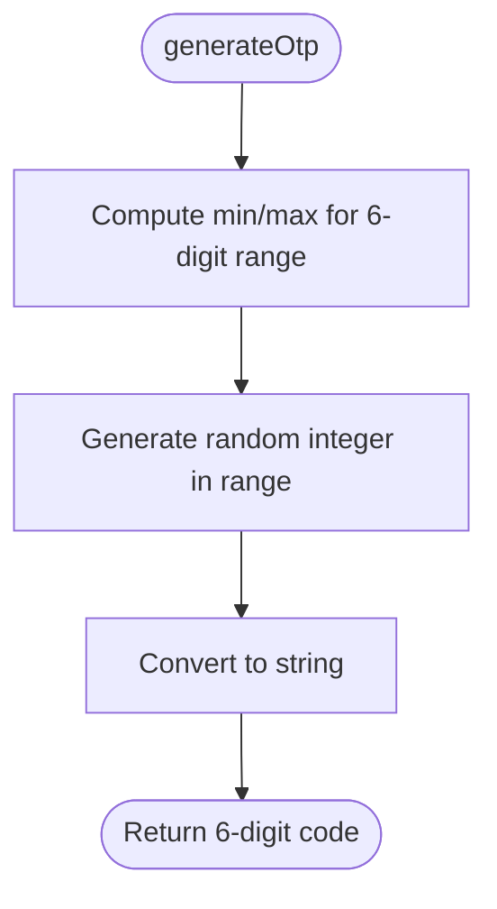
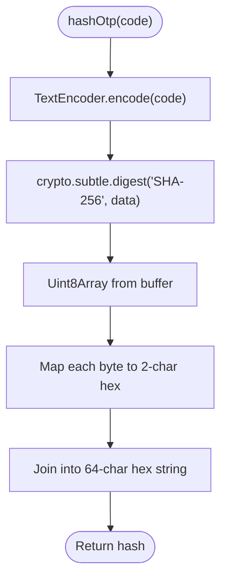
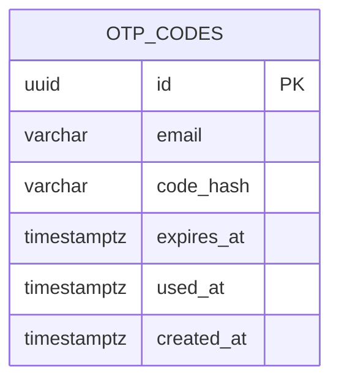
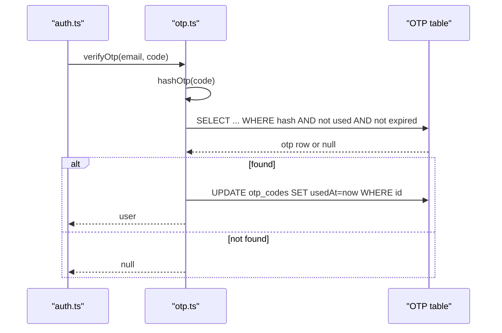
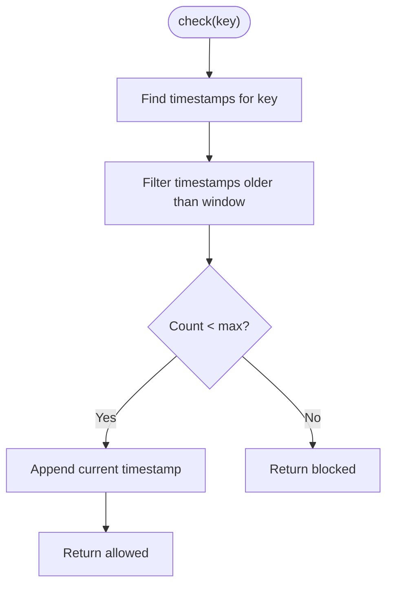
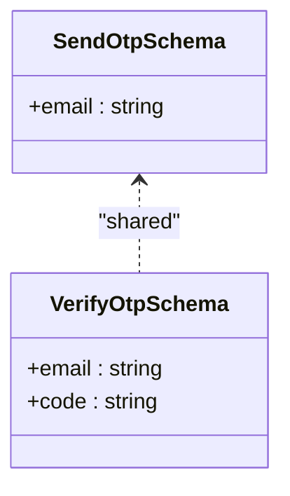
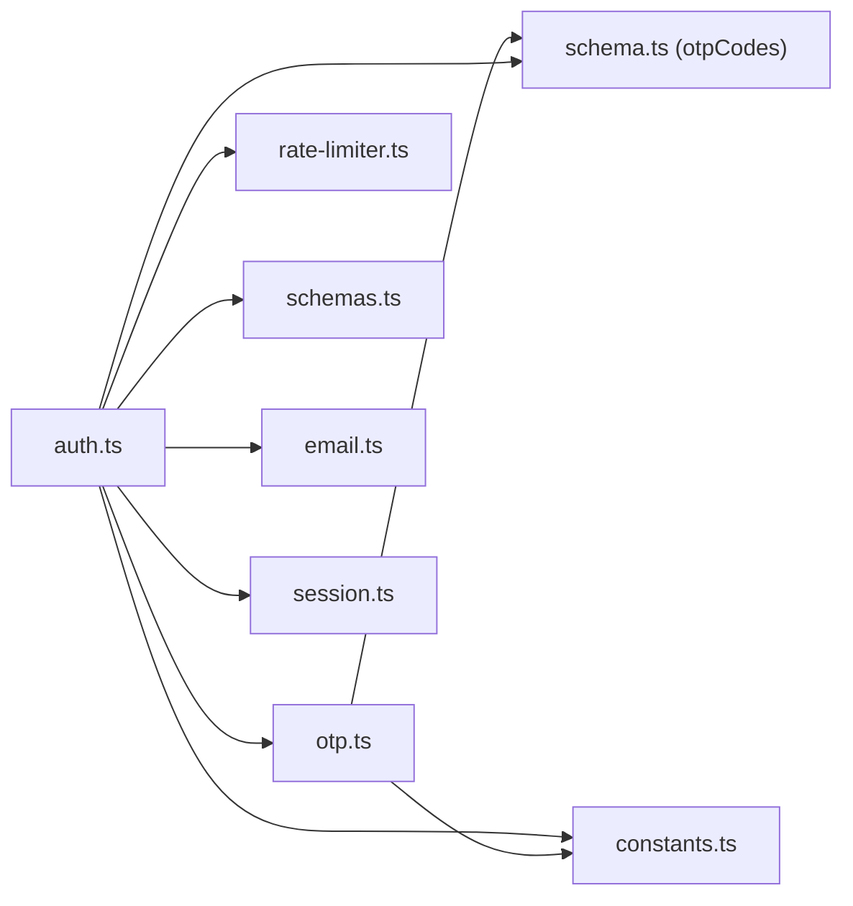

# OTP Management

<cite>
**Referenced Files in This Document**
- [otp.ts](file://packages/api/src/services/otp.ts)
- [otp.test.ts](file://packages/api/src/services/__tests__/otp.test.ts)
- [auth.ts](file://packages/api/src/routes/auth.ts)
- [rate-limiter.ts](file://packages/api/src/lib/rate-limiter.ts)
- [schemas.ts](file://packages/shared/src/schemas.ts)
- [constants.ts](file://packages/shared/src/constants.ts)
- [schema.ts](file://packages/shared/src/db/schema.ts)
- [email.ts](file://packages/api/src/lib/email.ts)
- [session.ts](file://packages/api/src/services/session.ts)
- [drizzle.config.ts](file://drizzle.config.ts)
</cite>

## Table of Contents
1. [Introduction](#introduction)
2. [Project Structure](#project-structure)
3. [Core Components](#core-components)
4. [Architecture Overview](#architecture-overview)
5. [Detailed Component Analysis](#detailed-component-analysis)
6. [Dependency Analysis](#dependency-analysis)
7. [Performance Considerations](#performance-considerations)
8. [Troubleshooting Guide](#troubleshooting-guide)
9. [Conclusion](#conclusion)
10. [Appendices](#appendices)

## Introduction
This document describes the OTP (One-Time Password) management system used for email-based authentication. It covers the 6-digit numeric OTP generation algorithm, SHA-256 hashing for secure storage, 5-minute expiration mechanism, and the end-to-end OTP lifecycle from generation through validation. It also documents rate limiting, schema validation, input sanitization, replay attack prevention, and integration with the authentication system. Examples of workflows and common issues are included to guide implementation and troubleshooting.

## Project Structure
The OTP system spans three layers:
- API routes: expose endpoints for sending and verifying OTPs, enforce rate limits, and manage sessions.
- Services: encapsulate OTP generation, hashing, persistence, and verification logic.
- Shared: define schemas, constants, and database schema for OTP storage.

**Diagram sources**
- [auth.ts](file://packages/api/src/routes/auth.ts#L1-L80)
- [rate-limiter.ts](file://packages/api/src/lib/rate-limiter.ts#L1-L59)
- [email.ts](file://packages/api/src/lib/email.ts#L1-L34)
- [session.ts](file://packages/api/src/services/session.ts#L1-L43)
- [otp.ts](file://packages/api/src/services/otp.ts#L1-L59)
- [schemas.ts](file://packages/shared/src/schemas.ts#L1-L26)
- [constants.ts](file://packages/shared/src/constants.ts#L1-L28)
- [schema.ts](file://packages/shared/src/db/schema.ts#L28-L44)
- [drizzle.config.ts](file://drizzle.config.ts#L1-L13)

**Section sources**
- [auth.ts](file://packages/api/src/routes/auth.ts#L1-L80)
- [otp.ts](file://packages/api/src/services/otp.ts#L1-L59)
- [schemas.ts](file://packages/shared/src/schemas.ts#L1-L26)
- [constants.ts](file://packages/shared/src/constants.ts#L16-L21)
- [schema.ts](file://packages/shared/src/db/schema.ts#L28-L44)
- [drizzle.config.ts](file://drizzle.config.ts#L1-L13)

## Core Components
- OTP Generation: Produces a cryptographically random 6-digit numeric code.
- OTP Hashing: Computes SHA-256 hash of the code for secure storage.
- OTP Persistence: Stores email, hashed code, expiration, and usage metadata.
- OTP Verification: Validates code against stored hash, enforces expiration and single-use constraints.
- Rate Limiting: Enforces OTP send and verify limits per email/IP window.
- Schema Validation: Ensures input conforms to expected formats.
- Email Delivery: Sends OTP via transactional email service.
- Session Management: Creates authenticated sessions upon successful OTP verification.

**Section sources**
- [otp.ts](file://packages/api/src/services/otp.ts#L6-L58)
- [auth.ts](file://packages/api/src/routes/auth.ts#L19-L80)
- [rate-limiter.ts](file://packages/api/src/lib/rate-limiter.ts#L5-L58)
- [schemas.ts](file://packages/shared/src/schemas.ts#L3-L16)
- [email.ts](file://packages/api/src/lib/email.ts#L13-L33)
- [session.ts](file://packages/api/src/services/session.ts#L13-L42)
- [constants.ts](file://packages/shared/src/constants.ts#L16-L21)

## Architecture Overview
The OTP flow integrates route handlers, validation, rate limiting, OTP services, database, and email delivery.

**Diagram sources**
- [auth.ts](file://packages/api/src/routes/auth.ts#L21-L71)
- [rate-limiter.ts](file://packages/api/src/lib/rate-limiter.ts#L17-L34)
- [otp.ts](file://packages/api/src/services/otp.ts#L11-L58)
- [schema.ts](file://packages/shared/src/db/schema.ts#L28-L44)
- [email.ts](file://packages/api/src/lib/email.ts#L13-L33)
- [session.ts](file://packages/api/src/services/session.ts#L13-L21)

## Detailed Component Analysis

### OTP Generation
- Algorithm: Generates a 6-digit numeric code uniformly at random.
- Properties: Deterministic length, uniform distribution across valid 6-digit range, suitable for human entry.

**Diagram sources**
- [otp.ts](file://packages/api/src/services/otp.ts#L6-L9)

**Section sources**
- [otp.ts](file://packages/api/src/services/otp.ts#L6-L9)
- [otp.test.ts](file://packages/api/src/services/__tests__/otp.test.ts#L4-L14)

### OTP Hashing (SHA-256)
- Implementation: Encodes the code and computes SHA-256 using Web Crypto, returning a lowercase hex string.
- Properties: Fixed-length 64-character hex digest, collision-resistant, irreversible.

**Diagram sources**
- [otp.ts](file://packages/api/src/services/otp.ts#L11-L17)

**Section sources**
- [otp.ts](file://packages/api/src/services/otp.ts#L11-L17)
- [otp.test.ts](file://packages/api/src/services/__tests__/otp.test.ts#L16-L34)

### OTP Record Creation and Storage
- Fields persisted: email, codeHash, expiresAt, usedAt (initially null), createdAt.
- Expiration: expiresAt set to current time plus 5 minutes.
- Indexes: OTP table includes indexes on email and expiresAt to optimize lookups.

**Diagram sources**
- [schema.ts](file://packages/shared/src/db/schema.ts#L28-L44)

**Section sources**
- [otp.ts](file://packages/api/src/services/otp.ts#L19-L25)
- [schema.ts](file://packages/shared/src/db/schema.ts#L28-L44)
- [constants.ts](file://packages/shared/src/constants.ts#L16-L16)

### OTP Verification and Replay Prevention
- Steps:
  - Hash incoming code.
  - Query OTP record by email, matching hash, not expired, not used.
  - On match, mark record as used and resolve user (create if missing).
- Replay protection: usedAt prevents reuse; expiresAt prevents late submissions.

**Diagram sources**
- [otp.ts](file://packages/api/src/services/otp.ts#L27-L58)
- [schema.ts](file://packages/shared/src/db/schema.ts#L28-L44)

**Section sources**
- [otp.ts](file://packages/api/src/services/otp.ts#L27-L58)
- [schema.ts](file://packages/shared/src/db/schema.ts#L34-L37)

### Rate Limiting Enforcement
- Send OTP:
  - Max 3 requests per email per 10 minutes.
  - Key pattern: send:{clientIp}:{email}.
- Verify OTP:
  - Max 5 attempts per email per 15 minutes.
  - Key pattern: verify:{clientIp}:{email}.
- Implementation: In-memory sliding window with periodic cleanup.

**Diagram sources**
- [rate-limiter.ts](file://packages/api/src/lib/rate-limiter.ts#L17-L34)

**Section sources**
- [auth.ts](file://packages/api/src/routes/auth.ts#L10-L11)
- [auth.ts](file://packages/api/src/routes/auth.ts#L28-L32)
- [auth.ts](file://packages/api/src/routes/auth.ts#L48-L52)
- [rate-limiter.ts](file://packages/api/src/lib/rate-limiter.ts#L5-L58)
- [constants.ts](file://packages/shared/src/constants.ts#L17-L20)

### Schema Validation and Input Sanitization
- Email validation: Zod schema enforces email format and length.
- OTP code validation: Zod schema enforces exactly 6 digits.
- Sanitization: Zod parsing rejects malformed inputs; routes return 400 for invalid format.

**Diagram sources**
- [schemas.ts](file://packages/shared/src/schemas.ts#L9-L16)

**Section sources**
- [schemas.ts](file://packages/shared/src/schemas.ts#L3-L16)
- [auth.ts](file://packages/api/src/routes/auth.ts#L22-L26)
- [auth.ts](file://packages/api/src/routes/auth.ts#L42-L46)

### Email Delivery
- Provider: Resend client initialized from environment variable.
- Content: Plain HTML with emphasis on the 6-digit code and 5-minute expiry notice.
- Logging: Success logged with recipient address.

**Section sources**
- [email.ts](file://packages/api/src/lib/email.ts#L1-L34)

### Session Integration
- Upon successful OTP verification, a session is created for the user.
- Cookie attributes: HttpOnly, Secure (in production), SameSite=Lax, 30-day expiry.
- Logout clears the session from storage.

**Section sources**
- [auth.ts](file://packages/api/src/routes/auth.ts#L60-L70)
- [session.ts](file://packages/api/src/services/session.ts#L13-L42)
- [constants.ts](file://packages/shared/src/constants.ts#L22-L23)

## Dependency Analysis
- Route dependencies:
  - auth.ts depends on otp.ts, rate-limiter.ts, schemas.ts, constants.ts, email.ts, session.ts.
- Service dependencies:
  - otp.ts depends on db (via shared), constants.ts, and uses crypto for hashing.
- Data dependencies:
  - OTP table schema defines storage contract; Drizzle config points to shared schema.

**Diagram sources**
- [auth.ts](file://packages/api/src/routes/auth.ts#L1-L80)
- [otp.ts](file://packages/api/src/services/otp.ts#L1-L59)
- [rate-limiter.ts](file://packages/api/src/lib/rate-limiter.ts#L1-L59)
- [schemas.ts](file://packages/shared/src/schemas.ts#L1-L26)
- [constants.ts](file://packages/shared/src/constants.ts#L1-L28)
- [schema.ts](file://packages/shared/src/db/schema.ts#L28-L44)

**Section sources**
- [auth.ts](file://packages/api/src/routes/auth.ts#L1-L80)
- [otp.ts](file://packages/api/src/services/otp.ts#L1-L59)
- [drizzle.config.ts](file://drizzle.config.ts#L1-L13)

## Performance Considerations
- Hashing cost: SHA-256 is efficient; negligible overhead compared to network I/O.
- Database queries: OTP lookup uses indexed fields (email, expires_at), minimizing scan cost.
- Rate limiter: In-memory store with periodic cleanup; suitable for single-instance deployments.
- Recommendations:
  - For horizontal scaling, externalize rate limiter state (Redis) to avoid inconsistent limits across instances.
  - Consider background cleanup of expired OTP rows to reduce table growth.

[No sources needed since this section provides general guidance]

## Troubleshooting Guide
Common issues and resolutions:
- Expired codes:
  - Symptom: 401 Invalid or expired code during verification.
  - Cause: expiresAt in the past or verification after the 5-minute window.
  - Resolution: Ask user to request a new OTP.
- Invalid format:
  - Symptom: 400 Invalid email or 400 Invalid format on verification.
  - Cause: schema validation failure (non-email, wrong OTP length).
  - Resolution: Ensure email format and 6-digit code.
- Rate limit exceeded:
  - Symptom: 429 Too many requests or 429 Too many attempts.
  - Cause: exceeding send or verify limits within the configured windows.
  - Resolution: Wait until the next window; reduce client-side retries.
- Database connectivity:
  - Symptom: Failures inserting OTP or querying OTP records.
  - Cause: connection pool exhaustion, network issues, or schema mismatch.
  - Resolution: Verify DATABASE_URL, run migrations, inspect connection health.
- Replay attempts:
  - Symptom: 401 Invalid or expired code even with correct input.
  - Cause: OTP already marked used (usedAt set).
  - Resolution: Request a new OTP; ensure previous OTP is not reused.

**Section sources**
- [auth.ts](file://packages/api/src/routes/auth.ts#L22-L26)
- [auth.ts](file://packages/api/src/routes/auth.ts#L42-L46)
- [auth.ts](file://packages/api/src/routes/auth.ts#L28-L32)
- [auth.ts](file://packages/api/src/routes/auth.ts#L48-L52)
- [otp.ts](file://packages/api/src/services/otp.ts#L30-L37)
- [schema.ts](file://packages/shared/src/db/schema.ts#L34-L37)

## Conclusion
The OTP system provides a secure, rate-limited, and user-friendly authentication mechanism. It generates robust 6-digit codes, securely stores hashed values with strict expiration and single-use constraints, and integrates cleanly with session management. Adhering to schema validation and rate-limiting policies ensures resilience against abuse while maintaining a smooth user experience.

[No sources needed since this section summarizes without analyzing specific files]

## Appendices

### Example Workflows

- OTP Generation and Delivery
  - Client sends email to POST /auth/send-otp.
  - Server validates schema, checks rate limit, generates and hashes OTP, persists record, and emails the code.
  - Returns success to the client.

- OTP Verification and Login
  - Client submits email and code to POST /auth/verify-otp.
  - Server validates schema, checks verify rate limit, verifies OTP (hash match, not expired, not used), creates a session, sets cookie, and redirects to dashboard.

- Integration with Authentication System
  - Successful verification returns a session cookie; subsequent protected routes require a valid, unexpired session.

[No sources needed since this section provides conceptual examples]