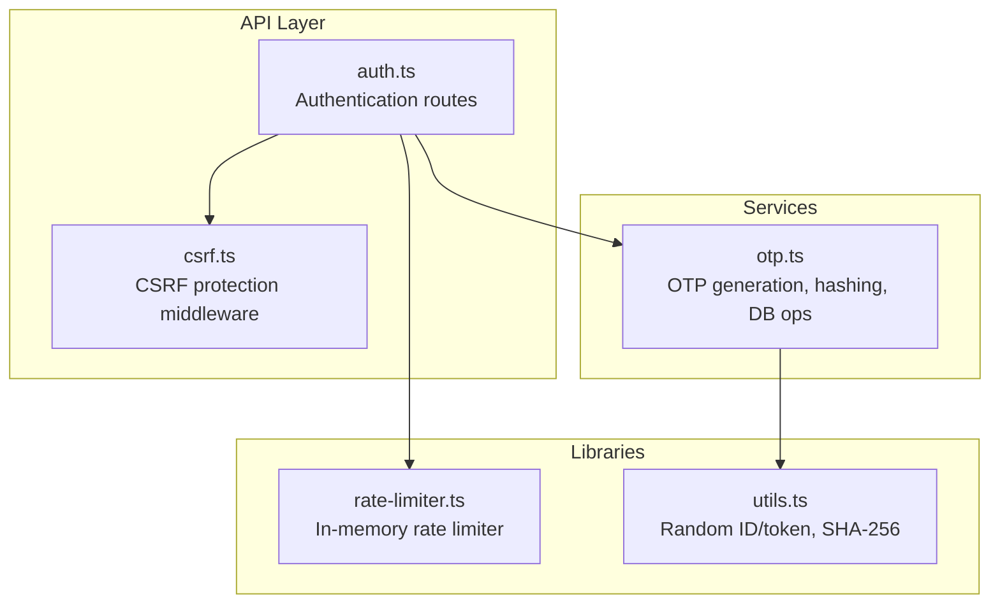
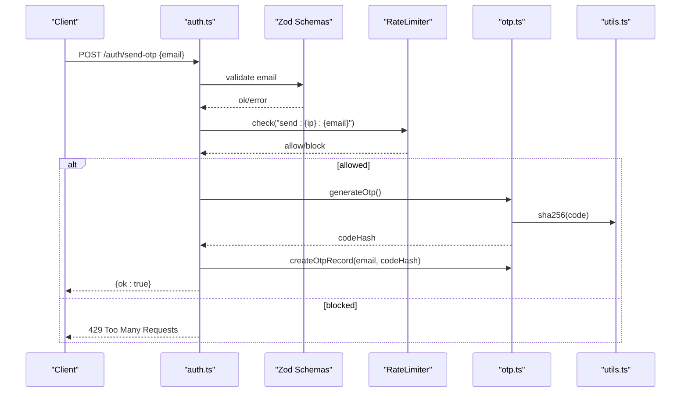
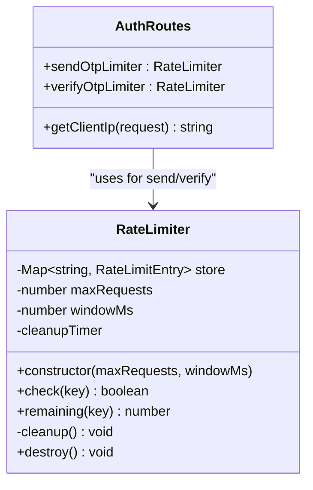
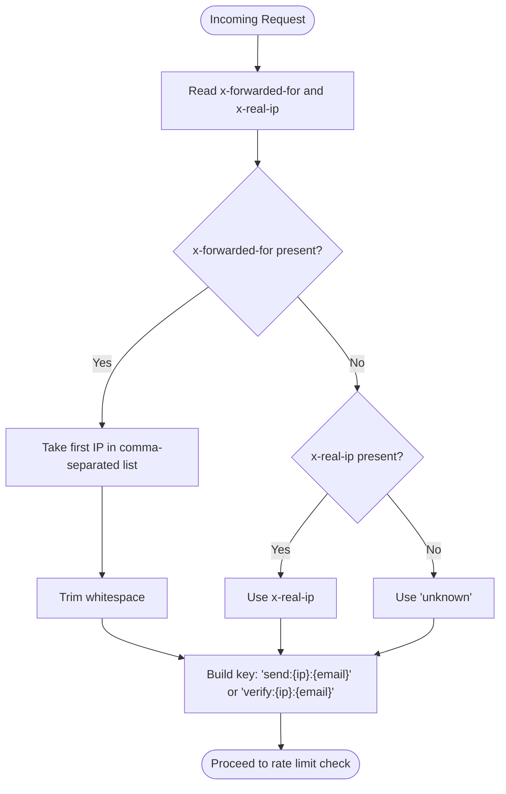
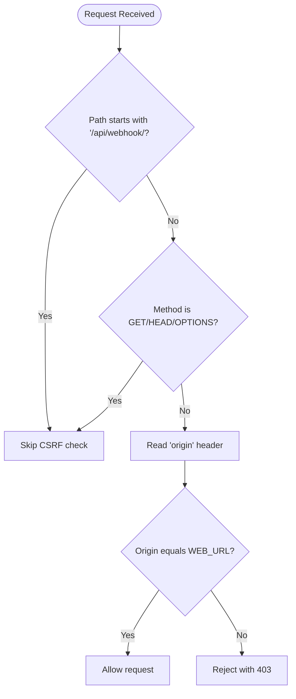
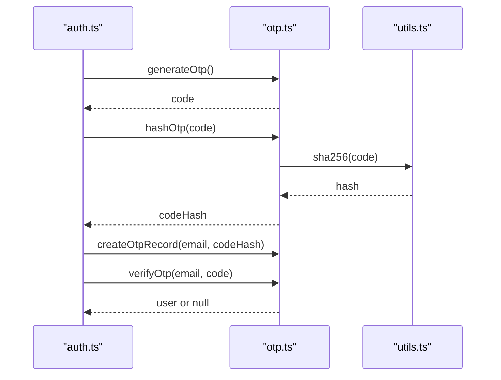
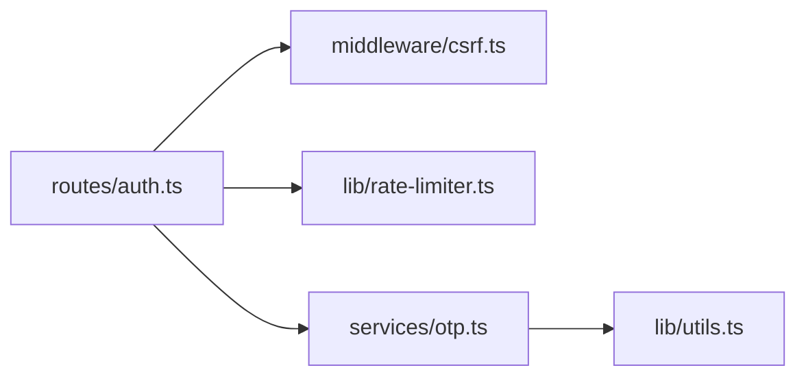

# Rate Limiting & Security

<cite>
**Referenced Files in This Document**
- [packages/api/src/lib/rate-limiter.ts](file://packages/api/src/lib/rate-limiter.ts)
- [packages/api/src/middleware/csrf.ts](file://packages/api/src/middleware/csrf.ts)
- [packages/api/src/routes/auth.ts](file://packages/api/src/routes/auth.ts)
- [packages/api/src/services/otp.ts](file://packages/api/src/services/otp.ts)
- [packages/api/src/lib/utils.ts](file://packages/api/src/lib/utils.ts)
- [packages/api/src/lib/__tests__/rate-limiter.test.ts](file://packages/api/src/lib/__tests__/rate-limiter.test.ts)
- [packages/api/src/lib/__tests__/utils.test.ts](file://packages/api/src/lib/__tests__/utils.test.ts)
</cite>

## Table of Contents
1. [Introduction](#introduction)
2. [Project Structure](#project-structure)
3. [Core Components](#core-components)
4. [Architecture Overview](#architecture-overview)
5. [Detailed Component Analysis](#detailed-component-analysis)
6. [Dependency Analysis](#dependency-analysis)
7. [Performance Considerations](#performance-considerations)
8. [Troubleshooting Guide](#troubleshooting-guide)
9. [Conclusion](#conclusion)

## Introduction
This document explains the rate limiting and security measures implemented in the authentication system. It covers the dual-rate limiting model for OTP sending and verification, IP-based rate limiting using proxy headers, CSRF protection, input validation, and cryptographic utilities. It also outlines brute-force prevention strategies, account lockout mechanisms, suspicious activity detection, and operational best practices.

## Project Structure
The authentication system spans several modules:
- Route handlers for authentication endpoints
- Middleware for CSRF protection
- A lightweight in-memory rate limiter
- OTP service with hashing and database persistence
- Utilities for secure random generation and hashing

**Diagram sources**
- [packages/api/src/routes/auth.ts](file://packages/api/src/routes/auth.ts#L1-L80)
- [packages/api/src/middleware/csrf.ts](file://packages/api/src/middleware/csrf.ts#L1-L16)
- [packages/api/src/lib/rate-limiter.ts](file://packages/api/src/lib/rate-limiter.ts#L1-L59)
- [packages/api/src/services/otp.ts](file://packages/api/src/services/otp.ts#L1-L59)
- [packages/api/src/lib/utils.ts](file://packages/api/src/lib/utils.ts#L1-L19)

**Section sources**
- [packages/api/src/routes/auth.ts](file://packages/api/src/routes/auth.ts#L1-L80)
- [packages/api/src/middleware/csrf.ts](file://packages/api/src/middleware/csrf.ts#L1-L16)
- [packages/api/src/lib/rate-limiter.ts](file://packages/api/src/lib/rate-limiter.ts#L1-L59)
- [packages/api/src/services/otp.ts](file://packages/api/src/services/otp.ts#L1-L59)
- [packages/api/src/lib/utils.ts](file://packages/api/src/lib/utils.ts#L1-L19)

## Core Components
- Dual-rate limiting:
  - OTP sending: configurable cap and window via route-level rate limiter instances
  - OTP verification: separate cap and window for verification attempts
- IP-based rate limiting:
  - Client IP resolved from proxy headers for per-IP limits
- CSRF protection:
  - Origin-based validation for non-GET/HEAD/OPTIONS requests
- Input validation:
  - Zod schemas enforced at route boundaries
- Cryptographic utilities:
  - Secure random ID generation and SHA-256 hashing for OTP storage

**Section sources**
- [packages/api/src/routes/auth.ts](file://packages/api/src/routes/auth.ts#L10-L17)
- [packages/api/src/middleware/csrf.ts](file://packages/api/src/middleware/csrf.ts#L3-L15)
- [packages/api/src/services/otp.ts](file://packages/api/src/services/otp.ts#L6-L17)
- [packages/api/src/lib/utils.ts](file://packages/api/src/lib/utils.ts#L1-L19)

## Architecture Overview
The authentication flow integrates CSRF checks, input validation, and dual rate limits keyed by client IP and email. OTPs are hashed and stored with expiry, and successful verification creates a session cookie.

**Diagram sources**
- [packages/api/src/routes/auth.ts](file://packages/api/src/routes/auth.ts#L21-L40)
- [packages/api/src/lib/rate-limiter.ts](file://packages/api/src/lib/rate-limiter.ts#L17-L34)
- [packages/api/src/services/otp.ts](file://packages/api/src/services/otp.ts#L6-L25)
- [packages/api/src/lib/utils.ts](file://packages/api/src/lib/utils.ts#L12-L18)

## Detailed Component Analysis

### Dual-Rate Limiting System
- Two independent rate limiter instances operate with distinct caps and windows:
  - OTP sending limiter: configured via route-level constants and checked before generating and storing OTPs
  - OTP verification limiter: configured via route-level constants and checked before verifying OTPs
- Keys are composed as "send:{ip}:{email}" and "verify:{ip}:{email}" to isolate attempts by endpoint, client IP, and target email
- Cleanup runs periodically to remove stale entries older than the window

**Diagram sources**
- [packages/api/src/lib/rate-limiter.ts](file://packages/api/src/lib/rate-limiter.ts#L5-L58)
- [packages/api/src/routes/auth.ts](file://packages/api/src/routes/auth.ts#L10-L17)

**Section sources**
- [packages/api/src/lib/rate-limiter.ts](file://packages/api/src/lib/rate-limiter.ts#L1-L59)
- [packages/api/src/routes/auth.ts](file://packages/api/src/routes/auth.ts#L10-L17)

### IP-Based Rate Limiting and Proxy Header Handling
- Client IP resolution:
  - Uses the primary proxy header for client IP, falling back to a secondary proxy header, then to a sentinel value if unavailable
- Rate-limit keys incorporate both IP and email to prevent abuse across accounts while allowing multiple users from the same IP to act independently

**Diagram sources**
- [packages/api/src/routes/auth.ts](file://packages/api/src/routes/auth.ts#L13-L17)

**Section sources**
- [packages/api/src/routes/auth.ts](file://packages/api/src/routes/auth.ts#L13-L17)

### CSRF Protection Middleware
- Non-idempotent methods (POST, PUT, PATCH, DELETE) are protected by origin validation
- Origin must match a configured web URL environment variable; otherwise, the request is rejected with a 403 response
- Webhook endpoints are excluded from CSRF checks

**Diagram sources**
- [packages/api/src/middleware/csrf.ts](file://packages/api/src/middleware/csrf.ts#L4-L15)

**Section sources**
- [packages/api/src/middleware/csrf.ts](file://packages/api/src/middleware/csrf.ts#L1-L16)

### Input Validation Patterns
- Routes validate payloads against Zod schemas before processing
- On validation failure, the route responds with a 400 error and a structured message
- This pattern ensures robustness and consistent error handling across endpoints

**Section sources**
- [packages/api/src/routes/auth.ts](file://packages/api/src/routes/auth.ts#L22-L26)
- [packages/api/src/routes/auth.ts](file://packages/api/src/routes/auth.ts#L42-L46)

### OTP Generation, Hashing, and Verification
- OTP generation produces a 6-digit numeric code
- OTP values are hashed using a cryptographic hash before storage
- Verification queries for a non-expired, unused OTP record and marks it as used upon successful match
- If no user exists for the email, a new user is created

**Diagram sources**
- [packages/api/src/services/otp.ts](file://packages/api/src/services/otp.ts#L6-L58)
- [packages/api/src/lib/utils.ts](file://packages/api/src/lib/utils.ts#L12-L18)

**Section sources**
- [packages/api/src/services/otp.ts](file://packages/api/src/services/otp.ts#L6-L58)
- [packages/api/src/lib/utils.ts](file://packages/api/src/lib/utils.ts#L1-L19)

### Security Middleware Integration
- CSRF middleware is mounted globally for authentication routes
- Non-idempotent requests are validated against the origin policy
- Webhook paths bypass CSRF checks to support external integrations

**Section sources**
- [packages/api/src/routes/auth.ts](file://packages/api/src/routes/auth.ts#L20)
- [packages/api/src/middleware/csrf.ts](file://packages/api/src/middleware/csrf.ts#L5-L6)

### Brute Force Attack Prevention and Account Lockout
- Current implementation:
  - Dual-rate limiting throttles OTP sending and verification attempts
  - OTP records are single-use and expire automatically
- Recommended enhancements:
  - Track failed verification counts per email/IP and apply temporary lockouts after repeated failures
  - Introduce exponential backoff for subsequent attempts
  - Add anomaly detection for rapid sequential attempts across multiple targets
  - Enforce stricter rate limits for unauthenticated IPs during mass attacks

[No sources needed since this section provides general guidance]

### Suspicious Activity Detection
- Monitor spikes in OTP send failures, verification failures, and cross-email probing
- Alert on unusual patterns such as:
  - Multiple emails verified from a single IP within a short period
  - Rapid retries across many different emails
- Integrate with logging to capture metadata (IP, email, timestamps) for post-incident analysis

[No sources needed since this section provides general guidance]

### Examples and Usage References
- Rate limiter usage:
  - OTP send limiter instance and key composition: [packages/api/src/routes/auth.ts](file://packages/api/src/routes/auth.ts#L10-L11), [packages/api/src/routes/auth.ts](file://packages/api/src/routes/auth.ts#L28-L32)
  - OTP verify limiter instance and key composition: [packages/api/src/routes/auth.ts](file://packages/api/src/routes/auth.ts#L10-L11), [packages/api/src/routes/auth.ts](file://packages/api/src/routes/auth.ts#L48-L52)
  - In-memory store and cleanup behavior: [packages/api/src/lib/rate-limiter.ts](file://packages/api/src/lib/rate-limiter.ts#L6-L14), [packages/api/src/lib/rate-limiter.ts](file://packages/api/src/lib/rate-limiter.ts#L44-L52)
- CSRF configuration:
  - Origin enforcement and webhook exclusion: [packages/api/src/middleware/csrf.ts](file://packages/api/src/middleware/csrf.ts#L5-L14)
- Input validation:
  - Schema-based parsing and error responses: [packages/api/src/routes/auth.ts](file://packages/api/src/routes/auth.ts#L22-L26), [packages/api/src/routes/auth.ts](file://packages/api/src/routes/auth.ts#L42-L46)
- Cryptographic utilities:
  - Random ID and secure token generation: [packages/api/src/lib/utils.ts](file://packages/api/src/lib/utils.ts#L1-L10)
  - SHA-256 hashing: [packages/api/src/lib/utils.ts](file://packages/api/src/lib/utils.ts#L12-L18)

**Section sources**
- [packages/api/src/routes/auth.ts](file://packages/api/src/routes/auth.ts#L10-L11)
- [packages/api/src/routes/auth.ts](file://packages/api/src/routes/auth.ts#L28-L32)
- [packages/api/src/routes/auth.ts](file://packages/api/src/routes/auth.ts#L48-L52)
- [packages/api/src/lib/rate-limiter.ts](file://packages/api/src/lib/rate-limiter.ts#L6-L14)
- [packages/api/src/lib/rate-limiter.ts](file://packages/api/src/lib/rate-limiter.ts#L44-L52)
- [packages/api/src/middleware/csrf.ts](file://packages/api/src/middleware/csrf.ts#L5-L14)
- [packages/api/src/lib/utils.ts](file://packages/api/src/lib/utils.ts#L1-L10)
- [packages/api/src/lib/utils.ts](file://packages/api/src/lib/utils.ts#L12-L18)

## Dependency Analysis

**Diagram sources**
- [packages/api/src/routes/auth.ts](file://packages/api/src/routes/auth.ts#L1-L80)
- [packages/api/src/middleware/csrf.ts](file://packages/api/src/middleware/csrf.ts#L1-L16)
- [packages/api/src/lib/rate-limiter.ts](file://packages/api/src/lib/rate-limiter.ts#L1-L59)
- [packages/api/src/services/otp.ts](file://packages/api/src/services/otp.ts#L1-L59)
- [packages/api/src/lib/utils.ts](file://packages/api/src/lib/utils.ts#L1-L19)

**Section sources**
- [packages/api/src/routes/auth.ts](file://packages/api/src/routes/auth.ts#L1-L80)
- [packages/api/src/middleware/csrf.ts](file://packages/api/src/middleware/csrf.ts#L1-L16)
- [packages/api/src/lib/rate-limiter.ts](file://packages/api/src/lib/rate-limiter.ts#L1-L59)
- [packages/api/src/services/otp.ts](file://packages/api/src/services/otp.ts#L1-L59)
- [packages/api/src/lib/utils.ts](file://packages/api/src/lib/utils.ts#L1-L19)

## Performance Considerations
- In-memory rate limiter:
  - Suitable for single-instance deployments; consider a distributed store (e.g., Redis) for horizontal scaling
  - Cleanup interval runs every minute; tune based on traffic volume
- OTP hashing:
  - SHA-256 is efficient; ensure database indexes on email and expiration for verification queries
- Session cookies:
  - HttpOnly and SameSite settings reduce XSS risks; secure flag depends on environment

[No sources needed since this section provides general guidance]

## Troubleshooting Guide
- 429 Too Many Requests on OTP send/verify:
  - Indicates the per-IP-per-email rate limit was exceeded; adjust limits or advise users to slow down
  - Verify proxy headers are correctly forwarded by upstream proxies
- 400 Bad Request on invalid payload:
  - Confirm the request body matches the expected schema for the endpoint
- 401 Unauthorized on OTP verification:
  - The OTP might be expired, already used, or incorrect; confirm the code freshness and correctness
- CSRF 403 errors:
  - Ensure the origin header matches the configured web URL and that the request is not a GET/HEAD/OPTIONS method

**Section sources**
- [packages/api/src/routes/auth.ts](file://packages/api/src/routes/auth.ts#L28-L32)
- [packages/api/src/routes/auth.ts](file://packages/api/src/routes/auth.ts#L48-L52)
- [packages/api/src/middleware/csrf.ts](file://packages/api/src/middleware/csrf.ts#L11-L14)

## Conclusion
The authentication system employs a practical dual-rate limiting model keyed by client IP and email, complemented by CSRF protection and strict input validation. OTPs are securely handled with hashing and single-use semantics. To further strengthen defenses, consider adding account lockouts, anomaly detection, and a distributed rate limiter for multi-instance deployments.