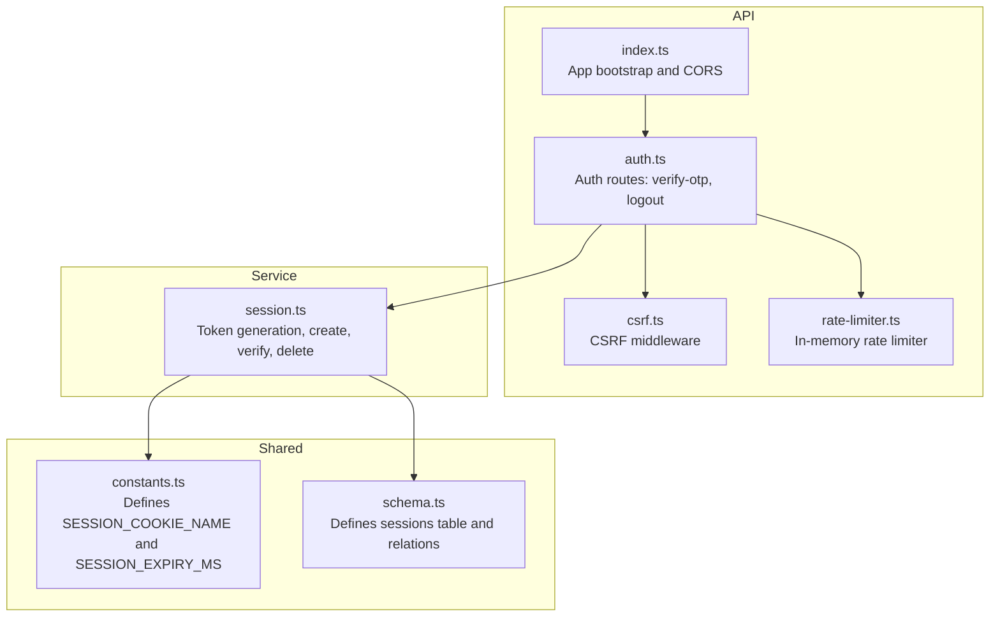
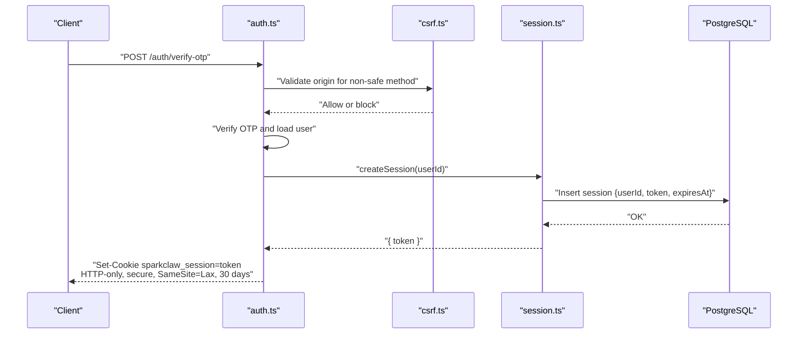
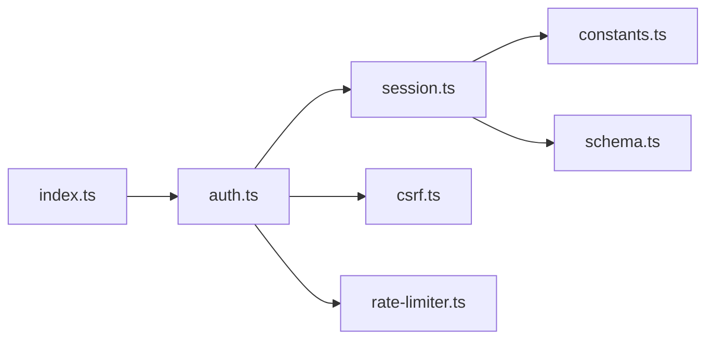

# Session Management

<cite>
**Referenced Files in This Document**
- [packages/api/src/services/session.ts](file://packages/api/src/services/session.ts)
- [packages/api/src/routes/auth.ts](file://packages/api/src/routes/auth.ts)
- [packages/api/src/middleware/csrf.ts](file://packages/api/src/middleware/csrf.ts)
- [packages/shared/src/constants.ts](file://packages/shared/src/constants.ts)
- [packages/shared/src/db/schema.ts](file://packages/shared/src/db/schema.ts)
- [packages/api/src/lib/rate-limiter.ts](file://packages/api/src/lib/rate-limiter.ts)
- [packages/api/src/index.ts](file://packages/api/src/index.ts)
</cite>

## Table of Contents
1. [Introduction](#introduction)
2. [Project Structure](#project-structure)
3. [Core Components](#core-components)
4. [Architecture Overview](#architecture-overview)
5. [Detailed Component Analysis](#detailed-component-analysis)
6. [Dependency Analysis](#dependency-analysis)
7. [Performance Considerations](#performance-considerations)
8. [Troubleshooting Guide](#troubleshooting-guide)
9. [Conclusion](#conclusion)

## Introduction
This document explains the session management system used by the API. It covers token generation, cookie configuration, session lifecycle, validation, CSRF protection, and security considerations. It also outlines how sessions are persisted, validated during requests, terminated on logout, and cleaned up.

## Project Structure
The session management system spans a few focused modules:
- Constants define cookie name and session expiry duration.
- Database schema defines the sessions table and relationships.
- Session service encapsulates token generation, creation, verification, and deletion.
- Authentication routes create sessions on successful OTP verification and remove them on logout.
- CSRF middleware enforces origin-based CSRF protection for non-safe HTTP methods.
- Rate limiter supports OTP-related protections.

**Diagram sources**
- [packages/shared/src/constants.ts](file://packages/shared/src/constants.ts#L22-L23)
- [packages/shared/src/db/schema.ts](file://packages/shared/src/db/schema.ts#L46-L67)
- [packages/api/src/routes/auth.ts](file://packages/api/src/routes/auth.ts#L19-L79)
- [packages/api/src/middleware/csrf.ts](file://packages/api/src/middleware/csrf.ts#L3-L15)
- [packages/api/src/lib/rate-limiter.ts](file://packages/api/src/lib/rate-limiter.ts#L5-L58)
- [packages/api/src/services/session.ts](file://packages/api/src/services/session.ts#L1-L42)
- [packages/api/src/index.ts](file://packages/api/src/index.ts#L11-L19)

**Section sources**
- [packages/api/src/index.ts](file://packages/api/src/index.ts#L1-L25)
- [packages/shared/src/constants.ts](file://packages/shared/src/constants.ts#L22-L23)
- [packages/shared/src/db/schema.ts](file://packages/shared/src/db/schema.ts#L46-L67)
- [packages/api/src/services/session.ts](file://packages/api/src/services/session.ts#L1-L42)
- [packages/api/src/routes/auth.ts](file://packages/api/src/routes/auth.ts#L19-L79)
- [packages/api/src/middleware/csrf.ts](file://packages/api/src/middleware/csrf.ts#L3-L15)
- [packages/api/src/lib/rate-limiter.ts](file://packages/api/src/lib/rate-limiter.ts#L5-L58)

## Core Components
- Token generation: Cryptographically secure random token creation.
- Session creation: Associates a user ID with a token and sets an expiry.
- Session verification: Validates token presence and non-expiration, then loads the associated user.
- Cookie configuration: HTTP-only, secure, SameSite lax, 30-day max age.
- Logout: Deletes the session record and clears the cookie.
- CSRF protection: Origin-based validation for non-safe methods.
- Persistence: Sessions stored in the database with indexes on token and user ID.
- Cleanup: Expiration enforced via database queries; no periodic cleanup job is present in the current code.

**Section sources**
- [packages/api/src/services/session.ts](file://packages/api/src/services/session.ts#L6-L21)
- [packages/api/src/routes/auth.ts](file://packages/api/src/routes/auth.ts#L60-L70)
- [packages/api/src/middleware/csrf.ts](file://packages/api/src/middleware/csrf.ts#L4-L14)
- [packages/shared/src/db/schema.ts](file://packages/shared/src/db/schema.ts#L46-L67)
- [packages/shared/src/constants.ts](file://packages/shared/src/constants.ts#L22-L23)

## Architecture Overview
The session lifecycle is orchestrated by the authentication routes and enforced by the session service and CSRF middleware.

**Diagram sources**
- [packages/api/src/routes/auth.ts](file://packages/api/src/routes/auth.ts#L394-L402)
- [packages/api/src/middleware/csrf.ts](file://packages/api/src/middleware/csrf.ts#L4-L14)
- [packages/api/src/services/session.ts](file://packages/api/src/services/session.ts#L13-L21)
- [packages/shared/src/db/schema.ts](file://packages/shared/src/db/schema.ts#L46-L67)

## Detailed Component Analysis

### Session Token Generation
- Tokens are generated using a cryptographically secure random source and encoded as a hex string.
- The resulting token is stored in the sessions table and returned to the client via a cookie.

Security characteristics:
- Randomness: Uses a secure random generator.
- Uniqueness: Database enforces uniqueness on the token column.

Operational notes:
- No explicit refresh mechanism is implemented; tokens persist until expiry or deletion.

**Section sources**
- [packages/api/src/services/session.ts](file://packages/api/src/services/session.ts#L6-L11)
- [packages/shared/src/db/schema.ts](file://packages/shared/src/db/schema.ts#L55-L55)

### Session Creation and Cookie Configuration
- On successful OTP verification, a session is created for the user.
- The session’s token is written to an HTTP-only, secure, SameSite lax cookie.
- The cookie’s max age matches the session expiry (30 days).
- The cookie path is set to root.

Behavioral details:
- HTTP-only prevents client-side script access.
- Secure flag ensures transmission over HTTPS in production.
- SameSite lax mitigates CSRF while allowing cross-site navigation.
- Max age aligns with server-side expiry enforcement.

**Section sources**
- [packages/api/src/routes/auth.ts](file://packages/api/src/routes/auth.ts#L394-L402)
- [packages/shared/src/constants.ts](file://packages/shared/src/constants.ts#L22-L23)
- [packages/api/src/services/session.ts](file://packages/api/src/services/session.ts#L13-L21)

### Session Validation During Requests
- An auth middleware derives the session token from the cookie and validates it.
- Validation checks for token presence and non-expired status.
- On success, the request context includes the user; otherwise, it returns an authentication error.

Note: The current code does not show an explicit auth middleware module in the provided files. However, the validation logic described here is consistent with the route-level behavior and constants.

**Section sources**
- [packages/api/src/services/session.ts](file://packages/api/src/services/session.ts#L23-L38)
- [packages/shared/src/constants.ts](file://packages/shared/src/constants.ts#L22-L23)

### Token Refresh Mechanism
- There is no explicit token refresh endpoint or rolling expiry logic in the current code.
- Sessions remain valid until expiry or explicit logout.

Recommendation:
- To support long-lived sessions without re-authentication, implement a refresh endpoint that issues a new token bound to the same user and updates the cookie accordingly.

**Section sources**
- [packages/api/src/services/session.ts](file://packages/api/src/services/session.ts#L13-L21)
- [packages/api/src/routes/auth.ts](file://packages/api/src/routes/auth.ts#L60-L70)

### Session Termination on Logout
- Logout reads the session token from the cookie, deletes the corresponding session record, and removes the cookie.
- This invalidates the token immediately server-side and client-side.

**Section sources**
- [packages/api/src/routes/auth.ts](file://packages/api/src/routes/auth.ts#L406-L413)
- [packages/api/src/services/session.ts](file://packages/api/src/services/session.ts#L40-L42)

### CSRF Protection
- A middleware validates the Origin header against the configured web origin for non-safe methods.
- Webhook endpoints are excluded from CSRF checks.

**Section sources**
- [packages/api/src/middleware/csrf.ts](file://packages/api/src/middleware/csrf.ts#L4-L14)

### Database Schema and Relationships
- The sessions table stores user associations, tokens, and expiry timestamps.
- Indexes exist on token and user ID to optimize lookups.
- Relations tie sessions to users.

**Section sources**
- [packages/shared/src/db/schema.ts](file://packages/shared/src/db/schema.ts#L46-L67)

### Session Persistence and Cleanup
- Persistence: Sessions are inserted with an expiry timestamp.
- Cleanup: Expiration is enforced by queries that require non-expired sessions; no scheduled cleanup job is present in the current code.

Recommendation:
- Consider adding a background job to periodically prune expired sessions to keep the table size manageable.

**Section sources**
- [packages/api/src/services/session.ts](file://packages/api/src/services/session.ts#L15-L28)
- [packages/shared/src/db/schema.ts](file://packages/shared/src/db/schema.ts#L56-L56)

## Dependency Analysis

**Diagram sources**
- [packages/api/src/routes/auth.ts](file://packages/api/src/routes/auth.ts#L19-L79)
- [packages/api/src/services/session.ts](file://packages/api/src/services/session.ts#L1-L42)
- [packages/api/src/middleware/csrf.ts](file://packages/api/src/middleware/csrf.ts#L3-L15)
- [packages/api/src/lib/rate-limiter.ts](file://packages/api/src/lib/rate-limiter.ts#L5-L58)
- [packages/shared/src/constants.ts](file://packages/shared/src/constants.ts#L22-L23)
- [packages/shared/src/db/schema.ts](file://packages/shared/src/db/schema.ts#L46-L67)
- [packages/api/src/index.ts](file://packages/api/src/index.ts#L11-L19)

**Section sources**
- [packages/api/src/routes/auth.ts](file://packages/api/src/routes/auth.ts#L19-L79)
- [packages/api/src/services/session.ts](file://packages/api/src/services/session.ts#L1-L42)
- [packages/api/src/middleware/csrf.ts](file://packages/api/src/middleware/csrf.ts#L3-L15)
- [packages/api/src/lib/rate-limiter.ts](file://packages/api/src/lib/rate-limiter.ts#L5-L58)
- [packages/shared/src/constants.ts](file://packages/shared/src/constants.ts#L22-L23)
- [packages/shared/src/db/schema.ts](file://packages/shared/src/db/schema.ts#L46-L67)
- [packages/api/src/index.ts](file://packages/api/src/index.ts#L11-L19)

## Performance Considerations
- Token generation uses a secure random source; cost is minimal.
- Session verification performs two queries: one to fetch the session by token and expiry, another to load the user. Indexes on token and user ID help.
- Rate limiter uses an in-memory map with periodic cleanup; suitable for single-instance deployments but may need persistence for clustered environments.

[No sources needed since this section provides general guidance]

## Troubleshooting Guide
Common issues and resolutions:
- Invalid or expired session
  - Symptom: Authentication errors when accessing protected resources.
  - Cause: Session expired or deleted.
  - Action: Trigger a fresh login to create a new session.
  - Section sources
    - [packages/api/src/services/session.ts](file://packages/api/src/services/session.ts#L23-L38)

- CSRF validation failure
  - Symptom: Non-safe requests blocked with a 403 error.
  - Cause: Origin mismatch or missing Origin header.
  - Action: Ensure requests originate from the configured web origin.
  - Section sources
    - [packages/api/src/middleware/csrf.ts](file://packages/api/src/middleware/csrf.ts#L8-L14)

- Session not cleared after logout
  - Symptom: User remains logged in after logout.
  - Cause: Cookie removal without deleting the session record.
  - Action: Confirm logout route deletes the session and clears the cookie.
  - Section sources
    - [packages/api/src/routes/auth.ts](file://packages/api/src/routes/auth.ts#L406-L413)
    - [packages/api/src/services/session.ts](file://packages/api/src/services/session.ts#L40-L42)

- Rate limit exceeded during OTP verification
  - Symptom: 429 responses during verification attempts.
  - Cause: Verification attempts exceed configured limits within the window.
  - Action: Wait for the window to reset or reduce attempts.
  - Section sources
    - [packages/api/src/lib/rate-limiter.ts](file://packages/api/src/lib/rate-limiter.ts#L17-L34)

## Conclusion
The session management system uses secure token generation, robust cookie attributes, and strict validation to maintain user sessions. While the current implementation lacks automatic token refresh and background cleanup, it provides a solid foundation. Enhancements such as a refresh endpoint and periodic cleanup would improve usability and operational hygiene.