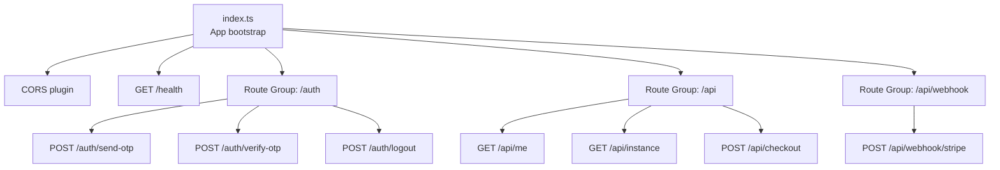
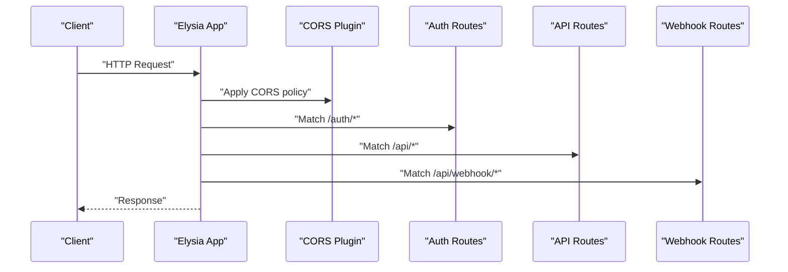
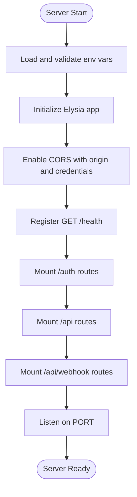
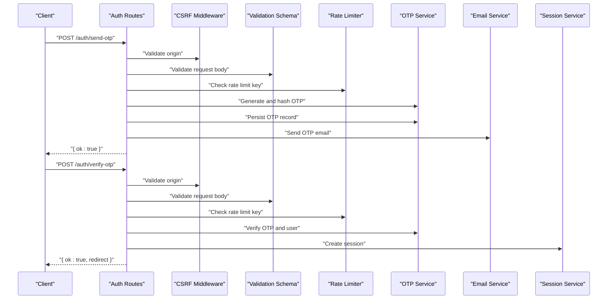
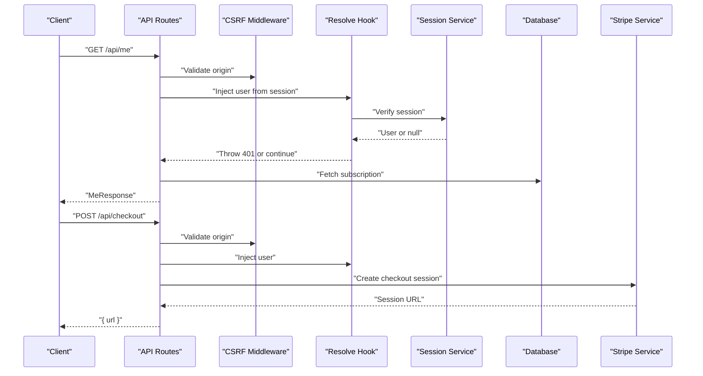
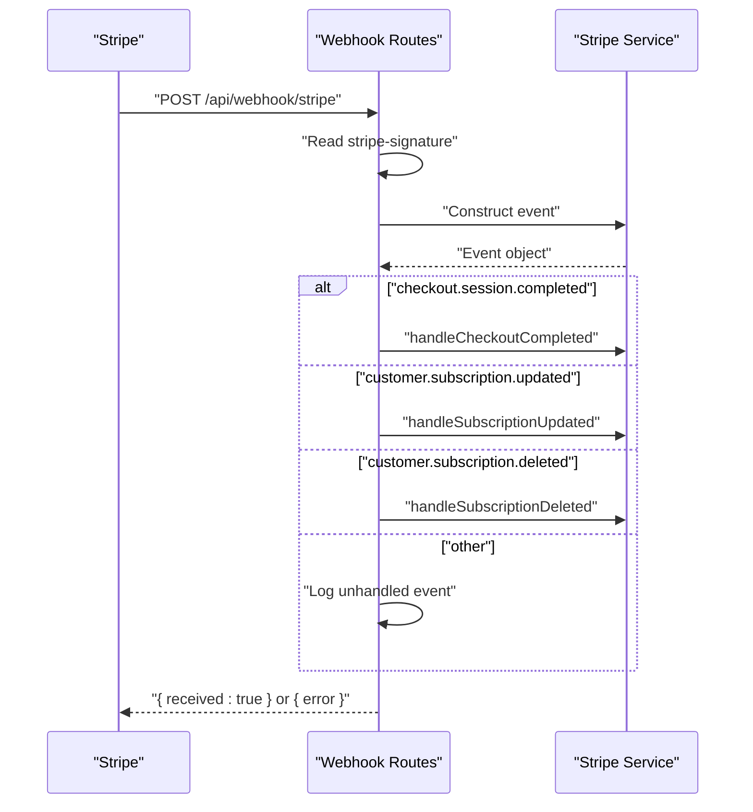
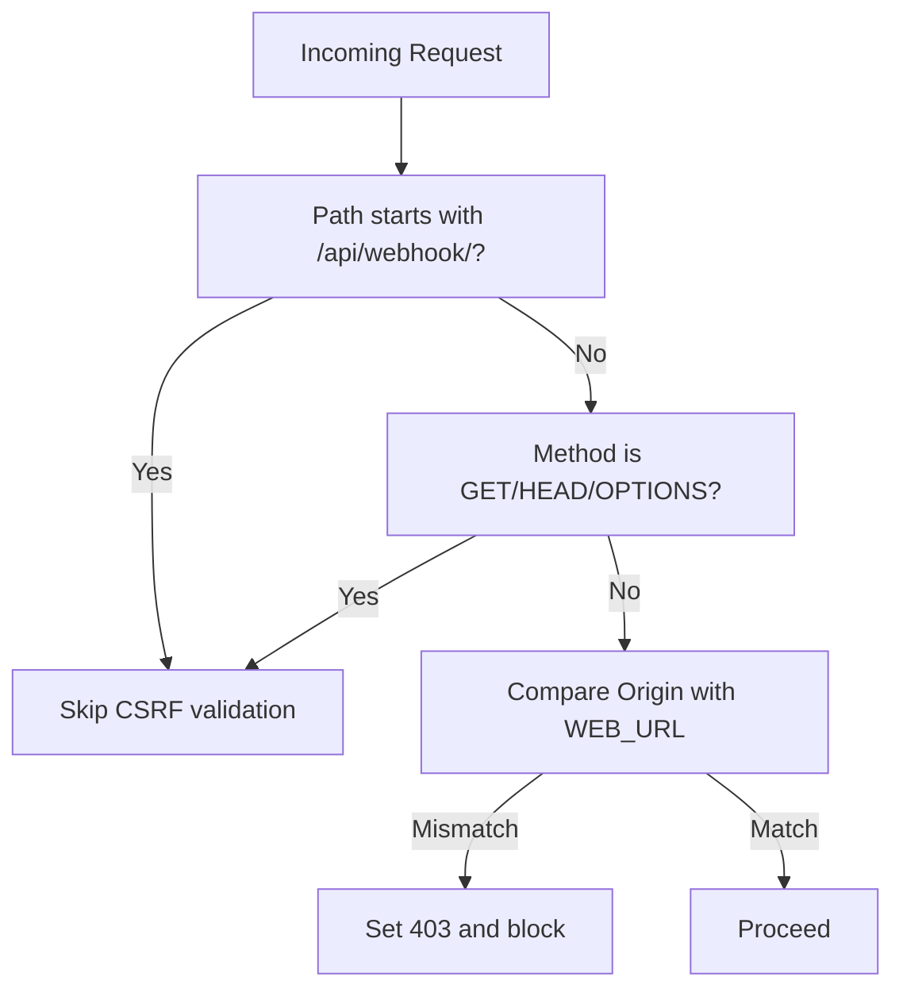
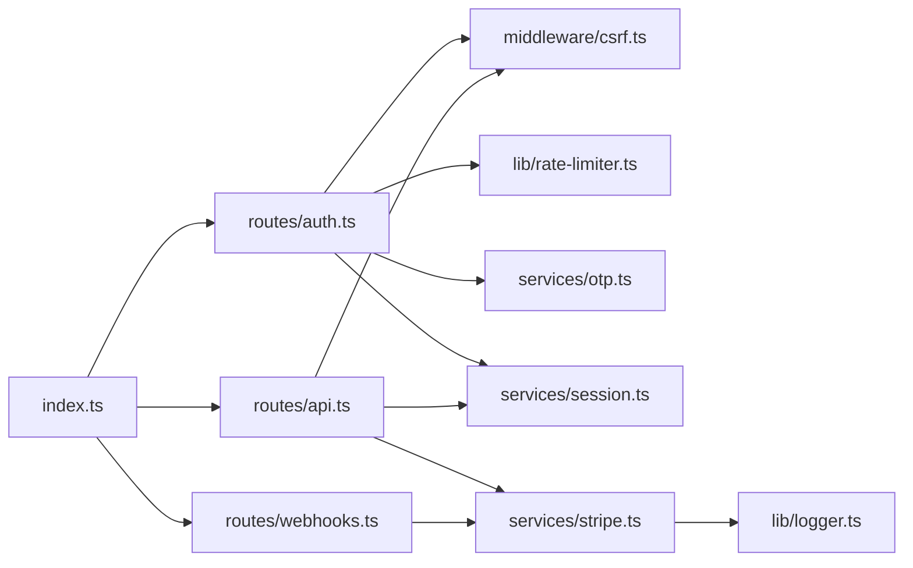

# API Routing & Middleware

<cite>
**Referenced Files in This Document**
- [packages/api/src/index.ts](file://packages/api/src/index.ts)
- [packages/api/src/routes/auth.ts](file://packages/api/src/routes/auth.ts)
- [packages/api/src/routes/api.ts](file://packages/api/src/routes/api.ts)
- [packages/api/src/routes/webhooks.ts](file://packages/api/src/routes/webhooks.ts)
- [packages/api/src/middleware/csrf.ts](file://packages/api/src/middleware/csrf.ts)
- [packages/api/src/lib/rate-limiter.ts](file://packages/api/src/lib/rate-limiter.ts)
- [packages/api/src/lib/logger.ts](file://packages/api/src/lib/logger.ts)
- [packages/api/src/services/otp.ts](file://packages/api/src/services/otp.ts)
- [packages/api/src/services/session.ts](file://packages/api/src/services/session.ts)
- [packages/api/src/services/stripe.ts](file://packages/api/src/services/stripe.ts)
</cite>

## Table of Contents
1. [Introduction](#introduction)
2. [Project Structure](#project-structure)
3. [Core Components](#core-components)
4. [Architecture Overview](#architecture-overview)
5. [Detailed Component Analysis](#detailed-component-analysis)
6. [Dependency Analysis](#dependency-analysis)
7. [Performance Considerations](#performance-considerations)
8. [Troubleshooting Guide](#troubleshooting-guide)
9. [Conclusion](#conclusion)
10. [Appendices](#appendices)

## Introduction
This document explains the Elysia-based API routing architecture and middleware implementation for the SparkClaw project. It covers the application entry point, CORS configuration, health check endpoint, and modular route registration patterns for authentication, API, and webhook endpoints. It also documents middleware behavior (CORS, CSRF protection, request validation), parameter handling, response formatting, error propagation, and security-related concerns such as rate limiting and access control. Guidance is included for extending the routing system and adding new endpoints following established patterns.

## Project Structure
The API server is implemented under the packages/api module. The primary entry point initializes the Elysia app, configures CORS, registers health checks, and mounts route groups. Route groups are organized by domain:
- Authentication routes under /auth
- Protected API routes under /api
- Webhook routes under /api/webhook

**Diagram sources**
- [packages/api/src/index.ts](file://packages/api/src/index.ts#L11-L20)
- [packages/api/src/routes/auth.ts](file://packages/api/src/routes/auth.ts#L19-L79)
- [packages/api/src/routes/api.ts](file://packages/api/src/routes/api.ts#L11-L85)
- [packages/api/src/routes/webhooks.ts](file://packages/api/src/routes/webhooks.ts#L5-L48)

**Section sources**
- [packages/api/src/index.ts](file://packages/api/src/index.ts#L1-L25)

## Core Components
- Application entry point: Initializes Elysia, validates environment, sets CORS, registers health check, and mounts route groups.
- Route groups: Modularized under /auth, /api, and /api/webhook with consistent middleware and error handling.
- Middleware: CSRF guard applied to most mutating endpoints; rate limiter used for OTP flows; resolve/onError for session-based authentication.
- Services: OTP generation and verification, session lifecycle, Stripe checkout and webhook handling, logging utilities.

**Section sources**
- [packages/api/src/index.ts](file://packages/api/src/index.ts#L1-L25)
- [packages/api/src/routes/auth.ts](file://packages/api/src/routes/auth.ts#L1-L80)
- [packages/api/src/routes/api.ts](file://packages/api/src/routes/api.ts#L1-L86)
- [packages/api/src/routes/webhooks.ts](file://packages/api/src/routes/webhooks.ts#L1-L49)
- [packages/api/src/middleware/csrf.ts](file://packages/api/src/middleware/csrf.ts#L1-L16)
- [packages/api/src/lib/rate-limiter.ts](file://packages/api/src/lib/rate-limiter.ts#L1-L59)
- [packages/api/src/lib/logger.ts](file://packages/api/src/lib/logger.ts#L1-L34)

## Architecture Overview
The server composes middleware and plugins globally, then mounts route groups. Each group encapsulates domain-specific behavior and applies shared middleware. The API group enforces authentication via a resolve hook and centralized error handler.

**Diagram sources**
- [packages/api/src/index.ts](file://packages/api/src/index.ts#L11-L20)
- [packages/api/src/routes/auth.ts](file://packages/api/src/routes/auth.ts#L19-L79)
- [packages/api/src/routes/api.ts](file://packages/api/src/routes/api.ts#L11-L85)
- [packages/api/src/routes/webhooks.ts](file://packages/api/src/routes/webhooks.ts#L5-L48)

## Detailed Component Analysis

### Application Entry Point and CORS
- Validates environment variables and starts the server on the configured port.
- Applies @elysiajs/cors with origin from WEB_URL and credentials enabled.
- Registers a GET /health endpoint returning a simple health status.
- Mounts route groups for auth, API, and webhooks.

**Diagram sources**
- [packages/api/src/index.ts](file://packages/api/src/index.ts#L9-L20)

**Section sources**
- [packages/api/src/index.ts](file://packages/api/src/index.ts#L1-L25)

### Authentication Routes (/auth/*)
- Prefix: /auth
- Middleware: CSRF protection applied to all mutating endpoints except the webhook prefix.
- Endpoints:
  - POST /auth/send-otp: Validates payload against a schema, rate limits per IP+email, generates and hashes OTP, stores record, and sends email.
  - POST /auth/verify-otp: Validates payload, rate limits, verifies OTP and expiration, creates a session, and sets a secure session cookie.
  - POST /auth/logout: Deletes session and clears cookie.

**Diagram sources**
- [packages/api/src/routes/auth.ts](file://packages/api/src/routes/auth.ts#L19-L79)
- [packages/api/src/middleware/csrf.ts](file://packages/api/src/middleware/csrf.ts#L3-L15)
- [packages/api/src/lib/rate-limiter.ts](file://packages/api/src/lib/rate-limiter.ts#L5-L58)
- [packages/api/src/services/otp.ts](file://packages/api/src/services/otp.ts#L6-L58)

**Section sources**
- [packages/api/src/routes/auth.ts](file://packages/api/src/routes/auth.ts#L1-L80)
- [packages/api/src/lib/rate-limiter.ts](file://packages/api/src/lib/rate-limiter.ts#L1-L59)
- [packages/api/src/services/otp.ts](file://packages/api/src/services/otp.ts#L1-L59)

### API Routes (/api/*)
- Prefix: /api
- Middleware: CSRF protection applied to all mutating endpoints.
- Authentication: A resolve hook reads the session cookie, verifies it via the session service, and injects the user into context; onError maps unauthorized errors to 401 responses.
- Endpoints:
  - GET /api/me: Returns user profile and subscription details derived from database queries.
  - GET /api/instance: Returns the user’s instance with related subscription data.
  - POST /api/checkout: Validates plan, creates a Stripe checkout session, and returns the session URL.

**Diagram sources**
- [packages/api/src/routes/api.ts](file://packages/api/src/routes/api.ts#L11-L85)
- [packages/api/src/middleware/csrf.ts](file://packages/api/src/middleware/csrf.ts#L3-L15)
- [packages/api/src/services/session.ts](file://packages/api/src/services/session.ts#L23-L38)
- [packages/api/src/services/stripe.ts](file://packages/api/src/services/stripe.ts#L28-L43)

**Section sources**
- [packages/api/src/routes/api.ts](file://packages/api/src/routes/api.ts#L1-L86)
- [packages/api/src/services/session.ts](file://packages/api/src/services/session.ts#L1-L43)
- [packages/api/src/services/stripe.ts](file://packages/api/src/services/stripe.ts#L1-L107)

### Webhook Routes (/api/webhook/*)
- Prefix: /api/webhook
- Endpoint: POST /api/webhook/stripe
  - Reads Stripe signature header.
  - Constructs Stripe event using webhook secret.
  - Dispatches to handlers based on event type (checkout session completed, subscription updated, subscription deleted).
  - Logs unhandled events and returns appropriate statuses; wraps processing errors with 500.

**Diagram sources**
- [packages/api/src/routes/webhooks.ts](file://packages/api/src/routes/webhooks.ts#L5-L48)
- [packages/api/src/services/stripe.ts](file://packages/api/src/services/stripe.ts#L20-L26)
- [packages/api/src/services/stripe.ts](file://packages/api/src/services/stripe.ts#L45-L106)

**Section sources**
- [packages/api/src/routes/webhooks.ts](file://packages/api/src/routes/webhooks.ts#L1-L49)
- [packages/api/src/services/stripe.ts](file://packages/api/src/services/stripe.ts#L1-L107)

### Middleware Implementation
- CSRF Protection:
  - Applied as a named plugin to route groups.
  - Skips validation for the webhook path and safe methods.
  - Enforces origin equality against WEB_URL for unsafe methods.
- Rate Limiting:
  - Lightweight in-memory sliding window implementation.
  - Used in OTP flows to throttle send and verify operations.
- Logging:
  - Structured logger with JSON output for info, warn, and error levels.

**Diagram sources**
- [packages/api/src/middleware/csrf.ts](file://packages/api/src/middleware/csrf.ts#L3-L15)

**Section sources**
- [packages/api/src/middleware/csrf.ts](file://packages/api/src/middleware/csrf.ts#L1-L16)
- [packages/api/src/lib/rate-limiter.ts](file://packages/api/src/lib/rate-limiter.ts#L1-L59)
- [packages/api/src/lib/logger.ts](file://packages/api/src/lib/logger.ts#L1-L34)

### Parameter Handling and Response Formatting
- Validation:
  - Zod schemas are used to parse and validate request bodies; invalid inputs return 400 with an error object.
- Authentication:
  - Session token extracted from cookies; missing or invalid tokens cause 401 responses via resolve and onError.
- Responses:
  - Consistent object shape with either a data payload or an error object.
  - Redirect hints returned for auth flows where applicable.

**Section sources**
- [packages/api/src/routes/auth.ts](file://packages/api/src/routes/auth.ts#L21-L26)
- [packages/api/src/routes/auth.ts](file://packages/api/src/routes/auth.ts#L41-L46)
- [packages/api/src/routes/api.ts](file://packages/api/src/routes/api.ts#L28-L33)
- [packages/api/src/routes/api.ts](file://packages/api/src/routes/api.ts#L34-L54)
- [packages/api/src/routes/api.ts](file://packages/api/src/routes/api.ts#L76-L81)

### Error Propagation
- Centralized error handling in the API group maps specific unauthorized messages to 401 responses.
- Route-level handlers set status codes and return structured error objects for validation failures and rate-limit hits.
- Webhook processing catches exceptions and logs them while responding with 500.

**Section sources**
- [packages/api/src/routes/api.ts](file://packages/api/src/routes/api.ts#L28-L33)
- [packages/api/src/routes/auth.ts](file://packages/api/src/routes/auth.ts#L24-L32)
- [packages/api/src/routes/auth.ts](file://packages/api/src/routes/auth.ts#L45-L52)
- [packages/api/src/routes/webhooks.ts](file://packages/api/src/routes/webhooks.ts#L37-L44)

## Dependency Analysis
The routing architecture exhibits clear separation of concerns:
- Entry point depends on route groups and CORS plugin.
- Route groups depend on middleware and services.
- Services depend on database and external SDKs.

**Diagram sources**
- [packages/api/src/index.ts](file://packages/api/src/index.ts#L1-L25)
- [packages/api/src/routes/auth.ts](file://packages/api/src/routes/auth.ts#L1-L80)
- [packages/api/src/routes/api.ts](file://packages/api/src/routes/api.ts#L1-L86)
- [packages/api/src/routes/webhooks.ts](file://packages/api/src/routes/webhooks.ts#L1-L49)
- [packages/api/src/middleware/csrf.ts](file://packages/api/src/middleware/csrf.ts#L1-L16)
- [packages/api/src/lib/rate-limiter.ts](file://packages/api/src/lib/rate-limiter.ts#L1-L59)
- [packages/api/src/services/otp.ts](file://packages/api/src/services/otp.ts#L1-L59)
- [packages/api/src/services/session.ts](file://packages/api/src/services/session.ts#L1-L43)
- [packages/api/src/services/stripe.ts](file://packages/api/src/services/stripe.ts#L1-L107)
- [packages/api/src/lib/logger.ts](file://packages/api/src/lib/logger.ts#L1-L34)

**Section sources**
- [packages/api/src/index.ts](file://packages/api/src/index.ts#L1-L25)
- [packages/api/src/routes/auth.ts](file://packages/api/src/routes/auth.ts#L1-L80)
- [packages/api/src/routes/api.ts](file://packages/api/src/routes/api.ts#L1-L86)
- [packages/api/src/routes/webhooks.ts](file://packages/api/src/routes/webhooks.ts#L1-L49)

## Performance Considerations
- Rate limiter uses an in-memory store with periodic cleanup; suitable for single-instance deployments. For horizontal scaling, consider a distributed store.
- Resolve hooks run per request; keep logic lightweight and delegate to services.
- Stripe webhook processing is fire-and-forget for provisioning; ensure idempotency and robust retry strategies externally if needed.
- Logging writes to stdout/stderr; ensure container logging pipelines are configured appropriately.

[No sources needed since this section provides general guidance]

## Troubleshooting Guide
- CORS issues:
  - Verify WEB_URL matches the frontend origin and credentials are enabled.
- CSRF failures:
  - Confirm the Origin header equals WEB_URL for unsafe methods; webhook path is excluded.
- Authentication errors:
  - Ensure session cookie is present and valid; check resolve and onError behavior for 401 responses.
- Rate limiting:
  - Inspect rate limiter keys derived from IP and email; verify window and max requests align with configuration.
- Webhooks:
  - Validate stripe-signature header and webhook secret; check logs for processing errors.

**Section sources**
- [packages/api/src/index.ts](file://packages/api/src/index.ts#L12-L15)
- [packages/api/src/middleware/csrf.ts](file://packages/api/src/middleware/csrf.ts#L8-L14)
- [packages/api/src/routes/api.ts](file://packages/api/src/routes/api.ts#L13-L27)
- [packages/api/src/lib/rate-limiter.ts](file://packages/api/src/lib/rate-limiter.ts#L17-L34)
- [packages/api/src/routes/webhooks.ts](file://packages/api/src/routes/webhooks.ts#L6-L21)

## Conclusion
The API employs a clean, modular routing architecture with Elysia, enforcing consistent middleware policies (CORS, CSRF, rate limiting) and robust error handling. The /auth, /api, and /api/webhook groups encapsulate distinct domains, enabling straightforward extension. Following the established patterns—schema-driven validation, resolve hooks for authentication, and centralized error handling—will ensure maintainability and security as new endpoints are added.

[No sources needed since this section summarizes without analyzing specific files]

## Appendices

### Extending the Routing System
- Add a new route group:
  - Create a new Elysia instance with a prefix and mount it in the entry point.
  - Apply shared middleware and resolve hooks as needed.
- Add a new endpoint:
  - Choose the appropriate group (/auth, /api, or /api/webhook).
  - Validate inputs with Zod schemas; set status codes and return structured responses.
  - Integrate with services and persist data via database helpers.
- Security considerations:
  - Apply CSRF protection to mutating endpoints.
  - Enforce authentication via resolve hooks and onError mapping.
  - Use rate limiting for sensitive operations (e.g., OTP send/verify).
  - Log webhook processing outcomes and errors.

[No sources needed since this section provides general guidance]