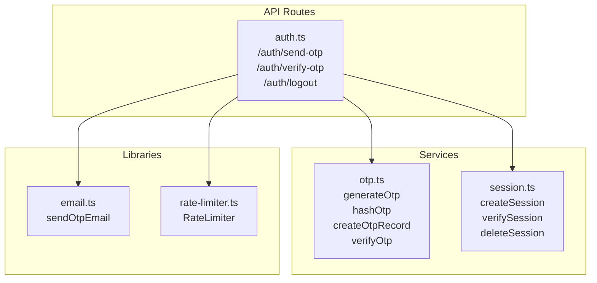
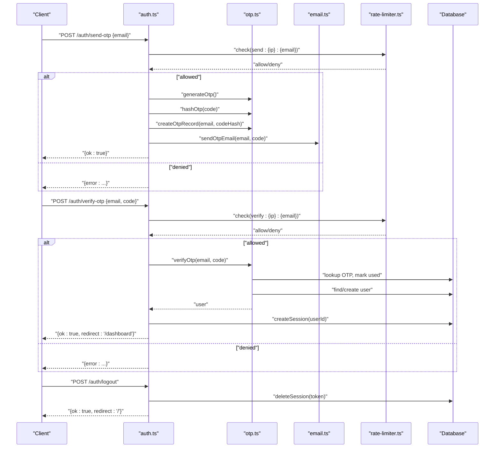
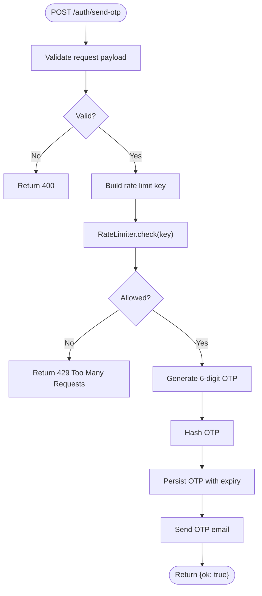
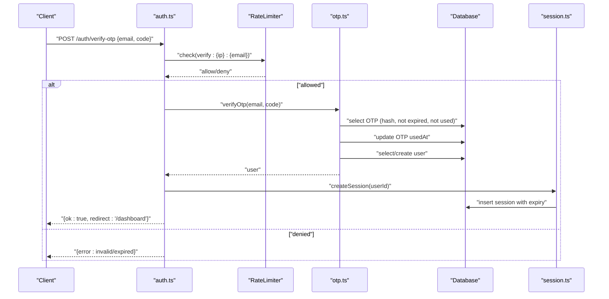
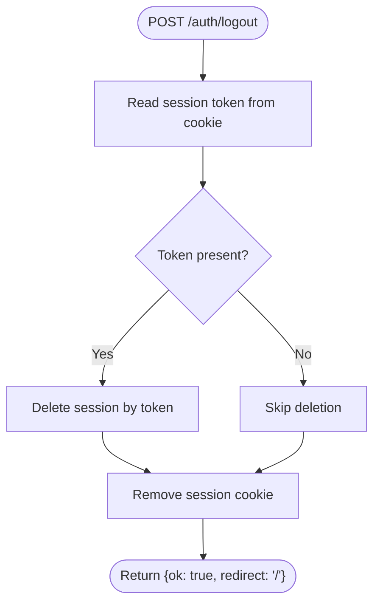
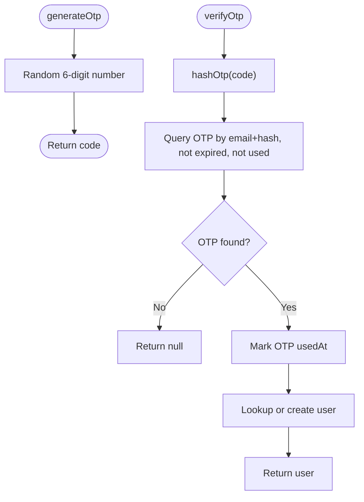
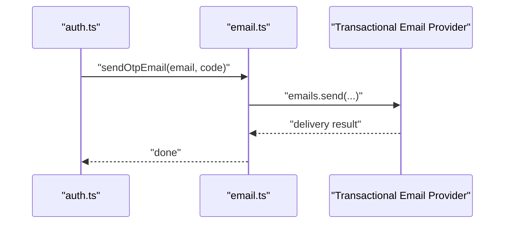
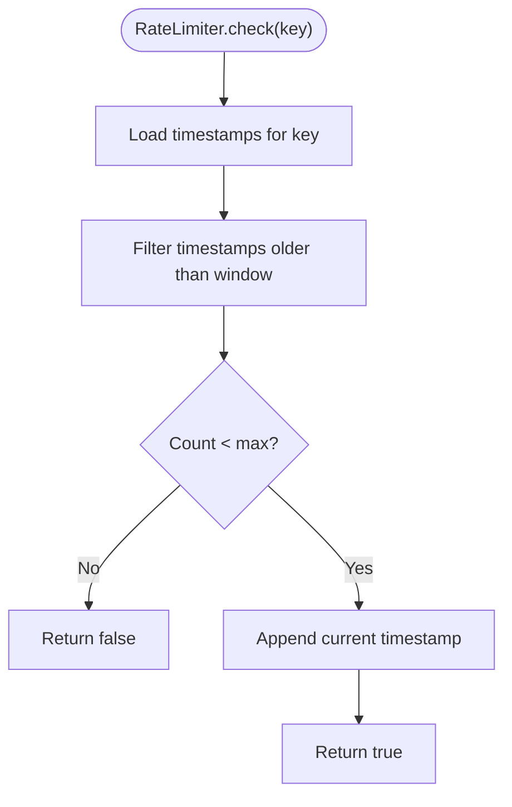
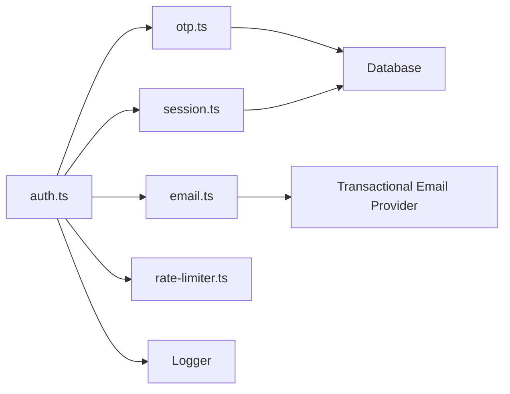

# Authentication Service

<cite>
**Referenced Files in This Document**
- [auth.ts](file://packages/api/src/routes/auth.ts)
- [otp.ts](file://packages/api/src/services/otp.ts)
- [session.ts](file://packages/api/src/services/session.ts)
- [email.ts](file://packages/api/src/lib/email.ts)
- [rate-limiter.ts](file://packages/api/src/lib/rate-limiter.ts)
- [otp.test.ts](file://packages/api/src/services/__tests__/otp.test.ts)
</cite>

## Table of Contents
1. [Introduction](#introduction)
2. [Project Structure](#project-structure)
3. [Core Components](#core-components)
4. [Architecture Overview](#architecture-overview)
5. [Detailed Component Analysis](#detailed-component-analysis)
6. [Dependency Analysis](#dependency-analysis)
7. [Performance Considerations](#performance-considerations)
8. [Troubleshooting Guide](#troubleshooting-guide)
9. [Conclusion](#conclusion)
10. [Appendices](#appendices)

## Introduction
This document describes the authentication service implementation with OTP-based login, session management, rate limiting, and email delivery. It covers the send-OTP and verify-OTP endpoints, OTP generation and hashing, expiration handling, cookie-based session lifecycle, logout, and integration with the email provider. It also documents request/response schemas, error handling patterns, and security considerations, along with practical workflows and troubleshooting guidance.

## Project Structure
The authentication service is implemented in the API package with focused modules:
- Route handlers for authentication endpoints
- OTP service for generation, hashing, persistence, and verification
- Session service for token generation, verification, and deletion
- Email library for OTP delivery via a transactional provider
- In-memory rate limiter for abuse prevention
- Tests validating OTP generation and hashing behavior



**Diagram sources**
- [auth.ts](file://packages/api/src/routes/auth.ts#L1-L80)
- [otp.ts](file://packages/api/src/services/otp.ts#L1-L59)
- [session.ts](file://packages/api/src/services/session.ts#L1-L43)
- [email.ts](file://packages/api/src/lib/email.ts#L1-L34)
- [rate-limiter.ts](file://packages/api/src/lib/rate-limiter.ts#L1-L59)

**Section sources**
- [auth.ts](file://packages/api/src/routes/auth.ts#L1-L80)

## Core Components
- Authentication routes module exposes three endpoints under /auth:
  - POST /auth/send-otp: Validates input, enforces rate limits, generates a 6-digit OTP, stores a hashed OTP, and sends an email.
  - POST /auth/verify-otp: Validates input, enforces rate limits, verifies the OTP against stored records, marks OTP as used, ensures a user record exists, creates a session, and sets a secure session cookie.
  - POST /auth/logout: Reads the session token from the cookie, deletes the session from storage, and removes the cookie.
- OTP service:
  - Generates a cryptographically random 6-digit code.
  - Hashes the OTP using a cryptographic digest.
  - Persists OTP with expiry and marks as unused.
  - Verifies OTP by matching hash, ensuring not expired and not yet used, then marks as used and returns the associated user.
- Session service:
  - Generates a random session token.
  - Creates a session record with an expiry date.
  - Verifies a session by checking token and expiry, returning the associated user.
  - Deletes a session by token.
- Email service:
  - Sends a transactional OTP email via a provider with a simple HTML template.
- Rate limiter:
  - In-memory sliding-window limiter keyed per endpoint, IP, and email.
  - Periodic cleanup of stale entries.

**Section sources**
- [auth.ts](file://packages/api/src/routes/auth.ts#L19-L80)
- [otp.ts](file://packages/api/src/services/otp.ts#L6-L59)
- [session.ts](file://packages/api/src/services/session.ts#L6-L43)
- [email.ts](file://packages/api/src/lib/email.ts#L13-L34)
- [rate-limiter.ts](file://packages/api/src/lib/rate-limiter.ts#L5-L59)

## Architecture Overview
The authentication flow integrates route handlers, services, and external systems.



**Diagram sources**
- [auth.ts](file://packages/api/src/routes/auth.ts#L21-L79)
- [otp.ts](file://packages/api/src/services/otp.ts#L19-L58)
- [email.ts](file://packages/api/src/lib/email.ts#L13-L34)
- [rate-limiter.ts](file://packages/api/src/lib/rate-limiter.ts#L17-L34)
- [session.ts](file://packages/api/src/services/session.ts#L13-L42)

## Detailed Component Analysis

### Send OTP Endpoint (/auth/send-otp)
- Input validation: Uses a schema to ensure a valid email field.
- Rate limiting: Sliding window keyed by client IP and email address.
- OTP generation and storage:
  - Generates a 6-digit numeric code.
  - Hashes the code using a cryptographic digest.
  - Inserts a record with expiry and current timestamp.
- Email delivery: Sends a transactional email containing the OTP.
- Response: Returns a success indicator upon completion.



**Diagram sources**
- [auth.ts](file://packages/api/src/routes/auth.ts#L21-L40)
- [otp.ts](file://packages/api/src/services/otp.ts#L6-L25)
- [email.ts](file://packages/api/src/lib/email.ts#L13-L34)
- [rate-limiter.ts](file://packages/api/src/lib/rate-limiter.ts#L17-L34)

**Section sources**
- [auth.ts](file://packages/api/src/routes/auth.ts#L21-L40)
- [otp.ts](file://packages/api/src/services/otp.ts#L6-L25)
- [email.ts](file://packages/api/src/lib/email.ts#L13-L34)
- [rate-limiter.ts](file://packages/api/src/lib/rate-limiter.ts#L17-L34)

### Verify OTP Endpoint (/auth/verify-otp)
- Input validation: Ensures email and code are present and formatted correctly.
- Rate limiting: Sliding window keyed by client IP and email address.
- OTP verification:
  - Hashes the provided code.
  - Queries the OTP record by email and hash, ensuring it is unexpired and unused.
  - Marks the OTP as used upon successful verification.
  - Retrieves or creates a user record linked to the email.
- Session creation:
  - Generates a session token and persists it with an expiry.
  - Sets a secure, HttpOnly session cookie with SameSite lax and path "/".
- Response: Returns success and a redirect to the dashboard.



**Diagram sources**
- [auth.ts](file://packages/api/src/routes/auth.ts#L41-L71)
- [otp.ts](file://packages/api/src/services/otp.ts#L27-L58)
- [session.ts](file://packages/api/src/services/session.ts#L13-L21)
- [rate-limiter.ts](file://packages/api/src/lib/rate-limiter.ts#L17-L34)

**Section sources**
- [auth.ts](file://packages/api/src/routes/auth.ts#L41-L71)
- [otp.ts](file://packages/api/src/services/otp.ts#L27-L58)
- [session.ts](file://packages/api/src/services/session.ts#L13-L21)

### Logout Endpoint (/auth/logout)
- Extracts the session token from the cookie.
- Deletes the session from storage if present.
- Removes the session cookie.
- Returns a success response and redirects to the home page.



**Diagram sources**
- [auth.ts](file://packages/api/src/routes/auth.ts#L72-L79)
- [session.ts](file://packages/api/src/services/session.ts#L40-L42)

**Section sources**
- [auth.ts](file://packages/api/src/routes/auth.ts#L72-L79)
- [session.ts](file://packages/api/src/services/session.ts#L40-L42)

### OTP Generation and Verification
- Generation: Produces a cryptographically random 6-digit numeric code.
- Hashing: Uses a cryptographic digest to hash the code before storage.
- Persistence: Stores the OTP with an expiry timestamp and unused flag.
- Verification: Matches the hash, checks expiry and unused status, marks as used, and links to a user.



**Diagram sources**
- [otp.ts](file://packages/api/src/services/otp.ts#L6-L58)

**Section sources**
- [otp.ts](file://packages/api/src/services/otp.ts#L6-L58)
- [otp.test.ts](file://packages/api/src/services/__tests__/otp.test.ts#L4-L34)

### Session Management
- Token generation: Uses a secure random generator to produce a session token.
- Creation: Inserts a session record with an expiry derived from a global constant.
- Verification: Confirms token validity and non-expiry, then loads the associated user.
- Deletion: Removes the session by token.

```mermaid
classDiagram
class SessionService {
+createSession(userId) Promise~{ token }~
+verifySession(token) Promise~User|null~
+deleteSession(token) Promise~void~
}
class Database {
+sessions
+users
}
SessionService --> Database : "insert/select/delete"
```

**Diagram sources**
- [session.ts](file://packages/api/src/services/session.ts#L13-L42)

**Section sources**
- [session.ts](file://packages/api/src/services/session.ts#L6-L43)

### Email Delivery
- Provider: Uses a transactional email provider to send OTP emails.
- Template: Sends a simple HTML email with the OTP and an expiration notice.
- Logging: Logs successful sends for observability.



**Diagram sources**
- [email.ts](file://packages/api/src/lib/email.ts#L13-L34)

**Section sources**
- [email.ts](file://packages/api/src/lib/email.ts#L13-L34)

### Rate Limiting
- Implementation: Sliding window with an in-memory store keyed by endpoint/IP/email.
- Behavior: Tracks timestamps within a window, rejects when exceeding the maximum per window, and periodically prunes old entries.
- Application: Enforced on both send-OTP and verify-OTP endpoints.



**Diagram sources**
- [rate-limiter.ts](file://packages/api/src/lib/rate-limiter.ts#L17-L52)

**Section sources**
- [rate-limiter.ts](file://packages/api/src/lib/rate-limiter.ts#L5-L59)
- [auth.ts](file://packages/api/src/routes/auth.ts#L10-L11)
- [auth.ts](file://packages/api/src/routes/auth.ts#L28-L32)
- [auth.ts](file://packages/api/src/routes/auth.ts#L48-L52)

## Dependency Analysis
The authentication routes depend on OTP, session, email, and rate limiter services. OTP and session services depend on database access. The email service depends on a provider SDK and logging infrastructure.



**Diagram sources**
- [auth.ts](file://packages/api/src/routes/auth.ts#L1-L80)
- [otp.ts](file://packages/api/src/services/otp.ts#L1-L59)
- [session.ts](file://packages/api/src/services/session.ts#L1-L43)
- [email.ts](file://packages/api/src/lib/email.ts#L1-L34)
- [rate-limiter.ts](file://packages/api/src/lib/rate-limiter.ts#L1-L59)

**Section sources**
- [auth.ts](file://packages/api/src/routes/auth.ts#L1-L80)
- [otp.ts](file://packages/api/src/services/otp.ts#L1-L59)
- [session.ts](file://packages/api/src/services/session.ts#L1-L43)
- [email.ts](file://packages/api/src/lib/email.ts#L1-L34)
- [rate-limiter.ts](file://packages/api/src/lib/rate-limiter.ts#L1-L59)

## Performance Considerations
- In-memory rate limiter:
  - Suitable for single-instance deployments; consider a distributed store (e.g., Redis) for horizontal scaling.
  - Cleanup runs periodically; ensure adequate frequency for high traffic.
- OTP hashing:
  - SHA-256 hashing is efficient; ensure database indexes on email, codeHash, and expiry for fast lookups.
- Session tokens:
  - Random token generation is secure; ensure database indexing on token and expiry.
- Email throughput:
  - External provider latency and rate limits apply; monitor delivery metrics and consider batching if needed.

[No sources needed since this section provides general guidance]

## Troubleshooting Guide
Common issues and resolutions:
- Invalid email format:
  - The send-OTP endpoint returns a 400 error when the payload fails schema validation.
- Too many requests:
  - Both endpoints return 429 when rate limits are exceeded; clients should retry after the window elapses.
- Invalid or expired OTP:
  - The verify-OTP endpoint returns 401 when the OTP is incorrect, expired, or already used.
- Session cookie not set:
  - Ensure SameSite, secure, and domain/path match the client’s origin; verify server environment configuration.
- Email delivery failures:
  - Check provider credentials and logs; confirm sender domain and reputation.

**Section sources**
- [auth.ts](file://packages/api/src/routes/auth.ts#L22-L26)
- [auth.ts](file://packages/api/src/routes/auth.ts#L29-L32)
- [auth.ts](file://packages/api/src/routes/auth.ts#L43-L46)
- [auth.ts](file://packages/api/src/routes/auth.ts#L49-L52)
- [auth.ts](file://packages/api/src/routes/auth.ts#L55-L58)
- [email.ts](file://packages/api/src/lib/email.ts#L13-L34)

## Conclusion
The authentication service provides a robust, layered approach to OTP-based login with strong security controls:
- Cryptographic OTP hashing and expiry enforcement.
- Secure, HttpOnly session cookies with configurable expiry.
- Built-in rate limiting to mitigate abuse.
- Transactional email delivery for OTP distribution.
- Clear error handling and observable behavior.

[No sources needed since this section summarizes without analyzing specific files]

## Appendices

### Request/Response Schemas
- Send OTP request:
  - Method: POST
  - Path: /auth/send-otp
  - Body: { email: string }
  - Responses:
    - 200: { ok: true }
    - 400: { error: string }
    - 429: { error: string }
- Verify OTP request:
  - Method: POST
  - Path: /auth/verify-otp
  - Body: { email: string, code: string }
  - Responses:
    - 200: { ok: true, redirect: string }
    - 400: { error: string }
    - 401: { error: string }
    - 429: { error: string }
- Logout request:
  - Method: POST
  - Path: /auth/logout
  - Body: empty
  - Responses:
    - 200: { ok: true, redirect: string }

**Section sources**
- [auth.ts](file://packages/api/src/routes/auth.ts#L21-L79)

### Security Considerations
- OTP storage:
  - Store only hashed OTPs; never plaintext.
  - Enforce expiry and one-time usage.
- Session cookies:
  - Use HttpOnly, secure, and SameSite lax.
  - Align cookie domain/path with the application’s deployment.
- Rate limiting:
  - Apply per-endpoint/IP/email keys; tune window and max requests for your workload.
- Transport:
  - Prefer HTTPS in production to protect cookies and API traffic.
- Secrets:
  - Keep provider credentials in environment variables; avoid embedding in code.

**Section sources**
- [otp.ts](file://packages/api/src/services/otp.ts#L11-L17)
- [otp.ts](file://packages/api/src/services/otp.ts#L27-L45)
- [auth.ts](file://packages/api/src/routes/auth.ts#L61-L68)
- [rate-limiter.ts](file://packages/api/src/lib/rate-limiter.ts#L17-L34)

### Example Workflows
- Successful login flow:
  1. Client submits email to /auth/send-otp.
  2. Server responds with success and sends an OTP email.
  3. Client receives OTP and submits {email, code} to /auth/verify-otp.
  4. Server validates OTP, creates a session, sets the cookie, and redirects to /dashboard.
- Logout flow:
  1. Client calls /auth/logout.
  2. Server deletes the session and clears the cookie, then redirects to /.

**Section sources**
- [auth.ts](file://packages/api/src/routes/auth.ts#L21-L79)
- [otp.ts](file://packages/api/src/services/otp.ts#L27-L58)
- [session.ts](file://packages/api/src/services/session.ts#L13-L21)