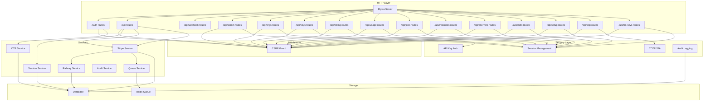
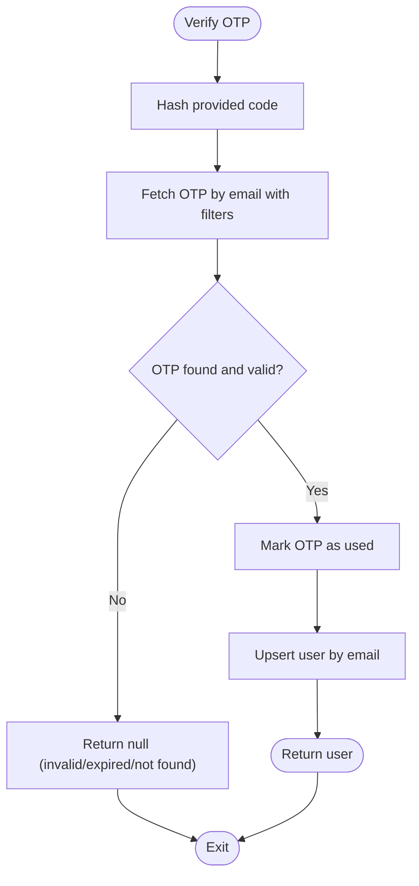
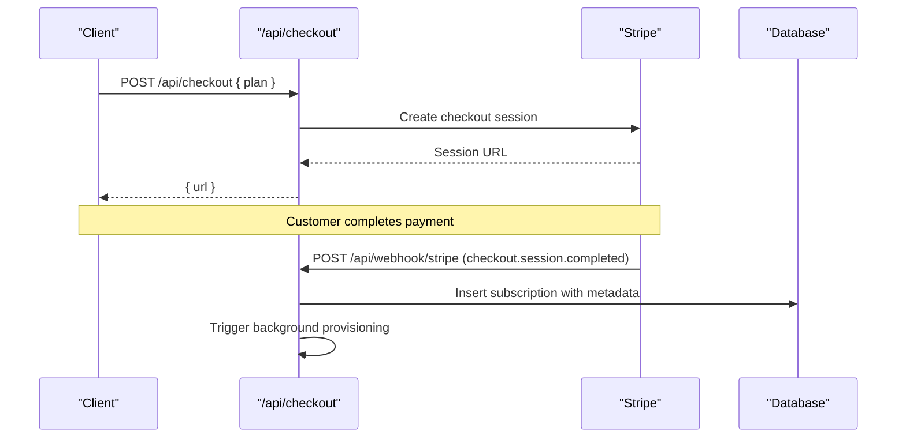
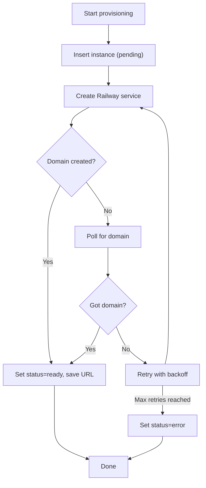
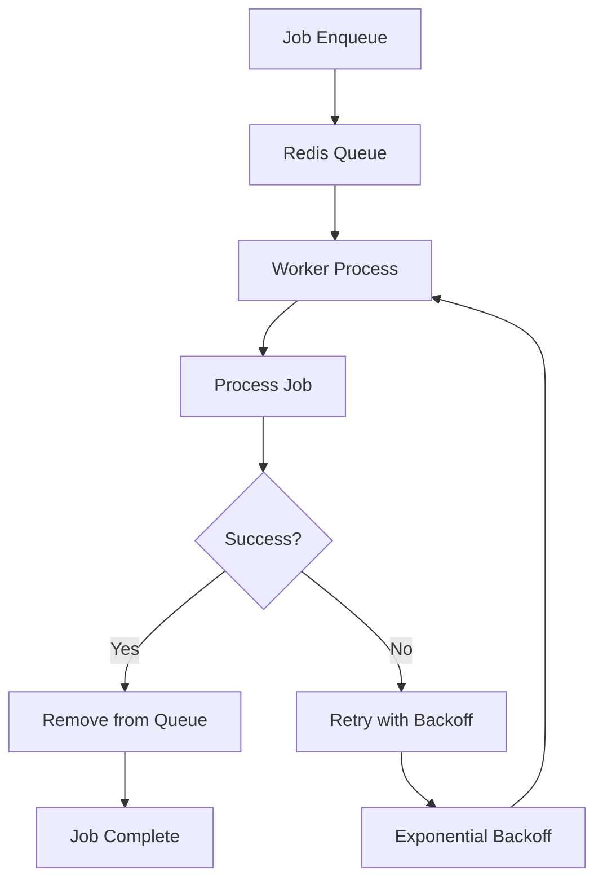
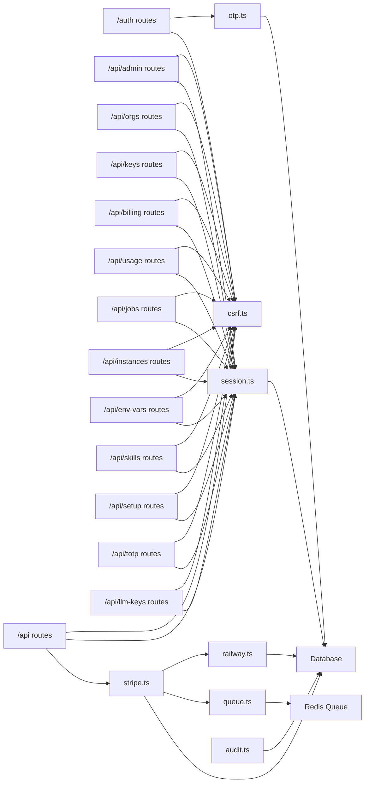

# Backend API (API)

<cite>
**Referenced Files in This Document**
- [packages/api/src/index.ts](file://packages/api/src/index.ts)
- [packages/api/src/routes/auth.ts](file://packages/api/src/routes/auth.ts)
- [packages/api/src/routes/api.ts](file://packages/api/src/routes/api.ts)
- [packages/api/src/routes/webhooks.ts](file://packages/api/src/routes/webhooks.ts)
- [packages/api/src/routes/admin.ts](file://packages/api/src/routes/admin.ts)
- [packages/api/src/routes/admin-audit.ts](file://packages/api/src/routes/admin-audit.ts)
- [packages/api/src/routes/api-keys.ts](file://packages/api/src/routes/api-keys.ts)
- [packages/api/src/routes/billing.ts](file://packages/api/src/routes/billing.ts)
- [packages/api/src/routes/orgs.ts](file://packages/api/src/routes/orgs.ts)
- [packages/api/src/routes/usage.ts](file://packages/api/src/routes/usage.ts)
- [packages/api/src/routes/scheduled-jobs.ts](file://packages/api/src/routes/scheduled-jobs.ts)
- [packages/api/src/routes/instance-actions.ts](file://packages/api/src/routes/instance-actions.ts)
- [packages/api/src/routes/env-vars.ts](file://packages/api/src/routes/env-vars.ts)
- [packages/api/src/routes/custom-skills.ts](file://packages/api/src/routes/custom-skills.ts)
- [packages/api/src/routes/setup.ts](file://packages/api/src/routes/setup.ts)
- [packages/api/src/routes/totp.ts](file://packages/api/src/routes/totp.ts)
- [packages/api/src/routes/llm-keys.ts](file://packages/api/src/routes/llm-keys.ts)
- [packages/api/src/middleware/csrf.ts](file://packages/api/src/middleware/csrf.ts)
- [packages/api/src/services/otp.ts](file://packages/api/src/services/otp.ts)
- [packages/api/src/services/stripe.ts](file://packages/api/src/services/stripe.ts)
- [packages/api/src/services/railway.ts](file://packages/api/src/services/railway.ts)
- [packages/api/src/services/session.ts](file://packages/api/src/services/session.ts)
- [packages/api/src/services/queue.ts](file://packages/api/src/services/queue.ts)
- [packages/api/src/services/audit.ts](file://packages/api/src/services/audit.ts)
- [packages/shared/src/constants.ts](file://packages/shared/src/constants.ts)
- [packages/shared/src/schemas.ts](file://packages/shared/src/schemas.ts)
- [packages/shared/src/types.ts](file://packages/shared/src/types.ts)
</cite>

## Update Summary
**Changes Made**
- Added comprehensive documentation for new administrative endpoints under /api/admin
- Documented team/organization management endpoints under /api/orgs
- Added API key management endpoints under /api/keys
- Expanded billing management endpoints under /api/billing
- Documented usage tracking endpoints under /api/usage
- Added scheduled jobs management under /api/jobs
- Documented instance actions and monitoring under /api/instances
- Added environment variables management under /api/env-vars
- Documented custom skills execution under /api/skills
- Added setup wizard endpoints under /api/setup
- Documented TOTP 2FA endpoints under /api/totp
- Added LLM keys management under /api/llm-keys
- Updated architecture diagrams to reflect expanded route structure
- Enhanced service layer documentation with new queue-based provisioning

## Table of Contents
1. [Introduction](#introduction)
2. [Project Structure](#project-structure)
3. [Core Components](#core-components)
4. [Architecture Overview](#architecture-overview)
5. [Detailed Component Analysis](#detailed-component-analysis)
6. [Dependency Analysis](#dependency-analysis)
7. [Performance Considerations](#performance-considerations)
8. [Troubleshooting Guide](#troubleshooting-guide)
9. [Conclusion](#conclusion)
10. [Appendices](#appendices)

## Introduction
This document provides comprehensive API documentation for the Elysia backend service. The API has undergone massive expansion with new routes for multi-instance management, security features, team management, and billing. It now covers:
- Authentication endpoints for OTP-based login
- Administrative management for user and instance oversight
- Team/organization management with member invitations and role management
- API key management for programmatic access control
- Billing management including subscription cancellation and account deletion
- Usage tracking and analytics
- Scheduled job management for automated tasks
- Instance lifecycle management with health monitoring and logs
- Environment variables management with encryption
- Custom skills execution with sandboxed environments
- Setup wizard for initial instance configuration
- Two-factor authentication with TOTP
- Large Language Model key management
- Middleware for CSRF protection and request validation
- Service integrations for OTP, Stripe, Railway, session management, and queue-based provisioning

## Project Structure
The API server is implemented using Elysia and organized into modular route groups and service layers. The expanded structure now includes dedicated endpoints for administration, team management, security, and operational management.

```mermaid
graph TB
A["index.ts<br/>Server bootstrap"] --> B["routes/auth.ts<br/>/auth/*"]
A --> C["routes/api.ts<br/>/api/*"]
A --> D["routes/webhooks.ts<br/>/api/webhook/*"]
A --> E["routes/admin.ts<br/>/api/admin/*"]
A --> F["routes/orgs.ts<br/>/api/orgs/*"]
A --> G["routes/api-keys.ts<br/>/api/keys/*"]
A --> H["routes/billing.ts<br/>/api/billing/*"]
A --> I["routes/usage.ts<br/>/api/usage/*"]
A --> J["routes/scheduled-jobs.ts<br/>/api/jobs/*"]
A --> K["routes/instance-actions.ts<br/>/api/instances/*"]
A --> L["routes/env-vars.ts<br/>/api/env-vars/*"]
A --> M["routes/custom-skills.ts<br/>/api/skills/*"]
A --> N["routes/setup.ts<br/>/api/setup/*"]
A --> O["routes/totp.ts<br/>/api/totp/*"]
A --> P["routes/llm-keys.ts<br/>/api/llm-keys/*"]
A --> Q["middleware/csrf.ts<br/>CSRF guard"]
B --> Q
C --> Q
E --> Q
F --> Q
G --> Q
H --> Q
I --> Q
J --> Q
K --> Q
L --> Q
M --> Q
N --> Q
O --> Q
P --> Q
A --> R["services/session.ts<br/>Session management"]
A --> S["services/stripe.ts<br/>Stripe checkout & webhooks"]
A --> T["services/railway.ts<br/>Instance provisioning"]
A --> U["services/queue.ts<br/>Background job processing"]
A --> V["services/audit.ts<br/>Audit logging"]
B --> W["services/otp.ts<br/>OTP generation & validation"]
A --> X["shared/constants.ts<br/>Rate limits, env keys"]
A --> Y["shared/schemas.ts<br/>Request validation"]
A --> Z["shared/types.ts<br/>Response models"]
```

**Diagram sources**
- [packages/api/src/index.ts](file://packages/api/src/index.ts#L1-L78)
- [packages/api/src/routes/admin.ts](file://packages/api/src/routes/admin.ts#L1-L254)
- [packages/api/src/routes/orgs.ts](file://packages/api/src/routes/orgs.ts#L1-L393)
- [packages/api/src/routes/api-keys.ts](file://packages/api/src/routes/api-keys.ts#L1-L119)
- [packages/api/src/routes/billing.ts](file://packages/api/src/routes/billing.ts#L1-L85)
- [packages/api/src/routes/usage.ts](file://packages/api/src/routes/usage.ts#L1-L111)
- [packages/api/src/routes/scheduled-jobs.ts](file://packages/api/src/routes/scheduled-jobs.ts#L1-L211)
- [packages/api/src/routes/instance-actions.ts](file://packages/api/src/routes/instance-actions.ts#L1-L170)
- [packages/api/src/routes/env-vars.ts](file://packages/api/src/routes/env-vars.ts#L1-L103)
- [packages/api/src/routes/custom-skills.ts](file://packages/api/src/routes/custom-skills.ts#L1-L173)
- [packages/api/src/routes/setup.ts](file://packages/api/src/routes/setup.ts#L1-L257)
- [packages/api/src/routes/totp.ts](file://packages/api/src/routes/totp.ts#L1-L254)
- [packages/api/src/routes/llm-keys.ts](file://packages/api/src/routes/llm-keys.ts#L1-L112)

**Section sources**
- [packages/api/src/index.ts](file://packages/api/src/index.ts#L1-L78)

## Core Components
- Server bootstrap initializes CORS, registers all route groups, and starts listening on the configured port
- Expanded route groups:
  - /auth: OTP send, verify, logout
  - /api: authenticated endpoints for user info, instance, and checkout
  - /api/admin: administrative dashboard and user management
  - /api/orgs: organization creation, member management, and invitations
  - /api/keys: API key lifecycle management
  - /api/billing: billing portal, subscription cancellation, and account deletion
  - /api/usage: usage tracking and analytics
  - /api/jobs: scheduled job management
  - /api/instances: instance actions, health monitoring, and logs
  - /api/env-vars: environment variable management with encryption
  - /api/skills: custom skills execution with sandboxing
  - /api/setup: setup wizard for instance configuration
  - /api/totp: two-factor authentication setup and verification
  - /api/llm-keys: LLM provider key management
  - /api/webhook: Stripe webhook handler
- Middleware:
  - CSRF protection for all non-webhook routes
  - Request validation via shared schemas
  - Session-based authorization guards
- Services:
  - OTP: generation, hashing, storage, and verification
  - Session: token generation, verification, deletion
  - Stripe: checkout session creation, webhook event handling, and background provisioning trigger
  - Railway: GraphQL-backed instance provisioning with retry and polling
  - Queue: BullMQ-based background job processing for provisioning
  - Audit: comprehensive audit logging for all administrative actions

**Section sources**
- [packages/api/src/index.ts](file://packages/api/src/index.ts#L36-L58)
- [packages/api/src/routes/admin.ts](file://packages/api/src/routes/admin.ts#L37-L254)
- [packages/api/src/routes/orgs.ts](file://packages/api/src/routes/orgs.ts#L22-L393)
- [packages/api/src/routes/api-keys.ts](file://packages/api/src/routes/api-keys.ts#L13-L119)
- [packages/api/src/routes/billing.ts](file://packages/api/src/routes/billing.ts#L12-L85)
- [packages/api/src/routes/usage.ts](file://packages/api/src/routes/usage.ts#L48-L111)
- [packages/api/src/routes/scheduled-jobs.ts](file://packages/api/src/routes/scheduled-jobs.ts#L45-L211)
- [packages/api/src/routes/instance-actions.ts](file://packages/api/src/routes/instance-actions.ts#L12-L170)
- [packages/api/src/routes/env-vars.ts](file://packages/api/src/routes/env-vars.ts#L11-L103)
- [packages/api/src/routes/custom-skills.ts](file://packages/api/src/routes/custom-skills.ts#L48-L173)
- [packages/api/src/routes/setup.ts](file://packages/api/src/routes/setup.ts#L23-L257)
- [packages/api/src/routes/totp.ts](file://packages/api/src/routes/totp.ts#L73-L254)
- [packages/api/src/routes/llm-keys.ts](file://packages/api/src/routes/llm-keys.ts#L13-L112)

## Architecture Overview
The API follows a layered architecture with expanded administrative and operational capabilities:
- Entry points: Elysia app registers all route groups and middleware
- Authentication: OTP-based login with rate limiting and CSRF protection
- Authorization: Session-based guard with role-based access control for admin functions
- Administrative layer: Comprehensive admin dashboard with user and instance management
- Team management: Organization-based collaboration with member invitations and role hierarchy
- Security layer: Multi-factor authentication, API key management, and audit logging
- Operational management: Instance lifecycle management, scheduled jobs, and usage tracking
- Integrations: Stripe for payments, Railway for instance provisioning, Redis for queue processing
- Background processing: BullMQ-based job queue for reliable provisioning and maintenance tasks

**Diagram sources**
- [packages/api/src/index.ts](file://packages/api/src/index.ts#L36-L58)
- [packages/api/src/routes/admin.ts](file://packages/api/src/routes/admin.ts#L37-L254)
- [packages/api/src/routes/orgs.ts](file://packages/api/src/routes/orgs.ts#L22-L393)
- [packages/api/src/routes/api-keys.ts](file://packages/api/src/routes/api-keys.ts#L13-L119)
- [packages/api/src/routes/billing.ts](file://packages/api/src/routes/billing.ts#L12-L85)
- [packages/api/src/routes/usage.ts](file://packages/api/src/routes/usage.ts#L48-L111)
- [packages/api/src/routes/scheduled-jobs.ts](file://packages/api/src/routes/scheduled-jobs.ts#L45-L211)
- [packages/api/src/routes/instance-actions.ts](file://packages/api/src/routes/instance-actions.ts#L12-L170)
- [packages/api/src/routes/env-vars.ts](file://packages/api/src/routes/env-vars.ts#L11-L103)
- [packages/api/src/routes/custom-skills.ts](file://packages/api/src/routes/custom-skills.ts#L48-L173)
- [packages/api/src/routes/setup.ts](file://packages/api/src/routes/setup.ts#L23-L257)
- [packages/api/src/routes/totp.ts](file://packages/api/src/routes/totp.ts#L73-L254)
- [packages/api/src/routes/llm-keys.ts](file://packages/api/src/routes/llm-keys.ts#L13-L112)

## Detailed Component Analysis

### Authentication Endpoints (/auth)
- /auth/send-otp
  - Validates email payload
  - Enforces rate limit keyed by IP and email
  - Generates 6-digit OTP, hashes it, stores expiry, and emails code
  - Returns success indicator
- /auth/verify-otp
  - Validates email+code payload
  - Enforces rate limit keyed by IP and email
  - Verifies OTP against stored hash and expiry
  - Creates user session and sets secure session cookie
  - Redirects to dashboard on success
- /auth/logout
  - Deletes session by token and clears cookie

Security and validation:
- CSRF protection enabled for all non-webhook routes
- Email and OTP code validated via shared schemas
- Rate limiting controlled by shared constants

Example payloads and responses:
- Send OTP request: { email: string }
  - Success response: { ok: true }
- Verify OTP request: { email: string, code: string }
  - Success response: { ok: true, redirect: "/dashboard" }
- Logout response: { ok: true, redirect: "/" }

Operational notes:
- Session cookie is HttpOnly, Secure (in production), SameSite lax, 30-day expiry
- OTP expiry is 5 minutes; verify attempts limited per 15-minute window

**Section sources**
- [packages/api/src/routes/auth.ts](file://packages/api/src/routes/auth.ts#L21-L79)
- [packages/api/src/middleware/csrf.ts](file://packages/api/src/middleware/csrf.ts#L4-L15)
- [packages/shared/src/schemas.ts](file://packages/shared/src/schemas.ts)
- [packages/shared/src/constants.ts](file://packages/shared/src/constants.ts#L16-L23)
- [packages/api/src/services/otp.ts](file://packages/api/src/services/otp.ts#L19-L58)
- [packages/api/src/services/session.ts](file://packages/api/src/services/session.ts#L13-L42)

### Administrative Management (/api/admin)
- /api/admin/stats
  - Requires admin role; returns system statistics including user counts, instance distribution, and subscription breakdown
  - Provides recent signup metrics for the last 7 days
- /api/admin/users
  - Lists users with pagination, search capability, and subscription/instance details
  - Supports filtering by email search terms
- /api/admin/instances
  - Lists instances with pagination and status filtering
  - Includes user and subscription information for each instance
- /api/admin/users/:id/role
  - Updates user roles (user/admin) with validation
  - Prevents invalid role assignments
- /api/admin/users/:id
  - Retrieves detailed user information including subscription and instance history
  - Returns comprehensive user profile data
- /api/admin/check
  - Checks if current user has admin privileges

Security and authorization:
- Admin-only endpoints with email whitelist configuration
- Role-based access control with explicit admin validation
- Comprehensive audit logging for all admin actions

Example payloads and responses:
- Get stats: GET /api/admin/stats
  - Response: { users: number, instances: number, subscriptions: number, instancesByStatus: object, subscriptionsByPlan: object, recentSignups: number }
- List users: GET /api/admin/users?page=1&search=john
  - Response: { users: UserListItem[], pagination: PaginationInfo }
- Update role: PATCH /api/admin/users/:id/role { role: "admin" }
  - Response: { success: true }

**Section sources**
- [packages/api/src/routes/admin.ts](file://packages/api/src/routes/admin.ts#L37-L254)
- [packages/shared/src/constants.ts](file://packages/shared/src/constants.ts#L10-L15)

### Team and Organization Management (/api/orgs)
- /api/orgs
  - GET: Lists user's organizations with member count and role
  - POST: Creates new organization with unique slug generation
- /api/orgs/:id
  - GET: Retrieves organization details with member count and role
- /api/orgs/:id/members
  - GET: Lists all organization members with email and role
- /api/orgs/:id/invite
  - POST: Sends invitation to join organization with role assignment
  - Supports owner/admin restrictions for invitations
- /api/orgs/invite/:token/accept
  - POST: Accepts invitation using token with expiration validation
- /api/orgs/:id/members/:memberId
  - PATCH: Updates member role with owner/admin restrictions
  - DELETE: Removes members with owner protection rules
- /api/orgs/:id
  - DELETE: Deletes organization (owner-only)

Security and validation:
- Role-based access control with owner/admin permissions
- Invitation token-based acceptance with 7-day expiration
- Member role hierarchy protection (owner cannot be modified/deleted)
- Comprehensive audit logging for all organization actions

Example payloads and responses:
- Create org: POST /api/orgs { name: string }
  - Response: OrgResponse with role, memberCount, createdAt
- Invite member: POST /api/orgs/:id/invite { email: string, role: "member" | "admin" }
  - Response: { invite: { id, email, role, token, expiresAt } }
- Update role: PATCH /api/orgs/:id/members/:memberId { role: "member" }
  - Response: { success: true }

**Section sources**
- [packages/api/src/routes/orgs.ts](file://packages/api/src/routes/orgs.ts#L22-L393)
- [packages/shared/src/schemas.ts](file://packages/shared/src/schemas.ts)

### API Key Management (/api/keys)
- /api/keys
  - GET: Lists user's API keys with metadata (name, scopes, expiration)
  - POST: Creates new API key with secure generation and encryption
  - DELETE: Removes API key with proper authorization
- Key generation includes:
  - Random key generation with prefix identification
  - SHA-256 hashing for secure storage
  - Optional expiration date configuration
  - Comprehensive audit logging

Security and validation:
- Session-based authorization for all key operations
- Input validation via Zod schemas
- Secure key transmission only on creation
- Comprehensive audit trail for key lifecycle events

Example payloads and responses:
- Create key: POST /api/keys { name: string, scopes: string[], expiresInDays?: number }
  - Response: Complete key object including generated key (returned only on creation)
- List keys: GET /api/keys
  - Response: Array of ApiKeyResponse objects with masked key prefixes

**Section sources**
- [packages/api/src/routes/api-keys.ts](file://packages/api/src/routes/api-keys.ts#L13-L119)
- [packages/shared/src/schemas.ts](file://packages/shared/src/schemas.ts)

### Billing Management (/api/billing)
- /api/billing/portal
  - Creates Stripe customer portal session for billing management
  - Requires existing Stripe customer relationship
- /api/billing/cancel
  - Cancels active subscription with validation
  - Suspends all user instances upon cancellation
  - Comprehensive audit logging and email notification
- /api/billing/account
  - Deletes user account with cascading data removal
  - Clears session cookies and sends confirmation email

Security and validation:
- Stripe integration for secure billing operations
- Session-based authorization for all billing actions
- Account deletion with irreversible data removal
- Email notifications for important billing events

Example payloads and responses:
- Create portal: POST /api/billing/portal
  - Response: { url: string } (billing portal URL)
- Cancel subscription: POST /api/billing/cancel
  - Response: { success: true }
- Delete account: DELETE /api/billing/account
  - Response: { success: true }

**Section sources**
- [packages/api/src/routes/billing.ts](file://packages/api/src/routes/billing.ts#L12-L85)
- [packages/api/src/services/stripe.ts](file://packages/api/src/services/stripe.ts#L1-L107)

### Usage Tracking (/api/usage)
- /api/usage
  - GET: Retrieves current month's usage summary with totals by usage type
  - Returns grouped usage records with instance associations
- /api/usage/history
  - GET: Retrieves historical usage data for specified months (1-24)
  - Returns chronological usage summaries with detailed breakdowns

Usage tracking includes:
- Monthly period calculation and grouping
- Usage type categorization and aggregation
- Instance association for detailed reporting
- Historical data spanning configurable time ranges

Example payloads and responses:
- Current usage: GET /api/usage
  - Response: UsageSummary with period, items array, and totals object
- Usage history: GET /api/usage/history?months=6
  - Response: { history: UsageSummary[] } for specified time range

**Section sources**
- [packages/api/src/routes/usage.ts](file://packages/api/src/routes/usage.ts#L48-L111)

### Scheduled Jobs Management (/api/jobs)
- /api/jobs
  - GET: Lists scheduled jobs with optional instance filtering
  - POST: Creates new scheduled job with cron expression validation
  - PATCH: Updates existing job properties (name, schedule, config, enabled)
  - DELETE: Removes scheduled job with ownership verification
- Job validation includes:
  - Cron expression parsing and validation
  - Task type enumeration support
  - Config object validation
  - Ownership verification for all operations

Security and validation:
- Instance ownership verification for all job operations
- Comprehensive input validation via Zod schemas
- Audit logging for all job lifecycle events
- Support for multiple scheduled task types

Example payloads and responses:
- Create job: POST /api/jobs { instanceId: string, name: string, cronExpression: string, taskType: string, config?: object }
  - Response: ScheduledJobResponse with computed nextRunAt and status fields
- Update job: PATCH /api/jobs/:id { enabled: boolean, cronExpression?: string }
  - Response: Updated ScheduledJobResponse

**Section sources**
- [packages/api/src/routes/scheduled-jobs.ts](file://packages/api/src/routes/scheduled-jobs.ts#L45-L211)
- [packages/shared/src/schemas.ts](file://packages/shared/src/schemas.ts)

### Instance Actions and Monitoring (/api/instances)
- /api/instances/:id/action
  - POST: Executes instance actions (start, stop, restart) with proxy forwarding
  - Validates instance ownership and URL availability
  - Updates instance status based on action outcome
- /api/instances/:id/health
  - GET: Comprehensive health check including API status, uptime, and channel status
  - Proxies health checks to underlying OpenClaw instance
  - Aggregates health metrics across all enabled channels
- /api/instances/:id/logs
  - GET: Retrieves instance logs with SSE streaming support
  - Supports both streaming (SSE) and regular JSON modes
  - Implements automatic polling with configurable intervals

Security and monitoring:
- Instance ownership verification for all operations
- Proxy authentication using instance-specific tokens
- Health monitoring with timeout protection
- Log streaming with automatic cleanup

Example payloads and responses:
- Action execution: POST /api/instances/:id/action { action: "start" | "stop" | "restart" }
  - Response: { success: true, action: string, status: string }
- Health check: GET /api/instances/:id/health
  - Response: HealthStatus with api, channels, and uptime metrics
- Logs streaming: GET /api/instances/:id/logs (SSE)
  - Response: Server-sent events stream of log entries

**Section sources**
- [packages/api/src/routes/instance-actions.ts](file://packages/api/src/routes/instance-actions.ts#L12-L170)

### Environment Variables Management (/api/env-vars)
- /api/env-vars
  - GET: Lists environment variables for specified instance with decryption
  - POST: Creates new environment variable with encryption
  - PATCH: Updates existing environment variable with encryption
  - DELETE: Removes environment variable with ownership verification
- Security features:
  - AES encryption for sensitive values
  - Secret masking in listings (shows asterisks for encrypted values)
  - Ownership verification for all operations
  - Audit logging for all variable operations

Example payloads and responses:
- List vars: GET /api/env-vars?instanceId=:id
  - Response: { vars: EnvVarItem[] } with decrypted values for non-secret variables
- Create var: POST /api/env-vars { instanceId: string, key: string, value: string, isSecret: boolean }
  - Response: { success: true, id: string }

**Section sources**
- [packages/api/src/routes/env-vars.ts](file://packages/api/src/routes/env-vars.ts#L11-L103)

### Custom Skills Execution (/api/skills)
- /api/skills
  - GET: Lists custom skills for specified instance with execution metadata
  - POST: Creates new custom skill with language-specific validation
  - PATCH: Updates skill configuration and code
  - DELETE: Removes skill with ownership verification
- /api/skills/:id/execute
  - POST: Executes skill in sandboxed environment with timeout protection
  - Supports TypeScript and Python execution
  - Updates execution statistics and logs
- Sandbox security:
  - Process isolation with timeout enforcement
  - Language-specific sandbox environments
  - Output and error capture with size limits
  - Execution status tracking (success, timeout, error)

Example payloads and responses:
- List skills: GET /api/skills?instanceId=:id
  - Response: { skills: SkillItem[] } with execution metadata
- Execute skill: POST /api/skills/:id/execute
  - Response: { success: boolean, output: string, error: string | null, duration: number }

**Section sources**
- [packages/api/src/routes/custom-skills.ts](file://packages/api/src/routes/custom-skills.ts#L48-L173)

### Setup Wizard (/api/setup)
- /api/setup/state
  - GET: Retrieves current setup wizard state for instance configuration
  - Returns step progress, instance details, and configuration data
- /api/setup/save
  - POST: Saves complete setup wizard data including AI configuration and feature flags
  - Updates instance with setup completion status
  - Configures OpenClaw instance with gateway token
- /api/setup/channel
  - POST: Saves channel credentials with encryption
  - Creates or updates channel configurations
- /api/setup/channel/:type/delete
  - DELETE: Removes channel configuration with instance ownership verification

Setup wizard features:
- Multi-step configuration process with progress tracking
- Channel credential management with encryption
- AI configuration and feature flag management
- Automatic OpenClaw instance configuration

Example payloads and responses:
- Get state: GET /api/setup/state?instanceId=:id
  - Response: SetupWizardState with step, instanceId, and setupData
- Save setup: POST /api/setup/save
  - Response: { success: true }

**Section sources**
- [packages/api/src/routes/setup.ts](file://packages/api/src/routes/setup.ts#L23-L257)

### Two-Factor Authentication (/api/totp)
- /api/totp/status
  - GET: Checks if TOTP is enabled for user
- /api/totp/setup
  - POST: Initiates TOTP setup with secret generation and backup codes
  - Returns secret, otpauth URI, and backup codes
- /api/totp/verify
  - POST: Verifies TOTP code and enables 2FA
  - Uses RFC 6238 compliant time-based authentication
- /api/totp/disable
  - POST: Disables TOTP after code verification
  - Requires current TOTP code for confirmation

Security features:
- RFC 6238 compliant TOTP implementation
- Base32 encoding for secrets
- 6-digit codes with 30-second validity windows
- Backup codes for recovery
- HMAC-SHA1 algorithm compliance

Example payloads and responses:
- Setup: POST /api/totp/setup
  - Response: { secret: string, otpauthUri: string, backupCodes: string[] }
- Verify: POST /api/totp/verify { code: string }
  - Response: { success: true }

**Section sources**
- [packages/api/src/routes/totp.ts](file://packages/api/src/routes/totp.ts#L73-L254)

### LLM Key Management (/api/llm-keys)
- /api/llm-keys
  - GET: Lists user's LLM provider keys with metadata
  - POST: Creates new LLM key with provider specification and encryption
  - DELETE: Removes LLM key with proper authorization
- Provider support includes major LLM platforms with standardized key management
- Security features:
  - AES encryption for API keys
  - Provider-specific key naming conventions
  - Usage tracking and audit logging

Example payloads and responses:
- List keys: GET /api/llm-keys
  - Response: Array of LlmKeyResponse with provider and name
- Create key: POST /api/llm-keys { provider: string, name: string, apiKey: string }
  - Response: LlmKeyResponse with creation metadata

**Section sources**
- [packages/api/src/routes/llm-keys.ts](file://packages/api/src/routes/llm-keys.ts#L13-L112)

### Subscription Management (/api)
- /api/me
  - Requires session; returns user profile and subscription status if present
  - Response shape defined by MeResponse
- /api/instance
  - Returns associated instance details or null if none exists
  - Response shape defined by InstanceResponse
- /api/checkout
  - Validates plan against allowed values
  - Creates Stripe checkout session and returns the session URL

Authorization and middleware:
- CSRF guard applied
- Centralized resolver verifies session and injects user into context
- Global error handler maps auth errors to 401

Stripe integration:
- Checkout sessions configured with success/cancel URLs and metadata
- Webhook handler triggers background provisioning after successful checkout

Example payloads and responses:
- Get user: GET /api/me
  - Response: MeResponse with nested subscription or null
- Get instance: GET /api/instance
  - Response: InstanceResponse or { instance: null }
- Create checkout: POST /api/checkout { plan: "starter" | "pro" | "scale" }
  - Response: { url: string }

**Section sources**
- [packages/api/src/routes/api.ts](file://packages/api/src/routes/api.ts#L13-L85)
- [packages/shared/src/types.ts](file://packages/shared/src/types.ts#L35-L55)
- [packages/shared/src/schemas.ts](file://packages/shared/src/schemas.ts)
- [packages/api/src/services/stripe.ts](file://packages/api/src/services/stripe.ts#L28-L43)

### Webhook Handlers (/api/webhook)
- /api/webhook/stripe
  - Reads Stripe signature header
  - Constructs Stripe event using webhook secret
  - Routes to appropriate handler based on event type
  - Logs unhandled events; returns 500 on processing errors

Supported events:
- checkout.session.completed: persists subscription and triggers background provisioning
- customer.subscription.updated: updates subscription status and period end
- customer.subscription.deleted: marks subscription canceled and suspends instance

Idempotency and reliability:
- Event processing is fire-and-forget for provisioning; failures logged
- Signature verification prevents spoofing

**Section sources**
- [packages/api/src/routes/webhooks.ts](file://packages/api/src/routes/webhooks.ts#L6-L48)
- [packages/api/src/services/stripe.ts](file://packages/api/src/services/stripe.ts#L45-L106)

### Middleware Implementation
- CSRF Protection
  - Blocks non-OPTIONS/GET/HEAD requests without matching Origin
  - Exempts /api/webhook paths
  - Origin enforced against configured WEB_URL

- Request Validation
  - Uses shared Zod schemas to parse and validate payloads
  - Returns 400 on validation failure

- Session Guard
  - Resolves user from session cookie for /api routes
  - Returns 401 for missing/expired tokens

- Admin Guard
  - Additional validation for /api/admin routes with role checking
  - Supports both role-based and email whitelist-based admin access

**Section sources**
- [packages/api/src/middleware/csrf.ts](file://packages/api/src/middleware/csrf.ts#L4-L15)
- [packages/api/src/routes/admin.ts](file://packages/api/src/routes/admin.ts#L13-L35)
- [packages/api/src/routes/api.ts](file://packages/api/src/routes/api.ts#L13-L33)
- [packages/shared/src/schemas.ts](file://packages/shared/src/schemas.ts)

### Service Layer Architecture

#### OTP Generation and Validation
- Generation: 6-digit numeric code
- Hashing: SHA-256 of code
- Storage: email, hashed code, expiry, and used flag
- Verification: matches hash, checks expiry and unused flag, marks as used, ensures user record exists

**Diagram sources**
- [packages/api/src/services/otp.ts](file://packages/api/src/services/otp.ts#L27-L58)

**Section sources**
- [packages/api/src/services/otp.ts](file://packages/api/src/services/otp.ts#L6-L59)
- [packages/shared/src/constants.ts](file://packages/shared/src/constants.ts#L16-L20)

#### Stripe Integration for Payment Processing
- Checkout session creation with plan metadata
- Webhook event handling:
  - checkout.session.completed: insert subscription row and trigger provisioning
  - customer.subscription.updated: update status and period end
  - customer.subscription.deleted: mark canceled and suspend instance

**Diagram sources**
- [packages/api/src/routes/api.ts](file://packages/api/src/routes/api.ts#L76-L84)
- [packages/api/src/services/stripe.ts](file://packages/api/src/services/stripe.ts#L28-L72)
- [packages/api/src/routes/webhooks.ts](file://packages/api/src/routes/webhooks.ts#L24-L36)

**Section sources**
- [packages/api/src/services/stripe.ts](file://packages/api/src/services/stripe.ts#L28-L107)
- [packages/shared/src/constants.ts](file://packages/shared/src/constants.ts#L3-L8)

#### Railway API Integration for Instance Provisioning
- Inserts pending instance record
- Creates Railway service and captures serviceId
- Creates domain in production environment or polls until ready
- Updates instance status to ready with URL
- Retries with exponential backoff; logs and marks error on failure

**Diagram sources**
- [packages/api/src/services/railway.ts](file://packages/api/src/services/railway.ts#L129-L219)

**Section sources**
- [packages/api/src/services/railway.ts](file://packages/api/src/services/railway.ts#L13-L34)
- [packages/api/src/services/railway.ts](file://packages/api/src/services/railway.ts#L129-L219)

#### Queue-Based Background Processing
- BullMQ-based job queue for reliable background task processing
- Instance provisioning jobs with exponential backoff and retry logic
- Concurrent job processing with configurable limits
- Job persistence with automatic cleanup of completed/failed jobs
- Graceful shutdown handling for queue connections

**Diagram sources**
- [packages/api/src/services/queue.ts](file://packages/api/src/services/queue.ts#L21-L91)

**Section sources**
- [packages/api/src/services/queue.ts](file://packages/api/src/services/queue.ts#L1-L125)

#### Database Service Abstractions
- Users, OTP codes, sessions, subscriptions, instances, organizations, and related entities are modeled via Drizzle ORM
- Shared types define response shapes and domain enums
- Services encapsulate CRUD and business logic with comprehensive validation
- Audit logging integrated across all data operations

**Section sources**
- [packages/shared/src/types.ts](file://packages/shared/src/types.ts#L10-L31)

### Request and Response Schemas
- Authentication
  - Send OTP: { email: string }
    - Success: { ok: true }
  - Verify OTP: { email: string, code: string }
    - Success: { ok: true, redirect: "/dashboard" }
  - Logout: { ok: true, redirect: "/" }
- Administrative
  - Admin stats: GET /api/admin/stats
    - Response: { users: number, instances: number, subscriptions: number, instancesByStatus: object, subscriptionsByPlan: object, recentSignups: number }
  - User listing: GET /api/admin/users?page=1&search=john
    - Response: { users: UserListItem[], pagination: PaginationInfo }
- Organizations
  - Create org: POST /api/orgs { name: string }
    - Response: OrgResponse with role, memberCount, createdAt
  - Invite member: POST /api/orgs/:id/invite { email: string, role: "member" | "admin" }
    - Response: { invite: { id, email, role, token, expiresAt } }
- API Keys
  - Create key: POST /api/keys { name: string, scopes: string[], expiresInDays?: number }
    - Response: Complete key object including generated key (returned only on creation)
- Billing
  - Create portal: POST /api/billing/portal
    - Response: { url: string } (billing portal URL)
  - Cancel subscription: POST /api/billing/cancel
    - Response: { success: true }
- Usage
  - Current usage: GET /api/usage
    - Response: UsageSummary with period, items array, and totals object
- Scheduled Jobs
  - Create job: POST /api/jobs { instanceId: string, name: string, cronExpression: string, taskType: string, config?: object }
    - Response: ScheduledJobResponse with computed nextRunAt and status fields
- Instance Actions
  - Action execution: POST /api/instances/:id/action { action: "start" | "stop" | "restart" }
    - Response: { success: true, action: string, status: string }
- Environment Variables
  - List vars: GET /api/env-vars?instanceId=:id
    - Response: { vars: EnvVarItem[] } with decrypted values for non-secret variables
- Custom Skills
  - Execute skill: POST /api/skills/:id/execute
    - Response: { success: boolean, output: string, error: string | null, duration: number }
- Setup Wizard
  - Get state: GET /api/setup/state?instanceId=:id
    - Response: SetupWizardState with step, instanceId, and setupData
- TOTP
  - Setup: POST /api/totp/setup
    - Response: { secret: string, otpauthUri: string, backupCodes: string[] }
  - Verify: POST /api/totp/verify { code: string }
    - Response: { success: true }
- LLM Keys
  - Create key: POST /api/llm-keys { provider: string, name: string, apiKey: string }
    - Response: LlmKeyResponse with creation metadata
- Subscription Management
  - Get user: GET /api/me
    - Response: MeResponse
  - Get instance: GET /api/instance
    - Response: InstanceResponse or { instance: null }
  - Create checkout: POST /api/checkout { plan: "starter" | "pro" | "scale" }
    - Response: { url: string }
- Webhooks
  - Stripe: POST /api/webhook/stripe
    - Request: raw body + stripe-signature header
    - Success: { received: true }

Validation rules:
- Email: valid format, max length
- OTP code: 6 digits
- Plan: one of starter/pro/scale
- Cron expressions: valid CRON syntax
- Instance actions: one of start/stop/restart
- Role values: one of user/admin/owner/member

**Section sources**
- [packages/shared/src/schemas.ts](file://packages/shared/src/schemas.ts)
- [packages/shared/src/types.ts](file://packages/shared/src/types.ts#L35-L55)

### Security Implementations
- CSRF Protection
  - Origin header checked against WEB_URL for non-safe methods
  - Exempted for /api/webhook
- Session Management
  - Secure, HttpOnly, SameSite lax cookie
  - 30-day expiry
  - Token generated cryptographically
- Input Validation
  - Zod schemas enforce strict request shapes
- Rate Limiting
  - OTP send/verify rate limits per IP+email window
- Webhook Security
  - Signature verification using Stripe webhook secret
  - Idempotency: event processing is fire-and-forget; rely on Stripe retries and idempotent DB writes
- Admin Access Control
  - Role-based access with email whitelist support
  - Comprehensive audit logging for all admin actions
- Data Encryption
  - AES encryption for sensitive data (API keys, environment variables, TOTP secrets)
  - Secure key storage with hashing and salting
- Instance Isolation
  - Sandbox execution for custom skills
  - Proxy authentication for instance actions
  - Ownership verification for all resource access

**Section sources**
- [packages/api/src/middleware/csrf.ts](file://packages/api/src/middleware/csrf.ts#L8-L14)
- [packages/api/src/services/session.ts](file://packages/api/src/services/session.ts#L13-L21)
- [packages/shared/src/constants.ts](file://packages/shared/src/constants.ts#L16-L23)
- [packages/api/src/routes/auth.ts](file://packages/api/src/routes/auth.ts#L10-L11)
- [packages/api/src/routes/webhooks.ts](file://packages/api/src/routes/webhooks.ts#L16-L21)
- [packages/api/src/services/audit.ts](file://packages/api/src/services/audit.ts#L3-L28)

### Background Job Processing
- After checkout.session.completed, provisioning is triggered asynchronously
- BullMQ-based queue system with exponential backoff and retry logic
- Concurrent job processing with configurable limits
- Job persistence with automatic cleanup of completed/failed jobs
- Railway provisioning runs with retries and exponential backoff
- Errors are logged; instance marked error on final failure

**Section sources**
- [packages/api/src/services/stripe.ts](file://packages/api/src/services/stripe.ts#L68-L71)
- [packages/api/src/services/railway.ts](file://packages/api/src/services/railway.ts#L145-L218)
- [packages/api/src/services/queue.ts](file://packages/api/src/services/queue.ts#L93-L111)

## Dependency Analysis

**Diagram sources**
- [packages/api/src/routes/auth.ts](file://packages/api/src/routes/auth.ts#L1-L80)
- [packages/api/src/routes/admin.ts](file://packages/api/src/routes/admin.ts#L1-L254)
- [packages/api/src/routes/orgs.ts](file://packages/api/src/routes/orgs.ts#L1-L393)
- [packages/api/src/routes/api-keys.ts](file://packages/api/src/routes/api-keys.ts#L1-L119)
- [packages/api/src/routes/billing.ts](file://packages/api/src/routes/billing.ts#L1-L85)
- [packages/api/src/routes/usage.ts](file://packages/api/src/routes/usage.ts#L1-L111)
- [packages/api/src/routes/scheduled-jobs.ts](file://packages/api/src/routes/scheduled-jobs.ts#L1-L211)
- [packages/api/src/routes/instance-actions.ts](file://packages/api/src/routes/instance-actions.ts#L1-L170)
- [packages/api/src/routes/env-vars.ts](file://packages/api/src/routes/env-vars.ts#L1-L103)
- [packages/api/src/routes/custom-skills.ts](file://packages/api/src/routes/custom-skills.ts#L1-L173)
- [packages/api/src/routes/setup.ts](file://packages/api/src/routes/setup.ts#L1-L257)
- [packages/api/src/routes/totp.ts](file://packages/api/src/routes/totp.ts#L1-L254)
- [packages/api/src/routes/llm-keys.ts](file://packages/api/src/routes/llm-keys.ts#L1-L112)
- [packages/api/src/routes/api.ts](file://packages/api/src/routes/api.ts#L1-L86)
- [packages/api/src/middleware/csrf.ts](file://packages/api/src/middleware/csrf.ts#L1-L16)
- [packages/api/src/services/otp.ts](file://packages/api/src/services/otp.ts#L1-L59)
- [packages/api/src/services/session.ts](file://packages/api/src/services/session.ts#L1-L43)
- [packages/api/src/services/stripe.ts](file://packages/api/src/services/stripe.ts#L1-L107)
- [packages/api/src/services/railway.ts](file://packages/api/src/services/railway.ts#L1-L219)
- [packages/api/src/services/queue.ts](file://packages/api/src/services/queue.ts#L1-L125)
- [packages/api/src/services/audit.ts](file://packages/api/src/services/audit.ts#L1-L50)

**Section sources**
- [packages/api/src/routes/auth.ts](file://packages/api/src/routes/auth.ts#L1-L80)
- [packages/api/src/routes/admin.ts](file://packages/api/src/routes/admin.ts#L1-L254)
- [packages/api/src/routes/orgs.ts](file://packages/api/src/routes/orgs.ts#L1-L393)
- [packages/api/src/routes/api.ts](file://packages/api/src/routes/api.ts#L1-L86)
- [packages/api/src/services/stripe.ts](file://packages/api/src/services/stripe.ts#L1-L107)
- [packages/api/src/services/railway.ts](file://packages/api/src/services/railway.ts#L1-L219)
- [packages/api/src/services/queue.ts](file://packages/api/src/services/queue.ts#L1-L125)

## Performance Considerations
- Use rate limiting to prevent abuse of OTP endpoints
- Keep session cookie attributes minimal to reduce overhead
- Offload heavy provisioning to background processing to avoid blocking requests
- Cache frequently accessed Stripe price IDs and Railway environment IDs if needed
- Monitor webhook processing latency and retry durations
- Implement Redis queue for reliable background job processing
- Use pagination for large dataset queries (admin/user lists, logs)
- Optimize database queries with proper indexing for audit logs and usage tracking
- Implement connection pooling for database and Redis operations

## Troubleshooting Guide
Common issues and resolutions:
- 400 Bad Request on authentication endpoints
  - Cause: Invalid email or OTP format
  - Action: Validate payload against schemas
- 429 Too Many Requests
  - Cause: Rate limit exceeded for send/verify OTP
  - Action: Back off client-side and inform user
- 401 Unauthorized on /api routes
  - Cause: Missing or invalid session cookie
  - Action: Re-authenticate via /auth/send-otp and /auth/verify-otp
- 403 CSRF validation failed
  - Cause: Origin mismatch or missing Origin header
  - Action: Ensure frontend requests originate from allowed WEB_URL
- 403 Forbidden on admin endpoints
  - Cause: Missing admin privileges or insufficient role
  - Action: Verify user has admin role or email whitelist access
- 404 Not Found on resource endpoints
  - Cause: Resource doesn't exist or user doesn't have access
  - Action: Verify resource ownership and existence
- Stripe webhook signature invalid
  - Cause: Missing or incorrect stripe-signature header
  - Action: Verify webhook secret and endpoint configuration
- Provisioning fails repeatedly
  - Cause: Railway API errors or domain polling timeout
  - Action: Inspect logs for detailed error messages and retry manually if needed
- Redis queue not processing jobs
  - Cause: Missing REDIS_URL environment variable
  - Action: Configure Redis connection or disable queue processing
- Audit logging failures
  - Cause: Database connectivity issues
  - Action: Check database connection and audit table availability

**Section sources**
- [packages/api/src/routes/auth.ts](file://packages/api/src/routes/auth.ts#L22-L32)
- [packages/api/src/routes/admin.ts](file://packages/api/src/routes/admin.ts#L13-L35)
- [packages/api/src/routes/api.ts](file://packages/api/src/routes/api.ts#L15-L24)
- [packages/api/src/middleware/csrf.ts](file://packages/api/src/middleware/csrf.ts#L11-L14)
- [packages/api/src/routes/webhooks.ts](file://packages/api/src/routes/webhooks.ts#L8-L21)
- [packages/api/src/services/railway.ts](file://packages/api/src/services/railway.ts#L195-L217)
- [packages/api/src/services/queue.ts](file://packages/api/src/services/queue.ts#L29-L36)

## Conclusion
The Elysia backend provides a comprehensive, secure, and scalable API platform with extensive administrative, operational, and security features. The massive expansion includes robust administrative management, team collaboration capabilities, advanced security controls, and comprehensive operational tooling. By leveraging CSRF protection, session-based authorization, strict input validation, multi-factor authentication, queue-based background processing, and comprehensive audit logging, the system supports enterprise-grade user onboarding, multi-instance lifecycle management, and secure team collaboration.

## Appendices

### Endpoint Reference Summary
- Authentication
  - POST /auth/send-otp: { email } -> { ok: true }
  - POST /auth/verify-otp: { email, code } -> { ok: true, redirect }
  - POST /auth/logout: -> { ok: true, redirect }
- Administrative
  - GET /api/admin/stats: -> System statistics
  - GET /api/admin/users: -> Paginated user list
  - GET /api/admin/instances: -> Paginated instance list
  - PATCH /api/admin/users/:id/role: { role } -> { success: true }
  - GET /api/admin/users/:id: -> User details
  - GET /api/admin/check: -> { isAdmin: boolean }
- Organizations
  - GET /api/orgs: -> { orgs: OrgResponse[] }
  - POST /api/orgs: { name } -> OrgResponse
  - GET /api/orgs/:id: -> OrgResponse
  - GET /api/orgs/:id/members: -> { members: OrgMemberResponse[] }
  - POST /api/orgs/:id/invite: { email, role } -> { invite }
  - POST /api/orgs/invite/:token/accept: -> { success: true, orgId }
  - PATCH /api/orgs/:id/members/:memberId: { role } -> { success: true }
  - DELETE /api/orgs/:id/members/:memberId: -> { success: true }
  - DELETE /api/orgs/:id: -> { success: true }
- API Keys
  - GET /api/keys: -> ApiKeyResponse[]
  - POST /api/keys: { name, scopes, expiresInDays? } -> ApiKeyResponse (with key on creation)
  - DELETE /api/keys/:id: -> { success: true }
- Billing
  - POST /api/billing/portal: -> { url }
  - POST /api/billing/cancel: -> { success: true }
  - DELETE /api/billing/account: -> { success: true }
- Usage
  - GET /api/usage: -> UsageSummary
  - GET /api/usage/history: -> { history: UsageSummary[] }
- Scheduled Jobs
  - GET /api/jobs: -> { jobs: ScheduledJobResponse[] }
  - POST /api/jobs: { instanceId, name, cronExpression, taskType, config? } -> ScheduledJobResponse
  - PATCH /api/jobs/:id: { name?, cronExpression?, config?, enabled? } -> ScheduledJobResponse
  - DELETE /api/jobs/:id: -> { success: true }
- Instance Actions
  - POST /api/instances/:id/action: { action } -> { success: true, action, status }
  - GET /api/instances/:id/health: -> HealthStatus
  - GET /api/instances/:id/logs: -> Stream or { logs: any[] }
- Environment Variables
  - GET /api/env-vars: -> { vars: EnvVarItem[] }
  - POST /api/env-vars: { instanceId, key, value, isSecret } -> { success: true, id }
  - PATCH /api/env-vars/:id: { value } -> { success: true }
  - DELETE /api/env-vars/:id: -> { success: true }
- Custom Skills
  - GET /api/skills: -> { skills: SkillItem[] }
  - POST /api/skills: { instanceId, name, description?, language, code, triggerType, triggerValue?, timeout } -> { success: true, id }
  - PATCH /api/skills/:id: { name?, description?, language?, code?, triggerType?, triggerValue?, timeout? } -> { success: true }
  - DELETE /api/skills/:id: -> { success: true }
  - POST /api/skills/:id/execute: -> { success, output, error, duration }
- Setup Wizard
  - GET /api/setup/state: -> SetupWizardState
  - POST /api/setup/save: -> { success: true }
  - POST /api/setup/channel: -> { success: true }
  - DELETE /api/setup/channel/:type: -> { success: true }
- TOTP
  - GET /api/totp/status: -> { enabled: boolean, hasBackupCodes: boolean }
  - POST /api/totp/setup: -> { secret, otpauthUri, backupCodes }
  - POST /api/totp/verify: { code } -> { success: true }
  - POST /api/totp/disable: { code } -> { success: true }
- LLM Keys
  - GET /api/llm-keys: -> LlmKeyResponse[]
  - POST /api/llm-keys: { provider, name, apiKey } -> LlmKeyResponse
  - DELETE /api/llm-keys/:id: -> { success: true }
- Subscription Management
  - GET /api/me: -> MeResponse
  - GET /api/instance: -> InstanceResponse | { instance: null }
  - POST /api/checkout: { plan } -> { url }
- Webhooks
  - POST /api/webhook/stripe: raw body + stripe-signature -> { received: true }

**Section sources**
- [packages/api/src/routes/auth.ts](file://packages/api/src/routes/auth.ts#L21-L79)
- [packages/api/src/routes/admin.ts](file://packages/api/src/routes/admin.ts#L37-L254)
- [packages/api/src/routes/orgs.ts](file://packages/api/src/routes/orgs.ts#L22-L393)
- [packages/api/src/routes/api-keys.ts](file://packages/api/src/routes/api-keys.ts#L13-L119)
- [packages/api/src/routes/billing.ts](file://packages/api/src/routes/billing.ts#L12-L85)
- [packages/api/src/routes/usage.ts](file://packages/api/src/routes/usage.ts#L48-L111)
- [packages/api/src/routes/scheduled-jobs.ts](file://packages/api/src/routes/scheduled-jobs.ts#L45-L211)
- [packages/api/src/routes/instance-actions.ts](file://packages/api/src/routes/instance-actions.ts#L12-L170)
- [packages/api/src/routes/env-vars.ts](file://packages/api/src/routes/env-vars.ts#L11-L103)
- [packages/api/src/routes/custom-skills.ts](file://packages/api/src/routes/custom-skills.ts#L48-L173)
- [packages/api/src/routes/setup.ts](file://packages/api/src/routes/setup.ts#L23-L257)
- [packages/api/src/routes/totp.ts](file://packages/api/src/routes/totp.ts#L73-L254)
- [packages/api/src/routes/llm-keys.ts](file://packages/api/src/routes/llm-keys.ts#L13-L112)
- [packages/api/src/routes/api.ts](file://packages/api/src/routes/api.ts#L34-L84)
- [packages/api/src/routes/webhooks.ts](file://packages/api/src/routes/webhooks.ts#L6-L48)