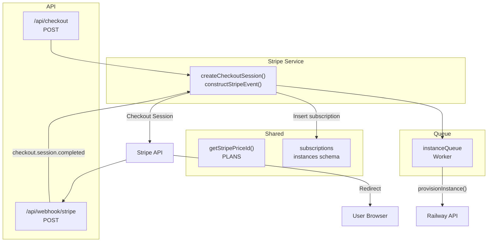
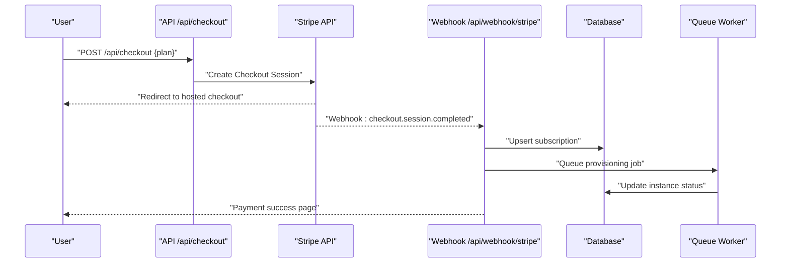
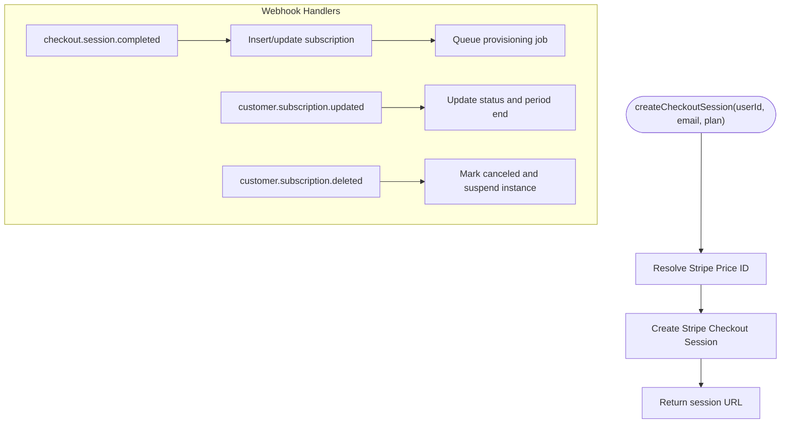
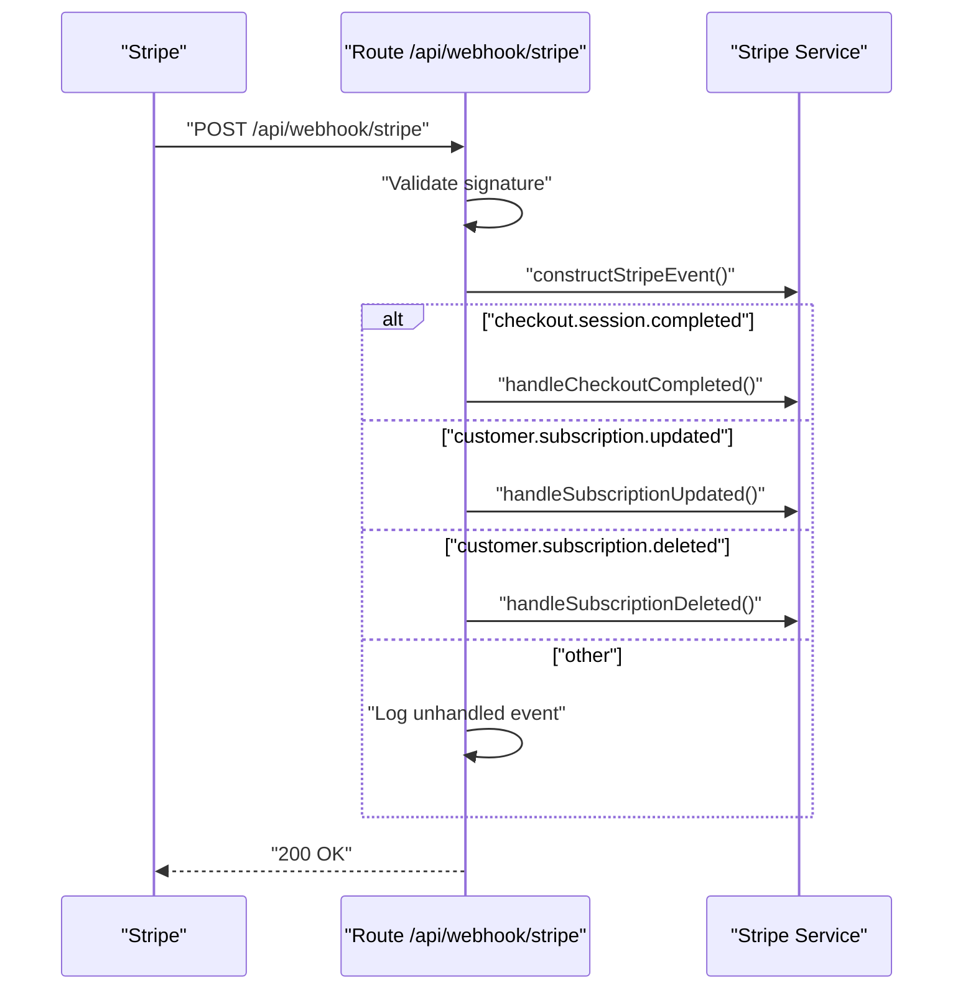
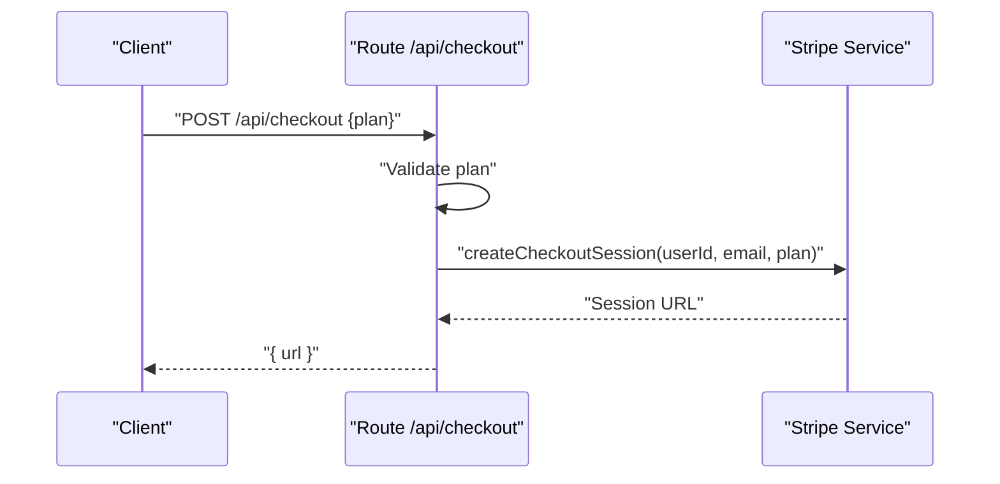
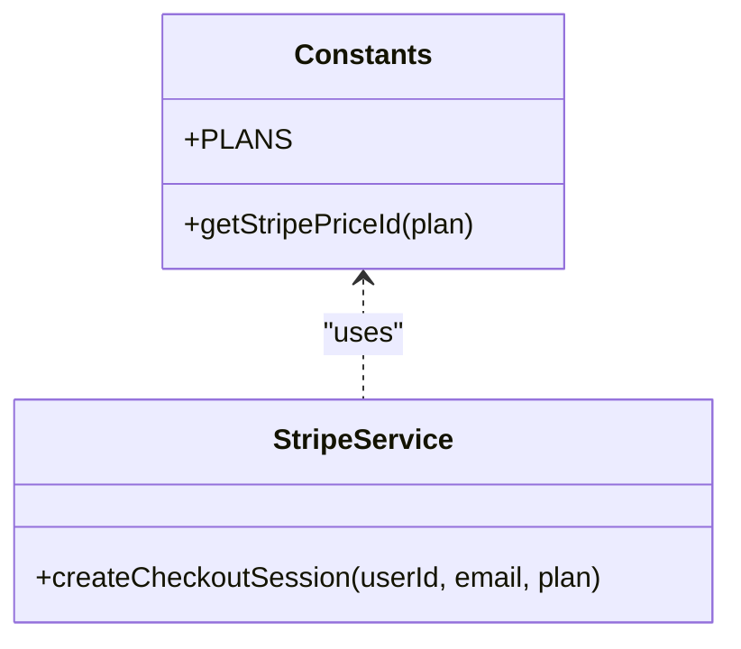
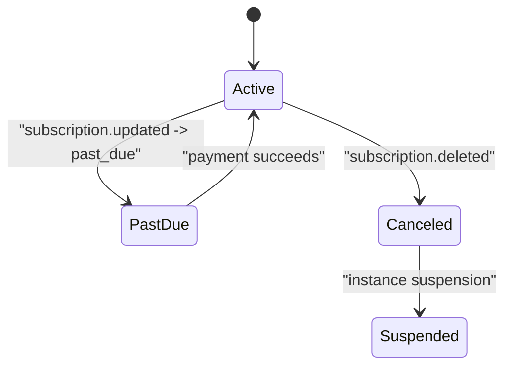
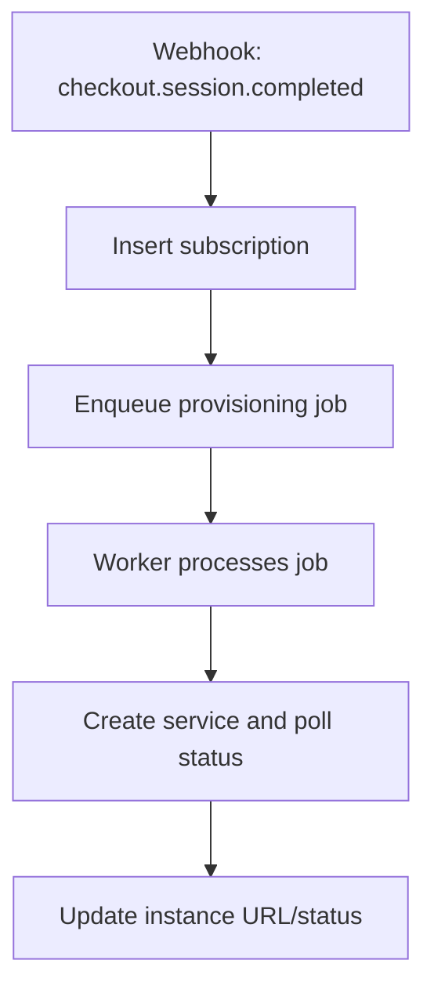
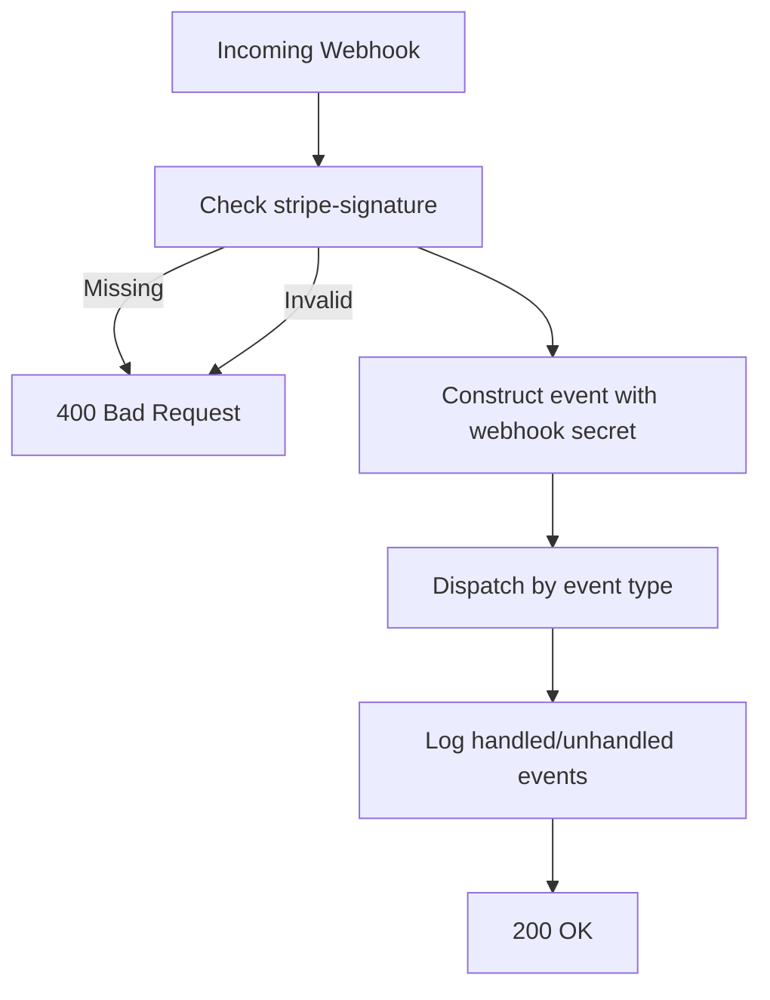
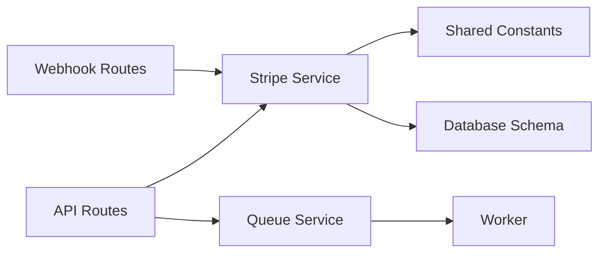

# Billing & Subscription Management

<cite>
**Referenced Files in This Document**
- [packages/api/src/services/stripe.ts](file://packages/api/src/services/stripe.ts)
- [packages/api/src/routes/webhooks.ts](file://packages/api/src/routes/webhooks.ts)
- [packages/api/src/routes/api.ts](file://packages/api/src/routes/api.ts)
- [packages/shared/src/constants.ts](file://packages/shared/src/constants.ts)
- [packages/shared/src/db/schema.ts](file://packages/shared/src/db/schema.ts)
- [packages/api/src/services/queue.ts](file://packages/api/src/services/queue.ts)
- [packages/api/src/middleware/csrf.ts](file://packages/api/src/middleware/csrf.ts)
- [PRD.md](file://PRD.md)
- [docs/plans/2026-03-07-quality-10-plan.md](file://docs/plans/2026-03-07-quality-10-plan.md)
</cite>

## Table of Contents
1. [Introduction](#introduction)
2. [Project Structure](#project-structure)
3. [Core Components](#core-components)
4. [Architecture Overview](#architecture-overview)
5. [Detailed Component Analysis](#detailed-component-analysis)
6. [Dependency Analysis](#dependency-analysis)
7. [Performance Considerations](#performance-considerations)
8. [Troubleshooting Guide](#troubleshooting-guide)
9. [Conclusion](#conclusion)
10. [Appendices](#appendices)

## Introduction
This document explains the billing and subscription management system, focusing on Stripe integration, checkout session creation, subscription lifecycle management, and webhook-driven provisioning. It covers:
- Stripe checkout session creation and redirection
- Webhook endpoint security and event handling
- Subscription lifecycle: creation, updates, cancellation, and provisioning triggers
- Pricing models and plan configuration
- Integration with the provisioning system and user notifications
- Common billing issues, refunds, and subscription workflows

## Project Structure
The billing system spans three primary areas:
- API routes for authenticated user actions (checkout)
- Stripe service for checkout session creation and webhook event construction
- Webhook routes for Stripe event processing
- Shared constants and database schema for plans and data models
- Queue-based provisioning worker for asynchronous instance creation



**Diagram sources**
- [packages/api/src/routes/api.ts](file://packages/api/src/routes/api.ts#L78-L87)
- [packages/api/src/routes/webhooks.ts](file://packages/api/src/routes/webhooks.ts#L5-L48)
- [packages/api/src/services/stripe.ts](file://packages/api/src/services/stripe.ts#L28-L43)
- [packages/shared/src/constants.ts](file://packages/shared/src/constants.ts#L3-L8)
- [packages/shared/src/db/schema.ts](file://packages/shared/src/db/schema.ts#L69-L145)
- [packages/api/src/services/queue.ts](file://packages/api/src/services/queue.ts#L17-L93)

**Section sources**
- [packages/api/src/routes/api.ts](file://packages/api/src/routes/api.ts#L1-L88)
- [packages/api/src/routes/webhooks.ts](file://packages/api/src/routes/webhooks.ts#L1-L49)
- [packages/api/src/services/stripe.ts](file://packages/api/src/services/stripe.ts#L1-L107)
- [packages/shared/src/constants.ts](file://packages/shared/src/constants.ts#L1-L28)
- [packages/shared/src/db/schema.ts](file://packages/shared/src/db/schema.ts#L1-L146)
- [packages/api/src/services/queue.ts](file://packages/api/src/services/queue.ts#L1-L101)

## Core Components
- Stripe service
  - Provides checkout session creation and webhook event construction
  - Handles subscription lifecycle updates and cancellation
- Webhook routes
  - Validates Stripe signatures and dispatches events to handlers
- API routes
  - Exposes authenticated endpoints for checkout and user/instance status
- Shared constants and schema
  - Defines plan configuration and database models for subscriptions and instances
- Queue and worker
  - Asynchronously provisions instances after successful checkout

**Section sources**
- [packages/api/src/services/stripe.ts](file://packages/api/src/services/stripe.ts#L1-L107)
- [packages/api/src/routes/webhooks.ts](file://packages/api/src/routes/webhooks.ts#L1-L49)
- [packages/api/src/routes/api.ts](file://packages/api/src/routes/api.ts#L1-L88)
- [packages/shared/src/constants.ts](file://packages/shared/src/constants.ts#L1-L28)
- [packages/shared/src/db/schema.ts](file://packages/shared/src/db/schema.ts#L69-L145)
- [packages/api/src/services/queue.ts](file://packages/api/src/services/queue.ts#L1-L101)

## Architecture Overview
The billing system integrates Stripe Checkout for payments and Stripe webhooks for lifecycle events. The flow:
- User selects a plan and initiates checkout via the API
- Backend creates a Stripe Checkout session and redirects the user
- After payment, Stripe redirects the user and sends a webhook
- Webhook handlers update the subscription record and trigger provisioning
- The provisioning worker creates and configures the instance on Railway



**Diagram sources**
- [packages/api/src/routes/api.ts](file://packages/api/src/routes/api.ts#L78-L87)
- [packages/api/src/services/stripe.ts](file://packages/api/src/services/stripe.ts#L28-L43)
- [packages/api/src/routes/webhooks.ts](file://packages/api/src/routes/webhooks.ts#L24-L36)
- [packages/shared/src/db/schema.ts](file://packages/shared/src/db/schema.ts#L69-L145)
- [packages/api/src/services/queue.ts](file://packages/api/src/services/queue.ts#L75-L93)

## Detailed Component Analysis

### Stripe Service
Responsibilities:
- Initialize Stripe client with configured API version
- Construct webhook events using the webhook secret
- Create Stripe Checkout sessions with plan-specific prices
- Handle checkout completion, subscription updates, and cancellations
- Trigger provisioning via the queue

Key behaviors:
- Checkout session creation sets success and cancel URLs and attaches metadata for user and plan
- On checkout completion, the subscription record is inserted with Stripe identifiers and status
- Subscription updates toggle status based on Stripe status and update period end
- Subscription deletion marks the subscription as canceled and suspends the instance



**Diagram sources**
- [packages/api/src/services/stripe.ts](file://packages/api/src/services/stripe.ts#L28-L107)
- [packages/shared/src/constants.ts](file://packages/shared/src/constants.ts#L3-L8)

**Section sources**
- [packages/api/src/services/stripe.ts](file://packages/api/src/services/stripe.ts#L1-L107)
- [packages/shared/src/constants.ts](file://packages/shared/src/constants.ts#L1-L28)

### Webhook Endpoint (/api/webhook/stripe)
Security and processing:
- Requires Stripe-Signature header
- Constructs event using the webhook secret
- Dispatches to specific handlers based on event type
- Logs and returns appropriate HTTP status codes

Supported events:
- checkout.session.completed: Creates or updates the subscription and queues provisioning
- customer.subscription.updated: Updates subscription status and period end
- customer.subscription.deleted: Marks subscription as canceled and suspends instance



**Diagram sources**
- [packages/api/src/routes/webhooks.ts](file://packages/api/src/routes/webhooks.ts#L5-L48)
- [packages/api/src/services/stripe.ts](file://packages/api/src/services/stripe.ts#L45-L107)

**Section sources**
- [packages/api/src/routes/webhooks.ts](file://packages/api/src/routes/webhooks.ts#L1-L49)
- [packages/api/src/services/stripe.ts](file://packages/api/src/services/stripe.ts#L20-L26)
- [packages/api/src/services/stripe.ts](file://packages/api/src/services/stripe.ts#L45-L107)

### API Routes for Checkout and User/Instance Status
- POST /api/checkout: Validates plan, creates Stripe Checkout session, and returns the session URL
- GET /api/me: Returns user profile and subscription status
- GET /api/instance: Returns instance details and subscription status



**Diagram sources**
- [packages/api/src/routes/api.ts](file://packages/api/src/routes/api.ts#L78-L87)
- [packages/api/src/services/stripe.ts](file://packages/api/src/services/stripe.ts#L28-L43)

**Section sources**
- [packages/api/src/routes/api.ts](file://packages/api/src/routes/api.ts#L1-L88)
- [packages/api/src/services/stripe.ts](file://packages/api/src/services/stripe.ts#L28-L43)

### Pricing Models and Plan Configuration
- Plans are defined centrally with names and fixed monthly prices
- Stripe price IDs are resolved from environment variables keyed by plan
- The checkout session uses the resolved price ID



**Diagram sources**
- [packages/shared/src/constants.ts](file://packages/shared/src/constants.ts#L3-L14)
- [packages/api/src/services/stripe.ts](file://packages/api/src/services/stripe.ts#L28-L43)

**Section sources**
- [packages/shared/src/constants.ts](file://packages/shared/src/constants.ts#L1-L28)
- [packages/api/src/services/stripe.ts](file://packages/api/src/services/stripe.ts#L28-L43)

### Subscription Lifecycle Management
Lifecycle stages and database state transitions:
- Creation: On checkout completion, insert a subscription record with status active
- Updates: On subscription updates, reflect Stripe status (active/past_due) and update period end
- Cancellation: On subscription deletion, mark subscription as canceled and suspend instance



**Diagram sources**
- [packages/api/src/services/stripe.ts](file://packages/api/src/services/stripe.ts#L74-L107)
- [packages/shared/src/db/schema.ts](file://packages/shared/src/db/schema.ts#L473-L488)

**Section sources**
- [packages/api/src/services/stripe.ts](file://packages/api/src/services/stripe.ts#L74-L107)
- [packages/shared/src/db/schema.ts](file://packages/shared/src/db/schema.ts#L473-L488)

### Automated Provisioning Triggers
- After checkout completion, the subscription is recorded and a provisioning job is enqueued
- The worker provisions the instance on Railway asynchronously
- The worker handles retries and logs outcomes



**Diagram sources**
- [packages/api/src/services/stripe.ts](file://packages/api/src/services/stripe.ts#L45-L72)
- [packages/api/src/services/queue.ts](file://packages/api/src/services/queue.ts#L75-L93)

**Section sources**
- [packages/api/src/services/stripe.ts](file://packages/api/src/services/stripe.ts#L45-L72)
- [packages/api/src/services/queue.ts](file://packages/api/src/services/queue.ts#L1-L101)

### Webhook Security and Idempotency
- Signature verification: The webhook route requires and validates the Stripe-Signature header
- Event dispatch: Switches on event type to call specific handlers
- Idempotency: The provisioning job uses a deduplication key based on subscription ID to avoid duplicate work
- Logging: Events are logged for observability and debugging



**Diagram sources**
- [packages/api/src/routes/webhooks.ts](file://packages/api/src/routes/webhooks.ts#L6-L47)
- [packages/api/src/services/stripe.ts](file://packages/api/src/services/stripe.ts#L20-L26)
- [packages/api/src/services/queue.ts](file://packages/api/src/services/queue.ts#L75-L93)

**Section sources**
- [packages/api/src/routes/webhooks.ts](file://packages/api/src/routes/webhooks.ts#L1-L49)
- [packages/api/src/services/stripe.ts](file://packages/api/src/services/stripe.ts#L20-L26)
- [packages/api/src/services/queue.ts](file://packages/api/src/services/queue.ts#L75-L93)

### Payment Failure Handling
- Subscription updates reflect Stripe status changes; past_due indicates payment failure
- The system relies on Stripe’s retry behavior and customer portal actions
- No explicit failure handler is implemented in the webhook route; failures are captured via subscription status updates

**Section sources**
- [packages/api/src/services/stripe.ts](file://packages/api/src/services/stripe.ts#L74-L85)

### Refund Handling
- The current webhook implementation does not explicitly handle refund events
- Subscription status reflects Stripe’s subscription state; refunds are managed by Stripe and reflected in subscription updates

**Section sources**
- [packages/api/src/routes/webhooks.ts](file://packages/api/src/routes/webhooks.ts#L24-L36)
- [packages/api/src/services/stripe.ts](file://packages/api/src/services/stripe.ts#L74-L85)

### Integration Patterns with Provisioning and Notifications
- Provisioning: The Stripe checkout completion handler inserts the subscription and enqueues a provisioning job
- Notifications: The system does not include explicit billing-related email notifications in the reviewed files; provisioning outcomes are tracked in the instance record

**Section sources**
- [packages/api/src/services/stripe.ts](file://packages/api/src/services/stripe.ts#L45-L72)
- [packages/shared/src/db/schema.ts](file://packages/shared/src/db/schema.ts#L489-L504)

## Dependency Analysis
- API routes depend on the Stripe service for checkout and on the queue for provisioning
- Stripe service depends on shared constants for price resolution and on the database schema for subscription updates
- Webhook routes depend on the Stripe service for event construction and on handlers for lifecycle updates
- Queue worker depends on the Railway provisioning service and on shared environment configuration



**Diagram sources**
- [packages/api/src/routes/api.ts](file://packages/api/src/routes/api.ts#L6-L8)
- [packages/api/src/services/stripe.ts](file://packages/api/src/services/stripe.ts#L1-L8)
- [packages/shared/src/constants.ts](file://packages/shared/src/constants.ts#L1-L8)
- [packages/shared/src/db/schema.ts](file://packages/shared/src/db/schema.ts#L69-L145)
- [packages/api/src/services/queue.ts](file://packages/api/src/services/queue.ts#L1-L5)

**Section sources**
- [packages/api/src/routes/api.ts](file://packages/api/src/routes/api.ts#L1-L88)
- [packages/api/src/services/stripe.ts](file://packages/api/src/services/stripe.ts#L1-L107)
- [packages/shared/src/constants.ts](file://packages/shared/src/constants.ts#L1-L28)
- [packages/shared/src/db/schema.ts](file://packages/shared/src/db/schema.ts#L69-L145)
- [packages/api/src/services/queue.ts](file://packages/api/src/services/queue.ts#L1-L101)

## Performance Considerations
- Webhook processing returns immediately after signature verification and dispatch; heavy work runs asynchronously
- Queue-based provisioning supports retries and backoff to handle transient failures
- Database indexes on subscription and instance tables optimize lookups during updates

[No sources needed since this section provides general guidance]

## Troubleshooting Guide
Common issues and resolutions:
- Missing or invalid Stripe-Signature header
  - Symptom: 400 response from webhook endpoint
  - Resolution: Ensure webhook is configured with the correct signing secret and that the header is present
- Invalid webhook signature
  - Symptom: 400 response from webhook endpoint
  - Resolution: Verify the webhook secret matches the configured value and that the payload has not been altered
- Duplicate webhook events
  - Symptom: Duplicate provisioning jobs or subscription updates
  - Resolution: The provisioning job uses a deduplication key; ensure the subscription ID remains consistent
- Payment failure (past_due)
  - Symptom: Subscription status becomes past_due
  - Resolution: Allow Stripe’s retry mechanism to recover; customer can update payment method via Stripe Customer Portal
- Subscription cancellation
  - Symptom: Subscription marked as canceled and instance suspended
  - Resolution: Re-subscription creates a new record; existing instance remains suspended until reactivation

**Section sources**
- [packages/api/src/routes/webhooks.ts](file://packages/api/src/routes/webhooks.ts#L6-L21)
- [packages/api/src/services/stripe.ts](file://packages/api/src/services/stripe.ts#L74-L107)
- [packages/api/src/services/queue.ts](file://packages/api/src/services/queue.ts#L75-L93)

## Conclusion
The billing and subscription management system integrates Stripe Checkout and webhooks to manage recurring payments and automate instance provisioning. Security is enforced via signature verification, and idempotency is achieved through job deduplication. The system’s modular design separates concerns across API routes, Stripe service, webhook handlers, shared configuration, and queue workers, enabling maintainability and scalability.

[No sources needed since this section summarizes without analyzing specific files]

## Appendices

### API Definitions
- POST /api/checkout
  - Description: Create a Stripe Checkout session for the selected plan
  - Request body: { plan: "starter" | "pro" | "scale" }
  - Response: { url: string }
  - Security: CSRF-protected, requires session
- POST /api/webhook/stripe
  - Description: Handle Stripe events
  - Headers: stripe-signature required
  - Supported events: checkout.session.completed, customer.subscription.updated, customer.subscription.deleted
  - Response: { received: true } on success

**Section sources**
- [packages/api/src/routes/api.ts](file://packages/api/src/routes/api.ts#L78-L87)
- [packages/api/src/routes/webhooks.ts](file://packages/api/src/routes/webhooks.ts#L5-L48)

### Data Models
```mermaid
erDiagram
USERS {
uuid id PK
string email UK
timestamp created_at
timestamp updated_at
}
SUBSCRIPTIONS {
uuid id PK
uuid user_id FK
string plan
string stripe_customer_id
string stripe_subscription_id UK
string status
timestamptz current_period_end
timestamp created_at
timestamp updated_at
}
INSTANCES {
uuid id PK
uuid user_id FK
uuid subscription_id UK FK
string railway_project_id
string railway_service_id
string custom_domain
text railway_url
text url
string status
string domain_status
text error_message
timestamp created_at
timestamp updated_at
}
USERS ||--o{ SUBSCRIPTIONS : "has"
SUBSCRIPTIONS ||--o{ INSTANCES : "provisions"
```

**Diagram sources**
- [packages/shared/src/db/schema.ts](file://packages/shared/src/db/schema.ts#L14-L145)