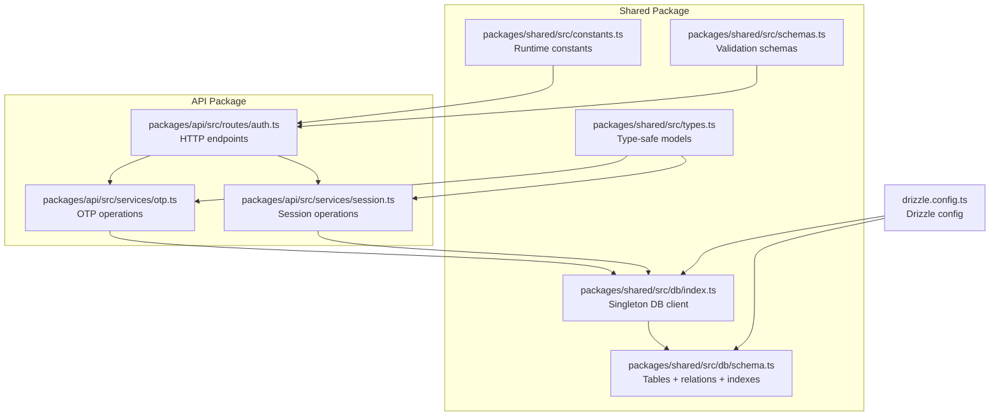
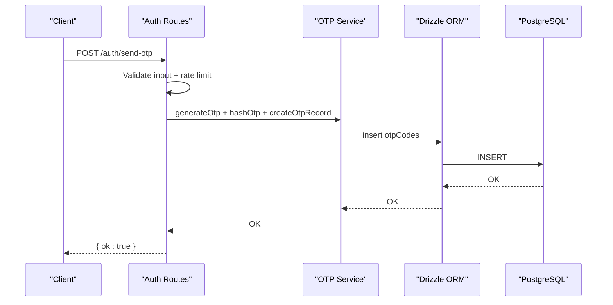
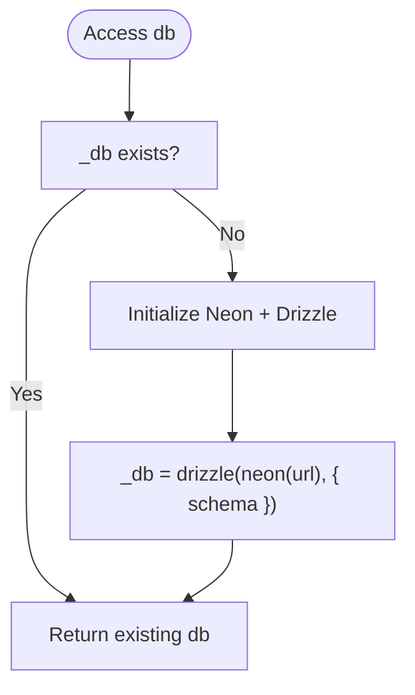
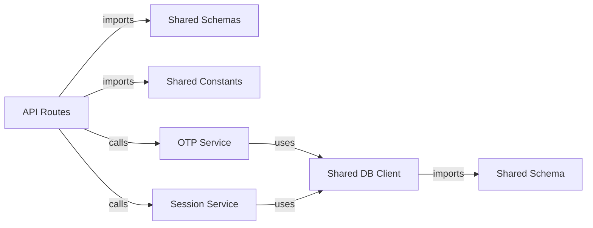
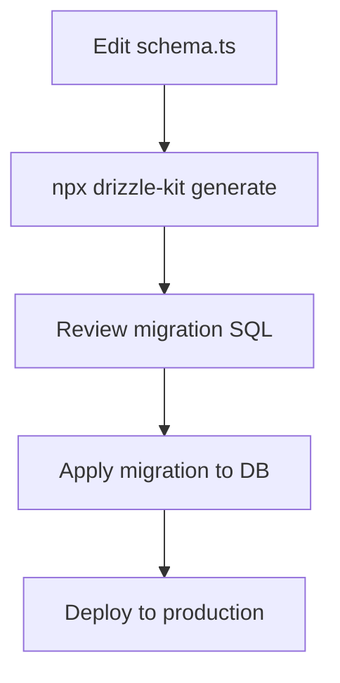
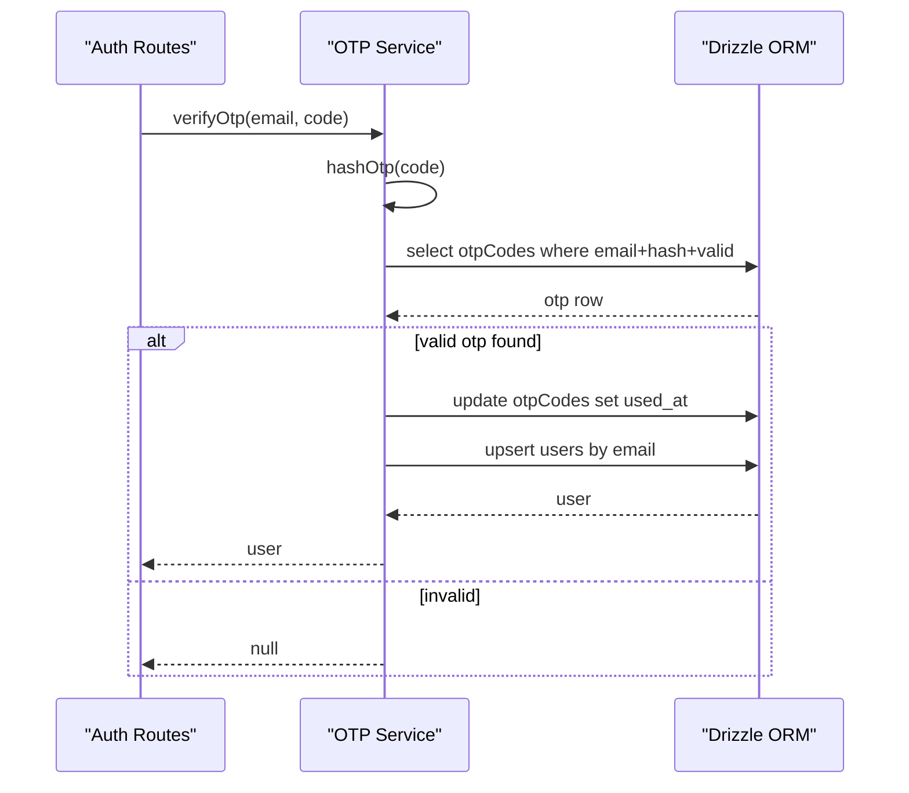

# Database Service Layer

<cite>
**Referenced Files in This Document**
- [drizzle.config.ts](file://drizzle.config.ts)
- [packages/shared/src/db/schema.ts](file://packages/shared/src/db/schema.ts)
- [packages/shared/src/db/index.ts](file://packages/shared/src/db/index.ts)
- [packages/shared/src/types.ts](file://packages/shared/src/types.ts)
- [packages/shared/src/constants.ts](file://packages/shared/src/constants.ts)
- [packages/shared/src/schemas.ts](file://packages/shared/src/schemas.ts)
- [packages/api/src/routes/auth.ts](file://packages/api/src/routes/auth.ts)
- [packages/api/src/services/otp.ts](file://packages/api/src/services/otp.ts)
- [packages/api/src/services/session.ts](file://packages/api/src/services/session.ts)
- [PRD.md](file://PRD.md)
</cite>

## Table of Contents
1. [Introduction](#introduction)
2. [Project Structure](#project-structure)
3. [Core Components](#core-components)
4. [Architecture Overview](#architecture-overview)
5. [Detailed Component Analysis](#detailed-component-analysis)
6. [Dependency Analysis](#dependency-analysis)
7. [Performance Considerations](#performance-considerations)
8. [Security and Access Control](#security-and-access-control)
9. [Migration Management and Schema Evolution](#migration-management-and-schema-evolution)
10. [CRUD Operations and Query Patterns](#crud-operations-and-query-patterns)
11. [Monitoring and Troubleshooting](#monitoring-and-troubleshooting)
12. [Extending the Schema and Maintaining Integrity](#extending-the-schema-and-maintaining-integrity)
13. [Conclusion](#conclusion)

## Introduction
This document describes the database service layer and ORM implementation for the SparkClaw project. It covers Drizzle ORM configuration, PostgreSQL schema definitions, entity relationships, and the service abstraction layer for database operations. It also documents type-safe operations, migration management, connection handling, query patterns, transaction considerations, performance characteristics, security practices, and operational guidance.

## Project Structure
The database layer is organized around a shared package that encapsulates schema definitions, type-safe models, and a singleton database client. API routes depend on service modules that use Drizzle ORM to perform type-safe queries against PostgreSQL via Neon HTTP.



**Diagram sources**
- [drizzle.config.ts](file://drizzle.config.ts#L1-L12)
- [packages/shared/src/db/schema.ts](file://packages/shared/src/db/schema.ts#L1-L146)
- [packages/shared/src/db/index.ts](file://packages/shared/src/db/index.ts#L1-L26)
- [packages/shared/src/types.ts](file://packages/shared/src/types.ts#L1-L57)
- [packages/shared/src/constants.ts](file://packages/shared/src/constants.ts#L1-L28)
- [packages/shared/src/schemas.ts](file://packages/shared/src/schemas.ts#L1-L26)
- [packages/api/src/routes/auth.ts](file://packages/api/src/routes/auth.ts#L1-L80)
- [packages/api/src/services/otp.ts](file://packages/api/src/services/otp.ts#L1-L59)
- [packages/api/src/services/session.ts](file://packages/api/src/services/session.ts#L1-L43)

**Section sources**
- [drizzle.config.ts](file://drizzle.config.ts#L1-L12)
- [packages/shared/src/db/schema.ts](file://packages/shared/src/db/schema.ts#L1-L146)
- [packages/shared/src/db/index.ts](file://packages/shared/src/db/index.ts#L1-L26)
- [packages/shared/src/types.ts](file://packages/shared/src/types.ts#L1-L57)
- [packages/shared/src/constants.ts](file://packages/shared/src/constants.ts#L1-L28)
- [packages/shared/src/schemas.ts](file://packages/shared/src/schemas.ts#L1-L26)
- [packages/api/src/routes/auth.ts](file://packages/api/src/routes/auth.ts#L1-L80)
- [packages/api/src/services/otp.ts](file://packages/api/src/services/otp.ts#L1-L59)
- [packages/api/src/services/session.ts](file://packages/api/src/services/session.ts#L1-L43)

## Core Components
- Drizzle ORM configuration: Defines schema location, output directory for migrations, PostgreSQL dialect, credentials via DATABASE_URL, and strict mode.
- Database client: Singleton wrapper around Neon HTTP client initialized once and exposed via a proxy for ergonomic access.
- Schema definitions: Strongly-typed tables with primary keys, foreign keys, indexes, and relations.
- Type-safe models: Generated select/insert types for all entities.
- Service layer: OTP and session services encapsulate database operations with validation and rate limiting.
- Route layer: Authentication routes orchestrate validation, rate limiting, and service calls.

**Section sources**
- [drizzle.config.ts](file://drizzle.config.ts#L1-L12)
- [packages/shared/src/db/index.ts](file://packages/shared/src/db/index.ts#L1-L26)
- [packages/shared/src/db/schema.ts](file://packages/shared/src/db/schema.ts#L1-L146)
- [packages/shared/src/types.ts](file://packages/shared/src/types.ts#L1-L57)
- [packages/api/src/services/otp.ts](file://packages/api/src/services/otp.ts#L1-L59)
- [packages/api/src/services/session.ts](file://packages/api/src/services/session.ts#L1-L43)
- [packages/api/src/routes/auth.ts](file://packages/api/src/routes/auth.ts#L1-L80)

## Architecture Overview
The system uses a layered architecture:
- Presentation: Elysia routes handle HTTP requests.
- Application: Services encapsulate business logic and coordinate database operations.
- Persistence: Drizzle ORM with Neon HTTP driver connects to PostgreSQL.
- Schema: Centralized table definitions and relations.



**Diagram sources**
- [packages/api/src/routes/auth.ts](file://packages/api/src/routes/auth.ts#L21-L40)
- [packages/api/src/services/otp.ts](file://packages/api/src/services/otp.ts#L19-L25)

## Detailed Component Analysis

### Drizzle ORM Configuration
- Schema path: points to the centralized schema definition.
- Output: migrations directory for generated migration files.
- Dialect: PostgreSQL.
- Credentials: DATABASE_URL environment variable.
- Strict mode enabled for stricter schema checks.

**Section sources**
- [drizzle.config.ts](file://drizzle.config.ts#L1-L12)

### Database Client Initialization
- Uses Neon serverless HTTP client with DATABASE_URL.
- Creates a singleton Drizzle database instance.
- Exposes a proxy so consumers can access db.<table>.* methods directly.



**Diagram sources**
- [packages/shared/src/db/index.ts](file://packages/shared/src/db/index.ts#L7-L17)

**Section sources**
- [packages/shared/src/db/index.ts](file://packages/shared/src/db/index.ts#L1-L26)

### Schema Definitions and Entity Relationships
- users: primary key id, unique email, timestamps.
- otpCodes: primary key id, email, code_hash, expires_at, used_at, timestamps; indexes on email and expires_at.
- sessions: primary key id, foreign key user_id, unique token, expires_at, timestamps; indexes on token and user_id.
- subscriptions: primary key id, unique user_id, plan, Stripe identifiers, status, timestamps; unique index on user_id and Stripe subscription id; indexes on Stripe ids.
- instances: primary key id, foreign key user_id and unique subscription_id, Railway identifiers, optional custom domain and internal URL, status, domain status, error message, timestamps; indexes on user_id, status, custom domain, domain_status.

Relations:
- users has one subscription and one instance, and many otpCodes and sessions.
- sessions belongs to users.
- subscriptions belongs to users and has one instance.
- instances belongs to users and subscriptions.

```mermaid
erDiagram
USERS {
uuid id PK
varchar email UK
timestamptz created_at
timestamptz updated_at
}
OTP_CODES {
uuid id PK
varchar email
varchar code_hash
timestamptz expires_at
timestamptz used_at
timestamptz created_at
}
SESSIONS {
uuid id PK
uuid user_id FK
varchar token UK
timestamptz expires_at
timestamptz created_at
}
SUBSCRIPTIONS {
uuid id PK
uuid user_id UK FK
varchar plan
varchar stripe_customer_id
varchar stripe_subscription_id UK
varchar status
timestamptz current_period_end
timestamptz created_at
timestamptz updated_at
}
INSTANCES {
uuid id PK
uuid user_id FK
uuid subscription_id UK FK
varchar railway_project_id
varchar railway_service_id
text url
varchar status
varchar domain_status
text error_message
timestamptz created_at
timestamptz updated_at
}
USERS ||--o{ OTP_CODES : "has many"
USERS ||--o{ SESSIONS : "has many"
USERS ||--|| SUBSCRIPTIONS : "has one"
USERS ||--|| INSTANCES : "has one"
SUBSCRIPTIONS ||--|| INSTANCES : "has one"
```

**Diagram sources**
- [packages/shared/src/db/schema.ts](file://packages/shared/src/db/schema.ts#L14-L146)

**Section sources**
- [packages/shared/src/db/schema.ts](file://packages/shared/src/db/schema.ts#L1-L146)

### Type-Safe Models
- Generated select and insert types for all entities enable compile-time safety for reads and writes.
- Domain enums for plans, statuses, and response shapes are defined centrally.

**Section sources**
- [packages/shared/src/types.ts](file://packages/shared/src/types.ts#L1-L57)

### Service Abstraction Layer
- OTP service: generates, hashes, stores, verifies OTP codes, enforces expiry and uniqueness, and creates users on first use.
- Session service: manages session tokens, expiry, and verification by joining sessions with users.

```mermaid
classDiagram
class OtpService {
+generateOtp() string
+hashOtp(code) Promise~string~
+createOtpRecord(email, codeHash) Promise~void~
+verifyOtp(email, code) Promise~User|null~
}
class SessionService {
+createSession(userId) Promise~{ token }~
+verifySession(token) Promise~User|null~
+deleteSession(token) Promise~void~
}
class Db {
+insert(table)
+query.table.findFirst()
+update(table)
+delete(table)
}
OtpService --> Db : "uses"
SessionService --> Db : "uses"
```

**Diagram sources**
- [packages/api/src/services/otp.ts](file://packages/api/src/services/otp.ts#L1-L59)
- [packages/api/src/services/session.ts](file://packages/api/src/services/session.ts#L1-L43)
- [packages/shared/src/db/index.ts](file://packages/shared/src/db/index.ts#L1-L26)

**Section sources**
- [packages/api/src/services/otp.ts](file://packages/api/src/services/otp.ts#L1-L59)
- [packages/api/src/services/session.ts](file://packages/api/src/services/session.ts#L1-L43)

### Route Integration
- Authentication routes validate inputs with Zod schemas, enforce rate limits, and delegate to services.
- On successful OTP verification, a session is created and a secure cookie is set.

**Section sources**
- [packages/api/src/routes/auth.ts](file://packages/api/src/routes/auth.ts#L1-L80)
- [packages/shared/src/schemas.ts](file://packages/shared/src/schemas.ts#L1-L26)
- [packages/shared/src/constants.ts](file://packages/shared/src/constants.ts#L16-L23)

## Dependency Analysis
- Shared package exports:
  - db client and schema for reuse across the app.
  - types and schemas for type-safety and validation.
- API routes depend on shared schemas and constants for validation and configuration.
- Services depend on the shared db client and types.



**Diagram sources**
- [packages/api/src/routes/auth.ts](file://packages/api/src/routes/auth.ts#L1-L80)
- [packages/api/src/services/otp.ts](file://packages/api/src/services/otp.ts#L1-L59)
- [packages/api/src/services/session.ts](file://packages/api/src/services/session.ts#L1-L43)
- [packages/shared/src/db/index.ts](file://packages/shared/src/db/index.ts#L1-L26)
- [packages/shared/src/db/schema.ts](file://packages/shared/src/db/schema.ts#L1-L146)
- [packages/shared/src/schemas.ts](file://packages/shared/src/schemas.ts#L1-L26)
- [packages/shared/src/constants.ts](file://packages/shared/src/constants.ts#L1-L28)

**Section sources**
- [packages/api/src/routes/auth.ts](file://packages/api/src/routes/auth.ts#L1-L80)
- [packages/api/src/services/otp.ts](file://packages/api/src/services/otp.ts#L1-L59)
- [packages/api/src/services/session.ts](file://packages/api/src/services/session.ts#L1-L43)
- [packages/shared/src/db/index.ts](file://packages/shared/src/db/index.ts#L1-L26)
- [packages/shared/src/db/schema.ts](file://packages/shared/src/db/schema.ts#L1-L146)
- [packages/shared/src/schemas.ts](file://packages/shared/src/schemas.ts#L1-L26)
- [packages/shared/src/constants.ts](file://packages/shared/src/constants.ts#L1-L28)

## Performance Considerations
- Indexes: Strategic indexes on frequently queried columns (email, expires_at, token, user_id, subscription_id, status, custom_domain, domain_status) improve query performance.
- Prepared statements: Drizzle ORM generates parameterized SQL, reducing parsing overhead and improving cache locality.
- Connection handling: Singleton client minimizes connection churn; Neon HTTP driver is optimized for serverless environments.
- Query patterns: Prefer selective queries with filters and indexes; avoid SELECT * where possible.
- Batch operations: Group inserts/updates when feasible to reduce round trips.
- Pagination: For lists, implement cursor-based pagination to avoid deep offset scans.

[No sources needed since this section provides general guidance]

## Security and Access Control
- Parameterized queries: Drizzle ORM automatically binds parameters, preventing SQL injection.
- Input validation: Zod schemas validate request payloads at the route layer.
- Environment variables: DATABASE_URL is required; missing values cause initialization errors.
- Rate limiting: Built-in rate limiter prevents brute-force OTP attempts.
- Session cookies: Secure, HttpOnly, SameSite, and expiration controls applied by routes.
- Access control: Services verify session expiry and join with users to ensure authorized access.

**Section sources**
- [packages/api/src/routes/auth.ts](file://packages/api/src/routes/auth.ts#L10-L17)
- [packages/api/src/services/otp.ts](file://packages/api/src/services/otp.ts#L27-L37)
- [packages/api/src/services/session.ts](file://packages/api/src/services/session.ts#L23-L38)
- [packages/shared/src/schemas.ts](file://packages/shared/src/schemas.ts#L1-L26)
- [packages/shared/src/db/index.ts](file://packages/shared/src/db/index.ts#L9-L12)

## Migration Management and Schema Evolution
- Drizzle Kit configuration defines schema path, migration output, dialect, credentials, and strict mode.
- Migrations are generated and stored under the migrations directory.
- Schema evolution follows Drizzle’s declarative model; add/remove columns, indexes, and relations in the schema file, then generate and apply migrations.



**Diagram sources**
- [drizzle.config.ts](file://drizzle.config.ts#L1-L12)
- [packages/shared/src/db/schema.ts](file://packages/shared/src/db/schema.ts#L1-L146)

**Section sources**
- [drizzle.config.ts](file://drizzle.config.ts#L1-L12)
- [packages/shared/src/db/schema.ts](file://packages/shared/src/db/schema.ts#L1-L146)

## CRUD Operations and Query Patterns
- Create (OTP): Insert OTP record with hashed code and expiry.
- Read (OTP): Find first unexpired, unused OTP by email and hash.
- Update (OTP): Mark OTP as used after successful verification.
- Upsert (User): Insert user if not exists during OTP verification.
- Create (Session): Insert session with token and expiry.
- Read (Session): Join sessions with users to verify token and expiry.
- Delete (Session): Remove session by token.



**Diagram sources**
- [packages/api/src/services/otp.ts](file://packages/api/src/services/otp.ts#L27-L58)

**Section sources**
- [packages/api/src/services/otp.ts](file://packages/api/src/services/otp.ts#L19-L58)
- [packages/api/src/services/session.ts](file://packages/api/src/services/session.ts#L13-L42)

## Monitoring and Troubleshooting
- Environment validation: If DATABASE_URL is missing, initialization throws an error; ensure environment is configured.
- Logging: Integrate structured logging around service calls and database operations for observability.
- Health checks: Periodic checks of database connectivity and basic query execution.
- Error handling: Surface meaningful errors from services to routes; avoid leaking sensitive details.
- Tracing: Add correlation IDs to track requests across routes, services, and database calls.

**Section sources**
- [packages/shared/src/db/index.ts](file://packages/shared/src/db/index.ts#L9-L12)

## Extending the Schema and Maintaining Integrity
- Adding a new entity:
  - Define table and relations in schema.ts.
  - Export relations and add indexes as needed.
  - Generate and apply migration.
  - Add type-safe models and service methods.
- Enforcing referential integrity:
  - Use foreign keys and unique constraints as defined.
  - Leverage relations to maintain referential consistency.
- Data validation:
  - Continue using Zod schemas for request validation.
  - Consider Zod-based model validation for write operations.
- Backward compatibility:
  - Avoid dropping columns; add nullable columns and migrate data.
  - Keep unique constraints to prevent duplicates.

**Section sources**
- [packages/shared/src/db/schema.ts](file://packages/shared/src/db/schema.ts#L1-L146)
- [packages/shared/src/types.ts](file://packages/shared/src/types.ts#L1-L57)
- [drizzle.config.ts](file://drizzle.config.ts#L1-L12)

## Conclusion
The database service layer leverages Drizzle ORM with a centralized schema, type-safe models, and a singleton client for efficient, secure, and maintainable database operations. The service abstraction isolates business logic from persistence concerns, while robust indexing and parameterized queries support performance and security. Migration management and strict schema enforcement facilitate safe evolution of the data model.