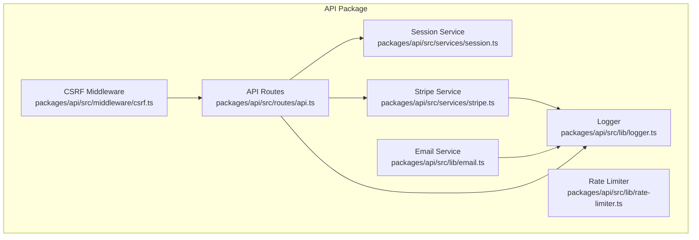
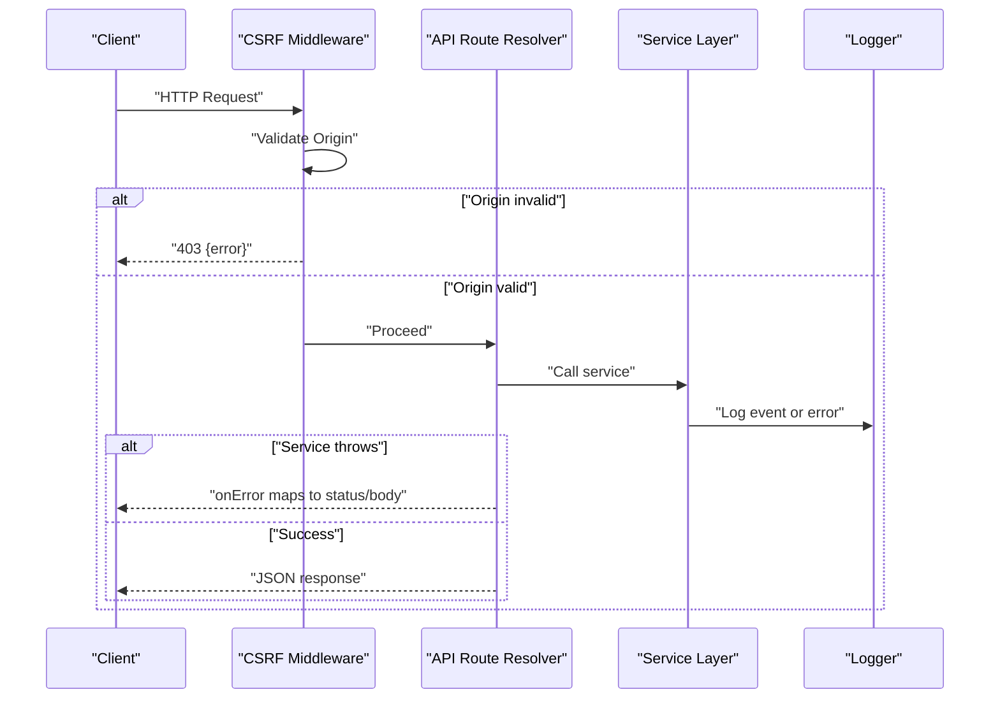
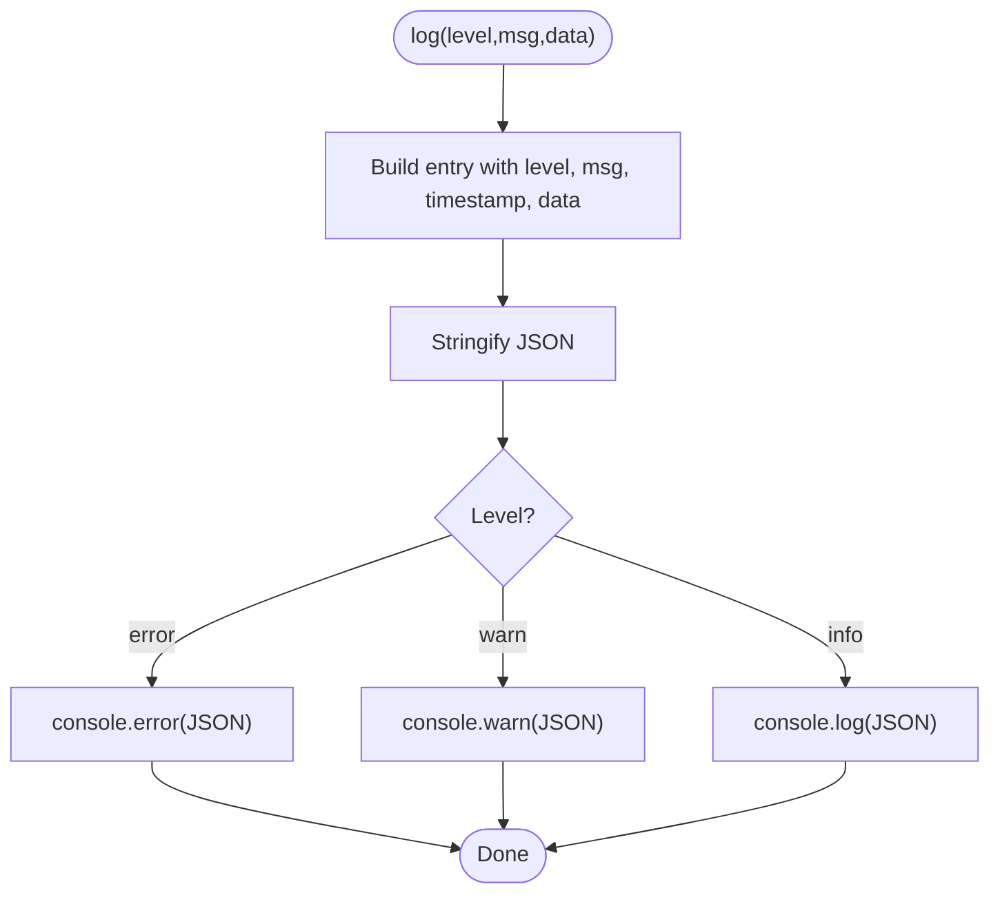
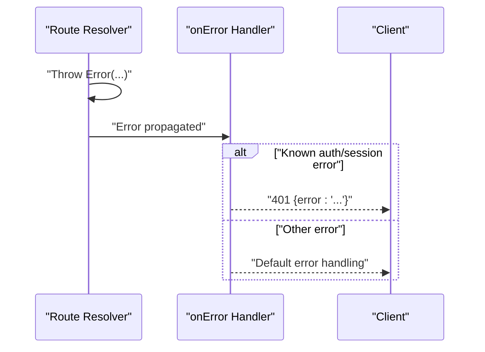
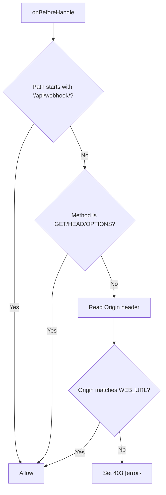
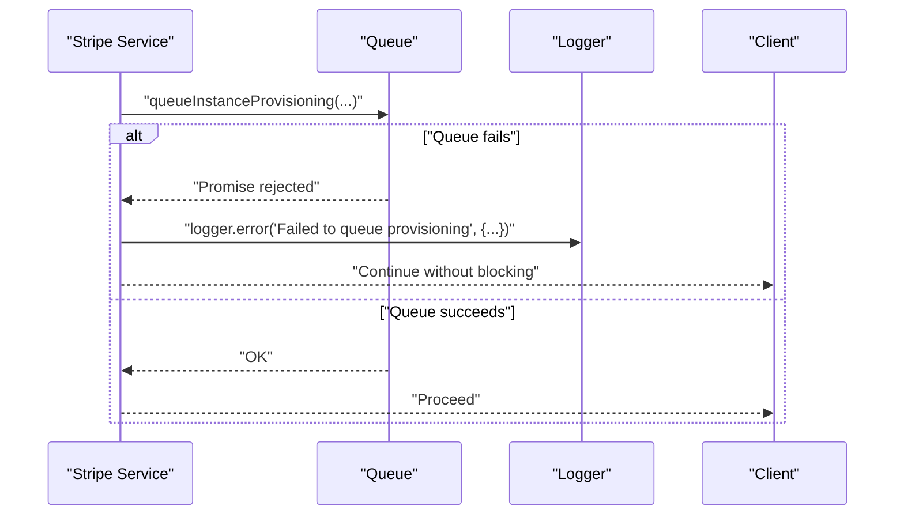
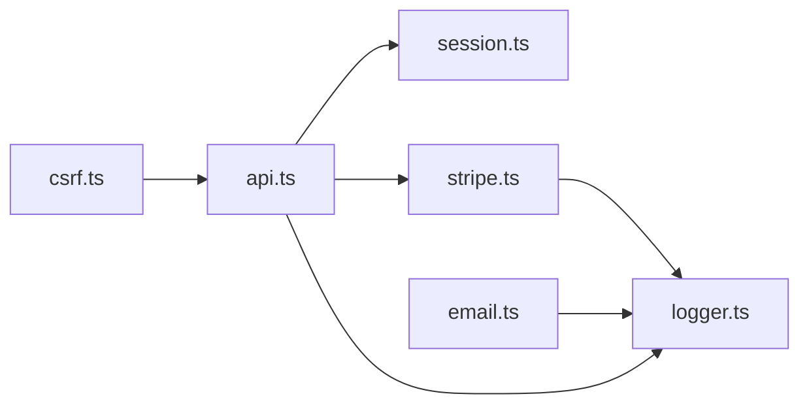

# Error Handling & Logging

<cite>
**Referenced Files in This Document**
- [logger.ts](file://packages/api/src/lib/logger.ts)
- [logger.test.ts](file://packages/api/src/lib/__tests__/logger.test.ts)
- [api.ts](file://packages/api/src/routes/api.ts)
- [csrf.ts](file://packages/api/src/middleware/csrf.ts)
- [stripe.ts](file://packages/api/src/services/stripe.ts)
- [email.ts](file://packages/api/src/lib/email.ts)
- [session.ts](file://packages/api/src/services/session.ts)
- [rate-limiter.ts](file://packages/api/src/lib/rate-limiter.ts)
</cite>

## Table of Contents
1. [Introduction](#introduction)
2. [Project Structure](#project-structure)
3. [Core Components](#core-components)
4. [Architecture Overview](#architecture-overview)
5. [Detailed Component Analysis](#detailed-component-analysis)
6. [Dependency Analysis](#dependency-analysis)
7. [Performance Considerations](#performance-considerations)
8. [Troubleshooting Guide](#troubleshooting-guide)
9. [Conclusion](#conclusion)
10. [Appendices](#appendices)

## Introduction
This document explains the error handling and logging systems in the API package. It covers the centralized logging implementation, error boundaries, standardized error responses, and practical patterns for robust error handling. It also outlines graceful degradation strategies, monitoring integration points, and guidance for extending the system with new error types and logging patterns.

## Project Structure
The error handling and logging ecosystem centers around a small, focused logger module and several route handlers and services that integrate logging and error responses consistently.

**Diagram sources**
- [logger.ts](file://packages/api/src/lib/logger.ts#L1-L34)
- [csrf.ts](file://packages/api/src/middleware/csrf.ts#L1-L16)
- [api.ts](file://packages/api/src/routes/api.ts#L1-L88)
- [stripe.ts](file://packages/api/src/services/stripe.ts#L1-L107)
- [email.ts](file://packages/api/src/lib/email.ts#L1-L34)
- [session.ts](file://packages/api/src/services/session.ts#L1-L43)
- [rate-limiter.ts](file://packages/api/src/lib/rate-limiter.ts#L1-L59)

**Section sources**
- [logger.ts](file://packages/api/src/lib/logger.ts#L1-L34)
- [api.ts](file://packages/api/src/routes/api.ts#L1-L88)
- [csrf.ts](file://packages/api/src/middleware/csrf.ts#L1-L16)
- [stripe.ts](file://packages/api/src/services/stripe.ts#L1-L107)
- [email.ts](file://packages/api/src/lib/email.ts#L1-L34)
- [session.ts](file://packages/api/src/services/session.ts#L1-L43)
- [rate-limiter.ts](file://packages/api/src/lib/rate-limiter.ts#L1-L59)

## Core Components
- Centralized Logger: Provides structured JSON logging with levels, timestamps, and arbitrary data fields. It writes to stdout/stderr according to level.
- Route-Level Error Boundaries: Routes define onError handlers to normalize errors into consistent HTTP status and JSON bodies.
- Middleware-Level Guards: CSRF middleware enforces origin checks and short-circuits unauthorized requests with explicit error responses.
- Service-Level Logging: Services log operational events and failures, including background tasks and external integrations.
- Graceful Degradation Patterns: Background tasks catch and log errors rather than failing the primary operation.

Key implementation references:
- Logger interface and functions: [logger.ts](file://packages/api/src/lib/logger.ts#L1-L34)
- Route error normalization: [api.ts](file://packages/api/src/routes/api.ts#L28-L33)
- CSRF guard: [csrf.ts](file://packages/api/src/middleware/csrf.ts#L4-L15)
- Service logging on background failure: [stripe.ts](file://packages/api/src/services/stripe.ts#L69-L71)
- Email logging after send: [email.ts](file://packages/api/src/lib/email.ts#L32-L33)

**Section sources**
- [logger.ts](file://packages/api/src/lib/logger.ts#L1-L34)
- [api.ts](file://packages/api/src/routes/api.ts#L28-L33)
- [csrf.ts](file://packages/api/src/middleware/csrf.ts#L4-L15)
- [stripe.ts](file://packages/api/src/services/stripe.ts#L69-L71)
- [email.ts](file://packages/api/src/lib/email.ts#L32-L33)

## Architecture Overview
The system follows a layered approach:
- Middleware validates requests early and returns normalized errors.
- Route resolvers perform business logic and may throw or return structured errors.
- An onError handler ensures all thrown errors become consistent HTTP responses.
- Services log significant events and failures, including background tasks.
- The logger emits structured JSON entries with timestamps and contextual data.

**Diagram sources**
- [csrf.ts](file://packages/api/src/middleware/csrf.ts#L4-L15)
- [api.ts](file://packages/api/src/routes/api.ts#L13-L33)
- [stripe.ts](file://packages/api/src/services/stripe.ts#L69-L71)
- [logger.ts](file://packages/api/src/lib/logger.ts#L10-L27)

## Detailed Component Analysis

### Logger Module
- Purpose: Provide a minimal, structured logging interface with three levels (info, warn, error).
- Behavior:
  - Builds a log entry with level, message, timestamp, and optional data.
  - Emits JSON via console.log/warn/error depending on level.
- Usage patterns:
  - Info for successful operations and progress.
  - Warn for recoverable issues or unexpected but non-fatal conditions.
  - Error for failures that require attention.

**Diagram sources**
- [logger.ts](file://packages/api/src/lib/logger.ts#L10-L27)

**Section sources**
- [logger.ts](file://packages/api/src/lib/logger.ts#L1-L34)
- [logger.test.ts](file://packages/api/src/lib/__tests__/logger.test.ts#L1-L50)

### Route-Level Error Boundary
- Mechanism: An onError handler inspects thrown errors and sets appropriate HTTP status and JSON body.
- Typical outcomes:
  - Authentication/session errors mapped to 401 with an error message.
  - Validation errors mapped to 400 with a concise message.
- Example references:
  - Session resolution throwing and mapping: [api.ts](file://packages/api/src/routes/api.ts#L13-L33)
  - Validation mapping: [api.ts](file://packages/api/src/routes/api.ts#L78-L83)

**Diagram sources**
- [api.ts](file://packages/api/src/routes/api.ts#L28-L33)

**Section sources**
- [api.ts](file://packages/api/src/routes/api.ts#L28-L33)

### CSRF Middleware Guard
- Purpose: Enforce origin validation for non-idempotent requests and short-circuit unauthorized requests.
- Behavior:
  - Skips validation for webhook paths.
  - For protected methods, compares request origin against configured origin.
  - Returns 403 with a standardized error payload on mismatch.
- Reference: [csrf.ts](file://packages/api/src/middleware/csrf.ts#L4-L15)

**Diagram sources**
- [csrf.ts](file://packages/api/src/middleware/csrf.ts#L4-L15)

**Section sources**
- [csrf.ts](file://packages/api/src/middleware/csrf.ts#L1-L16)

### Service-Level Logging and Graceful Degradation
- Stripe service:
  - Queues asynchronous provisioning and catches errors to log them without failing checkout creation.
  - References: [stripe.ts](file://packages/api/src/services/stripe.ts#L69-L71)
- Email service:
  - Logs after sending OTP emails to track delivery attempts.
  - References: [email.ts](file://packages/api/src/lib/email.ts#L32-L33)
- Session service:
  - Performs database operations and returns structured results; integrates with route-level error mapping.
  - References: [session.ts](file://packages/api/src/services/session.ts#L23-L38)

**Diagram sources**
- [stripe.ts](file://packages/api/src/services/stripe.ts#L69-L71)
- [logger.ts](file://packages/api/src/lib/logger.ts#L10-L27)

**Section sources**
- [stripe.ts](file://packages/api/src/services/stripe.ts#L69-L71)
- [email.ts](file://packages/api/src/lib/email.ts#L32-L33)
- [session.ts](file://packages/api/src/services/session.ts#L23-L38)

### Rate Limiter (Error Context)
- While not a dedicated error handler, the rate limiter demonstrates bounded failure behavior:
  - Tracks request timestamps per key.
  - Computes remaining quota.
  - Periodically cleans stale entries.
  - Useful pattern for graceful degradation when limits are exceeded.
- Reference: [rate-limiter.ts](file://packages/api/src/lib/rate-limiter.ts#L1-L59)

**Section sources**
- [rate-limiter.ts](file://packages/api/src/lib/rate-limiter.ts#L1-L59)

## Dependency Analysis
- Logger is consumed by services and routes for structured logging.
- CSRF middleware depends on environment configuration for allowed origin.
- Route resolvers depend on session verification and services for business logic.
- Stripe service depends on external payment provider and queues for async work.

**Diagram sources**
- [csrf.ts](file://packages/api/src/middleware/csrf.ts#L1-L16)
- [api.ts](file://packages/api/src/routes/api.ts#L1-L88)
- [session.ts](file://packages/api/src/services/session.ts#L1-L43)
- [stripe.ts](file://packages/api/src/services/stripe.ts#L1-L107)
- [email.ts](file://packages/api/src/lib/email.ts#L1-L34)
- [logger.ts](file://packages/api/src/lib/logger.ts#L1-L34)

**Section sources**
- [csrf.ts](file://packages/api/src/middleware/csrf.ts#L1-L16)
- [api.ts](file://packages/api/src/routes/api.ts#L1-L88)
- [session.ts](file://packages/api/src/services/session.ts#L1-L43)
- [stripe.ts](file://packages/api/src/services/stripe.ts#L1-L107)
- [email.ts](file://packages/api/src/lib/email.ts#L1-L34)
- [logger.ts](file://packages/api/src/lib/logger.ts#L1-L34)

## Performance Considerations
- Logging overhead: Structured JSON serialization is lightweight; ensure not to include large objects in log data.
- Error mapping cost: Keep onError handlers minimal and deterministic to avoid latency spikes.
- Asynchronous tasks: Offload long-running work (e.g., provisioning) and log failures to prevent blocking user-facing responses.
- Rate limiting: Use the rate limiter to protect downstream systems and gracefully inform clients when limits are reached.

## Troubleshooting Guide
Common error categories and strategies:
- Authentication/Session Errors
  - Symptoms: 401 responses with messages indicating missing or invalid/expired session.
  - Resolution: Verify client-side session storage and server-side session records; refresh or re-authenticate.
  - References: [api.ts](file://packages/api/src/routes/api.ts#L13-L27), [session.ts](file://packages/api/src/services/session.ts#L23-L38)
- CSRF Validation Failures
  - Symptoms: 403 responses with CSRF validation error.
  - Resolution: Ensure frontend origin matches backend configuration and that requests originate from allowed origins.
  - References: [csrf.ts](file://packages/api/src/middleware/csrf.ts#L4-L15)
- Validation Errors
  - Symptoms: 400 responses for malformed payloads.
  - Resolution: Validate request payloads against schemas before processing.
  - References: [api.ts](file://packages/api/src/routes/api.ts#L78-L83)
- External Service Failures
  - Symptoms: Background task failures during provisioning or email sends.
  - Resolution: Inspect logs for error messages and retry policies; monitor provider health.
  - References: [stripe.ts](file://packages/api/src/services/stripe.ts#L69-L71), [email.ts](file://packages/api/src/lib/email.ts#L32-L33)
- Escalation Procedures
  - For persistent errors, escalate to on-call engineers with log timestamps and correlation IDs.
  - Use structured logs to filter by level, message, and contextual fields.

Debugging techniques:
- Add targeted log entries around critical sections to capture request IDs and user IDs.
- Use tests to assert logging behavior and JSON shape.
  - Example references: [logger.test.ts](file://packages/api/src/lib/__tests__/logger.test.ts#L18-L48)

**Section sources**
- [api.ts](file://packages/api/src/routes/api.ts#L13-L27)
- [session.ts](file://packages/api/src/services/session.ts#L23-L38)
- [csrf.ts](file://packages/api/src/middleware/csrf.ts#L4-L15)
- [api.ts](file://packages/api/src/routes/api.ts#L78-L83)
- [stripe.ts](file://packages/api/src/services/stripe.ts#L69-L71)
- [email.ts](file://packages/api/src/lib/email.ts#L32-L33)
- [logger.test.ts](file://packages/api/src/lib/__tests__/logger.test.ts#L18-L48)

## Conclusion
The system employs a simple, effective pattern: early middleware guards, route-level error normalization, and structured logging across services. This combination yields predictable error responses, actionable logs, and resilient behavior through graceful degradation.

## Appendices

### Adding New Error Types and Responses
- Define a new route-level error condition and map it in the onError handler to return a consistent status and message.
- Reference: [api.ts](file://packages/api/src/routes/api.ts#L28-L33)
- Extend the logger to include additional fields when capturing context for new error scenarios.
- Reference: [logger.ts](file://packages/api/src/lib/logger.ts#L10-L16)

### Logging Best Practices
- Always include a level, message, and timestamp; enrich with user ID, request ID, and resource identifiers.
- Avoid logging sensitive data; redact PII and secrets.
- Use info for normal progression, warn for recoverable anomalies, and error for failures requiring intervention.
- Reference: [logger.ts](file://packages/api/src/lib/logger.ts#L10-L27)

### Monitoring Integration
- Current integration points:
  - Structured JSON logs emitted to stdout/stderr for ingestion by log collectors.
  - Service logs around external calls and background tasks.
- Recommendations:
  - Forward logs to a centralized logging platform (e.g., cloud logging, ELK).
  - Tag logs with environment, service, and severity for filtering.
  - Correlate logs with request IDs for end-to-end tracing.
- References: [logger.ts](file://packages/api/src/lib/logger.ts#L10-L27), [stripe.ts](file://packages/api/src/services/stripe.ts#L69-L71), [email.ts](file://packages/api/src/lib/email.ts#L32-L33)

### Sentry Integration Guidance
- Current state: No Sentry SDK is imported or initialized in the codebase.
- Recommended steps:
  - Install the Sentry SDK for Node/Bun environments.
  - Initialize Sentry with DSN and environment-specific settings.
  - Capture unhandled exceptions and logged errors with Sentry.
  - Attach contextual data (user ID, request ID) to Sentry events.
  - Configure release tracking and environment tagging.
- References: [logger.ts](file://packages/api/src/lib/logger.ts#L10-L27)