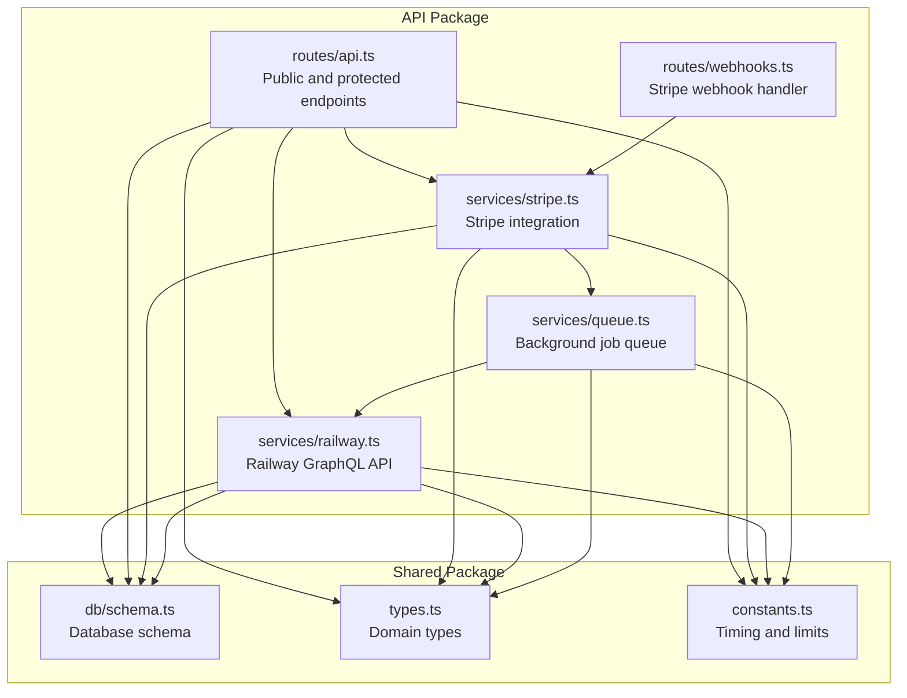
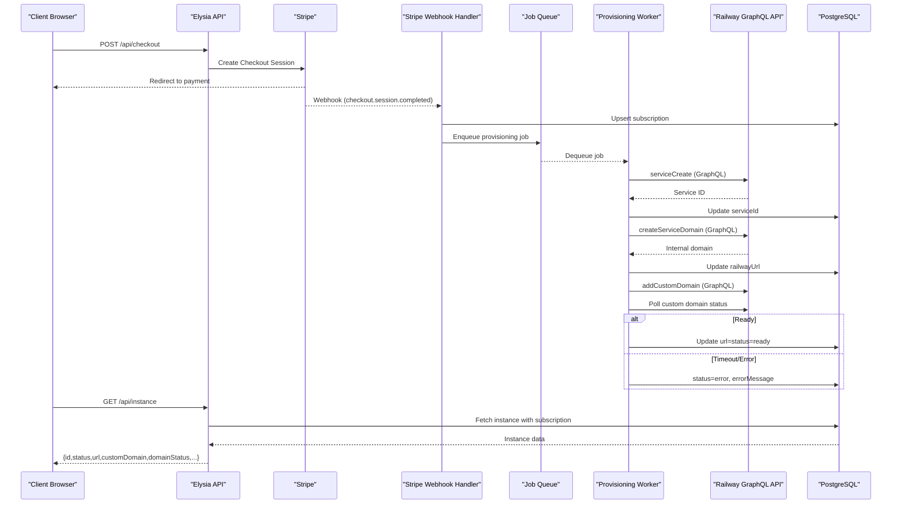
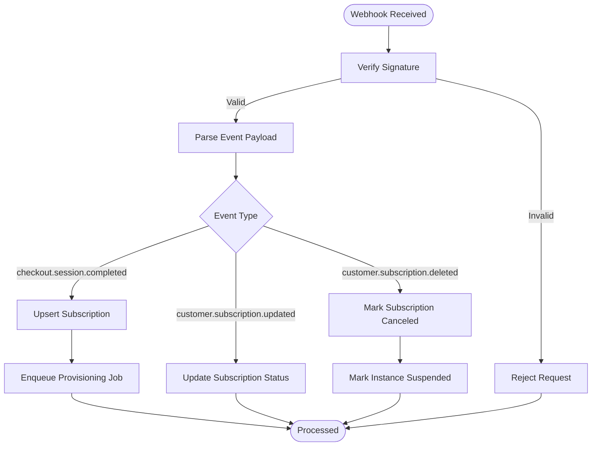
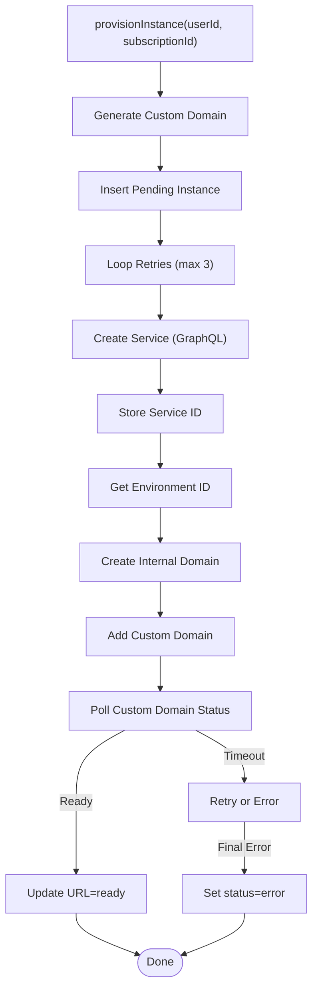
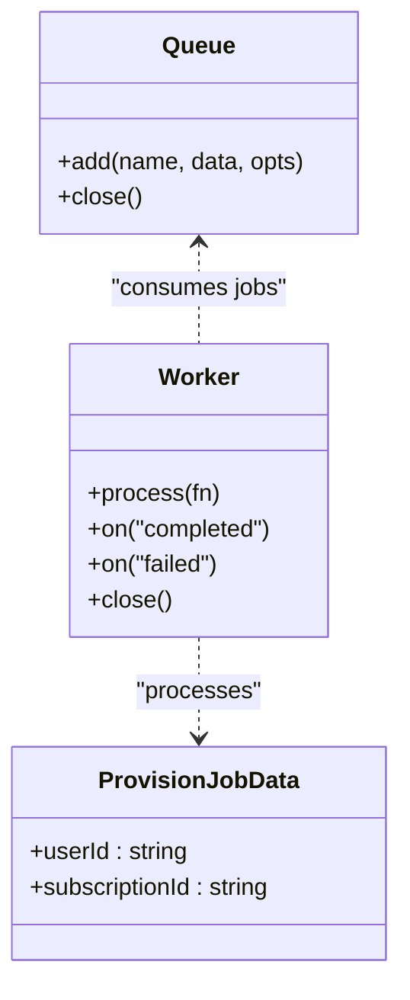
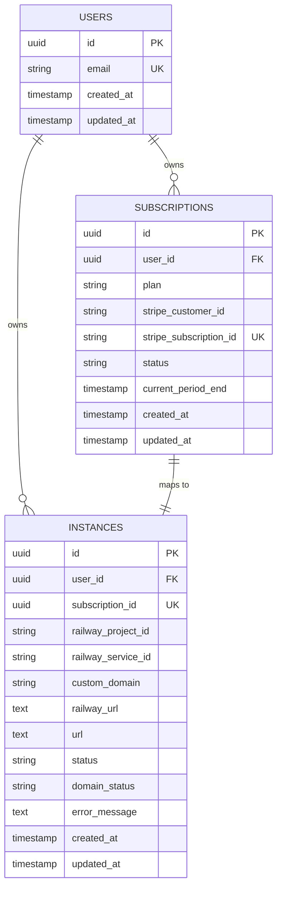
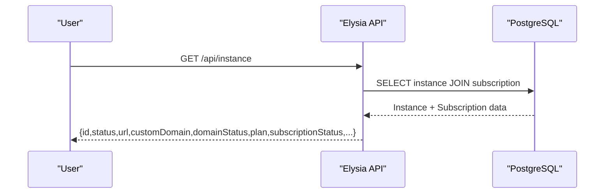
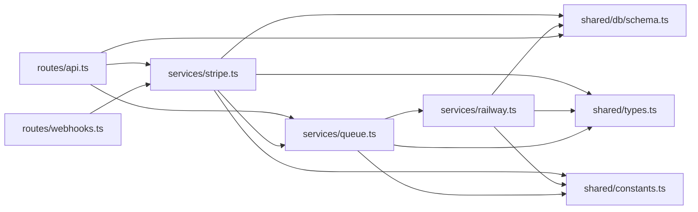

# Instance Provisioning Service

<cite>
**Referenced Files in This Document**
- [PRD.md](file://PRD.md)
- [railway.ts](file://packages/api/src/services/railway.ts)
- [queue.ts](file://packages/api/src/services/queue.ts)
- [stripe.ts](file://packages/api/src/services/stripe.ts)
- [webhooks.ts](file://packages/api/src/routes/webhooks.ts)
- [api.ts](file://packages/api/src/routes/api.ts)
- [schema.ts](file://packages/shared/src/db/schema.ts)
- [types.ts](file://packages/shared/src/types.ts)
- [constants.ts](file://packages/shared/src/constants.ts)
</cite>

## Table of Contents
1. [Introduction](#introduction)
2. [Project Structure](#project-structure)
3. [Core Components](#core-components)
4. [Architecture Overview](#architecture-overview)
5. [Detailed Component Analysis](#detailed-component-analysis)
6. [Dependency Analysis](#dependency-analysis)
7. [Performance Considerations](#performance-considerations)
8. [Troubleshooting Guide](#troubleshooting-guide)
9. [Conclusion](#conclusion)

## Introduction
This document describes the instance provisioning service that powers SparkClaw's managed OpenClaw hosting. It covers the end-to-end workflow from payment confirmation to instance availability, including Railway API integration, background job processing, retry logic, error handling, domain assignment, status monitoring, and real-time updates. It also documents the dashboard integration for live status display and user access, along with troubleshooting and optimization guidance.

## Project Structure
The provisioning service spans three primary areas:
- API layer (Elysia) exposes endpoints for authentication, checkout, and instance retrieval, and handles Stripe webhooks.
- Services encapsulate business logic for Stripe, Railway, queues, and sessions.
- Shared module defines database schemas, types, and constants used across packages.

**Diagram sources**
- [api.ts](file://packages/api/src/routes/api.ts#L1-L88)
- [webhooks.ts](file://packages/api/src/routes/webhooks.ts#L1-L49)
- [stripe.ts](file://packages/api/src/services/stripe.ts#L1-L107)
- [railway.ts](file://packages/api/src/services/railway.ts#L1-L291)
- [queue.ts](file://packages/api/src/services/queue.ts#L1-L101)
- [schema.ts](file://packages/shared/src/db/schema.ts#L1-L146)
- [types.ts](file://packages/shared/src/types.ts#L1-L57)
- [constants.ts](file://packages/shared/src/constants.ts#L1-L28)

**Section sources**
- [api.ts](file://packages/api/src/routes/api.ts#L1-L88)
- [webhooks.ts](file://packages/api/src/routes/webhooks.ts#L1-L49)
- [stripe.ts](file://packages/api/src/services/stripe.ts#L1-L107)
- [railway.ts](file://packages/api/src/services/railway.ts#L1-L291)
- [queue.ts](file://packages/api/src/services/queue.ts#L1-L101)
- [schema.ts](file://packages/shared/src/db/schema.ts#L1-L146)
- [types.ts](file://packages/shared/src/types.ts#L1-L57)
- [constants.ts](file://packages/shared/src/constants.ts#L1-L28)

## Core Components
- Stripe integration: Creates checkout sessions, verifies webhook signatures, and orchestrates provisioning upon successful payment.
- Railway integration: Uses GraphQL to create services, assign domains, and poll for readiness.
- Background job queue: Processes provisioning asynchronously with retries and exponential backoff.
- Database schema: Stores users, sessions, OTP codes, subscriptions, and instances with appropriate constraints.
- Types and constants: Define plans, statuses, and timing parameters for provisioning.

**Section sources**
- [stripe.ts](file://packages/api/src/services/stripe.ts#L1-L107)
- [railway.ts](file://packages/api/src/services/railway.ts#L1-L291)
- [queue.ts](file://packages/api/src/services/queue.ts#L1-L101)
- [schema.ts](file://packages/shared/src/db/schema.ts#L103-L146)
- [types.ts](file://packages/shared/src/types.ts#L28-L57)
- [constants.ts](file://packages/shared/src/constants.ts#L25-L28)

## Architecture Overview
The provisioning workflow begins when Stripe reports a successful checkout. The webhook handler persists the subscription and enqueues a provisioning job. The worker provisions the instance on Railway, assigns a custom domain, polls until ready, and updates the database. The dashboard consumes the instance endpoint to reflect real-time status.

**Diagram sources**
- [webhooks.ts](file://packages/api/src/routes/webhooks.ts#L24-L36)
- [stripe.ts](file://packages/api/src/services/stripe.ts#L45-L72)
- [queue.ts](file://packages/api/src/services/queue.ts#L75-L93)
- [railway.ts](file://packages/api/src/services/railway.ts#L45-L171)
- [api.ts](file://packages/api/src/routes/api.ts#L55-L77)
- [schema.ts](file://packages/shared/src/db/schema.ts#L105-L137)

## Detailed Component Analysis

### Stripe Integration
- Checkout creation: Builds a Stripe Checkout session with plan metadata and redirects the user to payment.
- Webhook handling: Verifies signatures, processes checkout completion, subscription updates, and cancellations.
- Idempotency: Deduplicates jobs by subscription ID to avoid duplicate provisioning.

**Diagram sources**
- [webhooks.ts](file://packages/api/src/routes/webhooks.ts#L6-L48)
- [stripe.ts](file://packages/api/src/services/stripe.ts#L45-L106)
- [queue.ts](file://packages/api/src/services/queue.ts#L75-L93)

**Section sources**
- [stripe.ts](file://packages/api/src/services/stripe.ts#L28-L72)
- [webhooks.ts](file://packages/api/src/routes/webhooks.ts#L24-L36)
- [queue.ts](file://packages/api/src/services/queue.ts#L75-L93)

### Railway API Integration
- GraphQL transport: Centralized request function handles auth and error extraction.
- Service lifecycle:
  - Create service in the Railway project.
  - Retrieve environment ID and create an internal Railway domain.
  - Assign a custom domain and poll for DNS verification.
  - Update instance URL and status on success; otherwise mark error after retries.
- Domain management: Generates a deterministic subdomain and tracks domain status separately from instance status.

**Diagram sources**
- [railway.ts](file://packages/api/src/services/railway.ts#L177-L290)

**Section sources**
- [railway.ts](file://packages/api/src/services/railway.ts#L13-L34)
- [railway.ts](file://packages/api/src/services/railway.ts#L45-L171)
- [railway.ts](file://packages/api/src/services/railway.ts#L177-L290)

### Background Job Processing
- Queue: BullMQ with Redis-backed persistence, configurable attempts and exponential backoff.
- Worker: Processes provisioning jobs with concurrency, logging completion/failure, and throwing on error to trigger retry.
- Deduplication: Jobs are deduplicated by subscription ID to prevent duplicate provisioning.

**Diagram sources**
- [queue.ts](file://packages/api/src/services/queue.ts#L17-L63)
- [queue.ts](file://packages/api/src/services/queue.ts#L31-L34)

**Section sources**
- [queue.ts](file://packages/api/src/services/queue.ts#L17-L93)

### Database Schema and Types
- Instances table captures lifecycle state, URLs, and domain status alongside foreign keys to users and subscriptions.
- Types define plan, subscription, instance, and domain statuses used across the system.
- Constants define polling intervals, max attempts, and retry counts.

**Diagram sources**
- [schema.ts](file://packages/shared/src/db/schema.ts#L14-L146)
- [types.ts](file://packages/shared/src/types.ts#L28-L57)

**Section sources**
- [schema.ts](file://packages/shared/src/db/schema.ts#L105-L137)
- [types.ts](file://packages/shared/src/types.ts#L28-L57)
- [constants.ts](file://packages/shared/src/constants.ts#L25-L28)

### API Endpoints and Dashboard Integration
- Protected endpoints require a valid session cookie and return user and instance data.
- The dashboard relies on GET /api/instance to render status, URL, and actions.

**Diagram sources**
- [api.ts](file://packages/api/src/routes/api.ts#L55-L77)
- [schema.ts](file://packages/shared/src/db/schema.ts#L105-L137)

**Section sources**
- [api.ts](file://packages/api/src/routes/api.ts#L34-L77)

## Dependency Analysis
- API routes depend on services for Stripe, Railway, and queue operations.
- Services depend on shared modules for types, constants, and database access.
- Railway service depends on environment variables for API token and project ID.
- Queue worker depends on Redis configuration and calls provisioning logic.

**Diagram sources**
- [api.ts](file://packages/api/src/routes/api.ts#L1-L88)
- [webhooks.ts](file://packages/api/src/routes/webhooks.ts#L1-L49)
- [stripe.ts](file://packages/api/src/services/stripe.ts#L1-L107)
- [queue.ts](file://packages/api/src/services/queue.ts#L1-L101)
- [railway.ts](file://packages/api/src/services/railway.ts#L1-L291)
- [schema.ts](file://packages/shared/src/db/schema.ts#L1-L146)
- [types.ts](file://packages/shared/src/types.ts#L1-L57)
- [constants.ts](file://packages/shared/src/constants.ts#L1-L28)

**Section sources**
- [api.ts](file://packages/api/src/routes/api.ts#L1-L88)
- [webhooks.ts](file://packages/api/src/routes/webhooks.ts#L1-L49)
- [stripe.ts](file://packages/api/src/services/stripe.ts#L1-L107)
- [queue.ts](file://packages/api/src/services/queue.ts#L1-L101)
- [railway.ts](file://packages/api/src/services/railway.ts#L1-L291)
- [schema.ts](file://packages/shared/src/db/schema.ts#L1-L146)
- [types.ts](file://packages/shared/src/types.ts#L1-L57)
- [constants.ts](file://packages/shared/src/constants.ts#L1-L28)

## Performance Considerations
- Provisioning time targets: The PRD specifies sub-five-minute provisioning time for 95th percentile.
- Polling cadence: 10 seconds interval with 6 attempts balances responsiveness and API load.
- Concurrency: Worker concurrency of 2 allows parallel provisioning while avoiding Railway throttling.
- Idempotency: Deduplication by subscription prevents redundant work during retries.
- Database indexing: Proper indexes on status, domain status, and foreign keys improve read performance for the dashboard.

[No sources needed since this section provides general guidance]

## Troubleshooting Guide
Common provisioning issues and resolutions:
- Provisioning fails immediately after payment:
  - Verify Stripe webhook signature and idempotency.
  - Check Railway API token and project ID environment variables.
  - Review job queue connectivity (Redis URL/host/port).
- Provisioning times out:
  - Confirm custom domain DNS propagation and Railway domain readiness.
  - Adjust polling parameters if necessary (intervals and max attempts).
- Instance stuck in pending:
  - Inspect job queue state and worker logs.
  - Manually enqueue a new provisioning job for the subscription.
- Subscription canceled but instance still exists:
  - Confirm webhook for cancellation was processed and instance marked suspended.
- Manual intervention:
  - Use the admin console to re-provision or mark status after investigation.

Operational checks:
- Validate environment variables for Stripe, Railway, Redis, and session secrets.
- Monitor queue backlog and retry counts.
- Inspect database rows for correct status transitions and error messages.

**Section sources**
- [webhooks.ts](file://packages/api/src/routes/webhooks.ts#L24-L36)
- [queue.ts](file://packages/api/src/services/queue.ts#L75-L93)
- [railway.ts](file://packages/api/src/services/railway.ts#L177-L290)
- [schema.ts](file://packages/shared/src/db/schema.ts#L105-L137)

## Conclusion
The instance provisioning service integrates Stripe for payments, BullMQ for asynchronous orchestration, and Railway's GraphQL API for deployment. It tracks lifecycle states, manages custom domains, and surfaces real-time status to the dashboard. The design emphasizes idempotency, retries, and observability to achieve reliable provisioning with clear recovery pathways.