# Billing and Subscription Management

<cite>
**Referenced Files in This Document**
- [packages/api/src/services/stripe.ts](file://packages/api/src/services/stripe.ts)
- [packages/api/src/routes/webhooks.ts](file://packages/api/src/routes/webhooks.ts)
- [packages/api/src/routes/api.ts](file://packages/api/src/routes/api.ts)
- [packages/api/src/routes/billing.ts](file://packages/api/src/routes/billing.ts)
- [packages/api/src/services/railway.ts](file://packages/api/src/services/railway.ts)
- [packages/api/src/services/queue.ts](file://packages/api/src/services/queue.ts)
- [packages/shared/src/constants.ts](file://packages/shared/src/constants.ts)
- [packages/shared/src/types.ts](file://packages/shared/src/types.ts)
- [packages/shared/src/db/schema.ts](file://packages/shared/src/db/schema.ts)
- [drizzle.config.ts](file://drizzle.config.ts)
</cite>

## Update Summary
**Changes Made**
- Added comprehensive billing portal integration with Stripe Billing Portal sessions
- Enhanced subscription management with cancellation endpoints and account deletion
- Integrated Redis-based job queue for asynchronous instance provisioning
- Expanded webhook coverage to include invoice.payment_failed events
- Added payment failure email notifications and subscription cancellation emails
- Enhanced database schema with proper foreign key relationships for billing

## Table of Contents
1. [Introduction](#introduction)
2. [Project Structure](#project-structure)
3. [Core Components](#core-components)
4. [Architecture Overview](#architecture-overview)
5. [Detailed Component Analysis](#detailed-component-analysis)
6. [Dependency Analysis](#dependency-analysis)
7. [Performance Considerations](#performance-considerations)
8. [Troubleshooting Guide](#troubleshooting-guide)
9. [Conclusion](#conclusion)
10. [Appendices](#appendices)

## Introduction
This document describes SparkClaw's comprehensive Stripe-powered billing and subscription management system. The system now includes full subscription lifecycle management, Stripe Billing Portal integration, automated instance provisioning, payment failure handling, and complete administrative controls for subscription cancellation and account deletion. It covers Stripe integration setup, product and price configuration, checkout session creation, webhook event processing, provisioning integration, and operational guidance for monitoring and troubleshooting.

## Project Structure
The billing system has evolved into a comprehensive infrastructure spanning multiple focused modules:
- Stripe integration and webhook handling with expanded event coverage
- Billing portal routes for customer self-service management
- Redis-based job queue for asynchronous provisioning
- Enhanced database schema with proper foreign key relationships
- Shared constants and types define plans, statuses, and environment-driven configuration
- Provisioning integrates with the Railway API for automatic instance creation

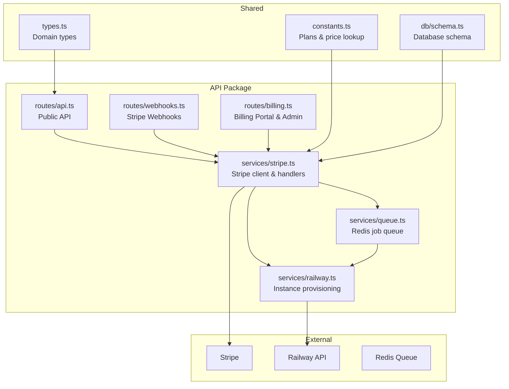

**Diagram sources**
- [packages/api/src/routes/api.ts](file://packages/api/src/routes/api.ts#L1-L207)
- [packages/api/src/routes/webhooks.ts](file://packages/api/src/routes/webhooks.ts#L1-L52)
- [packages/api/src/routes/billing.ts](file://packages/api/src/routes/billing.ts#L1-L85)
- [packages/api/src/services/stripe.ts](file://packages/api/src/services/stripe.ts#L1-L163)
- [packages/api/src/services/railway.ts](file://packages/api/src/services/railway.ts#L1-L291)
- [packages/api/src/services/queue.ts](file://packages/api/src/services/queue.ts#L1-L125)
- [packages/shared/src/constants.ts](file://packages/shared/src/constants.ts#L1-L34)
- [packages/shared/src/types.ts](file://packages/shared/src/types.ts#L1-L311)
- [packages/shared/src/db/schema.ts](file://packages/shared/src/db/schema.ts#L80-L187)

**Section sources**
- [packages/api/src/routes/api.ts](file://packages/api/src/routes/api.ts#L1-L207)
- [packages/api/src/routes/webhooks.ts](file://packages/api/src/routes/webhooks.ts#L1-L52)
- [packages/api/src/routes/billing.ts](file://packages/api/src/routes/billing.ts#L1-L85)
- [packages/api/src/services/stripe.ts](file://packages/api/src/services/stripe.ts#L1-L163)
- [packages/api/src/services/railway.ts](file://packages/api/src/services/railway.ts#L1-L291)
- [packages/api/src/services/queue.ts](file://packages/api/src/services/queue.ts#L1-L125)
- [packages/shared/src/constants.ts](file://packages/shared/src/constants.ts#L1-L34)
- [packages/shared/src/types.ts](file://packages/shared/src/types.ts#L1-L311)
- [packages/shared/src/db/schema.ts](file://packages/shared/src/db/schema.ts#L80-L187)

## Core Components
- Enhanced Stripe client initialization with comprehensive event handling
- Expanded checkout session creation with plan-specific pricing and metadata
- Complete webhook processing for checkout completion, subscription updates, cancellations, and payment failures
- Stripe Billing Portal integration for customer self-service management
- Administrative endpoints for subscription cancellation and account deletion
- Redis-based job queue for asynchronous instance provisioning
- Comprehensive subscription and instance persistence with foreign key relationships
- Automated provisioning pipeline with retry mechanisms and error handling
- Payment failure notifications and subscription cancellation emails

Key responsibilities:
- Enforce environment validation for Stripe keys, webhook secrets, and Redis configuration
- Map Stripe plans to price IDs via environment variables with comprehensive error handling
- Persist subscription state with proper foreign key relationships and trigger provisioning asynchronously
- Handle payment failures with automated status updates and user notifications
- Provide customer self-service through Stripe Billing Portal integration
- Support administrative operations for subscription management and account cleanup

**Section sources**
- [packages/api/src/services/stripe.ts](file://packages/api/src/services/stripe.ts#L1-L163)
- [packages/api/src/routes/billing.ts](file://packages/api/src/routes/billing.ts#L1-L85)
- [packages/api/src/services/queue.ts](file://packages/api/src/services/queue.ts#L1-L125)
- [packages/shared/src/constants.ts](file://packages/shared/src/constants.ts#L1-L34)
- [packages/shared/src/types.ts](file://packages/shared/src/types.ts#L65-L77)
- [packages/shared/src/db/schema.ts](file://packages/shared/src/db/schema.ts#L80-L187)

## Architecture Overview
The system now provides a complete billing infrastructure with customer self-service capabilities and administrative controls. It orchestrates Stripe checkout sessions, processes comprehensive webhook events, manages customer billing portals, and provisions user instances with robust error handling and notifications.

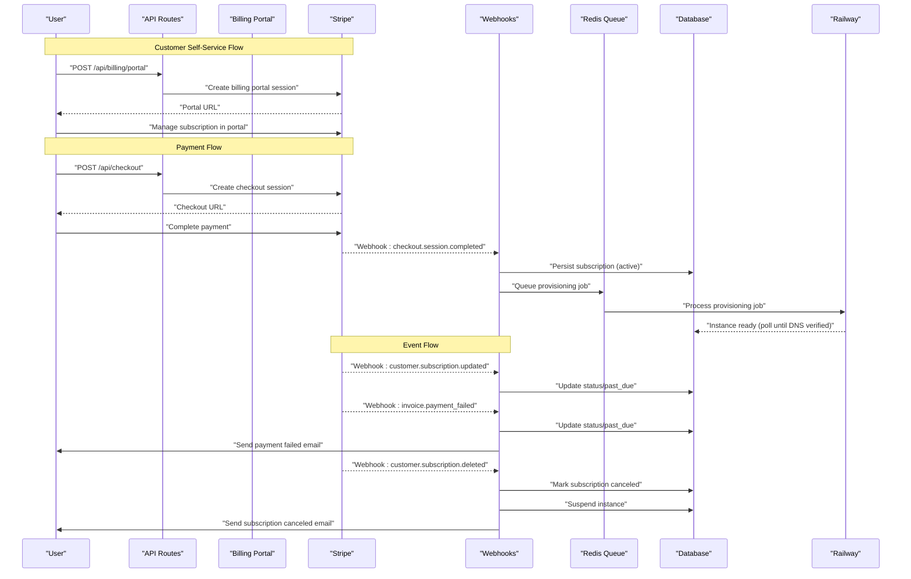

**Diagram sources**
- [packages/api/src/routes/billing.ts](file://packages/api/src/routes/billing.ts#L21-L34)
- [packages/api/src/routes/api.ts](file://packages/api/src/routes/api.ts#L196-L206)
- [packages/api/src/services/stripe.ts](file://packages/api/src/services/stripe.ts#L31-L46)
- [packages/api/src/routes/webhooks.ts](file://packages/api/src/routes/webhooks.ts#L24-L36)
- [packages/api/src/services/stripe.ts](file://packages/api/src/services/stripe.ts#L48-L82)
- [packages/api/src/services/queue.ts](file://packages/api/src/services/queue.ts#L94-L111)
- [packages/api/src/services/stripe.ts](file://packages/api/src/services/stripe.ts#L84-L95)
- [packages/api/src/services/stripe.ts](file://packages/api/src/services/stripe.ts#L141-L162)
- [packages/api/src/services/stripe.ts](file://packages/api/src/services/stripe.ts#L114-L139)

## Detailed Component Analysis

### Enhanced Stripe Integration and Checkout
- Initializes the Stripe SDK with API version 2025-02-24.acacia and comprehensive error handling
- Constructs Stripe events using webhook secret for signature verification
- Creates checkout sessions in subscription mode with plan-specific price IDs resolved from environment variables
- Embeds user metadata (userId, plan) for downstream processing
- Redirect URLs support success and cancel outcomes for post-payment UX

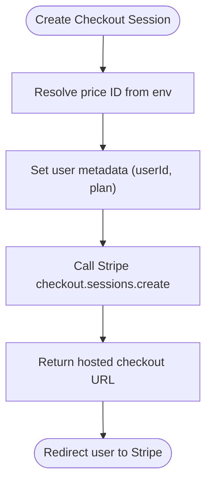

**Diagram sources**
- [packages/api/src/services/stripe.ts](file://packages/api/src/services/stripe.ts#L14-L21)
- [packages/api/src/services/stripe.ts](file://packages/api/src/services/stripe.ts#L31-L46)
- [packages/shared/src/constants.ts](file://packages/shared/src/constants.ts#L3-L8)

**Section sources**
- [packages/api/src/services/stripe.ts](file://packages/api/src/services/stripe.ts#L14-L21)
- [packages/api/src/services/stripe.ts](file://packages/api/src/services/stripe.ts#L31-L46)
- [packages/shared/src/constants.ts](file://packages/shared/src/constants.ts#L3-L8)

### Comprehensive Webhook Event Processing
- Validates presence of the Stripe signature header with comprehensive error handling
- Verifies webhook signatures using the configured webhook secret
- Extends event coverage to include invoice.payment_failed for payment failure handling
- Dispatches to dedicated handlers for:
  - checkout.session.completed: persists subscription and queues provisioning
  - customer.subscription.updated: updates status to active or past_due
  - customer.subscription.deleted: marks subscription canceled and suspends instance
  - invoice.payment_failed: updates status to past_due and sends notification
- Implements robust error handling with structured logging and appropriate HTTP status codes

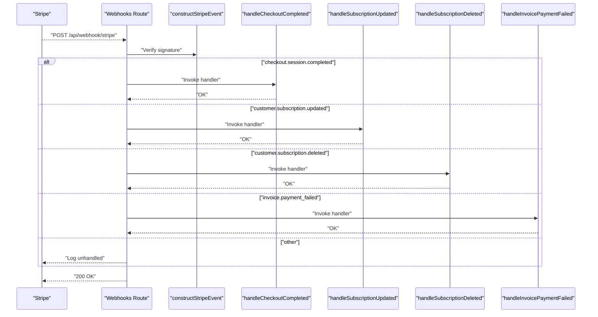

**Diagram sources**
- [packages/api/src/routes/webhooks.ts](file://packages/api/src/routes/webhooks.ts#L6-L51)
- [packages/api/src/services/stripe.ts](file://packages/api/src/services/stripe.ts#L23-L29)
- [packages/api/src/services/stripe.ts](file://packages/api/src/services/stripe.ts#L48-L82)
- [packages/api/src/services/stripe.ts](file://packages/api/src/services/stripe.ts#L84-L95)
- [packages/api/src/services/stripe.ts](file://packages/api/src/services/stripe.ts#L114-L139)
- [packages/api/src/services/stripe.ts](file://packages/api/src/services/stripe.ts#L141-L162)

**Section sources**
- [packages/api/src/routes/webhooks.ts](file://packages/api/src/routes/webhooks.ts#L6-L51)
- [packages/api/src/services/stripe.ts](file://packages/api/src/services/stripe.ts#L23-L29)
- [packages/api/src/services/stripe.ts](file://packages/api/src/services/stripe.ts#L48-L82)
- [packages/api/src/services/stripe.ts](file://packages/api/src/services/stripe.ts#L84-L95)
- [packages/api/src/services/stripe.ts](file://packages/api/src/services/stripe.ts#L114-L139)
- [packages/api/src/services/stripe.ts](file://packages/api/src/services/stripe.ts#L141-L162)

### Stripe Billing Portal Integration
- Creates Stripe Billing Portal sessions for customer self-service management
- Supports subscription modification, payment method updates, and plan changes
- Returns secure, time-limited portal URLs that redirect customers to the billing portal
- Integrates with existing subscription lookup to ensure proper customer association

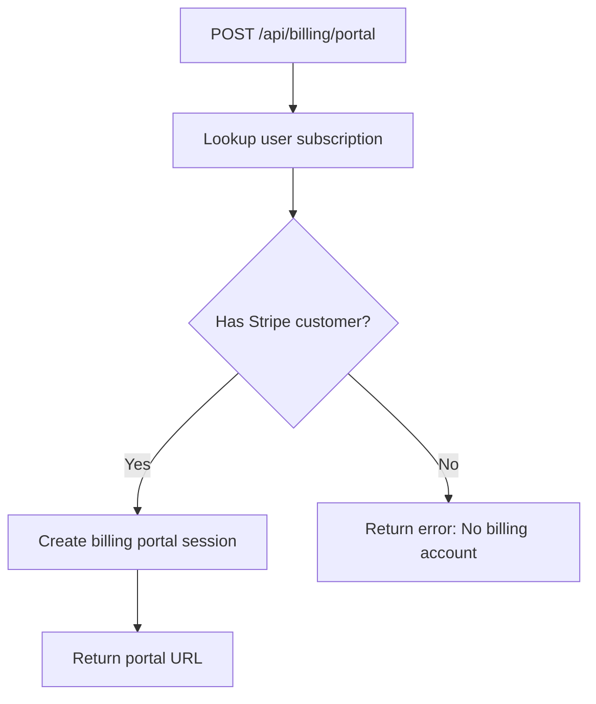

**Diagram sources**
- [packages/api/src/routes/billing.ts](file://packages/api/src/routes/billing.ts#L21-L34)
- [packages/api/src/services/stripe.ts](file://packages/api/src/services/stripe.ts#L97-L106)

**Section sources**
- [packages/api/src/routes/billing.ts](file://packages/api/src/routes/billing.ts#L21-L34)
- [packages/api/src/services/stripe.ts](file://packages/api/src/services/stripe.ts#L97-L106)

### Administrative Subscription Management
- Provides comprehensive subscription cancellation endpoint with validation
- Supports account deletion with cascading data cleanup
- Implements proper state synchronization between Stripe and local database
- Includes audit logging for administrative actions

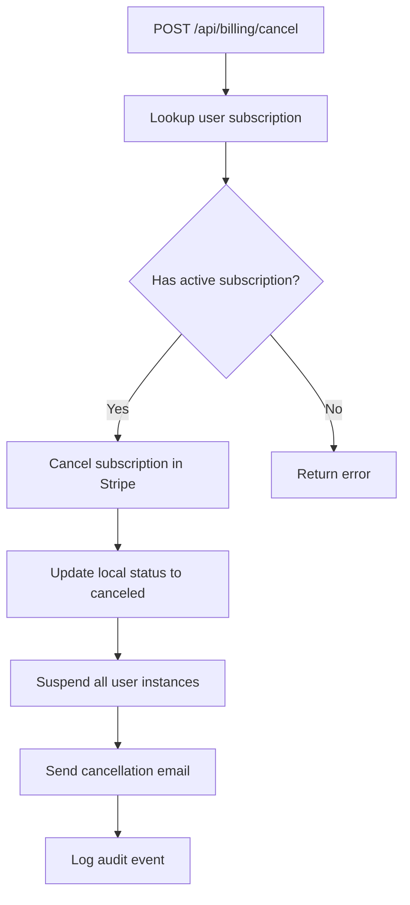

**Diagram sources**
- [packages/api/src/routes/billing.ts](file://packages/api/src/routes/billing.ts#L35-L67)
- [packages/api/src/services/stripe.ts](file://packages/api/src/services/stripe.ts#L108-L112)

**Section sources**
- [packages/api/src/routes/billing.ts](file://packages/api/src/routes/billing.ts#L35-L67)
- [packages/api/src/services/stripe.ts](file://packages/api/src/services/stripe.ts#L108-L112)

### Redis-Based Job Queue for Provisioning
- Implements BullMQ-based job queue for asynchronous instance provisioning
- Configures exponential backoff with 3 attempts for resilient processing
- Supports graceful shutdown and connection management
- Provides job monitoring with completion and failure logging

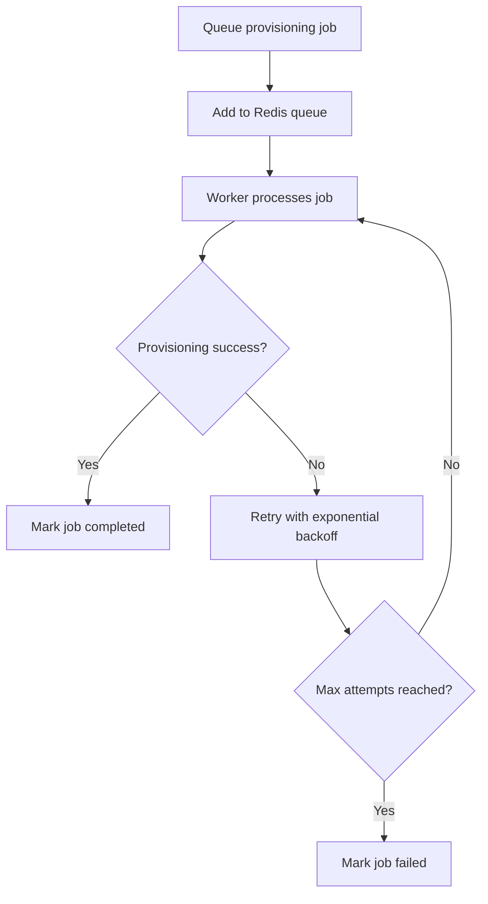

**Diagram sources**
- [packages/api/src/services/queue.ts](file://packages/api/src/services/queue.ts#L94-L111)
- [packages/api/src/services/queue.ts](file://packages/api/src/services/queue.ts#L53-L79)

**Section sources**
- [packages/api/src/services/queue.ts](file://packages/api/src/services/queue.ts#L1-L125)

### Enhanced Database Schema and Relationships
- Defines comprehensive subscription table with unique constraints and indexes
- Establishes proper foreign key relationships between users, subscriptions, and instances
- Supports plan limits with configurable instance quotas per subscription tier
- Includes audit trail with proper indexing for performance

```mermaid
erDiagram
USERS ||--o{ SUBSCRIPTIONS : has
SUBSCRIPTIONS ||--o{ INSTANCES : manages
INSTANCES {
uuid id PK
uuid userId FK
uuid subscriptionId FK
varchar status
timestamp createdAt
timestamp updatedAt
}
SUBSCRIPTIONS {
uuid id PK
uuid userId FK UK
varchar plan
varchar stripeCustomerId
varchar stripeSubscriptionId UK
varchar status
timestamp currentPeriodEnd
timestamp createdAt
timestamp updatedAt
}
```

**Diagram sources**
- [packages/shared/src/db/schema.ts](file://packages/shared/src/db/schema.ts#L80-L112)
- [packages/shared/src/db/schema.ts](file://packages/shared/src/db/schema.ts#L114-L187)

**Section sources**
- [packages/shared/src/db/schema.ts](file://packages/shared/src/db/schema.ts#L80-L187)
- [packages/shared/src/constants.ts](file://packages/shared/src/constants.ts#L29-L33)

### Subscription Lifecycle Management
- Enhanced status tracking: active, canceled, past_due with comprehensive state transitions
- Improved period end tracking for accurate billing cycle management
- Enhanced proration handling through Stripe subscription data integration
- Expanded customer portal integration with full self-service capabilities
- Added payment failure handling with automated status updates and user notifications

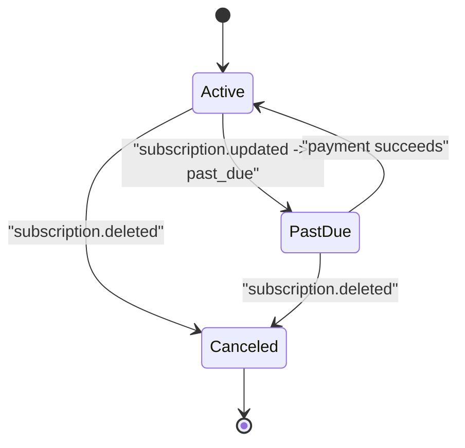

**Diagram sources**
- [packages/api/src/services/stripe.ts](file://packages/api/src/services/stripe.ts#L84-L95)
- [packages/api/src/services/stripe.ts](file://packages/api/src/services/stripe.ts#L114-L139)
- [packages/shared/src/types.ts](file://packages/shared/src/types.ts#L66-L67)

**Section sources**
- [packages/api/src/services/stripe.ts](file://packages/api/src/services/stripe.ts#L84-L95)
- [packages/api/src/services/stripe.ts](file://packages/api/src/services/stripe.ts#L114-L139)
- [packages/shared/src/types.ts](file://packages/shared/src/types.ts#L66-L67)

### Enhanced Provisioning System Integration
- On checkout completion, inserts pending instance record and queues provisioning jobs
- Uses Railway GraphQL to create services, assign domains, and configure custom domains
- Implements exponential backoff with bounded retries for DNS verification
- Enhanced error handling with comprehensive logging and status tracking
- Supports both Redis-based queuing and direct provisioning fallback

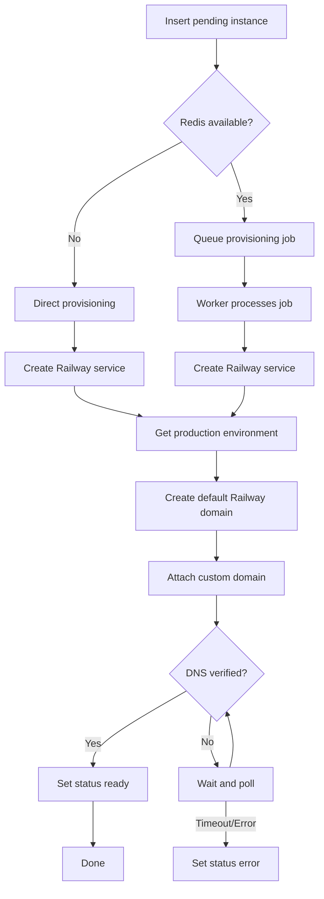

**Diagram sources**
- [packages/api/src/services/stripe.ts](file://packages/api/src/services/stripe.ts#L71-L82)
- [packages/api/src/services/queue.ts](file://packages/api/src/services/queue.ts#L94-L111)
- [packages/api/src/services/railway.ts](file://packages/api/src/services/railway.ts#L177-L291)

**Section sources**
- [packages/api/src/services/stripe.ts](file://packages/api/src/services/stripe.ts#L71-L82)
- [packages/api/src/services/queue.ts](file://packages/api/src/services/queue.ts#L94-L111)
- [packages/api/src/services/railway.ts](file://packages/api/src/services/railway.ts#L177-L291)

### Enhanced Public API Endpoints
- GET /api/me: Returns user profile with enhanced subscription details and instance limits
- GET /api/instances: Returns user instance details with subscription status integration
- POST /api/checkout: Initiates Stripe checkout session with comprehensive validation
- POST /api/billing/portal: Creates Stripe Billing Portal session for customer self-service
- POST /api/billing/cancel: Administrative subscription cancellation with validation
- DELETE /api/billing/account: Complete account deletion with cascading cleanup

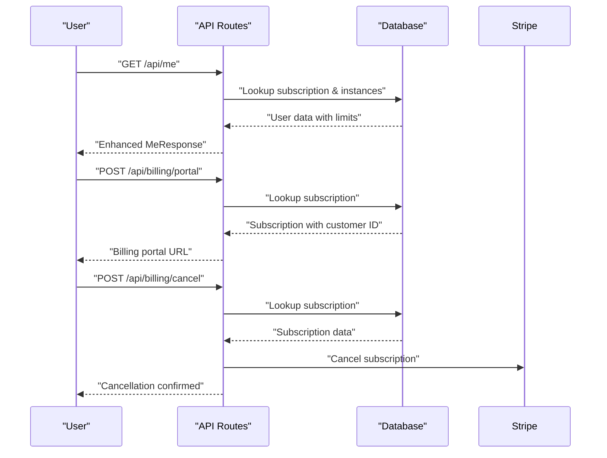

**Diagram sources**
- [packages/api/src/routes/api.ts](file://packages/api/src/routes/api.ts#L62-L92)
- [packages/api/src/routes/api.ts](file://packages/api/src/routes/api.ts#L94-L102)
- [packages/api/src/routes/api.ts](file://packages/api/src/routes/api.ts#L196-L206)
- [packages/api/src/routes/billing.ts](file://packages/api/src/routes/billing.ts#L21-L34)
- [packages/api/src/routes/billing.ts](file://packages/api/src/routes/billing.ts#L35-L67)

**Section sources**
- [packages/api/src/routes/api.ts](file://packages/api/src/routes/api.ts#L62-L92)
- [packages/api/src/routes/api.ts](file://packages/api/src/routes/api.ts#L94-L102)
- [packages/api/src/routes/api.ts](file://packages/api/src/routes/api.ts#L196-L206)
- [packages/api/src/routes/billing.ts](file://packages/api/src/routes/billing.ts#L21-L34)
- [packages/api/src/routes/billing.ts](file://packages/api/src/routes/billing.ts#L35-L67)

## Dependency Analysis
- Stripe service depends on shared constants for plan-to-price resolution, types for plan enumeration, and database schema for subscription management
- Webhooks route depends on Stripe service for event verification and comprehensive handler dispatch
- Billing routes depend on Stripe service for portal sessions and administrative operations
- Queue service depends on Redis configuration and provisioning service for job processing
- API routes depend on Stripe service for checkout creation, billing routes for portal access, and database queries for user state

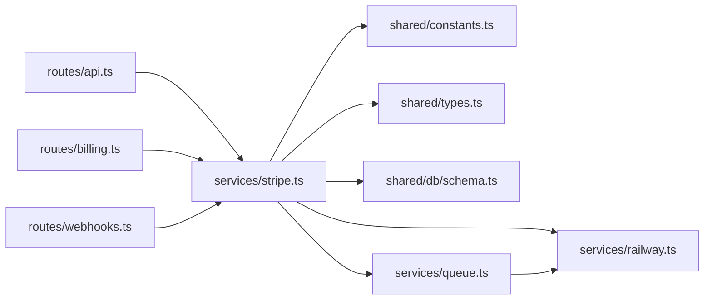

**Diagram sources**
- [packages/api/src/routes/api.ts](file://packages/api/src/routes/api.ts#L1-L207)
- [packages/api/src/routes/billing.ts](file://packages/api/src/routes/billing.ts#L1-L85)
- [packages/api/src/routes/webhooks.ts](file://packages/api/src/routes/webhooks.ts#L1-L52)
- [packages/api/src/services/stripe.ts](file://packages/api/src/services/stripe.ts#L1-L163)
- [packages/api/src/services/queue.ts](file://packages/api/src/services/queue.ts#L1-L125)
- [packages/api/src/services/railway.ts](file://packages/api/src/services/railway.ts#L1-L291)
- [packages/shared/src/constants.ts](file://packages/shared/src/constants.ts#L1-L34)
- [packages/shared/src/types.ts](file://packages/shared/src/types.ts#L1-L311)
- [packages/shared/src/db/schema.ts](file://packages/shared/src/db/schema.ts#L80-L187)

**Section sources**
- [packages/api/src/routes/api.ts](file://packages/api/src/routes/api.ts#L1-L207)
- [packages/api/src/routes/billing.ts](file://packages/api/src/routes/billing.ts#L1-L85)
- [packages/api/src/routes/webhooks.ts](file://packages/api/src/routes/webhooks.ts#L1-L52)
- [packages/api/src/services/stripe.ts](file://packages/api/src/services/stripe.ts#L1-L163)
- [packages/api/src/services/queue.ts](file://packages/api/src/services/queue.ts#L1-L125)
- [packages/api/src/services/railway.ts](file://packages/api/src/services/railway.ts#L1-L291)
- [packages/shared/src/constants.ts](file://packages/shared/src/constants.ts#L1-L34)
- [packages/shared/src/types.ts](file://packages/shared/src/types.ts#L1-L311)
- [packages/shared/src/db/schema.ts](file://packages/shared/src/db/schema.ts#L80-L187)

## Performance Considerations
- Checkout creation remains synchronous and lightweight, leveraging Stripe's optimized infrastructure
- Webhook handlers implement fire-and-forget pattern with comprehensive error handling to prevent timeout issues
- Redis-based job queue provides scalable asynchronous processing with exponential backoff and retry mechanisms
- Database schema includes proper indexing for subscription and instance lookups to minimize query latency
- Provisioning uses configurable polling intervals and bounded retries to balance reliability with resource utilization
- Email notifications are handled asynchronously to avoid blocking webhook responses

## Troubleshooting Guide
Common issues and resolutions:
- Missing or invalid Stripe signature: Ensure webhook endpoint receives stripe-signature header and webhook secret matches configured value
- Invalid plan during checkout: Verify plan is one of starter, pro, or scale with corresponding STRIPE_PRICE_* environment variables
- Redis connectivity issues: Check Redis URL configuration and network connectivity for job queue functionality
- Provisioning timeouts: Monitor Railway API availability, DNS configuration, and custom domain propagation through queue workers
- Subscription status mismatches: Verify webhook handlers are properly configured and subscription updates are reflected in database
- Payment failures: System automatically handles invoice.payment_failed events with status updates and user notifications
- Billing portal errors: Ensure Stripe customer ID exists before attempting portal session creation
- Account deletion issues: Verify cascading foreign key relationships are properly configured in database schema

Operational tips:
- Use Stripe CLI to test webhooks locally and replay events for debugging
- Monitor Redis queue metrics and worker health for provisioning reliability
- Validate environment variables at startup including Stripe keys, webhook secrets, and Redis configuration
- Enable comprehensive logging for webhook processing and provisioning job execution
- Test billing portal functionality with test customer accounts before production deployment

**Section sources**
- [packages/api/src/routes/webhooks.ts](file://packages/api/src/routes/webhooks.ts#L6-L51)
- [packages/api/src/services/stripe.ts](file://packages/api/src/services/stripe.ts#L23-L29)
- [packages/api/src/services/queue.ts](file://packages/api/src/services/queue.ts#L9-L19)
- [packages/shared/src/constants.ts](file://packages/shared/src/constants.ts#L3-L8)
- [packages/api/src/services/stripe.ts](file://packages/api/src/services/stripe.ts#L141-L162)
- [packages/api/src/routes/billing.ts](file://packages/api/src/routes/billing.ts#L21-L34)

## Conclusion
SparkClaw's enhanced billing system now provides a comprehensive, enterprise-ready subscription management solution. The integration includes full Stripe Billing Portal support, administrative controls for subscription management, robust webhook processing with payment failure handling, and scalable provisioning infrastructure. The system emphasizes reliability through Redis-based job queues, comprehensive error handling, and extensive monitoring capabilities.

## Appendices

### Enhanced Product and Price Configuration
- Plans supported: Starter ($19/month), Pro ($39/month), Scale ($79/month)
- Price IDs resolved from environment variables with comprehensive validation
- Plan instance limits: Starter (1), Pro (3), Scale (10) with automatic enforcement
- API version pinned to 2025-02-24.acacia for Stripe SDK compatibility

**Section sources**
- [packages/shared/src/constants.ts](file://packages/shared/src/constants.ts#L10-L14)
- [packages/shared/src/constants.ts](file://packages/shared/src/constants.ts#L29-L33)
- [packages/shared/src/constants.ts](file://packages/shared/src/constants.ts#L3-L8)
- [packages/api/src/services/stripe.ts](file://packages/api/src/services/stripe.ts#L14-L21)

### Enhanced Webhook Security and Idempotency
- Signature verification: Comprehensive webhook route validation with stripe-signature header
- Idempotency: Handlers implement idempotent database writes with proper conflict resolution
- Retry mechanisms: Stripe retries failed webhook deliveries with exponential backoff
- Error handling: Structured logging with detailed error contexts and appropriate HTTP status codes

**Section sources**
- [packages/api/src/routes/webhooks.ts](file://packages/api/src/routes/webhooks.ts#L6-L51)
- [packages/api/src/services/stripe.ts](file://packages/api/src/services/stripe.ts#L23-L29)

### Enhanced Subscription Flow: From Selection to Provisioning
- Plan selection: Frontend posts plan to POST /api/checkout with comprehensive validation
- Stripe Checkout: Backend creates checkout session with metadata embedding user and plan information
- Payment completion: Stripe redirects user and sends checkout.session.completed webhook
- Provisioning: Webhook handler persists subscription and queues provisioning job
- Status updates: customer.subscription.updated and invoice.payment_failed keep state synchronized
- Customer self-service: Billing portal integration enables subscription management
- Administrative controls: Cancellation and account deletion endpoints with validation

**Section sources**
- [packages/api/src/routes/api.ts](file://packages/api/src/routes/api.ts#L196-L206)
- [packages/api/src/services/stripe.ts](file://packages/api/src/services/stripe.ts#L31-L46)
- [packages/api/src/services/stripe.ts](file://packages/api/src/services/stripe.ts#L48-L82)
- [packages/api/src/services/stripe.ts](file://packages/api/src/services/stripe.ts#L84-L95)
- [packages/api/src/services/stripe.ts](file://packages/api/src/services/stripe.ts#L141-L162)
- [packages/api/src/routes/billing.ts](file://packages/api/src/routes/billing.ts#L21-L34)
- [packages/api/src/routes/billing.ts](file://packages/api/src/routes/billing.ts#L35-L67)

### Enhanced Monitoring and Reporting
- Structured logging: Comprehensive logging with correlation IDs and detailed error contexts
- Revenue tracking: Stripe Reports and Analytics for comprehensive financial insights
- Subscription analytics: Real-time tracking of active, past_due, and canceled subscriptions
- Queue monitoring: Redis queue metrics for provisioning job throughput and reliability
- Audit trails: Complete audit logs for all subscription and administrative actions
- Performance monitoring: Database query optimization and connection pooling for scalability

**Section sources**
- [packages/api/src/services/stripe.ts](file://packages/api/src/services/stripe.ts#L71-L82)
- [packages/api/src/services/queue.ts](file://packages/api/src/services/queue.ts#L53-L89)
- [packages/shared/src/db/schema.ts](file://packages/shared/src/db/schema.ts#L248-L274)