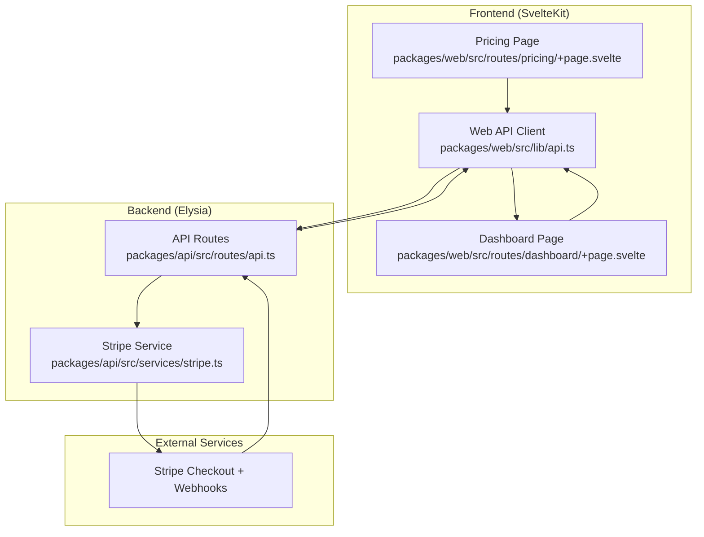
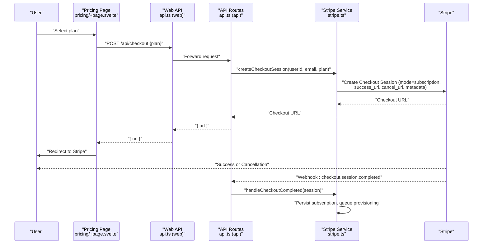
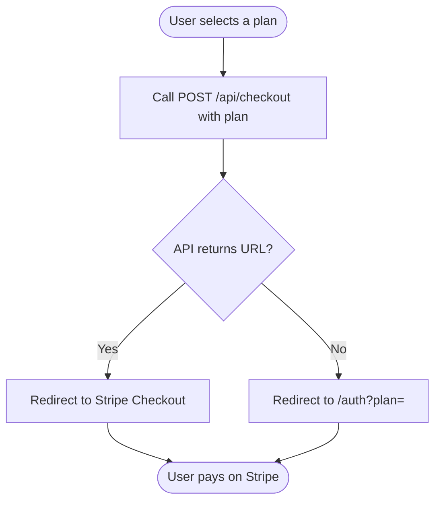
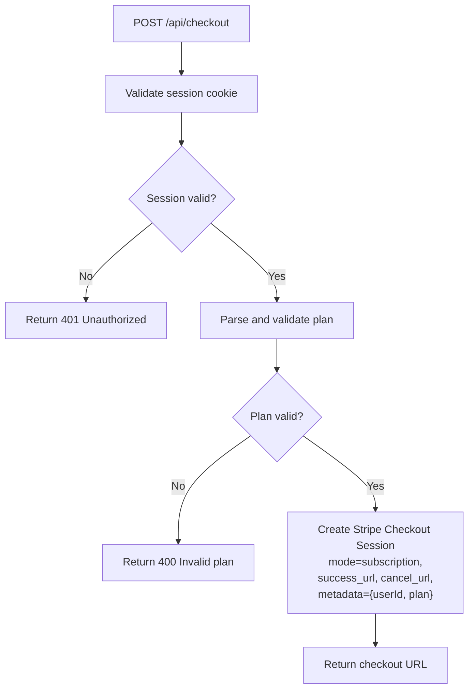
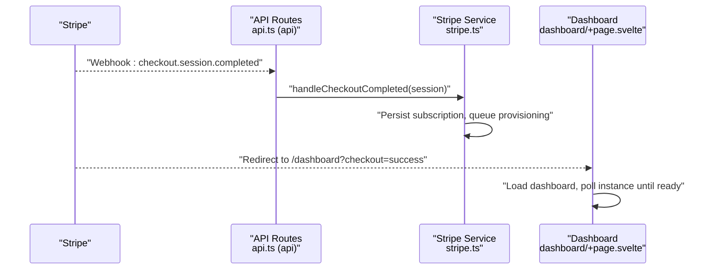
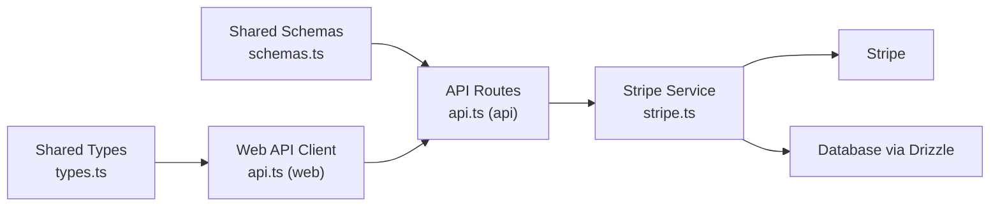

# Checkout Session Flow

<cite>
**Referenced Files in This Document**
- [PRD.md](file://PRD.md)
- [stripe.ts](file://packages/api/src/services/stripe.ts)
- [api.ts](file://packages/api/src/routes/api.ts)
- [api.ts](file://packages/web/src/lib/api.ts)
- [pricing/+page.svelte](file://packages/web/src/routes/pricing/+page.svelte)
- [dashboard/+page.svelte](file://packages/web/src/routes/dashboard/+page.svelte)
- [types.ts](file://packages/shared/src/types.ts)
- [schemas.ts](file://packages/shared/src/schemas.ts)
</cite>

## Table of Contents
1. [Introduction](#introduction)
2. [Project Structure](#project-structure)
3. [Core Components](#core-components)
4. [Architecture Overview](#architecture-overview)
5. [Detailed Component Analysis](#detailed-component-analysis)
6. [Dependency Analysis](#dependency-analysis)
7. [Performance Considerations](#performance-considerations)
8. [Troubleshooting Guide](#troubleshooting-guide)
9. [Conclusion](#conclusion)
10. [Appendices](#appendices)

## Introduction
This document explains the complete Stripe Checkout session flow in SparkClaw, from plan selection through payment completion and post-payment redirection. It covers:
- How the frontend initiates checkout
- How the backend creates a Stripe Checkout session with metadata for user identification and plan selection
- Success and cancellation URL configuration and parameter handling
- The redirect flow back to the SparkClaw dashboard and success confirmation
- Examples of customization options, recurring billing setup, and subscription terms configuration
- Browser compatibility, mobile optimization, and fallback handling for checkout failures
- Debugging techniques and user experience optimization strategies

## Project Structure
The checkout flow spans three layers:
- Frontend (SvelteKit): Pricing page and dashboard collect the selected plan and initiate checkout
- API (Elysia): Validates session, parses plan, and creates the Stripe Checkout session
- Stripe: Hosted checkout page, redirects, and webhooks

**Diagram sources**
- [pricing/+page.svelte](file://packages/web/src/routes/pricing/+page.svelte#L1-L80)
- [dashboard/+page.svelte](file://packages/web/src/routes/dashboard/+page.svelte#L1-L220)
- [api.ts](file://packages/web/src/lib/api.ts#L1-L52)
- [api.ts](file://packages/api/src/routes/api.ts#L1-L88)
- [stripe.ts](file://packages/api/src/services/stripe.ts#L1-L107)

**Section sources**
- [pricing/+page.svelte](file://packages/web/src/routes/pricing/+page.svelte#L1-L80)
- [dashboard/+page.svelte](file://packages/web/src/routes/dashboard/+page.svelte#L1-L220)
- [api.ts](file://packages/web/src/lib/api.ts#L1-L52)
- [api.ts](file://packages/api/src/routes/api.ts#L1-L88)
- [stripe.ts](file://packages/api/src/services/stripe.ts#L1-L107)

## Core Components
- Frontend plan selection and checkout initiation
  - Pricing page renders plan cards and calls the backend to create a checkout session
  - Dashboard handles post-login flow and can trigger checkout if a plan is present in the URL
- Backend checkout session creation
  - Validates the authenticated session, parses the plan, and creates a Stripe Checkout session with metadata
  - Configures success and cancellation URLs pointing to the SparkClaw dashboard and pricing page respectively
- Stripe handling
  - Stripe redirects the user back to the configured success or cancellation URL
  - Webhooks update subscription and instance states in the database

Key implementation references:
- Frontend API client and plan selection: [api.ts](file://packages/web/src/lib/api.ts#L46-L51), [pricing/+page.svelte](file://packages/web/src/routes/pricing/+page.svelte#L22-L32)
- Backend checkout route and session creation: [api.ts](file://packages/api/src/routes/api.ts#L78-L87), [stripe.ts](file://packages/api/src/services/stripe.ts#L28-L43)
- Success and cancellation URL configuration: [stripe.ts](file://packages/api/src/services/stripe.ts#L37-L38)
- Metadata handling for user identification and plan: [stripe.ts](file://packages/api/src/services/stripe.ts#L39)
- Dashboard post-redirect handling and polling: [dashboard/+page.svelte](file://packages/web/src/routes/dashboard/+page.svelte#L24-L45)

**Section sources**
- [api.ts](file://packages/web/src/lib/api.ts#L46-L51)
- [pricing/+page.svelte](file://packages/web/src/routes/pricing/+page.svelte#L22-L32)
- [api.ts](file://packages/api/src/routes/api.ts#L78-L87)
- [stripe.ts](file://packages/api/src/services/stripe.ts#L28-L43)
- [stripe.ts](file://packages/api/src/services/stripe.ts#L37-L39)
- [dashboard/+page.svelte](file://packages/web/src/routes/dashboard/+page.svelte#L24-L45)

## Architecture Overview
The checkout flow follows a strict sequence: plan selection → session creation → Stripe redirect → webhook processing → dashboard confirmation.

**Diagram sources**
- [pricing/+page.svelte](file://packages/web/src/routes/pricing/+page.svelte#L22-L32)
- [api.ts](file://packages/web/src/lib/api.ts#L46-L51)
- [api.ts](file://packages/api/src/routes/api.ts#L78-L87)
- [stripe.ts](file://packages/api/src/services/stripe.ts#L28-L43)
- [stripe.ts](file://packages/api/src/services/stripe.ts#L45-L72)

## Detailed Component Analysis

### Frontend: Plan Selection and Checkout Initiation
- Pricing page
  - Renders three plans and triggers checkout on selection
  - On success, redirects to Stripe; on failure, redirects to the auth page with the plan encoded in the URL
- Dashboard
  - On mount, checks for a plan parameter in the URL and a missing subscription
  - If both conditions are met, triggers checkout and redirects to Stripe

Implementation references:
- Plan selection and redirect: [pricing/+page.svelte](file://packages/web/src/routes/pricing/+page.svelte#L22-L32)
- URL parameter handling and checkout: [dashboard/+page.svelte](file://packages/web/src/routes/dashboard/+page.svelte#L24-L35)
- API call to create checkout: [api.ts](file://packages/web/src/lib/api.ts#L46-L51)

**Diagram sources**
- [pricing/+page.svelte](file://packages/web/src/routes/pricing/+page.svelte#L22-L32)
- [dashboard/+page.svelte](file://packages/web/src/routes/dashboard/+page.svelte#L24-L35)
- [api.ts](file://packages/web/src/lib/api.ts#L46-L51)

**Section sources**
- [pricing/+page.svelte](file://packages/web/src/routes/pricing/+page.svelte#L22-L32)
- [dashboard/+page.svelte](file://packages/web/src/routes/dashboard/+page.svelte#L24-L35)
- [api.ts](file://packages/web/src/lib/api.ts#L46-L51)

### Backend: Checkout Session Creation and Metadata Handling
- Session validation
  - API routes enforce authentication and resolve the current user before allowing checkout creation
- Plan validation
  - Uses a Zod schema to ensure the plan value is one of the supported values
- Stripe session creation
  - Creates a subscription-mode session with:
    - Customer email
    - Single line item referencing the Stripe price ID for the selected plan
    - Success and cancellation URLs configured to SparkClaw pages
    - Metadata containing user ID and plan for downstream processing
- Webhook construction
  - Provides a helper to verify and construct Stripe events using the webhook secret

Implementation references:
- Authentication and user resolution: [api.ts](file://packages/api/src/routes/api.ts#L13-L27)
- Plan validation: [api.ts](file://packages/api/src/routes/api.ts#L79-L83)
- Session creation and metadata: [stripe.ts](file://packages/api/src/services/stripe.ts#L28-L43)
- Webhook construction: [stripe.ts](file://packages/api/src/services/stripe.ts#L20-L26)

**Diagram sources**
- [api.ts](file://packages/api/src/routes/api.ts#L13-L27)
- [api.ts](file://packages/api/src/routes/api.ts#L79-L83)
- [stripe.ts](file://packages/api/src/services/stripe.ts#L28-L43)

**Section sources**
- [api.ts](file://packages/api/src/routes/api.ts#L13-L27)
- [api.ts](file://packages/api/src/routes/api.ts#L79-L83)
- [stripe.ts](file://packages/api/src/services/stripe.ts#L28-L43)
- [stripe.ts](file://packages/api/src/services/stripe.ts#L20-L26)

### Redirect Flow and Dashboard Confirmation
- Success and cancellation URLs
  - Success URL points to the SparkClaw dashboard with a query parameter indicating success
  - Cancellation URL points to the pricing page with a query parameter indicating cancellation
- Dashboard handling
  - On mount, the dashboard reads the plan parameter and triggers checkout if the user lacks an active subscription
  - After payment, Stripe redirects back to the dashboard; the frontend polls instance status until ready

Implementation references:
- Success and cancellation URLs: [stripe.ts](file://packages/api/src/services/stripe.ts#L37-L38)
- Dashboard plan parameter handling and checkout: [dashboard/+page.svelte](file://packages/web/src/routes/dashboard/+page.svelte#L24-L35)
- Dashboard polling and status display: [dashboard/+page.svelte](file://packages/web/src/routes/dashboard/+page.svelte#L47-L66)

**Diagram sources**
- [stripe.ts](file://packages/api/src/services/stripe.ts#L45-L72)
- [dashboard/+page.svelte](file://packages/web/src/routes/dashboard/+page.svelte#L24-L45)

**Section sources**
- [stripe.ts](file://packages/api/src/services/stripe.ts#L37-L38)
- [dashboard/+page.svelte](file://packages/web/src/routes/dashboard/+page.svelte#L24-L35)
- [dashboard/+page.svelte](file://packages/web/src/routes/dashboard/+page.svelte#L47-L66)
- [stripe.ts](file://packages/api/src/services/stripe.ts#L45-L72)

### Checkout Session Customization, Recurring Billing, and Terms
- Recurring billing setup
  - The session is created in subscription mode, ensuring monthly recurring charges
- Plan selection and pricing
  - Line item references the Stripe price ID derived from the selected plan
- Metadata usage
  - Metadata carries user ID and plan for reliable post-payment processing
- Terms and policies
  - Terms and policy links are configured in Stripe’s dashboard; SparkClaw passes minimal customization via session creation

Implementation references:
- Subscription mode and line item: [stripe.ts](file://packages/api/src/services/stripe.ts#L34-L36)
- Metadata: [stripe.ts](file://packages/api/src/services/stripe.ts#L39)
- Recurring billing and plan mapping: [types.ts](file://packages/shared/src/types.ts#L28)

**Section sources**
- [stripe.ts](file://packages/api/src/services/stripe.ts#L34-L39)
- [types.ts](file://packages/shared/src/types.ts#L28)

### Browser Compatibility, Mobile Optimization, and Fallback Handling
- Browser compatibility
  - Stripe Checkout is a hosted page; it works across modern browsers and mobile devices
- Mobile optimization
  - Stripe’s hosted UI adapts to mobile; ensure the success and cancellation URLs are reachable on mobile networks
- Fallback handling
  - If checkout fails at the frontend level, the dashboard redirects to the auth page with the plan parameter so users can complete authentication and retry

Implementation references:
- Redirect fallback on checkout failure: [pricing/+page.svelte](file://packages/web/src/routes/pricing/+page.svelte#L27-L28)
- Dashboard plan parameter fallback: [dashboard/+page.svelte](file://packages/web/src/routes/dashboard/+page.svelte#L24-L35)

**Section sources**
- [pricing/+page.svelte](file://packages/web/src/routes/pricing/+page.svelte#L27-L28)
- [dashboard/+page.svelte](file://packages/web/src/routes/dashboard/+page.svelte#L24-L35)

## Dependency Analysis
- Frontend depends on:
  - Shared types and schemas for plan validation
  - API client for checkout initiation
- Backend depends on:
  - Stripe SDK for session creation and webhook verification
  - Database and Drizzle ORM for subscription persistence
  - Shared schemas for input validation
- Stripe depends on:
  - Webhook endpoints for asynchronous updates

**Diagram sources**
- [types.ts](file://packages/shared/src/types.ts#L28)
- [schemas.ts](file://packages/shared/src/schemas.ts#L18-L20)
- [api.ts](file://packages/web/src/lib/api.ts#L46-L51)
- [api.ts](file://packages/api/src/routes/api.ts#L78-L87)
- [stripe.ts](file://packages/api/src/services/stripe.ts#L1-L107)

**Section sources**
- [types.ts](file://packages/shared/src/types.ts#L28)
- [schemas.ts](file://packages/shared/src/schemas.ts#L18-L20)
- [api.ts](file://packages/web/src/lib/api.ts#L46-L51)
- [api.ts](file://packages/api/src/routes/api.ts#L78-L87)
- [stripe.ts](file://packages/api/src/services/stripe.ts#L1-L107)

## Performance Considerations
- Keep checkout session creation fast by avoiding heavy synchronous work in the API route
- Use background job queues for provisioning to prevent timeouts and ensure idempotency
- Minimize frontend polling intervals and stop polling when the instance is ready or error occurs
- Ensure environment variables are cached to avoid repeated Stripe SDK initialization overhead

## Troubleshooting Guide
Common issues and resolutions:
- Authentication errors during checkout
  - Ensure the session cookie is present and valid; the API route returns 401 for missing or invalid sessions
- Invalid plan errors
  - Confirm the plan matches one of the supported values; the API route validates against a Zod schema
- Missing metadata in webhooks
  - Verify that metadata is included when creating the session; the backend relies on metadata to identify the user and plan
- Redirect loops or incorrect URLs
  - Confirm success and cancellation URLs are set to SparkClaw pages and that the frontend handles query parameters correctly
- Provisioning delays
  - The dashboard polls the instance status; ensure the webhook handlers are functioning and provisioning jobs are queued

References:
- Authentication and error handling: [api.ts](file://packages/api/src/routes/api.ts#L28-L33)
- Plan validation: [api.ts](file://packages/api/src/routes/api.ts#L79-L83)
- Metadata usage: [stripe.ts](file://packages/api/src/services/stripe.ts#L48-L49)
- Dashboard polling: [dashboard/+page.svelte](file://packages/web/src/routes/dashboard/+page.svelte#L56-L66)

**Section sources**
- [api.ts](file://packages/api/src/routes/api.ts#L28-L33)
- [api.ts](file://packages/api/src/routes/api.ts#L79-L83)
- [stripe.ts](file://packages/api/src/services/stripe.ts#L48-L49)
- [dashboard/+page.svelte](file://packages/web/src/routes/dashboard/+page.svelte#L56-L66)

## Conclusion
SparkClaw’s Stripe Checkout flow is designed for simplicity and reliability:
- The frontend focuses on plan selection and initiating checkout
- The backend enforces authentication, validates plans, and creates Stripe sessions with essential metadata
- Stripe handles payment and redirects back to SparkClaw
- Webhooks update subscription and instance states, while the dashboard confirms success and displays provisioning progress

## Appendices
- Product Requirements and user flows: [PRD.md](file://PRD.md)
- Stripe service implementation: [stripe.ts](file://packages/api/src/services/stripe.ts#L1-L107)
- API routes for checkout: [api.ts](file://packages/api/src/routes/api.ts#L78-L87)
- Frontend API client: [api.ts](file://packages/web/src/lib/api.ts#L46-L51)
- Pricing page component: [pricing/+page.svelte](file://packages/web/src/routes/pricing/+page.svelte#L1-L80)
- Dashboard component: [dashboard/+page.svelte](file://packages/web/src/routes/dashboard/+page.svelte#L1-L220)
- Shared types and schemas: [types.ts](file://packages/shared/src/types.ts#L28), [schemas.ts](file://packages/shared/src/schemas.ts#L18-L20)