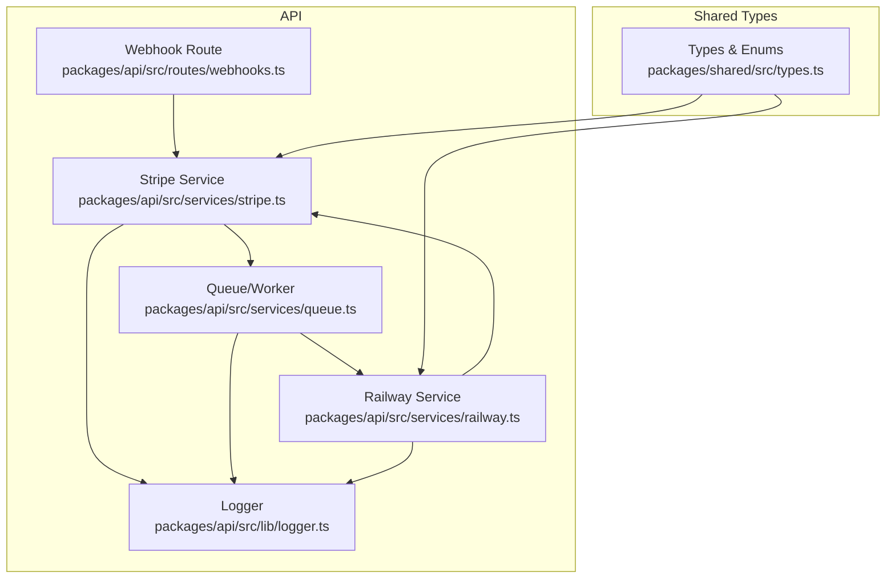
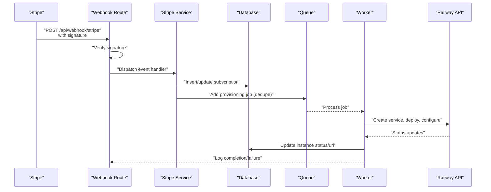
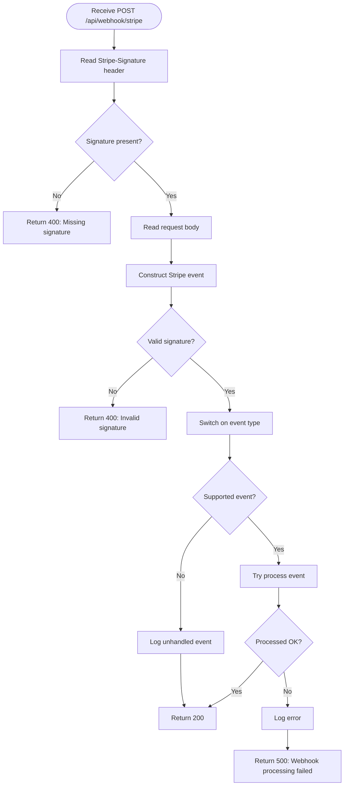
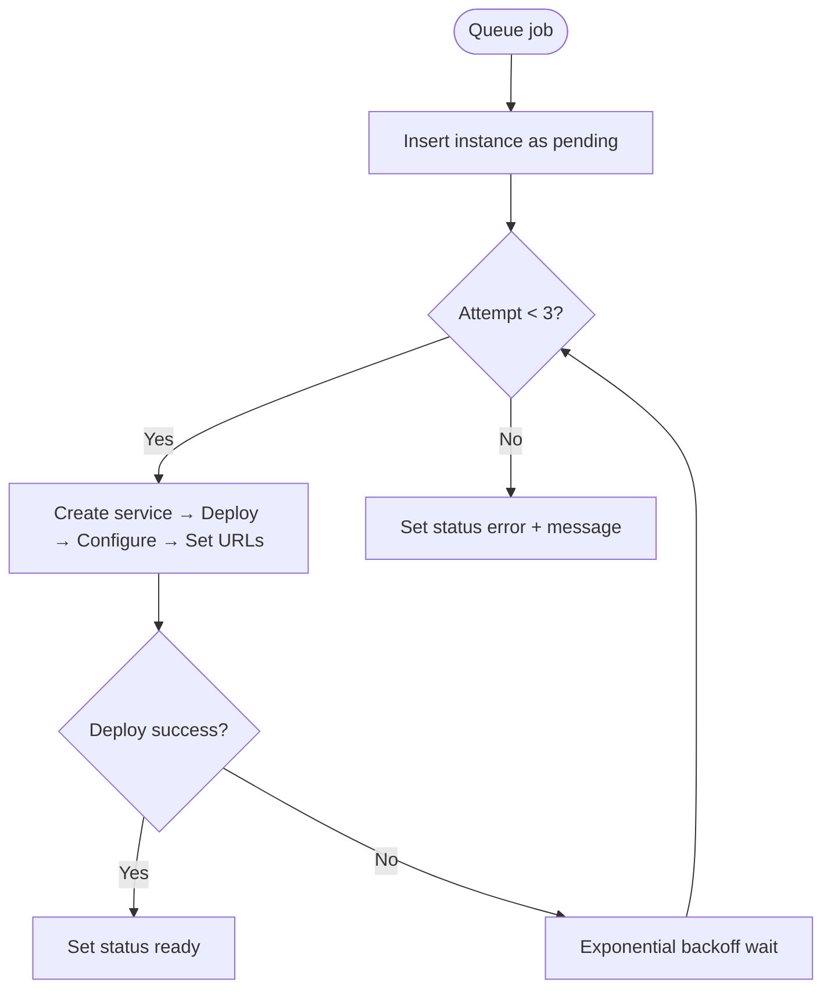
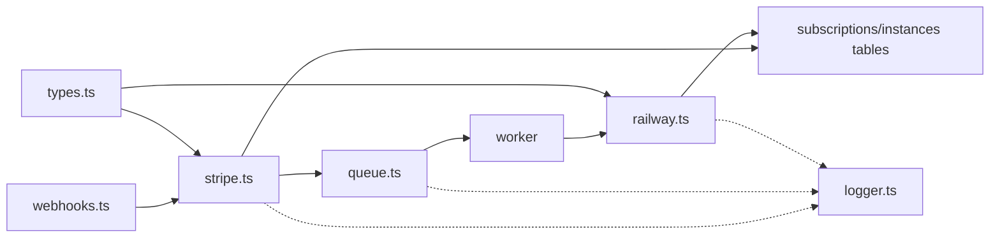

# Error Handling and Recovery

<cite>
**Referenced Files in This Document**
- [webhooks.ts](file://packages/api/src/routes/webhooks.ts)
- [stripe.ts](file://packages/api/src/services/stripe.ts)
- [railway.ts](file://packages/api/src/services/railway.ts)
- [queue.ts](file://packages/api/src/services/queue.ts)
- [logger.ts](file://packages/api/src/lib/logger.ts)
- [types.ts](file://packages/shared/src/types.ts)
- [PRD.md](file://PRD.md)
</cite>

## Table of Contents
1. [Introduction](#introduction)
2. [Project Structure](#project-structure)
3. [Core Components](#core-components)
4. [Architecture Overview](#architecture-overview)
5. [Detailed Component Analysis](#detailed-component-analysis)
6. [Dependency Analysis](#dependency-analysis)
7. [Performance Considerations](#performance-considerations)
8. [Troubleshooting Guide](#troubleshooting-guide)
9. [Conclusion](#conclusion)
10. [Appendices](#appendices)

## Introduction
This document details SparkClaw’s error handling and recovery mechanisms for the billing system. It covers payment failure scenarios (declined cards, insufficient funds, expired payment methods), webhook processing errors (signature verification failures, duplicate event handling, timeouts), subscription state inconsistencies and reconciliation, logging and monitoring/alerting, recovery procedures for failed instance provisioning triggered by webhooks, customer communication strategies, and debugging techniques.

## Project Structure
The billing and provisioning system spans three main areas:
- Webhook ingestion and dispatch to billing handlers
- Stripe billing orchestration (checkout completion, subscription updates/deletes)
- Asynchronous provisioning pipeline (queues, workers, retries)

**Diagram sources**
- [webhooks.ts](file://packages/api/src/routes/webhooks.ts#L1-L49)
- [stripe.ts](file://packages/api/src/services/stripe.ts#L1-L107)
- [railway.ts](file://packages/api/src/services/railway.ts#L1-L477)
- [queue.ts](file://packages/api/src/services/queue.ts#L1-L101)
- [logger.ts](file://packages/api/src/lib/logger.ts#L1-L34)
- [types.ts](file://packages/shared/src/types.ts#L28-L53)

**Section sources**
- [webhooks.ts](file://packages/api/src/routes/webhooks.ts#L1-L49)
- [stripe.ts](file://packages/api/src/services/stripe.ts#L1-L107)
- [railway.ts](file://packages/api/src/services/railway.ts#L1-L477)
- [queue.ts](file://packages/api/src/services/queue.ts#L1-L101)
- [logger.ts](file://packages/api/src/lib/logger.ts#L1-L34)
- [types.ts](file://packages/shared/src/types.ts#L28-L53)

## Core Components
- Webhook route validates signatures and dispatches to Stripe handlers.
- Stripe service constructs events, persists subscriptions, and queues provisioning.
- Railway service provisions instances with retries and domain configuration.
- Queue/worker handles provisioning asynchronously with exponential backoff and deduplication.
- Logger emits structured logs for all error paths.

Key outcomes:
- Signature verification failures return 400.
- Unhandled webhook events are logged and ignored.
- Subscription updates set status to active/past_due.
- Subscription deletion sets status to canceled and suspends instance.
- Provisioning failures persist error state and notify users.

**Section sources**
- [webhooks.ts](file://packages/api/src/routes/webhooks.ts#L6-L48)
- [stripe.ts](file://packages/api/src/services/stripe.ts#L20-L106)
- [railway.ts](file://packages/api/src/services/railway.ts#L277-L477)
- [queue.ts](file://packages/api/src/services/queue.ts#L17-L93)
- [logger.ts](file://packages/api/src/lib/logger.ts#L10-L33)

## Architecture Overview
End-to-end flow for payment success and provisioning:

**Diagram sources**
- [webhooks.ts](file://packages/api/src/routes/webhooks.ts#L6-L48)
- [stripe.ts](file://packages/api/src/services/stripe.ts#L45-L72)
- [queue.ts](file://packages/api/src/services/queue.ts#L75-L93)
- [railway.ts](file://packages/api/src/services/railway.ts#L277-L477)

## Detailed Component Analysis

### Webhook Processing Error Handling
- Signature verification: Missing or invalid signature returns 400 with an error message.
- Event dispatch: Only supported events are processed; others are logged as unhandled.
- Exception handling: Errors during processing are logged and return 500.

**Diagram sources**
- [webhooks.ts](file://packages/api/src/routes/webhooks.ts#L6-L48)

**Section sources**
- [webhooks.ts](file://packages/api/src/routes/webhooks.ts#L6-L48)

### Payment Failure Scenarios and User Messaging
Observed behaviors:
- Declined cards/insufficient funds: Handled upstream by Stripe; SparkClaw reacts to successful checkout completion and subscription updates.
- Expired payment methods: Subscription transitions to past_due; UI reflects status accordingly.
- User messaging: Dashboard displays actionable statuses and guidance.

Recommended messaging patterns (aligned with PRD):
- Active: Show instance URL and controls.
- Past_due: Indicate payment failure and provide access to Stripe Customer Portal.
- Canceled: Show suspension notice and guidance to reactivate or re-subscribe.
- Error: Show “Provisioning failed. Contact support.” with optional error details.

Note: The current webhook handlers do not explicitly handle failed payment events; they rely on subscription status updates. To improve resilience, consider adding explicit handling for failed invoice events and idempotent reconciliation.

**Section sources**
- [stripe.ts](file://packages/api/src/services/stripe.ts#L74-L85)
- [PRD.md](file://PRD.md#L305-L326)

### Subscription State Inconsistencies and Reconciliation
Current reconciliation:
- Subscription updated: Sets status to active or past_due based on Stripe status.
- Subscription deleted: Marks subscription as canceled and instance as suspended.

Reconciliation recommendations:
- Periodic reconciliation: Compare Stripe subscription status with local records and reconcile differences.
- Idempotency: Deduplicate events using Stripe’s event IDs or webhook signatures.
- Retry missing events: Use Stripe’s event resend capability and dashboard replay.

**Section sources**
- [stripe.ts](file://packages/api/src/services/stripe.ts#L74-L106)
- [PRD.md](file://PRD.md#L118-L130)

### Instance Provisioning Failures and Automatic Retry
Provisioning pipeline:
- Deduplication: Jobs are deduplicated by subscription ID.
- Retries: Up to three attempts with exponential backoff.
- Timeout handling: Deployment and domain DNS provisioning include bounded polling.
- Failure persistence: On final failure, instance status is set to error with message.

**Diagram sources**
- [queue.ts](file://packages/api/src/services/queue.ts#L75-L93)
- [railway.ts](file://packages/api/src/services/railway.ts#L311-L452)

**Section sources**
- [queue.ts](file://packages/api/src/services/queue.ts#L17-L93)
- [railway.ts](file://packages/api/src/services/railway.ts#L277-L477)

### Error Logging, Monitoring, and Alerting
Logging:
- Structured JSON logs with level, message, timestamp, and contextual data.
- Errors logged for webhook failures, provisioning attempts, and worker failures.

Monitoring and alerting (aspirational, per PRD):
- Sentry for error tracking and performance monitoring.
- BetterStack for uptime monitoring, structured logs, and incident management.
- Optional Discord/email alerts for provisioning failures.

**Section sources**
- [logger.ts](file://packages/api/src/lib/logger.ts#L10-L33)
- [PRD.md](file://PRD.md#L206-L207)
- [PRD.md](file://PRD.md#L744-L745)

### Customer Communication Strategies and Escalation
- Dashboard messaging: Clear status states and next steps.
- Email notifications: Welcome email on success; failure notification on final provisioning failure.
- Stripe Customer Portal: Provide link for payment method updates and history.

**Section sources**
- [railway.ts](file://packages/api/src/services/railway.ts#L430-L438)
- [railway.ts](file://packages/api/src/services/railway.ts#L466-L473)
- [PRD.md](file://PRD.md#L172-L186)

### Debugging Tools and Techniques
- Inspect structured logs for webhook events, provisioning attempts, and errors.
- Use Stripe dashboard to replay missing or failed events.
- Verify webhook signatures and endpoint configuration.
- Confirm queue/worker health and job deduplication.
- Validate Railway API responses and environment variables.

**Section sources**
- [logger.ts](file://packages/api/src/lib/logger.ts#L10-L33)
- [webhooks.ts](file://packages/api/src/routes/webhooks.ts#L6-L48)
- [queue.ts](file://packages/api/src/services/queue.ts#L65-L72)
- [railway.ts](file://packages/api/src/services/railway.ts#L15-L36)

## Dependency Analysis

**Diagram sources**
- [webhooks.ts](file://packages/api/src/routes/webhooks.ts#L1-L49)
- [stripe.ts](file://packages/api/src/services/stripe.ts#L1-L107)
- [queue.ts](file://packages/api/src/services/queue.ts#L1-L101)
- [railway.ts](file://packages/api/src/services/railway.ts#L1-L477)
- [logger.ts](file://packages/api/src/lib/logger.ts#L1-L34)
- [types.ts](file://packages/shared/src/types.ts#L28-L53)

**Section sources**
- [webhooks.ts](file://packages/api/src/routes/webhooks.ts#L1-L49)
- [stripe.ts](file://packages/api/src/services/stripe.ts#L1-L107)
- [queue.ts](file://packages/api/src/services/queue.ts#L1-L101)
- [railway.ts](file://packages/api/src/services/railway.ts#L1-L477)
- [logger.ts](file://packages/api/src/lib/logger.ts#L1-L34)
- [types.ts](file://packages/shared/src/types.ts#L28-L53)

## Performance Considerations
- Webhook processing returns quickly after dispatch to avoid timeouts.
- Provisioning uses bounded polling and exponential backoff to balance responsiveness and external API constraints.
- Queue configuration includes attempts, backoff, and cleanup policies.

[No sources needed since this section provides general guidance]

## Troubleshooting Guide
Common issues and resolutions:
- Webhook signature missing/invalid: Verify endpoint configuration and signing secret.
- Duplicate events: Ensure idempotency and deduplication; inspect logs for repeated processing.
- Provisioning timeouts: Check Railway API availability, environment variables, and retry logs.
- Subscription status mismatch: Reconcile with Stripe; use event replay if necessary.
- Worker failures: Inspect queue worker logs and job metadata.

**Section sources**
- [webhooks.ts](file://packages/api/src/routes/webhooks.ts#L6-L48)
- [queue.ts](file://packages/api/src/services/queue.ts#L65-L72)
- [railway.ts](file://packages/api/src/services/railway.ts#L441-L452)
- [logger.ts](file://packages/api/src/lib/logger.ts#L10-L33)

## Conclusion
SparkClaw’s billing system implements robust webhook signature verification, idempotent event handling, and asynchronous provisioning with retries. While current handlers focus on successful checkout and subscription lifecycle events, extending coverage to explicit failed payment events and enhancing reconciliation would further strengthen resilience. Structured logging, optional monitoring/alerting, and clear user messaging provide strong foundations for diagnosing and resolving billing issues.

[No sources needed since this section summarizes without analyzing specific files]

## Appendices

### Data Model Notes Relevant to Error Handling
- Subscription status: active, canceled, past_due.
- Instance status: pending, ready, error, suspended.
- Domain status: pending, provisioning, ready, error.

**Section sources**
- [types.ts](file://packages/shared/src/types.ts#L28-L53)