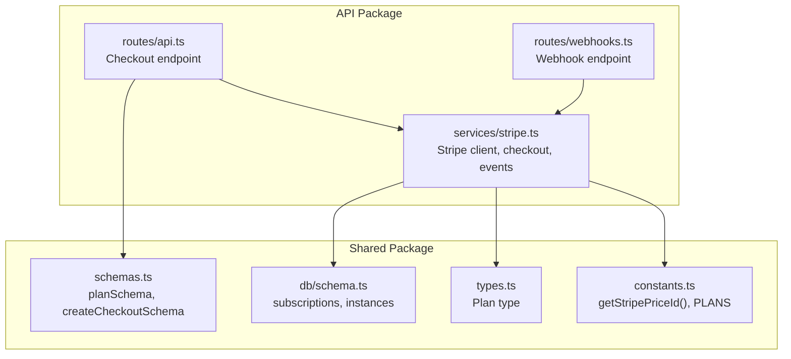
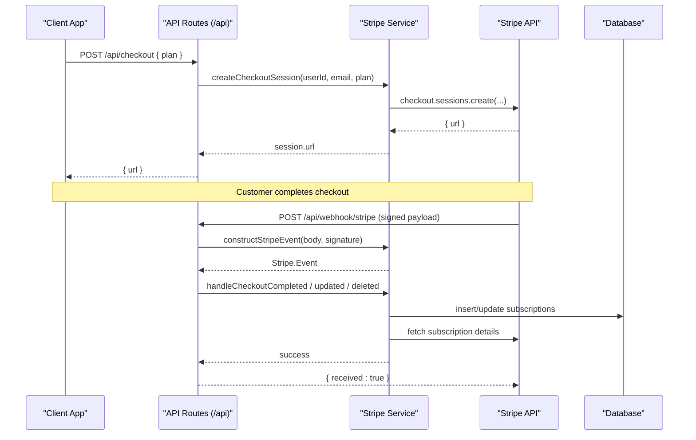
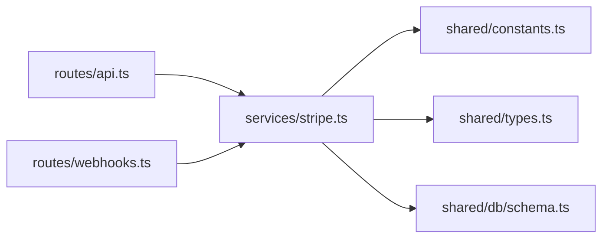

# Stripe Integration Setup

<cite>
**Referenced Files in This Document**
- [stripe.ts](file://packages/api/src/services/stripe.ts)
- [webhooks.ts](file://packages/api/src/routes/webhooks.ts)
- [api.ts](file://packages/api/src/routes/api.ts)
- [constants.ts](file://packages/shared/src/constants.ts)
- [schemas.ts](file://packages/shared/src/schemas.ts)
- [types.ts](file://packages/shared/src/types.ts)
- [schema.ts](file://packages/shared/src/db/schema.ts)
- [PRD.md](file://PRD.md)
</cite>

## Table of Contents
1. [Introduction](#introduction)
2. [Project Structure](#project-structure)
3. [Core Components](#core-components)
4. [Architecture Overview](#architecture-overview)
5. [Detailed Component Analysis](#detailed-component-analysis)
6. [Dependency Analysis](#dependency-analysis)
7. [Performance Considerations](#performance-considerations)
8. [Troubleshooting Guide](#troubleshooting-guide)
9. [Conclusion](#conclusion)
10. [Appendices](#appendices)

## Introduction
This document explains how Stripe is integrated in SparkClaw, covering client initialization, environment validation, product and price configuration, checkout session creation, and webhook handling. It also provides guidance for configuring Stripe dashboards, managing webhook secrets, testing with the Stripe CLI, and troubleshooting common integration issues.

## Project Structure
The Stripe integration spans three primary areas:
- API service layer that initializes the Stripe client, creates checkout sessions, and handles webhook events
- API routes that expose the checkout endpoint and the Stripe webhook endpoint
- Shared constants and schemas that define plan names, price ID retrieval, and request validation

**Diagram sources**
- [api.ts](file://packages/api/src/routes/api.ts#L1-L86)
- [webhooks.ts](file://packages/api/src/routes/webhooks.ts#L1-L49)
- [stripe.ts](file://packages/api/src/services/stripe.ts#L1-L107)
- [constants.ts](file://packages/shared/src/constants.ts#L1-L28)
- [schemas.ts](file://packages/shared/src/schemas.ts#L1-L26)
- [types.ts](file://packages/shared/src/types.ts#L1-L55)
- [schema.ts](file://packages/shared/src/db/schema.ts#L69-L146)

**Section sources**
- [api.ts](file://packages/api/src/routes/api.ts#L1-L86)
- [webhooks.ts](file://packages/api/src/routes/webhooks.ts#L1-L49)
- [stripe.ts](file://packages/api/src/services/stripe.ts#L1-L107)
- [constants.ts](file://packages/shared/src/constants.ts#L1-L28)
- [schemas.ts](file://packages/shared/src/schemas.ts#L1-L26)
- [types.ts](file://packages/shared/src/types.ts#L1-L55)
- [schema.ts](file://packages/shared/src/db/schema.ts#L69-L146)

## Core Components
- Stripe client initialization with explicit API version and lazy construction
- Environment variable validation for Stripe keys and price IDs
- Checkout session creation with customer email, success/cancel URLs, and metadata
- Webhook endpoint with signature verification and event routing
- Database persistence for subscriptions and instance provisioning triggers

Key responsibilities:
- Client initialization and caching: ensures a single Stripe instance with a pinned API version
- Price ID resolution: reads Stripe price IDs from environment variables keyed by plan
- Checkout session creation: builds a subscription-mode session with metadata for user identification
- Webhook handling: validates signatures, routes events, updates subscription status, and triggers provisioning

**Section sources**
- [stripe.ts](file://packages/api/src/services/stripe.ts#L9-L26)
- [constants.ts](file://packages/shared/src/constants.ts#L3-L8)
- [api.ts](file://packages/api/src/routes/api.ts#L76-L85)
- [webhooks.ts](file://packages/api/src/routes/webhooks.ts#L6-L48)
- [schema.ts](file://packages/shared/src/db/schema.ts#L69-L101)

## Architecture Overview
The Stripe integration follows a clean separation of concerns:
- Routes define HTTP endpoints for checkout and webhooks
- Services encapsulate Stripe SDK usage and event handling
- Shared modules provide plan definitions, validation schemas, and database models

**Diagram sources**
- [api.ts](file://packages/api/src/routes/api.ts#L76-L85)
- [stripe.ts](file://packages/api/src/services/stripe.ts#L28-L72)
- [webhooks.ts](file://packages/api/src/routes/webhooks.ts#L6-L48)

## Detailed Component Analysis

### Stripe Client Initialization and API Version
- The Stripe client is lazily initialized and cached to avoid repeated construction
- The client is configured with a fixed API version to ensure compatibility across requests
- Environment variables are accessed directly; missing keys cause runtime errors

Implementation highlights:
- Lazy initialization with a singleton-like pattern
- Explicit API version configuration
- Direct environment access for keys

Operational notes:
- Ensure the environment variable for the secret key is present before startup
- The API version is pinned to a specific release to prevent breaking changes

**Section sources**
- [stripe.ts](file://packages/api/src/services/stripe.ts#L9-L18)

### Price ID Management and Plan Mapping
- Price IDs are resolved via environment variables named by plan
- The resolver throws if a required environment variable is missing
- Plan names are enforced by a shared schema and type definition

Implementation highlights:
- Dynamic environment key construction based on uppercase plan name
- Centralized plan definitions and pricing metadata
- Strong typing for plan values

Operational notes:
- Configure STRIPE_PRICE_STARTER, STRIPE_PRICE_PRO, and STRIPE_PRICE_SCALE
- Ensure price IDs match the configured Stripe products and recurring intervals

**Section sources**
- [constants.ts](file://packages/shared/src/constants.ts#L3-L8)
- [constants.ts](file://packages/shared/src/constants.ts#L10-L14)
- [schemas.ts](file://packages/shared/src/schemas.ts#L7-L20)
- [types.ts](file://packages/shared/src/types.ts#L28-L31)

### Checkout Session Creation
- Creates a subscription-mode checkout session with customer email
- Uses the resolved price ID for the selected plan
- Sets success and cancel URLs pointing to the frontend application
- Attaches metadata for user identification and plan selection

Implementation highlights:
- Session mode set to subscription
- Metadata includes userId and plan for downstream processing
- Success and cancel URLs constructed from the configured WEB_URL

Operational notes:
- Ensure WEB_URL is set to the frontend origin
- The customer’s email is captured during checkout for receipt and communication

**Section sources**
- [stripe.ts](file://packages/api/src/services/stripe.ts#L28-L43)
- [api.ts](file://packages/api/src/routes/api.ts#L76-L85)

### Webhook Endpoint Configuration and Signature Verification
- Exposes a POST endpoint for Stripe webhook events
- Validates the presence of the Stripe signature header
- Verifies the webhook payload using the configured webhook secret
- Routes events to dedicated handlers for checkout completion, subscription updates, and deletion

Implementation highlights:
- Signature header extraction and validation
- Event construction with the webhook secret
- Event type switching and error logging
- Graceful handling of unhandled events

Operational notes:
- Configure STRIPE_WEBHOOK_SECRET in the environment
- Set the webhook endpoint URL to the deployed API base plus /api/webhook/stripe
- Enable events: checkout.session.completed, customer.subscription.updated, customer.subscription.deleted

**Section sources**
- [webhooks.ts](file://packages/api/src/routes/webhooks.ts#L6-L48)
- [stripe.ts](file://packages/api/src/services/stripe.ts#L20-L26)

### Event Handlers and Database Persistence
- On checkout completion, persists subscription details and triggers instance provisioning
- On subscription updates, updates status and period end timestamps
- On subscription deletion, marks the subscription as canceled and suspends the associated instance

Implementation highlights:
- Subscription insertion with Stripe identifiers and plan metadata
- Period end conversion from Unix timestamp to Date
- Asynchronous provisioning with error logging
- Instance suspension upon subscription cancellation

Operational notes:
- Ensure database connectivity and migrations are applied
- Confirm that provisioning tasks are monitored and retried as needed

**Section sources**
- [stripe.ts](file://packages/api/src/services/stripe.ts#L45-L106)
- [schema.ts](file://packages/shared/src/db/schema.ts#L69-L101)
- [schema.ts](file://packages/shared/src/db/schema.ts#L103-L146)

### Frontend Integration Points
- The checkout endpoint expects a plan value validated by the shared schema
- Success and cancel URLs are derived from the configured WEB_URL environment variable
- The frontend navigates users after checkout based on the returned session URL

Operational notes:
- Ensure the frontend origin matches the configured WEB_URL
- Verify that the pricing page passes a valid plan value

**Section sources**
- [api.ts](file://packages/api/src/routes/api.ts#L76-L85)
- [schemas.ts](file://packages/shared/src/schemas.ts#L18-L20)

## Dependency Analysis
The integration exhibits low coupling and clear boundaries:
- API routes depend on the Stripe service for business logic
- The Stripe service depends on shared constants for price resolution and types
- Database schema defines the persistence contract for subscriptions and instances

**Diagram sources**
- [api.ts](file://packages/api/src/routes/api.ts#L1-L86)
- [webhooks.ts](file://packages/api/src/routes/webhooks.ts#L1-L49)
- [stripe.ts](file://packages/api/src/services/stripe.ts#L1-L107)
- [constants.ts](file://packages/shared/src/constants.ts#L1-L28)
- [types.ts](file://packages/shared/src/types.ts#L1-L55)
- [schema.ts](file://packages/shared/src/db/schema.ts#L69-L146)

**Section sources**
- [api.ts](file://packages/api/src/routes/api.ts#L1-L86)
- [webhooks.ts](file://packages/api/src/routes/webhooks.ts#L1-L49)
- [stripe.ts](file://packages/api/src/services/stripe.ts#L1-L107)
- [constants.ts](file://packages/shared/src/constants.ts#L1-L28)
- [types.ts](file://packages/shared/src/types.ts#L1-L55)
- [schema.ts](file://packages/shared/src/db/schema.ts#L69-L146)

## Performance Considerations
- Client initialization is cached to avoid repeated SDK instantiation overhead
- Webhook processing is synchronous; long-running tasks (e.g., provisioning) are fire-and-forget to keep responses fast
- Database writes are minimal and targeted to reduce contention

Recommendations:
- Keep webhook handlers idempotent to tolerate retries
- Monitor provisioning latency and implement retry/backoff for transient failures
- Consider batching or queuing heavy operations if traffic increases

[No sources needed since this section provides general guidance]

## Troubleshooting Guide
Common issues and resolutions:
- Missing environment variables
  - Ensure STRIPE_SECRET_KEY, STRIPE_WEBHOOK_SECRET, WEB_URL, and STRIPE_PRICE_* variables are set
  - The price ID resolver throws if a required variable is missing
- Webhook endpoint not reachable
  - Verify the endpoint URL matches the configured origin and path
  - Confirm the server is publicly accessible and TLS is enabled
- Signature verification failures
  - Re-check STRIPE_WEBHOOK_SECRET against the Stripe dashboard
  - Ensure the endpoint receives the raw request body and the stripe-signature header
- Checkout session creation errors
  - Confirm the selected plan resolves to a valid price ID
  - Verify success and cancel URLs are properly formed from WEB_URL
- Subscription state inconsistencies
  - Review webhook logs and Stripe dashboard event replay
  - Check database updates for status and period end timestamps

Operational references:
- Environment variables and secrets are documented in the project’s PRD
- Webhook configuration and event types are handled in the webhook route
- Price ID resolution and plan definitions are centralized in shared modules

**Section sources**
- [constants.ts](file://packages/shared/src/constants.ts#L3-L8)
- [webhooks.ts](file://packages/api/src/routes/webhooks.ts#L6-L48)
- [stripe.ts](file://packages/api/src/services/stripe.ts#L28-L43)
- [PRD.md](file://PRD.md#L643-L645)

## Conclusion
SparkClaw’s Stripe integration is designed around a clear separation of concerns: routes expose endpoints, services encapsulate Stripe SDK usage and event handling, and shared modules provide plan definitions and validation. By pinning the API version, validating environment variables, and persisting subscription state, the integration achieves reliability and maintainability. Proper webhook configuration and testing ensure smooth end-to-end checkout and provisioning flows.

[No sources needed since this section summarizes without analyzing specific files]

## Appendices

### Stripe Dashboard Setup Checklist
- Products and Prices
  - Create products for Starter, Pro, and Scale plans
  - Create monthly recurring prices and record their IDs
  - Export IDs to STRIPE_PRICE_STARTER, STRIPE_PRICE_PRO, STRIPE_PRICE_SCALE
- Webhooks
  - Add endpoint URL: https://your-api-base.com/api/webhook/stripe
  - Enable events: checkout.session.completed, customer.subscription.updated, customer.subscription.deleted
  - Copy webhook secret to STRIPE_WEBHOOK_SECRET
- API Keys
  - Use the test secret key for development (SK starts with sk_test_)
  - Use the live secret key for production (SK starts with sk_live_)
- Origins and URLs
  - Set WEB_URL to your frontend origin
  - Ensure CORS and CSRF policies permit requests from WEB_URL

[No sources needed since this section provides general guidance]

### Testing Strategies
- Local testing with Stripe CLI
  - Forward events to your local endpoint using the CLI
  - Replay missed events from the Stripe dashboard
- Webhook testing tools
  - Use tools to send signed payloads with the correct stripe-signature header
  - Validate that your endpoint responds with 200 and logs indicate successful processing
- End-to-end checkout flow
  - Test each plan selection and confirm database entries for subscriptions
  - Verify instance provisioning is triggered and status transitions occur

[No sources needed since this section provides general guidance]