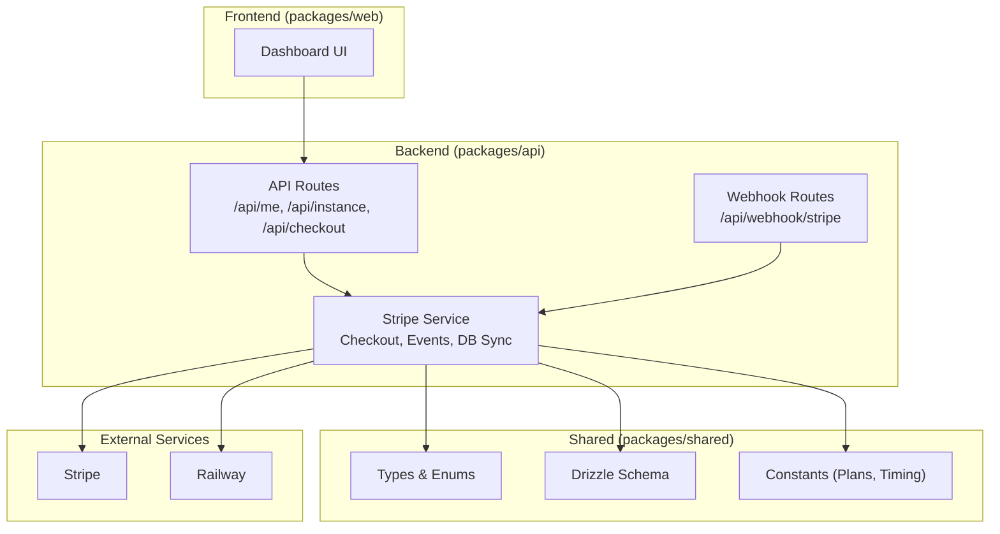
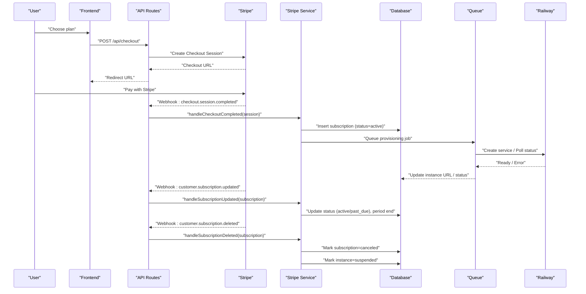
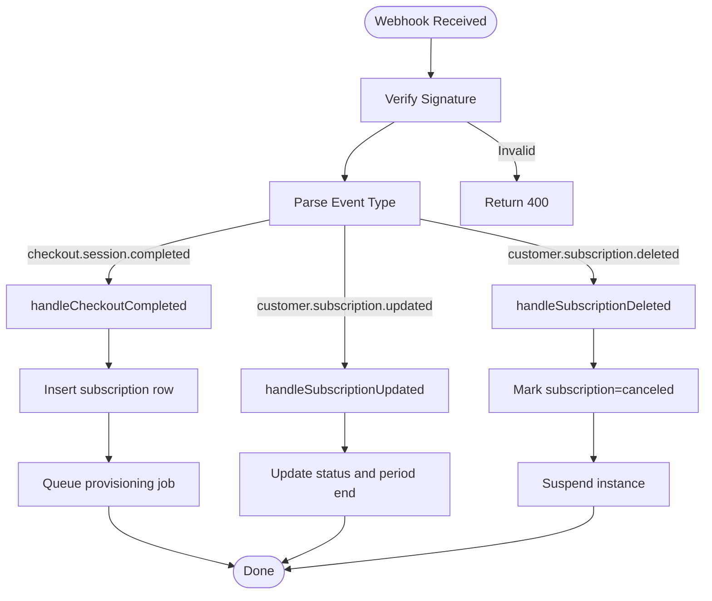
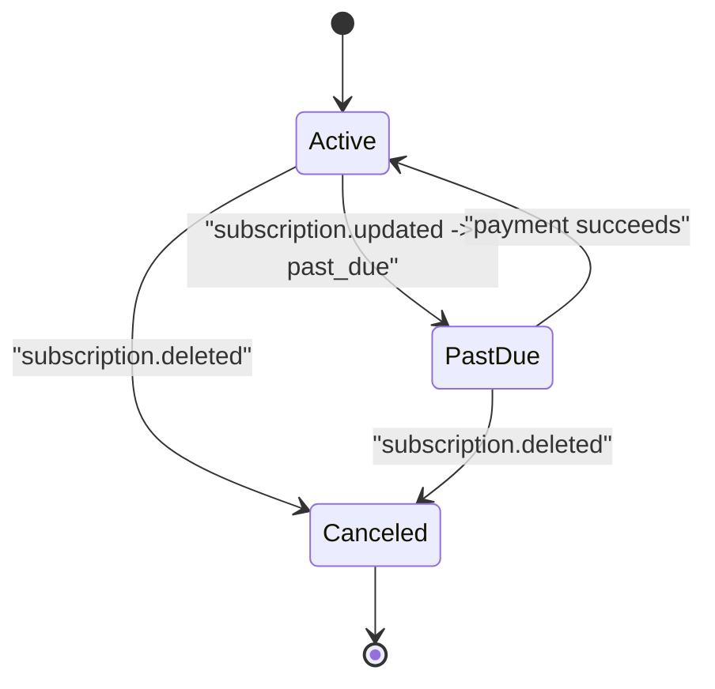
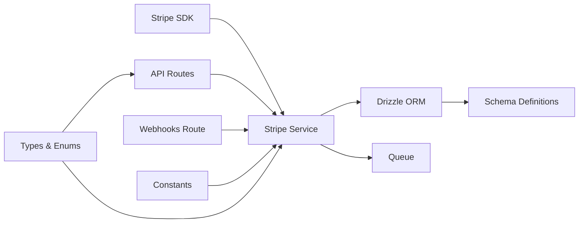

# Subscription Lifecycle Management

<cite>
**Referenced Files in This Document**
- [PRD.md](file://PRD.md)
- [drizzle.config.ts](file://drizzle.config.ts)
- [drizzle/migrations/meta/0000_snapshot.json](file://drizzle/migrations/meta/0000_snapshot.json)
- [packages/api/src/routes/webhooks.ts](file://packages/api/src/routes/webhooks.ts)
- [packages/api/src/routes/api.ts](file://packages/api/src/routes/api.ts)
- [packages/api/src/services/stripe.ts](file://packages/api/src/services/stripe.ts)
- [packages/shared/src/types.ts](file://packages/shared/src/types.ts)
- [packages/shared/src/schemas.ts](file://packages/shared/src/schemas.ts)
- [packages/shared/src/db/schema.ts](file://packages/shared/src/db/schema.ts)
- [packages/shared/src/constants.ts](file://packages/shared/src/constants.ts)
</cite>

## Table of Contents
1. [Introduction](#introduction)
2. [Project Structure](#project-structure)
3. [Core Components](#core-components)
4. [Architecture Overview](#architecture-overview)
5. [Detailed Component Analysis](#detailed-component-analysis)
6. [Dependency Analysis](#dependency-analysis)
7. [Performance Considerations](#performance-considerations)
8. [Troubleshooting Guide](#troubleshooting-guide)
9. [Conclusion](#conclusion)
10. [Appendices](#appendices)

## Introduction
This document describes SparkClaw’s subscription lifecycle management built on Stripe Checkout and webhooks, integrated with a PostgreSQL database via Drizzle ORM. It covers subscription status tracking (active, past_due, canceled, unpaid), automatic updates from Stripe, provisioning triggers, and the current limitations around proration, usage-based billing, and customer self-service. It also outlines data synchronization between Stripe and the local database, reconciliation strategies, and future roadmap items for analytics and advanced billing features.

## Project Structure
SparkClaw is a Bun workspace monorepo with three packages:
- packages/web: SvelteKit frontend (landing, auth, dashboard)
- packages/api: Elysia backend (routes, Stripe integration, provisioning)
- packages/shared: Shared types, schemas, database schema, constants

Key areas relevant to subscription lifecycle:
- Stripe integration and webhook handling live in the API package
- Database schema and migrations define subscription and instance models
- Shared types and constants unify plan definitions and statuses across the stack



**Diagram sources**
- [packages/api/src/routes/api.ts](file://packages/api/src/routes/api.ts#L1-L88)
- [packages/api/src/routes/webhooks.ts](file://packages/api/src/routes/webhooks.ts#L1-L49)
- [packages/api/src/services/stripe.ts](file://packages/api/src/services/stripe.ts#L1-L107)
- [packages/shared/src/db/schema.ts](file://packages/shared/src/db/schema.ts#L1-L146)
- [packages/shared/src/types.ts](file://packages/shared/src/types.ts#L1-L57)
- [packages/shared/src/constants.ts](file://packages/shared/src/constants.ts#L1-L28)

**Section sources**
- [drizzle.config.ts](file://drizzle.config.ts#L1-L13)
- [drizzle/migrations/meta/0000_snapshot.json](file://drizzle/migrations/meta/0000_snapshot.json#L1-L598)
- [packages/shared/src/db/schema.ts](file://packages/shared/src/db/schema.ts#L1-L146)
- [packages/shared/src/types.ts](file://packages/shared/src/types.ts#L28-L31)
- [packages/shared/src/constants.ts](file://packages/shared/src/constants.ts#L10-L27)

## Core Components
- Stripe service: constructs Stripe events, creates Checkout sessions, and handles subscription lifecycle events to synchronize with the database
- Webhook routes: validates Stripe signatures and dispatches to event handlers
- API routes: provide subscription and instance data to the frontend
- Database schema: defines subscriptions and instances with foreign key relationships and indexes
- Shared types and constants: unify plan names, statuses, and timing constants

Key responsibilities:
- Automatic status updates: active/past_due/canceled synchronized from Stripe
- Provisioning trigger: after successful payment, a background job queues instance creation
- Instance suspension: cancellation events propagate to suspend the associated instance

**Section sources**
- [packages/api/src/services/stripe.ts](file://packages/api/src/services/stripe.ts#L20-L107)
- [packages/api/src/routes/webhooks.ts](file://packages/api/src/routes/webhooks.ts#L5-L49)
- [packages/api/src/routes/api.ts](file://packages/api/src/routes/api.ts#L34-L87)
- [packages/shared/src/db/schema.ts](file://packages/shared/src/db/schema.ts#L69-L145)
- [packages/shared/src/types.ts](file://packages/shared/src/types.ts#L28-L31)
- [packages/shared/src/constants.ts](file://packages/shared/src/constants.ts#L10-L27)

## Architecture Overview
The subscription lifecycle spans Stripe Checkout, webhooks, and backend processing with asynchronous provisioning.



**Diagram sources**
- [packages/api/src/routes/api.ts](file://packages/api/src/routes/api.ts#L78-L87)
- [packages/api/src/services/stripe.ts](file://packages/api/src/services/stripe.ts#L28-L107)
- [packages/api/src/routes/webhooks.ts](file://packages/api/src/routes/webhooks.ts#L6-L48)
- [packages/shared/src/db/schema.ts](file://packages/shared/src/db/schema.ts#L69-L145)

## Detailed Component Analysis

### Stripe Service and Webhook Handling
The Stripe service encapsulates:
- Constructing Stripe events from webhook payloads with signature verification
- Creating Checkout sessions with plan metadata
- Handling subscription lifecycle events:
  - checkout.session.completed: insert subscription and enqueue provisioning
  - customer.subscription.updated: update status and period end
  - customer.subscription.deleted: mark subscription and instance as canceled/suspended



**Diagram sources**
- [packages/api/src/services/stripe.ts](file://packages/api/src/services/stripe.ts#L20-L107)
- [packages/api/src/routes/webhooks.ts](file://packages/api/src/routes/webhooks.ts#L6-L48)

**Section sources**
- [packages/api/src/services/stripe.ts](file://packages/api/src/services/stripe.ts#L20-L107)
- [packages/api/src/routes/webhooks.ts](file://packages/api/src/routes/webhooks.ts#L5-L49)

### Subscription Status Tracking
Subscription statuses tracked:
- active: subscription is active
- past_due: subscription is past due
- canceled: subscription is canceled

Automatic updates:
- Active/Past Due: derived from Stripe subscription status during updates
- Canceled: set upon deletion events
- Period end: updated from Stripe’s current_period_end



**Diagram sources**
- [packages/api/src/services/stripe.ts](file://packages/api/src/services/stripe.ts#L74-L106)
- [packages/shared/src/types.ts](file://packages/shared/src/types.ts#L29-L29)

**Section sources**
- [packages/api/src/services/stripe.ts](file://packages/api/src/services/stripe.ts#L74-L106)
- [packages/shared/src/types.ts](file://packages/shared/src/types.ts#L29-L31)

### Proration Handling and Plan Changes
Current implementation:
- Stripe Checkout sessions are created with plan metadata and used to derive the subscription plan
- No explicit proration calculation or usage adjustment logic is present in the current codebase

Implications:
- Plan changes/upgrades/downgrades rely on Stripe’s native subscription management
- No custom proration logic is implemented; billing behavior follows Stripe defaults

**Section sources**
- [packages/api/src/services/stripe.ts](file://packages/api/src/services/stripe.ts#L28-L43)
- [PRD.md](file://PRD.md#L100-L130)

### Usage-Based Billing and Pro-Rata Calculations
Current implementation:
- Usage-based billing is explicitly marked as out of scope for V0
- No usage metering, token accounting, or pro-rata adjustments are implemented

Future roadmap:
- Phase 2 introduces Prism usage billing, usage dashboards, and manual top-ups

**Section sources**
- [PRD.md](file://PRD.md#L259-L272)
- [PRD.md](file://PRD.md#L749-L763)

### Subscription Modification Workflows
Supported modifications via Stripe:
- Plan changes, quantity changes, and billing cycle adjustments are handled by Stripe
- SparkClaw does not implement custom modification logic in the current codebase

Customer portal integration:
- The dashboard links to the Stripe Customer Portal for self-service management
- The portal allows users to manage payment methods and modify subscriptions

**Section sources**
- [PRD.md](file://PRD.md#L172-L177)
- [PRD.md](file://PRD.md#L100-L130)

### Data Synchronization Between Stripe and Local Database
Synchronization strategy:
- Idempotent webhook handling: duplicates do not create duplicate records
- Signature verification for all webhook requests
- Updates to subscription status and period end occur on subscription events
- Deletion events cascade to mark the subscription and instance as canceled/suspended

Conflict resolution:
- Unique constraints on user_id and stripe_subscription_id prevent duplicates
- Updates target rows by Stripe identifiers to avoid stale data

Reconciliation:
- The database mirrors Stripe’s subscription state
- Instance status reflects subscription state (suspended on cancellation)

**Section sources**
- [PRD.md](file://PRD.md#L126-L130)
- [packages/api/src/services/stripe.ts](file://packages/api/src/services/stripe.ts#L74-L106)
- [drizzle/migrations/meta/0000_snapshot.json](file://drizzle/migrations/meta/0000_snapshot.json#L455-L536)
- [packages/shared/src/db/schema.ts](file://packages/shared/src/db/schema.ts#L69-L145)

### Subscription Analytics
Current implementation:
- No built-in analytics for renewal rates, churn prediction, or revenue forecasting

Future roadmap:
- Phase 2+ introduces analytics dashboards and integrations for deeper insights

**Section sources**
- [PRD.md](file://PRD.md#L263-L263)
- [PRD.md](file://PRD.md#L732-L788)

### Examples and Workflows

#### Example: New Subscription Creation
- User selects a plan and completes Stripe Checkout
- Webhook: checkout.session.completed inserts a subscription row and enqueues provisioning
- Provisioning creates an instance and updates its URL/status

**Section sources**
- [packages/api/src/services/stripe.ts](file://packages/api/src/services/stripe.ts#L45-L72)
- [PRD.md](file://PRD.md#L107-L116)

#### Example: Subscription Cancellation
- User cancels via Stripe Customer Portal
- Webhook: customer.subscription.deleted marks subscription=canceled and instance=suspended

**Section sources**
- [packages/api/src/services/stripe.ts](file://packages/api/src/services/stripe.ts#L87-L106)
- [PRD.md](file://PRD.md#L118-L125)

#### Example: Automated Billing Workflow
- Stripe sends customer.subscription.updated with status and period end
- Backend updates the subscription record accordingly

**Section sources**
- [packages/api/src/services/stripe.ts](file://packages/api/src/services/stripe.ts#L74-L85)
- [PRD.md](file://PRD.md#L118-L125)

#### Example: Customer Communication Strategy
- Dashboard displays subscription status and links to Stripe Customer Portal
- Provisioning failures surface actionable messages with support contact guidance

**Section sources**
- [PRD.md](file://PRD.md#L172-L187)
- [PRD.md](file://PRD.md#L305-L315)

## Dependency Analysis


**Diagram sources**
- [packages/api/src/services/stripe.ts](file://packages/api/src/services/stripe.ts#L1-L107)
- [packages/api/src/routes/api.ts](file://packages/api/src/routes/api.ts#L1-L88)
- [packages/api/src/routes/webhooks.ts](file://packages/api/src/routes/webhooks.ts#L1-L49)
- [packages/shared/src/db/schema.ts](file://packages/shared/src/db/schema.ts#L1-L146)
- [packages/shared/src/types.ts](file://packages/shared/src/types.ts#L1-L57)
- [packages/shared/src/constants.ts](file://packages/shared/src/constants.ts#L1-L28)

**Section sources**
- [packages/api/src/services/stripe.ts](file://packages/api/src/services/stripe.ts#L1-L18)
- [packages/shared/src/db/schema.ts](file://packages/shared/src/db/schema.ts#L1-L146)
- [packages/shared/src/types.ts](file://packages/shared/src/types.ts#L1-L57)
- [packages/shared/src/constants.ts](file://packages/shared/src/constants.ts#L1-L28)

## Performance Considerations
- Webhook processing is idempotent and signature-verified to prevent retries and duplicate writes
- Provisioning uses bounded polling and retry logic with exponential backoff
- Database indexes on subscription and instance identifiers optimize lookups and updates

[No sources needed since this section provides general guidance]

## Troubleshooting Guide
Common issues and resolutions:
- Missing or invalid Stripe signature: webhook handler returns 400
- Duplicate webhook events: idempotent handling prevents duplicate records
- Provisioning failures: dashboard shows error state; administrators can manually resolve and retry
- Session validation errors: API routes return 401 for missing or invalid sessions

**Section sources**
- [packages/api/src/routes/webhooks.ts](file://packages/api/src/routes/webhooks.ts#L6-L48)
- [packages/api/src/routes/api.ts](file://packages/api/src/routes/api.ts#L28-L33)
- [PRD.md](file://PRD.md#L305-L315)

## Conclusion
SparkClaw’s subscription lifecycle is driven by Stripe Checkout and webhooks, with automatic synchronization to the local database. Status tracking (active, past_due, canceled) and provisioning triggers are implemented. Proration, usage-based billing, and advanced analytics are planned for future phases. The current architecture emphasizes idempotent webhook handling, signature verification, and clear separation of concerns across the monorepo packages.

[No sources needed since this section summarizes without analyzing specific files]

## Appendices

### Data Model Overview
```mermaid
erDiagram
USERS {
uuid id PK
string email UK
timestamp created_at
timestamp updated_at
}
SUBSCRIPTIONS {
uuid id PK
uuid user_id FK
string plan
string stripe_customer_id
string stripe_subscription_id UK
string status
timestamptz current_period_end
timestamp created_at
timestamp updated_at
}
INSTANCES {
uuid id PK
uuid user_id FK
uuid subscription_id FK UK
string railway_project_id
string railway_service_id
string custom_domain
text railway_url
text url
string status
string domain_status
text error_message
timestamp created_at
timestamp updated_at
}
USERS ||--|| SUBSCRIPTIONS : "1:1"
USERS ||--|| INSTANCES : "1:1"
SUBSCRIPTIONS ||--|| INSTANCES : "1:1"
```

**Diagram sources**
- [drizzle/migrations/meta/0000_snapshot.json](file://drizzle/migrations/meta/0000_snapshot.json#L6-L598)
- [packages/shared/src/db/schema.ts](file://packages/shared/src/db/schema.ts#L14-L145)

### API Endpoints Related to Subscriptions
- GET /api/me: Returns user info and subscription status
- GET /api/instance: Returns instance details linked to the subscription
- POST /api/checkout: Creates a Stripe Checkout session for a selected plan
- POST /api/webhook/stripe: Validates and processes Stripe events

**Section sources**
- [packages/api/src/routes/api.ts](file://packages/api/src/routes/api.ts#L34-L87)
- [packages/api/src/routes/webhooks.ts](file://packages/api/src/routes/webhooks.ts#L5-L49)