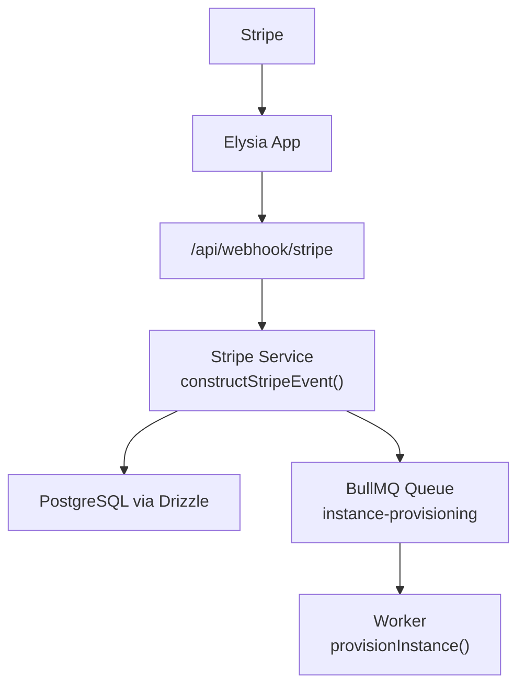
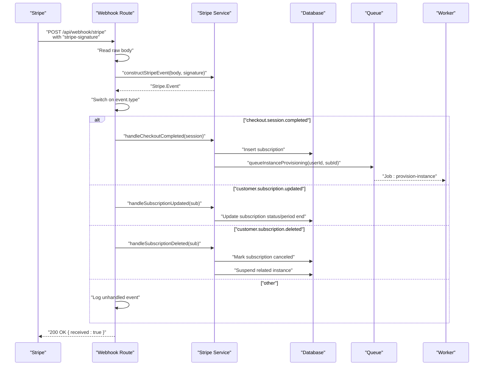
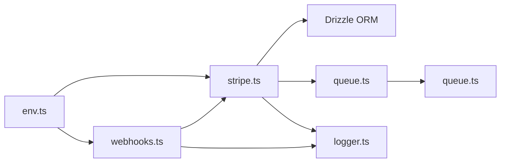

# Webhook Event Processing

<cite>
**Referenced Files in This Document**
- [packages/api/src/index.ts](file://packages/api/src/index.ts)
- [packages/api/src/routes/webhooks.ts](file://packages/api/src/routes/webhooks.ts)
- [packages/api/src/services/stripe.ts](file://packages/api/src/services/stripe.ts)
- [packages/api/src/services/queue.ts](file://packages/api/src/services/queue.ts)
- [packages/api/src/lib/logger.ts](file://packages/api/src/lib/logger.ts)
- [packages/api/src/lib/rate-limiter.ts](file://packages/api/src/lib/rate-limiter.ts)
- [packages/shared/src/env.ts](file://packages/shared/src/env.ts)
- [packages/shared/src/db/schema.ts](file://packages/shared/src/db/schema.ts)
- [packages/shared/src/constants.ts](file://packages/shared/src/constants.ts)
</cite>

## Table of Contents
1. [Introduction](#introduction)
2. [Project Structure](#project-structure)
3. [Core Components](#core-components)
4. [Architecture Overview](#architecture-overview)
5. [Detailed Component Analysis](#detailed-component-analysis)
6. [Dependency Analysis](#dependency-analysis)
7. [Performance Considerations](#performance-considerations)
8. [Security Considerations](#security-considerations)
9. [Testing and Debugging](#testing-and-debugging)
10. [Troubleshooting Guide](#troubleshooting-guide)
11. [Conclusion](#conclusion)

## Introduction
This document explains how SparkClaw processes Stripe webhook events. It covers webhook security (signature verification and secret management), endpoint configuration, event handling for three primary events (checkout session completion, subscription updates, and cancellations), payload parsing, idempotency considerations, retry mechanisms, and operational best practices such as testing, replay, and monitoring.

## Project Structure
The webhook implementation spans a small set of focused modules:
- Endpoint registration and request handling live under the API routes.
- Stripe-specific logic (signature verification, event dispatch) is encapsulated in a dedicated service.
- Background work for instance provisioning is handled via a queue/worker system.
- Environment validation enforces secure configuration, including Stripe secrets.
- Database schema defines the persisted subscription and instance state.

**Diagram sources**
- [packages/api/src/index.ts](file://packages/api/src/index.ts#L11-L20)
- [packages/api/src/routes/webhooks.ts](file://packages/api/src/routes/webhooks.ts#L5-L48)
- [packages/api/src/services/stripe.ts](file://packages/api/src/services/stripe.ts#L20-L26)
- [packages/api/src/services/queue.ts](file://packages/api/src/services/queue.ts#L17-L28)

**Section sources**
- [packages/api/src/index.ts](file://packages/api/src/index.ts#L1-L25)
- [packages/api/src/routes/webhooks.ts](file://packages/api/src/routes/webhooks.ts#L1-L49)
- [packages/api/src/services/stripe.ts](file://packages/api/src/services/stripe.ts#L1-L107)
- [packages/api/src/services/queue.ts](file://packages/api/src/services/queue.ts#L1-L101)
- [packages/shared/src/env.ts](file://packages/shared/src/env.ts#L1-L45)
- [packages/shared/src/db/schema.ts](file://packages/shared/src/db/schema.ts#L69-L146)

## Core Components
- Webhook route: Validates presence of the Stripe signature header, reads raw request body, constructs the Stripe event, and dispatches to handlers based on event type.
- Stripe service: Centralizes Stripe SDK initialization, webhook signature verification, and event handlers for checkout completion, subscription updates, and cancellations.
- Queue/worker: Asynchronous provisioning of user instances upon successful payment, with exponential backoff and retry limits.
- Environment validation: Enforces presence and format of Stripe secrets and other required variables.
- Logging: Structured logging for observability and debugging.

**Section sources**
- [packages/api/src/routes/webhooks.ts](file://packages/api/src/routes/webhooks.ts#L6-L48)
- [packages/api/src/services/stripe.ts](file://packages/api/src/services/stripe.ts#L20-L106)
- [packages/api/src/services/queue.ts](file://packages/api/src/services/queue.ts#L17-L93)
- [packages/shared/src/env.ts](file://packages/shared/src/env.ts#L3-L22)
- [packages/api/src/lib/logger.ts](file://packages/api/src/lib/logger.ts#L10-L33)

## Architecture Overview
The webhook pipeline is designed for correctness and resilience:
- Stripe delivers signed POST requests to the endpoint.
- The server verifies the signature using the configured webhook secret.
- The event type determines which handler is invoked.
- Handlers update persistent state and enqueue asynchronous tasks when needed.
- Errors are logged and surfaced to Stripe with appropriate HTTP status codes.

**Diagram sources**
- [packages/api/src/routes/webhooks.ts](file://packages/api/src/routes/webhooks.ts#L6-L48)
- [packages/api/src/services/stripe.ts](file://packages/api/src/services/stripe.ts#L45-L106)
- [packages/api/src/services/queue.ts](file://packages/api/src/services/queue.ts#L75-L93)
- [packages/shared/src/db/schema.ts](file://packages/shared/src/db/schema.ts#L69-L146)

## Detailed Component Analysis

### Webhook Endpoint Configuration
- Path: /api/webhook/stripe
- Method: POST
- Required header: stripe-signature
- Request body: Raw body is captured and passed to Stripe SDK for signature verification
- Response: 200 with { received: true } on success; 400 for missing/invalid signature; 500 for unhandled processing errors

Operational notes:
- The endpoint does not implement rate limiting internally; consider deploying a reverse proxy or gateway with rate limiting in front of this route.
- CORS is configured globally for the API; ensure the origin matches your frontend origin.

**Section sources**
- [packages/api/src/routes/webhooks.ts](file://packages/api/src/routes/webhooks.ts#L5-L48)
- [packages/api/src/index.ts](file://packages/api/src/index.ts#L11-L19)

### Signature Verification and Secret Management
- Signature verification: Uses Stripe SDK’s webhook construction to validate the signature against the raw body and the configured webhook secret.
- Secrets:
  - STRIPE_SECRET_KEY: Used for Stripe SDK operations (not the webhook secret).
  - STRIPE_WEBHOOK_SECRET: Used for verifying incoming webhook signatures.
- Environment validation ensures both secrets are present and properly prefixed.

Security implications:
- The webhook secret must match the one configured in the Stripe Dashboard for the webhook endpoint.
- The server must reject requests without a signature or with an invalid signature.

**Section sources**
- [packages/api/src/services/stripe.ts](file://packages/api/src/services/stripe.ts#L20-L26)
- [packages/shared/src/env.ts](file://packages/shared/src/env.ts#L5-L6)

### Event Payload Parsing
- The route captures the raw request body and passes it along with the stripe-signature header to the Stripe service.
- The Stripe service constructs the event object using the webhook secret, which validates authenticity and decodes the payload.
- The event type is inspected to route to the appropriate handler.

Idempotency considerations:
- The current implementation does not deduplicate events by ID. To ensure idempotency, consider storing processed event IDs and skipping duplicates for a short retention period.

**Section sources**
- [packages/api/src/routes/webhooks.ts](file://packages/api/src/routes/webhooks.ts#L13-L21)
- [packages/api/src/services/stripe.ts](file://packages/api/src/services/stripe.ts#L20-L26)

### Checkout Session Completed Handler
Purpose:
- On successful payment, persist subscription metadata and enqueue instance provisioning.

Key steps:
- Extract userId and plan from checkout session metadata.
- Retrieve the Stripe subscription to capture period end.
- Insert a new subscription record with status active.
- Queue a provisioning job with deduplication by subscription ID.

Asynchronous processing:
- The queue worker provisions the user instance via external APIs and updates instance status accordingly.

**Section sources**
- [packages/api/src/services/stripe.ts](file://packages/api/src/services/stripe.ts#L45-L72)
- [packages/api/src/services/queue.ts](file://packages/api/src/services/queue.ts#L75-L93)
- [packages/shared/src/db/schema.ts](file://packages/shared/src/db/schema.ts#L69-L96)

### Subscription Updated Handler
Purpose:
- Reflect subscription status changes (e.g., active vs past_due) and renewal timing.

Key steps:
- Update subscription status based on Stripe status.
- Refresh current period end timestamp.
- Timestamp updates for auditability.

**Section sources**
- [packages/api/src/services/stripe.ts](file://packages/api/src/services/stripe.ts#L74-L85)
- [packages/shared/src/db/schema.ts](file://packages/shared/src/db/schema.ts#L69-L96)

### Subscription Deleted Handler
Purpose:
- Handle cancellations by marking the subscription as canceled and suspending the associated instance.

Key steps:
- Mark subscription as canceled and update timestamps.
- Locate the subscription by Stripe subscription ID.
- Suspend the related instance.

**Section sources**
- [packages/api/src/services/stripe.ts](file://packages/api/src/services/stripe.ts#L87-L106)
- [packages/shared/src/db/schema.ts](file://packages/shared/src/db/schema.ts#L103-L146)

### Retry Mechanism Implementation
- Queue configuration:
  - Attempts: 3
  - Backoff: Exponential with base delay
  - Cleanup: Automatic removal of completed/failed jobs beyond thresholds
- Worker concurrency: 2 jobs at a time
- Deduplication: Jobs are deduplicated by subscription ID to prevent redundant provisioning

Operational benefits:
- Improves resilience against transient failures in provisioning.
- Reduces load by limiting concurrent workers.

**Section sources**
- [packages/api/src/services/queue.ts](file://packages/api/src/services/queue.ts#L17-L28)
- [packages/api/src/services/queue.ts](file://packages/api/src/services/queue.ts#L37-L63)
- [packages/api/src/services/queue.ts](file://packages/api/src/services/queue.ts#L75-L93)

### Request Validation and Response Handling Patterns
- Presence of stripe-signature: Required; absence yields 400.
- Invalid signature: Constructing the event fails; returns 400.
- Unhandled event types: Logged but does not fail the request.
- Processing errors: Caught and logged; returns 500.
- Successful processing: Returns 200 with { received: true }.

**Section sources**
- [packages/api/src/routes/webhooks.ts](file://packages/api/src/routes/webhooks.ts#L8-L47)

## Dependency Analysis
The webhook subsystem exhibits low coupling and clear separation of concerns:
- Route depends on Stripe service for event construction and dispatch.
- Stripe service depends on:
  - Stripe SDK initialized with secret key
  - Database for persistence
  - Queue for asynchronous tasks
- Queue/worker depends on Redis configuration and environment.
- Environment validation centralizes secret enforcement.

**Diagram sources**
- [packages/api/src/routes/webhooks.ts](file://packages/api/src/routes/webhooks.ts#L1-L48)
- [packages/api/src/services/stripe.ts](file://packages/api/src/services/stripe.ts#L1-L107)
- [packages/api/src/services/queue.ts](file://packages/api/src/services/queue.ts#L1-L101)
- [packages/api/src/lib/logger.ts](file://packages/api/src/lib/logger.ts#L1-L34)
- [packages/shared/src/env.ts](file://packages/shared/src/env.ts#L1-L45)

**Section sources**
- [packages/api/src/routes/webhooks.ts](file://packages/api/src/routes/webhooks.ts#L1-L48)
- [packages/api/src/services/stripe.ts](file://packages/api/src/services/stripe.ts#L1-L107)
- [packages/api/src/services/queue.ts](file://packages/api/src/services/queue.ts#L1-L101)
- [packages/shared/src/env.ts](file://packages/shared/src/env.ts#L1-L45)

## Performance Considerations
- Asynchronous provisioning: Offloads heavy work to a queue, keeping webhook responses fast.
- Concurrency control: Worker concurrency is set to 2; tune based on downstream resource limits.
- Backoff strategy: Exponential backoff reduces thundering herd on retries.
- Idempotency: Consider adding event ID de-duplication to avoid reprocessing during retries.
- Database writes: Subscription updates are single-row writes; ensure indexes on Stripe identifiers for fast lookups.

[No sources needed since this section provides general guidance]

## Security Considerations
- Webhook endpoint protection:
  - Ensure the endpoint is only reachable via HTTPS.
  - Restrict origins and consider IP allowlists at the network or gateway level.
  - Do not expose the endpoint publicly without authentication or rate limiting.
- Rate limiting:
  - The current route does not implement rate limiting. Deploy a reverse proxy or gateway with rate limiting for the webhook path.
- Monitoring and alerting:
  - Monitor 400 responses (missing/invalid signatures) and 500 responses.
  - Track event counts and latency; alert on spikes or failures.
- Secrets management:
  - Store STRIPE_SECRET_KEY and STRIPE_WEBHOOK_SECRET in a secure secrets manager.
  - Rotate secrets periodically and update Stripe dashboard configuration accordingly.
- Environment validation:
  - The server validates environment variables at startup; ensure deployment includes all required variables.

**Section sources**
- [packages/shared/src/env.ts](file://packages/shared/src/env.ts#L5-L6)
- [packages/api/src/lib/rate-limiter.ts](file://packages/api/src/lib/rate-limiter.ts#L1-L59)

## Testing and Debugging

### Testing with Stripe CLI
- Local development:
  - Forward local webhook events to your endpoint using the Stripe CLI with the correct webhook secret.
  - Replay events to test idempotency and failure scenarios.
- Event replay:
  - Use the Stripe CLI to replay failed or pending events to simulate retry conditions.
- Debugging:
  - Inspect logs for structured entries indicating event type, processing status, and errors.
  - Verify database state after events to confirm persistence and queue scheduling.

### Event Replay Functionality
- Stripe Dashboard supports replaying events; use this to simulate retries and verify idempotency.
- Combine with local logging to trace end-to-end processing.

### Debugging Techniques
- Enable verbose logging around signature verification and event dispatch.
- Temporarily add request correlation IDs to track webhook deliveries.
- Validate environment variables and Redis connectivity when queue processing fails.

**Section sources**
- [packages/api/src/lib/logger.ts](file://packages/api/src/lib/logger.ts#L10-L33)
- [packages/api/src/services/queue.ts](file://packages/api/src/services/queue.ts#L65-L72)

## Troubleshooting Guide
Common issues and resolutions:
- Missing stripe-signature header:
  - Symptom: 400 response with “Missing signature”
  - Resolution: Ensure Stripe sends the header; verify webhook endpoint configuration in the Stripe Dashboard.
- Invalid signature:
  - Symptom: 400 response with “Invalid signature”
  - Resolution: Confirm STRIPE_WEBHOOK_SECRET matches the Stripe Dashboard; redeploy if rotated.
- Processing errors:
  - Symptom: 500 response with “Webhook processing failed”
  - Resolution: Check logs for the specific error; verify database connectivity and queue/worker health.
- Idempotency problems:
  - Symptom: Duplicate provisioning or inconsistent state
  - Resolution: Add event ID de-duplication and ensure handlers are idempotent.
- Queue not processing:
  - Symptom: Jobs remain pending
  - Resolution: Verify Redis configuration and worker logs; ensure concurrency and backoff settings are appropriate.

**Section sources**
- [packages/api/src/routes/webhooks.ts](file://packages/api/src/routes/webhooks.ts#L8-L47)
- [packages/api/src/services/stripe.ts](file://packages/api/src/services/stripe.ts#L45-L106)
- [packages/api/src/services/queue.ts](file://packages/api/src/services/queue.ts#L37-L63)
- [packages/api/src/lib/logger.ts](file://packages/api/src/lib/logger.ts#L10-L33)

## Conclusion
SparkClaw’s webhook implementation provides a secure, observable, and resilient foundation for Stripe event processing. By enforcing signature verification, centralizing event handling, and delegating heavy work to a queue/worker system, the solution balances responsiveness with reliability. To harden production deployments, add rate limiting, implement idempotency, and establish robust monitoring and alerting.