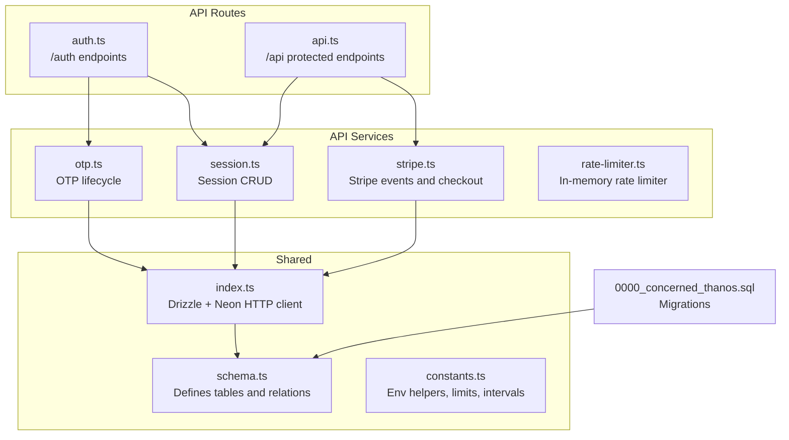
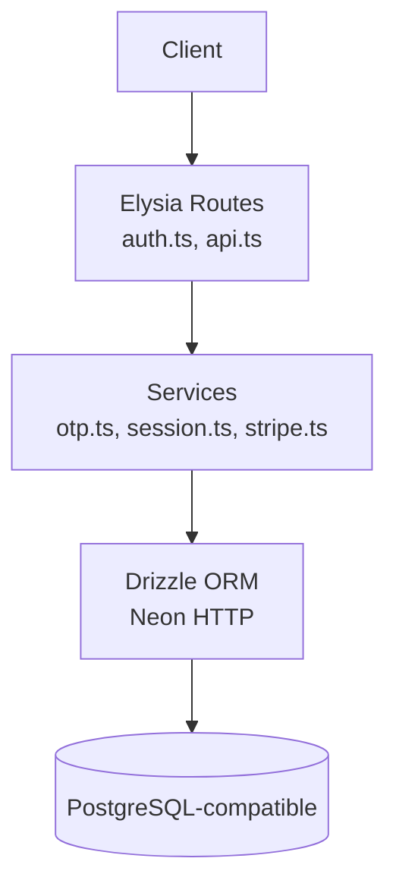
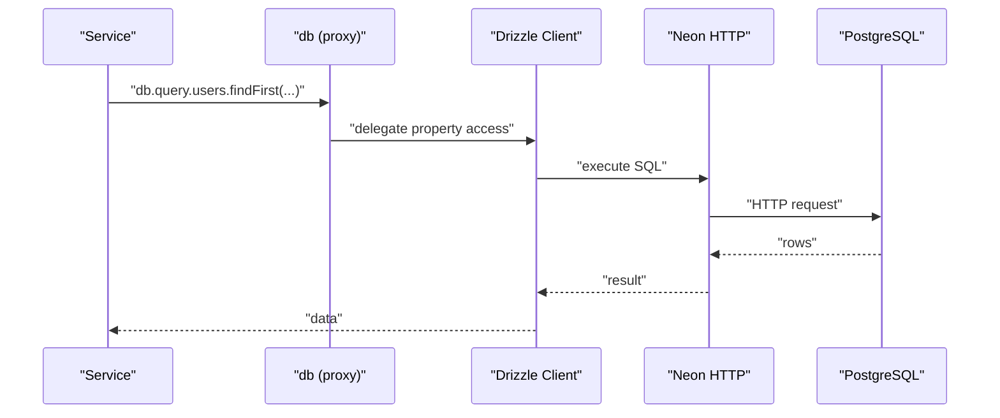
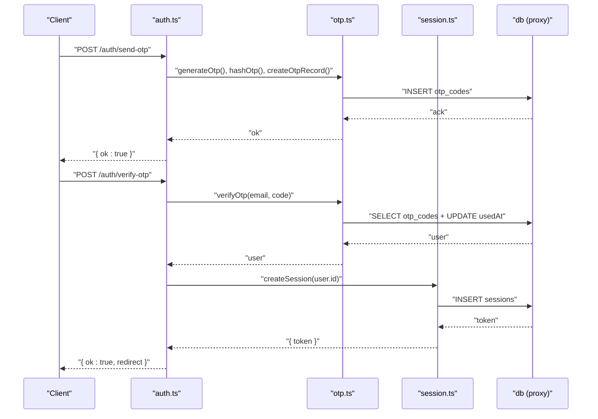
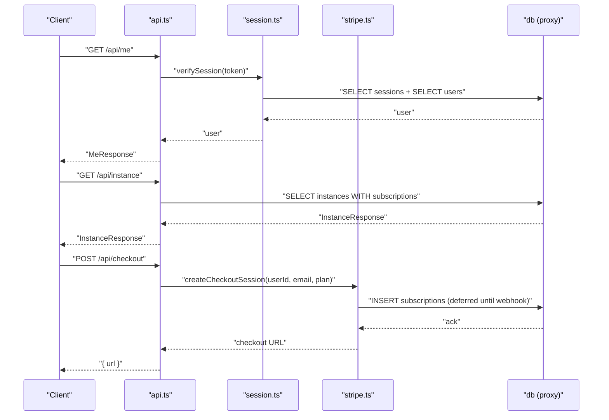
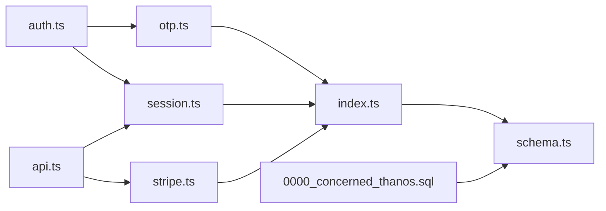

# Data Access Patterns

<cite>
**Referenced Files in This Document**
- [drizzle.config.ts](file://drizzle.config.ts)
- [0000_concerned_thanos.sql](file://drizzle/migrations/0000_concerned_thanos.sql)
- [schema.ts](file://packages/shared/src/db/schema.ts)
- [index.ts](file://packages/shared/src/db/index.ts)
- [constants.ts](file://packages/shared/src/constants.ts)
- [otp.ts](file://packages/api/src/services/otp.ts)
- [session.ts](file://packages/api/src/services/session.ts)
- [auth.ts](file://packages/api/src/routes/auth.ts)
- [api.ts](file://packages/api/src/routes/api.ts)
- [stripe.ts](file://packages/api/src/services/stripe.ts)
- [rate-limiter.ts](file://packages/api/src/lib/rate-limiter.ts)
</cite>

## Table of Contents
1. [Introduction](#introduction)
2. [Project Structure](#project-structure)
3. [Core Components](#core-components)
4. [Architecture Overview](#architecture-overview)
5. [Detailed Component Analysis](#detailed-component-analysis)
6. [Dependency Analysis](#dependency-analysis)
7. [Performance Considerations](#performance-considerations)
8. [Troubleshooting Guide](#troubleshooting-guide)
9. [Conclusion](#conclusion)
10. [Appendices](#appendices)

## Introduction
This document explains data access patterns and database interaction strategies in SparkClaw. It covers Drizzle client configuration and connection management, environment-based settings, and connection pooling. It documents common query patterns for authentication workflows, subscription management, and instance status tracking. Transaction handling for critical operations is addressed conceptually, along with guidance for bulk operations, batch processing, caching strategies, query optimization, monitoring, error handling, retry logic, graceful degradation, and maintaining data consistency across distributed operations.

## Project Structure
The data access layer centers around a shared Drizzle ORM configuration that connects to a PostgreSQL-compatible database via the Neon HTTP driver. The schema defines four primary tables: users, otp_codes, sessions, subscriptions, and instances. Routes and services orchestrate authentication, session management, checkout creation, and Stripe webhook handling. Migrations define the canonical database schema.



**Diagram sources**
- [schema.ts](file://packages/shared/src/db/schema.ts#L1-L146)
- [index.ts](file://packages/shared/src/db/index.ts#L1-L26)
- [constants.ts](file://packages/shared/src/constants.ts#L1-L28)
- [otp.ts](file://packages/api/src/services/otp.ts#L1-L59)
- [session.ts](file://packages/api/src/services/session.ts#L1-L43)
- [auth.ts](file://packages/api/src/routes/auth.ts#L1-L80)
- [api.ts](file://packages/api/src/routes/api.ts#L1-L88)
- [stripe.ts](file://packages/api/src/services/stripe.ts#L1-L107)
- [rate-limiter.ts](file://packages/api/src/lib/rate-limiter.ts#L1-L59)
- [0000_concerned_thanos.sql](file://drizzle/migrations/0000_concerned_thanos.sql#L1-L73)

**Section sources**
- [drizzle.config.ts](file://drizzle.config.ts#L1-L13)
- [schema.ts](file://packages/shared/src/db/schema.ts#L1-L146)
- [index.ts](file://packages/shared/src/db/index.ts#L1-L26)
- [0000_concerned_thanos.sql](file://drizzle/migrations/0000_concerned_thanos.sql#L1-L73)

## Core Components
- Drizzle + Neon HTTP client: Lazily initialized singleton that reads DATABASE_URL from environment and binds the generated schema. The proxy exposes db methods transparently.
- Schema: Defines users, otp_codes, sessions, subscriptions, and instances with appropriate indices and foreign keys. Relations connect users to otpCodes, sessions, subscriptions, and instances.
- Constants: Centralizes environment-driven configuration for Stripe price IDs, OTP and session lifetimes, rate limits, and polling intervals.
- Authentication services: OTP generation, hashing, storage, verification, and user creation; session creation, verification, and deletion.
- API routes: Authentication endpoints (/auth/send-otp, /auth/verify-otp, /auth/logout); protected API endpoints (/api/me, /api/instance, /api/checkout) with middleware and error handling.
- Stripe integration: Checkout session creation and webhook event handlers for subscription lifecycle updates and cancellation.

**Section sources**
- [index.ts](file://packages/shared/src/db/index.ts#L1-L26)
- [schema.ts](file://packages/shared/src/db/schema.ts#L1-L146)
- [constants.ts](file://packages/shared/src/constants.ts#L1-L28)
- [otp.ts](file://packages/api/src/services/otp.ts#L1-L59)
- [session.ts](file://packages/api/src/services/session.ts#L1-L43)
- [auth.ts](file://packages/api/src/routes/auth.ts#L1-L80)
- [api.ts](file://packages/api/src/routes/api.ts#L1-L88)
- [stripe.ts](file://packages/api/src/services/stripe.ts#L1-L107)

## Architecture Overview
The data access architecture follows a layered pattern:
- Presentation: Elysia routes expose public and protected endpoints.
- Application: Services encapsulate business logic and coordinate database operations.
- Persistence: Drizzle ORM with Neon HTTP driver connects to the database using a single shared client instance.



**Diagram sources**
- [auth.ts](file://packages/api/src/routes/auth.ts#L1-L80)
- [api.ts](file://packages/api/src/routes/api.ts#L1-L88)
- [otp.ts](file://packages/api/src/services/otp.ts#L1-L59)
- [session.ts](file://packages/api/src/services/session.ts#L1-L43)
- [stripe.ts](file://packages/api/src/services/stripe.ts#L1-L107)
- [index.ts](file://packages/shared/src/db/index.ts#L1-L26)

## Detailed Component Analysis

### Drizzle Client Configuration and Connection Management
- Initialization: A lazy-initialized singleton creates a Neon HTTP client from DATABASE_URL and binds the schema. Subsequent accesses reuse the same instance via a proxy.
- Environment-based settings: DATABASE_URL is required; missing it triggers an immediate error.
- Connection pooling: Neon HTTP driver manages connection pooling internally; the singleton ensures a single long-lived client instance per process.



**Diagram sources**
- [index.ts](file://packages/shared/src/db/index.ts#L1-L26)

**Section sources**
- [index.ts](file://packages/shared/src/db/index.ts#L1-L26)
- [drizzle.config.ts](file://drizzle.config.ts#L1-L13)

### Authentication Workflows
- Send OTP: Validates input, enforces rate limits keyed by IP and email, generates a 6-digit code, hashes it, stores expiry, and sends an email.
- Verify OTP: Hashes provided code, finds a non-expired, unused OTP record, marks it used, upserts a user by email, and creates a session.
- Session verification: Finds a non-expired session by token and loads the associated user.
- Logout: Deletes the session by token and clears the cookie.



**Diagram sources**
- [auth.ts](file://packages/api/src/routes/auth.ts#L1-L80)
- [otp.ts](file://packages/api/src/services/otp.ts#L1-L59)
- [session.ts](file://packages/api/src/services/session.ts#L1-L43)
- [index.ts](file://packages/shared/src/db/index.ts#L1-L26)

**Section sources**
- [auth.ts](file://packages/api/src/routes/auth.ts#L1-L80)
- [otp.ts](file://packages/api/src/services/otp.ts#L1-L59)
- [session.ts](file://packages/api/src/services/session.ts#L1-L43)
- [rate-limiter.ts](file://packages/api/src/lib/rate-limiter.ts#L1-L59)

### Subscription Management and Instance Status Tracking
- Protected API: Resolves a user from a session cookie; unauthorized requests are rejected.
- Fetch user profile: Loads user and subscription details.
- Fetch instance: Loads the user’s instance with subscription populated.
- Checkout: Creates a Stripe checkout session using plan-specific price ID from environment.
- Webhooks: Handlers update subscription status and current period end, and suspend associated instances on cancellation.



**Diagram sources**
- [api.ts](file://packages/api/src/routes/api.ts#L1-L88)
- [session.ts](file://packages/api/src/services/session.ts#L1-L43)
- [stripe.ts](file://packages/api/src/services/stripe.ts#L1-L107)
- [index.ts](file://packages/shared/src/db/index.ts#L1-L26)

**Section sources**
- [api.ts](file://packages/api/src/routes/api.ts#L1-L88)
- [stripe.ts](file://packages/api/src/services/stripe.ts#L1-L107)
- [constants.ts](file://packages/shared/src/constants.ts#L1-L28)

### Transaction Handling for Critical Operations
- Current implementation: Uses individual statements without explicit transaction blocks. For example, OTP verification updates the OTP record and inserts a user in separate operations.
- Recommended approach: Wrap critical sequences (e.g., OTP verification and user creation, or checkout session creation and subscription insertion) in a transaction to ensure atomicity. Roll back on errors and surface consistent failure states to clients.

[No sources needed since this section provides general guidance]

### Bulk Operations, Batch Processing, and Performance Optimization
- Bulk inserts: Use insert with multiple values to reduce round-trips when provisioning many records.
- Batch updates: Paginate with offsets or cursor-based keys; apply targeted filters to minimize result sets.
- Index utilization: Leverage existing indexes (e.g., sessions.token, otp_codes.email, instances.user_id, subscriptions.user_id) to speed up lookups.
- Query patterns: Prefer selective WHERE clauses and JOIN-less projections when possible; use with relations sparingly to avoid N+1 scenarios.
- Connection pooling: Reuse the singleton client; avoid creating new clients per request.
- Asynchronous workflows: Offload heavy tasks (e.g., instance provisioning) to queues and update statuses asynchronously.

[No sources needed since this section provides general guidance]

### Complex Queries: Joins, Aggregations, and Filtering
- Joins: The schema supports joins between users and sessions, users and subscriptions, and instances with subscriptions. Use relations to fetch denormalized views when needed.
- Aggregations: Aggregate counts by status or plan using group-by and count functions; apply filters on timestamps and status fields.
- Filtering: Combine equality, range, and null checks to refine results efficiently.

[No sources needed since this section provides general guidance]

### Caching Strategies, Query Optimization, and Monitoring
- Caching: Cache frequently accessed user sessions and subscription states in memory with TTLs aligned to session expiry and subscription updates.
- Query optimization: Add indexes on hot filter columns (e.g., instances.status, subscriptions.stripe_customer_id), and consider partial indexes for expirable OTPs.
- Monitoring: Log slow queries, track error rates, and instrument key endpoints. Surface database connection health and pool saturation metrics.

[No sources needed since this section provides general guidance]

### Error Handling Patterns, Retry Logic, and Graceful Degradation
- Route-level error handling: Unauthorized sessions are caught and returned as 401 responses.
- In-memory rate limiting: Prevents abuse with configurable windows and limits; cleans up stale entries periodically.
- Graceful degradation: On webhook failures, log and retry via external systems; mark transient provisioning failures and reattempt after backoff.

**Section sources**
- [api.ts](file://packages/api/src/routes/api.ts#L28-L33)
- [rate-limiter.ts](file://packages/api/src/lib/rate-limiter.ts#L1-L59)

### Maintaining Data Consistency Across Distributed Operations
- Idempotency: Ensure webhook handlers are idempotent; deduplicate by Stripe identifiers (e.g., stripe_subscription_id).
- Eventual consistency: Use queues for asynchronous provisioning; poll for status with bounded retries and timeouts.
- Atomicity: Wrap cross-table updates in transactions; validate preconditions before applying changes.

[No sources needed since this section provides general guidance]

## Dependency Analysis
The following diagram shows module-level dependencies among data-access components.



**Diagram sources**
- [auth.ts](file://packages/api/src/routes/auth.ts#L1-L80)
- [api.ts](file://packages/api/src/routes/api.ts#L1-L88)
- [otp.ts](file://packages/api/src/services/otp.ts#L1-L59)
- [session.ts](file://packages/api/src/services/session.ts#L1-L43)
- [stripe.ts](file://packages/api/src/services/stripe.ts#L1-L107)
- [index.ts](file://packages/shared/src/db/index.ts#L1-L26)
- [schema.ts](file://packages/shared/src/db/schema.ts#L1-L146)
- [0000_concerned_thanos.sql](file://drizzle/migrations/0000_concerned_thanos.sql#L1-L73)

**Section sources**
- [auth.ts](file://packages/api/src/routes/auth.ts#L1-L80)
- [api.ts](file://packages/api/src/routes/api.ts#L1-L88)
- [otp.ts](file://packages/api/src/services/otp.ts#L1-L59)
- [session.ts](file://packages/api/src/services/session.ts#L1-L43)
- [stripe.ts](file://packages/api/src/services/stripe.ts#L1-L107)
- [index.ts](file://packages/shared/src/db/index.ts#L1-L26)
- [schema.ts](file://packages/shared/src/db/schema.ts#L1-L146)
- [0000_concerned_thanos.sql](file://drizzle/migrations/0000_concerned_thanos.sql#L1-L73)

## Performance Considerations
- Minimize round-trips: Batch writes and use returning clauses judiciously.
- Index coverage: Ensure hot queries leverage indexes; monitor query plans.
- Connection reuse: Use the singleton client; avoid per-request client churn.
- Asynchronous processing: Defer non-critical work to queues and update statuses incrementally.

[No sources needed since this section provides general guidance]

## Troubleshooting Guide
- Missing DATABASE_URL: The client initialization throws an error if the environment variable is absent.
- Unauthorized access: Route resolution returns 401 for missing or invalid sessions.
- OTP verification failures: Expired, used, or mismatched codes lead to 401 responses.
- Stripe webhooks: Ensure webhook secrets and URLs are configured; log and retry on transient errors.

**Section sources**
- [index.ts](file://packages/shared/src/db/index.ts#L1-L26)
- [api.ts](file://packages/api/src/routes/api.ts#L28-L33)
- [otp.ts](file://packages/api/src/services/otp.ts#L27-L58)
- [stripe.ts](file://packages/api/src/services/stripe.ts#L20-L26)

## Conclusion
SparkClaw’s data access layer leverages a clean separation of concerns: a shared Drizzle client with Neon HTTP, a well-defined schema with relations, and focused services for authentication, sessions, and Stripe integration. By adopting transactions for critical sequences, optimizing queries with proper indexing, implementing robust error handling and retries, and using asynchronous workflows, the system can maintain reliability and performance under real-world load.

## Appendices

### Schema Overview
```mermaid
erDiagram
USERS {
uuid id PK
string email UK
timestamp created_at
timestamp updated_at
}
OTP_CODES {
uuid id PK
string email
string code_hash
timestamp expires_at
timestamp used_at
timestamp created_at
}
SESSIONS {
uuid id PK
uuid user_id FK
string token UK
timestamp expires_at
timestamp created_at
}
SUBSCRIPTIONS {
uuid id PK
uuid user_id UK FK
string plan
string stripe_customer_id
string stripe_subscription_id UK
string status
timestamp current_period_end
timestamp created_at
timestamp updated_at
}
INSTANCES {
uuid id PK
uuid user_id FK
uuid subscription_id UK FK
string railway_project_id
string railway_service_id
text railway_url
text url
string status
string domain_status
text error_message
timestamp created_at
timestamp updated_at
}
USERS ||--o{ OTP_CODES : "has"
USERS ||--o{ SESSIONS : "has"
USERS ||--|| SUBSCRIPTIONS : "has"
USERS ||--|| INSTANCES : "has"
SUBSCRIPTIONS ||--|| INSTANCES : "owns"
```

**Diagram sources**
- [schema.ts](file://packages/shared/src/db/schema.ts#L1-L146)
- [0000_concerned_thanos.sql](file://drizzle/migrations/0000_concerned_thanos.sql#L1-L73)