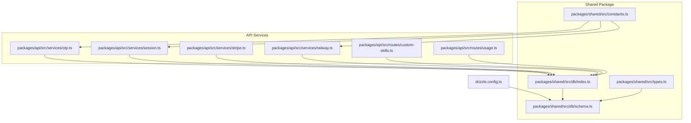
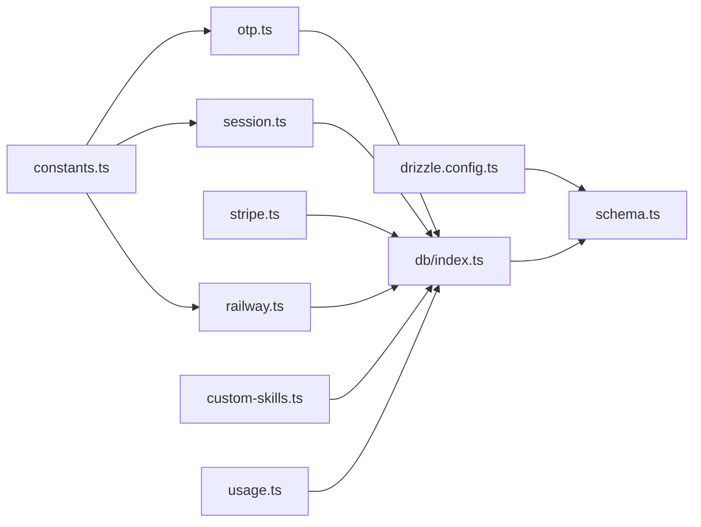

# Database Design

<cite>
**Referenced Files in This Document**
- [drizzle.config.ts](file://drizzle.config.ts)
- [packages/shared/src/db/schema.ts](file://packages/shared/src/db/schema.ts)
- [packages/shared/src/db/index.ts](file://packages/shared/src/db/index.ts)
- [packages/shared/src/types.ts](file://packages/shared/src/types.ts)
- [packages/shared/src/constants.ts](file://packages/shared/src/constants.ts)
- [packages/api/src/services/otp.ts](file://packages/api/src/services/otp.ts)
- [packages/api/src/services/session.ts](file://packages/api/src/services/session.ts)
- [packages/api/src/services/stripe.ts](file://packages/api/src/services/stripe.ts)
- [packages/api/src/services/railway.ts](file://packages/api/src/services/railway.ts)
- [packages/api/src/routes/custom-skills.ts](file://packages/api/src/routes/custom-skills.ts)
- [packages/api/src/routes/usage.ts](file://packages/api/src/routes/usage.ts)
- [PRD.md](file://PRD.md)
</cite>

## Update Summary
**Changes Made**
- Added new table schemas: env_vars, custom_skills, llm_keys, usage_records, scheduled_jobs, channel_configs, api_keys, audit_logs, totp_secrets, organizations, org_members, org_invites
- Enhanced instances table with AI configuration, feature flags, setup wizard state, and multi-instance support
- Updated relationships to support multi-instance architecture and enhanced user capabilities
- Added comprehensive indexing strategy for new tables and enhanced existing indexes
- Expanded data lifecycle policies to include new entities

## Table of Contents
1. [Introduction](#introduction)
2. [Project Structure](#project-structure)
3. [Core Components](#core-components)
4. [Architecture Overview](#architecture-overview)
5. [Detailed Component Analysis](#detailed-component-analysis)
6. [Enhanced Multi-Instance Support](#enhanced-multi-instance-support)
7. [Dependency Analysis](#dependency-analysis)
8. [Performance Considerations](#performance-considerations)
9. [Troubleshooting Guide](#troubleshooting-guide)
10. [Conclusion](#conclusion)
11. [Appendices](#appendices)

## Introduction
This document describes SparkClaw's PostgreSQL data model designed with Drizzle ORM and deployed via Neon. The design has evolved to support enhanced multi-instance capabilities, comprehensive environment variable management, custom skill execution, and advanced usage tracking. It covers the entity-relationship model, table schemas, constraints, indexes, migration management, data access patterns, lifecycle policies, and operational considerations. The design enforces 1:1 relationships between users and subscriptions, and between subscriptions and instances, while supporting 1:N relationships for OTP codes, sessions, and multiple instances per user. It also documents Stripe and Railway integrations, OTP hashing and expiration, session token management, usage tracking, environment variable encryption, and custom skill execution.

## Project Structure
The database schema and configuration live under the shared package and are consumed by API services. Drizzle Kit configuration points to the schema file and migration output directory. Neon serverless driver powers the PostgreSQL connection. The schema now includes comprehensive support for multi-instance deployments, environment variable management, custom skills, and usage analytics.



**Diagram sources**
- [drizzle.config.ts](file://drizzle.config.ts#L1-L13)
- [packages/shared/src/db/schema.ts](file://packages/shared/src/db/schema.ts#L1-L527)
- [packages/shared/src/db/index.ts](file://packages/shared/src/db/index.ts#L1-L25)
- [packages/shared/src/types.ts](file://packages/shared/src/types.ts#L1-L311)
- [packages/shared/src/constants.ts](file://packages/shared/src/constants.ts#L1-L34)
- [packages/api/src/services/otp.ts](file://packages/api/src/services/otp.ts#L1-L59)
- [packages/api/src/services/session.ts](file://packages/api/src/services/session.ts#L1-L43)
- [packages/api/src/services/stripe.ts](file://packages/api/src/services/stripe.ts#L1-L107)
- [packages/api/src/services/railway.ts](file://packages/api/src/services/railway.ts#L1-L291)
- [packages/api/src/routes/custom-skills.ts](file://packages/api/src/routes/custom-skills.ts#L1-L120)
- [packages/api/src/routes/usage.ts](file://packages/api/src/routes/usage.ts#L1-L110)

**Section sources**
- [drizzle.config.ts](file://drizzle.config.ts#L1-L13)
- [packages/shared/src/db/schema.ts](file://packages/shared/src/db/schema.ts#L1-L527)
- [packages/shared/src/db/index.ts](file://packages/shared/src/db/index.ts#L1-L25)
- [packages/shared/src/types.ts](file://packages/shared/src/types.ts#L1-L311)
- [packages/shared/src/constants.ts](file://packages/shared/src/constants.ts#L1-L34)

## Core Components
- **users**: Identity table with UUID primary key, unique email, role field, and timestamps.
- **otp_codes**: One-time passcodes hashed and time-bound; supports rate limits and OTP verification.
- **sessions**: Secure session tokens with expiry; links to users via foreign key.
- **subscriptions**: Stripe-backed subscription records; 1:1 with users; unique Stripe identifiers.
- **instances**: Enhanced Railway deployment records with AI configuration, feature flags, setup wizard state, and multi-instance support; 1:N with users, 1:1 with subscriptions.
- **env_vars**: Environment variables for instances with encryption and secret masking.
- **custom_skills**: Custom Python/TypeScript skills with triggers, timeouts, and execution tracking.
- **llm_keys**: BYOK (Bring Your Own Key) for LLM providers with encrypted storage.
- **usage_records**: Comprehensive usage tracking across users, instances, and time periods.
- **channel_configs**: Multi-channel messaging configurations with encrypted credentials.
- **api_keys**: API key management with scoped permissions and expiration.
- **audit_logs**: Complete audit trail for user actions and system events.
- **scheduled_jobs**: Cron-based job scheduling with execution tracking.
- **organizations**: Multi-user organization management with membership and invitations.
- **totp_secrets**: Two-factor authentication secrets with backup codes.

Key constraints and relationships:
- users.id → subscriptions.userId (unique)
- subscriptions.id → instances.subscriptionId (unique)
- users.id → otp_codes.email (logical join; see indexes)
- sessions.userId → users.id (foreign key)
- instances.userId → users.id (foreign key)
- instances.id → env_vars.instanceId (cascade delete)
- instances.id → custom_skills.instanceId (cascade delete)
- instances.id → channelConfigs.instanceId (cascade delete)
- instances.id → scheduledJobs.instanceId (cascade delete)
- instances.id → usageRecords.instanceId (set null on delete)
- users.id → llmKeys.userId (cascade delete)
- users.id → apiKeys.userId (cascade delete)
- users.id → auditLogs.userId (no delete cascade)
- users.id → totpSecrets.userId (cascade delete)
- organizations.ownerId → users.id (no delete cascade)
- organizations.id → orgMembers.orgId (cascade delete)
- users.id → orgMembers.userId (cascade delete)
- organizations.id → orgInvites.orgId (cascade delete)
- users.id → orgInvites.invitedBy (no delete cascade)

**Section sources**
- [packages/shared/src/db/schema.ts](file://packages/shared/src/db/schema.ts#L19-L37)
- [packages/shared/src/db/schema.ts](file://packages/shared/src/db/schema.ts#L41-L55)
- [packages/shared/src/db/schema.ts](file://packages/shared/src/db/schema.ts#L59-L78)
- [packages/shared/src/db/schema.ts](file://packages/shared/src/db/schema.ts#L82-L112)
- [packages/shared/src/db/schema.ts](file://packages/shared/src/db/schema.ts#L116-L187)
- [packages/shared/src/db/schema.ts](file://packages/shared/src/db/schema.ts#L472-L493)
- [packages/shared/src/db/schema.ts](file://packages/shared/src/db/schema.ts#L497-L526)
- [packages/shared/src/db/schema.ts](file://packages/shared/src/db/schema.ts#L303-L324)
- [packages/shared/src/db/schema.ts](file://packages/shared/src/db/schema.ts#L411-L439)
- [packages/shared/src/db/schema.ts](file://packages/shared/src/db/schema.ts#L191-L218)
- [packages/shared/src/db/schema.ts](file://packages/shared/src/db/schema.ts#L222-L245)
- [packages/shared/src/db/schema.ts](file://packages/shared/src/db/schema.ts#L249-L274)
- [packages/shared/src/db/schema.ts](file://packages/shared/src/db/schema.ts#L443-L468)
- [packages/shared/src/db/schema.ts](file://packages/shared/src/db/schema.ts#L328-L350)
- [packages/shared/src/db/schema.ts](file://packages/shared/src/db/schema.ts#L354-L376)
- [packages/shared/src/db/schema.ts](file://packages/shared/src/db/schema.ts#L380-L407)
- [packages/shared/src/db/schema.ts](file://packages/shared/src/db/schema.ts#L278-L299)

## Architecture Overview
The data model centers on a flexible multi-instance architecture: users → subscriptions → instances, with enhanced relationships supporting multiple instances per user. Each user maintains multiple otp_codes and sessions, while instances support comprehensive configuration management through env_vars, custom_skills, channel_configs, and scheduled_jobs. The design includes robust security with encrypted storage for sensitive data and comprehensive audit trails.

```mermaid
erDiagram
USERS {
uuid id PK
string email UK
string role
timestamptz created_at
timestamptz updated_at
}
OTP_CODES {
uuid id PK
string email
string code_hash
timestamptz expires_at
timestamptz used_at
timestamptz created_at
}
SESSIONS {
uuid id PK
uuid user_id FK
string token UK
timestamptz expires_at
timestamptz created_at
}
SUBSCRIPTIONS {
uuid id PK
uuid user_id UK FK
string plan
string stripe_customer_id
string stripe_subscription_id UK
string status
timestamptz current_period_end
timestamptz created_at
timestamptz updated_at
}
INSTANCES {
uuid id PK
uuid user_id FK
uuid subscription_id FK
string railway_project_id
string railway_service_id
string custom_domain UK
text railway_url
text url
string status
string domain_status
text error_message
boolean setup_completed
string instance_name
string timezone
jsonb ai_config
jsonb features
timestamptz created_at
timestamptz updated_at
}
ENV_VARS {
uuid id PK
uuid instance_id FK
string key
text encrypted_value
boolean is_secret
timestamptz created_at
timestamptz updated_at
}
CUSTOM_SKILLS {
uuid id PK
uuid instance_id FK
string name
text description
string language
text code
boolean enabled
string trigger_type
string trigger_value
integer timeout
timestamptz last_run_at
string last_run_status
text last_run_output
timestamptz created_at
timestamptz updated_at
}
CHANNEL_CONFIGS {
uuid id PK
uuid instance_id FK
string type
boolean enabled
jsonb credentials
jsonb settings
timestamptz created_at
timestamptz updated_at
}
SCHEDULED_JOBS {
uuid id PK
uuid instance_id FK
string name
string cron_expression
string task_type
jsonb config
boolean enabled
timestamptz last_run_at
timestamptz next_run_at
timestamptz created_at
timestamptz updated_at
}
LLM_KEYS {
uuid id PK
uuid user_id FK
string provider
string name
text encrypted_key
timestamptz last_used_at
timestamptz created_at
}
API_KEYS {
uuid id PK
uuid user_id FK
string name
string key_hash UK
string key_prefix
json scopes
timestamptz last_used_at
timestamptz expires_at
timestamptz created_at
}
AUDIT_LOGS {
uuid id PK
uuid user_id FK
uuid instance_id FK
string action
json metadata
string ip
timestamptz created_at
}
TOTP_SECRETS {
uuid id PK
uuid user_id UK FK
text encrypted_secret
boolean enabled
json backup_codes
timestamptz created_at
timestamptz updated_at
}
ORGANIZATIONS {
uuid id PK
string name
string slug UK
uuid owner_id FK
timestamptz created_at
timestamptz updated_at
}
ORG_MEMBERS {
uuid id PK
uuid org_id FK
uuid user_id FK
string role
timestamptz created_at
}
ORG_INVITES {
uuid id PK
uuid org_id FK
string email
string role
string token UK
uuid invited_by FK
timestamptz expires_at
timestamptz accepted_at
timestamptz created_at
}
USAGE_RECORDS {
uuid id PK
uuid user_id FK
uuid instance_id FK
string type
integer quantity
string period
json metadata
timestamptz created_at
}
USERS ||--o{ OTP_CODES : "1:N"
USERS ||--o{ SESSIONS : "1:N"
USERS ||--o{ SUBSCRIPTIONS : "1:N"
USERS ||--o{ LLM_KEYS : "1:N"
USERS ||--o{ API_KEYS : "1:N"
USERS ||--o{ TOTP_SECRETS : "1:N"
USERS ||--o{ ORG_MEMBERS : "1:N"
USERS ||--o{ ORG_INVITES : "1:N"
USERS ||--o{ AUDIT_LOGS : "1:N"
USERS ||--o{ ORGANIZATIONS : "1:N"
USERS ||--o{ INSTANCES : "1:N"
SUBSCRIPTIONS ||--|| INSTANCES : "1:1"
INSTANCES ||--o{ ENV_VARS : "1:N"
INSTANCES ||--o{ CUSTOM_SKILLS : "1:N"
INSTANCES ||--o{ CHANNEL_CONFIGS : "1:N"
INSTANCES ||--o{ SCHEDULED_JOBS : "1:N"
INSTANCES ||--o{ USAGE_RECORDS : "1:N"
ORGANIZATIONS ||--o{ ORG_MEMBERS : "1:N"
ORGANIZATIONS ||--o{ ORG_INVITES : "1:N"
```

**Diagram sources**
- [packages/shared/src/db/schema.ts](file://packages/shared/src/db/schema.ts#L19-L37)
- [packages/shared/src/db/schema.ts](file://packages/shared/src/db/schema.ts#L41-L55)
- [packages/shared/src/db/schema.ts](file://packages/shared/src/db/schema.ts#L59-L78)
- [packages/shared/src/db/schema.ts](file://packages/shared/src/db/schema.ts#L82-L112)
- [packages/shared/src/db/schema.ts](file://packages/shared/src/db/schema.ts#L116-L187)
- [packages/shared/src/db/schema.ts](file://packages/shared/src/db/schema.ts#L472-L493)
- [packages/shared/src/db/schema.ts](file://packages/shared/src/db/schema.ts#L497-L526)
- [packages/shared/src/db/schema.ts](file://packages/shared/src/db/schema.ts#L191-L218)
- [packages/shared/src/db/schema.ts](file://packages/shared/src/db/schema.ts#L443-L468)
- [packages/shared/src/db/schema.ts](file://packages/shared/src/db/schema.ts#L303-L324)
- [packages/shared/src/db/schema.ts](file://packages/shared/src/db/schema.ts#L222-L245)
- [packages/shared/src/db/schema.ts](file://packages/shared/src/db/schema.ts#L249-L274)
- [packages/shared/src/db/schema.ts](file://packages/shared/src/db/schema.ts#L278-L299)
- [packages/shared/src/db/schema.ts](file://packages/shared/src/db/schema.ts#L328-L350)
- [packages/shared/src/db/schema.ts](file://packages/shared/src/db/schema.ts#L354-L376)
- [packages/shared/src/db/schema.ts](file://packages/shared/src/db/schema.ts#L380-L407)
- [packages/shared/src/db/schema.ts](file://packages/shared/src/db/schema.ts#L411-L439)

## Detailed Component Analysis

### users
- **Primary key**: UUID (random default).
- **Unique constraint**: email.
- **New field**: role with default "user" (supports "user" | "admin").
- **Timestamps**: created_at, updated_at default to current time.
- **Relations**: one subscription, multiple instances, many otp_codes, many sessions, many llm_keys, many api_keys, many totp_secrets, many audit_logs, many org_memberships, many org_invites.

**Updated** Added role field for admin capabilities and expanded relationships for enhanced multi-instance support.

Validation and constraints:
- Email uniqueness enforced at DB level.
- Role field constrained to predefined values.
- UUID primary key ensures global uniqueness.

Indexes:
- Implicit primary key index on id.
- Implicit unique index on email.

Operational notes:
- Role field enables administrative features and access control.
- Updated_at is refreshed on write via default; application logic can override if needed.

**Section sources**
- [packages/shared/src/db/schema.ts](file://packages/shared/src/db/schema.ts#L19-L37)
- [packages/shared/src/types.ts](file://packages/shared/src/types.ts#L64-L77)

### otp_codes
- **Purpose**: store hashed OTP codes with expiry and usage tracking.
- **Schema highlights**:
  - code_hash stored as fixed-length string.
  - expires_at and optional used_at track validity and consumption.
  - created_at defaults to current time.
- **Indexes**:
  - email
  - expires_at
- **Validation rules**:
  - NOT NULL email and code_hash.
  - Expiry enforced by application queries and periodic cleanup jobs.
- **Business constraints**:
  - OTPs are single-use; used_at marks consumption.
  - Expiry prevents replay attacks.

OTP lifecycle:
- Creation: insert with hash and expiry.
- Verification: match hash, ensure not used and not expired.
- Cleanup: expired rows eligible for pruning.

**Section sources**
- [packages/shared/src/db/schema.ts](file://packages/shared/src/db/schema.ts#L41-L55)
- [packages/api/src/services/otp.ts](file://packages/api/src/services/otp.ts#L19-L58)
- [packages/shared/src/constants.ts](file://packages/shared/src/constants.ts#L16-L20)

### sessions
- **Purpose**: manage authenticated sessions with secure tokens.
- **Schema highlights**:
  - token is unique and NOT NULL.
  - expires_at enforces session lifetime.
  - userId FK to users.
- **Indexes**:
  - token (unique)
  - user_id
- **Validation rules**:
  - Token uniqueness enforced at DB level.
  - Expiry checked during verification.
- **Business constraints**:
  - Sessions are short-lived; long-lived sessions are discouraged.

Session lifecycle:
- Creation: insert with random token and expiry.
- Verification: find by token and unexpired.
- Cleanup: delete on logout or expiry.

**Section sources**
- [packages/shared/src/db/schema.ts](file://packages/shared/src/db/schema.ts#L59-L78)
- [packages/api/src/services/session.ts](file://packages/api/src/services/session.ts#L13-L42)
- [packages/shared/src/constants.ts](file://packages/shared/src/constants.ts#L22-L23)

### subscriptions
- **Purpose**: represent Stripe-managed subscriptions linked to users.
- **Schema highlights**:
  - userId unique FK to users.
  - plan, status, current_period_end.
  - Stripe identifiers: stripe_customer_id (not unique), stripe_subscription_id unique.
- **Indexes**:
  - uniqueIndex on user_id
  - uniqueIndex on stripe_subscription_id
  - index on stripe_customer_id
- **Validation rules**:
  - user_id is unique (1:1 with users).
  - stripe_subscription_id is unique (enforces 1:1 with instances).
  - status constrained to known values.
- **Business constraints**:
  - Re-subscribe behavior: old rows marked canceled/past_due; new rows created for renewed plans.

Stripe integration:
- Webhooks update status and period end.
- Checkout completion inserts a new subscription and triggers instance provisioning.

**Section sources**
- [packages/shared/src/db/schema.ts](file://packages/shared/src/db/schema.ts#L82-L112)
- [packages/api/src/services/stripe.ts](file://packages/api/src/services/stripe.ts#L45-L72)
- [PRD.md](file://PRD.md#L435-L437)

### instances
- **Purpose**: track Railway deployments per subscription with enhanced multi-instance support.
- **Schema highlights**:
  - subscriptionId FK to subscriptions (1:1).
  - railway identifiers and URLs.
  - status and domain_status fields.
  - **New fields**: setup_completed (boolean), instance_name (string), timezone (string), ai_config (jsonb), features (jsonb).
  - error_message for diagnostics.
- **Indexes**:
  - user_id
  - subscription_id
  - status
  - custom_domain (unique)
  - domain_status
  - setup_completed
- **Validation rules**:
  - subscriptionId is unique (1:1 with subscriptions).
  - Status constrained to known values.
  - **New constraints**: instance_name length limit, timezone default UTC.
- **Business constraints**:
  - Graceful suspension on cancellation; data retention policy applies post-cancellation.
  - **Multi-instance support**: users can have multiple instances with different configurations.

Railway provisioning:
- Generates custom domain, creates service, configures domains, polls readiness, updates status.
- **Setup wizard**: tracks configuration completion through setup_completed flag.

**Updated** Enhanced with AI configuration, feature flags, setup wizard state, and multi-instance support.

**Section sources**
- [packages/shared/src/db/schema.ts](file://packages/shared/src/db/schema.ts#L116-L187)
- [packages/api/src/services/railway.ts](file://packages/api/src/services/railway.ts#L177-L290)
- [PRD.md](file://PRD.md#L435-L437)

### env_vars
- **Purpose**: manage environment variables for instances with encryption and secret masking.
- **Schema highlights**:
  - instanceId FK to instances with cascade delete.
  - key-value pairs with encrypted storage.
  - isSecret flag for sensitive data masking.
- **Indexes**:
  - instance_id
  - uniqueIndex on (instance_id, key)
- **Validation rules**:
  - NOT NULL instanceId and key.
  - Encrypted value stored as text.
  - Unique constraint prevents duplicate keys per instance.
- **Business constraints**:
  - Cascade delete ensures cleanup when instances are removed.
  - Secret masking prevents unauthorized access to sensitive values.

Environment variable lifecycle:
- Creation: insert with encrypted value and secret flag.
- Retrieval: decrypt on access for authorized users.
- Cleanup: automatic cascade deletion with instance.

**New** Added comprehensive environment variable management with encryption and secret handling.

**Section sources**
- [packages/shared/src/db/schema.ts](file://packages/shared/src/db/schema.ts#L472-L493)
- [packages/shared/src/types.ts](file://packages/shared/src/types.ts#L177-L184)

### custom_skills
- **Purpose**: enable custom Python/TypeScript skills with triggers, timeouts, and execution tracking.
- **Schema highlights**:
  - instanceId FK to instances with cascade delete.
  - name, description, language (python|typescript).
  - code storage with execution tracking.
  - trigger_type (command|event|schedule) with trigger_value.
  - timeout configuration and execution metrics.
- **Indexes**:
  - instance_id
  - uniqueIndex on (instance_id, name)
- **Validation rules**:
  - NOT NULL instanceId, name, and code.
  - Language constrained to predefined values.
  - Timeout constrained to reasonable bounds.
  - Unique constraint prevents duplicate skill names per instance.
- **Business constraints**:
  - Cascade delete ensures cleanup when instances are removed.
  - Execution tracking prevents resource exhaustion.

Skill lifecycle:
- Creation: define trigger conditions and execution parameters.
- Execution: run on schedule, command, or event triggers.
- Monitoring: track execution status, duration, and errors.

**New** Added custom skill execution framework with comprehensive trigger and execution management.

**Section sources**
- [packages/shared/src/db/schema.ts](file://packages/shared/src/db/schema.ts#L497-L526)
- [packages/shared/src/types.ts](file://packages/shared/src/types.ts#L186-L201)
- [packages/api/src/routes/custom-skills.ts](file://packages/api/src/routes/custom-skills.ts#L67-L99)

### llm_keys
- **Purpose**: BYOK (Bring Your Own Key) for LLM providers with encrypted storage.
- **Schema highlights**:
  - userId FK to users with cascade delete.
  - provider (openai|anthropic|google|ollama).
  - name for key identification.
  - encrypted_key storage with last_used_at tracking.
- **Indexes**:
  - user_id
  - uniqueIndex on (user_id, provider, name)
- **Validation rules**:
  - NOT NULL userId, provider, and name.
  - Encrypted key stored as text.
  - Provider constrained to predefined values.
- **Business constraints**:
  - Cascade delete ensures cleanup when users are removed.
  - Unique constraint prevents duplicate key names per provider per user.

Key lifecycle:
- Creation: store encrypted provider key with metadata.
- Usage: track last_used_at for audit purposes.
- Cleanup: automatic cascade deletion with user.

**New** Added comprehensive LLM key management with provider-specific support and encryption.

**Section sources**
- [packages/shared/src/db/schema.ts](file://packages/shared/src/db/schema.ts#L303-L324)
- [packages/shared/src/types.ts](file://packages/shared/src/types.ts#L133-L139)

### usage_records
- **Purpose**: comprehensive usage tracking across users, instances, and time periods.
- **Schema highlights**:
  - userId FK to users.
  - instanceId FK to instances with set null on delete.
  - type (llm_tokens|messages|file_storage|api_calls).
  - quantity with default 0.
  - period in YYYY-MM format.
  - metadata for detailed tracking.
- **Indexes**:
  - user_id
  - instance_id
  - period
  - uniqueIndex on (user_id, instance_id, type, period)
- **Validation rules**:
  - NOT NULL userId, type, and period.
  - Quantity constrained to non-negative integers.
  - Period format enforced as YYYY-MM.
- **Business constraints**:
  - Set null ensures usage records persist even if instances are deleted.
  - Unique constraint prevents duplicate usage records for the same period.

Usage tracking:
- Real-time tracking of API usage, token consumption, and storage.
- Historical reporting across time periods.
- Granular categorization by usage type.

**New** Added comprehensive usage tracking with historical reporting and granular categorization.

**Section sources**
- [packages/shared/src/db/schema.ts](file://packages/shared/src/db/schema.ts#L411-L439)
- [packages/shared/src/types.ts](file://packages/shared/src/types.ts#L141-L150)
- [packages/api/src/routes/usage.ts](file://packages/api/src/routes/usage.ts#L70-L110)

### channel_configs
- **Purpose**: multi-channel messaging configurations with encrypted credentials.
- **Schema highlights**:
  - instanceId FK to instances with cascade delete.
  - type (telegram|discord|line|whatsapp|web|slack|instagram|messenger).
  - enabled flag for channel activation.
  - credentials and settings stored as JSONB.
- **Indexes**:
  - instance_id
  - uniqueIndex on (instance_id, type)
- **Validation rules**:
  - NOT NULL instanceId and type.
  - Credentials and settings stored as JSONB.
- **Business constraints**:
  - Cascade delete ensures cleanup when instances are removed.
  - Unique constraint prevents duplicate channel configurations per instance.

Channel management:
- Support for multiple messaging platforms.
- Encrypted credential storage for security.
- Configurable settings per channel type.

**New** Added comprehensive multi-channel messaging configuration with encrypted credentials.

**Section sources**
- [packages/shared/src/db/schema.ts](file://packages/shared/src/db/schema.ts#L191-L218)
- [packages/shared/src/types.ts](file://packages/shared/src/types.ts#L231-L239)

### api_keys
- **Purpose**: API key management with scoped permissions and expiration.
- **Schema highlights**:
  - userId FK to users with cascade delete.
  - name for key identification.
  - keyHash and keyPrefix for authentication.
  - scopes array for permission control.
  - lastUsedAt and expiresAt tracking.
- **Indexes**:
  - user_id
  - uniqueIndex on keyHash
- **Validation rules**:
  - NOT NULL userId, name, keyHash, and keyPrefix.
  - Scopes stored as JSONB array.
- **Business constraints**:
  - Cascade delete ensures cleanup when users are removed.
  - Unique keyHash prevents duplicate API keys.

API key lifecycle:
- Creation: generate unique key with scoped permissions.
- Usage: track lastUsedAt for monitoring.
- Expiration: enforce time-based access control.

**New** Added comprehensive API key management with scoped permissions and expiration.

**Section sources**
- [packages/shared/src/db/schema.ts](file://packages/shared/src/db/schema.ts#L222-L245)
- [packages/shared/src/types.ts](file://packages/shared/src/types.ts#L96-L104)

### audit_logs
- **Purpose**: complete audit trail for user actions and system events.
- **Schema highlights**:
  - userId FK to users.
  - instanceId FK to instances with set null on delete.
  - action string for event classification.
  - metadata JSONB for detailed event information.
  - ip address tracking.
- **Indexes**:
  - user_id
  - instance_id
  - action
  - created_at
- **Validation rules**:
  - NOT NULL userId and action.
  - Metadata stored as JSONB.
- **Business constraints**:
  - Set null ensures audit logs persist even if instances are deleted.

Audit trail:
- Comprehensive logging of user actions.
- System event tracking for troubleshooting.
- IP address correlation for security monitoring.

**New** Added comprehensive audit logging with detailed event tracking and correlation.

**Section sources**
- [packages/shared/src/db/schema.ts](file://packages/shared/src/db/schema.ts#L249-L274)
- [packages/shared/src/types.ts](file://packages/shared/src/types.ts#L106-L114)

### scheduled_jobs
- **Purpose**: cron-based job scheduling with execution tracking.
- **Schema highlights**:
  - instanceId FK to instances with cascade delete.
  - name for job identification.
  - cronExpression for scheduling.
  - taskType for job classification.
  - config JSONB for job parameters.
  - enabled flag and execution tracking.
- **Indexes**:
  - instance_id
  - enabled
- **Validation rules**:
  - NOT NULL instanceId, name, and cronExpression.
  - Task type constrained to predefined values.
  - Config stored as JSONB.
- **Business constraints**:
  - Cascade delete ensures cleanup when instances are removed.

Job scheduling:
- Cron-based execution with configurable intervals.
- Execution tracking and monitoring.
- Configurable job parameters.

**New** Added comprehensive job scheduling with execution tracking and monitoring.

**Section sources**
- [packages/shared/src/db/schema.ts](file://packages/shared/src/db/schema.ts#L443-L468)
- [packages/shared/src/types.ts](file://packages/shared/src/types.ts#L152-L163)

### organizations
- **Purpose**: multi-user organization management with ownership and membership.
- **Schema highlights**:
  - ownerId FK to users for organization administration.
  - slug for URL-friendly organization identification.
  - name for display purposes.
- **Indexes**:
  - slug (unique)
  - owner_id
- **Validation rules**:
  - NOT NULL ownerId, name, and slug.
  - Slug unique constraint prevents conflicts.
- **Business constraints**:
  - No delete cascade on owner_id for audit purposes.

Organization management:
- Multi-user collaboration platform.
- Ownership transfer and delegation.
- Membership management and invitations.

**New** Added comprehensive organization management with membership and invitation systems.

**Section sources**
- [packages/shared/src/db/schema.ts](file://packages/shared/src/db/schema.ts#L328-L350)
- [packages/shared/src/types.ts](file://packages/shared/src/types.ts#L116-L123)

### org_members
- **Purpose**: organization membership management with role assignment.
- **Schema highlights**:
  - orgId FK to organizations with cascade delete.
  - userId FK to users with cascade delete.
  - role field for membership classification.
- **Indexes**:
  - org_id
  - user_id
  - uniqueIndex on (org_id, user_id)
- **Validation rules**:
  - NOT NULL orgId, userId, and role.
  - Role constrained to predefined values.
- **Business constraints**:
  - Cascade delete ensures cleanup when organizations or users are removed.
  - Unique constraint prevents duplicate memberships.

Membership management:
- Role-based access control within organizations.
- Membership tracking and audit.
- Automatic cleanup on organization/user deletion.

**New** Added comprehensive membership management with role-based access control.

**Section sources**
- [packages/shared/src/db/schema.ts](file://packages/shared/src/db/schema.ts#L354-L376)
- [packages/shared/src/types.ts](file://packages/shared/src/types.ts#L125-L131)

### org_invites
- **Purpose**: organization invitation system with token-based access.
- **Schema highlights**:
  - orgId FK to organizations with cascade delete.
  - email for invitation target.
  - token for secure access.
  - invitedBy FK to users who sent invitation.
  - expiresAt and acceptedAt tracking.
- **Indexes**:
  - org_id
  - token (unique)
  - email
- **Validation rules**:
  - NOT NULL orgId, email, token, and invitedBy.
  - Token unique constraint prevents duplicate invitations.
- **Business constraints**:
  - Cascade delete ensures cleanup when organizations are removed.
  - No delete cascade on invitedBy for audit purposes.

Invitation system:
- Secure invitation with token-based access.
- Expiration tracking and cleanup.
- Acceptance tracking and membership creation.

**New** Added comprehensive invitation system with token-based access and expiration tracking.

**Section sources**
- [packages/shared/src/db/schema.ts](file://packages/shared/src/db/schema.ts#L380-L407)
- [packages/shared/src/types.ts](file://packages/shared/src/types.ts#L125-L131)

### totp_secrets
- **Purpose**: two-factor authentication secrets with backup codes.
- **Schema highlights**:
  - userId FK to users with cascade delete.
  - encryptedSecret for secure storage.
  - enabled flag for TOTP activation.
  - backupCodes array for emergency access.
- **Indexes**:
  - user_id (unique)
- **Validation rules**:
  - NOT NULL userId and encryptedSecret.
  - Backup codes stored as JSONB array.
- **Business constraints**:
  - Cascade delete ensures cleanup when users are removed.
  - Unique constraint prevents duplicate TOTP configurations.

Two-factor authentication:
- Secure TOTP secret storage with encryption.
- Backup code generation and management.
- Enable/disable functionality for user control.

**New** Added comprehensive TOTP management with encrypted storage and backup codes.

**Section sources**
- [packages/shared/src/db/schema.ts](file://packages/shared/src/db/schema.ts#L278-L299)
- [packages/shared/src/types.ts](file://packages/shared/src/types.ts#L125-L131)

### Data Access Patterns and Types
- **Strong typing**: via Drizzle ORM inferred types for select/insert operations across all 17+ tables.
- **Centralized DB client**: via Neon HTTP wrapper with lazy initialization and proxy access.
- **Enhanced relationships**: support for multi-instance queries, usage analytics, and organization management.

Access patterns:
- OTP creation and verification.
- Session creation, verification, and deletion.
- Subscription CRUD via Stripe webhooks.
- Instance provisioning and status updates.
- **New**: Environment variable management, custom skill execution, usage tracking, and organization operations.

**Updated** Expanded access patterns to include new table schemas and enhanced relationships.

**Section sources**
- [packages/shared/src/types.ts](file://packages/shared/src/types.ts#L1-L60)
- [packages/shared/src/db/index.ts](file://packages/shared/src/db/index.ts#L1-L25)
- [packages/api/src/services/otp.ts](file://packages/api/src/services/otp.ts#L1-L59)
- [packages/api/src/services/session.ts](file://packages/api/src/services/session.ts#L1-L43)
- [packages/api/src/services/stripe.ts](file://packages/api/src/services/stripe.ts#L1-L107)
- [packages/api/src/services/railway.ts](file://packages/api/src/services/railway.ts#L1-L291)
- [packages/api/src/routes/custom-skills.ts](file://packages/api/src/routes/custom-skills.ts#L1-L120)
- [packages/api/src/routes/usage.ts](file://packages/api/src/routes/usage.ts#L1-L110)

## Enhanced Multi-Instance Support
The database design now supports sophisticated multi-instance architectures with comprehensive configuration management:

### Instance Configuration Management
- **AI Configuration**: JSONB storage for model selection, persona, custom prompts, language, temperature, and token limits.
- **Feature Flags**: JSONB storage for enabling/disabling capabilities like image generation, web search, file processing, voice messages, memory, code execution, media generation, calendar, and email.
- **Setup Wizard State**: Tracks configuration completion through setup_completed flag.
- **Instance Naming**: Optional instance_name for user-friendly identification.
- **Timezone Management**: Timezone field with UTC default for consistent scheduling.

### Environment Variable Management
- **Encrypted Storage**: All environment variables stored as encrypted text.
- **Secret Masking**: isSecret flag enables masked display in UI.
- **Cascade Deletion**: Automatic cleanup when instances are removed.
- **Unique Constraints**: Prevents duplicate keys per instance.

### Custom Skill Execution
- **Language Support**: Python and TypeScript execution environments.
- **Trigger Types**: Command-based, event-driven, and scheduled execution.
- **Execution Tracking**: Last run time, status, and output storage.
- **Timeout Management**: Configurable execution timeouts to prevent resource exhaustion.

### Usage Analytics
- **Granular Tracking**: Separate categories for LLM tokens, messages, file storage, and API calls.
- **Historical Reporting**: Monthly aggregation with period-based queries.
- **Multi-instance Support**: Usage tracking across multiple instances per user.

**New** Comprehensive multi-instance support with enhanced configuration management, security, and analytics.

**Section sources**
- [packages/shared/src/db/schema.ts](file://packages/shared/src/db/schema.ts#L141-L160)
- [packages/shared/src/db/schema.ts](file://packages/shared/src/db/schema.ts#L472-L493)
- [packages/shared/src/db/schema.ts](file://packages/shared/src/db/schema.ts#L497-L526)
- [packages/shared/src/db/schema.ts](file://packages/shared/src/db/schema.ts#L411-L439)
- [packages/shared/src/types.ts](file://packages/shared/src/types.ts#L286-L293)

## Dependency Analysis
- **Drizzle Kit configuration**: Defines schema location, migration output, dialect, credentials, and strictness.
- **Shared DB module**: Initializes Neon HTTP client and exposes a proxied drizzle instance.
- **API services**: Depend on shared DB and constants for timing, Stripe integration, and new table operations.
- **Enhanced relationships**: Support for multi-instance queries, usage analytics, and organization management.



**Diagram sources**
- [drizzle.config.ts](file://drizzle.config.ts#L1-L13)
- [packages/shared/src/db/schema.ts](file://packages/shared/src/db/schema.ts#L1-L527)
- [packages/shared/src/db/index.ts](file://packages/shared/src/db/index.ts#L1-L25)
- [packages/api/src/services/otp.ts](file://packages/api/src/services/otp.ts#L1-L59)
- [packages/api/src/services/session.ts](file://packages/api/src/services/session.ts#L1-L43)
- [packages/api/src/services/stripe.ts](file://packages/api/src/services/stripe.ts#L1-L107)
- [packages/api/src/services/railway.ts](file://packages/api/src/services/railway.ts#L1-L291)
- [packages/api/src/routes/custom-skills.ts](file://packages/api/src/routes/custom-skills.ts#L1-L120)
- [packages/api/src/routes/usage.ts](file://packages/api/src/routes/usage.ts#L1-L110)
- [packages/shared/src/constants.ts](file://packages/shared/src/constants.ts#L1-L34)

**Section sources**
- [drizzle.config.ts](file://drizzle.config.ts#L1-L13)
- [packages/shared/src/db/index.ts](file://packages/shared/src/db/index.ts#L1-L25)

## Performance Considerations
- **Enhanced Indexes**:
  - otp_codes: email, expires_at
  - sessions: token (unique), user_id
  - subscriptions: user_id (unique), stripe_subscription_id (unique), stripe_customer_id
  - instances: user_id, subscription_id, status, custom_domain (unique), domain_status, setup_completed
  - env_vars: instance_id, (instance_id, key) unique
  - custom_skills: instance_id, (instance_id, name) unique
  - channel_configs: instance_id, (instance_id, type) unique
  - scheduled_jobs: instance_id, enabled
  - llm_keys: user_id, (user_id, provider, name) unique
  - api_keys: user_id, key_hash unique
  - audit_logs: user_id, instance_id, action, created_at
  - usage_records: user_id, instance_id, period, (user_id, instance_id, type, period) unique
  - organizations: slug unique, owner_id
  - org_members: org_id, user_id, (org_id, user_id) unique
  - org_invites: org_id, token unique, email
  - totp_secrets: user_id unique
- **Query patterns**:
  - OTP verification filters by email, code_hash, not used, and not expired.
  - Session verification filters by token and not expired.
  - Subscription lookups by user_id or Stripe identifiers.
  - Instance lookups by user_id, subscription_id, or status.
  - **New**: Usage aggregation by period, environment variable retrieval by instance, custom skill execution tracking.
- **Recommendations**:
  - Add partial indexes for frequently filtered statuses (e.g., active subscriptions, ready instances).
  - Consider partitioning or materialized views for usage reporting on large datasets.
  - Monitor slow queries and add targeted indexes as needed.
  - **New**: Implement connection pooling for high-concurrency scenarios with multiple instances.

**Updated** Enhanced indexing strategy to support new table schemas and improved query performance.

## Troubleshooting Guide
Common issues and resolutions:
- **OTP verification failures**:
  - Cause: wrong/expired code or already used.
  - Resolution: ensure code matches hash, not expired, and not used; enforce rate limits.
- **Session invalidation**:
  - Cause: expired token or missing token.
  - Resolution: recreate session; ensure cookie settings align with expiry.
- **Subscription synchronization**:
  - Cause: webhook mismatch or missing Stripe identifiers.
  - Resolution: verify webhook signatures, confirm unique Stripe identifiers, reconcile status updates.
- **Instance provisioning delays**:
  - Cause: DNS propagation or Railway API latency.
  - Resolution: increase polling attempts/timeouts; monitor error messages; retry with exponential backoff.
- **Environment variable issues**:
  - Cause: decryption failures or missing keys.
  - Resolution: verify encryption keys, check instance existence, ensure proper permissions.
- **Custom skill execution failures**:
  - Cause: timeout exceeded or invalid code.
  - Resolution: adjust timeout settings, validate skill code, check execution logs.
- **Usage tracking discrepancies**:
  - Cause: missing usage records or incorrect categorization.
  - Resolution: verify usage record creation, check period formatting, ensure proper categorization.
- **Organization membership problems**:
  - Cause: duplicate memberships or permission issues.
  - Resolution: check unique constraints, verify role assignments, ensure proper cleanup.

**Updated** Added troubleshooting guidance for new table schemas and enhanced functionality.

**Section sources**
- [packages/api/src/services/otp.ts](file://packages/api/src/services/otp.ts#L27-L58)
- [packages/api/src/services/session.ts](file://packages/api/src/services/session.ts#L23-L38)
- [packages/api/src/services/stripe.ts](file://packages/api/src/services/stripe.ts#L74-L106)
- [packages/api/src/services/railway.ts](file://packages/api/src/services/railway.ts#L238-L290)
- [packages/api/src/routes/custom-skills.ts](file://packages/api/src/routes/custom-skills.ts#L67-L99)
- [packages/api/src/routes/usage.ts](file://packages/api/src/routes/usage.ts#L70-L110)

## Conclusion
SparkClaw's data model has evolved to support sophisticated multi-instance architectures with comprehensive configuration management, security, and analytics. The design enforces clean 1:1 relationships between users/subscriptions and subscriptions/instances while supporting 1:N relationships for OTPs, sessions, and multiple instances per user. The addition of env_vars, custom_skills, llm_keys, usage_records, and enhanced relationships enables rich functionality for enterprise-grade deployments. Drizzle ORM with Neon enables schema-first development, strong typing, and straightforward migrations. Operational policies around OTP and session lifecycles, Stripe integration, Railway provisioning, environment variable encryption, custom skill execution, and usage tracking are codified in the schema and services. Proper indexing and monitoring will sustain performance as usage grows and multi-instance deployments scale.

**Updated** Enhanced conclusion to reflect the expanded functionality and multi-instance support.

## Appendices

### Migration Management with Drizzle ORM
- **Schema-first development**:
  - Define tables and relations in schema.ts.
  - Use relations() to declare foreign keys and cascades where applicable.
  - **New**: Include comprehensive indexing strategies for all new tables.
- **Migration generation**:
  - Configure drizzle.config.ts with schema path and output directory.
  - Run migration commands to scaffold SQL files.
  - **New**: Review migration order for proper dependency resolution.
- **Deployment strategies**:
  - Apply migrations in CI/CD pipelines targeting production.
  - Use drift detection in development; fix drift by regenerating and applying migrations.
  - **New**: Handle multi-instance migration scenarios and data transformation.

**Updated** Enhanced migration management to support new table schemas and multi-instance scenarios.

**Section sources**
- [drizzle.config.ts](file://drizzle.config.ts#L1-L13)
- [packages/shared/src/db/schema.ts](file://packages/shared/src/db/schema.ts#L1-L527)

### Data Lifecycle Policies
- **OTP expiration**:
  - OTPs expire after a fixed interval; expired rows are eligible for cleanup.
- **Session cleanup**:
  - Sessions are short-lived; expired sessions removed by verification logic and periodic jobs.
- **Audit trail preservation**:
  - On re-subscribe, old subscription rows are not deleted; mark as canceled/past_due for audit.
  - Instance data retained for a grace period before deletion.
- **Environment variable lifecycle**:
  - Variables automatically cleaned up when instances are deleted.
  - Encryption keys managed separately for security.
- **Custom skill execution**:
  - Execution logs retained for debugging and monitoring.
  - Timeout enforcement prevents resource exhaustion.
- **Usage tracking**:
  - Historical usage data maintained for reporting.
  - Period-based aggregation for performance analysis.
- **Organization data**:
  - Membership and invitation data retained for audit purposes.
  - Cleanup handled through cascade deletes and manual processes.

**Updated** Added comprehensive lifecycle policies for new table schemas and enhanced functionality.

**Section sources**
- [packages/shared/src/constants.ts](file://packages/shared/src/constants.ts#L16-L23)
- [packages/shared/src/constants.ts](file://packages/shared/src/constants.ts#L25-L33)
- [PRD.md](file://PRD.md#L435-L437)

### Data Security and Privacy
- **OTP storage**:
  - Store only SHA-256 hashes; never plaintext codes.
  - Enforce expiry and single-use semantics.
- **Session tokens**:
  - Use cryptographically random tokens; store securely in cookies.
  - Enforce expiry and unique token constraints.
- **Stripe and Railway**:
  - Keep secrets in environment variables; avoid logging sensitive data.
  - Verify webhook signatures before processing Stripe events.
- **Privacy**:
  - Minimize stored PII; rely on Stripe customer ids for billing linkage.
  - Retain audit trails per policy; implement data retention for non-critical fields.
- **Encryption**:
  - **New**: All environment variables, LLM keys, and TOTP secrets stored as encrypted text.
  - **New**: Secret masking prevents unauthorized access to sensitive values.
  - **New**: Backup code generation for TOTP with encrypted storage.
- **Access Control**:
  - **New**: Role-based access control for organization members.
  - **New**: API key scoping for granular permission control.
  - **New**: Instance-level isolation for multi-instance deployments.

**Updated** Enhanced security measures to include encryption, secret masking, and access control for new table schemas.

**Section sources**
- [packages/api/src/services/otp.ts](file://packages/api/src/services/otp.ts#L11-L17)
- [packages/api/src/services/stripe.ts](file://packages/api/src/services/stripe.ts#L20-L26)
- [packages/shared/src/db/schema.ts](file://packages/shared/src/db/schema.ts#L472-L493)
- [packages/shared/src/db/schema.ts](file://packages/shared/src/db/schema.ts#L303-L324)
- [packages/shared/src/db/schema.ts](file://packages/shared/src/db/schema.ts#L278-L299)
- [PRD.md](file://PRD.md#L435-L437)

### Connection Management and Environment Configuration
- **Neon HTTP client**:
  - Lazy initialization with DATABASE_URL environment variable.
  - Proxied access to drizzle methods for ergonomic usage.
- **Environment variables**:
  - DATABASE_URL for Neon connection.
  - Stripe keys and webhook secret for payment processing.
  - Railway tokens and project identifiers for deployment orchestration.
  - **New**: Encryption keys for environment variable and secret storage.
  - **New**: Organization management and membership configuration.
  - **New**: Usage tracking and analytics configuration.

**Updated** Enhanced environment configuration to support new table schemas and multi-instance deployments.

**Section sources**
- [packages/shared/src/db/index.ts](file://packages/shared/src/db/index.ts#L1-L25)
- [packages/api/src/services/stripe.ts](file://packages/api/src/services/stripe.ts#L9-L18)
- [packages/api/src/services/railway.ts](file://packages/api/src/services/railway.ts#L13-L34)