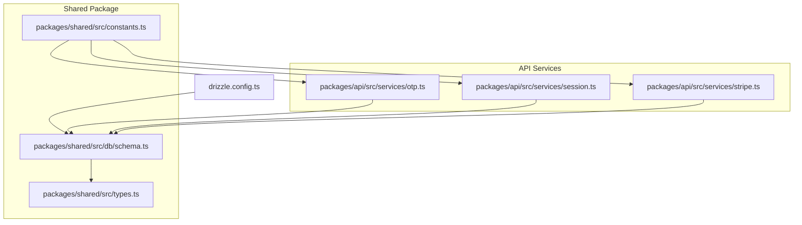
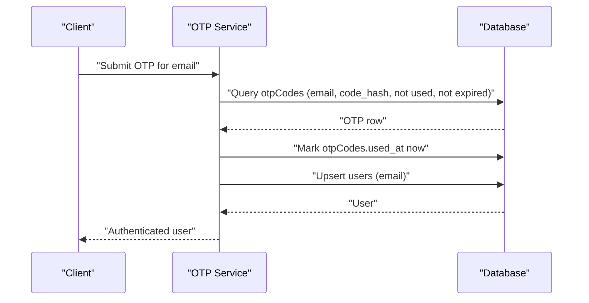
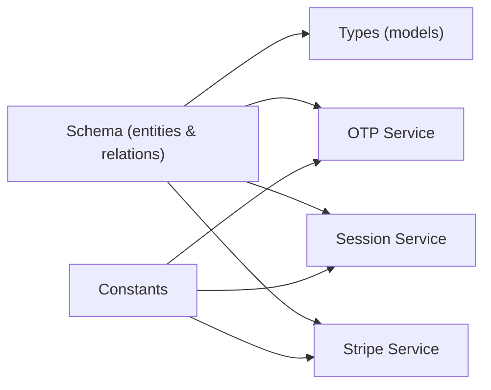

# Entity Relationships

<cite>
**Referenced Files in This Document**
- [drizzle.config.ts](file://drizzle.config.ts)
- [schema.ts](file://packages/shared/src/db/schema.ts)
- [types.ts](file://packages/shared/src/types.ts)
- [constants.ts](file://packages/shared/src/constants.ts)
- [otp.ts](file://packages/api/src/services/otp.ts)
- [session.ts](file://packages/api/src/services/session.ts)
- [stripe.ts](file://packages/api/src/services/stripe.ts)
- [2026-03-07-day1-foundation.md](file://docs/plans/2026-03-07-day1-foundation.md)
</cite>

## Table of Contents
1. [Introduction](#introduction)
2. [Project Structure](#project-structure)
3. [Core Components](#core-components)
4. [Architecture Overview](#architecture-overview)
5. [Detailed Component Analysis](#detailed-component-analysis)
6. [Dependency Analysis](#dependency-analysis)
7. [Performance Considerations](#performance-considerations)
8. [Troubleshooting Guide](#troubleshooting-guide)
9. [Conclusion](#conclusion)

## Introduction
This document describes the entity relationship model for SparkClaw’s database schema. It focuses on:
- Why each user has exactly one subscription and one instance (1:1 relationships)
- How users can have multiple OTP codes and sessions (1:N relationships)
- Business logic behind these relationships and their role in authentication and provisioning
- Drizzle ORM relations configuration, foreign key mappings, and referential integrity
- Data consistency guarantees and anomaly prevention

## Project Structure
The database schema and related configuration live in the shared package and are orchestrated via Drizzle Kit.



**Diagram sources**
- [drizzle.config.ts](file://drizzle.config.ts#L1-L13)
- [schema.ts](file://packages/shared/src/db/schema.ts#L1-L146)
- [types.ts](file://packages/shared/src/types.ts#L1-L55)
- [constants.ts](file://packages/shared/src/constants.ts#L1-L28)
- [otp.ts](file://packages/api/src/services/otp.ts#L1-L59)
- [session.ts](file://packages/api/src/services/session.ts#L1-L43)
- [stripe.ts](file://packages/api/src/services/stripe.ts#L1-L107)

**Section sources**
- [drizzle.config.ts](file://drizzle.config.ts#L1-L13)
- [schema.ts](file://packages/shared/src/db/schema.ts#L1-L146)
- [types.ts](file://packages/shared/src/types.ts#L1-L55)
- [constants.ts](file://packages/shared/src/constants.ts#L1-L28)

## Core Components
- users: Core identity entity with unique email and timestamps.
- subscriptions: Per-user subscription record with Stripe identifiers and status.
- instances: Per-user compute instance linked to a single subscription.
- otpCodes: One-time passcodes used for authentication; multiple per user.
- sessions: User sessions keyed by token; multiple per user.

Key constraints:
- users.email is unique.
- subscriptions.userId is unique and references users.id.
- instances.subscriptionId is unique and references subscriptions.id; instances.userId references users.id.
- sessions.userId references users.id and token is unique.

These constraints enforce:
- Exactly one subscription per user (1:1 participation on users)
- Exactly one instance per user (1:1 participation on users)
- Multiple OTP codes and sessions per user (1:N participation on users)

**Section sources**
- [schema.ts](file://packages/shared/src/db/schema.ts#L14-L19)
- [schema.ts](file://packages/shared/src/db/schema.ts#L71-L96)
- [schema.ts](file://packages/shared/src/db/schema.ts#L105-L137)
- [schema.ts](file://packages/shared/src/db/schema.ts#L30-L44)
- [schema.ts](file://packages/shared/src/db/schema.ts#L48-L63)

## Architecture Overview
The schema enforces strong referential integrity and aligns with business workflows:
- Authentication uses OTP codes (temporary credentials) and sessions (long-lived tokens).
- Subscription management integrates with Stripe events to create/update subscriptions.
- Instance provisioning is triggered after a successful subscription creation and is uniquely bound to a subscription.

```mermaid
erDiagram
USERS {
uuid id PK
string email UK
timestamp created_at
timestamp updated_at
}
SUBSCRIPTIONS {
uuid id PK
uuid user_id UK FK
string plan
string stripe_customer_id
string stripe_subscription_id UK
string status
timestamp current_period_end
timestamp created_at
timestamp updated_at
}
INSTANCES {
uuid id PK
uuid user_id FK
uuid subscription_id UK FK
string railway_project_id
string railway_service_id
string custom_domain
text railway_url
text url
string status
string domain_status
text error_message
timestamp created_at
timestamp updated_at
}
OTP_CODES {
uuid id PK
string email
string code_hash
timestamp expires_at
timestamp used_at
timestamp created_at
}
SESSIONS {
uuid id PK
uuid user_id FK
string token UK
timestamp expires_at
timestamp created_at
}
USERS ||--o{ OTP_CODES : "has many"
USERS ||--o{ SESSIONS : "has many"
USERS ||--|| SUBSCRIPTIONS : "has one"
USERS ||--|| INSTANCES : "has one"
SUBSCRIPTIONS ||--|| INSTANCES : "has one"
```

**Diagram sources**
- [schema.ts](file://packages/shared/src/db/schema.ts#L14-L19)
- [schema.ts](file://packages/shared/src/db/schema.ts#L30-L44)
- [schema.ts](file://packages/shared/src/db/schema.ts#L48-L63)
- [schema.ts](file://packages/shared/src/db/schema.ts#L71-L96)
- [schema.ts](file://packages/shared/src/db/schema.ts#L105-L137)

## Detailed Component Analysis

### Users
- Purpose: Central identity with unique email.
- Keys and indices: id primary key; email unique; createdAt/updatedAt defaults.
- Relations: One-to-many with otpCodes and sessions; one-to-one with subscriptions and instances.

Business impact:
- Ensures single identity per email.
- Enables per-user OTP and session collections.
- Guarantees exactly one subscription and one instance per user.

**Section sources**
- [schema.ts](file://packages/shared/src/db/schema.ts#L14-L19)
- [schema.ts](file://packages/shared/src/db/schema.ts#L21-L26)

### Subscriptions
- Purpose: Tracks user billing and Stripe integration.
- Keys and indices: user_id unique FK; stripe_subscription_id unique; indexes on stripe_customer_id and status.
- Relations: One-to-one with users; one-to-one with instances.

Business impact:
- Enforces exactly one active subscription per user.
- Links instance provisioning to a single subscription.
- Supports Stripe webhook-driven lifecycle updates.

**Section sources**
- [schema.ts](file://packages/shared/src/db/schema.ts#L71-L96)
- [schema.ts](file://packages/shared/src/db/schema.ts#L98-L101)

### Instances
- Purpose: User’s compute instance with deployment metadata and status.
- Keys and indices: user_id FK; subscription_id unique FK; custom_domain unique; indexes on status and domain_status.
- Relations: Many-to-one with users; many-to-one with subscriptions.

Business impact:
- Guarantees exactly one instance per user via unique FK on subscriptionId.
- Prevents orphaned instances by requiring a valid subscription link.
- Supports domain provisioning and status tracking.

**Section sources**
- [schema.ts](file://packages/shared/src/db/schema.ts#L105-L137)
- [schema.ts](file://packages/shared/src/db/schema.ts#L139-L145)

### OTP Codes
- Purpose: Temporary authentication codes with expiry and usage tracking.
- Keys and indices: email and expires_at indexes; used_at nullable to mark consumption.
- Relations: Many-to-one with users via email.

Business impact:
- Supports rate limits and expiry-based security.
- Allows multiple OTP attempts per user within time windows.
- Prevents reuse via used_at timestamp.

**Section sources**
- [schema.ts](file://packages/shared/src/db/schema.ts#L30-L44)
- [constants.ts](file://packages/shared/src/constants.ts#L16-L21)
- [otp.ts](file://packages/api/src/services/otp.ts#L1-L59)

### Sessions
- Purpose: Long-lived authenticated sessions keyed by token.
- Keys and indices: token unique; indexes on token and user_id.
- Relations: Many-to-one with users via user_id.

Business impact:
- Provides persistent user sessions with expiry.
- Token uniqueness prevents conflicts.
- Supports logout and session verification.

**Section sources**
- [schema.ts](file://packages/shared/src/db/schema.ts#L48-L63)
- [constants.ts](file://packages/shared/src/constants.ts#L22-L23)
- [session.ts](file://packages/api/src/services/session.ts#L1-L43)

### Drizzle ORM Relations Configuration
- users relations: otpCodes (many), sessions (many), subscription (one), instance (one)
- subscriptions relations: user (one), instance (one)
- instances relations: user (one), subscription (one)
- sessions relations: user (one)

Foreign key mappings:
- sessions.userId → users.id
- subscriptions.userId → users.id
- instances.userId → users.id
- instances.subscriptionId → subscriptions.id

Cascade behaviors:
- No explicit ON DELETE CASCADE is declared in the schema. Deletion order must respect referential integrity:
  - Delete sessions and otpCodes for a user before deleting the user
  - Delete instances before deleting subscriptions
  - Delete subscriptions before deleting users

**Section sources**
- [schema.ts](file://packages/shared/src/db/schema.ts#L21-L26)
- [schema.ts](file://packages/shared/src/db/schema.ts#L65-L67)
- [schema.ts](file://packages/shared/src/db/schema.ts#L98-L101)
- [schema.ts](file://packages/shared/src/db/schema.ts#L139-L145)

### Authentication Workflows and Business Logic
- OTP-based login:
  - OTP codes are created with expiry and hashed values.
  - Verification checks expiry, un-used status, and matches email/code hash.
  - On success, marks OTP as used and ensures a user record exists.
- Session management:
  - Creates session tokens with expiry and stores them in DB.
  - Verifies sessions by token and expiry, returning the associated user.
- Subscription and instance provisioning:
  - Stripe checkout completion creates a subscription record.
  - Instance provisioning is triggered asynchronously and links to the new subscription.
  - Stripe subscription updates/cancellations update subscription status and suspend the instance accordingly.



**Diagram sources**
- [otp.ts](file://packages/api/src/services/otp.ts#L27-L58)
- [schema.ts](file://packages/shared/src/db/schema.ts#L30-L44)
- [schema.ts](file://packages/shared/src/db/schema.ts#L14-L19)

**Section sources**
- [otp.ts](file://packages/api/src/services/otp.ts#L1-L59)
- [session.ts](file://packages/api/src/services/session.ts#L1-L43)
- [stripe.ts](file://packages/api/src/services/stripe.ts#L45-L106)
- [constants.ts](file://packages/shared/src/constants.ts#L16-L23)

## Dependency Analysis
- Schema defines entities and constraints.
- Types provide compile-time safety for select/insert models.
- Services depend on schema for queries and mutations.
- Constants configure timing and limits for OTP, sessions, and provisioning.



**Diagram sources**
- [schema.ts](file://packages/shared/src/db/schema.ts#L1-L146)
- [types.ts](file://packages/shared/src/types.ts#L1-L55)
- [constants.ts](file://packages/shared/src/constants.ts#L1-L28)
- [otp.ts](file://packages/api/src/services/otp.ts#L1-L59)
- [session.ts](file://packages/api/src/services/session.ts#L1-L43)
- [stripe.ts](file://packages/api/src/services/stripe.ts#L1-L107)

**Section sources**
- [schema.ts](file://packages/shared/src/db/schema.ts#L1-L146)
- [types.ts](file://packages/shared/src/types.ts#L1-L55)
- [constants.ts](file://packages/shared/src/constants.ts#L1-L28)
- [otp.ts](file://packages/api/src/services/otp.ts#L1-L59)
- [session.ts](file://packages/api/src/services/session.ts#L1-L43)
- [stripe.ts](file://packages/api/src/services/stripe.ts#L1-L107)

## Performance Considerations
- Indexes on frequently queried columns:
  - otpCodes: email, expires_at
  - sessions: token, user_id
  - subscriptions: stripe_customer_id, unique user_id, unique stripe_subscription_id
  - instances: user_id, unique subscription_id, status, custom_domain, domain_status
- Unique constraints:
  - Prevent duplicate subscriptions and instances per user.
  - Ensure session token uniqueness for fast lookup.
- Time-based operations:
  - OTP expiry and session expiry enable periodic cleanup.
  - Stripe event-driven updates minimize polling.

[No sources needed since this section provides general guidance]

## Troubleshooting Guide
Common issues and resolutions:
- Duplicate subscription or instance errors:
  - Cause: Attempting to insert without respecting unique constraints.
  - Resolution: Ensure per-user uniqueness checks before inserts; handle upserts for subscriptions and instances.
- Session verification failures:
  - Cause: Expired or missing token; missing user association.
  - Resolution: Verify token expiry and existence; ensure sessions.userId references existing users.
- OTP verification failures:
  - Cause: Expired, used, or mismatched code; rate limit exceeded.
  - Resolution: Enforce expiry and usedAt checks; apply rate limiting around OTP generation and verification.
- Stripe webhook handling:
  - Cause: Missing or invalid metadata; subscription not found.
  - Resolution: Validate webhook signatures; ensure metadata presence and handle updates/cancellations consistently.

**Section sources**
- [schema.ts](file://packages/shared/src/db/schema.ts#L71-L96)
- [schema.ts](file://packages/shared/src/db/schema.ts#L105-L137)
- [schema.ts](file://packages/shared/src/db/schema.ts#L48-L63)
- [schema.ts](file://packages/shared/src/db/schema.ts#L30-L44)
- [session.ts](file://packages/api/src/services/session.ts#L23-L38)
- [otp.ts](file://packages/api/src/services/otp.ts#L27-L58)
- [stripe.ts](file://packages/api/src/services/stripe.ts#L45-L106)

## Conclusion
The SparkClaw schema enforces precise cardinalities:
- 1:1 between users and subscriptions, and users and instances, ensuring a clean per-user billing and compute model.
- 1:N between users and both OTP codes and sessions, enabling secure, scalable authentication workflows.

Drizzle ORM relations and explicit foreign keys with unique constraints guarantee referential integrity. Business logic—OTP verification, session management, and Stripe-driven subscription provisioning—aligns tightly with these relationships to maintain data consistency and prevent anomalies.