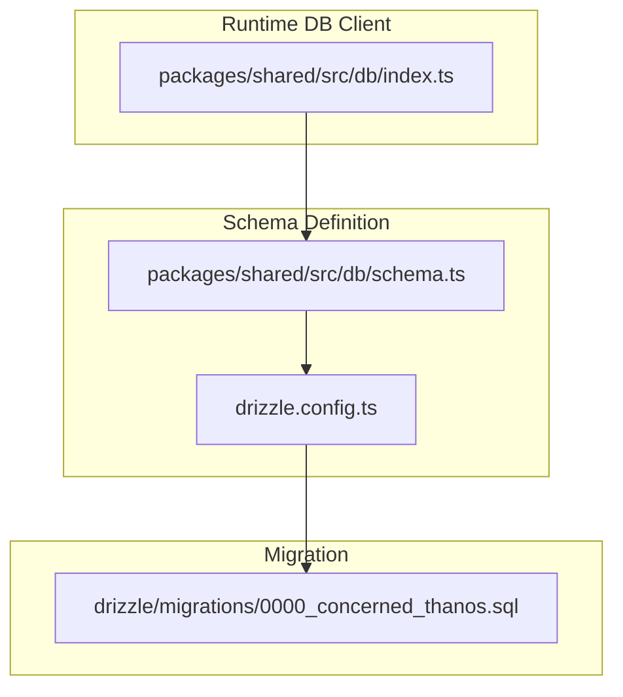
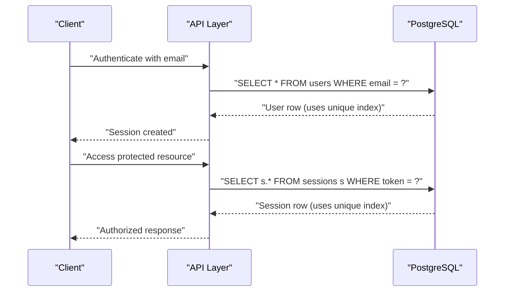
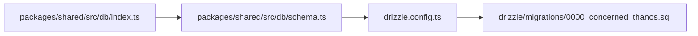

# Indexes and Constraints

<cite>
**Referenced Files in This Document**
- [drizzle.config.ts](file://drizzle.config.ts)
- [schema.ts](file://packages/shared/src/db/schema.ts)
- [index.ts](file://packages/shared/src/db/index.ts)
- [0000_concerned_thanos.sql](file://drizzle/migrations/0000_concerned_thanos.sql)
- [PRD.md](file://PRD.md)
- [otp.ts](file://packages/api/src/services/otp.ts)
- [auth.ts](file://docs/plans/2026-03-07-day1-foundation.md)
</cite>

## Table of Contents
1. [Introduction](#introduction)
2. [Project Structure](#project-structure)
3. [Core Components](#core-components)
4. [Architecture Overview](#architecture-overview)
5. [Detailed Component Analysis](#detailed-component-analysis)
6. [Dependency Analysis](#dependency-analysis)
7. [Performance Considerations](#performance-considerations)
8. [Troubleshooting Guide](#troubleshooting-guide)
9. [Conclusion](#conclusion)

## Introduction
This document details the PostgreSQL indexing and constraint strategy used in SparkClaw’s schema. It focuses on:
- Unique indexes and unique constraints for email, Stripe identifiers, and subscription/instance uniqueness
- Functional index patterns for OTP cleanup and status filtering
- Foreign key constraints enforcing referential integrity
- Check constraints and validation rules
- Performance implications, query optimization benefits, and maintenance considerations
- Index usage patterns for authentication, subscription lookup, and instance status filtering

## Project Structure
The schema is defined using Drizzle ORM with a PostgreSQL dialect and deployed via Neon. The schema definition and migration files establish the tables, indexes, and constraints.



**Diagram sources**
- [schema.ts](file://packages/shared/src/db/schema.ts#L1-L146)
- [drizzle.config.ts](file://drizzle.config.ts#L1-L13)
- [0000_concerned_thanos.sql](file://drizzle/migrations/0000_concerned_thanos.sql#L1-L73)
- [index.ts](file://packages/shared/src/db/index.ts#L1-L26)

**Section sources**
- [drizzle.config.ts](file://drizzle.config.ts#L1-L13)
- [schema.ts](file://packages/shared/src/db/schema.ts#L1-L146)
- [0000_concerned_thanos.sql](file://drizzle/migrations/0000_concerned_thanos.sql#L1-L73)
- [index.ts](file://packages/shared/src/db/index.ts#L1-L26)

## Core Components
- users: primary table for user identity with a unique email
- otp_codes: OTP lifecycle with expiration and usage tracking
- sessions: session management with unique token and expiry
- subscriptions: Stripe billing linkage with unique user and unique Stripe identifiers
- instances: managed instance provisioning with unique subscription and status tracking

Key constraints and indexes:
- Unique indexes/constraints on email, user_id, stripe_subscription_id, subscription_id
- Functional-like index patterns on expires_at for OTP cleanup and status for filtering
- Foreign keys from sessions, subscriptions, and instances to users
- Check constraints on enumerated statuses and plans

**Section sources**
- [schema.ts](file://packages/shared/src/db/schema.ts#L14-L146)
- [0000_concerned_thanos.sql](file://drizzle/migrations/0000_concerned_thanos.sql#L1-L73)
- [PRD.md](file://PRD.md#L422-L506)

## Architecture Overview
The schema enforces referential integrity and uniqueness across users, sessions, subscriptions, and instances. Indexes optimize common query patterns for authentication, subscription lookup, and instance status filtering.

```mermaid
erDiagram
USERS {
uuid id PK
varchar email UK
timestamptz created_at
timestamptz updated_at
}
SESSIONS {
uuid id PK
uuid user_id FK
varchar token UK
timestamptz expires_at
timestamptz created_at
}
SUBSCRIPTIONS {
uuid id PK
uuid user_id UK FK
varchar plan
varchar stripe_customer_id
varchar stripe_subscription_id UK
varchar status
timestamptz current_period_end
timestamptz created_at
timestamptz updated_at
}
INSTANCES {
uuid id PK
uuid user_id FK
uuid subscription_id UK FK
varchar railway_project_id
varchar railway_service_id
text url
varchar status
text error_message
timestamptz created_at
timestamptz updated_at
}
USERS ||--o{ SESSIONS : "has"
USERS ||--|| SUBSCRIPTIONS : "has"
USERS ||--o{ INSTANCES : "has"
SUBSCRIPTIONS ||--|| INSTANCES : "maps to"
```

**Diagram sources**
- [schema.ts](file://packages/shared/src/db/schema.ts#L14-L146)
- [0000_concerned_thanos.sql](file://drizzle/migrations/0000_concerned_thanos.sql#L1-L73)

## Detailed Component Analysis

### Users
- Unique index on email ensures no duplicate emails
- UUID primary key supports scalable joins and anonymized IDs
- Timestamps track creation and updates

Indexing strategy:
- Unique index on email for fast lookups and uniqueness enforcement

Performance implications:
- Email-based authentication and user discovery benefit from O(log n) index scans
- Minimal write overhead due to unique constraint checks

Maintenance considerations:
- Adding secondary indexes should be evaluated against write amplification

**Section sources**
- [schema.ts](file://packages/shared/src/db/schema.ts#L14-L19)
- [0000_concerned_thanos.sql](file://drizzle/migrations/0000_concerned_thanos.sql#L50-L56)

### OTP Codes
- Stores hashed OTP codes with expiration and usage timestamps
- Supports OTP cleanup via expires_at

Indexing strategy:
- Index on email for OTP retrieval and rate limiting
- Index on expires_at for efficient cleanup operations

Functional index pattern:
- Composite index on (email, expires_at) optimizes OTP verification and cleanup scans

Performance implications:
- OTP verification queries filter by email, code hash, expiry, and unused flag
- Cleanup scans can efficiently target expired rows using expires_at index

Maintenance considerations:
- Periodic cleanup jobs can leverage expires_at index to scan and remove expired rows
- Consider partitioning or retention policies for very large OTP tables

**Section sources**
- [schema.ts](file://packages/shared/src/db/schema.ts#L30-L44)
- [0000_concerned_thanos.sql](file://drizzle/migrations/0000_concerned_thanos.sql#L18-L25)
- [otp.ts](file://packages/api/src/services/otp.ts#L27-L45)

### Sessions
- Unique token per session with expiry
- Foreign key to users

Indexing strategy:
- Unique index on token for fast session lookup
- Index on user_id for reverse lookup and reporting

Performance implications:
- Session validation reads by token are O(log n)
- User-centric session queries benefit from user_id index

Maintenance considerations:
- Regular cleanup of expired sessions improves index selectivity
- Consider background jobs to remove expired sessions

**Section sources**
- [schema.ts](file://packages/shared/src/db/schema.ts#L48-L67)
- [0000_concerned_thanos.sql](file://drizzle/migrations/0000_concerned_thanos.sql#L27-L34)

### Subscriptions
- One-to-one relationship with users enforced by unique user_id
- Stripe identifiers stored for external reconciliation
- Enumerated plan and status fields with check constraints

Indexing strategy:
- Unique index on user_id for 1:1 lookup
- Index on stripe_customer_id for Stripe reconciliation
- Unique index on stripe_subscription_id for deduplication
- Index on status for filtering active/canceled/past_due

Performance implications:
- Subscription lookup by user is O(log n) with unique index
- Stripe reconciliation queries benefit from stripe_customer_id index
- Filtering by status leverages status index

Maintenance considerations:
- Keep stripe identifiers synchronized with Stripe
- Monitor status transitions for accurate reporting

**Section sources**
- [schema.ts](file://packages/shared/src/db/schema.ts#L71-L101)
- [0000_concerned_thanos.sql](file://drizzle/migrations/0000_concerned_thanos.sql#L36-L48)

### Instances
- One-to-one relationship with subscriptions enforced by unique subscription_id
- Status tracking with enumerated values and optional custom domain
- Foreign key to users

Indexing strategy:
- Index on user_id for user-centric queries
- Unique index on subscription_id for 1:1 mapping
- Index on status for filtering provisioning and operational views
- Unique index on custom_domain to prevent duplicates
- Index on domain_status for domain provisioning workflows

Performance implications:
- Instance lookup by user is O(log n)
- Unique subscription_id enables fast join to subscription details
- Status filtering supports operational dashboards and automation

Maintenance considerations:
- Domain provisioning workflows rely on custom_domain and domain_status indexes
- Consider archiving old instances to maintain index efficiency

**Section sources**
- [schema.ts](file://packages/shared/src/db/schema.ts#L105-L145)
- [0000_concerned_thanos.sql](file://drizzle/migrations/0000_concerned_thanos.sql#L1-L16)

### Constraints and Validation Rules
- Unique constraints:
  - users.email
  - subscriptions.user_id
  - subscriptions.stripe_subscription_id
  - instances.subscription_id
  - instances.custom_domain
- Foreign keys:
  - instances.user_id → users.id
  - instances.subscription_id → subscriptions.id
  - sessions.user_id → users.id
  - subscriptions.user_id → users.id
- Check constraints:
  - subscriptions.plan ∈ {starter, pro, scale}
  - subscriptions.status ∈ {active, canceled, past_due}
  - instances.status ∈ {pending, ready, error, suspended}
  - otp_codes.status fields constrained by application logic (not explicit SQL CHECK)

Validation benefits:
- Enforce business rules at the database level
- Prevent inconsistent states and data anomalies

**Section sources**
- [schema.ts](file://packages/shared/src/db/schema.ts#L14-L146)
- [0000_concerned_thanos.sql](file://drizzle/migrations/0000_concerned_thanos.sql#L1-L73)
- [PRD.md](file://PRD.md#L473-L504)

## Architecture Overview

### Index Usage Patterns in Queries
Common query patterns and recommended indexes:
- Authentication
  - Lookup user by email: use unique index on users.email
  - Validate session by token: use unique index on sessions.token
- Subscription lookup
  - Find subscription by user: use unique index on subscriptions.user_id
  - Stripe reconciliation: use index on subscriptions.stripe_customer_id
  - Filter by status: use index on subscriptions.status
- Instance status filtering
  - Find instance by user: use index on instances.user_id
  - Filter by status: use index on instances.status
  - Domain provisioning: use unique index on instances.custom_domain and index on instances.domain_status



**Diagram sources**
- [schema.ts](file://packages/shared/src/db/schema.ts#L14-L67)
- [0000_concerned_thanos.sql](file://drizzle/migrations/0000_concerned_thanos.sql#L50-L73)

## Dependency Analysis



**Diagram sources**
- [schema.ts](file://packages/shared/src/db/schema.ts#L1-L146)
- [drizzle.config.ts](file://drizzle.config.ts#L1-L13)
- [0000_concerned_thanos.sql](file://drizzle/migrations/0000_concerned_thanos.sql#L1-L73)
- [index.ts](file://packages/shared/src/db/index.ts#L1-L26)

**Section sources**
- [schema.ts](file://packages/shared/src/db/schema.ts#L1-L146)
- [drizzle.config.ts](file://drizzle.config.ts#L1-L13)
- [0000_concerned_thanos.sql](file://drizzle/migrations/0000_concerned_thanos.sql#L1-L73)
- [index.ts](file://packages/shared/src/db/index.ts#L1-L26)

## Performance Considerations
- Index selection
  - Unique indexes on high-selectivity columns (email, tokens, Stripe IDs) minimize write overhead while enabling fast lookups
  - Composite indexes on (email, expires_at) optimize OTP verification and cleanup scans
- Write amplification
  - Unique constraints add modest write cost; acceptable given the correctness guarantees
- Maintenance
  - Periodic vacuum/analyze keeps statistics fresh for query planner
  - Consider partitioning or retention policies for otp_codes and instances to manage growth
- Query optimization benefits
  - Authentication: O(log n) lookups by email/token
  - Subscription management: O(log n) user and Stripe lookups, efficient status filtering
  - Instance operations: O(log n) user and status filtering, unique domain enforcement

[No sources needed since this section provides general guidance]

## Troubleshooting Guide
- Duplicate email/session token errors
  - Symptom: unique constraint violation when inserting users or sessions
  - Resolution: ensure uniqueness is enforced at application level before insert
- Expired OTP cleanup inefficiency
  - Symptom: slow cleanup scans
  - Resolution: leverage expires_at index; consider background job scheduling
- Subscription reconciliation delays
  - Symptom: slow Stripe ID lookups
  - Resolution: ensure stripe_customer_id index is present and maintained
- Instance status reporting lag
  - Symptom: slow status filtering
  - Resolution: confirm instances.status index is used by query plans

**Section sources**
- [schema.ts](file://packages/shared/src/db/schema.ts#L14-L146)
- [0000_concerned_thanos.sql](file://drizzle/migrations/0000_concerned_thanos.sql#L1-L73)
- [otp.ts](file://packages/api/src/services/otp.ts#L27-L45)

## Conclusion
The SparkClaw schema employs targeted unique indexes and foreign keys to enforce strong referential integrity and optimize common query patterns. Unique indexes on email, tokens, and Stripe identifiers enable fast authentication and reconciliation. Functional-like indexes on expires_at and status fields support efficient OTP cleanup and operational filtering. Together, these indexes and constraints provide a robust foundation for performance and data integrity.