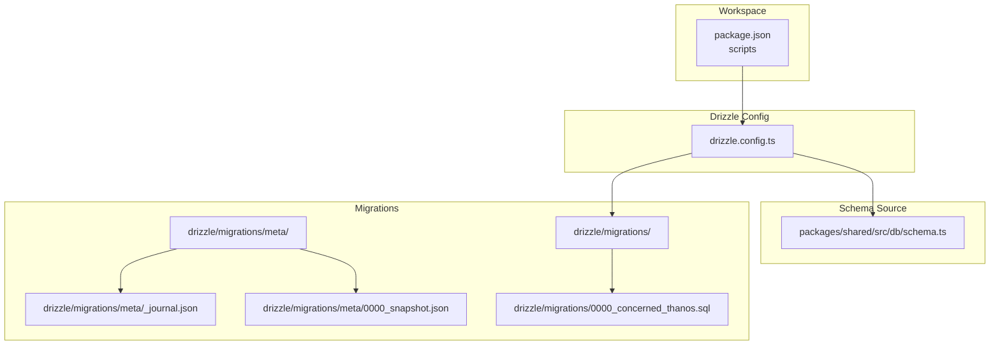
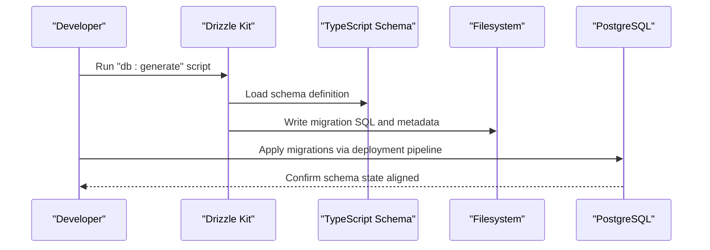
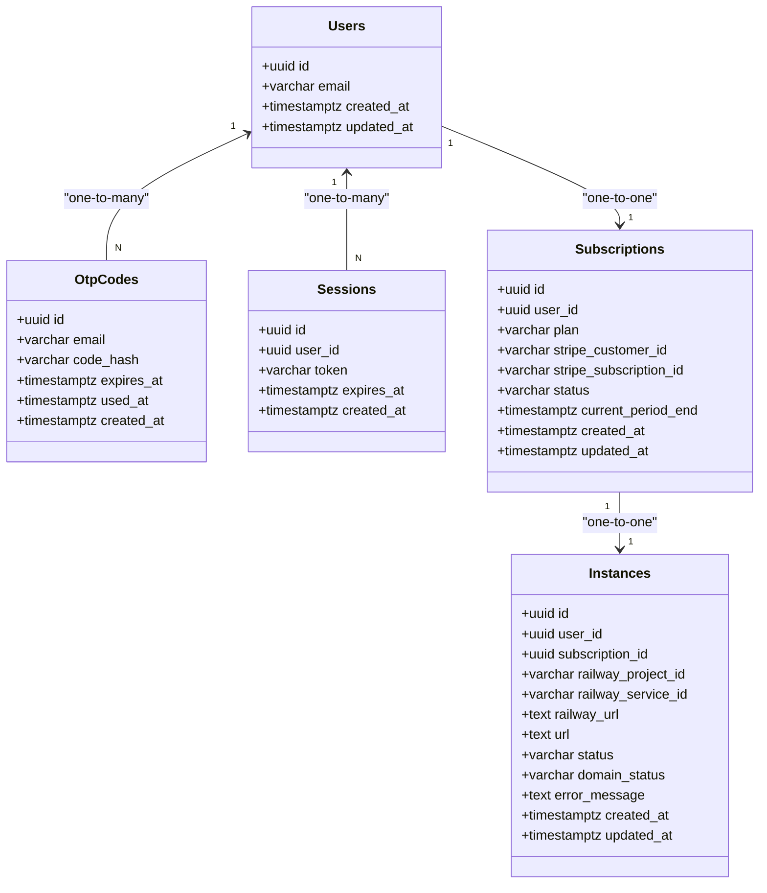
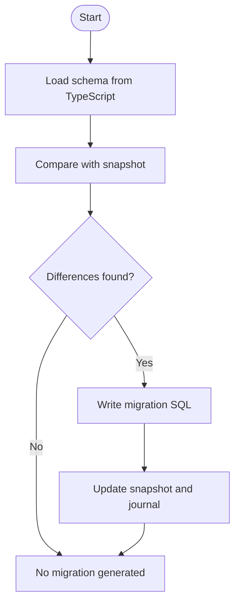
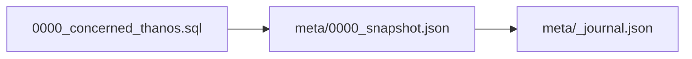
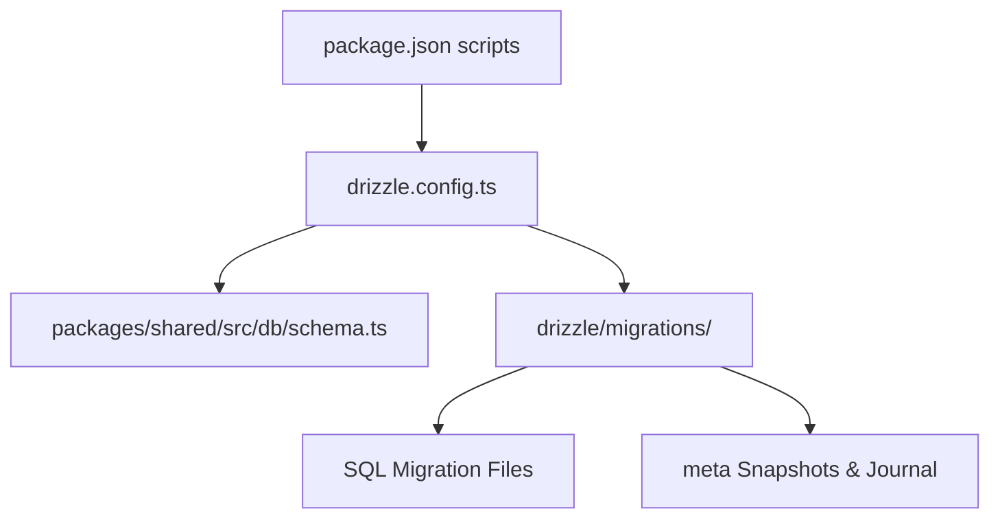

# Migration Management

<cite>
**Referenced Files in This Document**
- [drizzle.config.ts](file://drizzle.config.ts)
- [package.json](file://package.json)
- [schema.ts](file://packages/shared/src/db/schema.ts)
- [index.ts](file://packages/shared/src/db/index.ts)
- [0000_concerned_thanos.sql](file://drizzle/migrations/0000_concerned_thanos.sql)
- [0000_snapshot.json](file://drizzle/migrations/meta/0000_snapshot.json)
- [_journal.json](file://drizzle/migrations/meta/_journal.json)
- [PRD.md](file://PRD.md)
</cite>

## Table of Contents
1. [Introduction](#introduction)
2. [Project Structure](#project-structure)
3. [Core Components](#core-components)
4. [Architecture Overview](#architecture-overview)
5. [Detailed Component Analysis](#detailed-component-analysis)
6. [Dependency Analysis](#dependency-analysis)
7. [Performance Considerations](#performance-considerations)
8. [Troubleshooting Guide](#troubleshooting-guide)
9. [Conclusion](#conclusion)
10. [Appendices](#appendices)

## Introduction
This document explains SparkClaw’s database schema evolution and migration management using Drizzle ORM. It covers Drizzle Kit configuration, schema-first development with TypeScript definitions, migration generation and deployment workflows, migration file structure and naming conventions, rollback and version management, and best practices for safe schema changes and production deployments.

## Project Structure
SparkClaw organizes migration assets and schema definitions as follows:
- Drizzle configuration defines the schema source, output directory, dialect, credentials, and strictness.
- The schema is authored in a single TypeScript module under the shared package.
- Migrations are generated into a dedicated folder and tracked with metadata snapshots and a journal.
- Scripts in the workspace package.json orchestrate generation and migration execution.

**Diagram sources**
- [drizzle.config.ts](file://drizzle.config.ts#L1-L13)
- [schema.ts](file://packages/shared/src/db/schema.ts#L1-L146)
- [0000_concerned_thanos.sql](file://drizzle/migrations/0000_concerned_thanos.sql#L1-L73)
- [0000_snapshot.json](file://drizzle/migrations/meta/0000_snapshot.json#L1-L598)
- [_journal.json](file://drizzle/migrations/meta/_journal.json#L1-L13)

**Section sources**
- [drizzle.config.ts](file://drizzle.config.ts#L1-L13)
- [package.json](file://package.json#L1-L23)
- [schema.ts](file://packages/shared/src/db/schema.ts#L1-L146)
- [0000_concerned_thanos.sql](file://drizzle/migrations/0000_concerned_thanos.sql#L1-L73)
- [0000_snapshot.json](file://drizzle/migrations/meta/0000_snapshot.json#L1-L598)
- [_journal.json](file://drizzle/migrations/meta/_journal.json#L1-L13)

## Core Components
- Drizzle Kit configuration
  - Defines the schema source path, output directory, PostgreSQL dialect, credential URL from environment, and strict/verbose modes.
- Schema definitions
  - A single TypeScript module exports Drizzle tables and relations for users, OTP codes, sessions, subscriptions, and instances.
- Database client
  - A proxy-based client initializes a Drizzle connection using Neon HTTP driver and the schema namespace.
- Migration artifacts
  - Generated SQL files, snapshot metadata, and journal entries track applied migrations and schema state.

**Section sources**
- [drizzle.config.ts](file://drizzle.config.ts#L1-L13)
- [schema.ts](file://packages/shared/src/db/schema.ts#L1-L146)
- [index.ts](file://packages/shared/src/db/index.ts#L1-L26)
- [0000_concerned_thanos.sql](file://drizzle/migrations/0000_concerned_thanos.sql#L1-L73)
- [0000_snapshot.json](file://drizzle/migrations/meta/0000_snapshot.json#L1-L598)
- [_journal.json](file://drizzle/migrations/meta/_journal.json#L1-L13)

## Architecture Overview
The migration lifecycle integrates schema-first development with Drizzle Kit and a runtime database client.

**Diagram sources**
- [package.json](file://package.json#L9-L11)
- [drizzle.config.ts](file://drizzle.config.ts#L1-L13)
- [schema.ts](file://packages/shared/src/db/schema.ts#L1-L146)

## Detailed Component Analysis

### Drizzle ORM Configuration
- Location: drizzle.config.ts
- Purpose: Centralized configuration for Drizzle Kit to generate migrations from the schema.
- Key settings:
  - schema: path to the TypeScript schema module.
  - out: output directory for generated migrations.
  - dialect: PostgreSQL.
  - dbCredentials.url: reads DATABASE_URL from environment.
  - strict and verbose: enable strict schema validation and detailed logs.

Best practices:
- Keep DATABASE_URL consistent across environments.
- Use strict mode to catch schema mismatches early.
- Review verbose logs during CI to detect unexpected schema changes.

**Section sources**
- [drizzle.config.ts](file://drizzle.config.ts#L1-L13)

### Schema-First Development with TypeScript
- Location: packages/shared/src/db/schema.ts
- Approach:
  - Define tables and relations using Drizzle ORM primitives.
  - Export relations to support joins and referential integrity.
  - Indexes and constraints are declared alongside table definitions.
- Benefits:
  - Strong typing for queries.
  - Automatic SQL generation for migrations.
  - Centralized ownership of schema definitions.

**Diagram sources**
- [schema.ts](file://packages/shared/src/db/schema.ts#L1-L146)

**Section sources**
- [schema.ts](file://packages/shared/src/db/schema.ts#L1-L146)

### Migration Generation Workflow
- Command: npm script invokes Drizzle Kit to generate migrations.
- Steps:
  - Drizzle Kit loads the schema module.
  - Compares against the last snapshot.
  - Writes a new migration SQL file and updates metadata.

**Diagram sources**
- [drizzle.config.ts](file://drizzle.config.ts#L1-L13)
- [0000_snapshot.json](file://drizzle/migrations/meta/0000_snapshot.json#L1-L598)
- [_journal.json](file://drizzle/migrations/meta/_journal.json#L1-L13)

**Section sources**
- [package.json](file://package.json#L9-L11)
- [drizzle.config.ts](file://drizzle.config.ts#L1-L13)
- [0000_snapshot.json](file://drizzle/migrations/meta/0000_snapshot.json#L1-L598)
- [_journal.json](file://drizzle/migrations/meta/_journal.json#L1-L13)

### Migration Deployment Strategy
- Local development:
  - Use Drizzle Kit studio to preview schema state.
- Production:
  - Apply generated migrations to the target PostgreSQL database.
  - Ensure DATABASE_URL points to the correct environment.
- Notes:
  - The repository also documents Cloudflare D1 usage in PRD and historical tasks. For PostgreSQL via Neon, follow the Drizzle Kit workflow described here.

**Section sources**
- [package.json](file://package.json#L11-L11)
- [drizzle.config.ts](file://drizzle.config.ts#L7-L9)
- [PRD.md](file://PRD.md#L422-L507)

### Migration File Structure and Naming Conventions
- Directory: drizzle/migrations
- Files:
  - SQL migration: sequential numeric prefix followed by a descriptive tag (e.g., 0000_concerned_thanos.sql).
  - Snapshot: meta/0000_snapshot.json tracks the latest schema state.
  - Journal: meta/_journal.json records applied migrations and timestamps.
- Behavior:
  - Drizzle Kit generates a new numbered migration when schema changes are detected.
  - The journal ensures idempotent application and prevents re-applying the same migration.

**Diagram sources**
- [0000_concerned_thanos.sql](file://drizzle/migrations/0000_concerned_thanos.sql#L1-L73)
- [0000_snapshot.json](file://drizzle/migrations/meta/0000_snapshot.json#L1-L598)
- [_journal.json](file://drizzle/migrations/meta/_journal.json#L1-L13)

**Section sources**
- [0000_concerned_thanos.sql](file://drizzle/migrations/0000_concerned_thanos.sql#L1-L73)
- [0000_snapshot.json](file://drizzle/migrations/meta/0000_snapshot.json#L1-L598)
- [_journal.json](file://drizzle/migrations/meta/_journal.json#L1-L13)

### Rollback Procedures and Version Management
- Drizzle Kit supports applying and rolling back migrations. Typical steps:
  - Review the journal to identify the last applied migration.
  - Use Drizzle Kit commands to migrate down to the desired version.
  - Re-apply forward if necessary.
- Best practices:
  - Always backup the database before major rollbacks.
  - Test rollback scripts in a staging environment mirroring production.
  - Keep the schema change history visible via the journal and snapshots.

**Section sources**
- [_journal.json](file://drizzle/migrations/meta/_journal.json#L1-L13)
- [0000_snapshot.json](file://drizzle/migrations/meta/0000_snapshot.json#L1-L598)

### Safe Schema Changes and Testing
- Guidelines:
  - Prefer additive-only changes when possible (add columns, indexes, tables).
  - Use nullable defaults for new columns; populate later with data migrations.
  - Avoid destructive operations (drop columns/tables) in production without careful planning.
- Testing:
  - Run schema generation locally and review diffs.
  - Apply migrations to a local Postgres instance or staging environment.
  - Validate queries and relations against the new schema.
- Backward compatibility:
  - Maintain stable primary keys and unique identifiers.
  - Preserve foreign key relationships and indexes referenced by application code.

[No sources needed since this section provides general guidance]

### Common Migration Scenarios and Patterns
- Add a new table:
  - Extend the schema module with a new table and relations.
  - Generate and apply migrations; verify indexes and constraints.
- Add a column to an existing table:
  - Add the column with appropriate defaults and constraints.
  - Generate and apply migrations; consider data migration if needed.
- Add an index:
  - Declare the index in the table definition.
  - Generate and apply migrations; monitor long-running index builds on large tables.
- Rename or drop a column:
  - Plan carefully; often requires a two-phase migration (add new, copy data, switch, drop old).
  - Use Drizzle Kit’s diff to confirm the intended change.

**Section sources**
- [schema.ts](file://packages/shared/src/db/schema.ts#L1-L146)
- [drizzle.config.ts](file://drizzle.config.ts#L1-L13)

## Dependency Analysis
The migration system depends on:
- Drizzle Kit for generating SQL from schema definitions.
- The schema module for authoritative table and relation definitions.
- Environment configuration for database connectivity.
- Filesystem for storing migrations and metadata.

**Diagram sources**
- [drizzle.config.ts](file://drizzle.config.ts#L1-L13)
- [schema.ts](file://packages/shared/src/db/schema.ts#L1-L146)
- [package.json](file://package.json#L9-L11)

**Section sources**
- [drizzle.config.ts](file://drizzle.config.ts#L1-L13)
- [schema.ts](file://packages/shared/src/db/schema.ts#L1-L146)
- [package.json](file://package.json#L9-L11)

## Performance Considerations
- Large table rebuilds:
  - Adding unique constraints or indexes on large tables can be expensive; schedule during maintenance windows.
- Transaction boundaries:
  - Split large migrations into smaller, atomic steps to reduce lock contention.
- Monitoring:
  - Track migration duration and failures; ensure rollback paths are fast and safe.

[No sources needed since this section provides general guidance]

## Troubleshooting Guide
- DATABASE_URL missing:
  - Ensure the environment variable is set before running migration commands.
- Conflicts with existing migrations:
  - Reset local state by dropping and recreating the database, then re-apply from the initial migration.
- Drift between schema and database:
  - Re-generate migrations from the current schema and re-apply to align state.
- Verifying applied migrations:
  - Inspect the journal and snapshot to confirm the last applied migration and schema state.

**Section sources**
- [drizzle.config.ts](file://drizzle.config.ts#L7-L9)
- [_journal.json](file://drizzle/migrations/meta/_journal.json#L1-L13)
- [0000_snapshot.json](file://drizzle/migrations/meta/0000_snapshot.json#L1-L598)

## Conclusion
SparkClaw’s migration management centers on a schema-first approach using Drizzle ORM. The Drizzle Kit configuration, TypeScript schema definitions, and generated SQL migrations form a robust pipeline for evolving the database safely. By following the documented workflows, naming conventions, and best practices, teams can maintain a reliable and auditable schema evolution process across environments.

## Appendices

### Appendix A: Drizzle Kit Commands
- Generate migrations: run the workspace script to invoke Drizzle Kit.
- Studio: inspect schema state locally.
- Migration execution: apply generated migrations to the target database.

**Section sources**
- [package.json](file://package.json#L9-L11)

### Appendix B: Data Model Overview
- The PRD outlines the entity-relationship model and constraints for users, subscriptions, instances, sessions, and OTP codes.

**Section sources**
- [PRD.md](file://PRD.md#L422-L507)