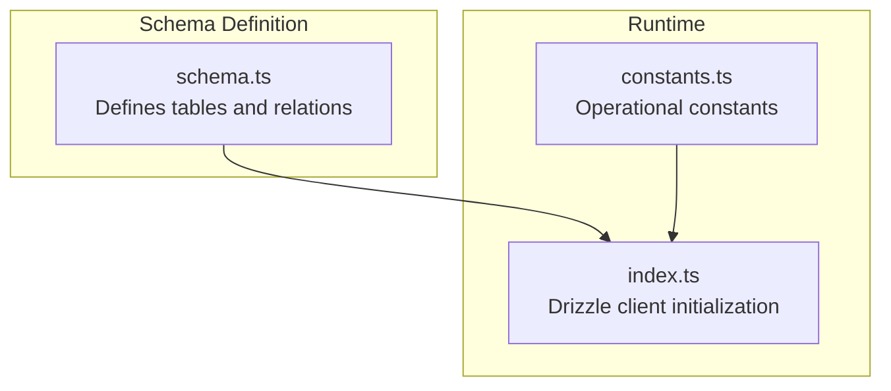
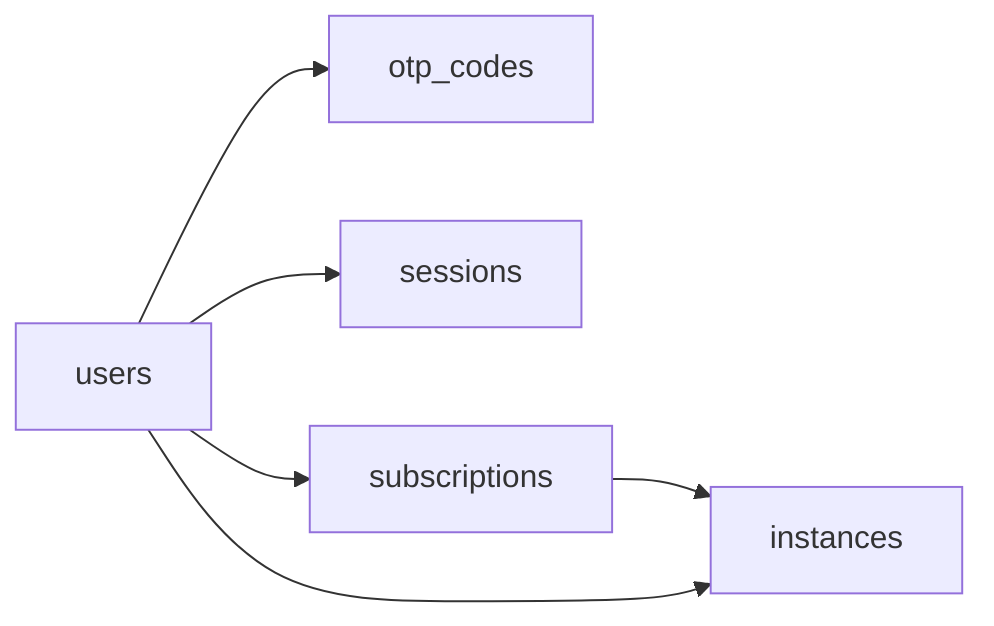

# Table Schemas

<cite>
**Referenced Files in This Document**
- [schema.ts](file://packages/shared/src/db/schema.ts)
- [constants.ts](file://packages/shared/src/constants.ts)
- [index.ts](file://packages/shared/src/db/index.ts)
- [otp.ts](file://packages/api/src/services/otp.ts)
- [webhooks.ts](file://packages/api/src/routes/webhooks.ts)
- [PRD.md](file://PRD.md)
</cite>

## Table of Contents
1. [Introduction](#introduction)
2. [Project Structure](#project-structure)
3. [Core Components](#core-components)
4. [Architecture Overview](#architecture-overview)
5. [Detailed Component Analysis](#detailed-component-analysis)
6. [Dependency Analysis](#dependency-analysis)
7. [Performance Considerations](#performance-considerations)
8. [Troubleshooting Guide](#troubleshooting-guide)
9. [Conclusion](#conclusion)

## Introduction
This document provides comprehensive table schema documentation for the SparkClaw PostgreSQL database. It covers the users, otp_codes, sessions, subscriptions, and instances tables, detailing field definitions, data types, constraints, defaults, indexes, and the business significance of each field within the system’s authentication, billing, and instance provisioning workflows.

## Project Structure
The database schema is defined using Drizzle ORM with PostgreSQL dialect. The schema file defines all tables and their relationships, while constants define operational parameters such as OTP expiry and session duration. The database client is initialized via a Neon HTTP adapter.



**Diagram sources**
- [schema.ts](file://packages/shared/src/db/schema.ts#L1-L146)
- [index.ts](file://packages/shared/src/db/index.ts#L1-L25)
- [constants.ts](file://packages/shared/src/constants.ts#L1-L28)

**Section sources**
- [schema.ts](file://packages/shared/src/db/schema.ts#L1-L146)
- [index.ts](file://packages/shared/src/db/index.ts#L1-L25)
- [constants.ts](file://packages/shared/src/constants.ts#L1-L28)

## Core Components
- users: Stores user accounts with UUID primary key, unique email, and timestamps for creation/update.
- otp_codes: Stores hashed OTP codes with expiration and usage tracking, indexed for efficient lookups.
- sessions: Manages secure user sessions with unique tokens, foreign key to users, and expiration handling.
- subscriptions: Integrates with Stripe, tracks plan, customer, and subscription identifiers, and maintains status.
- instances: Tracks Railway deployments, URLs, statuses, and error messages, linked to users and subscriptions.

**Section sources**
- [schema.ts](file://packages/shared/src/db/schema.ts#L14-L19)
- [schema.ts](file://packages/shared/src/db/schema.ts#L30-L44)
- [schema.ts](file://packages/shared/src/db/schema.ts#L48-L67)
- [schema.ts](file://packages/shared/src/db/schema.ts#L71-L96)
- [schema.ts](file://packages/shared/src/db/schema.ts#L105-L145)

## Architecture Overview
The schema enforces referential integrity and indexes critical lookup paths. OTP verification relies on hashed codes stored in otp_codes. Sessions link to users and expire after a fixed period. Subscriptions integrate with Stripe and uniquely map to users. Instances track Railway deployments and expose public URLs.

```mermaid
erDiagram
USERS {
uuid id PK
varchar email UK
timestamptz created_at
timestamptz updated_at
}
OTP_CODES {
uuid id PK
varchar email
varchar code_hash
timestamptz expires_at
timestamptz used_at
timestamptz created_at
}
SESSIONS {
uuid id PK
uuid user_id FK
varchar token UK
timestamptz expires_at
timestamptz created_at
}
SUBSCRIPTIONS {
uuid id PK
uuid user_id UK FK
varchar plan
varchar stripe_customer_id
varchar stripe_subscription_id UK
varchar status
timestamptz current_period_end
timestamptz created_at
timestamptz updated_at
}
INSTANCES {
uuid id PK
uuid user_id FK
uuid subscription_id UK FK
varchar railway_project_id
varchar railway_service_id
text custom_domain
text railway_url
text url
varchar status
varchar domain_status
text error_message
timestamptz created_at
timestamptz updated_at
}
USERS ||--o{ OTP_CODES : "has"
USERS ||--o{ SESSIONS : "has"
USERS ||--|| SUBSCRIPTIONS : "has"
USERS ||--o{ INSTANCES : "has"
SUBSCRIPTIONS ||--|| INSTANCES : "has"
```

**Diagram sources**
- [schema.ts](file://packages/shared/src/db/schema.ts#L14-L145)

## Detailed Component Analysis

### users
- Purpose: Central identity store for all users.
- Fields:
  - id: UUID primary key, generated randomly.
  - email: Unique, non-null email address.
  - created_at: Timestamp with timezone, default now.
  - updated_at: Timestamp with timezone, default now.
- Constraints and defaults:
  - Primary key on id.
  - Unique constraint on email.
  - Default values for timestamps.
- Business significance:
  - Forms the foundation for authentication and session management.
  - Links to otp_codes, sessions, subscriptions, and instances.
- Indexes:
  - Implicit primary key index on id.
  - Unique index on email enforced by constraint.

**Section sources**
- [schema.ts](file://packages/shared/src/db/schema.ts#L14-L19)
- [schema.ts](file://packages/shared/src/db/schema.ts#L21-L26)

### otp_codes
- Purpose: Securely stores OTP hashes with expiration and usage tracking.
- Fields:
  - id: UUID primary key, generated randomly.
  - email: Non-null email associated with the OTP.
  - code_hash: Non-null SHA-256 hash of the OTP code.
  - expires_at: Non-null timestamp indicating expiry.
  - used_at: Nullable timestamp marking when the OTP was used.
  - created_at: Timestamp with timezone, default now.
- Constraints and defaults:
  - Primary key on id.
  - Not-null constraints on email, code_hash, expires_at.
  - Default for created_at.
- Validation and behavior:
  - OTPs are 6-digit numeric codes hashed with SHA-256 before storage.
  - Expiration controlled by OTP_EXPIRY_MS constant.
  - Once verified, the record is marked used to prevent reuse.
- Indexes:
  - Index on email for fast lookups by email.
  - Index on expires_at to efficiently purge expired records.
- Business significance:
  - Enables secure email-based authentication without storing plaintext codes.
  - Supports rate limiting and usage tracking.

**Section sources**
- [schema.ts](file://packages/shared/src/db/schema.ts#L30-L44)
- [otp.ts](file://packages/api/src/services/otp.ts#L1-L58)
- [constants.ts](file://packages/shared/src/constants.ts#L16-L20)

### sessions
- Purpose: Manages user sessions with secure token-based authentication.
- Fields:
  - id: UUID primary key, generated randomly.
  - user_id: Non-null foreign key to users.id.
  - token: Unique, non-null session token.
  - expires_at: Non-null timestamp indicating session expiry.
  - created_at: Timestamp with timezone, default now.
- Constraints and defaults:
  - Primary key on id.
  - Foreign key constraint on user_id referencing users.id.
  - Unique constraint on token.
  - Not-null constraints on user_id, token, expires_at.
  - Default for created_at.
- Validation and behavior:
  - Sessions expire after a fixed period defined by SESSION_EXPIRY_MS.
  - Tokens are unique to prevent token collisions.
- Indexes:
  - Index on token for fast lookup by token.
  - Index on user_id for efficient reverse lookup.
- Business significance:
  - Provides secure, stateless session management.
  - Ensures session isolation per user.

**Section sources**
- [schema.ts](file://packages/shared/src/db/schema.ts#L48-L67)
- [constants.ts](file://packages/shared/src/constants.ts#L22-L23)

### subscriptions
- Purpose: Integrates with Stripe to manage user billing plans and statuses.
- Fields:
  - id: UUID primary key, generated randomly.
  - user_id: Non-null unique foreign key to users.id.
  - plan: Non-null plan identifier (starter/pro/scale).
  - stripe_customer_id: Non-null Stripe customer identifier.
  - stripe_subscription_id: Non-null unique Stripe subscription identifier.
  - status: Non-null status (active/canceled/past_due).
  - current_period_end: Nullable timestamp indicating end of current billing period.
  - created_at: Timestamp with timezone, default now.
  - updated_at: Timestamp with timezone, default now.
- Constraints and defaults:
  - Primary key on id.
  - Unique constraint on user_id (ensuring one subscription per user).
  - Foreign key constraint on user_id referencing users.id.
  - Unique constraint on stripe_subscription_id.
  - Not-null constraints on plan, stripe_customer_id, stripe_subscription_id, status.
  - Defaults for timestamps.
- Validation and behavior:
  - Stripe webhook handlers update plan, status, and period end.
  - Uniqueness ensures no duplicate Stripe subscriptions per user.
- Indexes:
  - Unique index on user_id.
  - Index on stripe_customer_id for Stripe lookups.
  - Unique index on stripe_subscription_id.
- Business significance:
  - Centralizes billing state and Stripe integration.
  - Links to instances for deployment management.

**Section sources**
- [schema.ts](file://packages/shared/src/db/schema.ts#L71-L96)
- [webhooks.ts](file://packages/api/src/routes/webhooks.ts#L1-L48)
- [PRD.md](file://PRD.md#L100-L130)

### instances
- Purpose: Tracks Railway deployments for user OpenClaw instances.
- Fields:
  - id: UUID primary key, generated randomly.
  - user_id: Non-null foreign key to users.id.
  - subscription_id: Non-null unique foreign key to subscriptions.id.
  - railway_project_id: Non-null Railway project identifier.
  - railway_service_id: Nullable Railway service identifier.
  - custom_domain: Nullable user-facing custom domain.
  - railway_url: Nullable internal Railway URL.
  - url: Nullable public URL pointing to custom domain.
  - status: Non-null status (pending/ready/error/suspended).
  - domain_status: Nullable domain provisioning status with default pending.
  - error_message: Nullable error message for failed deployments.
  - created_at: Timestamp with timezone, default now.
  - updated_at: Timestamp with timezone, default now.
- Constraints and defaults:
  - Primary key on id.
  - Foreign key constraints on user_id and subscription_id.
  - Unique constraint on subscription_id linking to subscriptions.
  - Not-null constraints on user_id, railway_project_id, status.
  - Defaults for timestamps and domain_status.
- Validation and behavior:
  - Status transitions occur during provisioning and maintenance.
  - Domain provisioning tracked separately from instance status.
  - Error messages capture deployment failures.
- Indexes:
  - Index on user_id for user-scoped queries.
  - Unique index on subscription_id.
  - Index on status for filtering by lifecycle state.
  - Unique index on custom_domain to prevent duplicates.
  - Index on domain_status for domain provisioning tracking.
- Business significance:
  - Maps users to their deployed OpenClaw instances.
  - Exposes URLs for user onboarding and setup.

**Section sources**
- [schema.ts](file://packages/shared/src/db/schema.ts#L105-L145)

## Dependency Analysis
- users is the central hub for all other tables.
- sessions depends on users via user_id.
- subscriptions depends on users via user_id and uniquely links to instances.
- instances depends on users and subscriptions, ensuring one instance per subscription.
- otp_codes does not depend on other tables but is used by the authentication flow.



**Diagram sources**
- [schema.ts](file://packages/shared/src/db/schema.ts#L14-L145)

**Section sources**
- [schema.ts](file://packages/shared/src/db/schema.ts#L14-L145)

## Performance Considerations
- Indexes on frequently queried columns (token, user_id, expires_at, stripe identifiers, status, custom_domain) improve lookup performance.
- Unique constraints prevent duplicates and reduce write conflicts.
- Default timestamps minimize application-side computation.
- OTP and session expiry constants enable predictable cleanup and rotation strategies.

[No sources needed since this section provides general guidance]

## Troubleshooting Guide
- OTP verification fails:
  - Ensure code_hash matches stored hash and expires_at is in the future.
  - Confirm used_at is null to prevent reuse.
  - Check rate limits for send and verify windows.
- Session lookup fails:
  - Verify token uniqueness and non-expired expires_at.
  - Confirm user_id references a valid user.
- Subscription updates:
  - Validate Stripe webhook signatures and idempotency.
  - Ensure unique constraints on stripe identifiers remain intact.
- Instance provisioning:
  - Monitor status transitions and error_message for failures.
  - Check domain_status and custom_domain uniqueness.

**Section sources**
- [otp.ts](file://packages/api/src/services/otp.ts#L27-L58)
- [constants.ts](file://packages/shared/src/constants.ts#L16-L27)
- [webhooks.ts](file://packages/api/src/routes/webhooks.ts#L1-L48)

## Conclusion
The SparkClaw database schema is designed around secure authentication, Stripe billing integration, and automated instance provisioning. Each table’s constraints, indexes, and defaults align with the product’s workflows, ensuring reliability, scalability, and maintainability.