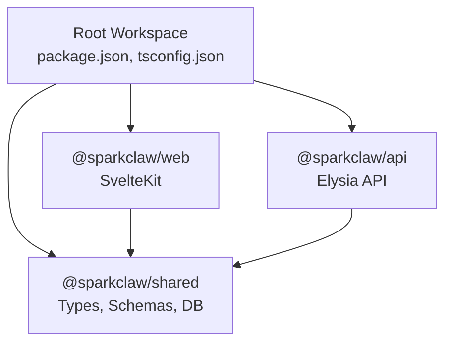
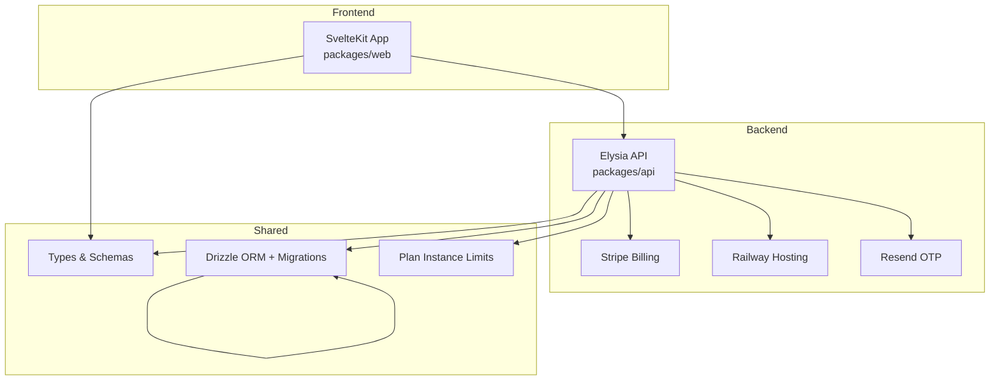
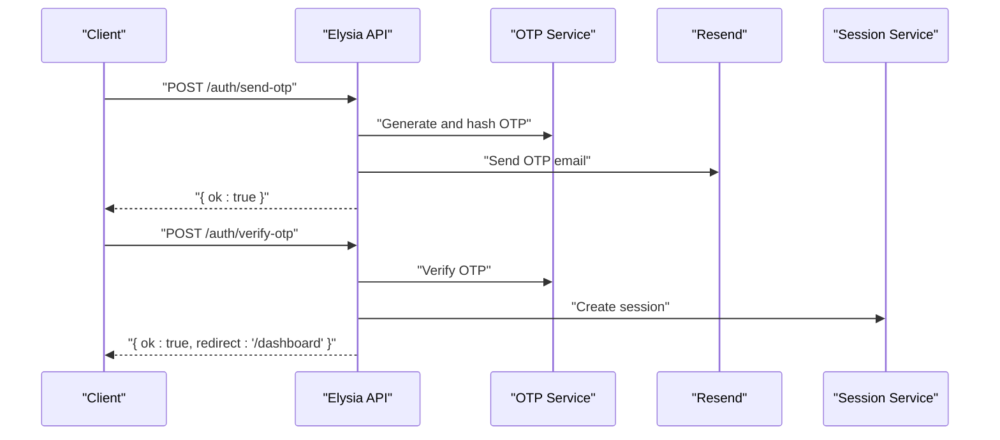
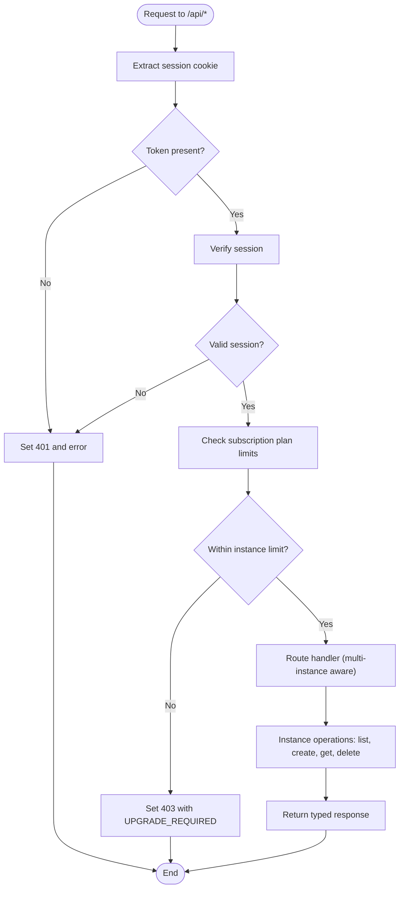
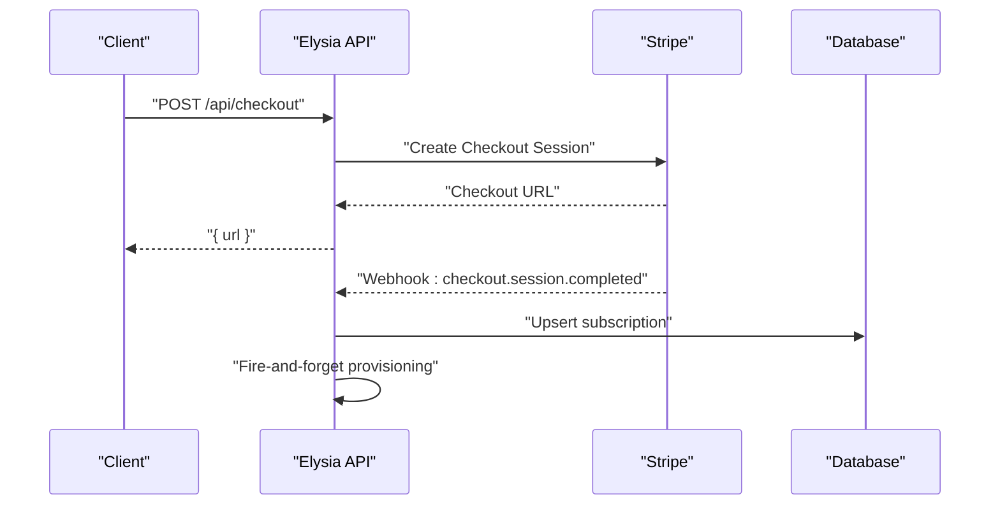
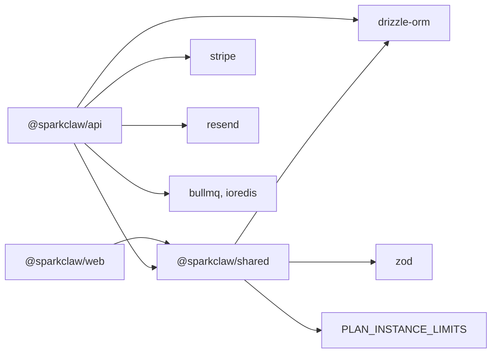

# Development Guidelines

<cite>
**Referenced Files in This Document**
- [package.json](file://package.json)
- [tsconfig.json](file://tsconfig.json)
- [drizzle.config.ts](file://drizzle.config.ts)
- [PRD.md](file://PRD.md)
- [packages/api/package.json](file://packages/api/package.json)
- [packages/web/package.json](file://packages/web/package.json)
- [packages/shared/package.json](file://packages/shared/package.json)
- [packages/api/src/index.ts](file://packages/api/src/index.ts)
- [packages/api/src/routes/auth.ts](file://packages/api/src/routes/auth.ts)
- [packages/api/src/routes/api.ts](file://packages/api/src/routes/api.ts)
- [packages/api/src/routes/setup.ts](file://packages/api/src/routes/setup.ts)
- [packages/api/src/services/stripe.ts](file://packages/api/src/services/stripe.ts)
- [packages/shared/src/types.ts](file://packages/shared/src/types.ts)
- [packages/shared/src/schemas.ts](file://packages/shared/src/schemas.ts)
- [packages/shared/src/db/schema.ts](file://packages/shared/src/db/schema.ts)
- [docs/plans/2026-03-09-multi-instance-design.md](file://docs/plans/2026-03-09-multi-instance-design.md)
- [docs/plans/2026-03-09-multi-instance-plan.md](file://docs/plans/2026-03-09-multi-instance-plan.md)
</cite>

## Update Summary
**Changes Made**
- Added comprehensive multi-instance architecture support documentation
- Updated API routes section to reflect new multi-instance endpoints
- Enhanced database schema documentation with multi-instance relationship changes
- Added new sections for instance management workflows and limits
- Updated testing strategies to cover multi-instance scenarios
- Expanded deployment procedures for multi-instance provisioning
- Added monitoring and observability considerations for multi-instance scaling

## Table of Contents
1. [Introduction](#introduction)
2. [Project Structure](#project-structure)
3. [Core Components](#core-components)
4. [Architecture Overview](#architecture-overview)
5. [Detailed Component Analysis](#detailed-component-analysis)
6. [Dependency Analysis](#dependency-analysis)
7. [Performance Considerations](#performance-considerations)
8. [Testing Strategies](#testing-strategies)
9. [Development Workflow](#development-workflow)
10. [Environment Configuration Management](#environment-configuration-management)
11. [Deployment Procedures](#deployment-procedures)
12. [Monitoring and Observability](#monitoring-and-observability)
13. [Security Best Practices](#security-best-practices)
14. [Accessibility Guidelines](#accessibility-guidelines)
15. [Extending the System](#extending-the-system)
16. [Troubleshooting Guide](#troubleshooting-guide)
17. [Conclusion](#conclusion)

## Introduction
This document provides comprehensive development guidelines for contributors working on the SparkClaw project. It consolidates code style standards, testing strategies, development workflow, environment configuration, deployment procedures, monitoring and observability, performance optimization, security, accessibility, extension practices, and troubleshooting. The guidelines are grounded in the repository's configuration and implementation files to ensure consistency and clarity for both new and experienced contributors.

**Updated** The document now reflects the transition to a multi-instance architecture, supporting multiple OpenClaw instances per user based on subscription plan limits.

## Project Structure
SparkClaw is a Bun workspace monorepo composed of three packages:
- packages/web: SvelteKit-based frontend (SSR/static supported) with multi-instance dashboard
- packages/api: Elysia-based backend API with Stripe, Railway, and OTP services
- packages/shared: Shared types, Zod schemas, constants, and Drizzle database definitions



**Diagram sources**
- [package.json](file://package.json#L1-L27)
- [packages/web/package.json](file://packages/web/package.json#L1-L31)
- [packages/api/package.json](file://packages/api/package.json#L1-L30)
- [packages/shared/package.json](file://packages/shared/package.json#L1-L27)

**Section sources**
- [package.json](file://package.json#L1-L27)
- [tsconfig.json](file://tsconfig.json#L1-L22)

## Core Components
- TypeScript configuration enforces strictness, ESNext module resolution, declaration outputs, source maps, and bundler-friendly settings.
- Bun workspaces enable unified scripts for development, building, database migrations, and type checking across packages.
- Drizzle ORM with schema-first migrations underpins database operations and schema evolution.

Key implementation highlights:
- API entry initializes CORS, health check, and mounts route modules.
- Authentication routes implement OTP send/verify with rate limiting and session creation.
- Protected API routes enforce session verification and return typed responses.
- Stripe service constructs events, creates checkout sessions, and handles subscription lifecycle events.
- Shared types and schemas define domain models and request/response validation.
- Multi-instance architecture supports 1 user = N instances (limited by plan: Starter=1, Pro=3, Scale=10).

**Updated** Multi-instance support includes new API endpoints for instance management, plan-based instance limits, and enhanced dashboard functionality.

**Section sources**
- [tsconfig.json](file://tsconfig.json#L1-L22)
- [package.json](file://package.json#L5-L16)
- [drizzle.config.ts](file://drizzle.config.ts#L1-L13)
- [packages/api/src/index.ts](file://packages/api/src/index.ts#L1-L78)
- [packages/api/src/routes/auth.ts](file://packages/api/src/routes/auth.ts#L1-L80)
- [packages/api/src/routes/api.ts](file://packages/api/src/routes/api.ts#L1-L587)
- [packages/api/src/routes/setup.ts](file://packages/api/src/routes/setup.ts#L1-L800)
- [packages/api/src/services/stripe.ts](file://packages/api/src/services/stripe.ts#L1-L107)
- [packages/shared/src/types.ts](file://packages/shared/src/types.ts#L1-L311)
- [packages/shared/src/schemas.ts](file://packages/shared/src/schemas.ts#L1-L214)
- [packages/shared/src/db/schema.ts](file://packages/shared/src/db/schema.ts#L114-L187)
- [docs/plans/2026-03-09-multi-instance-design.md](file://docs/plans/2026-03-09-multi-instance-design.md#L1-L98)

## Architecture Overview
The system follows a clear separation of concerns with enhanced multi-instance support:
- Frontend (SvelteKit) serves landing, pricing, auth, and multi-instance dashboard pages.
- Backend (Elysia) exposes REST endpoints and webhook handlers for multi-instance management.
- Shared package centralizes types, schemas, and database definitions with multi-instance relationships.
- Stripe manages billing; Railway provisions OpenClaw instances; Resend sends OTP emails.



**Diagram sources**
- [PRD.md](file://PRD.md#L193-L247)
- [packages/api/src/index.ts](file://packages/api/src/index.ts#L1-L78)
- [packages/api/src/services/stripe.ts](file://packages/api/src/services/stripe.ts#L1-L107)
- [drizzle.config.ts](file://drizzle.config.ts#L1-L13)
- [docs/plans/2026-03-09-multi-instance-design.md](file://docs/plans/2026-03-09-multi-instance-design.md#L1-L98)

## Detailed Component Analysis

### TypeScript Configuration and Code Style Standards
- Compiler options emphasize strictness, ESNext modules, bundler-friendly resolution, isolated modules, verbatim module syntax, declarations, source maps, and explicit output directory.
- Exclude patterns avoid bundling node_modules, dist, and SvelteKit-specific output directories.
- Root workspace scripts orchestrate development, builds, type checks, tests, and database tasks.

Recommended practices derived from configuration:
- Maintain strict typing across packages.
- Prefer ESNext modules and bundler-friendly settings.
- Keep type generation and source maps enabled for debugging.
- Use consistent output directories and exclude patterns across packages.

**Section sources**
- [tsconfig.json](file://tsconfig.json#L1-L22)
- [package.json](file://package.json#L5-L16)

### Authentication Flow (Email OTP)
The authentication flow integrates rate limiting, OTP hashing, email delivery, and session management.



**Diagram sources**
- [packages/api/src/routes/auth.ts](file://packages/api/src/routes/auth.ts#L1-L80)
- [packages/api/src/services/stripe.ts](file://packages/api/src/services/stripe.ts#L1-L107)

**Section sources**
- [packages/api/src/routes/auth.ts](file://packages/api/src/routes/auth.ts#L1-L80)

### Multi-Instance API Routes and Instance Management
Enhanced API routes now support multi-instance operations with plan-based limits and instance-specific endpoints.



**Diagram sources**
- [packages/api/src/routes/api.ts](file://packages/api/src/routes/api.ts#L422-L587)
- [packages/api/src/routes/setup.ts](file://packages/api/src/routes/setup.ts#L635-L800)

**Section sources**
- [packages/api/src/routes/api.ts](file://packages/api/src/routes/api.ts#L422-L587)
- [packages/api/src/routes/setup.ts](file://packages/api/src/routes/setup.ts#L635-L800)

### Stripe Checkout and Webhook Handling
Stripe integration manages checkout sessions and webhook events to synchronize subscriptions and trigger provisioning.



**Diagram sources**
- [packages/api/src/services/stripe.ts](file://packages/api/src/services/stripe.ts#L1-L107)

**Section sources**
- [packages/api/src/services/stripe.ts](file://packages/api/src/services/stripe.ts#L1-L107)

### Shared Types and Schemas with Multi-Instance Support
Enhanced shared types define domain models with multi-instance relationships and plan-based limits.

```mermaid
classDiagram
class User {
+string id
+string email
+datetime created_at
}
class Subscription {
+string id
+string user_id
+string plan
+string stripe_customer_id
+string stripe_subscription_id
+string status
+datetime current_period_end
}
class Instance {
+string id
+string user_id
+string subscription_id
+string railway_project_id
+string? railway_service_id
+string? url
+string status
+string? instance_name
}
class PlanLimits {
+number starter = 1
+number pro = 3
+number scale = 10
}
User ||--|| Subscription : "1 : 1"
Subscription ||--o{ Instance : "1 : N"
PlanLimits --> Subscription : "limits by plan"
```

**Diagram sources**
- [packages/shared/src/types.ts](file://packages/shared/src/types.ts#L81-L175)
- [packages/shared/src/db/schema.ts](file://packages/shared/src/db/schema.ts#L114-L187)
- [docs/plans/2026-03-09-multi-instance-design.md](file://docs/plans/2026-03-09-multi-instance-design.md#L20-L26)

**Section sources**
- [packages/shared/src/types.ts](file://packages/shared/src/types.ts#L81-L175)
- [packages/shared/src/schemas.ts](file://packages/shared/src/schemas.ts#L22-L24)
- [packages/shared/src/db/schema.ts](file://packages/shared/src/db/schema.ts#L114-L187)
- [docs/plans/2026-03-09-multi-instance-design.md](file://docs/plans/2026-03-09-multi-instance-design.md#L1-L98)

### Database Schema Evolution for Multi-Instance
Database schema now supports multiple instances per user with plan-based limits and enhanced relationships.

**Updated** Key schema changes include:
- Removed unique constraints from instances.userId and instances.subscriptionId
- Added plan-based instance limits in shared constants
- Enhanced relationships for multi-instance support
- Added instanceName field for user-friendly instance identification

**Section sources**
- [packages/shared/src/db/schema.ts](file://packages/shared/src/db/schema.ts#L114-L187)
- [docs/plans/2026-03-09-multi-instance-design.md](file://docs/plans/2026-03-09-multi-instance-design.md#L12-L32)

## Dependency Analysis
Workspace dependencies and external libraries:
- packages/web depends on SvelteKit, adapter-auto, Tailwind, and shared package.
- packages/api depends on Elysia, CORS plugin, Stripe, Resend, Drizzle ORM, Neon driver, shared package, BullMQ, and ioredis.
- packages/shared depends on Drizzle ORM, Neon driver, and Zod.



**Diagram sources**
- [packages/web/package.json](file://packages/web/package.json#L1-L31)
- [packages/api/package.json](file://packages/api/package.json#L1-L30)
- [packages/shared/package.json](file://packages/shared/package.json#L1-L27)
- [docs/plans/2026-03-09-multi-instance-design.md](file://docs/plans/2026-03-09-multi-instance-design.md#L20-L26)

**Section sources**
- [packages/web/package.json](file://packages/web/package.json#L1-L31)
- [packages/api/package.json](file://packages/api/package.json#L1-L30)
- [packages/shared/package.json](file://packages/shared/package.json#L1-L27)

## Performance Considerations
- Frontend performance targets include fast landing page load and responsive API responses.
- Backend should aim for sub-200ms p95 read responses and sub-500ms p95 write responses.
- OTP delivery should be consistently fast to ensure smooth onboarding.
- Provisioning time should remain under five minutes for scalability.
- Multi-instance operations should scale linearly with instance count.

Recommendations:
- Optimize database queries with appropriate indexes and joins.
- Use connection pooling and keep-alive strategies for Neon Postgres.
- Minimize synchronous blocking operations in long-running API handlers.
- Profile frontend bundles and leverage SvelteKit's SSR/static features.
- Implement caching strategies for frequently accessed instance lists.
- Monitor queue performance for background provisioning jobs.

**Section sources**
- [PRD.md](file://PRD.md#L389-L398)
- [docs/plans/2026-03-09-multi-instance-design.md](file://docs/plans/2026-03-09-multi-instance-design.md#L8-L10)

## Testing Strategies
Current workspace scripts include:
- Running all tests recursively.
- Running tests scoped to specific packages.

**Updated** Enhanced testing strategies for multi-instance architecture:
- Unit tests for services and utilities including instance creation, limit enforcement, and multi-instance operations.
- Integration tests for route handlers validating request parsing, session verification, database interactions, and plan-based limits.
- End-to-end tests covering user flows: signup → OTP → login → choose plan → checkout → provisioning → dashboard with multiple instances.
- Multi-instance specific tests: instance creation limits, instance switching, instance deletion with cleanup.
- Load testing for concurrent instance creation and management operations.

Guidance:
- Use Bun's built-in test runner with recursive discovery.
- Mock external services (Stripe, Railway, Resend) during tests.
- Validate error handling paths, rate-limiting behavior, and plan-based restrictions.
- Ensure schema validation covers multi-instance request/response shapes.
- Test edge cases: instance limits, concurrent operations, and cleanup procedures.

**Section sources**
- [package.json](file://package.json#L13-L19)
- [docs/plans/2026-03-09-multi-instance-plan.md](file://docs/plans/2026-03-09-multi-instance-plan.md#L1-L800)

## Development Workflow
Branch management:
- Use feature branches prefixed with descriptive names (e.g., feature/auth-flow, feature/multi-instance).
- Sync with upstream regularly to minimize merge conflicts.

Pull request procedures:
- Open PRs early for visibility; mark as draft until ready for review.
- Include a summary aligned with PRD goals and acceptance criteria.
- Request reviews from maintainers; address comments promptly.

Code review processes:
- Focus on correctness, security, performance, and maintainability.
- Ensure new features align with shared types and schemas.
- Verify environment variables and secrets are not committed.
- Review multi-instance impact on existing functionality.

Local development:
- Use Bun workspaces to run frontend and backend concurrently.
- Run database migrations and schema generation as needed.
- Validate TypeScript types and lint-free builds before committing.
- Test multi-instance scenarios locally with different plan levels.

**Section sources**
- [package.json](file://package.json#L5-L16)
- [PRD.md](file://PRD.md#L697-L729)
- [docs/plans/2026-03-09-multi-instance-design.md](file://docs/plans/2026-03-09-multi-instance-design.md#L1-L98)

## Environment Configuration Management
Environment variables (as documented) include:
- DATABASE_URL: Neon Postgres connection string
- STRIPE_SECRET_KEY, STRIPE_WEBHOOK_SECRET: Stripe integration
- RAILWAY_API_TOKEN: Railway GraphQL API access
- RESEND_API_KEY: OTP email delivery
- SESSION_SECRET: Session token signing
- WEB_URL: Frontend origin for CORS
- SENTRY_DSN: Sentry error tracking
- POSTHOG_API_KEY: PostHog analytics
- REDIS_URL: Redis for BullMQ job queue (required for multi-instance provisioning)

Configuration practices:
- Store secrets in environment variables; never commit to source control.
- Define defaults and validation in shared environment validation logic.
- Use consistent naming and grouping for related variables.
- Ensure REDIS_URL is configured for production multi-instance support.

**Section sources**
- [PRD.md](file://PRD.md#L639-L651)
- [packages/api/src/index.ts](file://packages/api/src/index.ts#L24-L34)
- [docs/plans/2026-03-09-multi-instance-design.md](file://docs/plans/2026-03-09-multi-instance-design.md#L92-L98)

## Deployment Procedures
Frontend (packages/web):
- Deploy SvelteKit with adapter-auto to Vercel or Cloudflare Pages.
- Ensure SSR and static exports are configured per environment.

Backend (packages/api):
- Deploy Elysia/Bun long-running server to Railway or Fly.io.
- Configure health checks and auto-restarts.
- Ensure REDIS_URL is available for multi-instance provisioning queue.

Database:
- Use Drizzle migrations to evolve schema on Neon Postgres.
- Keep migrations deterministic and reversible where possible.
- Apply multi-instance schema changes with proper index modifications.

CI/CD and automated testing:
- Run type checks, tests, and linting in CI.
- Gate deployments on successful pipeline runs.
- Automate database migrations post-deploy.
- Test multi-instance provisioning in staging environment.

Rollback strategies:
- Maintain immutable artifacts and tagged releases.
- Use blue/green or canary deployments where feasible.
- Revert database changes with reverse migrations if necessary.
- Handle multi-instance state recovery during rollbacks.

**Section sources**
- [PRD.md](file://PRD.md#L240-L247)
- [drizzle.config.ts](file://drizzle.config.ts#L1-L13)
- [package.json](file://package.json#L9-L11)
- [packages/api/src/index.ts](file://packages/api/src/index.ts#L29-L34)

## Monitoring and Observability
Error tracking:
- Integrate Sentry for both frontend and backend to capture errors and performance metrics.

Product analytics:
- Integrate PostHog for conversion funnels, user behavior, feature flags, and session replay.

Custom logging:
- Centralize logging in services and routes for structured debugging.
- Include correlation IDs and contextual metadata in logs.
- Monitor multi-instance provisioning queue performance and error rates.

Alerting:
- Monitor API health, provisioning failures, and webhook processing.
- Alert on recurring errors, rate-limiting spikes, and downstream service degradation.
- Monitor queue backlog and processing delays for multi-instance operations.

**Section sources**
- [PRD.md](file://PRD.md#L206-L207)
- [packages/api/src/services/stripe.ts](file://packages/api/src/services/stripe.ts#L69-L71)
- [packages/api/src/index.ts](file://packages/api/src/index.ts#L26-L27)

## Security Best Practices
Transport security:
- Enforce HTTPS across all environments.

Data protection:
- Store OTPs as hashes; never persist plaintext codes.
- Protect session cookies with HTTP-only, secure, and SameSite attributes.
- Implement instance-level access controls for multi-instance data isolation.

Input validation:
- Validate all API inputs using Zod schemas.
- Enforce plan-based instance limits at API boundary.

Secrets management:
- Store all secrets in environment variables; avoid hardcoding.
- Secure instance-specific configuration data.

Webhook security:
- Verify signatures for Stripe webhooks.
- Implement idempotent handling to prevent duplicate effects.

CSRF protection:
- Apply SameSite cookies and Origin header validation for state-changing endpoints.
- Multi-instance endpoints should validate ownership before processing.

**Section sources**
- [PRD.md](file://PRD.md#L399-L411)
- [packages/api/src/routes/auth.ts](file://packages/api/src/routes/auth.ts#L10-L11)
- [packages/api/src/routes/api.ts](file://packages/api/src/routes/api.ts#L12-L12)
- [packages/shared/src/schemas.ts](file://packages/shared/src/schemas.ts#L1-L214)
- [docs/plans/2026-03-09-multi-instance-design.md](file://docs/plans/2026-03-09-multi-instance-design.md#L92-L98)

## Accessibility Guidelines
- Ensure SvelteKit pages meet WCAG guidelines for color contrast, keyboard navigation, and screen reader support.
- Provide ARIA labels and roles for interactive components.
- Test with assistive technologies and automated accessibility checks.
- Multi-instance dashboard should maintain accessibility standards across instance switching and management operations.

## Extending the System
Adding new features:
- Define new types and schemas in the shared package.
- Add route handlers and services in the API package.
- Extend frontend pages and components in the web package.
- Ensure multi-instance compatibility for new features.

Integrating additional services:
- Wrap third-party SDKs in dedicated services with clear interfaces.
- Centralize configuration and error handling.
- Consider multi-instance implications for external service integrations.

Maintaining backward compatibility:
- Version APIs carefully; introduce new endpoints rather than modifying existing ones.
- Keep shared types stable and add optional fields when evolving models.
- Provide deprecation paths for single-instance endpoints (e.g., redirect from /api/instance to /api/instances).

**Section sources**
- [packages/shared/src/types.ts](file://packages/shared/src/types.ts#L1-L311)
- [packages/shared/src/schemas.ts](file://packages/shared/src/schemas.ts#L1-L214)
- [docs/plans/2026-03-09-multi-instance-design.md](file://docs/plans/2026-03-09-multi-instance-design.md#L42-L46)

## Troubleshooting Guide
Common development issues:
- TypeScript errors: run type checks and fix strict-mode violations.
- Database connectivity: verify DATABASE_URL and network access to Neon.
- Stripe webhook verification failures: confirm webhook secret and signature headers.
- OTP delivery problems: check RESEND_API_KEY and email deliverability.
- Multi-instance provisioning failures: verify REDIS_URL and queue worker initialization.
- Instance limit enforcement errors: check PLAN_INSTANCE_LIMITS and subscription plan validation.

Debugging techniques:
- Use structured logs with contextual fields.
- Inspect rate limiter state and IP attribution for auth endpoints.
- Validate session cookie attributes and expiration.
- Monitor queue processing for background provisioning jobs.
- Debug multi-instance ownership validation and access controls.

Performance profiling:
- Profile frontend bundle sizes and hydration times.
- Measure API response latencies and database query durations.
- Monitor queue backlog and processing times for multi-instance operations.
- Analyze instance creation and deletion performance under load.

**Section sources**
- [package.json](file://package.json#L12-L12)
- [PRD.md](file://PRD.md#L639-L651)
- [packages/api/src/index.ts](file://packages/api/src/index.ts#L29-L34)

## Conclusion
These guidelines consolidate SparkClaw's development practices, ensuring consistent code quality, robust integrations, and reliable operations. The transition to multi-instance architecture enables scalable growth while maintaining system stability. By adhering to the outlined standards for TypeScript, testing, workflow, environment management, deployment, monitoring, security, and accessibility, contributors can efficiently extend the system while supporting multiple instances per user based on subscription plans.

**Updated** The guidelines now comprehensively address multi-instance development patterns, testing strategies, and deployment procedures, ensuring contributors can effectively work with the enhanced SparkClaw architecture.