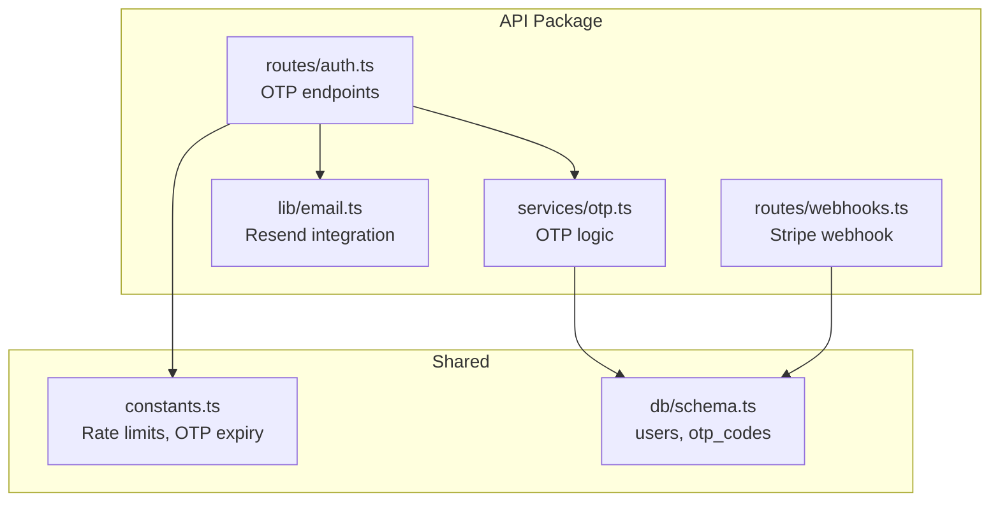
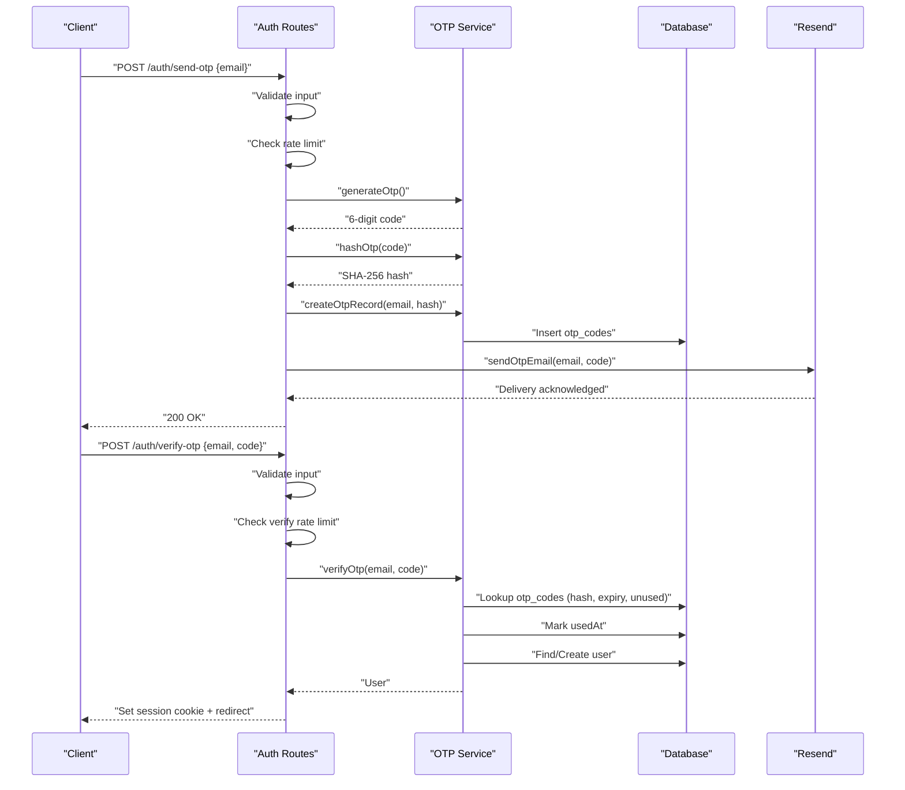
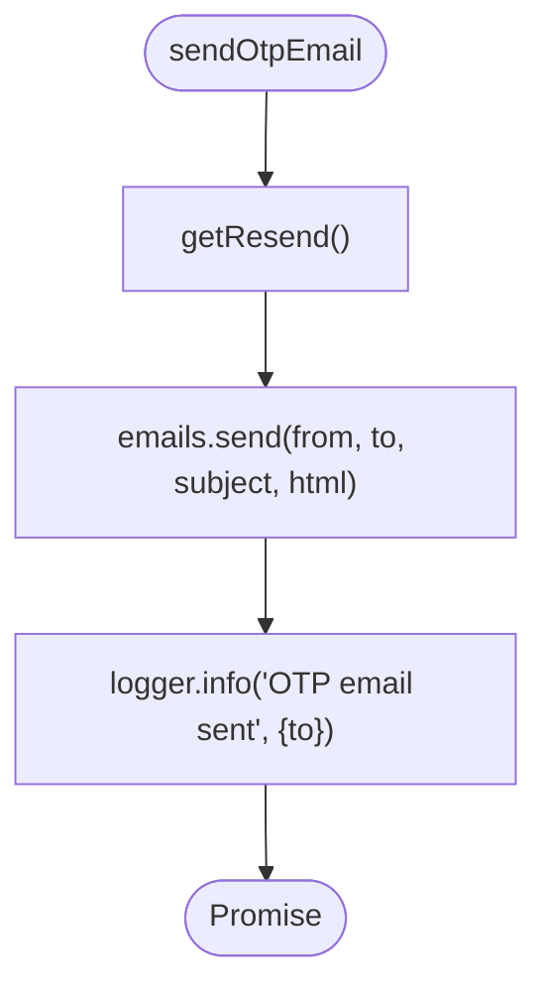
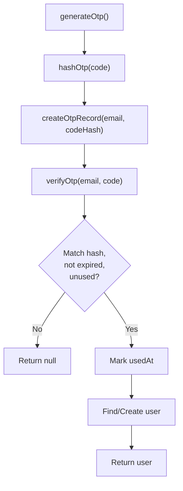
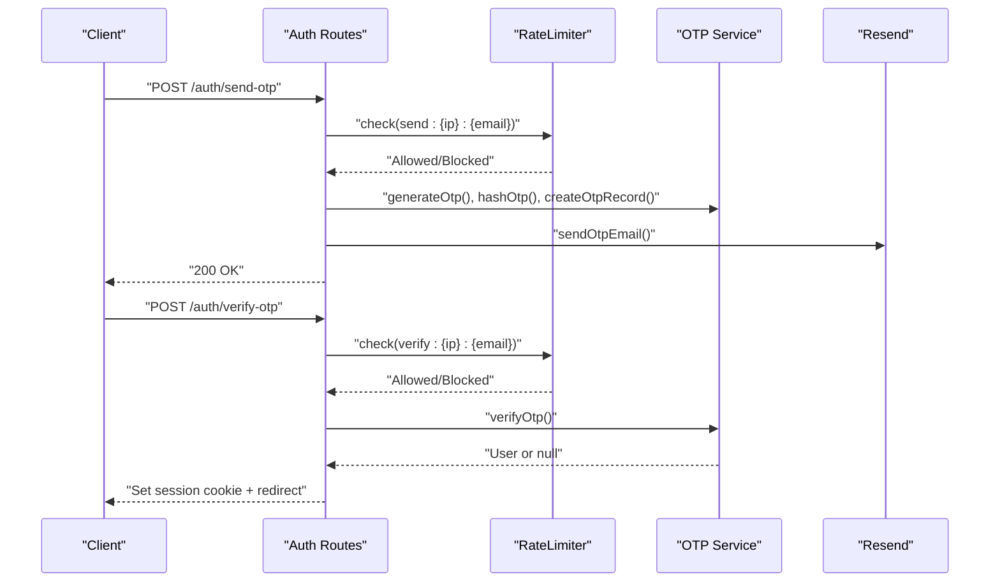
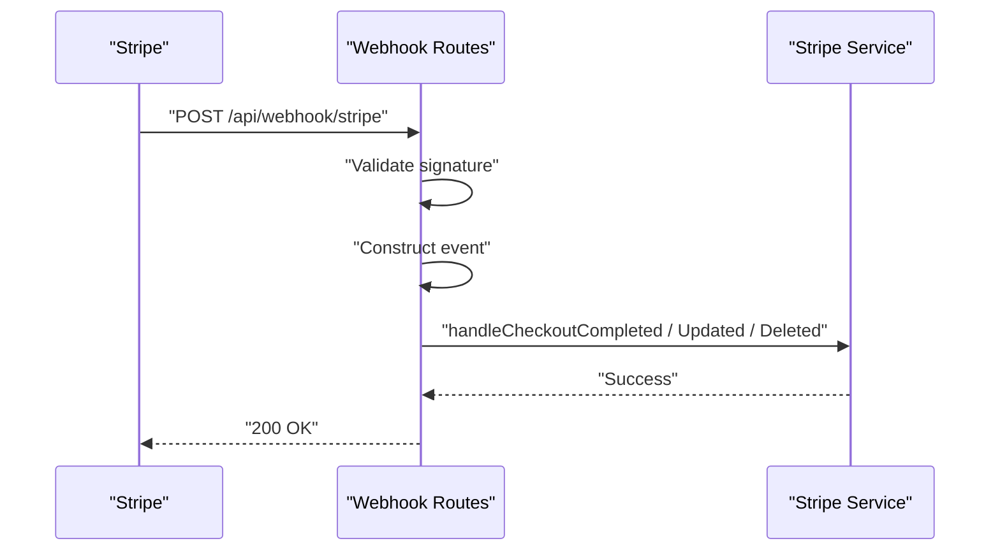
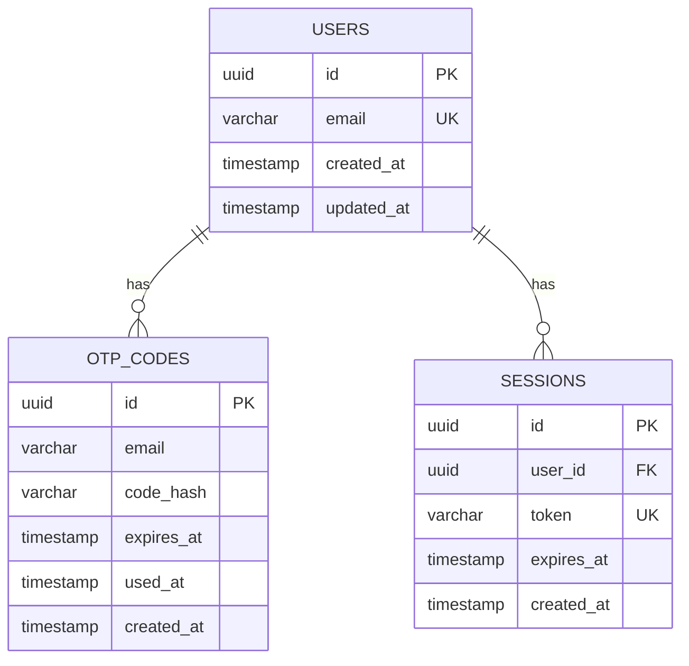
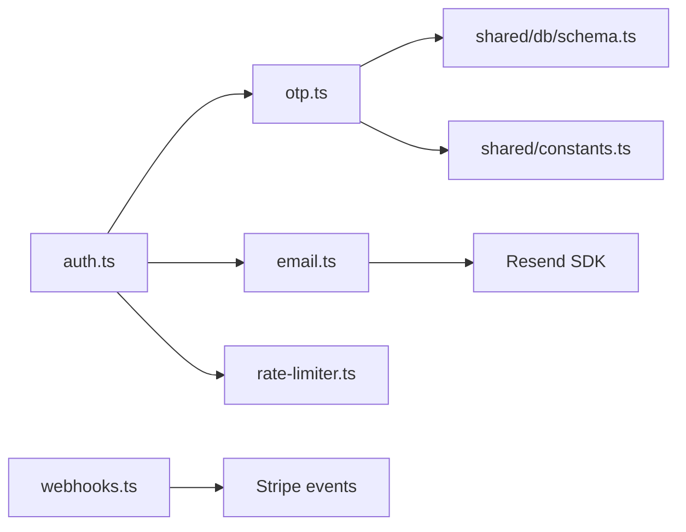

# Email Service Integration

<cite>
**Referenced Files in This Document**
- [email.ts](file://packages/api/src/lib/email.ts)
- [otp.ts](file://packages/api/src/services/otp.ts)
- [auth.ts](file://packages/api/src/routes/auth.ts)
- [webhooks.ts](file://packages/api/src/routes/webhooks.ts)
- [schema.ts](file://packages/shared/src/db/schema.ts)
- [constants.ts](file://packages/shared/src/constants.ts)
- [PRD.md](file://PRD.md)
- [drizzle.config.ts](file://drizzle.config.ts)
</cite>

## Table of Contents
1. [Introduction](#introduction)
2. [Project Structure](#project-structure)
3. [Core Components](#core-components)
4. [Architecture Overview](#architecture-overview)
5. [Detailed Component Analysis](#detailed-component-analysis)
6. [Dependency Analysis](#dependency-analysis)
7. [Performance Considerations](#performance-considerations)
8. [Troubleshooting Guide](#troubleshooting-guide)
9. [Conclusion](#conclusion)
10. [Appendices](#appendices)

## Introduction
This document describes the email service integration using Resend for transactional email delivery, focusing on the OTP generation, template rendering, and delivery workflows. It also covers deliverability optimization strategies, validation processes, configuration examples, security controls, error handling, and troubleshooting guidance. The system integrates tightly with the authentication flow and database schema to securely manage one-time passwords and user sessions.

## Project Structure
The email service is implemented within the API package and leverages shared constants and database schemas. Key areas:
- Email transport and delivery: Resend integration
- OTP lifecycle: generation, hashing, persistence, verification, and session creation
- Authentication routes: OTP send/verify endpoints with rate limiting and CSRF protection
- Webhook routes: Stripe webhook handling (billing and provisioning triggers)
- Shared configuration: constants for OTP expiry and rate limits
- Database schema: OTP codes and users tables supporting the OTP workflow

**Diagram sources**
- [auth.ts](file://packages/api/src/routes/auth.ts#L1-L80)
- [otp.ts](file://packages/api/src/services/otp.ts#L1-L59)
- [email.ts](file://packages/api/src/lib/email.ts#L1-L34)
- [webhooks.ts](file://packages/api/src/routes/webhooks.ts#L1-L49)
- [constants.ts](file://packages/shared/src/constants.ts#L1-L28)
- [schema.ts](file://packages/shared/src/db/schema.ts#L14-L44)

**Section sources**
- [email.ts](file://packages/api/src/lib/email.ts#L1-L34)
- [otp.ts](file://packages/api/src/services/otp.ts#L1-L59)
- [auth.ts](file://packages/api/src/routes/auth.ts#L1-L80)
- [webhooks.ts](file://packages/api/src/routes/webhooks.ts#L1-L49)
- [constants.ts](file://packages/shared/src/constants.ts#L1-L28)
- [schema.ts](file://packages/shared/src/db/schema.ts#L14-L44)

## Core Components
- Resend email transport: Singleton initialization using the RESEND_API_KEY environment variable, with a single OTP email sending function.
- OTP service: Generates a 6-digit numeric code, hashes it with SHA-256, persists the record with expiration, verifies against the database, marks as used, and creates or retrieves a user.
- Authentication routes: Validate input, enforce rate limits, generate and persist OTP, send email, and create sessions upon successful verification.
- Webhook routes: Stripe webhook handler for subscription lifecycle events.
- Database schema: OTP codes table with indexes for efficient lookup and expiration handling.

**Section sources**
- [email.ts](file://packages/api/src/lib/email.ts#L1-L34)
- [otp.ts](file://packages/api/src/services/otp.ts#L1-L59)
- [auth.ts](file://packages/api/src/routes/auth.ts#L1-L80)
- [webhooks.ts](file://packages/api/src/routes/webhooks.ts#L1-L49)
- [schema.ts](file://packages/shared/src/db/schema.ts#L28-L44)
- [constants.ts](file://packages/shared/src/constants.ts#L16-L20)

## Architecture Overview
The OTP email flow integrates the authentication routes, OTP service, and Resend transport. The flow ensures validation, rate limiting, secure storage, and reliable delivery.

**Diagram sources**
- [auth.ts](file://packages/api/src/routes/auth.ts#L21-L71)
- [otp.ts](file://packages/api/src/services/otp.ts#L6-L58)
- [email.ts](file://packages/api/src/lib/email.ts#L13-L33)
- [schema.ts](file://packages/shared/src/db/schema.ts#L28-L58)

## Detailed Component Analysis

### Email Transport (Resend)
- Initializes a singleton Resend client using the RESEND_API_KEY environment variable.
- Provides a single function to send OTP emails with a predefined sender identity and HTML content.
- Logs delivery events for observability.

**Diagram sources**
- [email.ts](file://packages/api/src/lib/email.ts#L6-L33)

**Section sources**
- [email.ts](file://packages/api/src/lib/email.ts#L1-L34)

### OTP Generation and Verification
- Generation: Produces a cryptographically random 6-digit numeric code.
- Hashing: Uses SHA-256 to hash the code before storage.
- Persistence: Inserts a record with email, hashed code, and expiration timestamp.
- Verification: Validates hash, expiry, and unused status; marks as used; finds or creates a user.
- Expiration: Enforced via database timestamp checks.

**Diagram sources**
- [otp.ts](file://packages/api/src/services/otp.ts#L6-L58)
- [schema.ts](file://packages/shared/src/db/schema.ts#L28-L44)

**Section sources**
- [otp.ts](file://packages/api/src/services/otp.ts#L1-L59)
- [schema.ts](file://packages/shared/src/db/schema.ts#L28-L44)

### Authentication Routes (OTP)
- Send OTP endpoint validates input, enforces rate limits keyed by IP and email, generates and persists OTP, and sends the email.
- Verify OTP endpoint validates input, enforces verify rate limits, verifies OTP, and creates a session cookie upon success.
- Uses CSRF middleware for protection on POST endpoints.

**Diagram sources**
- [auth.ts](file://packages/api/src/routes/auth.ts#L19-L71)
- [otp.ts](file://packages/api/src/services/otp.ts#L19-L58)
- [email.ts](file://packages/api/src/lib/email.ts#L13-L33)

**Section sources**
- [auth.ts](file://packages/api/src/routes/auth.ts#L1-L80)
- [constants.ts](file://packages/shared/src/constants.ts#L16-L23)

### Webhook Routes (Stripe)
- Stripe webhook endpoint validates signature, constructs event, and dispatches to handlers for checkout completion, subscription updates, and deletions.
- Includes robust error logging and controlled HTTP responses for invalid signatures and processing failures.

**Diagram sources**
- [webhooks.ts](file://packages/api/src/routes/webhooks.ts#L5-L48)

**Section sources**
- [webhooks.ts](file://packages/api/src/routes/webhooks.ts#L1-L49)

### Database Schema for OTP and Users
- Users table: unique email, timestamps.
- OTP codes table: composite index on email and expires_at for efficient lookups; tracks code hash, expiration, and usage.
- Sessions table: links to users, unique token, expiration.

**Diagram sources**
- [schema.ts](file://packages/shared/src/db/schema.ts#L14-L67)

**Section sources**
- [schema.ts](file://packages/shared/src/db/schema.ts#L14-L67)

## Dependency Analysis
- email.ts depends on Resend SDK and logger.
- auth.ts depends on OTP service, rate limiter, session service, and CSRF middleware.
- otp.ts depends on database client and constants for OTP expiry.
- webhooks.ts depends on Stripe event construction and handlers.
- All components rely on shared constants and schema definitions.

**Diagram sources**
- [email.ts](file://packages/api/src/lib/email.ts#L1-L34)
- [auth.ts](file://packages/api/src/routes/auth.ts#L1-L80)
- [otp.ts](file://packages/api/src/services/otp.ts#L1-L59)
- [webhooks.ts](file://packages/api/src/routes/webhooks.ts#L1-L49)
- [constants.ts](file://packages/shared/src/constants.ts#L1-L28)
- [schema.ts](file://packages/shared/src/db/schema.ts#L14-L44)

**Section sources**
- [email.ts](file://packages/api/src/lib/email.ts#L1-L34)
- [auth.ts](file://packages/api/src/routes/auth.ts#L1-L80)
- [otp.ts](file://packages/api/src/services/otp.ts#L1-L59)
- [webhooks.ts](file://packages/api/src/routes/webhooks.ts#L1-L49)
- [constants.ts](file://packages/shared/src/constants.ts#L1-L28)
- [schema.ts](file://packages/shared/src/db/schema.ts#L14-L44)

## Performance Considerations
- OTP delivery latency targets are defined in the product requirements.
- Database indexes on otp_codes.email and otp_codes.expires_at improve verification performance.
- Rate limiting reduces load during bursts and prevents abuse.
- Using a singleton Resend client minimizes initialization overhead.

[No sources needed since this section provides general guidance]

## Troubleshooting Guide
Common issues and resolutions:
- OTP not delivered
  - Verify RESEND_API_KEY is set and Resend domain is configured.
  - Confirm sender identity and domain alignment.
  - Check email transport logs for delivery acknowledgments.
- OTP expired or invalid
  - Ensure OTP expiry aligns with OTP_EXPIRY_MS.
  - Confirm database records reflect correct hash and timestamp.
- Rate limit exceeded
  - Review OTP_SEND_RATE_LIMIT and OTP_VERIFY_RATE_LIMIT windows.
  - Check rate limiter key composition (IP + email).
- Session cookie not set
  - Validate session cookie configuration and secure flags.
  - Confirm successful OTP verification before setting cookies.
- Webhook processing failures
  - Validate Stripe signature header presence and correctness.
  - Inspect webhook logs for handled/unhandled events and error messages.

**Section sources**
- [auth.ts](file://packages/api/src/routes/auth.ts#L21-L71)
- [otp.ts](file://packages/api/src/services/otp.ts#L27-L58)
- [webhooks.ts](file://packages/api/src/routes/webhooks.ts#L6-L48)
- [constants.ts](file://packages/shared/src/constants.ts#L16-L23)
- [PRD.md](file://PRD.md#L640-L651)

## Conclusion
The email service integration using Resend provides a focused, secure, and observable OTP delivery mechanism integrated with authentication and session management. The design emphasizes validation, rate limiting, secure storage, and clear error handling. Deliverability is supported by environment-driven configuration and logging, while the database schema and indexes optimize verification performance.

[No sources needed since this section summarizes without analyzing specific files]

## Appendices

### Email Configuration Examples
- Environment variables
  - RESEND_API_KEY: API key for Resend transport
  - DATABASE_URL: Connection string for PostgreSQL
  - STRIPE_SECRET_KEY: Stripe API key
  - STRIPE_WEBHOOK_SECRET: Stripe webhook signing secret
  - RAILWAY_API_TOKEN: Railway GraphQL API token
  - SESSION_SECRET: Secret for signing session tokens
  - SENTRY_DSN: Sentry error tracking DSN
  - POSTHOG_API_KEY: PostHog analytics key
- Sender identity
  - From address format: "SparkClaw <noreply@sparkclaw.com>"
- Domain alignment
  - Ensure the sending domain matches the "from" address for improved deliverability

**Section sources**
- [email.ts](file://packages/api/src/lib/email.ts#L13-L18)
- [PRD.md](file://PRD.md#L639-L651)

### Template Customization
- Current implementation renders a simple HTML template with the OTP code and expiration notice.
- To customize:
  - Modify the HTML content within the sendOtpEmail function.
  - Maintain accessibility and readability for the OTP display.
  - Keep the sender identity consistent with domain verification.

**Section sources**
- [email.ts](file://packages/api/src/lib/email.ts#L18-L30)

### Delivery Tracking
- Delivery acknowledgment is logged via the logger module after sending.
- For advanced tracking, integrate with Resend's analytics or webhooks.

**Section sources**
- [email.ts](file://packages/api/src/lib/email.ts#L32-L33)

### Security Controls
- API key protection
  - Store RESEND_API_KEY in environment variables; avoid embedding in code.
- Rate limiting
  - Enforce per-IP and per-email rate limits for send and verify operations.
- Compliance
  - Respect privacy and data retention policies; ensure secure storage of hashed OTP codes.

**Section sources**
- [auth.ts](file://packages/api/src/routes/auth.ts#L10-L11)
- [constants.ts](file://packages/shared/src/constants.ts#L16-L23)
- [PRD.md](file://PRD.md#L399-L411)

### Error Handling and Retries
- OTP verification failures return appropriate HTTP status codes and messages.
- Webhook processing failures are logged and responded with 500 when necessary.
- No explicit retry mechanism is implemented for OTP delivery; rely on Resend delivery guarantees and logs.

**Section sources**
- [auth.ts](file://packages/api/src/routes/auth.ts#L22-L58)
- [webhooks.ts](file://packages/api/src/routes/webhooks.ts#L37-L44)

### Deliverability Optimization Strategies
- Sender reputation management
  - Use a dedicated sending domain and align "from" address.
- Bounce handling
  - Monitor Resend delivery status and logs; implement retry policies at the application level if needed.
- Spam filtering
  - Keep content simple and consistent; avoid suspicious links or attachments.
- Inbox placement optimization
  - Maintain consistent branding; ensure mobile-friendly layout; avoid excessive images.

**Section sources**
- [email.ts](file://packages/api/src/lib/email.ts#L13-L18)
- [PRD.md](file://PRD.md#L664-L664)

### Validation Processes
- Recipient address validation
  - Input is validated using Zod schemas in the authentication routes.
- Template variables
  - OTP code is injected into the HTML template; ensure sanitization if extending content.
- Content formatting
  - HTML content is kept minimal and readable; maintain consistent typography and spacing.

**Section sources**
- [auth.ts](file://packages/api/src/routes/auth.ts#L22-L46)
- [email.ts](file://packages/api/src/lib/email.ts#L18-L30)

### Database Migration Configuration
- Drizzle configuration points to the shared schema and outputs migrations to the drizzle/migrations directory.

**Section sources**
- [drizzle.config.ts](file://drizzle.config.ts#L1-L13)