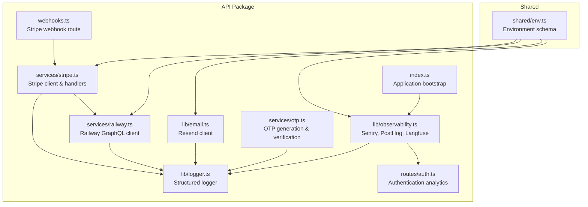
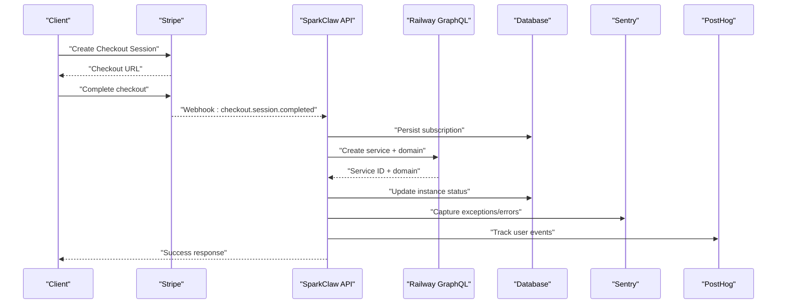
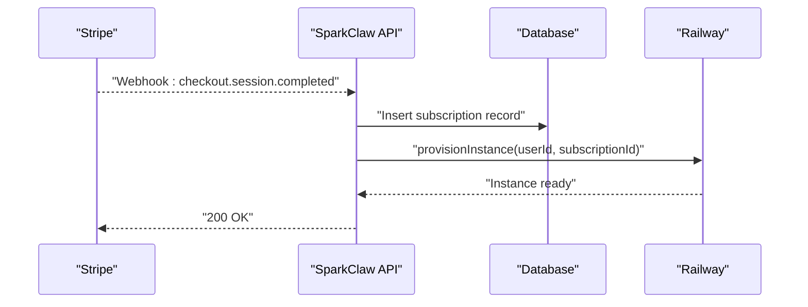
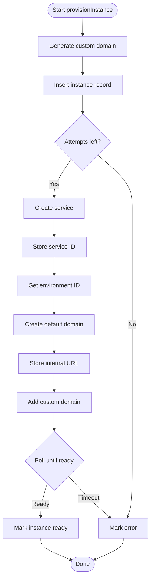
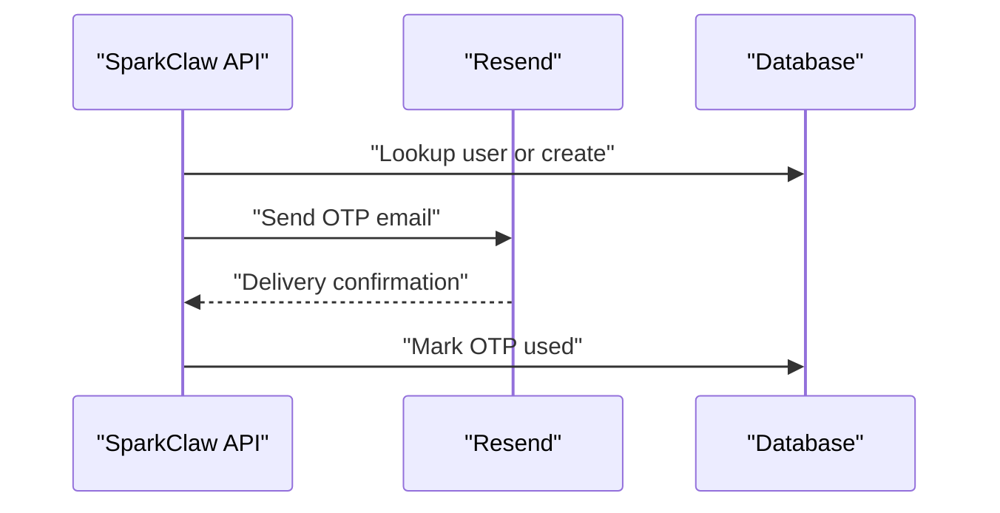
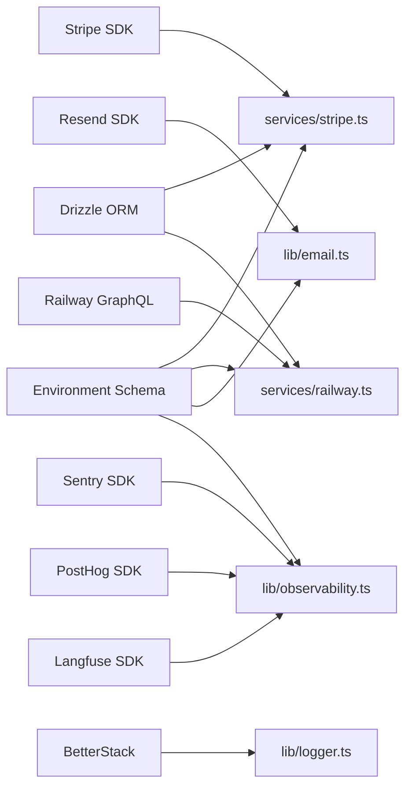

# External Integrations

<cite>
**Referenced Files in This Document**
- [packages/api/src/lib/observability.ts](file://packages/api/src/lib/observability.ts)
- [packages/api/src/lib/logger.ts](file://packages/api/src/lib/logger.ts)
- [packages/api/src/index.ts](file://packages/api/src/index.ts)
- [packages/api/src/routes/auth.ts](file://packages/api/src/routes/auth.ts)
- [packages/api/src/services/stripe.ts](file://packages/api/src/services/stripe.ts)
- [packages/api/src/routes/webhooks.ts](file://packages/api/src/routes/webhooks.ts)
- [packages/api/src/services/railway.ts](file://packages/api/src/services/railway.ts)
- [packages/api/src/lib/email.ts](file://packages/api/src/lib/email.ts)
- [packages/api/src/services/otp.ts](file://packages/api/src/services/otp.ts)
- [packages/shared/src/env.ts](file://packages/shared/src/env.ts)
- [PRD.md](file://PRD.md)
</cite>

## Update Summary
**Changes Made**
- Added comprehensive documentation for the new observability stack including Sentry, PostHog, Langfuse, and BetterStack integrations
- Updated architecture diagrams to reflect the enhanced observability infrastructure
- Added detailed coverage of error tracking, analytics, LLM observability, and centralized logging
- Enhanced monitoring and logging strategies with the new telemetry providers
- Updated troubleshooting guide with observability-specific failure scenarios

## Table of Contents
1. [Introduction](#introduction)
2. [Project Structure](#project-structure)
3. [Core Components](#core-components)
4. [Architecture Overview](#architecture-overview)
5. [Detailed Component Analysis](#detailed-component-analysis)
6. [Observability Stack](#observability-stack)
7. [Dependency Analysis](#dependency-analysis)
8. [Performance Considerations](#performance-considerations)
9. [Troubleshooting Guide](#troubleshooting-guide)
10. [Conclusion](#conclusion)
11. [Appendices](#appendices)

## Introduction
This document explains SparkClaw's external service integrations and operational patterns. It focuses on:
- Stripe for payments and subscriptions, including checkout sessions, webhook security, and lifecycle events
- Railway for service deployment and domain provisioning via GraphQL
- Resend for OTP and transactional emails
- **New**: Comprehensive observability stack including Sentry for error tracking, PostHog for product analytics, Langfuse for LLM observability, and BetterStack for centralized logging
- Security considerations, monitoring, testing, and vendor lock-in mitigation

Where applicable, we reference concrete source files and highlight how each integration is wired into the system.

## Project Structure
The integrations are primarily implemented in the API package, with shared configuration and environment validation in the shared package. Webhook routes expose Stripe callbacks, while internal services orchestrate downstream actions. The new observability stack is centralized in dedicated modules.

**Diagram sources**
- [packages/api/src/routes/webhooks.ts](file://packages/api/src/routes/webhooks.ts#L1-L49)
- [packages/api/src/services/stripe.ts](file://packages/api/src/services/stripe.ts#L1-L107)
- [packages/api/src/services/railway.ts](file://packages/api/src/services/railway.ts#L1-L291)
- [packages/api/src/lib/email.ts](file://packages/api/src/lib/email.ts#L1-L34)
- [packages/api/src/services/otp.ts](file://packages/api/src/services/otp.ts#L1-L59)
- [packages/api/src/lib/logger.ts](file://packages/api/src/lib/logger.ts#L1-L85)
- [packages/api/src/lib/observability.ts](file://packages/api/src/lib/observability.ts#L1-L149)
- [packages/api/src/index.ts](file://packages/api/src/index.ts#L1-L78)
- [packages/api/src/routes/auth.ts](file://packages/api/src/routes/auth.ts#L1-L95)
- [packages/shared/src/env.ts](file://packages/shared/src/env.ts#L1-L57)

**Section sources**
- [packages/api/src/routes/webhooks.ts](file://packages/api/src/routes/webhooks.ts#L1-L49)
- [packages/api/src/services/stripe.ts](file://packages/api/src/services/stripe.ts#L1-L107)
- [packages/api/src/services/railway.ts](file://packages/api/src/services/railway.ts#L1-L291)
- [packages/api/src/lib/email.ts](file://packages/api/src/lib/email.ts#L1-L34)
- [packages/api/src/services/otp.ts](file://packages/api/src/services/otp.ts#L1-L59)
- [packages/api/src/lib/logger.ts](file://packages/api/src/lib/logger.ts#L1-L85)
- [packages/api/src/lib/observability.ts](file://packages/api/src/lib/observability.ts#L1-L149)
- [packages/api/src/index.ts](file://packages/api/src/index.ts#L1-L78)
- [packages/api/src/routes/auth.ts](file://packages/api/src/routes/auth.ts#L1-L95)
- [packages/shared/src/env.ts](file://packages/shared/src/env.ts#L1-L57)

## Core Components
- Stripe integration: client initialization, checkout session creation, webhook construction, and subscription lifecycle handlers
- Railway integration: GraphQL client, service provisioning, domain management, and polling for readiness
- Email integration: Resend client for OTP delivery and transactional messages
- OTP service: secure code generation, hashing, storage, and verification
- **New**: Observability stack: Sentry for error tracking, PostHog for product analytics, Langfuse for LLM observability, and BetterStack for centralized logging
- Logging: structured JSON logs with severity levels and automatic error forwarding to Sentry

**Section sources**
- [packages/api/src/services/stripe.ts](file://packages/api/src/services/stripe.ts#L1-L107)
- [packages/api/src/services/railway.ts](file://packages/api/src/services/railway.ts#L1-L291)
- [packages/api/src/lib/email.ts](file://packages/api/src/lib/email.ts#L1-L34)
- [packages/api/src/services/otp.ts](file://packages/api/src/services/otp.ts#L1-L59)
- [packages/api/src/lib/observability.ts](file://packages/api/src/lib/observability.ts#L1-L149)
- [packages/api/src/lib/logger.ts](file://packages/api/src/lib/logger.ts#L1-L85)

## Architecture Overview
The system orchestrates payments and infrastructure provisioning through a webhook-driven flow. Payments are handled by Stripe; successful checkouts trigger instance provisioning via Railway's GraphQL API. Emails are sent via Resend for OTP and other transactional messages. All operations are logged with structured entries and automatically monitored through the observability stack.

**Diagram sources**
- [packages/api/src/services/stripe.ts](file://packages/api/src/services/stripe.ts#L28-L72)
- [packages/api/src/services/railway.ts](file://packages/api/src/services/railway.ts#L177-L290)
- [packages/api/src/routes/webhooks.ts](file://packages/api/src/routes/webhooks.ts#L6-L48)
- [packages/api/src/lib/observability.ts](file://packages/api/src/lib/observability.ts#L24-L42)
- [packages/api/src/routes/auth.ts](file://packages/api/src/routes/auth.ts#L41-L78)

## Detailed Component Analysis

### Stripe Integration
- Client initialization: lazy singleton with configured API version and secret key
- Checkout sessions: creates a subscription-mode session with metadata for user and plan
- Webhook security: constructs events using the webhook secret and signature header
- Lifecycle handlers:
  - On checkout completion: persists subscription, stores Stripe identifiers, and triggers instance provisioning
  - On subscription update: updates status and period end
  - On subscription deletion: cancels subscription and suspends associated instance

**Diagram sources**
- [packages/api/src/routes/webhooks.ts](file://packages/api/src/routes/webhooks.ts#L6-L48)
- [packages/api/src/services/stripe.ts](file://packages/api/src/services/stripe.ts#L45-L72)
- [packages/api/src/services/railway.ts](file://packages/api/src/services/railway.ts#L177-L290)

Key implementation references:
- Event construction and webhook route: [packages/api/src/routes/webhooks.ts](file://packages/api/src/routes/webhooks.ts#L6-L48)
- Checkout session creation: [packages/api/src/services/stripe.ts](file://packages/api/src/services/stripe.ts#L28-L43)
- Lifecycle handlers: [packages/api/src/services/stripe.ts](file://packages/api/src/services/stripe.ts#L45-L106)

Security and configuration:
- Signature verification enforced in webhook route
- Webhook secret and API key loaded from environment
- Environment schema includes optional Sentry DSN (see [packages/shared/src/env.ts](file://packages/shared/src/env.ts#L17-L17))

**Section sources**
- [packages/api/src/routes/webhooks.ts](file://packages/api/src/routes/webhooks.ts#L6-L48)
- [packages/api/src/services/stripe.ts](file://packages/api/src/services/stripe.ts#L11-L26)
- [packages/api/src/services/stripe.ts](file://packages/api/src/services/stripe.ts#L28-L43)
- [packages/api/src/services/stripe.ts](file://packages/api/src/services/stripe.ts#L45-L106)
- [packages/shared/src/env.ts](file://packages/shared/src/env.ts#L17-L17)

### Railway API Integration
- GraphQL endpoint: uses a bearer token for authentication
- Operations:
  - Create service under a project
  - Create default service domain per environment
  - Add custom domain to the service
  - Query custom domain status and service domains
  - Resolve production environment ID
- Provisioning pipeline:
  - Generates a custom subdomain derived from instance ID
  - Inserts instance record with pending statuses
  - Repeatedly attempts service creation and domain setup with exponential backoff
  - Polls until DNS verification is achieved or times out
  - Updates instance status accordingly

**Diagram sources**
- [packages/api/src/services/railway.ts](file://packages/api/src/services/railway.ts#L177-L290)

Key implementation references:
- GraphQL client and error handling: [packages/api/src/services/railway.ts](file://packages/api/src/services/railway.ts#L13-L34)
- Service and domain operations: [packages/api/src/services/railway.ts](file://packages/api/src/services/railway.ts#L45-L171)
- Provisioning loop and polling: [packages/api/src/services/railway.ts](file://packages/api/src/services/railway.ts#L177-L290)

**Section sources**
- [packages/api/src/services/railway.ts](file://packages/api/src/services/railway.ts#L13-L34)
- [packages/api/src/services/railway.ts](file://packages/api/src/services/railway.ts#L45-L171)
- [packages/api/src/services/railway.ts](file://packages/api/src/services/railway.ts#L177-L290)

### Resend Email Service Integration
- Client initialization: lazy singleton using API key from environment
- OTP delivery: sends a templated HTML email with a short expiration
- Logging: records successful sends with recipient context

**Diagram sources**
- [packages/api/src/lib/email.ts](file://packages/api/src/lib/email.ts#L13-L33)
- [packages/api/src/services/otp.ts](file://packages/api/src/services/otp.ts#L27-L58)

Key implementation references:
- Email client and send function: [packages/api/src/lib/email.ts](file://packages/api/src/lib/email.ts#L6-L33)
- OTP generation, hashing, and verification: [packages/api/src/services/otp.ts](file://packages/api/src/services/otp.ts#L6-L59)

**Section sources**
- [packages/api/src/lib/email.ts](file://packages/api/src/lib/email.ts#L6-L33)
- [packages/api/src/services/otp.ts](file://packages/api/src/services/otp.ts#L6-L59)

## Observability Stack

### Sentry Error Tracking Integration
- **New**: Comprehensive error tracking and performance monitoring
- Client initialization: automatic initialization during application startup with environment-based sampling
- Exception capture: automatic forwarding of all error-level logs to Sentry
- Context preservation: captures error context and additional metadata
- Graceful shutdown: ensures pending telemetry is flushed before process termination

Key implementation references:
- Application initialization: [packages/api/src/index.ts](file://packages/api/src/index.ts#L26-L27)
- Error capture integration: [packages/api/src/lib/logger.ts](file://packages/api/src/lib/logger.ts#L74-L76)
- Environment configuration: [packages/shared/src/env.ts](file://packages/shared/src/env.ts#L17-L17)

**Section sources**
- [packages/api/src/lib/observability.ts](file://packages/api/src/lib/observability.ts#L11-L22)
- [packages/api/src/lib/observability.ts](file://packages/api/src/lib/observability.ts#L24-L42)
- [packages/api/src/lib/logger.ts](file://packages/api/src/lib/logger.ts#L74-L76)
- [packages/api/src/index.ts](file://packages/api/src/index.ts#L26-L27)
- [packages/shared/src/env.ts](file://packages/shared/src/env.ts#L17-L17)

### PostHog Analytics Integration
- **New**: Product analytics and user behavior tracking
- Client initialization: lazy singleton with configurable host and API key
- Event tracking: automatic environment tagging and property enrichment
- User identification: persistent user property management
- Automatic shutdown: graceful connection cleanup during application shutdown

Key implementation references:
- Event tracking: [packages/api/src/routes/auth.ts](file://packages/api/src/routes/auth.ts#L41-L42)
- Login analytics: [packages/api/src/routes/auth.ts](file://packages/api/src/routes/auth.ts#L76-L78)
- Logout tracking: [packages/api/src/routes/auth.ts](file://packages/api/src/routes/auth.ts#L90-L91)

**Section sources**
- [packages/api/src/lib/observability.ts](file://packages/api/src/lib/observability.ts#L44-L89)
- [packages/api/src/routes/auth.ts](file://packages/api/src/routes/auth.ts#L41-L42)
- [packages/api/src/routes/auth.ts](file://packages/api/src/routes/auth.ts#L76-L78)
- [packages/api/src/routes/auth.ts](file://packages/api/src/routes/auth.ts#L90-L91)

### Langfuse LLM Observability Integration
- **New**: Advanced observability for Large Language Model operations
- Client initialization: lazy singleton with public/secret key pair and configurable host
- Trace creation: hierarchical trace/span structure for complex LLM workflows
- Metadata enrichment: automatic environment tagging and custom metadata support
- Async shutdown: non-blocking telemetry flushing during application termination

Key implementation references:
- Trace creation: [packages/api/src/lib/observability.ts](file://packages/api/src/lib/observability.ts#L107-L119)
- Span creation: [packages/api/src/lib/observability.ts](file://packages/api/src/lib/observability.ts#L121-L133)

**Section sources**
- [packages/api/src/lib/observability.ts](file://packages/api/src/lib/observability.ts#L91-L105)
- [packages/api/src/lib/observability.ts](file://packages/api/src/lib/observability.ts#L107-L119)
- [packages/api/src/lib/observability.ts](file://packages/api/src/lib/observability.ts#L121-L133)

### BetterStack Centralized Logging Integration
- **New**: Centralized log management and aggregation
- Client initialization: lazy singleton with configurable host and source token
- HTTP transport: asynchronous, fire-and-forget log delivery to BetterStack
- Error isolation: logging failures don't impact application performance
- Structured logging: unified JSON format with environment and service metadata

Key implementation references:
- Log forwarding: [packages/api/src/lib/logger.ts](file://packages/api/src/lib/logger.ts#L28-L46)
- BetterStack endpoint configuration: [packages/api/src/lib/logger.ts](file://packages/api/src/lib/logger.ts#L17-L26)

**Section sources**
- [packages/api/src/lib/observability.ts](file://packages/api/src/lib/observability.ts#L135-L148)
- [packages/api/src/lib/logger.ts](file://packages/api/src/lib/logger.ts#L17-L26)
- [packages/api/src/lib/logger.ts](file://packages/api/src/lib/logger.ts#L28-L46)
- [packages/shared/src/env.ts](file://packages/shared/src/env.ts#L24-L26)

## Dependency Analysis
External dependencies and environment configuration:
- Stripe SDK for payment operations
- Resend SDK for email delivery
- Railway GraphQL endpoint for infrastructure provisioning
- **New**: Sentry SDK for error tracking and performance monitoring
- **New**: PostHog SDK for product analytics and user behavior tracking
- **New**: Langfuse SDK for LLM observability and tracing
- **New**: BetterStack for centralized log management
- Drizzle ORM for database persistence
- Environment validation for API keys and tokens

**Diagram sources**
- [packages/api/src/services/stripe.ts](file://packages/api/src/services/stripe.ts#L1-L7)
- [packages/api/src/lib/email.ts](file://packages/api/src/lib/email.ts#L1-L2)
- [packages/api/src/services/railway.ts](file://packages/api/src/services/railway.ts#L1-L9)
- [packages/api/src/lib/observability.ts](file://packages/api/src/lib/observability.ts#L1-L4)
- [packages/api/src/lib/logger.ts](file://packages/api/src/lib/logger.ts#L1-L2)
- [packages/shared/src/env.ts](file://packages/shared/src/env.ts#L1-L57)

**Section sources**
- [packages/api/src/services/stripe.ts](file://packages/api/src/services/stripe.ts#L1-L7)
- [packages/api/src/lib/email.ts](file://packages/api/src/lib/email.ts#L1-L2)
- [packages/api/src/services/railway.ts](file://packages/api/src/services/railway.ts#L1-L9)
- [packages/api/src/lib/observability.ts](file://packages/api/src/lib/observability.ts#L1-L4)
- [packages/api/src/lib/logger.ts](file://packages/api/src/lib/logger.ts#L1-L2)
- [packages/shared/src/env.ts](file://packages/shared/src/env.ts#L1-L57)

## Performance Considerations
- Retry and backoff: Railway provisioning uses exponential backoff across a bounded retry window to reduce load and accommodate eventual consistency
- Polling cadence: configurable polling interval and maximum attempts prevent tight loops and excessive API calls
- Asynchronous provisioning: instance creation is fire-and-forget after subscription creation to avoid blocking the webhook response
- **New**: Non-blocking observability: Sentry, PostHog, and BetterStack integrations use asynchronous, fire-and-forget patterns to prevent performance degradation
- **New**: Lazy initialization: All observability clients use lazy initialization to minimize startup overhead
- **New**: Graceful shutdown: Telemetry clients are properly flushed during application termination to prevent data loss
- Structured logging: consistent JSON logs enable efficient querying and correlation across services

Recommendations:
- Add circuit breakers around external calls if traffic increases
- Consider batching webhook processing for high-volume scenarios
- Instrument latency and error rates for Stripe, Railway, Resend, and observability providers
- Monitor observability provider quotas and adjust sampling rates accordingly

**Section sources**
- [packages/api/src/services/railway.ts](file://packages/api/src/services/railway.ts#L198-L277)
- [packages/api/src/services/stripe.ts](file://packages/api/src/services/stripe.ts#L69-L71)
- [packages/api/src/lib/logger.ts](file://packages/api/src/lib/logger.ts#L10-L27)
- [packages/api/src/lib/observability.ts](file://packages/api/src/lib/observability.ts#L135-L148)

## Troubleshooting Guide

### Observability-Specific Issues and Resolutions

#### Sentry Integration Issues
- **Sentry not capturing errors**
  - Cause: Missing or invalid SENTRY_DSN environment variable
  - Resolution: Verify environment configuration and restart application
  - Reference: [packages/shared/src/env.ts](file://packages/shared/src/env.ts#L17-L17)
- **High error volume in production**
  - Cause: Production tracesSampleRate set to 0.1
  - Resolution: Adjust sampling rate or implement custom sampling logic
  - Reference: [packages/api/src/lib/observability.ts](file://packages/api/src/lib/observability.ts#L15-L19)

#### PostHog Analytics Issues
- **Events not appearing in dashboard**
  - Cause: Missing POSTHOG_API_KEY or network connectivity issues
  - Resolution: Verify API key configuration and check network connectivity
  - Reference: [packages/shared/src/env.ts](file://packages/shared/src/env.ts#L18-L19)
- **User identification failing**
  - Cause: Missing distinctId or API key configuration
  - Resolution: Ensure proper distinctId usage and verify API key
  - Reference: [packages/api/src/lib/observability.ts](file://packages/api/src/lib/observability.ts#L78-L89)

#### Langfuse LLM Observability Issues
- **Traces not appearing in Langfuse dashboard**
  - Cause: Missing LANGFUSE_PUBLIC_KEY or LANGFUSE_SECRET_KEY
  - Resolution: Configure both keys and verify Langfuse host settings
  - Reference: [packages/shared/src/env.ts](file://packages/shared/src/env.ts#L21-L23)
- **Trace creation failing**
  - Cause: Missing Langfuse client initialization
  - Resolution: Ensure getLangfuse() returns a valid client instance
  - Reference: [packages/api/src/lib/observability.ts](file://packages/api/src/lib/observability.ts#L91-L105)

#### BetterStack Logging Issues
- **Logs not appearing in BetterStack**
  - Cause: Missing BETTERSTACK_SOURCE_TOKEN or network connectivity
  - Resolution: Verify source token and check network connectivity
  - Reference: [packages/shared/src/env.ts](file://packages/shared/src/env.ts#L25-L26)
- **Log delivery failures**
  - Cause: Network timeouts or BetterStack service issues
  - Resolution: Check BetterStack service status and network connectivity
  - Reference: [packages/api/src/lib/logger.ts](file://packages/api/src/lib/logger.ts#L28-L46)

### Traditional Integration Issues
- Stripe webhook signature invalid
  - Cause: missing or incorrect signature header; mismatched webhook secret
  - Resolution: verify webhook secret and signature header handling in the route
  - Reference: [packages/api/src/routes/webhooks.ts](file://packages/api/src/routes/webhooks.ts#L7-L21)
- Checkout session creation fails
  - Cause: invalid plan price ID or missing environment variables
  - Resolution: confirm plan constants and environment configuration
  - Reference: [packages/api/src/services/stripe.ts](file://packages/api/src/services/stripe.ts#L33-L42)
- Subscription update/delete not reflected
  - Cause: unhandled event type or database write failure
  - Resolution: inspect handler logic and database updates
  - References: [packages/api/src/services/stripe.ts](file://packages/api/src/services/stripe.ts#L74-L106)
- Railway provisioning timeout
  - Cause: DNS propagation delays or transient API errors
  - Resolution: review polling attempts, intervals, and error logging
  - Reference: [packages/api/src/services/railway.ts](file://packages/api/src/services/railway.ts#L239-L265)
- Email delivery failures
  - Cause: invalid API key or blocked sender domain
  - Resolution: validate API key and sender configuration
  - Reference: [packages/api/src/lib/email.ts](file://packages/api/src/lib/email.ts#L8-L33)
- OTP verification expired or used
  - Cause: expiry or reuse detection
  - Resolution: regenerate OTP and ensure single-use semantics
  - Reference: [packages/api/src/services/otp.ts](file://packages/api/src/services/otp.ts#L30-L58)

### Failure Scenarios and Recovery
- Webhook processing errors: route returns 500 and logs the error; reattempts depend on Stripe retry policy
  - Reference: [packages/api/src/routes/webhooks.ts](file://packages/api/src/routes/webhooks.ts#L37-L44)
- Provisioning retries: exponential backoff applied; final error recorded in instance status
  - Reference: [packages/api/src/services/railway.ts](file://packages/api/src/services/railway.ts#L266-L289)
- **New**: Observability provider failures: graceful degradation with silent failures to prevent impacting core functionality
  - Reference: [packages/api/src/lib/logger.ts](file://packages/api/src/lib/logger.ts#L43-L45)

**Section sources**
- [packages/api/src/lib/observability.ts](file://packages/api/src/lib/observability.ts#L11-L22)
- [packages/api/src/lib/observability.ts](file://packages/api/src/lib/observability.ts#L44-L89)
- [packages/api/src/lib/observability.ts](file://packages/api/src/lib/observability.ts#L91-L105)
- [packages/api/src/lib/observability.ts](file://packages/api/src/lib/observability.ts#L135-L148)
- [packages/api/src/lib/logger.ts](file://packages/api/src/lib/logger.ts#L28-L46)
- [packages/api/src/routes/webhooks.ts](file://packages/api/src/routes/webhooks.ts#L7-L21)
- [packages/api/src/services/stripe.ts](file://packages/api/src/services/stripe.ts#L33-L42)
- [packages/api/src/services/stripe.ts](file://packages/api/src/services/stripe.ts#L74-L106)
- [packages/api/src/services/railway.ts](file://packages/api/src/services/railway.ts#L239-L289)
- [packages/api/src/lib/email.ts](file://packages/api/src/lib/email.ts#L8-L33)
- [packages/api/src/services/otp.ts](file://packages/api/src/services/otp.ts#L30-L58)

## Conclusion
SparkClaw integrates external services through focused, composable modules with a comprehensive observability stack:
- Stripe handles payment and subscription lifecycle with secure webhook processing
- Railway provisions services and custom domains via GraphQL with robust retry and polling logic
- Resend delivers OTP and transactional emails with structured logging
- **New**: Sentry provides comprehensive error tracking and performance monitoring
- **New**: PostHog enables product analytics and user behavior tracking
- **New**: Langfuse offers advanced observability for LLM operations with distributed tracing
- **New**: BetterStack centralizes log management and provides unified log aggregation
- Logging provides a consistent foundation for monitoring and diagnostics with automatic error forwarding

To enhance observability, the new stack provides comprehensive monitoring across errors, user analytics, LLM operations, and centralized logging. For vendor lock-in mitigation, keep provider-specific logic encapsulated behind service interfaces and maintain environment-driven configuration.

## Appendices

### Integration Testing Examples
- Stripe webhook tests: validate signature verification and event dispatch to handlers
  - Reference: [packages/api/src/routes/webhooks.ts](file://packages/api/src/routes/webhooks.ts#L6-L48)
- Railway provisioning tests: simulate service creation and domain verification
  - Reference: [packages/api/src/services/railway.ts](file://packages/api/src/services/railway.ts#L177-L290)
- Email delivery tests: assert successful send and logging behavior
  - Reference: [packages/api/src/lib/email.ts](file://packages/api/src/lib/email.ts#L13-L33)
- OTP flow tests: verify generation, hashing, storage, and verification
  - Reference: [packages/api/src/services/otp.ts](file://packages/api/src/services/otp.ts#L6-L59)
- **New**: Sentry integration tests: verify error capture and context preservation
  - Reference: [packages/api/src/lib/observability.ts](file://packages/api/src/lib/observability.ts#L24-L42)
- **New**: PostHog analytics tests: verify event tracking and user identification
  - Reference: [packages/api/src/routes/auth.ts](file://packages/api/src/routes/auth.ts#L41-L78)
- **New**: Langfuse trace tests: verify trace creation and span management
  - Reference: [packages/api/src/lib/observability.ts](file://packages/api/src/lib/observability.ts#L107-L133)
- **New**: BetterStack logging tests: verify log forwarding and error isolation
  - Reference: [packages/api/src/lib/logger.ts](file://packages/api/src/lib/logger.ts#L28-L46)

### Monitoring and Logging Strategies
- **New**: Unified observability dashboard: combine Sentry errors, PostHog analytics, Langfuse traces, and BetterStack logs
- Structured logs: include level, message, timestamp, and contextual fields
  - Reference: [packages/api/src/lib/logger.ts](file://packages/api/src/lib/logger.ts#L10-L27)
- Error correlation: include correlation IDs and operation-specific fields in logs
- Metrics: track webhook processing latency, provisioning success rate, email delivery outcomes, and observability provider health
- **New**: Telemetry flush strategy: ensure graceful shutdown of all observability providers
  - Reference: [packages/api/src/lib/observability.ts](file://packages/api/src/lib/observability.ts#L135-L148)

### Vendor Lock-In Mitigation
- Keep provider clients behind service interfaces
- Externalize provider credentials and endpoints via environment variables
- Prefer open standards where possible (e.g., SMTP for email, generic webhook signatures)
- **New**: Implement provider-agnostic interfaces for observability services to enable easy switching between providers

### Security Considerations
- API key management: store keys in environment variables; restrict access to deployment systems
- Request signing: enforce webhook signature verification and validate event types
- Data privacy: sanitize logs to avoid emitting sensitive data; comply with applicable regulations
- **New**: Observability data governance: implement data retention policies and privacy controls for analytics data
- **New**: Telemetry sampling: implement appropriate sampling rates to control data volume and costs