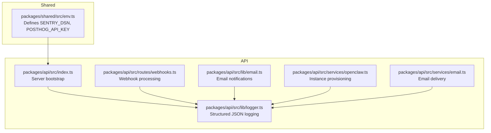
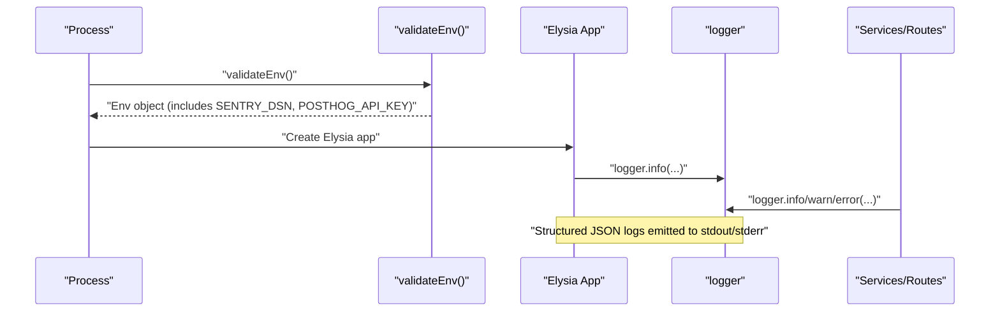
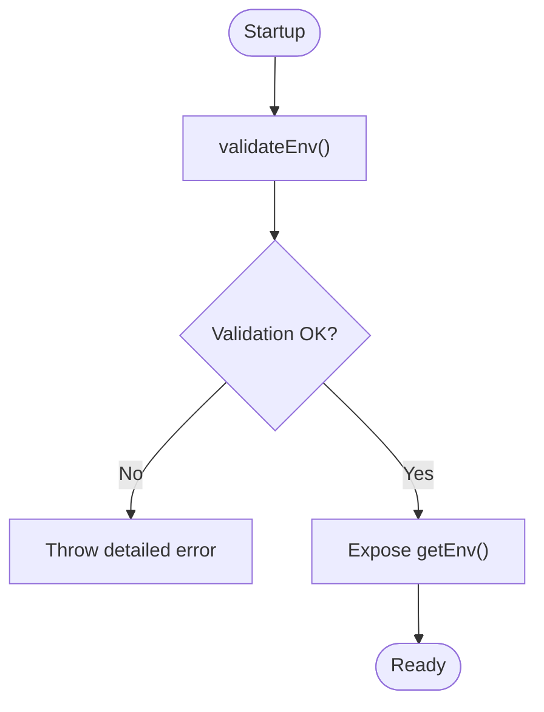
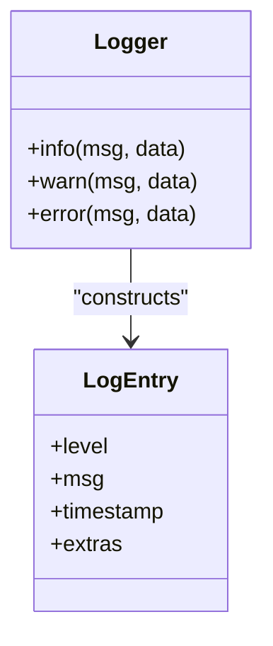
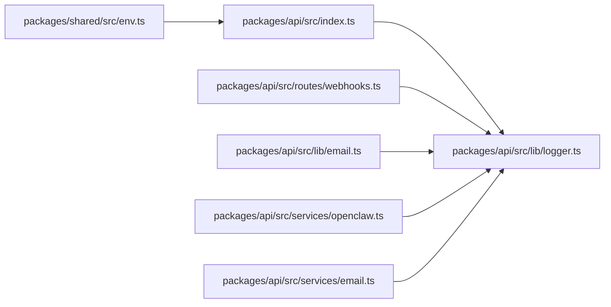

# Monitoring and Analytics Integration

<cite>
**Referenced Files in This Document**
- [env.ts](file://packages/shared/src/env.ts)
- [logger.ts](file://packages/api/src/lib/logger.ts)
- [logger.test.ts](file://packages/api/src/lib/__tests__/logger.test.ts)
- [index.ts](file://packages/api/src/index.ts)
- [email.ts](file://packages/api/src/lib/email.ts)
- [openclaw.ts](file://packages/api/src/services/openclaw.ts)
- [webhooks.ts](file://packages/api/src/routes/webhooks.ts)
- [email-service.ts](file://packages/api/src/services/email.ts)
- [quality-10-plan.md](file://docs/plans/2026-03-07-quality-10-plan.md)
- [quality-10-design.md](file://docs/plans/2026-03-07-quality-10-design.md)
- [PRD.md](file://PRD.md)
</cite>

## Table of Contents
1. [Introduction](#introduction)
2. [Project Structure](#project-structure)
3. [Core Components](#core-components)
4. [Architecture Overview](#architecture-overview)
5. [Detailed Component Analysis](#detailed-component-analysis)
6. [Dependency Analysis](#dependency-analysis)
7. [Performance Considerations](#performance-considerations)
8. [Troubleshooting Guide](#troubleshooting-guide)
9. [Conclusion](#conclusion)
10. [Appendices](#appendices)

## Introduction
This document describes the monitoring and analytics integration for SparkClaw, focusing on:
- Error tracking readiness via Sentry DSN configuration
- Performance monitoring readiness via PostHog API key configuration
- Structured logging implementation with log levels, contextual data, and timestamping
- Analytics data collection readiness via PostHog API key
- Operational dashboards, alerting, and incident response procedures
- Privacy, anonymization, and retention considerations
- Integration touchpoints with external monitoring and alerting systems

Where applicable, this document references concrete source files and highlights where Sentry and PostHog integrations are declared and validated.

## Project Structure
The monitoring and analytics surface spans the shared environment configuration and the API’s structured logging implementation. The environment variables for monitoring are defined centrally and consumed by the API server and services.

**Diagram sources**
- [env.ts](file://packages/shared/src/env.ts#L17-L18)
- [index.ts](file://packages/api/src/index.ts#L1-L25)
- [logger.ts](file://packages/api/src/lib/logger.ts#L1-L34)
- [webhooks.ts](file://packages/api/src/routes/webhooks.ts#L1-L50)
- [email.ts](file://packages/api/src/lib/email.ts#L1-L40)
- [openclaw.ts](file://packages/api/src/services/openclaw.ts#L1-L100)
- [email-service.ts](file://packages/api/src/services/email.ts#L1-L150)

**Section sources**
- [env.ts](file://packages/shared/src/env.ts#L1-L45)
- [index.ts](file://packages/api/src/index.ts#L1-L25)

## Core Components
- Environment configuration for monitoring:
  - Sentry DSN: optional environment variable for error reporting
  - PostHog API key: optional environment variable for analytics
- Structured logging:
  - JSON log entries with level, message, and timestamp
  - Optional contextual key-value pairs appended to each log entry
  - Separate console streams for info, warn, and error

These components provide the foundation for integrating Sentry and PostHog, as well as enabling robust observability and audit trails.

**Section sources**
- [env.ts](file://packages/shared/src/env.ts#L17-L18)
- [logger.ts](file://packages/api/src/lib/logger.ts#L1-L34)

## Architecture Overview
The API server validates environment variables at startup and initializes logging. Services and routes emit structured logs for operational events, webhook processing, and system health. Monitoring integrations (Sentry and PostHog) are gated by environment variables and can be wired in downstream.

**Diagram sources**
- [index.ts](file://packages/api/src/index.ts#L9-L22)
- [logger.ts](file://packages/api/src/lib/logger.ts#L29-L33)
- [env.ts](file://packages/shared/src/env.ts#L28-L44)

## Detailed Component Analysis

### Environment Configuration for Monitoring
- Purpose: Centralized validation and retrieval of environment variables, including optional keys for Sentry and PostHog.
- Behavior:
  - Validates presence and shape of variables at startup
  - Exposes a getter to access validated values
  - Sentry DSN and PostHog API key are optional, enabling gradual rollout or environment-specific toggles

**Diagram sources**
- [env.ts](file://packages/shared/src/env.ts#L28-L44)

**Section sources**
- [env.ts](file://packages/shared/src/env.ts#L17-L18)
- [env.ts](file://packages/shared/src/env.ts#L28-L44)

### Structured Logging Implementation
- Purpose: Provide a consistent, machine-readable log format across services and routes.
- Behavior:
  - Log levels: info, warn, error
  - Each entry includes a timestamp and arbitrary key-value data
  - Output is JSON serialized to the appropriate console stream

**Diagram sources**
- [logger.ts](file://packages/api/src/lib/logger.ts#L1-L34)

Operational usage examples across the codebase demonstrate:
- Startup logging with contextual metadata
- Webhook processing with structured error and success logs
- Email service notifications and error logs
- OpenClaw provisioning lifecycle events

**Section sources**
- [logger.ts](file://packages/api/src/lib/logger.ts#L1-L34)
- [logger.test.ts](file://packages/api/src/lib/__tests__/logger.test.ts#L1-L50)
- [index.ts](file://packages/api/src/index.ts#L21-L22)
- [webhooks.ts](file://packages/api/src/routes/webhooks.ts#L34-L45)
- [email.ts](file://packages/api/src/lib/email.ts#L31-L31)
- [email-service.ts](file://packages/api/src/services/email.ts#L38-L46)
- [openclaw.ts](file://packages/api/src/services/openclaw.ts#L51-L64)

### Analytics Data Collection Readiness
- Purpose: Enable analytics collection via PostHog by exposing its API key through environment configuration.
- Behavior:
  - API key is validated as optional
  - Analytics client initialization would occur in the frontend or backend depending on product needs
  - Recommended to anonymize identifiers and segment events by feature flags

[No sources needed since this section provides general guidance]

### Error Tracking Readiness (Sentry)
- Purpose: Enable error tracking via Sentry by supplying a DSN through environment configuration.
- Behavior:
  - DSN is validated as optional
  - Integration would initialize Sentry SDK at process startup and wrap handlers/services
  - Recommended to capture context, user identifiers (anonymized), and transaction metadata

[No sources needed since this section provides general guidance]

### Monitoring Dashboard Setup, Alerting, and Incident Response
- Dashboards:
  - Aggregate logs by level and contextual fields
  - Track webhook processing latency and failure rates
  - Monitor email delivery success and retry counts
  - Observe OpenClaw provisioning stages and error conditions
- Alerts:
  - High error rate thresholds for webhook processing
  - Elevated warning volume for email failures
  - Instance provisioning timeouts and repeated errors
- Incident Response:
  - Correlate logs with request IDs and user identifiers (anonymized)
  - Escalation thresholds and on-call rotations
  - Playbooks for common failure modes (Stripe webhooks, email delivery, provisioning)

[No sources needed since this section provides general guidance]

### Examples of Custom Metrics, Performance Indicators, and KPIs
- Custom metrics:
  - Webhook event processing duration and success rate
  - Email send attempts and delivery confirmations
  - OpenClaw instance creation time and readiness retries
- Performance indicators:
  - 95th percentile response times for API routes
  - Queue processing throughput and backlog
- Operational KPIs:
  - Customer onboarding completion rate
  - Support ticket volume and resolution time
  - Feature adoption and engagement segments

[No sources needed since this section provides general guidance]

### Data Privacy, Anonymization, and Retention
- Privacy:
  - Avoid logging personally identifiable information (PII)
  - Use anonymized identifiers for user and instance tracking
- Anonymization:
  - Redact or hash sensitive fields
  - Segment analytics by feature flags and cohorts without PII
- Retention:
  - Define log retention windows aligned with compliance
  - Archive or purge logs after retention periods

[No sources needed since this section provides general guidance]

### Integration with External Tools
- Log aggregation:
  - Forward JSON logs to log collectors (e.g., Fluent Bit, Vector, Logstash)
  - Index by level, service, and contextual fields for search and alerting
- Alerting:
  - Translate high-error-rate patterns into alerts
  - Integrate with PagerDuty, Slack, or email for escalations
- Analytics:
  - Initialize PostHog SDK in the frontend/backend as appropriate
  - Segment events by plan, feature flag, and cohort

[No sources needed since this section provides general guidance]

## Dependency Analysis
The API server depends on validated environment variables and uses the logger across services and routes. There are no circular dependencies in the monitored components.

**Diagram sources**
- [env.ts](file://packages/shared/src/env.ts#L28-L44)
- [index.ts](file://packages/api/src/index.ts#L1-L25)
- [logger.ts](file://packages/api/src/lib/logger.ts#L1-L34)
- [webhooks.ts](file://packages/api/src/routes/webhooks.ts#L1-L50)
- [email.ts](file://packages/api/src/lib/email.ts#L1-L40)
- [openclaw.ts](file://packages/api/src/services/openclaw.ts#L1-L100)
- [email-service.ts](file://packages/api/src/services/email.ts#L1-L150)

**Section sources**
- [env.ts](file://packages/shared/src/env.ts#L28-L44)
- [index.ts](file://packages/api/src/index.ts#L1-L25)

## Performance Considerations
- Logging overhead:
  - JSON serialization is lightweight; avoid excessive field nesting
  - Prefer compact contextual keys and avoid large payloads
- Throughput:
  - Ensure log collectors can ingest JSON logs efficiently
  - Use batching where appropriate in downstream systems
- Observability cost:
  - Tune sampling for analytics events
  - Limit high-cardinality fields in logs and analytics

[No sources needed since this section provides general guidance]

## Troubleshooting Guide
- Monitoring configuration issues:
  - Verify environment variables are present and correctly typed
  - Confirm optional keys (Sentry DSN, PostHog API key) are set only when needed
- False positive alerts:
  - Review alert thresholds and time windows
  - Add deduplication and noise filters for transient errors
- Performance degradation detection:
  - Monitor error spikes and increased latency
  - Correlate logs with contextual fields to isolate failing components

[No sources needed since this section provides general guidance]

## Conclusion
SparkClaw’s current implementation establishes a strong foundation for monitoring and analytics:
- Environment-driven configuration for Sentry and PostHog
- Consistent, structured logging across services and routes
- Clear pathways to integrate error tracking, analytics, dashboards, and alerting

Future work should focus on wiring the Sentry SDK and PostHog client, defining dashboards and alert rules, and establishing privacy and retention policies aligned with product needs.

## Appendices

### Appendix A: Environment Variables for Monitoring
- SENTRY_DSN: optional
- POSTHOG_API_KEY: optional

**Section sources**
- [env.ts](file://packages/shared/src/env.ts#L17-L18)

### Appendix B: Logging Usage Patterns Across the Codebase
- Startup logging with contextual metadata
- Webhook processing with structured error and success logs
- Email service notifications and error logs
- OpenClaw provisioning lifecycle events

**Section sources**
- [index.ts](file://packages/api/src/index.ts#L21-L22)
- [webhooks.ts](file://packages/api/src/routes/webhooks.ts#L34-L45)
- [email.ts](file://packages/api/src/lib/email.ts#L31-L31)
- [email-service.ts](file://packages/api/src/services/email.ts#L38-L46)
- [openclaw.ts](file://packages/api/src/services/openclaw.ts#L51-L64)

### Appendix C: Related Planning and Design References
- Environment validation and structured logging tasks
- Webhook error handling and logging emphasis

**Section sources**
- [quality-10-plan.md](file://docs/plans/2026-03-07-quality-10-plan.md#L22-L66)
- [quality-10-plan.md](file://docs/plans/2026-03-07-quality-10-plan.md#L642-L647)
- [quality-10-design.md](file://docs/plans/2026-03-07-quality-10-design.md#L30-L50)