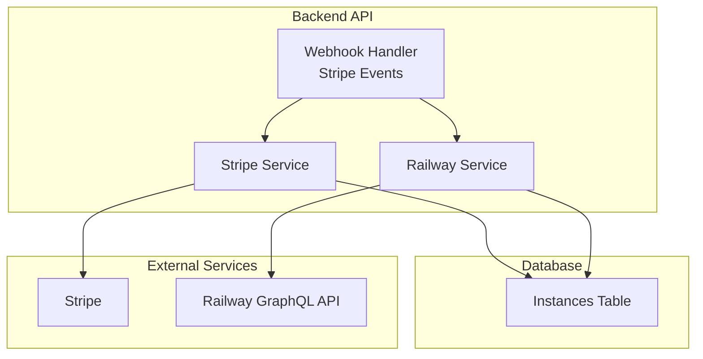
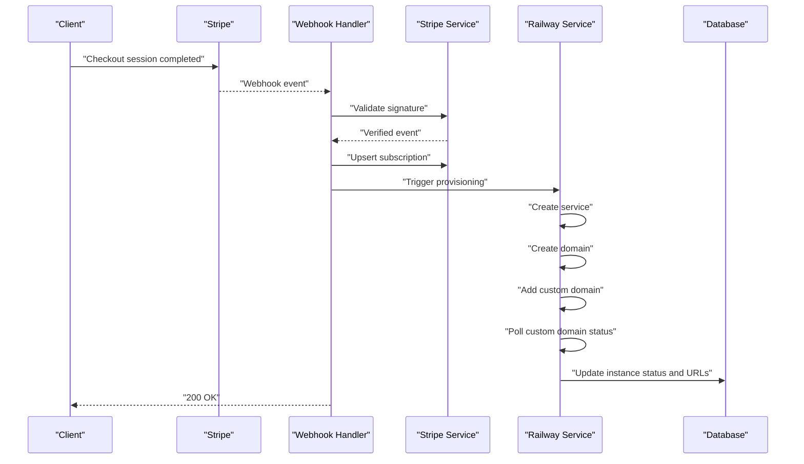
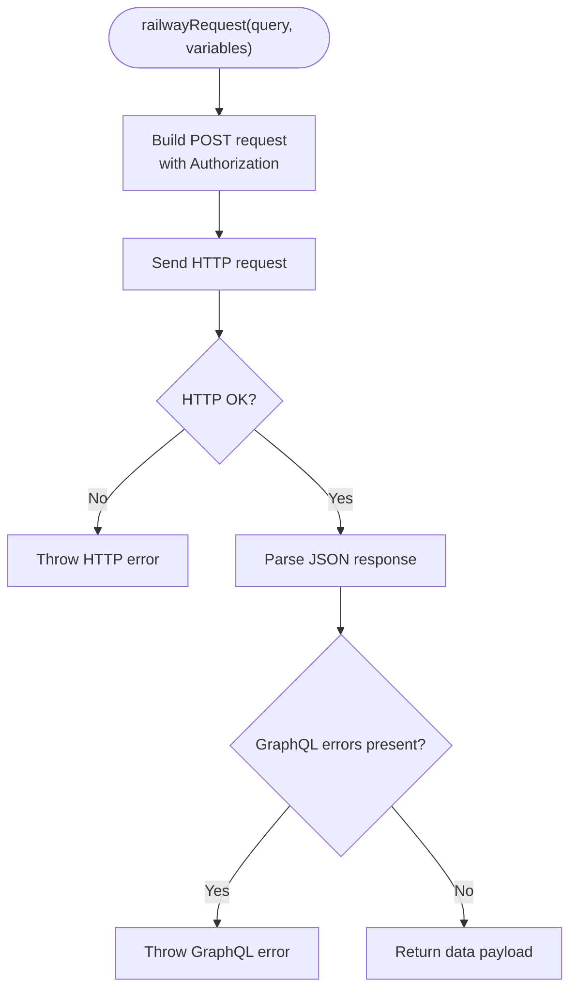
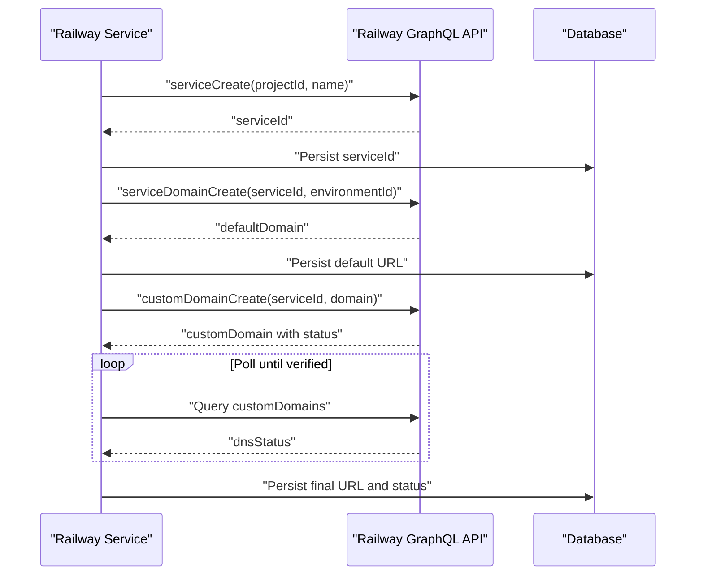
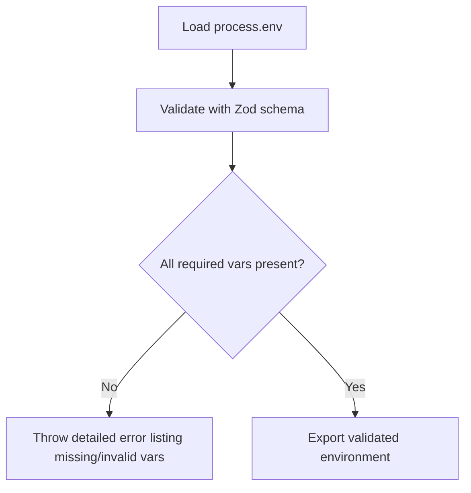
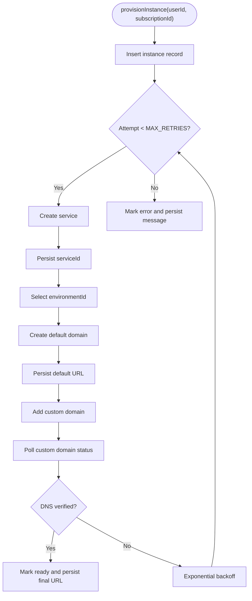
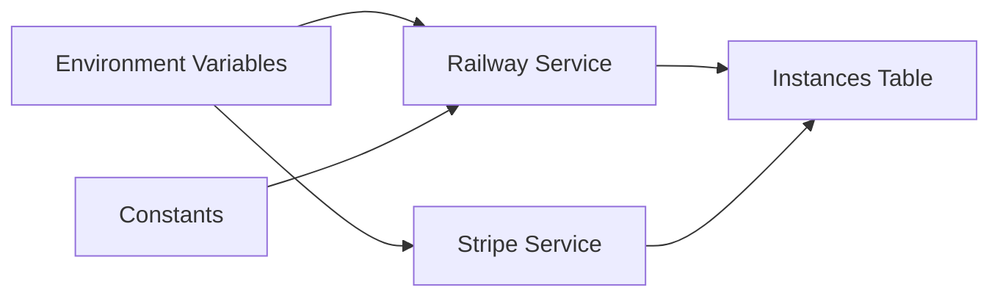

# Railway Cloud Integration

<cite>
**Referenced Files in This Document**
- [railway.ts](file://packages/api/src/services/railway.ts)
- [schema.ts](file://packages/shared/src/db/schema.ts)
- [constants.ts](file://packages/shared/src/constants.ts)
- [env.ts](file://packages/shared/src/env.ts)
- [webhooks.ts](file://packages/api/src/routes/webhooks.ts)
- [stripe.ts](file://packages/api/src/services/stripe.ts)
- [PRD.md](file://PRD.md)
</cite>

## Table of Contents
1. [Introduction](#introduction)
2. [Project Structure](#project-structure)
3. [Core Components](#core-components)
4. [Architecture Overview](#architecture-overview)
5. [Detailed Component Analysis](#detailed-component-analysis)
6. [Dependency Analysis](#dependency-analysis)
7. [Performance Considerations](#performance-considerations)
8. [Troubleshooting Guide](#troubleshooting-guide)
9. [Conclusion](#conclusion)
10. [Appendices](#appendices)

## Introduction
This document explains the Railway cloud hosting integration for the SparkClaw platform. It covers the GraphQL API integration for provisioning OpenClaw instances, the service deployment process, background job handling, status monitoring, and operational procedures. It also documents environment configuration, instance lifecycle management, and troubleshooting guidance for common deployment issues.

## Project Structure
The integration spans three primary areas:
- Railway GraphQL service wrapper and provisioning orchestration
- Database schema for instance tracking and status
- Stripe webhook integration that triggers provisioning



**Diagram sources**
- [webhooks.ts](file://packages/api/src/routes/webhooks.ts#L1-L49)
- [stripe.ts](file://packages/api/src/services/stripe.ts#L1-L50)
- [railway.ts](file://packages/api/src/services/railway.ts#L1-L34)
- [schema.ts](file://packages/shared/src/db/schema.ts#L105-L137)

**Section sources**
- [webhooks.ts](file://packages/api/src/routes/webhooks.ts#L1-L49)
- [stripe.ts](file://packages/api/src/services/stripe.ts#L1-L50)
- [railway.ts](file://packages/api/src/services/railway.ts#L1-L34)
- [schema.ts](file://packages/shared/src/db/schema.ts#L105-L137)

## Core Components
- Railway GraphQL integration: encapsulated in a single module that handles authentication, request formatting, and response parsing.
- Provisioning orchestration: creates Railway services, assigns domains, tracks status, and applies retry/backoff logic.
- Database persistence: stores instance metadata, status, URLs, and error messages.
- Stripe webhook integration: triggers provisioning upon successful checkout completion.

Key responsibilities:
- Construct GraphQL queries and mutations for service creation, domain assignment, and status polling.
- Manage environment selection and domain generation.
- Persist provisioning outcomes and errors to the database.
- Coordinate asynchronous provisioning via webhook-driven flows.

**Section sources**
- [railway.ts](file://packages/api/src/services/railway.ts#L11-L34)
- [railway.ts](file://packages/api/src/services/railway.ts#L45-L63)
- [railway.ts](file://packages/api/src/services/railway.ts#L65-L81)
- [railway.ts](file://packages/api/src/services/railway.ts#L84-L104)
- [railway.ts](file://packages/api/src/services/railway.ts#L107-L129)
- [railway.ts](file://packages/api/src/services/railway.ts#L131-L146)
- [railway.ts](file://packages/api/src/services/railway.ts#L148-L171)
- [railway.ts](file://packages/api/src/services/railway.ts#L177-L291)
- [schema.ts](file://packages/shared/src/db/schema.ts#L105-L137)
- [webhooks.ts](file://packages/api/src/routes/webhooks.ts#L1-L49)
- [stripe.ts](file://packages/api/src/services/stripe.ts#L45-L50)

## Architecture Overview
The provisioning flow begins when Stripe reports a successful checkout. The webhook handler validates the event, persists subscription data, and triggers asynchronous provisioning. The Railway service wrapper performs GraphQL operations to create services and domains, then polls for readiness. Results are written to the database and surfaced to the user interface.



**Diagram sources**
- [webhooks.ts](file://packages/api/src/routes/webhooks.ts#L6-L48)
- [stripe.ts](file://packages/api/src/services/stripe.ts#L45-L50)
- [railway.ts](file://packages/api/src/services/railway.ts#L177-L291)
- [schema.ts](file://packages/shared/src/db/schema.ts#L105-L137)

## Detailed Component Analysis

### Railway GraphQL Integration
The Railway service module encapsulates all GraphQL interactions:
- Authentication: uses a bearer token from environment variables.
- Request construction: wraps queries and mutations with variables.
- Response handling: validates HTTP status and parses GraphQL errors.
- Domain management: supports default Railway domains and custom domains.



**Diagram sources**
- [railway.ts](file://packages/api/src/services/railway.ts#L13-L34)

**Section sources**
- [railway.ts](file://packages/api/src/services/railway.ts#L11-L34)

### Service Creation and Domain Assignment
Service creation and domain assignment are performed via GraphQL mutations:
- Create a Railway service within a specified project.
- Create a default Railway domain for the service in the selected environment.
- Assign a custom domain to the service and poll for DNS verification readiness.



**Diagram sources**
- [railway.ts](file://packages/api/src/services/railway.ts#L45-L63)
- [railway.ts](file://packages/api/src/services/railway.ts#L65-L81)
- [railway.ts](file://packages/api/src/services/railway.ts#L84-L104)
- [railway.ts](file://packages/api/src/services/railway.ts#L107-L129)
- [railway.ts](file://packages/api/src/services/railway.ts#L131-L146)
- [railway.ts](file://packages/api/src/services/railway.ts#L148-L171)
- [railway.ts](file://packages/api/src/services/railway.ts#L177-L291)

**Section sources**
- [railway.ts](file://packages/api/src/services/railway.ts#L45-L63)
- [railway.ts](file://packages/api/src/services/railway.ts#L65-L81)
- [railway.ts](file://packages/api/src/services/railway.ts#L84-L104)
- [railway.ts](file://packages/api/src/services/railway.ts#L107-L129)
- [railway.ts](file://packages/api/src/services/railway.ts#L131-L146)
- [railway.ts](file://packages/api/src/services/railway.ts#L148-L171)
- [railway.ts](file://packages/api/src/services/railway.ts#L177-L291)

### Database Schema for Instances
The instances table captures provisioning state, URLs, and error information. It maintains referential integrity with users and subscriptions.

```mermaid
erDiagram
USERS ||--o| SUBSCRIPTIONS : "owns"
SUBSCRIPTIONS ||--o| INSTANCES : "creates"
INSTANCES {
uuid id PK
uuid user_id FK
uuid subscription_id FK UK
varchar railway_project_id
varchar railway_service_id
varchar custom_domain
text railway_url
text url
varchar status
varchar domain_status
text error_message
timestamptz created_at
timestamptz updated_at
}
```

**Diagram sources**
- [schema.ts](file://packages/shared/src/db/schema.ts#L105-L137)

**Section sources**
- [schema.ts](file://packages/shared/src/db/schema.ts#L105-L137)

### Environment Variable Management
Environment validation ensures required variables are present and correctly formatted. Railway-specific variables include the API token and project identifier.



**Diagram sources**
- [env.ts](file://packages/shared/src/env.ts#L28-L39)

**Section sources**
- [env.ts](file://packages/shared/src/env.ts#L1-L41)

### Background Job and Retry Logic
Provisioning runs asynchronously after Stripe webhook processing. It retries transient failures with exponential backoff and falls back to polling for domain readiness.



**Diagram sources**
- [railway.ts](file://packages/api/src/services/railway.ts#L177-L291)
- [constants.ts](file://packages/shared/src/constants.ts#L25-L28)

**Section sources**
- [railway.ts](file://packages/api/src/services/railway.ts#L177-L291)
- [constants.ts](file://packages/shared/src/constants.ts#L25-L28)

### Status Monitoring and Health Checks
- UI polling: the dashboard polls the instance endpoint while status remains pending.
- Backend monitoring: future enhancements include periodic pings and uptime reporting.
- Error visibility: database captures error messages for user-facing troubleshooting.

**Section sources**
- [PRD.md](file://PRD.md#L158-L166)
- [PRD.md](file://PRD.md#L738-L747)
- [schema.ts](file://packages/shared/src/db/schema.ts#L124-L126)

## Dependency Analysis
- Railway service depends on environment variables for authentication and project selection.
- Provisioning depends on database state to track progress and outcomes.
- Stripe webhook integration depends on validated environment variables and database consistency.
- Constants define retry and polling behavior for provisioning.



**Diagram sources**
- [env.ts](file://packages/shared/src/env.ts#L1-L41)
- [railway.ts](file://packages/api/src/services/railway.ts#L1-L11)
- [constants.ts](file://packages/shared/src/constants.ts#L25-L28)
- [schema.ts](file://packages/shared/src/db/schema.ts#L105-L137)

**Section sources**
- [env.ts](file://packages/shared/src/env.ts#L1-L41)
- [railway.ts](file://packages/api/src/services/railway.ts#L1-L11)
- [constants.ts](file://packages/shared/src/constants.ts#L25-L28)
- [schema.ts](file://packages/shared/src/db/schema.ts#L105-L137)

## Performance Considerations
- Provisioning timeouts and polling intervals are tuned to balance responsiveness and API load.
- Exponential backoff reduces pressure on external APIs during transient failures.
- Database writes are minimized to essential updates to reduce contention.

[No sources needed since this section provides general guidance]

## Troubleshooting Guide
Common issues and resolutions:
- Provisioning timeout: verify Railway API availability and environment selection; check domain polling logic.
- GraphQL errors: inspect returned error messages and ensure correct query variables.
- Missing environment variables: confirm token and project ID are set and validated.
- Stripe webhook failures: validate signatures and ensure idempotent handling.

Operational steps:
- Review database instance records for status and error messages.
- Manually re-run provisioning if necessary.
- Monitor logs for structured error traces.

**Section sources**
- [railway.ts](file://packages/api/src/services/railway.ts#L23-L31)
- [railway.ts](file://packages/api/src/services/railway.ts#L177-L291)
- [env.ts](file://packages/shared/src/env.ts#L28-L39)
- [webhooks.ts](file://packages/api/src/routes/webhooks.ts#L16-L44)
- [schema.ts](file://packages/shared/src/db/schema.ts#L124-L126)

## Conclusion
The Railway integration is centered on a robust GraphQL wrapper, deterministic provisioning orchestration, and resilient status tracking. By combining webhook-driven triggers, exponential backoff, and database persistence, the system achieves reliable instance provisioning with clear observability and straightforward troubleshooting pathways.

[No sources needed since this section summarizes without analyzing specific files]

## Appendices

### Service Configuration Examples
- Railway API token and project ID must be configured in environment variables.
- Custom domain root is configurable for generating user-facing URLs.

**Section sources**
- [env.ts](file://packages/shared/src/env.ts#L10-L11)
- [env.ts](file://packages/shared/src/env.ts#L20)
- [railway.ts](file://packages/api/src/services/railway.ts#L37-L43)

### Environment Management Best Practices
- Validate environment variables at startup.
- Keep secrets out of source code; use secure storage and rotation policies.
- Use separate environments per deployment stage.

**Section sources**
- [env.ts](file://packages/shared/src/env.ts#L28-L39)
- [PRD.md](file://PRD.md#L639-L651)

### Resource Allocation and Scaling
- Instance lifecycle: creation, readiness, suspension, and termination are reflected in status fields.
- Scaling operations are not implemented in V0; future phases will introduce control panel features.

**Section sources**
- [schema.ts](file://packages/shared/src/db/schema.ts#L124-L125)
- [PRD.md](file://PRD.md#L317-L326)

### Instance Lifecycle Management
- Creation: insert instance record, create service, assign domains.
- Readiness: update status and URLs when domains are verified.
- Suspension: handled via subscription cancellation events.
- Termination: manual action in V0; future phases will include automated shutdown.

**Section sources**
- [railway.ts](file://packages/api/src/services/railway.ts#L177-L291)
- [webhooks.ts](file://packages/api/src/routes/webhooks.ts#L24-L33)
- [PRD.md](file://PRD.md#L317-L326)