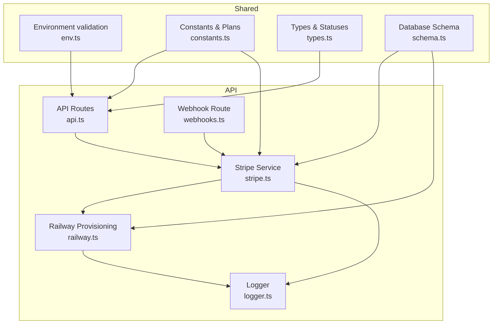
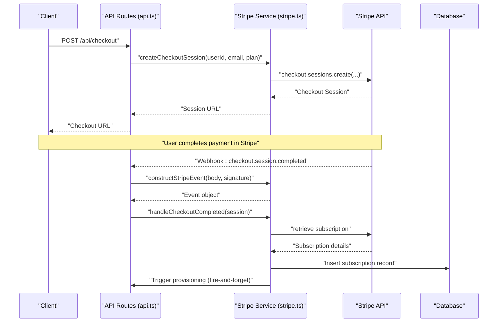
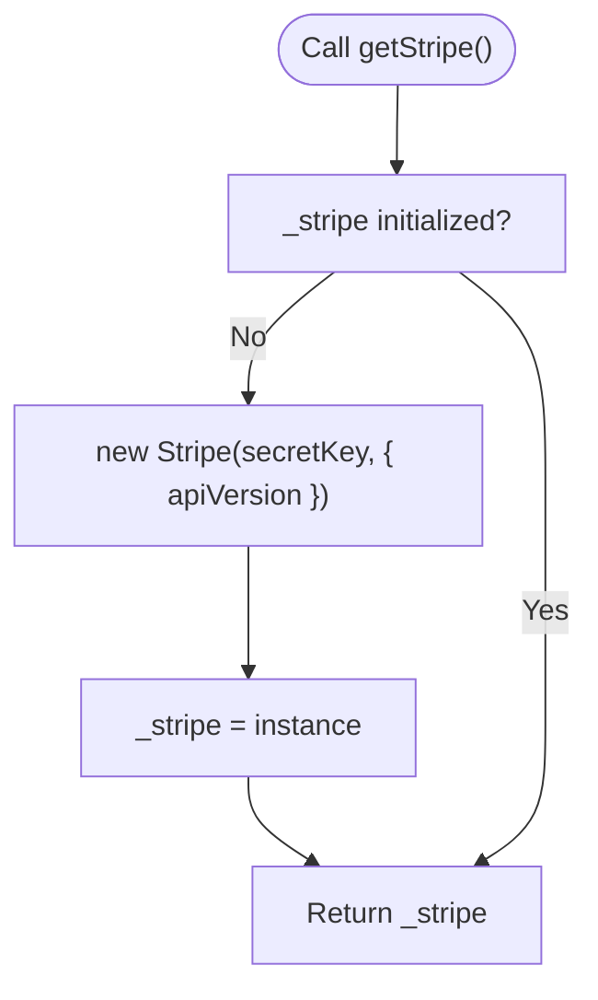
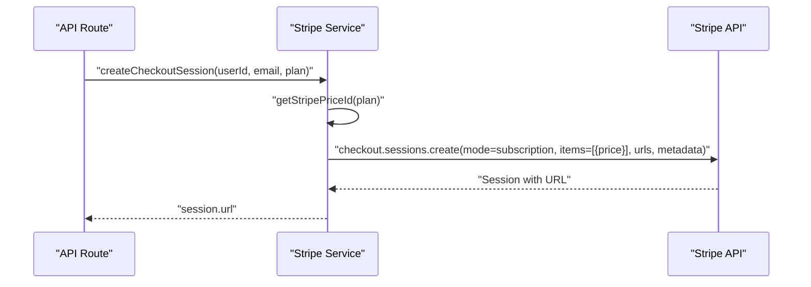
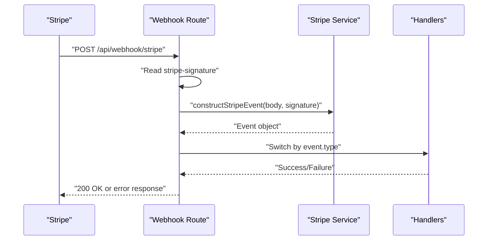
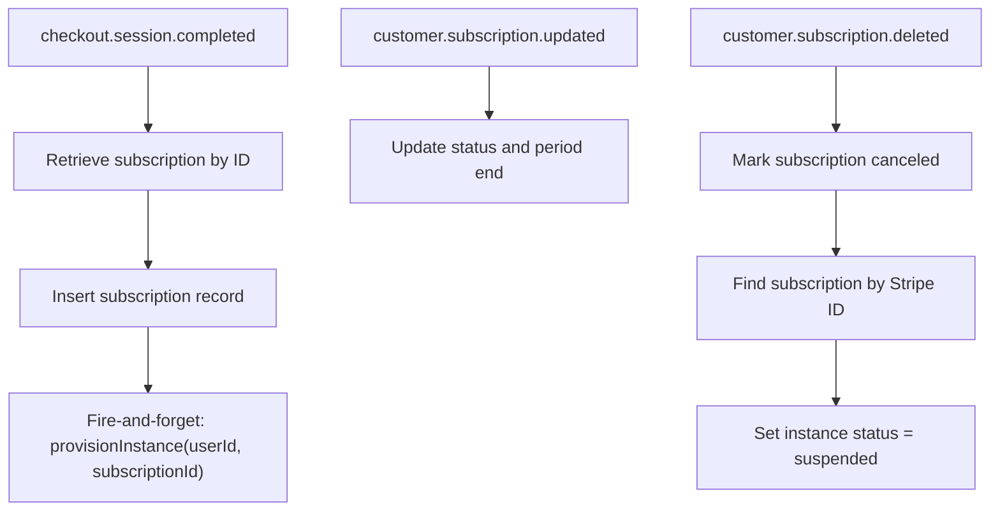
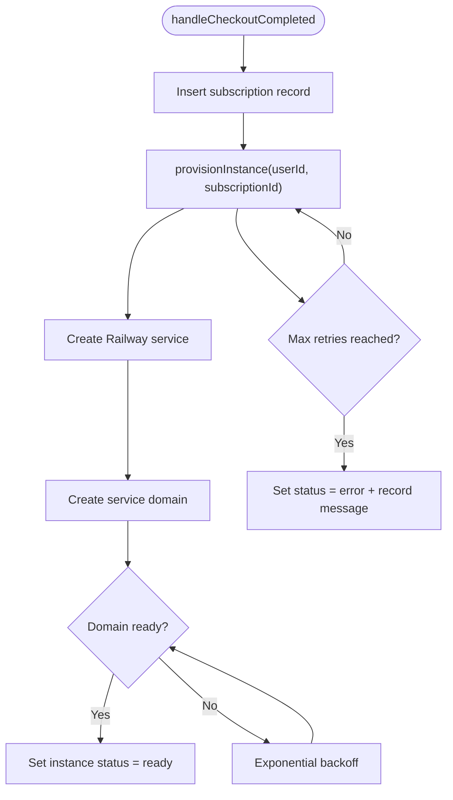
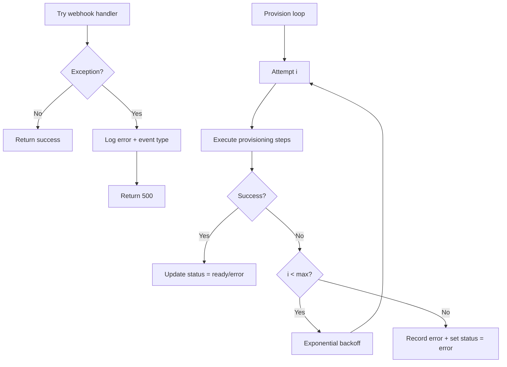
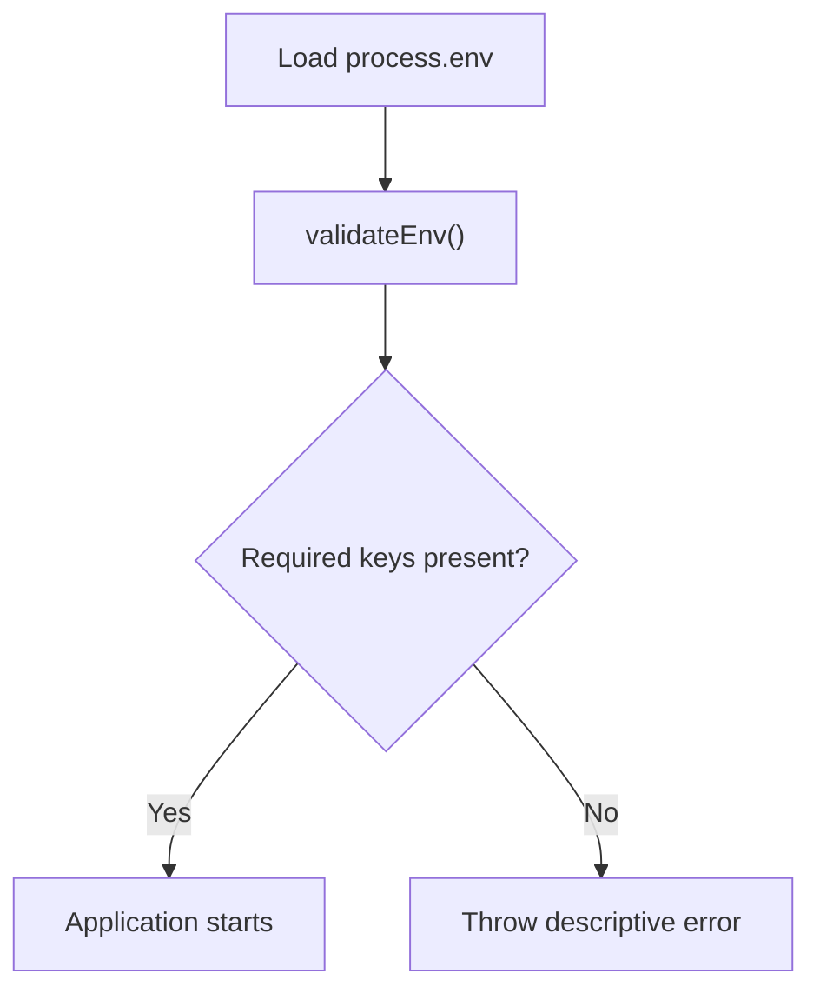
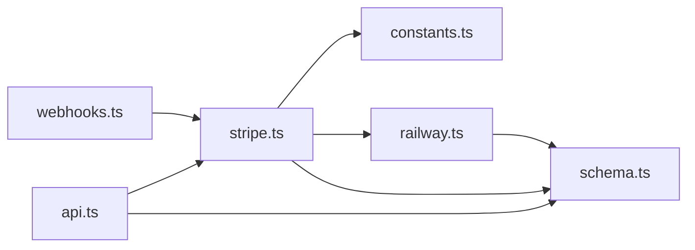

# Stripe Payment Integration

<cite>
**Referenced Files in This Document**
- [stripe.ts](file://packages/api/src/services/stripe.ts)
- [webhooks.ts](file://packages/api/src/routes/webhooks.ts)
- [api.ts](file://packages/api/src/routes/api.ts)
- [constants.ts](file://packages/shared/src/constants.ts)
- [env.ts](file://packages/shared/src/env.ts)
- [types.ts](file://packages/shared/src/types.ts)
- [railway.ts](file://packages/api/src/services/railway.ts)
- [schema.ts](file://packages/shared/src/db/schema.ts)
- [logger.ts](file://packages/api/src/lib/logger.ts)
- [2026-03-07-quality-10-plan.md](file://docs/plans/2026-03-07-quality-10-plan.md)
- [PRD.md](file://PRD.md)
</cite>

## Table of Contents
1. [Introduction](#introduction)
2. [Project Structure](#project-structure)
3. [Core Components](#core-components)
4. [Architecture Overview](#architecture-overview)
5. [Detailed Component Analysis](#detailed-component-analysis)
6. [Dependency Analysis](#dependency-analysis)
7. [Performance Considerations](#performance-considerations)
8. [Troubleshooting Guide](#troubleshooting-guide)
9. [Conclusion](#conclusion)
10. [Appendices](#appendices)

## Introduction
This document explains the Stripe payment integration in SparkClaw, covering SDK initialization, API version configuration, client instantiation, checkout session creation, webhook event processing, subscription lifecycle management, automated provisioning, error handling, and operational guidance. It also documents environment variables, Stripe dashboard configuration, and synchronization of subscription status with the local database.

## Project Structure
The Stripe integration spans several modules:
- Shared environment validation and constants
- API routes for checkout and user data
- Stripe service for SDK initialization, session creation, and webhook event construction
- Webhook route for secure event delivery
- Railway service for automated instance provisioning
- Database schema for subscriptions and instances



**Diagram sources**
- [env.ts](file://packages/shared/src/env.ts#L1-L45)
- [constants.ts](file://packages/shared/src/constants.ts#L1-L28)
- [types.ts](file://packages/shared/src/types.ts#L28-L53)
- [schema.ts](file://packages/shared/src/db/schema.ts#L1-L146)
- [api.ts](file://packages/api/src/routes/api.ts#L1-L86)
- [webhooks.ts](file://packages/api/src/routes/webhooks.ts#L1-L49)
- [stripe.ts](file://packages/api/src/services/stripe.ts#L1-L107)
- [railway.ts](file://packages/api/src/services/railway.ts#L1-L291)
- [logger.ts](file://packages/api/src/lib/logger.ts#L1-L34)

**Section sources**
- [env.ts](file://packages/shared/src/env.ts#L1-L45)
- [constants.ts](file://packages/shared/src/constants.ts#L1-L28)
- [types.ts](file://packages/shared/src/types.ts#L28-L53)
- [schema.ts](file://packages/shared/src/db/schema.ts#L1-L146)
- [api.ts](file://packages/api/src/routes/api.ts#L1-L86)
- [webhooks.ts](file://packages/api/src/routes/webhooks.ts#L1-L49)
- [stripe.ts](file://packages/api/src/services/stripe.ts#L1-L107)
- [railway.ts](file://packages/api/src/services/railway.ts#L1-L291)
- [logger.ts](file://packages/api/src/lib/logger.ts#L1-L34)

## Core Components
- Stripe SDK initialization and API version configuration
- Checkout session creation with plan selection and metadata
- Webhook signature verification and event dispatch
- Subscription lifecycle handlers (created, updated, deleted)
- Automated provisioning trigger upon checkout completion
- Environment validation and secret management
- Database synchronization for subscriptions and instances

**Section sources**
- [stripe.ts](file://packages/api/src/services/stripe.ts#L11-L26)
- [stripe.ts](file://packages/api/src/services/stripe.ts#L28-L43)
- [webhooks.ts](file://packages/api/src/routes/webhooks.ts#L6-L48)
- [stripe.ts](file://packages/api/src/services/stripe.ts#L45-L106)
- [env.ts](file://packages/shared/src/env.ts#L3-L22)
- [schema.ts](file://packages/shared/src/db/schema.ts#L71-L137)

## Architecture Overview
The integration follows a request-driven flow for checkout and a webhook-driven flow for lifecycle events. The API validates environment variables, creates Stripe checkout sessions, and persists subscription records. Webhooks update statuses and trigger provisioning.



**Diagram sources**
- [api.ts](file://packages/api/src/routes/api.ts#L76-L85)
- [stripe.ts](file://packages/api/src/services/stripe.ts#L28-L43)
- [webhooks.ts](file://packages/api/src/routes/webhooks.ts#L24-L27)
- [stripe.ts](file://packages/api/src/services/stripe.ts#L45-L72)
- [schema.ts](file://packages/shared/src/db/schema.ts#L71-L96)

## Detailed Component Analysis

### Stripe SDK Initialization and API Version
- SDK client is lazily initialized with the secret key and configured to a specific API version.
- The API version ensures compatibility with features used in the integration.



**Diagram sources**
- [stripe.ts](file://packages/api/src/services/stripe.ts#L11-L18)

**Section sources**
- [stripe.ts](file://packages/api/src/services/stripe.ts#L11-L18)

### Checkout Session Creation
- Plan selection is resolved via environment variables for price IDs.
- Session includes customer email, single-line item with selected price, success and cancel URLs, and metadata containing user ID and plan.
- Returns the hosted checkout session URL.



**Diagram sources**
- [stripe.ts](file://packages/api/src/services/stripe.ts#L28-L43)
- [constants.ts](file://packages/shared/src/constants.ts#L3-L8)
- [api.ts](file://packages/api/src/routes/api.ts#L76-L85)

**Section sources**
- [stripe.ts](file://packages/api/src/services/stripe.ts#L28-L43)
- [constants.ts](file://packages/shared/src/constants.ts#L3-L8)
- [api.ts](file://packages/api/src/routes/api.ts#L76-L85)

### Webhook Event Processing
- Validates presence of the Stripe signature header.
- Verifies signature using the webhook secret.
- Dispatches to handlers based on event type.
- Handles errors with logging and appropriate HTTP status codes.



**Diagram sources**
- [webhooks.ts](file://packages/api/src/routes/webhooks.ts#L6-L48)
- [stripe.ts](file://packages/api/src/services/stripe.ts#L20-L26)

**Section sources**
- [webhooks.ts](file://packages/api/src/routes/webhooks.ts#L6-L48)
- [stripe.ts](file://packages/api/src/services/stripe.ts#L20-L26)

### Subscription Lifecycle Management
- On checkout completion, the service retrieves the subscription, inserts a new record into the subscriptions table, and triggers provisioning asynchronously.
- On subscription updates, the service updates status and period end timestamp.
- On subscription deletion, the service marks the subscription as canceled and suspends the associated instance.



**Diagram sources**
- [stripe.ts](file://packages/api/src/services/stripe.ts#L45-L106)
- [railway.ts](file://packages/api/src/services/railway.ts#L177-L291)
- [schema.ts](file://packages/shared/src/db/schema.ts#L71-L137)

**Section sources**
- [stripe.ts](file://packages/api/src/services/stripe.ts#L45-L106)
- [railway.ts](file://packages/api/src/services/railway.ts#L177-L291)
- [schema.ts](file://packages/shared/src/db/schema.ts#L71-L137)

### Automated Provisioning Trigger
- Upon successful checkout completion, the system inserts a subscription record and immediately triggers provisioning in the background.
- Provisioning creates a Railway service, sets up domains, polls for readiness, and updates instance status accordingly.
- Implements exponential backoff and a fixed number of retries with error recording.



**Diagram sources**
- [stripe.ts](file://packages/api/src/services/stripe.ts#L68-L72)
- [railway.ts](file://packages/api/src/services/railway.ts#L177-L291)

**Section sources**
- [stripe.ts](file://packages/api/src/services/stripe.ts#L68-L72)
- [railway.ts](file://packages/api/src/services/railway.ts#L177-L291)

### Error Handling, Retries, and Fallbacks
- Webhook route wraps event handling in try/catch, logs errors, and returns 500 on failure.
- Provisioning uses bounded retries with exponential backoff and stores the last error message.
- Constants define retry limits and polling intervals.



**Diagram sources**
- [webhooks.ts](file://packages/api/src/routes/webhooks.ts#L37-L44)
- [railway.ts](file://packages/api/src/services/railway.ts#L198-L291)

**Section sources**
- [webhooks.ts](file://packages/api/src/routes/webhooks.ts#L37-L44)
- [railway.ts](file://packages/api/src/services/railway.ts#L198-L291)
- [constants.ts](file://packages/shared/src/constants.ts#L25-L28)

### Environment Variables and Security
- Environment validation enforces presence and format of secrets and keys.
- Stripe price IDs are loaded from environment variables keyed by plan.
- CSRF middleware excludes webhook endpoints from CSRF checks.



**Diagram sources**
- [env.ts](file://packages/shared/src/env.ts#L28-L39)
- [constants.ts](file://packages/shared/src/constants.ts#L3-L8)
- [2026-03-07-quality-10-plan.md](file://docs/plans/2026-03-07-quality-10-plan.md#L28-L43)

**Section sources**
- [env.ts](file://packages/shared/src/env.ts#L28-L39)
- [constants.ts](file://packages/shared/src/constants.ts#L3-L8)
- [2026-03-07-quality-10-plan.md](file://docs/plans/2026-03-07-quality-10-plan.md#L28-L43)

### Database Synchronization and Real-Time Updates
- Subscriptions table stores Stripe identifiers, plan, status, and period end timestamps.
- Instances table links to subscriptions and tracks provisioning status and URLs.
- Handlers update records upon webhook events, ensuring local state reflects Stripe.

```mermaid
erDiagram
USERS {
uuid id PK
varchar email UK
timestamptz created_at
timestamptz updated_at
}
SUBSCRIPTIONS {
uuid id PK
uuid user_id FK
varchar plan
varchar stripe_customer_id
varchar stripe_subscription_id UK
varchar status
timestamptz current_period_end
timestamptz created_at
timestamptz updated_at
}
INSTANCES {
uuid id PK
uuid user_id FK
uuid subscription_id FK UK
varchar railway_project_id
varchar railway_service_id
varchar custom_domain
text railway_url
text url
varchar status
varchar domain_status
text error_message
timestamptz created_at
timestamptz updated_at
}
USERS ||--o| SUBSCRIPTIONS : "has"
SUBSCRIPTIONS ||--o| INSTANCES : "provisions"
```

**Diagram sources**
- [schema.ts](file://packages/shared/src/db/schema.ts#L14-L146)

**Section sources**
- [schema.ts](file://packages/shared/src/db/schema.ts#L71-L137)
- [stripe.ts](file://packages/api/src/services/stripe.ts#L74-L106)

## Dependency Analysis
- API routes depend on Stripe service for checkout and on database for queries.
- Stripe service depends on shared constants for price resolution and database for persistence.
- Webhook route depends on Stripe service for event verification and dispatch.
- Railway service depends on database and environment for provisioning.



**Diagram sources**
- [api.ts](file://packages/api/src/routes/api.ts#L1-L86)
- [stripe.ts](file://packages/api/src/services/stripe.ts#L1-L107)
- [constants.ts](file://packages/shared/src/constants.ts#L1-L28)
- [schema.ts](file://packages/shared/src/db/schema.ts#L1-L146)
- [railway.ts](file://packages/api/src/services/railway.ts#L1-L291)
- [webhooks.ts](file://packages/api/src/routes/webhooks.ts#L1-L49)

**Section sources**
- [api.ts](file://packages/api/src/routes/api.ts#L1-L86)
- [stripe.ts](file://packages/api/src/services/stripe.ts#L1-L107)
- [constants.ts](file://packages/shared/src/constants.ts#L1-L28)
- [schema.ts](file://packages/shared/src/db/schema.ts#L1-L146)
- [railway.ts](file://packages/api/src/services/railway.ts#L1-L291)
- [webhooks.ts](file://packages/api/src/routes/webhooks.ts#L1-L49)

## Performance Considerations
- Lazy initialization of the Stripe client avoids unnecessary overhead.
- Fire-and-forget provisioning prevents checkout latency while still triggering background work.
- Exponential backoff reduces load during transient failures in provisioning.
- Database indexes on foreign keys and status fields optimize frequent queries.

[No sources needed since this section provides general guidance]

## Troubleshooting Guide
- Verify environment variables are loaded and validated at startup.
- Confirm webhook endpoint receives the stripe-signature header and uses the correct webhook secret.
- Inspect logs for webhook processing errors and provisioning attempts.
- For checkout failures, confirm plan price IDs are set and success/cancel URLs are correct.
- For provisioning failures, review retry logs and error messages stored in the instances table.

**Section sources**
- [env.ts](file://packages/shared/src/env.ts#L28-L39)
- [webhooks.ts](file://packages/api/src/routes/webhooks.ts#L6-L48)
- [logger.ts](file://packages/api/src/lib/logger.ts#L29-L33)
- [railway.ts](file://packages/api/src/services/railway.ts#L266-L291)

## Conclusion
The Stripe integration in SparkClaw is structured around a robust checkout flow, secure webhook processing, and automated provisioning. Environment validation and strict typing ensure reliability. Subscription and instance states remain synchronized through dedicated handlers and database relations.

[No sources needed since this section summarizes without analyzing specific files]

## Appendices

### Environment Variables and Stripe Dashboard Configuration
- Required environment variables include database URL, Stripe secret and webhook secrets, plan price IDs, Railway tokens and project ID, resend key, session secret, web URL, port, and optional observability keys.
- Configure Stripe webhook endpoints in the dashboard to deliver events to the webhook route.
- Set plan price IDs per plan in the environment and ensure they match Stripe product configuration.

**Section sources**
- [env.ts](file://packages/shared/src/env.ts#L3-L22)
- [2026-03-07-quality-10-plan.md](file://docs/plans/2026-03-07-quality-10-plan.md#L28-L43)

### API Definitions and Request/Response
- POST /api/checkout: Accepts a plan value and returns a checkout session URL.
- GET /api/me: Returns user profile and subscription status.
- GET /api/instance: Returns instance details linked to the user’s subscription.

**Section sources**
- [api.ts](file://packages/api/src/routes/api.ts#L76-L85)
- [api.ts](file://packages/api/src/routes/api.ts#L34-L75)

### Webhook Testing and Event Debugging
- Use Stripe CLI to forward webhook events to your local endpoint.
- Validate signatures using the webhook secret.
- Monitor logs for handled/unhandled events and errors.

**Section sources**
- [webhooks.ts](file://packages/api/src/routes/webhooks.ts#L6-L48)
- [logger.ts](file://packages/api/src/lib/logger.ts#L29-L33)

### Integration Validation Checklist
- Environment variables validated at startup.
- Checkout session creation succeeds with correct plan and URLs.
- Webhook signature verification passes.
- Subscription inserted and updated on lifecycle events.
- Provisioning triggered and progresses through statuses.

**Section sources**
- [env.ts](file://packages/shared/src/env.ts#L28-L39)
- [stripe.ts](file://packages/api/src/services/stripe.ts#L28-L43)
- [webhooks.ts](file://packages/api/src/routes/webhooks.ts#L24-L36)
- [railway.ts](file://packages/api/src/services/railway.ts#L177-L291)