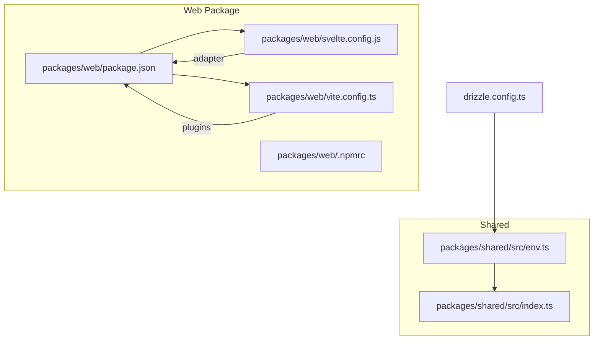
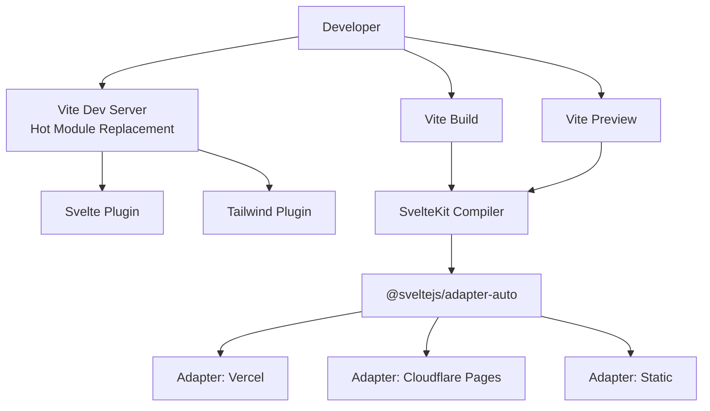
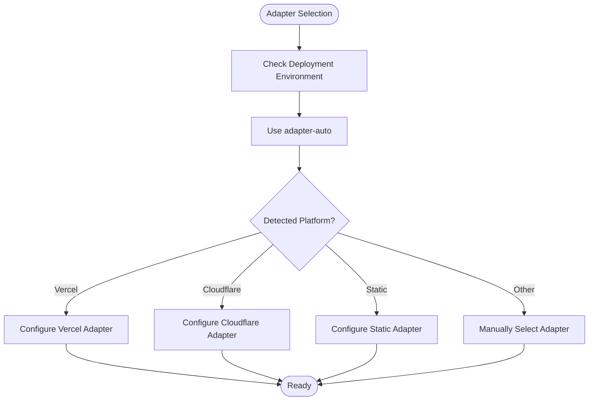
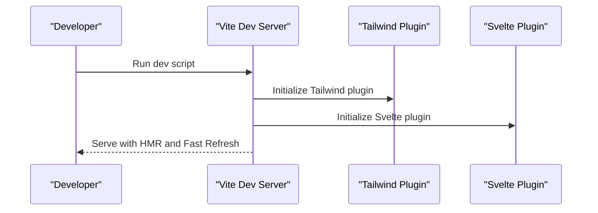
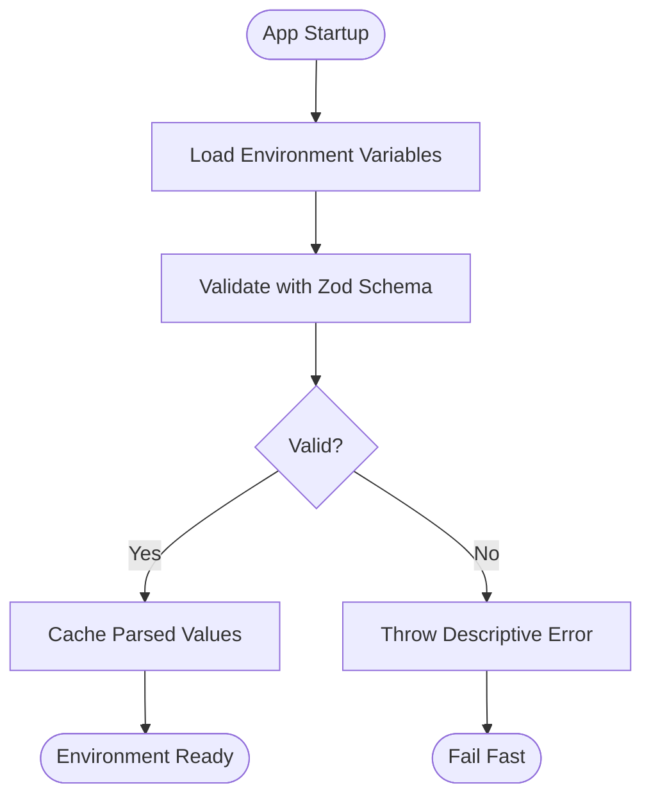
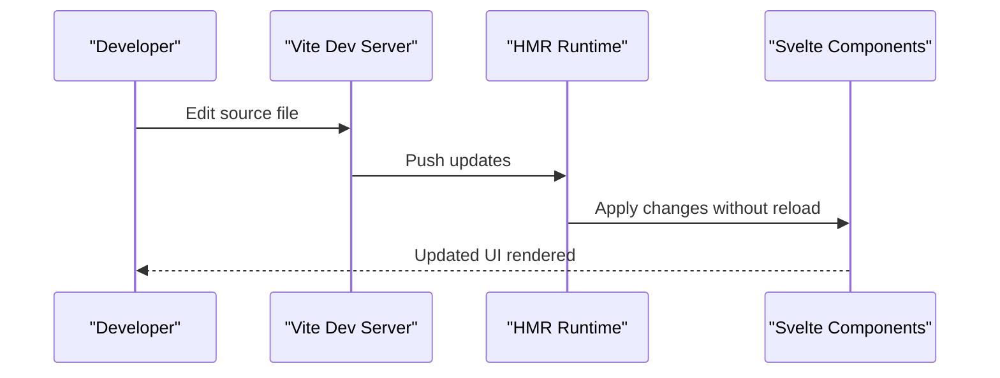
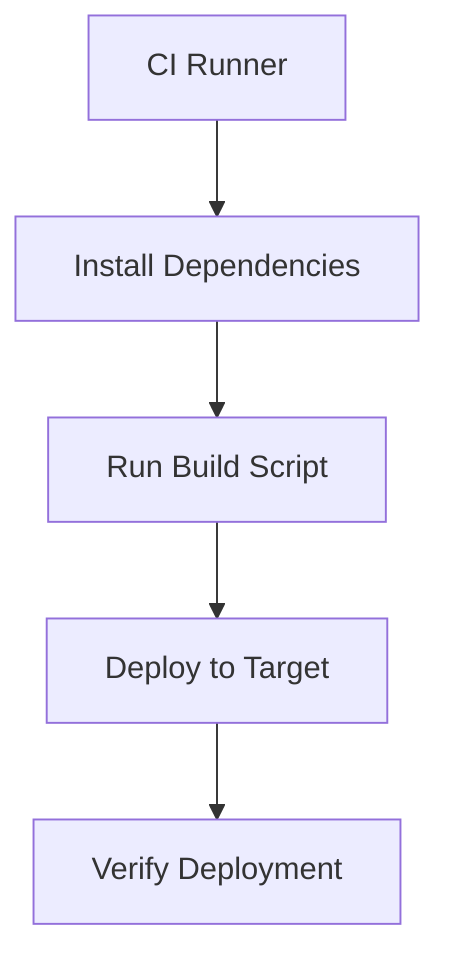
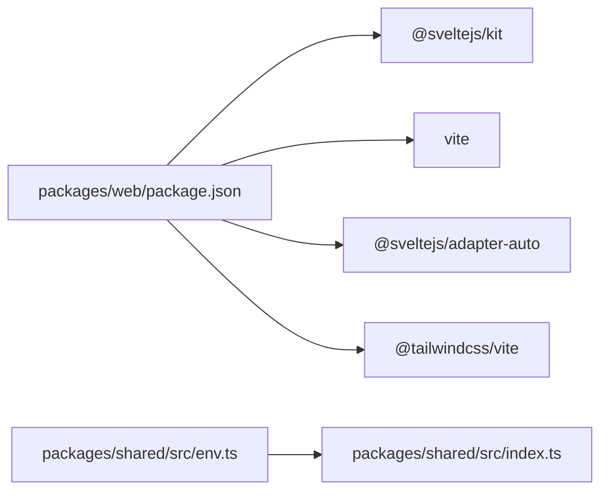

# Build and Deployment

<cite>
**Referenced Files in This Document**
- [package.json](file://packages/web/package.json)
- [svelte.config.js](file://packages/web/svelte.config.js)
- [vite.config.ts](file://packages/web/vite.config.ts)
- [env.ts](file://packages/shared/src/env.ts)
- [index.ts](file://packages/shared/src/index.ts)
- [drizzle.config.ts](file://drizzle.config.ts)
</cite>

## Table of Contents
1. [Introduction](#introduction)
2. [Project Structure](#project-structure)
3. [Core Components](#core-components)
4. [Architecture Overview](#architecture-overview)
5. [Detailed Component Analysis](#detailed-component-analysis)
6. [Dependency Analysis](#dependency-analysis)
7. [Performance Considerations](#performance-considerations)
8. [Troubleshooting Guide](#troubleshooting-guide)
9. [Conclusion](#conclusion)
10. [Appendices](#appendices)

## Introduction
This document explains the SvelteKit build process and deployment configuration for the web package. It covers the Vite build pipeline, adapter selection and configuration, environment variable handling, development workflow, production optimizations, deployment strategies, CI/CD patterns, performance monitoring, and troubleshooting. The goal is to help developers understand how assets are optimized, how code is split, how bundles are produced, and how to deploy efficiently across platforms.

## Project Structure
The build and deployment configuration is primarily centered in the web package. The key files are:
- package.json: Defines scripts for development, building, and previewing, and lists devDependencies including SvelteKit, Vite, and the adapter auto-detector.
- svelte.config.js: Configures SvelteKit’s adapter and kit options.
- vite.config.ts: Configures Vite plugins (Tailwind CSS and Svelte) used during development and build.
- packages/shared/src/env.ts: Provides environment variable validation and retrieval utilities used at runtime and build-time.
- drizzle.config.ts: Database tooling configuration referencing shared schema and credentials.

**Diagram sources**
- [package.json](file://packages/web/package.json#L1-L29)
- [svelte.config.js](file://packages/web/svelte.config.js#L1-L14)
- [vite.config.ts](file://packages/web/vite.config.ts#L1-L8)
- [env.ts](file://packages/shared/src/env.ts#L1-L41)
- [index.ts](file://packages/shared/src/index.ts#L1-L4)
- [drizzle.config.ts](file://drizzle.config.ts#L1-L13)

**Section sources**
- [package.json](file://packages/web/package.json#L1-L29)
- [svelte.config.js](file://packages/web/svelte.config.js#L1-L14)
- [vite.config.ts](file://packages/web/vite.config.ts#L1-L8)
- [env.ts](file://packages/shared/src/env.ts#L1-L41)
- [index.ts](file://packages/shared/src/index.ts#L1-L4)
- [drizzle.config.ts](file://drizzle.config.ts#L1-L13)

## Core Components
- SvelteKit adapter configuration: The project uses the auto-detected adapter, which selects an appropriate adapter based on the environment. This simplifies deployment but requires awareness of supported environments.
- Vite configuration: Tailwind CSS and Svelte plugins are enabled via Vite, aligning with SvelteKit’s recommended setup.
- Scripts: Standardized commands for development, building, previewing, and type checking.
- Environment validation: A centralized environment validator ensures required variables are present and correctly typed, supporting safe runtime behavior.

Key responsibilities:
- Build pipeline orchestration via Vite and SvelteKit plugins.
- Adapter selection and deployment target configuration.
- Environment variable validation and retrieval for both build-time and runtime contexts.

**Section sources**
- [svelte.config.js](file://packages/web/svelte.config.js#L1-L14)
- [vite.config.ts](file://packages/web/vite.config.ts#L1-L8)
- [package.json](file://packages/web/package.json#L6-L13)
- [env.ts](file://packages/shared/src/env.ts#L32-L65)

## Architecture Overview
The build and deployment pipeline integrates Vite, SvelteKit, and the adapter auto-detector. During development, Vite serves assets with hot module replacement and fast refresh. During production builds, SvelteKit compiles the app and delegates platform-specific packaging to the selected adapter. Environment variables are validated early to prevent misconfiguration.

**Diagram sources**
- [package.json](file://packages/web/package.json#L6-L13)
- [vite.config.ts](file://packages/web/vite.config.ts#L1-L8)
- [svelte.config.js](file://packages/web/svelte.config.js#L1-L14)

## Detailed Component Analysis

### SvelteKit Adapter Configuration
- The adapter is configured via the auto-detector, which chooses the most suitable adapter depending on the deployment environment. This reduces manual configuration overhead but requires verifying compatibility with the chosen platform.
- To target specific platforms (e.g., Vercel, Cloudflare Pages, static hosting), replace the auto-detector with the corresponding adapter package and configure it according to platform requirements.

**Diagram sources**
- [svelte.config.js](file://packages/web/svelte.config.js#L1-L14)

**Section sources**
- [svelte.config.js](file://packages/web/svelte.config.js#L1-L14)

### Vite Build Pipeline and Plugins
- Plugins:
  - Tailwind CSS plugin integrated via the Vite plugin for styling support.
  - SvelteKit plugin for Svelte compilation and SSR/static generation.
- Development workflow:
  - Hot module replacement and fast refresh are provided by Vite during development.
- Production build:
  - The build command produces optimized assets and code-split bundles.

**Diagram sources**
- [package.json](file://packages/web/package.json#L7-L8)
- [vite.config.ts](file://packages/web/vite.config.ts#L1-L8)

**Section sources**
- [vite.config.ts](file://packages/web/vite.config.ts#L1-L8)
- [package.json](file://packages/web/package.json#L7-L8)

### Environment Variable Handling and Build-Time Configuration
- Centralized validation:
  - A Zod-based schema validates environment variables at runtime and throws descriptive errors for missing or invalid values.
  - The validator caches results to avoid repeated parsing.
- Exported for reuse:
  - The environment module is re-exported via the shared index, enabling consistent access across the application.
- Build-time considerations:
  - Variables consumed at build-time should be available in the environment where builds occur.
  - Keep secrets out of client-side bundles; only expose public configuration as needed.

**Diagram sources**
- [env.ts](file://packages/shared/src/env.ts#L32-L65)
- [index.ts](file://packages/shared/src/index.ts#L1-L4)

**Section sources**
- [env.ts](file://packages/shared/src/env.ts#L1-L41)
- [index.ts](file://packages/shared/src/index.ts#L1-L4)

### Development Workflow: HMR and Fast Refresh
- The development script runs Vite’s dev server, enabling:
  - Hot Module Replacement for rapid iteration.
  - Fast Refresh to preserve component state during edits.
- The Tailwind plugin is included to support design system updates without restarting the dev server.

**Diagram sources**
- [package.json](file://packages/web/package.json#L7-L8)
- [vite.config.ts](file://packages/web/vite.config.ts#L1-L8)

**Section sources**
- [package.json](file://packages/web/package.json#L7-L8)
- [vite.config.ts](file://packages/web/vite.config.ts#L1-L8)

### Production Optimizations: Minification, Tree Shaking, and Asset Compression
- Minification and tree shaking:
  - Vite and SvelteKit handle minification and dead-code elimination by default in production builds.
- Asset compression:
  - Enable compression (e.g., gzip or brotli) at the server or CDN level for optimal transfer sizes.
- Bundle analysis:
  - Integrate a Vite plugin for bundle analysis to inspect chunk sizes and dependencies.

Note: The current configuration does not include explicit compression or bundle analysis plugins. Adding them will improve observability and performance tuning.

**Section sources**
- [package.json](file://packages/web/package.json#L8-L8)
- [vite.config.ts](file://packages/web/vite.config.ts#L1-L8)

### Deployment Strategies and CI/CD Integration Patterns
- Supported environments:
  - The auto-detector selects an adapter based on the environment. Verify compatibility with your target platform.
- Targeted adapters:
  - Replace the auto-detector with a specific adapter for Vercel, Cloudflare Pages, or static hosting.
- CI/CD:
  - Use standardized scripts for building and previewing in CI.
  - Store secrets in your CI provider and pass them to the build environment.
  - For static hosting, publish the generated output directory.

**Diagram sources**
- [package.json](file://packages/web/package.json#L8-L8)
- [svelte.config.js](file://packages/web/svelte.config.js#L1-L14)

**Section sources**
- [package.json](file://packages/web/package.json#L8-L8)
- [svelte.config.js](file://packages/web/svelte.config.js#L1-L14)

### Caching Strategies and CDN Integration
- CDN and caching:
  - Configure long-term caching for immutable assets (e.g., hashed filenames).
  - Set cache-control headers for optimal browser caching and freshness.
- Edge delivery:
  - Use CDN edge locations to reduce latency and improve global availability.
- Asset compression:
  - Enable compression at the CDN or origin server to minimize payload sizes.

Note: These are operational recommendations aligned with the build outputs produced by the current configuration.

## Dependency Analysis
The web package depends on SvelteKit, Vite, and the adapter auto-detector. The adapter auto-detector routes to platform-specific adapters. Environment validation is centralized in the shared package and exported via the shared index.

**Diagram sources**
- [package.json](file://packages/web/package.json#L14-L27)
- [svelte.config.js](file://packages/web/svelte.config.js#L1-L14)
- [env.ts](file://packages/shared/src/env.ts#L1-L41)
- [index.ts](file://packages/shared/src/index.ts#L1-L4)

**Section sources**
- [package.json](file://packages/web/package.json#L14-L27)
- [svelte.config.js](file://packages/web/svelte.config.js#L1-L14)
- [env.ts](file://packages/shared/src/env.ts#L1-L41)
- [index.ts](file://packages/shared/src/index.ts#L1-L4)

## Performance Considerations
- Code splitting:
  - SvelteKit automatically splits routes and lazy-loaded components into separate chunks.
- Minification and tree shaking:
  - Enabled by default in production builds via Vite and SvelteKit.
- Asset optimization:
  - Compress assets (gzip/brotli) and leverage CDN caching.
- Bundle analysis:
  - Add a bundle analysis plugin to identify large dependencies and optimize imports.

[No sources needed since this section provides general guidance]

## Troubleshooting Guide
Common issues and resolutions:
- Missing or invalid environment variables:
  - The environment validator throws descriptive errors when required variables are missing or malformed. Fix by setting correct values in the environment or configuration.
- Build failures due to adapter mismatch:
  - If the auto-detector does not match your platform, manually select and configure the appropriate adapter.
- Unexpected runtime errors:
  - Ensure environment validation runs at startup and that cached values are used consistently.

**Section sources**
- [env.ts](file://packages/shared/src/env.ts#L32-L65)
- [svelte.config.js](file://packages/web/svelte.config.js#L6-L10)

## Conclusion
The web package is configured for a streamlined SvelteKit/Vite build and deployment workflow. The adapter auto-detector simplifies platform selection, while Vite and Svelte plugins enable efficient development and production builds. Centralized environment validation improves reliability. Extending the configuration with targeted adapters, compression, and bundle analysis will further enhance performance and observability.

[No sources needed since this section summarizes without analyzing specific files]

## Appendices

### Appendix A: Scripts Reference
- dev: Starts the Vite dev server with HMR and fast refresh.
- build: Produces optimized production assets and code-split bundles.
- preview: Serves the built artifacts locally for verification.
- check and check:watch: Sync SvelteKit and run type checking.

**Section sources**
- [package.json](file://packages/web/package.json#L7-L13)

### Appendix B: Environment Variables Reference
- Required and optional variables are validated by a Zod schema. Public configuration can be exposed to the client; keep secrets out of client bundles.

**Section sources**
- [env.ts](file://packages/shared/src/env.ts#L3-L26)

### Appendix C: Drizzle Configuration
- Drizzle configuration references the shared database schema and reads credentials from environment variables. Ensure DATABASE_URL is set in the build environment.

**Section sources**
- [drizzle.config.ts](file://drizzle.config.ts#L4-L9)