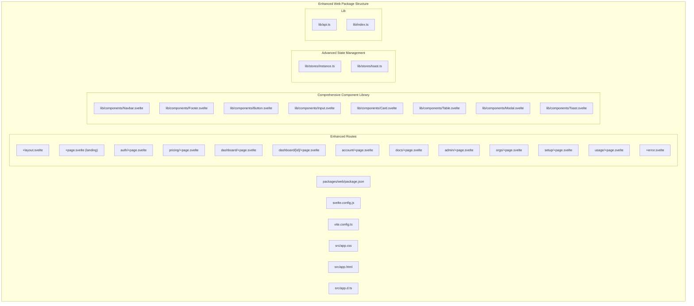
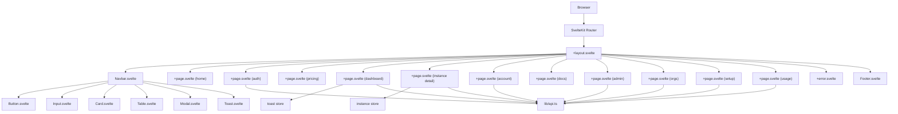
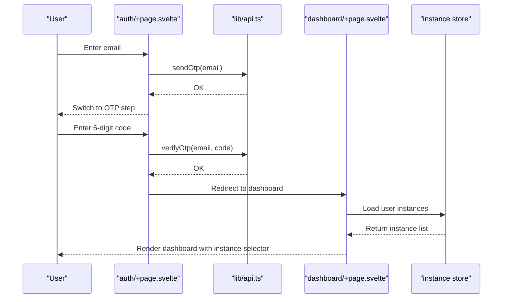
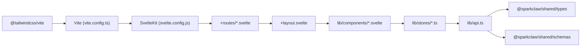

# Frontend Application (Web)

<cite>
**Referenced Files in This Document**
- [package.json](file://packages/web/package.json)
- [svelte.config.js](file://packages/web/svelte.config.js)
- [vite.config.ts](file://packages/web/vite.config.ts)
- [app.css](file://packages/web/src/app.css)
- [app.html](file://packages/web/src/app.html)
- [app.d.ts](file://packages/web/src/app.d.ts)
- [routes/+layout.svelte](file://packages/web/src/routes/+layout.svelte)
- [routes/+page.svelte](file://packages/web/src/routes/+page.svelte)
- [routes/+error.svelte](file://packages/web/src/routes/+error.svelte)
- [routes/auth/+page.svelte](file://packages/web/src/routes/auth/+page.svelte)
- [routes/pricing/+page.svelte](file://packages/web/src/routes/pricing/+page.svelte)
- [routes/dashboard/+page.svelte](file://packages/web/src/routes/dashboard/+page.svelte)
- [routes/dashboard/[id]/+page.svelte](file://packages/web/src/routes/dashboard/[id]/+page.svelte)
- [routes/account/+page.svelte](file://packages/web/src/routes/account/+page.svelte)
- [routes/docs/+page.svelte](file://packages/web/src/routes/docs/+page.svelte)
- [routes/admin/+page.svelte](file://packages/web/src/routes/admin/+page.svelte)
- [routes/admin/+layout.svelte](file://packages/web/src/routes/admin/+layout.svelte)
- [routes/orgs/+page.svelte](file://packages/web/src/routes/orgs/+page.svelte)
- [routes/setup/+page.svelte](file://packages/web/src/routes/setup/+page.svelte)
- [routes/usage/+page.svelte](file://packages/web/src/routes/usage/+page.svelte)
- [lib/components/Navbar.svelte](file://packages/web/src/lib/components/Navbar.svelte)
- [lib/components/Footer.svelte](file://packages/web/src/lib/components/Footer.svelte)
- [lib/components/Button.svelte](file://packages/web/src/lib/components/Button.svelte)
- [lib/components/Input.svelte](file://packages/web/src/lib/components/Input.svelte)
- [lib/components/Card.svelte](file://packages/web/src/lib/components/Card.svelte)
- [lib/components/Table.svelte](file://packages/web/src/lib/components/Table.svelte)
- [lib/components/Modal.svelte](file://packages/web/src/lib/components/Modal.svelte)
- [lib/components/Toast.svelte](file://packages/web/src/lib/components/Toast.svelte)
- [lib/stores/instance.ts](file://packages/web/src/lib/stores/instance.ts)
- [lib/stores/toast.ts](file://packages/web/src/lib/stores/toast.ts)
- [lib/api.ts](file://packages/web/src/lib/api.ts)
- [lib/index.ts](file://packages/web/src/lib/index.ts)
</cite>

## Update Summary
**Changes Made**
- Added comprehensive new component system with reusable UI components (Button, Input, Card, Table, Modal, Toast)
- Implemented instance selector with persistent storage and status indicators
- Enhanced dashboard with multi-instance management and real-time monitoring
- Added toast notification system with centralized store management
- Expanded routing structure with new pages (admin, orgs, setup, usage)
- Improved authentication flow with enhanced UI and better error handling
- Added comprehensive state management with Svelte stores for instance selection and notifications

## Table of Contents
1. [Introduction](#introduction)
2. [Project Structure](#project-structure)
3. [Core Components](#core-components)
4. [Architecture Overview](#architecture-overview)
5. [Detailed Component Analysis](#detailed-component-analysis)
6. [Dependency Analysis](#dependency-analysis)
7. [Performance Considerations](#performance-considerations)
8. [Troubleshooting Guide](#troubleshooting-guide)
9. [Conclusion](#conclusion)
10. [Appendices](#appendices)

## Introduction
This document describes the SvelteKit frontend application for SparkClaw, featuring a comprehensive UI redesign with a new component system, instance selector, and enhanced user experience. The application now includes multi-instance management capabilities, real-time monitoring, toast notifications, and a robust component library that ensures consistency across the entire user interface.

## Project Structure
The frontend has evolved into a sophisticated SvelteKit application with a comprehensive component library, enhanced routing structure, and advanced state management. The new structure supports multi-instance deployments, real-time monitoring, and a unified notification system.

**Diagram sources**
- [packages/web/package.json](file://packages/web/package.json)
- [packages/web/svelte.config.js](file://packages/web/svelte.config.js)
- [packages/web/vite.config.ts](file://packages/web/vite.config.ts)
- [packages/web/src/app.css](file://packages/web/src/app.css)
- [packages/web/src/app.html](file://packages/web/src/app.html)
- [packages/web/src/app.d.ts](file://packages/web/src/app.d.ts)
- [packages/web/src/routes/+layout.svelte](file://packages/web/src/routes/+layout.svelte)
- [packages/web/src/routes/+page.svelte](file://packages/web/src/routes/+page.svelte)
- [packages/web/src/routes/auth/+page.svelte](file://packages/web/src/routes/auth/+page.svelte)
- [packages/web/src/routes/pricing/+page.svelte](file://packages/web/src/routes/pricing/+page.svelte)
- [packages/web/src/routes/dashboard/+page.svelte](file://packages/web/src/routes/dashboard/+page.svelte)
- [packages/web/src/routes/dashboard/[id]/+page.svelte](file://packages/web/src/routes/dashboard/[id]/+page.svelte)
- [packages/web/src/routes/account/+page.svelte](file://packages/web/src/routes/account/+page.svelte)
- [packages/web/src/routes/docs/+page.svelte](file://packages/web/src/routes/docs/+page.svelte)
- [packages/web/src/routes/admin/+page.svelte](file://packages/web/src/routes/admin/+page.svelte)
- [packages/web/src/routes/orgs/+page.svelte](file://packages/web/src/routes/orgs/+page.svelte)
- [packages/web/src/routes/setup/+page.svelte](file://packages/web/src/routes/setup/+page.svelte)
- [packages/web/src/routes/usage/+page.svelte](file://packages/web/src/routes/usage/+page.svelte)
- [packages/web/src/routes/+error.svelte](file://packages/web/src/routes/+error.svelte)
- [packages/web/src/lib/components/Navbar.svelte](file://packages/web/src/lib/components/Navbar.svelte)
- [packages/web/src/lib/components/Footer.svelte](file://packages/web/src/lib/components/Footer.svelte)
- [packages/web/src/lib/components/Button.svelte](file://packages/web/src/lib/components/Button.svelte)
- [packages/web/src/lib/components/Input.svelte](file://packages/web/src/lib/components/Input.svelte)
- [packages/web/src/lib/components/Card.svelte](file://packages/web/src/lib/components/Card.svelte)
- [packages/web/src/lib/components/Table.svelte](file://packages/web/src/lib/components/Table.svelte)
- [packages/web/src/lib/components/Modal.svelte](file://packages/web/src/lib/components/Modal.svelte)
- [packages/web/src/lib/components/Toast.svelte](file://packages/web/src/lib/components/Toast.svelte)
- [packages/web/src/lib/stores/instance.ts](file://packages/web/src/lib/stores/instance.ts)
- [packages/web/src/lib/stores/toast.ts](file://packages/web/src/lib/stores/toast.ts)
- [packages/web/src/lib/api.ts](file://packages/web/src/lib/api.ts)
- [packages/web/src/lib/index.ts](file://packages/web/src/lib/index.ts)

**Section sources**
- [packages/web/package.json](file://packages/web/package.json#L1-L31)
- [packages/web/svelte.config.js](file://packages/web/svelte.config.js#L1-L14)
- [packages/web/vite.config.ts](file://packages/web/vite.config.ts#L1-L8)

## Core Components
The application now features a comprehensive component library with reusable UI elements that ensure consistency and maintainability across the entire interface.

### Enhanced Component System
- **Button Component**: Comprehensive button component with variants (primary, secondary, outline, ghost, danger), sizes (sm, md, lg), loading states, and icon support
- **Input Component**: Flexible input component with labels, error states, hints, and multiple sizes
- **Card Component**: Structured card component with optional header actions, subtitles, and hover effects
- **Table Component**: Advanced table component with loading states, empty states, and customizable row actions
- **Modal Component**: Full-featured modal dialog with configurable sizing, confirmation actions, and loading states
- **Toast Component**: Notification component with automatic dismissal and multiple severity levels

### Instance Selector System
- **Persistent Storage**: Selected instance is stored in localStorage for session persistence
- **Real-time Status**: Visual indicators show instance status (ready, pending, error) with animation
- **Dropdown Interface**: Clean dropdown interface with instance filtering and selection
- **Mobile Support**: Fully responsive dropdown that works on mobile devices

### Toast Notification System
- **Centralized Store**: Global toast store manages all notifications with automatic cleanup
- **Multiple Types**: Support for success, error, warning, and info notifications
- **Automatic Dismissal**: Configurable timeout with manual override option
- **Positioning**: Fixed positioning in bottom-right corner with smooth animations

**Section sources**
- [packages/web/src/lib/components/Button.svelte](file://packages/web/src/lib/components/Button.svelte#L1-L59)
- [packages/web/src/lib/components/Input.svelte](file://packages/web/src/lib/components/Input.svelte#L1-L52)
- [packages/web/src/lib/components/Card.svelte](file://packages/web/src/lib/components/Card.svelte#L1-L58)
- [packages/web/src/lib/components/Table.svelte](file://packages/web/src/lib/components/Table.svelte#L1-L87)
- [packages/web/src/lib/components/Modal.svelte](file://packages/web/src/lib/components/Modal.svelte#L1-L79)
- [packages/web/src/lib/components/Toast.svelte](file://packages/web/src/lib/components/Toast.svelte#L1-L48)
- [packages/web/src/lib/stores/instance.ts](file://packages/web/src/lib/stores/instance.ts#L1-L29)
- [packages/web/src/lib/stores/toast.ts](file://packages/web/src/lib/stores/toast.ts#L1-L39)

## Architecture Overview
The enhanced architecture now supports multi-instance management, real-time monitoring, and a comprehensive component library that promotes code reuse and consistency.

**Diagram sources**
- [packages/web/src/routes/+layout.svelte](file://packages/web/src/routes/+layout.svelte)
- [packages/web/src/routes/+page.svelte](file://packages/web/src/routes/+page.svelte)
- [packages/web/src/routes/auth/+page.svelte](file://packages/web/src/routes/auth/+page.svelte)
- [packages/web/src/routes/pricing/+page.svelte](file://packages/web/src/routes/pricing/+page.svelte)
- [packages/web/src/routes/dashboard/+page.svelte](file://packages/web/src/routes/dashboard/+page.svelte)
- [packages/web/src/routes/dashboard/[id]/+page.svelte](file://packages/web/src/routes/dashboard/[id]/+page.svelte)
- [packages/web/src/routes/account/+page.svelte](file://packages/web/src/routes/account/+page.svelte)
- [packages/web/src/routes/docs/+page.svelte](file://packages/web/src/routes/docs/+page.svelte)
- [packages/web/src/routes/admin/+page.svelte](file://packages/web/src/routes/admin/+page.svelte)
- [packages/web/src/routes/orgs/+page.svelte](file://packages/web/src/routes/orgs/+page.svelte)
- [packages/web/src/routes/setup/+page.svelte](file://packages/web/src/routes/setup/+page.svelte)
- [packages/web/src/routes/usage/+page.svelte](file://packages/web/src/routes/usage/+page.svelte)
- [packages/web/src/routes/+error.svelte](file://packages/web/src/routes/+error.svelte)
- [packages/web/src/lib/components/Navbar.svelte](file://packages/web/src/lib/components/Navbar.svelte)
- [packages/web/src/lib/components/Footer.svelte](file://packages/web/src/lib/components/Footer.svelte)
- [packages/web/src/lib/components/Button.svelte](file://packages/web/src/lib/components/Button.svelte)
- [packages/web/src/lib/components/Input.svelte](file://packages/web/src/lib/components/Input.svelte)
- [packages/web/src/lib/components/Card.svelte](file://packages/web/src/lib/components/Card.svelte)
- [packages/web/src/lib/components/Table.svelte](file://packages/web/src/lib/components/Table.svelte)
- [packages/web/src/lib/components/Modal.svelte](file://packages/web/src/lib/components/Modal.svelte)
- [packages/web/src/lib/components/Toast.svelte](file://packages/web/src/lib/components/Toast.svelte)
- [packages/web/src/lib/stores/instance.ts](file://packages/web/src/lib/stores/instance.ts)
- [packages/web/src/lib/stores/toast.ts](file://packages/web/src/lib/stores/toast.ts)
- [packages/web/src/lib/api.ts](file://packages/web/src/lib/api.ts)

## Detailed Component Analysis

### Enhanced Routing System and Pages
The routing system has been significantly expanded to support the new multi-instance architecture and administrative features.

#### Landing Page (/)
Features a comprehensive hero section with statistics, features grid, and FAQ accordion. Now includes enhanced animations and improved mobile responsiveness.

#### Authentication (/auth)
Complete overhaul with split-pane design featuring:
- Modern left-side login form with social authentication options
- Right-side hero section with gradient background and dashboard preview
- Enhanced OTP verification with show/hide toggle
- Improved error handling and loading states

#### Pricing (/pricing)
Simplified pricing page with plan comparison and streamlined checkout process.

#### Dashboard (/dashboard)
Major enhancement with multi-instance support:
- Instance selector with persistent storage and status indicators
- Real-time instance status monitoring with polling
- Quick action buttons for instance management
- Upgrade modal for plan expansion
- Delete confirmation modal with safety checks

#### Instance Detail (/dashboard/[id])
Comprehensive instance management interface:
- Tabbed interface for controls, logs, environment variables, scheduled jobs, and custom skills
- Real-time log streaming with filtering and search
- Health monitoring with uptime tracking and channel status
- Environment variable management with CRUD operations
- Scheduled job management with validation
- Custom skills development and execution

#### Administrative Pages
- **Admin (/admin)**: Administrative dashboard with audit logs and user management
- **Organizations (/orgs)**: Team and organization management
- **Setup (/setup)**: Instance setup and configuration wizard
- **Usage (/usage)**: Resource usage and billing information

**Diagram sources**
- [packages/web/src/routes/auth/+page.svelte](file://packages/web/src/routes/auth/+page.svelte#L1-L273)
- [packages/web/src/lib/api.ts](file://packages/web/src/lib/api.ts)
- [packages/web/src/routes/dashboard/+page.svelte](file://packages/web/src/routes/dashboard/+page.svelte#L1-L376)
- [packages/web/src/lib/stores/instance.ts](file://packages/web/src/lib/stores/instance.ts#L1-L29)

**Section sources**
- [packages/web/src/routes/+page.svelte](file://packages/web/src/routes/+page.svelte#L1-L149)
- [packages/web/src/routes/auth/+page.svelte](file://packages/web/src/routes/auth/+page.svelte#L1-L273)
- [packages/web/src/routes/pricing/+page.svelte](file://packages/web/src/routes/pricing/+page.svelte#L1-L80)
- [packages/web/src/routes/dashboard/+page.svelte](file://packages/web/src/routes/dashboard/+page.svelte#L1-L376)
- [packages/web/src/routes/dashboard/[id]/+page.svelte](file://packages/web/src/routes/dashboard/[id]/+page.svelte#L1-L800)
- [packages/web/src/routes/account/+page.svelte](file://packages/web/src/routes/account/+page.svelte)
- [packages/web/src/routes/docs/+page.svelte](file://packages/web/src/routes/docs/+page.svelte)
- [packages/web/src/routes/admin/+page.svelte](file://packages/web/src/routes/admin/+page.svelte)
- [packages/web/src/routes/admin/+layout.svelte](file://packages/web/src/routes/admin/+layout.svelte)
- [packages/web/src/routes/orgs/+page.svelte](file://packages/web/src/routes/orgs/+page.svelte)
- [packages/web/src/routes/setup/+page.svelte](file://packages/web/src/routes/setup/+page.svelte)
- [packages/web/src/routes/usage/+page.svelte](file://packages/web/src/routes/usage/+page.svelte)

### Enhanced State Management Patterns
The state management system has been significantly enhanced with new stores and improved patterns.

#### Instance Selection Store
- **Persistent Selection**: Automatically saves selected instance to localStorage
- **Global Access**: Available across all dashboard pages
- **Status Tracking**: Provides real-time status updates for visual indicators

#### Toast Notification Store
- **Centralized Management**: Single source of truth for all notifications
- **Automatic Cleanup**: Automatic removal after timeout periods
- **Multiple Severity Levels**: Success, error, warning, and info notifications
- **Manual Override**: Users can dismiss notifications manually

#### Reactive Patterns
- **Derived Values**: Computed values for complex state calculations
- **Lifecycle Hooks**: Proper cleanup in onMount/unmount
- **Error Boundaries**: Graceful error handling with user feedback
- **Loading States**: Comprehensive loading indicators throughout the application

**Section sources**
- [packages/web/src/lib/stores/instance.ts](file://packages/web/src/lib/stores/instance.ts#L1-L29)
- [packages/web/src/lib/stores/toast.ts](file://packages/web/src/lib/stores/toast.ts#L1-L39)
- [packages/web/src/routes/dashboard/+page.svelte](file://packages/web/src/routes/dashboard/+page.svelte#L1-L376)
- [packages/web/src/routes/dashboard/[id]/+page.svelte](file://packages/web/src/routes/dashboard/[id]/+page.svelte#L1-L800)

### Enhanced Styling Strategy with Tailwind CSS
The styling system has been enhanced with a comprehensive component library and improved design consistency.

#### Component-Based Design System
- **Consistent Spacing**: Unified spacing system using Tailwind utilities
- **Typography Scale**: Hierarchical typography with consistent font weights
- **Color Palette**: Terra and Warm color schemes with semantic meanings
- **Border Radius**: Standardized rounded corners for all interactive elements

#### Animation System
- **Entrance Animations**: Staggered animations for page elements
- **Hover Effects**: Consistent hover states across all interactive components
- **Loading Indicators**: Custom spinners and skeleton loaders
- **Status Animations**: Pulse effects for pending statuses

#### Responsive Design Enhancements
- **Mobile-First Approach**: All components designed with mobile responsiveness
- **Flexible Grids**: Adaptive grid layouts for different screen sizes
- **Touch-Friendly Targets**: Minimum 44px touch targets for mobile interaction
- **Progressive Enhancement**: Graceful degradation on smaller screens

**Section sources**
- [packages/web/src/app.css](file://packages/web/src/app.css#L1-L122)
- [packages/web/src/lib/components/Button.svelte](file://packages/web/src/lib/components/Button.svelte#L1-L59)
- [packages/web/src/lib/components/Card.svelte](file://packages/web/src/lib/components/Card.svelte#L1-L58)
- [packages/web/src/lib/components/Modal.svelte](file://packages/web/src/lib/components/Modal.svelte#L1-L79)

### Enhanced Authentication UI Components
The authentication system has been completely redesigned with improved user experience and security.

#### Split-Pane Authentication
- **Left Panel**: Clean login form with email and OTP inputs
- **Right Panel**: Marketing content with gradient background and dashboard preview
- **Social Login**: Integrated Google and Apple authentication options
- **Responsive Layout**: Adapts to different screen sizes and orientations

#### Enhanced OTP Verification
- **Numeric Input**: Specialized numeric input with auto-formatting
- **Show/Hide Toggle**: Security-conscious password masking toggle
- **Real-time Validation**: Immediate validation feedback
- **Error Handling**: Clear error messages with recovery options

#### Session Management
- **Plan Preservation**: Automatic plan parameter passing through auth flow
- **Redirect Logic**: Intelligent redirects based on user state
- **Logout Handling**: Clean session termination and navigation

**Section sources**
- [packages/web/src/routes/auth/+page.svelte](file://packages/web/src/routes/auth/+page.svelte#L1-L273)
- [packages/web/src/routes/dashboard/+page.svelte](file://packages/web/src/routes/dashboard/+page.svelte#L1-L376)

### Enhanced Dashboard Interface Design
The dashboard has been transformed into a comprehensive multi-instance management interface.

#### Instance Selector Integration
- **Persistent Selection**: Instance preference saved across sessions
- **Status Visualization**: Color-coded status indicators with pulse animations
- **Dropdown Interface**: Clean dropdown with instance filtering and selection
- **Mobile Responsiveness**: Touch-friendly dropdown for mobile devices

#### Real-Time Monitoring
- **Health Checks**: 30-second polling for instance health status
- **Log Streaming**: Real-time log updates with automatic scrolling
- **Status Updates**: Live status indicators for provisioning and maintenance
- **Error Handling**: Graceful error states with recovery options

#### Advanced Instance Management
- **Multi-Instance Support**: Manage multiple instances from a single dashboard
- **Quick Actions**: One-click actions for common instance operations
- **Resource Monitoring**: Uptime tracking and performance metrics
- **Channel Status**: Individual channel connectivity monitoring

#### Enhanced User Experience
- **Loading States**: Comprehensive loading indicators throughout
- **Error Handling**: Contextual error messages with actionable solutions
- **Success Feedback**: Toast notifications for completed actions
- **Accessibility**: Proper ARIA labels and keyboard navigation

**Section sources**
- [packages/web/src/routes/dashboard/+page.svelte](file://packages/web/src/routes/dashboard/+page.svelte#L1-L376)
- [packages/web/src/routes/dashboard/[id]/+page.svelte](file://packages/web/src/routes/dashboard/[id]/+page.svelte#L1-L800)
- [packages/web/src/lib/stores/instance.ts](file://packages/web/src/lib/stores/instance.ts#L1-L29)

### Enhanced Component Composition Patterns
The component system now follows strict composition patterns that promote reusability and maintainability.

#### Component Hierarchy
- **Base Components**: Simple, focused components (Button, Input, Card)
- **Composite Components**: Complex components built from base components (Modal, Table)
- **Layout Components**: Structural components (Navbar, Footer) with global scope
- **Stateful Components**: Components with internal state management (Toast, Modal)

#### Props and Events
- **Type Safety**: Full TypeScript support for all component props
- **Default Values**: Reasonable defaults for optional props
- **Event Handling**: Consistent event naming and propagation patterns
- **Slot Support**: Flexible content projection with named slots

#### Integration Patterns
- **Store Integration**: Seamless integration with Svelte stores
- **API Integration**: Consistent API call patterns across components
- **Form Integration**: Unified form handling with validation
- **Routing Integration**: Automatic navigation and state management

**Section sources**
- [packages/web/src/lib/components/Button.svelte](file://packages/web/src/lib/components/Button.svelte#L1-L59)
- [packages/web/src/lib/components/Input.svelte](file://packages/web/src/lib/components/Input.svelte#L1-L52)
- [packages/web/src/lib/components/Card.svelte](file://packages/web/src/lib/components/Card.svelte#L1-L58)
- [packages/web/src/lib/components/Modal.svelte](file://packages/web/src/lib/components/Modal.svelte#L1-L79)
- [packages/web/src/lib/components/Table.svelte](file://packages/web/src/lib/components/Table.svelte#L1-L87)

### Enhanced Integration with Shared Types and Constants
The application now integrates more deeply with shared types and schemas for better type safety and validation.

#### Type Integration
- **API Response Types**: Full TypeScript support for all API responses
- **Form Validation**: Client-side validation using shared schemas
- **Navigation Types**: Type-safe navigation with parameter validation
- **Store Types**: Strongly typed store values and actions

#### Schema Validation
- **Plan Validation**: Server-side validation for subscription plans
- **Instance Validation**: Comprehensive validation for instance operations
- **Form Validation**: Real-time validation for user input
- **Error Handling**: Consistent error handling across all validation layers

**Section sources**
- [packages/web/src/routes/pricing/+page.svelte](file://packages/web/src/routes/pricing/+page.svelte#L1-L80)
- [packages/web/src/routes/dashboard/+page.svelte](file://packages/web/src/routes/dashboard/+page.svelte#L1-L376)
- [packages/web/src/routes/dashboard/[id]/+page.svelte](file://packages/web/src/routes/dashboard/[id]/+page.svelte#L1-L800)
- [packages/web/src/routes/auth/+page.svelte](file://packages/web/src/routes/auth/+page.svelte#L1-L273)

### Enhanced Responsive Design Principles and Mobile-First Approach
The application now follows a comprehensive mobile-first design approach with enhanced touch interactions.

#### Mobile-First Design
- **Touch Targets**: Minimum 44px touch targets for all interactive elements
- **Gesture Support**: Swipe gestures for navigation and selection
- **Orientation Handling**: Proper handling of portrait and landscape modes
- **Performance Optimization**: Optimized loading for mobile networks

#### Adaptive Interfaces
- **Breakpoint Management**: Strategic use of Tailwind breakpoints
- **Component Adaptation**: Components that adapt to different screen sizes
- **Navigation Adaptation**: Mobile navigation that transforms to desktop layouts
- **Content Prioritization**: Essential content prioritized on smaller screens

#### Accessibility Enhancements
- **Screen Reader Support**: Proper ARIA labels and roles
- **Keyboard Navigation**: Full keyboard accessibility
- **Focus Management**: Logical tab order and focus indicators
- **Color Contrast**: High contrast ratios for readability

**Section sources**
- [packages/web/src/lib/components/Navbar.svelte](file://packages/web/src/lib/components/Navbar.svelte#L1-L161)
- [packages/web/src/routes/+page.svelte](file://packages/web/src/routes/+page.svelte#L1-L149)
- [packages/web/src/routes/pricing/+page.svelte](file://packages/web/src/routes/pricing/+page.svelte#L1-L80)

### Enhanced Build Process, Deployment Configuration, and Adapters
The build system has been enhanced with improved tooling and deployment configuration.

#### Build Enhancements
- **Svelte 5 Compatibility**: Full support for Svelte 5 runes and compiler options
- **TypeScript Integration**: Enhanced TypeScript compilation with proper configuration
- **Asset Optimization**: Automatic optimization of static assets and images
- **Bundle Analysis**: Built-in bundle size analysis and optimization

#### Deployment Configuration
- **Adapter Flexibility**: Support for multiple deployment targets (Node, Vercel, Cloudflare)
- **Environment Variables**: Proper handling of environment variables in different environments
- **Static Generation**: Support for static site generation where appropriate
- **Serverless Functions**: Optimized serverless deployment patterns

#### Development Experience
- **Hot Reload**: Enhanced hot reload with proper state preservation
- **Source Maps**: Comprehensive debugging support with source maps
- **Error Reporting**: Improved error reporting and stack traces
- **Performance Monitoring**: Built-in performance monitoring and profiling

**Section sources**
- [packages/web/package.json](file://packages/web/package.json#L1-L31)
- [packages/web/svelte.config.js](file://packages/web/svelte.config.js#L1-L14)
- [packages/web/vite.config.ts](file://packages/web/vite.config.ts#L1-L8)

### Enhanced Examples of Component Usage, Prop Interfaces, and Event Handling
The component library provides comprehensive examples of usage patterns and best practices.

#### Component Usage Examples
- **Button Variants**: Primary, secondary, outline, ghost, and danger button examples
- **Input States**: Default, error, disabled, and loading state examples
- **Card Patterns**: Header-only, footer-only, and full-content card examples
- **Modal Usage**: Confirmation dialogs, form modals, and informational modals

#### Prop Interface Documentation
- **Type Safety**: Complete TypeScript interface documentation
- **Default Values**: Clear indication of default prop values
- **Validation Rules**: Input validation and constraint documentation
- **Event Signatures**: Complete event handler signatures and parameters

#### Event Handling Patterns
- **Form Submission**: Complete form handling with validation and submission
- **Modal Interactions**: Confirmation and cancellation patterns
- **Navigation Events**: Programmatic navigation with state management
- **Store Integration**: Component-store communication patterns

**Section sources**
- [packages/web/src/lib/components/Button.svelte](file://packages/web/src/lib/components/Button.svelte#L1-L59)
- [packages/web/src/lib/components/Input.svelte](file://packages/web/src/lib/components/Input.svelte#L1-L52)
- [packages/web/src/lib/components/Card.svelte](file://packages/web/src/lib/components/Card.svelte#L1-L58)
- [packages/web/src/lib/components/Modal.svelte](file://packages/web/src/lib/components/Modal.svelte#L1-L79)
- [packages/web/src/lib/components/Table.svelte](file://packages/web/src/lib/components/Table.svelte#L1-L87)

### Enhanced Guidelines for Extending the UI Consistently
The enhanced component system provides clear guidelines for maintaining consistency while extending functionality.

#### Component Development Guidelines
- **Follow Component Patterns**: Use established patterns from the component library
- **TypeScript Integration**: Always use TypeScript interfaces for props and events
- **Accessibility Standards**: Implement proper ARIA attributes and keyboard navigation
- **Performance Considerations**: Optimize components for performance and memory usage

#### State Management Best Practices
- **Store Location**: Place state in appropriate stores (local vs global)
- **State Normalization**: Normalize complex state structures for efficient updates
- **Cleanup Procedures**: Implement proper cleanup in component unmount
- **Error Boundaries**: Handle errors gracefully with user feedback

#### Styling and Theming
- **Design Token Usage**: Use design tokens instead of hardcoded values
- **Responsive Patterns**: Follow mobile-first responsive design patterns
- **Animation Standards**: Use consistent animation timing and easing
- **Color System**: Follow the established color palette and semantic usage

#### Testing and Quality Assurance
- **Component Testing**: Test components in isolation with various prop combinations
- **Integration Testing**: Test component interactions and state changes
- **Accessibility Testing**: Ensure components meet accessibility standards
- **Performance Testing**: Test components under various load conditions

## Dependency Analysis
The enhanced dependency structure reflects the comprehensive component library and state management system.

**Diagram sources**
- [packages/web/vite.config.ts](file://packages/web/vite.config.ts#L1-L8)
- [packages/web/svelte.config.js](file://packages/web/svelte.config.js#L1-L14)
- [packages/web/src/routes/+layout.svelte](file://packages/web/src/routes/+layout.svelte)
- [packages/web/src/lib/components/Navbar.svelte](file://packages/web/src/lib/components/Navbar.svelte)
- [packages/web/src/lib/components/Footer.svelte](file://packages/web/src/lib/components/Footer.svelte)
- [packages/web/src/lib/components/Button.svelte](file://packages/web/src/lib/components/Button.svelte)
- [packages/web/src/lib/components/Input.svelte](file://packages/web/src/lib/components/Input.svelte)
- [packages/web/src/lib/components/Card.svelte](file://packages/web/src/lib/components/Card.svelte)
- [packages/web/src/lib/components/Table.svelte](file://packages/web/src/lib/components/Table.svelte)
- [packages/web/src/lib/components/Modal.svelte](file://packages/web/src/lib/components/Modal.svelte)
- [packages/web/src/lib/components/Toast.svelte](file://packages/web/src/lib/components/Toast.svelte)
- [packages/web/src/lib/stores/instance.ts](file://packages/web/src/lib/stores/instance.ts)
- [packages/web/src/lib/stores/toast.ts](file://packages/web/src/lib/stores/toast.ts)
- [packages/web/src/lib/api.ts](file://packages/web/src/lib/api.ts)

**Section sources**
- [packages/web/vite.config.ts](file://packages/web/vite.config.ts#L1-L8)
- [packages/web/svelte.config.js](file://packages/web/svelte.config.js#L1-L14)
- [packages/web/src/lib/api.ts](file://packages/web/src/lib/api.ts)

## Performance Considerations
The enhanced application includes several performance optimizations and considerations.

### Component Performance
- **Virtual Scrolling**: Large lists use virtual scrolling for optimal performance
- **Lazy Loading**: Heavy components are loaded on demand
- **Memoization**: Expensive computations are memoized with proper invalidation
- **Rendering Optimization**: Minimized re-renders through proper state scoping

### Network Performance
- **Request Batching**: Multiple related requests are batched when possible
- **Caching Strategies**: Appropriate caching for static and dynamic content
- **Connection Pooling**: Efficient connection management for API calls
- **Error Recovery**: Robust retry mechanisms with exponential backoff

### Memory Management
- **Store Cleanup**: Proper cleanup of subscriptions and timers
- **Event Listener Management**: Automatic cleanup of event listeners
- **Image Optimization**: Proper image sizing and lazy loading
- **Resource Deallocation**: Proper cleanup of WebSocket connections and streams

### Bundle Optimization
- **Tree Shaking**: Unused code is automatically removed
- **Code Splitting**: Critical path code is split for faster initial load
- **Asset Optimization**: Images and other assets are optimized for delivery
- **Dependency Management**: Careful management of third-party dependencies

## Troubleshooting Guide
Enhanced troubleshooting guidance for the comprehensive component system and state management.

### Component Issues
- **Missing Props**: Check component documentation for required and optional props
- **Styling Problems**: Verify Tailwind classes and design token usage
- **Event Handling**: Ensure proper event handler signatures and parameter passing
- **Type Errors**: Check TypeScript interfaces and type definitions

### State Management Issues
- **Store State**: Verify store initialization and subscription patterns
- **Instance Selection**: Check localStorage persistence and fallback logic
- **Toast Notifications**: Verify toast store initialization and cleanup
- **Memory Leaks**: Ensure proper cleanup of subscriptions and timers

### API Integration Issues
- **Authentication**: Verify token handling and session management
- **Error Handling**: Check API error responses and user feedback
- **Network Issues**: Monitor network connectivity and request timeouts
- **Rate Limiting**: Handle API rate limiting and retry strategies

### Performance Issues
- **Component Rendering**: Monitor component render frequency and optimization
- **Memory Usage**: Track memory consumption and identify leaks
- **Network Performance**: Analyze API response times and optimization opportunities
- **Bundle Size**: Monitor bundle size and identify optimization opportunities

**Section sources**
- [packages/web/src/lib/components/Button.svelte](file://packages/web/src/lib/components/Button.svelte#L1-L59)
- [packages/web/src/lib/components/Input.svelte](file://packages/web/src/lib/components/Input.svelte#L1-L52)
- [packages/web/src/lib/stores/instance.ts](file://packages/web/src/lib/stores/instance.ts#L1-L29)
- [packages/web/src/lib/stores/toast.ts](file://packages/web/src/lib/stores/toast.ts#L1-L39)
- [packages/web/src/routes/dashboard/+page.svelte](file://packages/web/src/routes/dashboard/+page.svelte#L1-L376)

## Conclusion
The enhanced SvelteKit frontend application represents a comprehensive UI redesign with a robust component system, multi-instance management capabilities, and improved user experience. The new architecture supports complex workflows while maintaining consistency and scalability. The extensive component library, enhanced state management, and comprehensive styling system provide a solid foundation for future feature development and maintenance.

## Appendices
- **TypeScript Configuration**: Enhanced compiler options with strict type checking and module resolution
- **Build Configuration**: Optimized build pipeline with Svelte 5 compatibility and performance optimizations
- **Development Tools**: Comprehensive development experience with hot reload, source maps, and debugging support
- **Deployment Configuration**: Flexible deployment options supporting multiple hosting platforms

**Section sources**
- [packages/web/package.json](file://packages/web/package.json#L1-L31)
- [packages/web/svelte.config.js](file://packages/web/svelte.config.js#L1-L14)
- [packages/web/vite.config.ts](file://packages/web/vite.config.ts#L1-L8)
- [packages/web/app.html](file://packages/web/src/app.html)
- [packages/web/app.d.ts](file://packages/web/src/app.d.ts)