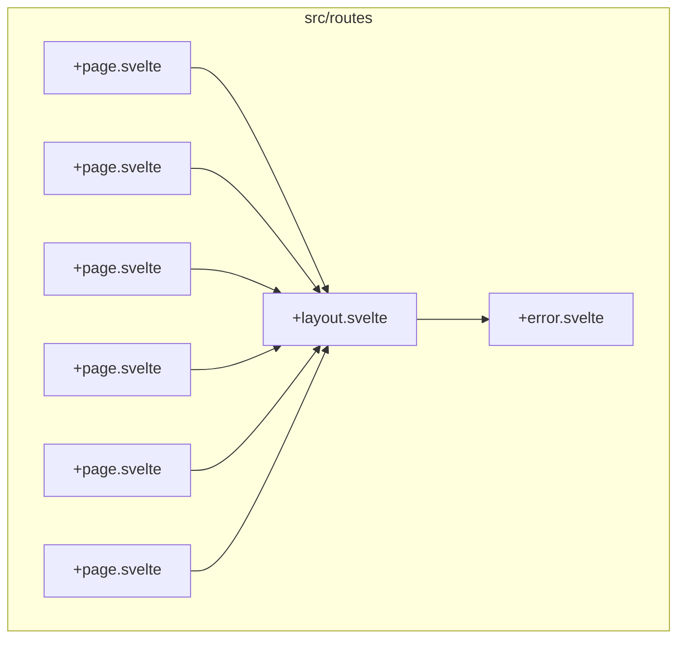
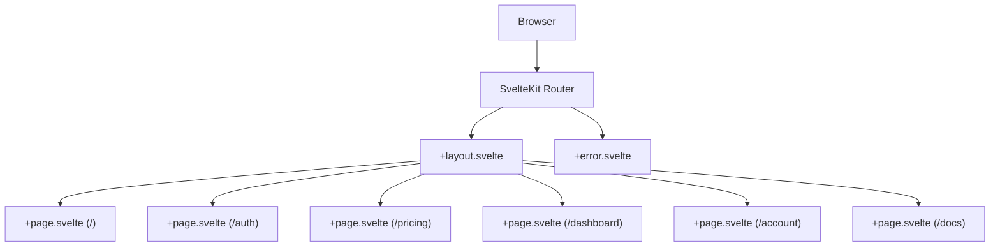
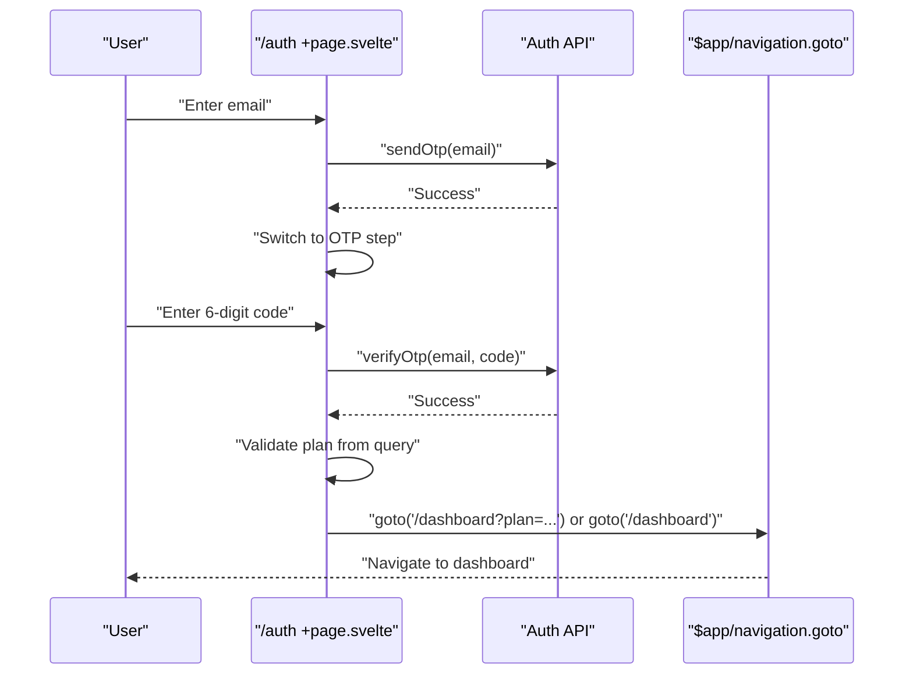
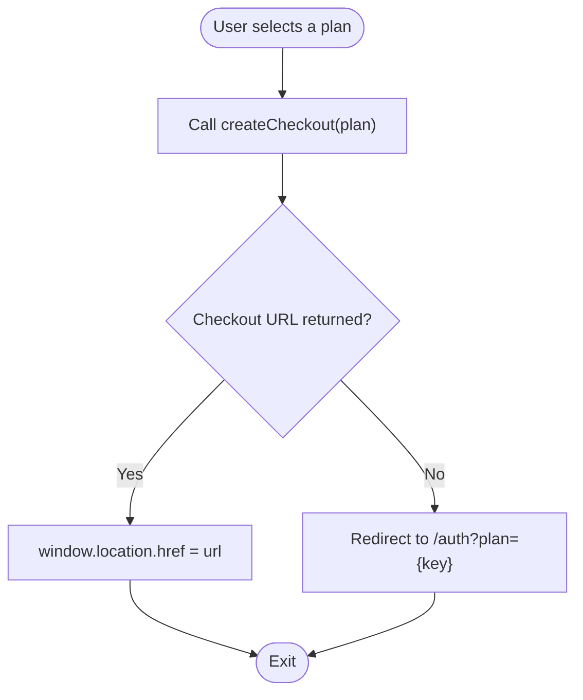
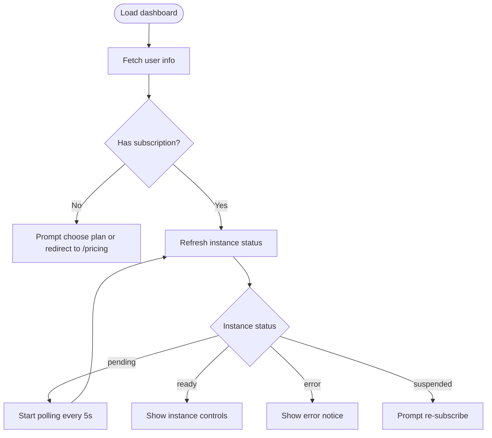
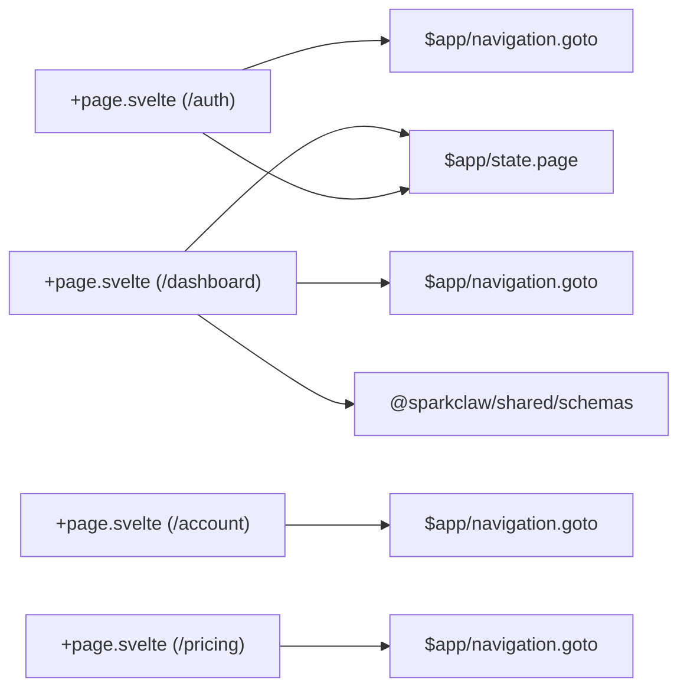

# Routing System

<cite>
**Referenced Files in This Document**
- [package.json](file://packages/web/package.json)
- [svelte.config.js](file://packages/web/svelte.config.js)
- [+layout.svelte](file://packages/web/src/routes/+layout.svelte)
- [+page.svelte](file://packages/web/src/routes/+page.svelte)
- [+error.svelte](file://packages/web/src/routes/+error.svelte)
- [/auth/+page.svelte](file://packages/web/src/routes/auth/+page.svelte)
- [/pricing/+page.svelte](file://packages/web/src/routes/pricing/+page.svelte)
- [/dashboard/+page.svelte](file://packages/web/src/routes/dashboard/+page.svelte)
- [/account/+page.svelte](file://packages/web/src/routes/account/+page.svelte)
- [/docs/+page.svelte](file://packages/web/src/routes/docs/+page.svelte)
</cite>

## Table of Contents
1. [Introduction](#introduction)
2. [Project Structure](#project-structure)
3. [Core Components](#core-components)
4. [Architecture Overview](#architecture-overview)
5. [Detailed Component Analysis](#detailed-component-analysis)
6. [Dependency Analysis](#dependency-analysis)
7. [Performance Considerations](#performance-considerations)
8. [Troubleshooting Guide](#troubleshooting-guide)
9. [Conclusion](#conclusion)

## Introduction
This document explains the SvelteKit routing system used by the web application. It covers the file-based routing convention, route structure, navigation patterns, authentication and route protection, layouts, error handling, loading states, transitions, prefetching strategies, and SEO considerations for the main routes: the landing page, authentication, pricing, dashboard, and documentation.

## Project Structure
The routing system is organized around SvelteKit’s file-based routing convention. Routes are derived from the src/routes directory tree. Each route group is represented by a folder with a +page.svelte file for the page component, and optional +layout.svelte and +error.svelte files for layout and error handling.

Key routes present in the repository:
- Root route: /
- Authentication: /auth
- Pricing: /pricing
- Dashboard: /dashboard
- Account: /account
- Documentation: /docs

**Diagram sources**
- [+layout.svelte](file://packages/web/src/routes/+layout.svelte#L1-L22)
- [+page.svelte](file://packages/web/src/routes/+page.svelte#L1-L149)
- [+error.svelte](file://packages/web/src/routes/+error.svelte#L1-L31)
- [/auth/+page.svelte](file://packages/web/src/routes/auth/+page.svelte#L1-L122)
- [/pricing/+page.svelte](file://packages/web/src/routes/pricing/+page.svelte#L1-L80)
- [/dashboard/+page.svelte](file://packages/web/src/routes/dashboard/+page.svelte#L1-L206)
- [/account/+page.svelte](file://packages/web/src/routes/account/+page.svelte#L1-L86)
- [/docs/+page.svelte](file://packages/web/src/routes/docs/+page.svelte#L1-L84)

**Section sources**
- [package.json](file://packages/web/package.json#L1-L29)
- [svelte.config.js](file://packages/web/svelte.config.js#L1-L14)

## Core Components
- Layout wrapper: The root +layout.svelte wraps all routes and injects global styles and shared UI (navbar and footer).
- Root page: The root +page.svelte renders the marketing landing page and sets SEO metadata.
- Route-specific pages: Each route group defines its own +page.svelte with route logic, navigation, and UI.
- Global error handler: The +error.svelte displays friendly error pages and handles 404/not found scenarios.

**Section sources**
- [+layout.svelte](file://packages/web/src/routes/+layout.svelte#L1-L22)
- [+page.svelte](file://packages/web/src/routes/+page.svelte#L1-L149)
- [+error.svelte](file://packages/web/src/routes/+error.svelte#L1-L31)

## Architecture Overview
SvelteKit automatically maps the filesystem under src/routes to URLs. The router resolves:
- Static routes: /, /pricing, /dashboard, /account, /docs
- Nested layout: All pages render inside the root +layout.svelte
- Error fallback: Any unhandled error falls back to +error.svelte

**Diagram sources**
- [+layout.svelte](file://packages/web/src/routes/+layout.svelte#L1-L22)
- [+page.svelte](file://packages/web/src/routes/+page.svelte#L1-L149)
- [/auth/+page.svelte](file://packages/web/src/routes/auth/+page.svelte#L1-L122)
- [/pricing/+page.svelte](file://packages/web/src/routes/pricing/+page.svelte#L1-L80)
- [/dashboard/+page.svelte](file://packages/web/src/routes/dashboard/+page.svelte#L1-L206)
- [/account/+page.svelte](file://packages/web/src/routes/account/+page.svelte#L1-L86)
- [/docs/+page.svelte](file://packages/web/src/routes/docs/+page.svelte#L1-L84)
- [+error.svelte](file://packages/web/src/routes/+error.svelte#L1-L31)

## Detailed Component Analysis

### Landing Page (/)
- Purpose: Marketing homepage with hero, features, stats, and FAQs.
- SEO: Sets title and meta description.
- Navigation: Links to /pricing and /docs.
- Route parameters: None.
- Query handling: None.
- Dynamic segments: None.

**Section sources**
- [+page.svelte](file://packages/web/src/routes/+page.svelte#L1-L149)

### Authentication (/auth)
- Purpose: Email-based magic-code sign-in with two steps.
- Route parameters: None.
- Query handling: Reads plan from query string to preselect a plan after successful sign-in.
- Dynamic segments: None.
- Navigation: Uses programmatic navigation to redirect to /dashboard upon success.
- Guards: N/A (public route; redirects to dashboard internally if already authenticated).

**Diagram sources**
- [/auth/+page.svelte](file://packages/web/src/routes/auth/+page.svelte#L1-L122)

**Section sources**
- [/auth/+page.svelte](file://packages/web/src/routes/auth/+page.svelte#L1-L122)

### Pricing (/pricing)
- Purpose: Displays subscription plans and initiates checkout.
- Route parameters: None.
- Query handling: Redirects to /auth with plan query if checkout fails and user is not authenticated.
- Dynamic segments: None.
- Navigation: Links to /auth with plan query string.

**Diagram sources**
- [/pricing/+page.svelte](file://packages/web/src/routes/pricing/+page.svelte#L1-L80)

**Section sources**
- [/pricing/+page.svelte](file://packages/web/src/routes/pricing/+page.svelte#L1-L80)

### Dashboard (/dashboard)
- Purpose: Central hub for authenticated users to manage subscription and instance.
- Route parameters: Supports plan query string for new subscribers.
- Query handling: Validates plan via schema and redirects to checkout if needed.
- Dynamic segments: None.
- Navigation: Programmatic navigation to /auth on failure and to home on logout.
- Guards: Requires authentication; redirects to /auth if missing or invalid.
- Loading states: Spinner while loading; polling for instance provisioning updates.

**Diagram sources**
- [/dashboard/+page.svelte](file://packages/web/src/routes/dashboard/+page.svelte#L1-L206)

**Section sources**
- [/dashboard/+page.svelte](file://packages/web/src/routes/dashboard/+page.svelte#L1-L206)

### Account (/account)
- Purpose: View and manage profile and subscription details.
- Route parameters: None.
- Query handling: None.
- Dynamic segments: None.
- Navigation: Programmatic navigation to /auth if not authenticated.

**Section sources**
- [/account/+page.svelte](file://packages/web/src/routes/account/+page.svelte#L1-L86)

### Documentation (/docs)
- Purpose: Onboarding and getting started guide.
- Route parameters: None.
- Query handling: None.
- Dynamic segments: None.
- Navigation: Links to /auth and /pricing.

**Section sources**
- [/docs/+page.svelte](file://packages/web/src/routes/docs/+page.svelte#L1-L84)

### Layouts and Wrapping
- Root layout: Provides global header/footer and renders child content.
- All pages render within this layout, ensuring consistent branding and navigation.

**Section sources**
- [+layout.svelte](file://packages/web/src/routes/+layout.svelte#L1-L22)

### Error Handling and Loading States
- Error page: Displays a friendly message, distinguishes 404 vs generic errors, and provides a “Back to Home” action.
- Loading states: Implemented per route with spinners and skeleton UI to improve perceived performance.

**Section sources**
- [+error.svelte](file://packages/web/src/routes/+error.svelte#L1-L31)
- [/dashboard/+page.svelte](file://packages/web/src/routes/dashboard/+page.svelte#L93-L98)
- [/account/+page.svelte](file://packages/web/src/routes/account/+page.svelte#L34-L38)

## Dependency Analysis
- Runtime navigation: Programmatic navigation uses $app/navigation.goto.
- State and routing: $app/state.page exposes current URL and status for route logic.
- Shared types and schemas: Validation uses @sparkclaw/shared schemas for plan parsing.

**Diagram sources**
- [/auth/+page.svelte](file://packages/web/src/routes/auth/+page.svelte#L1-L122)
- [/dashboard/+page.svelte](file://packages/web/src/routes/dashboard/+page.svelte#L1-L206)
- [/account/+page.svelte](file://packages/web/src/routes/account/+page.svelte#L1-L86)
- [/pricing/+page.svelte](file://packages/web/src/routes/pricing/+page.svelte#L1-L80)

**Section sources**
- [/auth/+page.svelte](file://packages/web/src/routes/auth/+page.svelte#L1-L122)
- [/dashboard/+page.svelte](file://packages/web/src/routes/dashboard/+page.svelte#L1-L206)
- [/account/+page.svelte](file://packages/web/src/routes/account/+page.svelte#L1-L86)
- [/pricing/+page.svelte](file://packages/web/src/routes/pricing/+page.svelte#L1-L80)

## Performance Considerations
- Prefetching: SvelteKit supports automatic prefetching of links. Use anchor tags to enable client-side navigation and prefetch behavior.
- Transitions: Prefer client-side navigation for smoother UX; avoid full-page reloads when possible.
- Loading states: Keep users informed with spinners and skeletons during network requests.
- SEO: Set page-specific titles and meta descriptions in each +page.svelte head block.

[No sources needed since this section provides general guidance]

## Troubleshooting Guide
- 404 handling: The +error.svelte detects page.status and shows a tailored message for missing pages.
- Generic errors: Displays error message from page.error or a default message.
- Authentication failures: Dashboard and account pages redirect to /auth when fetches fail.

**Section sources**
- [+error.svelte](file://packages/web/src/routes/+error.svelte#L1-L31)
- [/dashboard/+page.svelte](file://packages/web/src/routes/dashboard/+page.svelte#L39-L42)
- [/account/+page.svelte](file://packages/web/src/routes/account/+page.svelte#L13-L14)

## Conclusion
The routing system leverages SvelteKit’s file-based convention to cleanly separate concerns across routes. Authentication is integrated into the flow via query parameters and programmatic navigation. Layouts wrap all pages for consistent UX, while error handling and loading states improve resilience and perceived performance. SEO is addressed per-route with dedicated metadata.