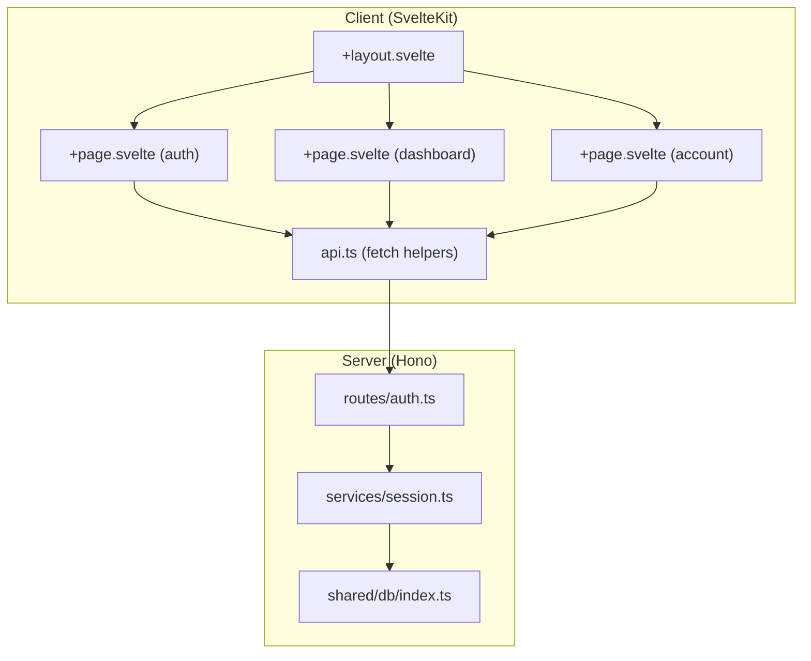
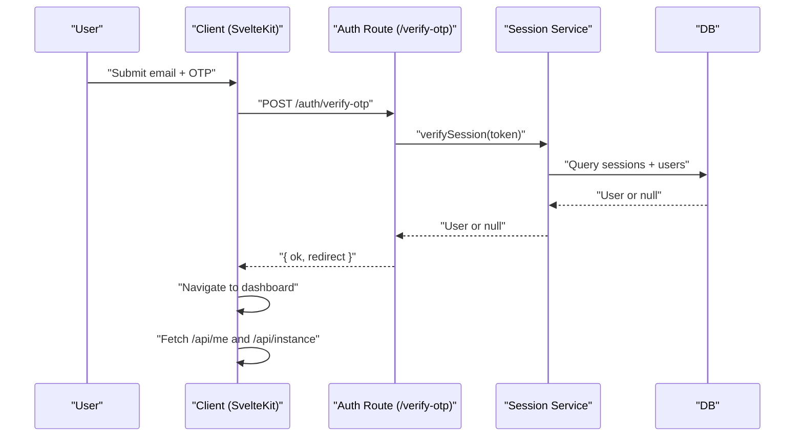
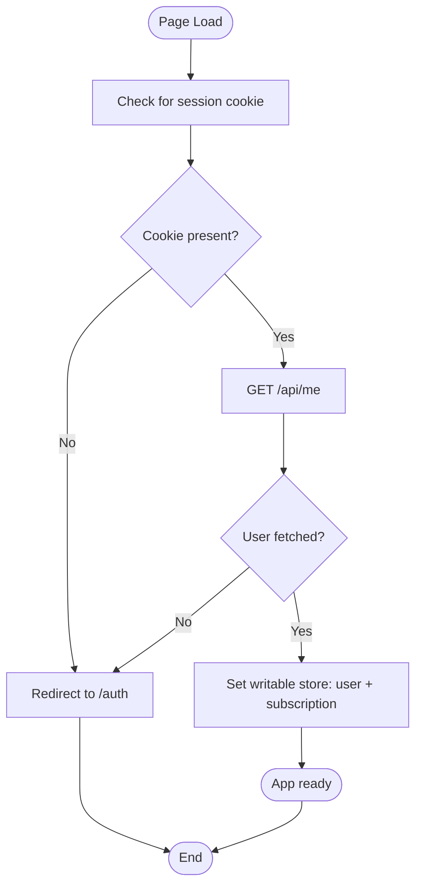
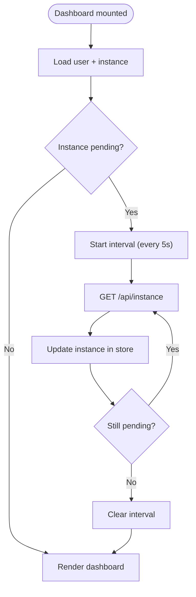
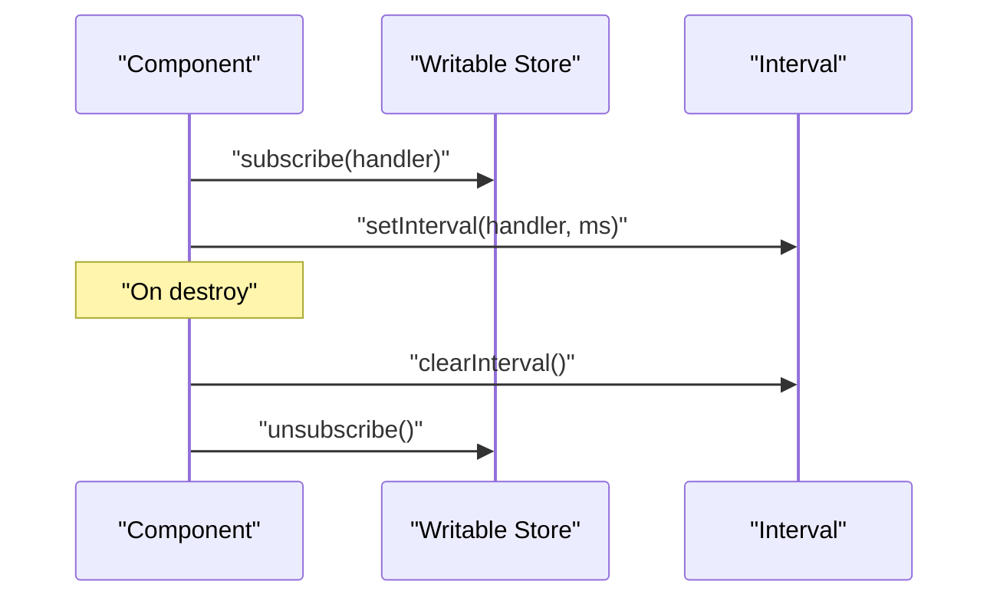
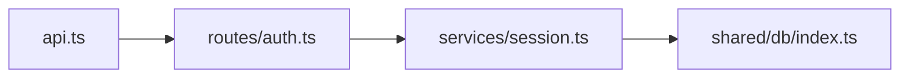

# State Management

<cite>
**Referenced Files in This Document**
- [packages/web/src/lib/api.ts](file://packages/web/src/lib/api.ts)
- [packages/web/src/routes/dashboard/+page.svelte](file://packages/web/src/routes/dashboard/+page.svelte)
- [packages/web/src/routes/account/+page.svelte](file://packages/web/src/routes/account/+page.svelte)
- [packages/web/src/routes/auth/+page.svelte](file://packages/web/src/routes/auth/+page.svelte)
- [packages/web/src/routes/+layout.svelte](file://packages/web/src/routes/+layout.svelte)
- [packages/web/src/app.d.ts](file://packages/web/src/app.d.ts)
- [packages/api/src/routes/auth.ts](file://packages/api/src/routes/auth.ts)
- [packages/api/src/services/session.ts](file://packages/api/src/services/session.ts)
- [packages/shared/src/db/index.ts](file://packages/shared/src/db/index.ts)
</cite>

## Table of Contents
1. [Introduction](#introduction)
2. [Project Structure](#project-structure)
3. [Core Components](#core-components)
4. [Architecture Overview](#architecture-overview)
5. [Detailed Component Analysis](#detailed-component-analysis)
6. [Dependency Analysis](#dependency-analysis)
7. [Performance Considerations](#performance-considerations)
8. [Troubleshooting Guide](#troubleshooting-guide)
9. [Conclusion](#conclusion)
10. [Appendices](#appendices)

## Introduction
This document explains state management patterns in the SvelteKit application, focusing on how authentication state, user data, and application-wide state are modeled and synchronized. It covers:
- Svelte stores: writable, readable, and derived patterns
- Reactive declarations and component state updates
- Session management via browser cookies and persistence across reloads
- Global state for subscription data, instance status, and user preferences
- Store subscriptions and cleanup to prevent memory leaks
- Decisions between local component state and global store state
- Synchronization with server-side data and handling asynchronous state updates
- Debugging and performance optimization techniques

## Project Structure
The state management spans client and server boundaries:
- Client-side SvelteKit routes and shared API helpers orchestrate authentication and data fetching
- Server-side routes manage session creation, verification, and destruction
- Shared database utilities provide a single source of truth for session and user data

**Diagram sources**
- [packages/web/src/routes/+layout.svelte](file://packages/web/src/routes/+layout.svelte)
- [packages/web/src/routes/auth/+page.svelte](file://packages/web/src/routes/auth/+page.svelte)
- [packages/web/src/routes/dashboard/+page.svelte](file://packages/web/src/routes/dashboard/+page.svelte)
- [packages/web/src/routes/account/+page.svelte](file://packages/web/src/routes/account/+page.svelte)
- [packages/web/src/lib/api.ts](file://packages/web/src/lib/api.ts)
- [packages/api/src/routes/auth.ts](file://packages/api/src/routes/auth.ts)
- [packages/api/src/services/session.ts](file://packages/api/src/services/session.ts)
- [packages/shared/src/db/index.ts](file://packages/shared/src/db/index.ts)

**Section sources**
- [packages/web/src/lib/api.ts](file://packages/web/src/lib/api.ts#L1-L52)
- [packages/api/src/routes/auth.ts](file://packages/api/src/routes/auth.ts#L542-L601)
- [packages/api/src/services/session.ts](file://packages/api/src/services/session.ts#L1-L42)
- [packages/shared/src/db/index.ts](file://packages/shared/src/db/index.ts#L1-L25)

## Core Components
- Authentication API helpers encapsulate session lifecycle calls and enforce credential handling for cross-origin requests.
- Server routes implement OTP-based sign-in, session creation, and logout with cookie-based session tokens.
- Session service verifies tokens against the database and enforces expiration.
- Layout composes pages and ensures consistent navigation and state access.

Key responsibilities:
- Client: fetch wrappers, route-level data loading, polling for asynchronous instance state, logout handling
- Server: OTP delivery, OTP verification, session creation/verification/deletion, cookie management

**Section sources**
- [packages/web/src/lib/api.ts](file://packages/web/src/lib/api.ts#L1-L52)
- [packages/api/src/routes/auth.ts](file://packages/api/src/routes/auth.ts#L542-L601)
- [packages/api/src/services/session.ts](file://packages/api/src/services/session.ts#L1-L42)
- [packages/web/src/routes/+layout.svelte](file://packages/web/src/routes/+layout.svelte)

## Architecture Overview
The authentication flow uses a cookie-based session persisted in the browser. On successful OTP verification, the server sets a session cookie and redirects to the dashboard. Subsequent requests include credentials automatically, enabling the backend to verify the session and return user data.

**Diagram sources**
- [packages/api/src/routes/auth.ts](file://packages/api/src/routes/auth.ts#L575-L591)
- [packages/api/src/services/session.ts](file://packages/api/src/services/session.ts#L23-L38)
- [packages/shared/src/db/index.ts](file://packages/shared/src/db/index.ts#L1-L25)

## Detailed Component Analysis

### Authentication Stores and Reactive Declarations
- Writable store pattern: Use a writable store to model current user state and subscription data. Initialize from server-provided data on the client and update reactively when user actions change state.
- Readable store pattern: Expose derived state such as “is authenticated” or “subscription status” as readable stores to avoid accidental external writes.
- Derived store pattern: Combine user data and subscription fields into derived stores for computed UI state (e.g., eligibility checks, feature flags).
- Reactive declarations: Use Svelte’s reactive declarations to derive dependent values from stores and trigger UI updates without manual subscriptions.

Decision guide:
- Local component state: Prefer for ephemeral UI state (e.g., form inputs, modal visibility).
- Global store state: Prefer for cross-component data (e.g., user identity, subscription, instance status).

**Section sources**
- [packages/web/src/lib/api.ts](file://packages/web/src/lib/api.ts#L38-L44)
- [packages/web/src/routes/dashboard/+page.svelte](file://packages/web/src/routes/dashboard/+page.svelte#L49-L71)

### Session Management and Persistence
- Cookie-based session: The server sets a session cookie upon successful OTP verification and clears it on logout.
- Credentials policy: Fetch calls include credentials to propagate cookies automatically.
- Persistence across reloads: Because the cookie is sent with subsequent requests, the backend can reconstruct the user session and return user data on initial load.

**Diagram sources**
- [packages/web/src/lib/api.ts](file://packages/web/src/lib/api.ts#L3-L18)
- [packages/api/src/routes/auth.ts](file://packages/api/src/routes/auth.ts#L588-L591)
- [packages/api/src/services/session.ts](file://packages/api/src/services/session.ts#L23-L38)

**Section sources**
- [packages/web/src/lib/api.ts](file://packages/web/src/lib/api.ts#L3-L18)
- [packages/api/src/routes/auth.ts](file://packages/api/src/routes/auth.ts#L575-L591)
- [packages/api/src/services/session.ts](file://packages/api/src/services/session.ts#L13-L42)

### Subscription Data and Instance Status
- Dashboard polling: The dashboard page polls for instance status until it stabilizes, updating state reactively and stopping the interval when resolved.
- Asynchronous updates: Use a derived store to compute whether polling should be active based on instance status.

**Diagram sources**
- [packages/web/src/routes/dashboard/+page.svelte](file://packages/web/src/routes/dashboard/+page.svelte#L49-L71)

**Section sources**
- [packages/web/src/routes/dashboard/+page.svelte](file://packages/web/src/routes/dashboard/+page.svelte#L49-L71)

### User Preferences and Application-Wide State
- Preferences: Model user preferences as a writable store initialized from server data. Expose readable selectors for derived UI state.
- Application-wide state: Share subscription and instance status globally to avoid prop drilling and ensure consistent UI state across routes.

**Section sources**
- [packages/web/src/lib/api.ts](file://packages/web/src/lib/api.ts#L38-L44)
- [packages/web/src/routes/account/+page.svelte](file://packages/web/src/routes/account/+page.svelte)

### Store Subscriptions and Cleanup
- Subscribe to stores in component initialization and clean up on destroy to prevent memory leaks.
- For intervals (e.g., polling), clear timers in cleanup and guard against re-entrancy.

**Diagram sources**
- [packages/web/src/routes/dashboard/+page.svelte](file://packages/web/src/routes/dashboard/+page.svelte#L56-L66)

**Section sources**
- [packages/web/src/routes/dashboard/+page.svelte](file://packages/web/src/routes/dashboard/+page.svelte#L56-L66)

### Synchronizing with Server-Side Data
- Initial hydration: Fetch user and instance data on the dashboard route to populate stores.
- Mutations: After logout or other mutations, invalidate or reset relevant stores and navigate accordingly.

**Section sources**
- [packages/web/src/lib/api.ts](file://packages/web/src/lib/api.ts#L34-L44)
- [packages/web/src/routes/dashboard/+page.svelte](file://packages/web/src/routes/dashboard/+page.svelte#L68-L71)

## Dependency Analysis
- Client depends on server routes for authentication and data retrieval.
- Server routes depend on session service for token verification and deletion.
- Session service depends on shared database utilities for database access.

**Diagram sources**
- [packages/web/src/lib/api.ts](file://packages/web/src/lib/api.ts#L1-L52)
- [packages/api/src/routes/auth.ts](file://packages/api/src/routes/auth.ts#L542-L601)
- [packages/api/src/services/session.ts](file://packages/api/src/services/session.ts#L1-L42)
- [packages/shared/src/db/index.ts](file://packages/shared/src/db/index.ts#L1-L25)

**Section sources**
- [packages/web/src/lib/api.ts](file://packages/web/src/lib/api.ts#L1-L52)
- [packages/api/src/routes/auth.ts](file://packages/api/src/routes/auth.ts#L542-L601)
- [packages/api/src/services/session.ts](file://packages/api/src/services/session.ts#L1-L42)
- [packages/shared/src/db/index.ts](file://packages/shared/src/db/index.ts#L1-L25)

## Performance Considerations
- Minimize store churn: Batch updates to reduce unnecessary re-renders.
- Use derived stores for computed values to avoid recomputing in components.
- Debounce or throttle frequent updates (e.g., polling intervals).
- Avoid storing large objects in stores; prefer normalized data and derived selectors.
- Clean up subscriptions and intervals promptly to prevent memory leaks.

## Troubleshooting Guide
Common issues and resolutions:
- Authentication state not persisting after reload:
  - Ensure credentials are included in fetch calls and cookies are accepted by the browser.
  - Verify the server sets the session cookie on successful OTP verification.
- Stale user data after login:
  - Hydrate user and instance data on the dashboard route and initialize stores after successful redirect.
- Polling not stopping:
  - Guard against re-entrant intervals and clear timers in component cleanup.
- Memory leaks:
  - Unsubscribe from stores and clear intervals on component destroy.

**Section sources**
- [packages/web/src/lib/api.ts](file://packages/web/src/lib/api.ts#L3-L18)
- [packages/api/src/routes/auth.ts](file://packages/api/src/routes/auth.ts#L588-L591)
- [packages/web/src/routes/dashboard/+page.svelte](file://packages/web/src/routes/dashboard/+page.svelte#L56-L66)

## Conclusion
The application employs a clean separation between client and server state management:
- Client stores manage user identity, subscription, and instance status with readable and derived stores for predictable UI updates.
- Server-managed sessions persist authentication across reloads via cookies.
- Route-level data loading and polling ensure accurate, up-to-date UI for asynchronous server-side state.
- Proper subscription and timer cleanup prevent memory leaks and maintain responsiveness.

## Appendices
- Types and globals: The global app types are declared but not extended for authentication state in this codebase snapshot. Extend App.Locals or App.PageData as needed for type-safe access to hydrated user data.

**Section sources**
- [packages/web/src/app.d.ts](file://packages/web/src/app.d.ts#L1-L13)