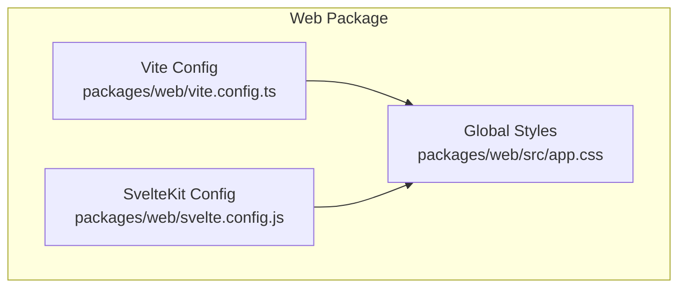
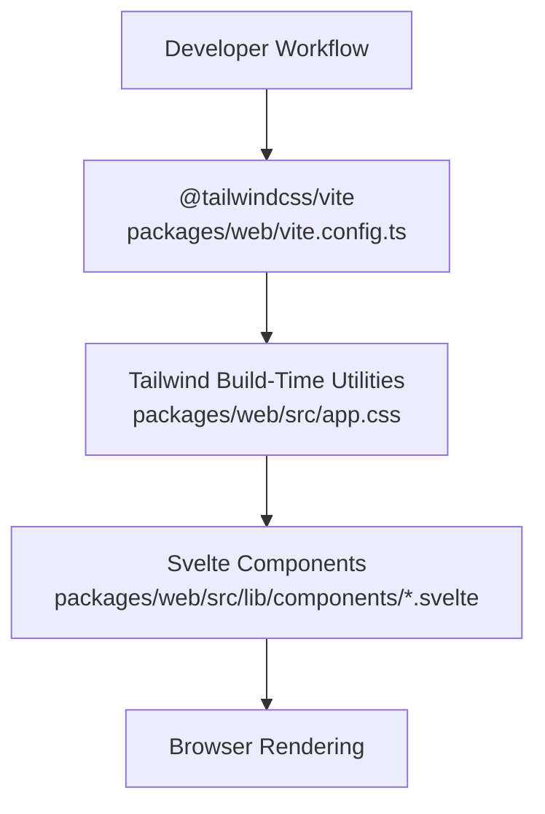
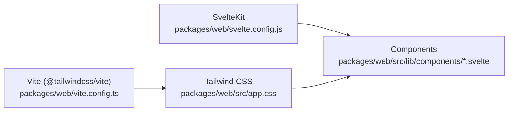

# Styling and Theming

<cite>
**Referenced Files in This Document**
- [app.css](file://packages/web/src/app.css)
- [package.json](file://packages/web/package.json)
- [vite.config.ts](file://packages/web/vite.config.ts)
- [svelte.config.js](file://packages/web/svelte.config.js)
- [Footer.svelte](file://packages/web/src/lib/components/Footer.svelte)
- [Navbar.svelte](file://packages/web/src/lib/components/Navbar.svelte)
</cite>

## Table of Contents
1. [Introduction](#introduction)
2. [Project Structure](#project-structure)
3. [Core Components](#core-components)
4. [Architecture Overview](#architecture-overview)
5. [Detailed Component Analysis](#detailed-component-analysis)
6. [Dependency Analysis](#dependency-analysis)
7. [Performance Considerations](#performance-considerations)
8. [Troubleshooting Guide](#troubleshooting-guide)
9. [Conclusion](#conclusion)

## Introduction
This document explains the styling architecture and theming strategy for the web application. It covers the Tailwind CSS integration, custom design tokens, utility-first patterns, responsive design, dark mode considerations, and how custom CSS integrates with Tailwind utilities. It also provides guidelines for maintaining design system coherence and performance best practices.

## Project Structure
The styling system centers around a single global stylesheet that imports Tailwind and defines design tokens and custom utilities. Tailwind is integrated via the Vite plugin, and SvelteKit handles SSR/SSG and routing.

**Diagram sources**
- [vite.config.ts](file://packages/web/vite.config.ts#L1-L8)
- [svelte.config.js](file://packages/web/svelte.config.js#L1-L14)
- [app.css](file://packages/web/src/app.css#L1-L122)

**Section sources**
- [vite.config.ts](file://packages/web/vite.config.ts#L1-L8)
- [svelte.config.js](file://packages/web/svelte.config.js#L1-L14)
- [app.css](file://packages/web/src/app.css#L1-L122)

## Core Components
- Global stylesheet imports Tailwind and defines custom design tokens and utilities.
- Tailwind is loaded via the Vite plugin, ensuring utilities are generated at build time.
- SvelteKit manages the Svelte runtime and routing; styling is applied globally and per-component.

Key aspects:
- Design tokens are defined as CSS custom properties for colors and fonts.
- Utilities include animations, button hover effects, card hover effects, scrollbars, and decorative elements.
- No explicit dark mode implementation is present in the current codebase.

**Section sources**
- [app.css](file://packages/web/src/app.css#L1-L122)
- [package.json](file://packages/web/package.json#L1-L29)
- [vite.config.ts](file://packages/web/vite.config.ts#L1-L8)

## Architecture Overview
The styling pipeline is straightforward: Vite loads Tailwind via the official plugin, SvelteKit renders pages, and the global stylesheet provides design tokens and custom utilities.

**Diagram sources**
- [vite.config.ts](file://packages/web/vite.config.ts#L1-L8)
- [app.css](file://packages/web/src/app.css#L1-L122)
- [Footer.svelte](file://packages/web/src/lib/components/Footer.svelte)
- [Navbar.svelte](file://packages/web/src/lib/components/Navbar.svelte)

## Detailed Component Analysis
This section documents how Tailwind utilities and custom CSS are applied consistently across components.

### Global Styles and Design Tokens
- Design tokens define color palettes and typography families as CSS custom properties.
- Base styles set body font family and background/text colors using tokens.
- Decorative utilities include a grain texture overlay, hand-drawn underlines, squiggle dividers, and animations.
- Interactive utilities provide button lift and card hover effects with transitions and shadows.
- Accessibility and UX utilities include a styled scrollbar and a details summary toggle pattern.

These utilities enable a consistent, utility-first approach across components.

**Section sources**
- [app.css](file://packages/web/src/app.css#L3-L29)
- [app.css](file://packages/web/src/app.css#L31-L36)
- [app.css](file://packages/web/src/app.css#L38-L46)
- [app.css](file://packages/web/src/app.css#L48-L55)
- [app.css](file://packages/web/src/app.css#L57-L63)
- [app.css](file://packages/web/src/app.css#L65-L92)
- [app.css](file://packages/web/src/app.css#L94-L111)
- [app.css](file://packages/web/src/app.css#L112-L122)

### Component-Level Styling Patterns
- Components import the global stylesheet so they inherit design tokens and utilities.
- Consistency is achieved by applying Tailwind utilities directly in markup and reusing custom utilities (e.g., hover effects, animations).
- Typography and spacing should reference tokens to maintain coherence.

Note: The Navbar and Footer components are part of the library and benefit from the global styles.

**Section sources**
- [Footer.svelte](file://packages/web/src/lib/components/Footer.svelte)
- [Navbar.svelte](file://packages/web/src/lib/components/Navbar.svelte)
- [app.css](file://packages/web/src/app.css#L1-L122)

### Responsive Design and Mobile-First Approach
- Tailwind’s responsive modifiers are used to adapt layouts across breakpoints.
- The global stylesheet does not define custom breakpoint scales; responsiveness relies on Tailwind’s defaults.
- Components should apply responsive utilities to ensure mobile-first behavior.

[No sources needed since this section provides general guidance derived from Tailwind’s documented behavior]

### Dark Mode Implementation and Theme Switching
- There is no explicit dark mode implementation in the current codebase.
- If dark mode is introduced later, consider:
  - Defining a second set of design tokens for dark mode.
  - Using a theme attribute on the root element and toggling it via JavaScript.
  - Leveraging Tailwind’s dark mode variant by configuring the strategy appropriately.

[No sources needed since this section proposes future enhancements]

### CSS-in-JS Alternatives
- For dynamic or component-scoped styles, consider CSS modules or inline styles sparingly.
- Prefer Tailwind utilities and the global stylesheet for consistency and performance.
- Avoid heavy CSS-in-JS libraries to preserve build-time optimizations.

[No sources needed since this section provides general guidance]

## Dependency Analysis
Tailwind is integrated via the Vite plugin, and SvelteKit manages the Svelte ecosystem. The global stylesheet acts as the single source of truth for design tokens and utilities.

**Diagram sources**
- [vite.config.ts](file://packages/web/vite.config.ts#L1-L8)
- [svelte.config.js](file://packages/web/svelte.config.js#L1-L14)
- [app.css](file://packages/web/src/app.css#L1-L122)
- [Footer.svelte](file://packages/web/src/lib/components/Footer.svelte)
- [Navbar.svelte](file://packages/web/src/lib/components/Navbar.svelte)

**Section sources**
- [vite.config.ts](file://packages/web/vite.config.ts#L1-L8)
- [svelte.config.js](file://packages/web/svelte.config.js#L1-L14)
- [app.css](file://packages/web/src/app.css#L1-L122)

## Performance Considerations
- Keep styles scoped to the global stylesheet to leverage Tailwind’s purging and minification during builds.
- Avoid runtime style generation to maintain deterministic CSS output.
- Use Tailwind utilities instead of ad-hoc CSS to reduce CSS size and improve caching.
- Minimize custom CSS to essential utilities and ensure they are small and reusable.

[No sources needed since this section provides general guidance]

## Troubleshooting Guide
- If Tailwind utilities do not appear, verify the Vite plugin is configured and the global stylesheet is imported by the SvelteKit app.
- If design tokens are not applied, confirm the custom properties are defined in the global stylesheet and referenced in components.
- For interactive effects (hover, animations), ensure the custom utilities are present in the global stylesheet and applied in components.

**Section sources**
- [vite.config.ts](file://packages/web/vite.config.ts#L1-L8)
- [app.css](file://packages/web/src/app.css#L1-L122)

## Conclusion
The project employs a clean, utility-first approach powered by Tailwind CSS and a global stylesheet that defines design tokens and custom utilities. The current implementation emphasizes consistency, performance, and maintainability. Future enhancements can introduce dark mode and responsive variants while preserving the existing design system.