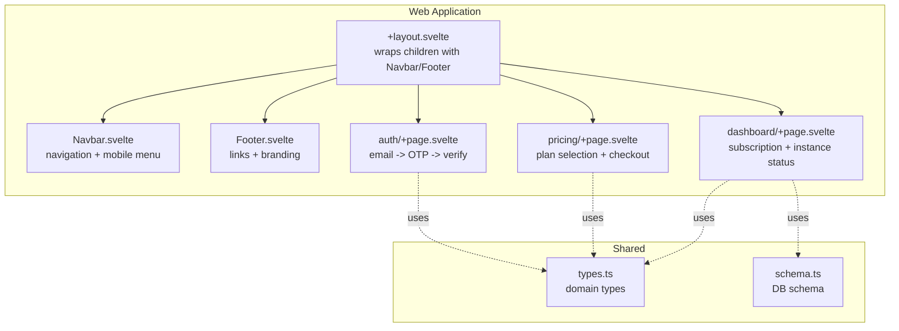
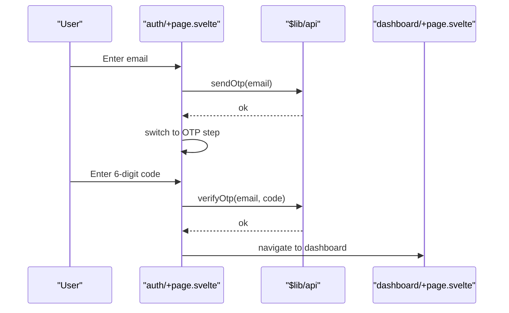
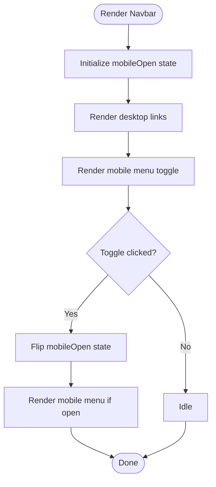
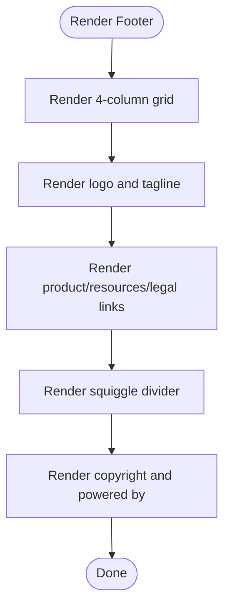
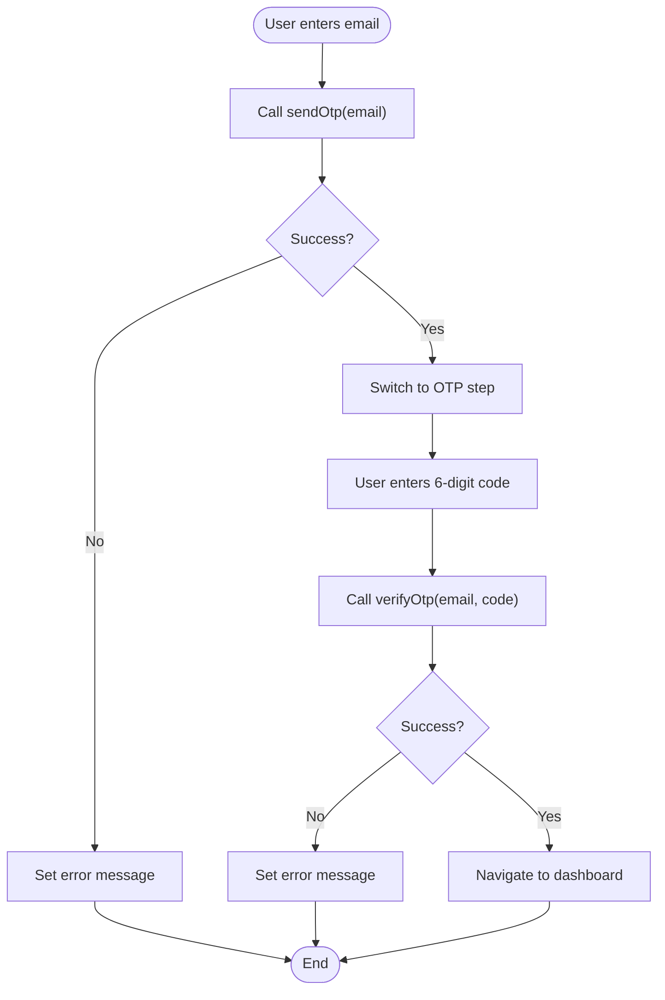
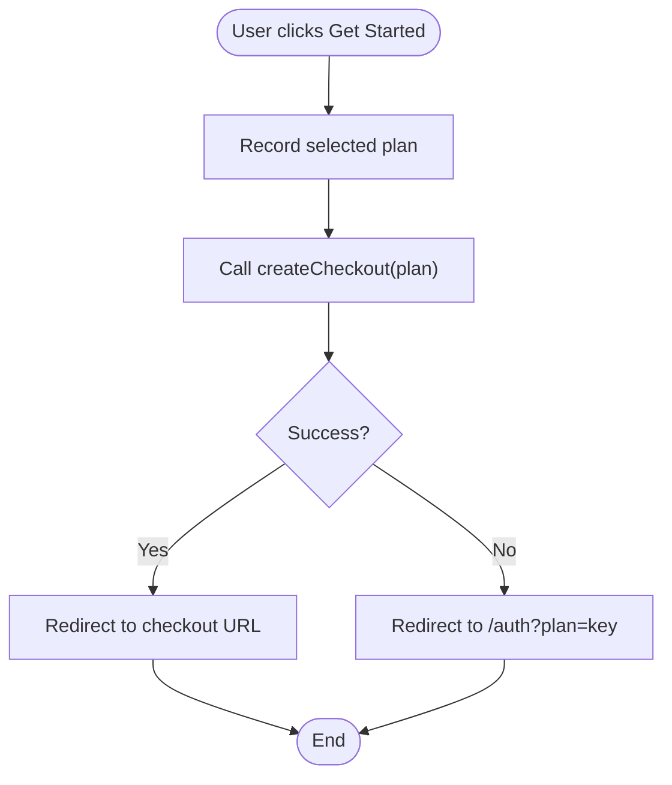
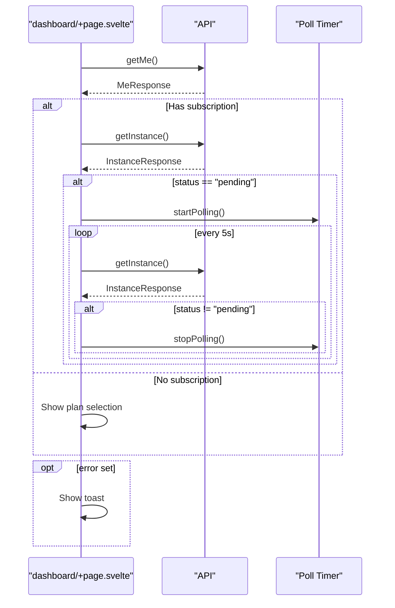
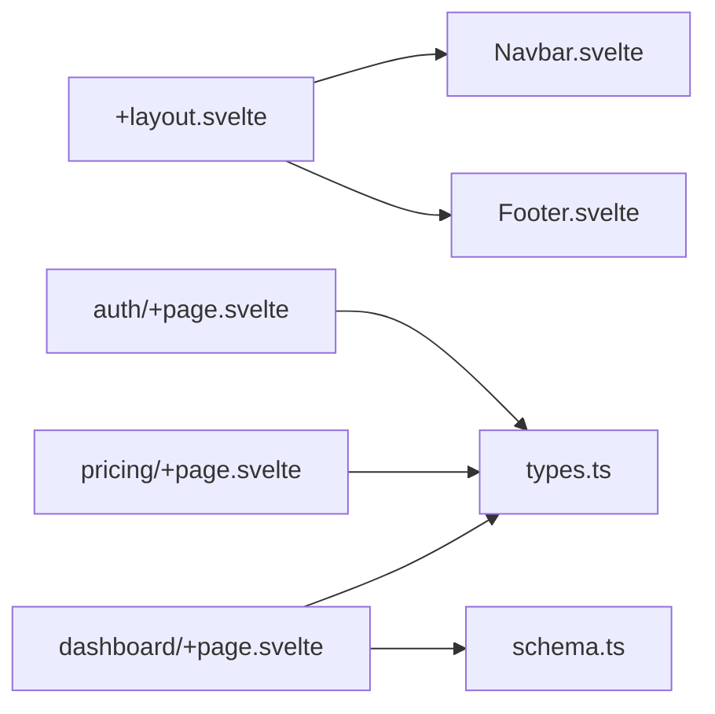

# UI Components

<cite>
**Referenced Files in This Document**
- [package.json](file://package.json)
- [svelte.config.js](file://packages/web/svelte.config.js)
- [app.css](file://packages/web/src/app.css)
- [+layout.svelte](file://packages/web/src/routes/+layout.svelte)
- [Navbar.svelte](file://packages/web/src/lib/components/Navbar.svelte)
- [Footer.svelte](file://packages/web/src/lib/components/Footer.svelte)
- [auth/+page.svelte](file://packages/web/src/routes/auth/+page.svelte)
- [pricing/+page.svelte](file://packages/web/src/routes/pricing/+page.svelte)
- [dashboard/+page.svelte](file://packages/web/src/routes/dashboard/+page.svelte)
- [types.ts](file://packages/shared/src/types.ts)
- [schema.ts](file://packages/shared/src/db/schema.ts)
- [day1-foundation.md](file://docs/plans/2026-03-07-day1-foundation.md)
- [quality-10-plan.md](file://docs/plans/2026-03-07-quality-10-plan.md)
</cite>

## Table of Contents
1. [Introduction](#introduction)
2. [Project Structure](#project-structure)
3. [Core Components](#core-components)
4. [Architecture Overview](#architecture-overview)
5. [Detailed Component Analysis](#detailed-component-analysis)
6. [Dependency Analysis](#dependency-analysis)
7. [Performance Considerations](#performance-considerations)
8. [Troubleshooting Guide](#troubleshooting-guide)
9. [Conclusion](#conclusion)
10. [Appendices](#appendices)

## Introduction
This document describes the SvelteKit UI component library for SparkClaw. It focuses on reusable UI patterns present in the current codebase, including authentication flows, OTP verification, subscription presentation, instance status displays, navigation, and footers. It explains component props, events, slots, styling via Tailwind CSS and custom CSS variables, state management, communication with parent components, and testing strategies. Where applicable, it also outlines conceptual patterns for future components such as modal dialogs and notifications.

## Project Structure
The UI is organized as a SvelteKit application with a small set of shared components and route-level pages. The layout composes a global navigation and footer around page content. Styles are centralized in a single CSS file that defines design tokens and utility classes.

**Diagram sources**
- [+layout.svelte](file://packages/web/src/routes/+layout.svelte#L1-L11)
- [Navbar.svelte](file://packages/web/src/lib/components/Navbar.svelte#L1-L51)
- [Footer.svelte](file://packages/web/src/lib/components/Footer.svelte#L1-L54)
- [auth/+page.svelte](file://packages/web/src/routes/auth/+page.svelte#L1-L122)
- [pricing/+page.svelte](file://packages/web/src/routes/pricing/+page.svelte#L1-L80)
- [dashboard/+page.svelte](file://packages/web/src/routes/dashboard/+page.svelte#L156-L211)
- [types.ts](file://packages/shared/src/types.ts#L1-L26)
- [schema.ts](file://packages/shared/src/db/schema.ts#L1-L28)

**Section sources**
- [+layout.svelte](file://packages/web/src/routes/+layout.svelte#L1-L11)
- [Navbar.svelte](file://packages/web/src/lib/components/Navbar.svelte#L1-L51)
- [Footer.svelte](file://packages/web/src/lib/components/Footer.svelte#L1-L54)
- [auth/+page.svelte](file://packages/web/src/routes/auth/+page.svelte#L1-L122)
- [pricing/+page.svelte](file://packages/web/src/routes/pricing/+page.svelte#L1-L80)
- [dashboard/+page.svelte](file://packages/web/src/routes/dashboard/+page.svelte#L156-L211)
- [types.ts](file://packages/shared/src/types.ts#L1-L26)
- [schema.ts](file://packages/shared/src/db/schema.ts#L1-L28)

## Core Components
- Navigation Bar (Navbar): Fixed header with logo, desktop links, CTA, and a responsive mobile menu. Uses page state to highlight active links and toggles a mobile menu state.
- Footer: Multi-column layout with product, resources, legal links and squiggle dividers. Uses design tokens for colors and typography.
- Authentication Page: Two-step authentication flow with email input and OTP verification. Handles loading, errors, and redirects to dashboard with optional plan context.
- Pricing Page: Plan cards with feature lists and a checkout flow. Redirects to auth if checkout fails.
- Dashboard Page: Displays subscription and instance status, quick actions, and toast notifications.

**Section sources**
- [Navbar.svelte](file://packages/web/src/lib/components/Navbar.svelte#L1-L51)
- [Footer.svelte](file://packages/web/src/lib/components/Footer.svelte#L1-L54)
- [auth/+page.svelte](file://packages/web/src/routes/auth/+page.svelte#L1-L122)
- [pricing/+page.svelte](file://packages/web/src/routes/pricing/+page.svelte#L1-L80)
- [dashboard/+page.svelte](file://packages/web/src/routes/dashboard/+page.svelte#L156-L211)

## Architecture Overview
The UI follows a SvelteKit routing model with a shared layout. Route pages encapsulate business logic and render reusable components. Styling leverages Tailwind utility classes and custom CSS variables defined in a central stylesheet. State is managed locally within route components using Svelte’s reactive declarations.

**Diagram sources**
- [auth/+page.svelte](file://packages/web/src/routes/auth/+page.svelte#L20-L49)
- [dashboard/+page.svelte](file://packages/web/src/routes/dashboard/+page.svelte#L156-L211)
- [day1-foundation.md](file://docs/plans/2026-03-07-day1-foundation.md#L729-L816)

## Detailed Component Analysis

### Navbar Component
- Purpose: Provide primary navigation and branding with responsive behavior.
- Props: None (uses internal state for mobile menu).
- Events: None (uses local state and click handlers).
- Slots: None.
- Styling: Uses Tailwind utility classes and design tokens for colors and typography.
- Accessibility: Includes aria-label on the mobile menu button.
- Composition: Used by the global layout to wrap page content.

**Diagram sources**
- [Navbar.svelte](file://packages/web/src/lib/components/Navbar.svelte#L1-L51)

**Section sources**
- [Navbar.svelte](file://packages/web/src/lib/components/Navbar.svelte#L1-L51)
- [+layout.svelte](file://packages/web/src/routes/+layout.svelte#L1-L11)

### Footer Component
- Purpose: Present site links and branding.
- Props: None.
- Events: None.
- Slots: None.
- Styling: Uses Tailwind utility classes and design tokens; includes decorative SVG backgrounds.
- Accessibility: No explicit ARIA attributes; consider adding roles for landmark regions if needed.

**Diagram sources**
- [Footer.svelte](file://packages/web/src/lib/components/Footer.svelte#L1-L54)

**Section sources**
- [Footer.svelte](file://packages/web/src/lib/components/Footer.svelte#L1-L54)

### Authentication Form Component
- Purpose: Email-based magic-link authentication with OTP verification.
- Props: None.
- Events: None (uses local state and navigation).
- Slots: None.
- State:
  - email: string
  - code: string
  - step: "email" | "otp"
  - loading: boolean
  - error: string
- Validation:
  - Email input is required.
  - OTP input requires exactly 6 numeric digits.
- Accessibility:
  - Labels for inputs.
  - Disabled states during loading.
  - Keyboard support via form submission.
- Communication:
  - Calls API functions to send and verify OTP.
  - On success, navigates to dashboard with optional plan parameter.
- Styling: Tailwind utility classes; button lift effect; animated entrance.

**Diagram sources**
- [auth/+page.svelte](file://packages/web/src/routes/auth/+page.svelte#L20-L49)

**Section sources**
- [auth/+page.svelte](file://packages/web/src/routes/auth/+page.svelte#L1-L122)

### Pricing Cards Component
- Purpose: Present subscription plans and initiate checkout.
- Props: None.
- Events: None (uses local state and navigation).
- Slots: None.
- State:
  - loading: Plan | null
- Data:
  - plans: array of plan objects with key, name, price, tagline, features.
- Behavior:
  - Calls createCheckout(plan).
  - Redirects to checkout URL on success; otherwise falls back to auth with plan context.
- Styling: Tailwind utility classes; highlighted “Popular” card; hover effects.

**Diagram sources**
- [pricing/+page.svelte](file://packages/web/src/routes/pricing/+page.svelte#L22-L32)

**Section sources**
- [pricing/+page.svelte](file://packages/web/src/routes/pricing/+page.svelte#L1-L80)

### Dashboard Instance Status Component
- Purpose: Display subscription and instance status; provide quick actions; show toast notifications.
- Props: None.
- Events: None.
- Slots: None.
- State:
  - user: MeResponse | null
  - instance: InstanceResponse | null
  - loading: boolean
  - error: string
  - pollingActive: boolean
- Behavior:
  - Loads user and optionally instance.
  - Auto-polls instance while status is pending.
  - Shows different UI blocks based on subscription and instance statuses.
  - Displays a toast notification when error is set.
- Styling: Tailwind utility classes; hover and lift effects; staggered animations.

**Diagram sources**
- [dashboard/+page.svelte](file://packages/web/src/routes/dashboard/+page.svelte#L156-L211)
- [quality-10-plan.md](file://docs/plans/2026-03-07-quality-10-plan.md#L1256-L1475)

**Section sources**
- [dashboard/+page.svelte](file://packages/web/src/routes/dashboard/+page.svelte#L156-L211)
- [quality-10-plan.md](file://docs/plans/2026-03-07-quality-10-plan.md#L1256-L1475)

### Conceptual Overview
- Modal Dialogs: Not present in the current codebase. Conceptually, a modal would accept props for content, open state, and actions, and emit events for close and confirm. It would use slots for flexible content and Tailwind for overlay and panel styles.
- Notification Systems: Toast notifications are present in the dashboard. Conceptually, a notification component would accept severity, message, and duration, and expose imperative methods to enqueue notifications.

[No sources needed since this section doesn't analyze specific source files]

## Dependency Analysis
- Layout depends on Navbar and Footer.
- Pages depend on shared types and schemas for typing and domain contracts.
- Authentication and pricing pages depend on API functions for network operations.
- Dashboard depends on API and schema types for state and rendering.

**Diagram sources**
- [+layout.svelte](file://packages/web/src/routes/+layout.svelte#L1-L11)
- [Navbar.svelte](file://packages/web/src/lib/components/Navbar.svelte#L1-L51)
- [Footer.svelte](file://packages/web/src/lib/components/Footer.svelte#L1-L54)
- [auth/+page.svelte](file://packages/web/src/routes/auth/+page.svelte#L1-L122)
- [pricing/+page.svelte](file://packages/web/src/routes/pricing/+page.svelte#L1-L80)
- [dashboard/+page.svelte](file://packages/web/src/routes/dashboard/+page.svelte#L156-L211)
- [types.ts](file://packages/shared/src/types.ts#L1-L26)
- [schema.ts](file://packages/shared/src/db/schema.ts#L1-L28)

**Section sources**
- [+layout.svelte](file://packages/web/src/routes/+layout.svelte#L1-L11)
- [auth/+page.svelte](file://packages/web/src/routes/auth/+page.svelte#L1-L122)
- [pricing/+page.svelte](file://packages/web/src/routes/pricing/+page.svelte#L1-L80)
- [dashboard/+page.svelte](file://packages/web/src/routes/dashboard/+page.svelte#L156-L211)
- [types.ts](file://packages/shared/src/types.ts#L1-L26)
- [schema.ts](file://packages/shared/src/db/schema.ts#L1-L28)

## Performance Considerations
- Prefer lightweight components and avoid unnecessary re-renders by keeping state scoped to route components.
- Debounce or throttle user input in forms where appropriate.
- Use Svelte’s built-in transitions sparingly to avoid layout thrashing.
- Lazy-load heavy assets and defer non-critical scripts.
- Keep CSS modular and avoid deep selector chains to reduce specificity conflicts.

[No sources needed since this section provides general guidance]

## Troubleshooting Guide
- Authentication failures:
  - Ensure API endpoints for sending and verifying OTP are reachable.
  - Confirm that the plan parameter is validated before redirecting to the dashboard.
- Dashboard polling:
  - Verify that polling is started only when instance status is pending and stopped when it changes.
  - Handle errors by stopping polling and displaying a toast.
- Styling issues:
  - Confirm Tailwind is configured and design tokens are defined in the global stylesheet.
  - Check for missing CSS variables or incorrect class names.

**Section sources**
- [auth/+page.svelte](file://packages/web/src/routes/auth/+page.svelte#L13-L18)
- [dashboard/+page.svelte](file://packages/web/src/routes/dashboard/+page.svelte#L1323-L1340)
- [app.css](file://packages/web/src/app.css#L4-L29)

## Conclusion
The current UI library centers on a clean, accessible design using Tailwind and SvelteKit. The authentication flow, pricing cards, and dashboard status display demonstrate practical patterns for form handling, state management, and user feedback. Extending the library with modal dialogs and a notification system will improve UX consistency and maintainability.

[No sources needed since this section summarizes without analyzing specific files]

## Appendices

### Styling with Tailwind and Custom CSS Variables
- Design tokens are defined in the global stylesheet and consumed via CSS variables for colors and fonts.
- Utility classes are applied directly in components for layout, spacing, and interactive states.
- Decorative elements (e.g., squiggle dividers, hand-drawn underlines) are implemented with inline SVG backgrounds.

**Section sources**
- [app.css](file://packages/web/src/app.css#L4-L29)
- [app.css](file://packages/web/src/app.css#L48-L63)
- [app.css](file://packages/web/src/app.css#L94-L109)

### Component State Management Patterns
- Reactive declarations ($state) are used to manage component-local state.
- Route-level pages orchestrate API calls and update state accordingly.
- Parent-child communication is handled via navigation and URL parameters.

**Section sources**
- [auth/+page.svelte](file://packages/web/src/routes/auth/+page.svelte#L7-L11)
- [pricing/+page.svelte](file://packages/web/src/routes/pricing/+page.svelte#L5)
- [dashboard/+page.svelte](file://packages/web/src/routes/dashboard/+page.svelte#L1267-L1271)

### Component Testing Strategies
- Unit tests for route logic:
  - Mock API functions and assert state transitions after send/verify OTP.
  - Validate plan parameter parsing and redirection behavior.
- Integration tests for flows:
  - Simulate end-to-end authentication and dashboard status updates.
- Visual regression tests:
  - Capture baseline screenshots of key components (pricing cards, dashboard status) across states.

[No sources needed since this section provides general guidance]