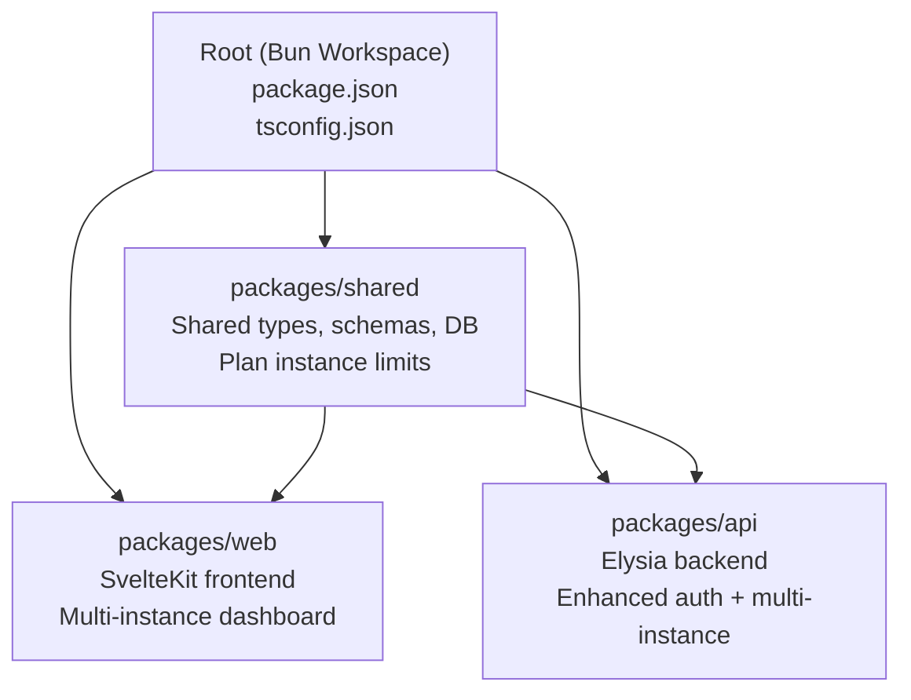
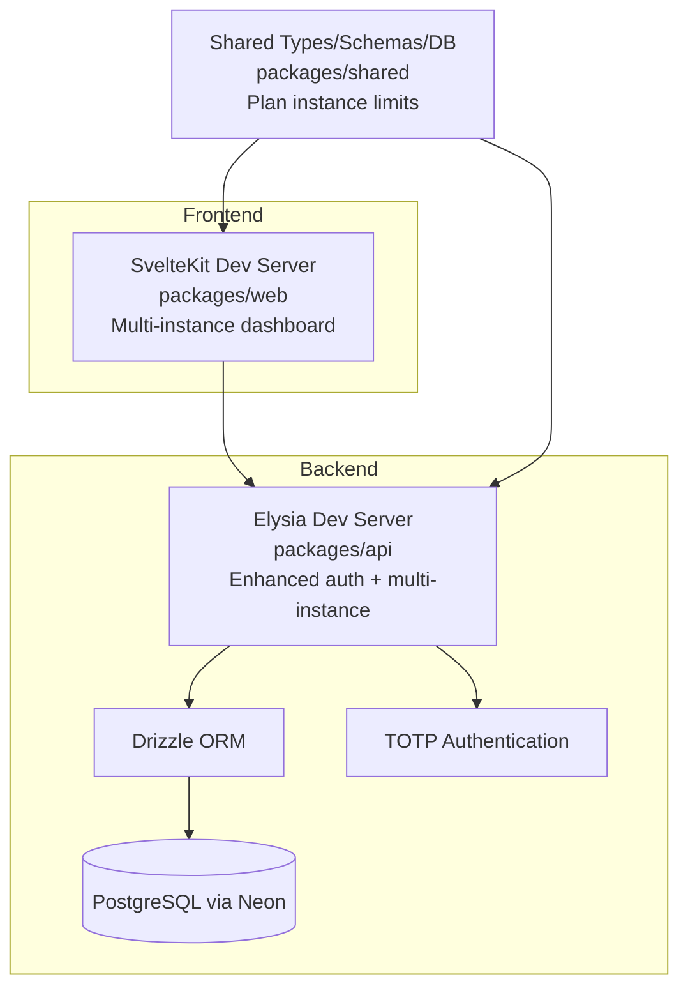
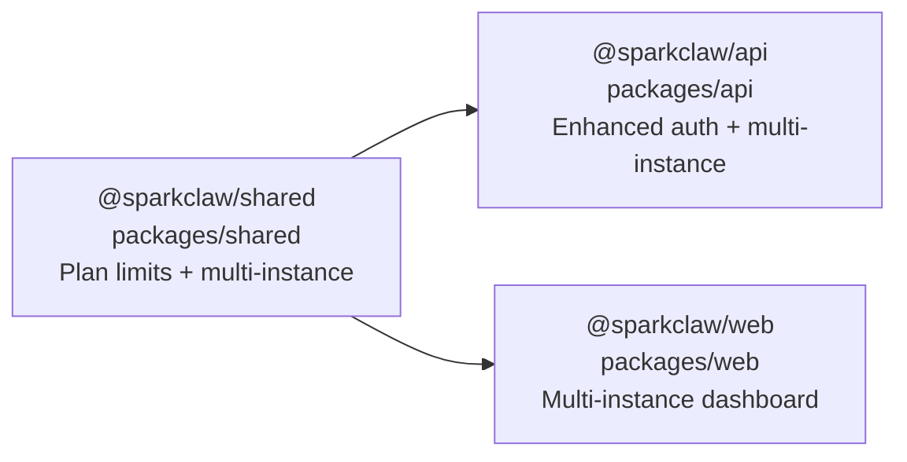

# Getting Started

<cite>
**Referenced Files in This Document**
- [package.json](file://package.json)
- [tsconfig.json](file://tsconfig.json)
- [drizzle.config.ts](file://drizzle.config.ts)
- [packages/api/package.json](file://packages/api/package.json)
- [packages/web/package.json](file://packages/web/package.json)
- [packages/shared/package.json](file://packages/shared/package.json)
- [packages/shared/src/db/schema.ts](file://packages/shared/src/db/schema.ts)
- [packages/shared/src/types.ts](file://packages/shared/src/types.ts)
- [packages/shared/src/schemas.ts](file://packages/shared/src/schemas.ts)
- [packages/shared/src/constants.ts](file://packages/shared/src/constants.ts)
- [PRD.md](file://PRD.md)
- [packages/api/src/routes/api.ts](file://packages/api/src/routes/api.ts)
- [packages/api/src/routes/setup.ts](file://packages/api/src/routes/setup.ts)
- [packages/web/src/lib/api.ts](file://packages/web/src/lib/api.ts)
</cite>

## Update Summary
**Changes Made**
- Updated multi-instance architecture requirements and implementation
- Added enhanced authentication flows with TOTP support
- Updated API endpoints to support multi-instance CRUD operations
- Enhanced database schema with plan instance limits
- Updated frontend components to handle multiple instances
- Added new environment variables for enhanced security

## Table of Contents
1. [Introduction](#introduction)
2. [Project Structure](#project-structure)
3. [Core Components](#core-components)
4. [Architecture Overview](#architecture-overview)
5. [Detailed Component Analysis](#detailed-component-analysis)
6. [Dependency Analysis](#dependency-analysis)
7. [Performance Considerations](#performance-considerations)
8. [Troubleshooting Guide](#troubleshooting-guide)
9. [Conclusion](#conclusion)
10. [Appendices](#appendices)

## Introduction
This guide helps you set up the SparkClaw development environment using Bun workspaces. You will install prerequisites, configure environment variables, run database migrations, and start the frontend, backend, and database services locally. The project follows a modern monorepo structure with three packages:
- packages/web: SvelteKit frontend with multi-instance dashboard
- packages/api: Elysia backend with enhanced authentication and multi-instance support
- packages/shared: Shared types, schemas, constants, and database schema

**Updated** SparkClaw now supports multi-instance setup with enhanced authentication flows including TOTP (Two-Factor Authentication) for improved security.

By the end of this guide, you will be able to run the development servers, verify the environment, and perform basic API tests and frontend checks across multiple instances.

## Project Structure
SparkClaw uses Bun workspaces to manage a monorepo. The root defines workspace packages and shared scripts. Each package has its own package.json and scripts. Shared code lives under packages/shared and is imported by the other packages.



**Diagram sources**
- [package.json](file://package.json#L1-L23)
- [packages/web/package.json](file://packages/web/package.json#L1-L29)
- [packages/api/package.json](file://packages/api/package.json#L1-L25)
- [packages/shared/package.json](file://packages/shared/package.json#L1-L24)

**Section sources**
- [package.json](file://package.json#L1-L23)
- [tsconfig.json](file://tsconfig.json#L1-L22)

## Core Components
- Bun workspace root: Declares workspaces and top-level scripts for building, database operations, type checking, and testing.
- packages/web: SvelteKit-based frontend with Vite dev server, multi-instance dashboard, and enhanced authentication UI.
- packages/api: Elysia-based backend with CORS, Stripe, Resend, Drizzle ORM, and Neon Postgres driver, supporting multi-instance operations.
- packages/shared: Shared exports for types, schemas, constants, and database schema used by both frontend and backend.

Key scripts at the root enable:
- Development: dev:web and dev:api
- Build: build
- Database: db:generate, db:migrate, db:studio
- Type checking and tests

**Updated** Enhanced with multi-instance support and TOTP authentication.

**Section sources**
- [package.json](file://package.json#L5-L16)
- [packages/web/package.json](file://packages/web/package.json#L6-L13)
- [packages/api/package.json](file://packages/api/package.json#L6-L10)
- [packages/shared/package.json](file://packages/shared/package.json#L6-L13)

## Architecture Overview
The development stack integrates frontend, backend, and database with multi-instance support:
- Frontend (SvelteKit) communicates with the backend API and manages multiple instances.
- Backend (Elysia) connects to PostgreSQL via Drizzle ORM and Neon, supporting enhanced authentication with TOTP.
- Shared package provides types, schemas, and database schema used by both frontend and backend, including plan instance limits.



**Diagram sources**
- [packages/web/package.json](file://packages/web/package.json#L6-L13)
- [packages/api/package.json](file://packages/api/package.json#L11-L18)
- [packages/shared/src/db/schema.ts](file://packages/shared/src/db/schema.ts#L1-L146)
- [packages/shared/src/constants.ts](file://packages/shared/src/constants.ts#L29-L33)

## Detailed Component Analysis

### Prerequisites
- Node.js or Bun runtime: The project uses Bun workspaces and Bun-specific scripts. Install Bun from bun.sh.
- TypeScript knowledge: The project is TypeScript-based with strict compiler options.
- Modern web development familiarity: SvelteKit, Vite, and Elysia are used for frontend and backend respectively.

### Environment Variables
Set the following environment variables in your development environment. These are required for local development and are referenced by the backend and database tooling.

- DATABASE_URL: PostgreSQL connection string for Neon.
- STRIPE_SECRET_KEY: Stripe secret key for billing operations.
- STRIPE_WEBHOOK_SECRET: Stripe webhook signature verification.
- RAILWAY_API_TOKEN: Railway GraphQL API token for instance provisioning.
- RESEND_API_KEY: Resend API key for sending OTP emails.
- SESSION_SECRET: Secret for signing session cookies.
- SENTRY_DSN: Sentry DSN for error tracking.
- POSTHOG_API_KEY: PostHog analytics key.
- OPENCLAW_GATEWAY_TOKEN: Gateway token for OpenClaw instance communication.

**Updated** Added OPENCLAW_GATEWAY_TOKEN for enhanced instance management.

Notes:
- STRIPE_PRICE_{STARTER|PRO|SCALE}: Required by shared constants to resolve Stripe price IDs.
- SESSION_COOKIE_NAME: Defined in shared constants; ensure frontend respects the cookie name.
- PLAN_INSTANCE_LIMITS: New constant defining instance limits per plan (Starter: 1, Pro: 3, Scale: 10).

**Section sources**
- [PRD.md](file://PRD.md#L639-L651)
- [packages/shared/src/constants.ts](file://packages/shared/src/constants.ts#L29-L33)
- [drizzle.config.ts](file://drizzle.config.ts#L7-L9)

### Installation and Setup
Follow these steps to set up the development environment:

1. Install Bun (if not installed)
   - Download and install Bun from bun.sh.

2. Clone the repository and navigate to the project root.

3. Install dependencies
   - Run: bun install
   - This installs workspace dependencies for all packages.

4. Configure environment variables
   - Create a .env file at the repository root or configure your shell environment with the variables listed above.

5. Prepare the database
   - Generate migrations: bun run db:generate
   - Run migrations: bun run db:migrate
   - Optional: Open Drizzle Studio: bun run db:studio

6. Build shared package
   - Build shared artifacts: bun run build

7. Start services
   - Start backend: bun run dev:api
   - Start frontend: bun run dev:web

8. Verify the environment
   - Visit the frontend at http://localhost:5173
   - Backend health check: curl http://localhost:8080/ (adjust port as needed)
   - Basic API test: curl http://localhost:8080/api/me (requires authentication)

**Updated** Enhanced with multi-instance support and TOTP authentication.

**Section sources**
- [package.json](file://package.json#L5-L16)
- [drizzle.config.ts](file://drizzle.config.ts#L1-L13)
- [packages/shared/src/constants.ts](file://packages/shared/src/constants.ts#L29-L33)

### Local Development Workflow
- Frontend: packages/web uses Vite dev server with multi-instance dashboard. Scripts include dev, build, preview, check, and check:watch.
- Backend: packages/api uses Bun runtime with watch mode and enhanced authentication. Scripts include dev, build, and start.
- Database: Drizzle ORM with PostgreSQL via Neon. Use db:generate, db:migrate, and db:studio to manage schema and inspect data.

Recommended commands:
- bun run dev:web
- bun run dev:api
- bun run build
- bun run db:migrate
- bun run db:studio

**Updated** Enhanced with multi-instance CRUD operations and TOTP support.

**Section sources**
- [packages/web/package.json](file://packages/web/package.json#L6-L13)
- [packages/api/package.json](file://packages/api/package.json#L6-L10)
- [package.json](file://package.json#L9-L11)

### Initial Project Setup and Verification
- Initial setup
  - Install dependencies: bun install
  - Generate and run migrations: bun run db:generate && bun run db:migrate
  - Build shared: bun run build

- Verify
  - Frontend: Open http://localhost:5173 and confirm multi-instance dashboard renders.
  - Backend: Confirm API endpoints respond (e.g., /api/me after login).
  - Database: Use Drizzle Studio to inspect tables.

**Updated** Enhanced with multi-instance verification.

**Section sources**
- [package.json](file://package.json#L9-L11)
- [packages/web/package.json](file://packages/web/package.json#L6-L13)
- [packages/api/package.json](file://packages/api/package.json#L6-L10)

### API Testing Examples
- Send OTP: POST /auth/send-otp with a valid email.
- Verify OTP: POST /auth/verify-otp with email and 6-digit code.
- Create checkout session: POST /api/checkout with a plan.
- Get user info: GET /api/me (requires session).
- Get instances: GET /api/instances (requires session).
- Create instance: POST /api/instances with instanceName (requires session).
- Get instance: GET /api/instances/:id (requires session).
- Delete instance: DELETE /api/instances/:id (requires session).
- Get setup state: GET /api/setup/state?instanceId=:id (requires session).
- Save setup: POST /api/setup/save (requires session).
- Save channel credentials: POST /api/setup/channel (requires session).

Use curl or a REST client to test these endpoints against your local backend.

**Updated** Added multi-instance CRUD operations and enhanced setup endpoints.

**Section sources**
- [PRD.md](file://PRD.md#L508-L610)
- [packages/api/src/routes/api.ts](file://packages/api/src/routes/api.ts#L93-L182)
- [packages/api/src/routes/setup.ts](file://packages/api/src/routes/setup.ts#L40-L256)

### Enhanced Authentication Flow
**Updated** SparkClaw now supports enhanced authentication with TOTP (Two-Factor Authentication):

1. **Email OTP Authentication**
   - User enters email → Send OTP endpoint sends 6-digit code
   - User verifies OTP → Session created with HTTP-only cookie

2. **TOTP Enhancement**
   - Optional two-factor authentication setup
   - Users can enable TOTP for additional security
   - Backup codes generated for recovery

3. **Session Management**
   - HTTP-only, Secure, SameSite cookies
   - 30-day expiry for enhanced user experience
   - Automatic session renewal

**Section sources**
- [packages/api/src/routes/api.ts](file://packages/api/src/routes/api.ts#L62-L91)
- [packages/web/src/lib/api.ts](file://packages/web/src/lib/api.ts#L23-L45)

## Dependency Analysis
The packages depend on each other as follows:
- packages/api depends on @sparkclaw/shared for types, schemas, and DB client.
- packages/web depends on @sparkclaw/shared for shared types and constants.
- packages/shared is imported by both web and api and provides the database schema, shared validation logic, and plan instance limits.



**Diagram sources**
- [packages/api/package.json](file://packages/api/package.json#L18)
- [packages/web/package.json](file://packages/web/package.json#L26)
- [packages/shared/package.json](file://packages/shared/package.json#L6-L13)

**Section sources**
- [packages/api/package.json](file://packages/api/package.json#L18)
- [packages/web/package.json](file://packages/web/package.json#L26)
- [packages/shared/package.json](file://packages/shared/package.json#L6-L13)

## Performance Considerations
- Use Bun's native watch mode for faster iteration in development.
- Keep database connections efficient; leverage Neon's connection pooling.
- Minimize unnecessary rebuilds by organizing shared code in @sparkclaw/shared.
- **Updated** Optimize multi-instance queries with proper indexing on user_id and subscription_id.
- **Updated** Cache frequently accessed plan limits and instance counts.

## Troubleshooting Guide
Common issues and resolutions:
- Missing environment variables
  - Symptom: Backend fails to connect to database or external services.
  - Resolution: Ensure DATABASE_URL, STRIPE_SECRET_KEY, STRIPE_WEBHOOK_SECRET, RAILWAY_API_TOKEN, RESEND_API_KEY, SESSION_SECRET, SENTRY_DSN, POSTHOG_API_KEY, OPENCLAW_GATEWAY_TOKEN are set.
  - Related: STRIPE_PRICE_{STARTER|PRO|SCALE} must be present for shared constants to resolve price IDs.

- Database migration errors
  - Symptom: Migration fails or schema mismatch.
  - Resolution: Re-run bun run db:generate and bun run db:migrate. Use bun run db:studio to inspect.

- Port conflicts
  - Symptom: Cannot start Vite or Elysia on default ports.
  - Resolution: Change ports in the respective package configurations or stop conflicting services.

- Stripe webhook verification failures
  - Symptom: Webhook handler rejects events.
  - Resolution: Verify STRIPE_WEBHOOK_SECRET matches the webhook secret configured in Stripe.

- OTP delivery issues
  - Symptom: Users do not receive OTP emails.
  - Resolution: Confirm RESEND_API_KEY is valid and email provider settings are correct.

**Updated** Added troubleshooting for multi-instance and TOTP issues:
- Multi-instance limit exceeded: Check PLAN_INSTANCE_LIMITS and user subscription plan.
- TOTP setup failures: Verify TOTP secret generation and QR code display.
- Instance provisioning errors: Check Railway API token and service creation.

**Section sources**
- [PRD.md](file://PRD.md#L639-L651)
- [drizzle.config.ts](file://drizzle.config.ts#L7-L9)
- [packages/shared/src/constants.ts](file://packages/shared/src/constants.ts#L29-L33)

## Conclusion
You now have the SparkClaw development environment set up with Bun workspaces, configured environment variables, and a working monorepo supporting multi-instance operations and enhanced authentication. Start the frontend and backend, run migrations, and test the APIs to validate your setup. Refer to the troubleshooting section for common issues and consult the PRD for feature-level context.

**Updated** The environment now supports multi-instance setup with plan-based limits and enhanced security through TOTP authentication.

## Appendices

### Environment Variable Reference
- DATABASE_URL: PostgreSQL connection string for Neon.
- STRIPE_SECRET_KEY: Stripe secret key.
- STRIPE_WEBHOOK_SECRET: Stripe webhook signature secret.
- RAILWAY_API_TOKEN: Railway GraphQL API token.
- RESEND_API_KEY: Resend API key for OTP emails.
- SESSION_SECRET: Secret for signing session cookies.
- SENTRY_DSN: Sentry DSN for error tracking.
- POSTHOG_API_KEY: PostHog analytics key.
- STRIPE_PRICE_{STARTER|PRO|SCALE}: Stripe price IDs for plans.
- OPENCLAW_GATEWAY_TOKEN: Gateway token for OpenClaw instance communication.

**Updated** Added OPENCLAW_GATEWAY_TOKEN for enhanced instance management.

**Section sources**
- [PRD.md](file://PRD.md#L639-L651)
- [packages/shared/src/constants.ts](file://packages/shared/src/constants.ts#L29-L33)

### Database Schema Overview
The shared database schema defines users, OTP codes, sessions, subscriptions, instances, channel configurations, and additional tables with appropriate relations and indexes.

**Updated** Enhanced with multi-instance support and plan instance limits.

```mermaid
erDiagram
USERS {
uuid id PK
varchar email UK
varchar role
timestamp created_at
timestamp updated_at
}
OTP_CODES {
uuid id PK
varchar email
varchar code_hash
timestamp expires_at
timestamp used_at
timestamp created_at
}
SESSIONS {
uuid id PK
uuid user_id FK
varchar token UK
timestamp expires_at
timestamp created_at
}
SUBSCRIPTIONS {
uuid id PK
uuid user_id UK FK
varchar plan
varchar stripe_customer_id
varchar stripe_subscription_id UK
varchar status
timestamp current_period_end
timestamp created_at
timestamp updated_at
}
INSTANCES {
uuid id PK
uuid user_id FK
uuid subscription_id FK
varchar railway_project_id
varchar railway_service_id
varchar custom_domain
text railway_url
text url
varchar status
varchar domain_status
text error_message
boolean setup_completed
varchar instance_name
varchar timezone
jsonb ai_config
jsonb features
timestamp created_at
timestamp updated_at
}
CHANNEL_CONFIGS {
uuid id PK
uuid instance_id FK
varchar type
boolean enabled
jsonb credentials
jsonb settings
timestamp created_at
timestamp updated_at
}
USERS ||--o{ OTP_CODES : "has"
USERS ||--o{ SESSIONS : "has"
USERS ||--o{ SUBSCRIPTIONS : "has"
USERS ||--o{ INSTANCES : "has"
SUBSCRIPTIONS ||--o{ INSTANCES : "has"
INSTANCES ||--o{ CHANNEL_CONFIGS : "has"
```

**Diagram sources**
- [packages/shared/src/db/schema.ts](file://packages/shared/src/db/schema.ts#L19-L527)

### Multi-Instance API Endpoints
**Updated** New multi-instance endpoints for enhanced instance management:

- **GET /api/me** - Enhanced with instanceLimit and instanceCount
- **GET /api/instances** - List all user instances
- **GET /api/instances/:id** - Get specific instance (must belong to user)
- **POST /api/instances** - Create new instance (checks plan limits)
- **DELETE /api/instances/:id** - Delete instance (with cascade)
- **GET /api/instance** - Backward compatible endpoint (redirects to /api/instances)
- **GET /api/setup/state?instanceId=:id** - Setup wizard state for specific instance
- **POST /api/setup/save** - Save setup for specific instance
- **POST /api/setup/channel** - Save channel credentials for specific instance
- **DELETE /api/setup/channel/:type?instanceId=:id** - Delete channel configuration

**Section sources**
- [packages/api/src/routes/api.ts](file://packages/api/src/routes/api.ts#L93-L182)
- [packages/api/src/routes/setup.ts](file://packages/api/src/routes/setup.ts#L40-L256)

### Enhanced Authentication Endpoints
**Updated** Enhanced authentication with TOTP support:

- **POST /auth/send-otp** - Send OTP to email
- **POST /auth/verify-otp** - Verify OTP and create session
- **POST /auth/logout** - Clear session
- **POST /api/totp/status** - Check TOTP status
- **POST /api/totp/setup** - Setup TOTP with secret and QR code
- **POST /api/totp/verify** - Verify TOTP code
- **POST /api/totp/disable** - Disable TOTP

**Section sources**
- [packages/web/src/lib/api.ts](file://packages/web/src/lib/api.ts#L23-L145)