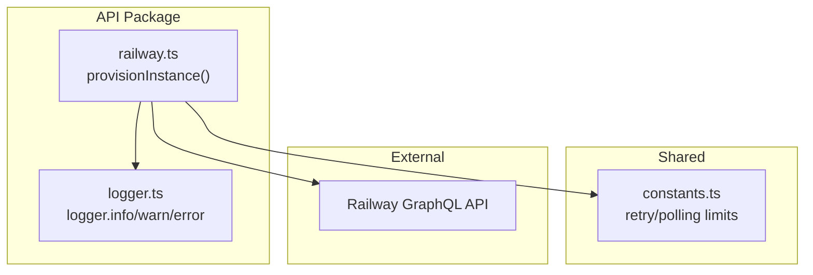
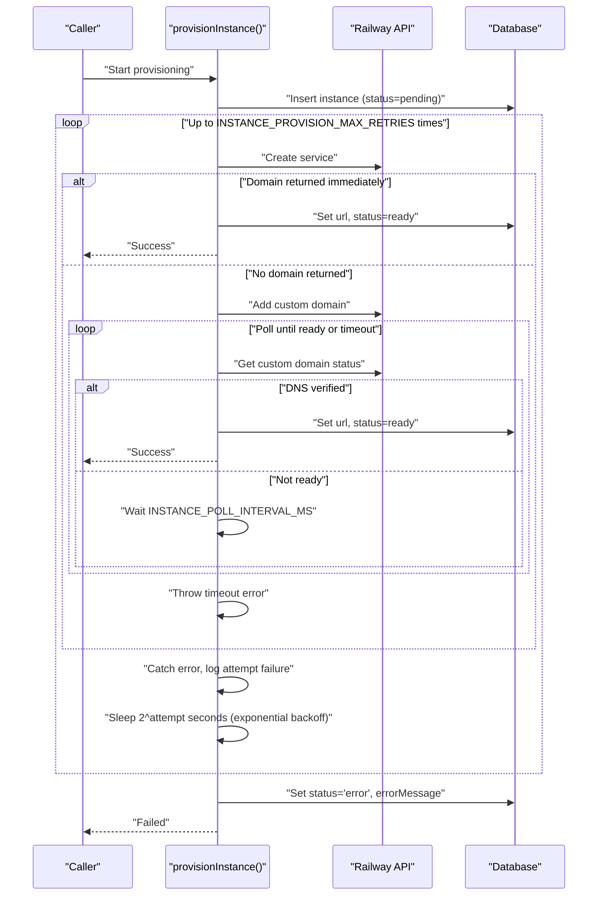
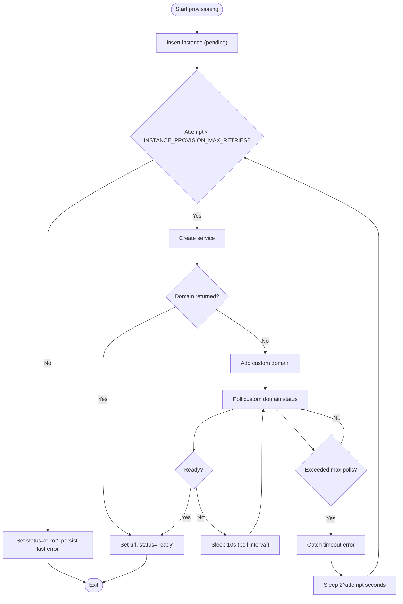
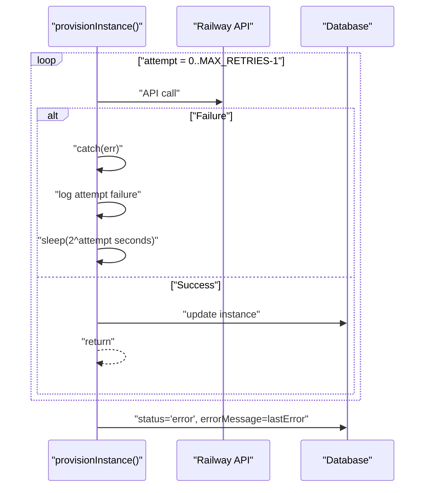
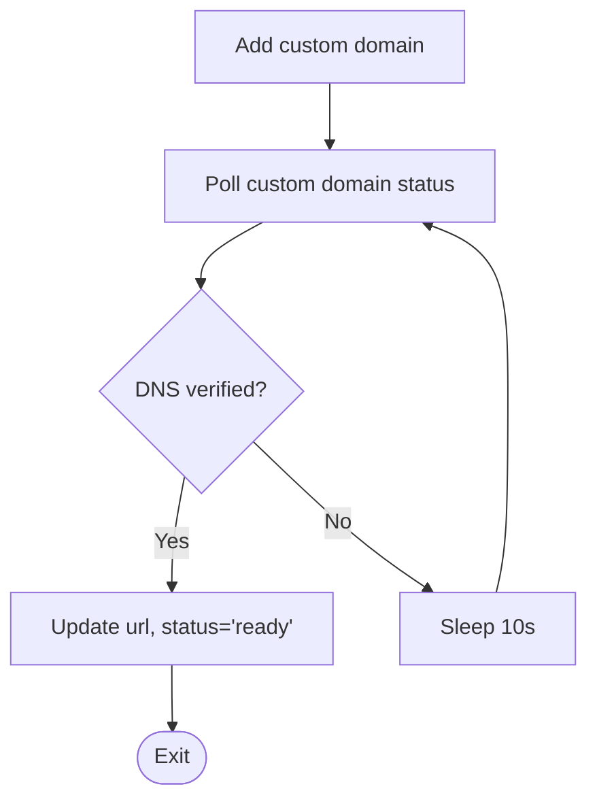
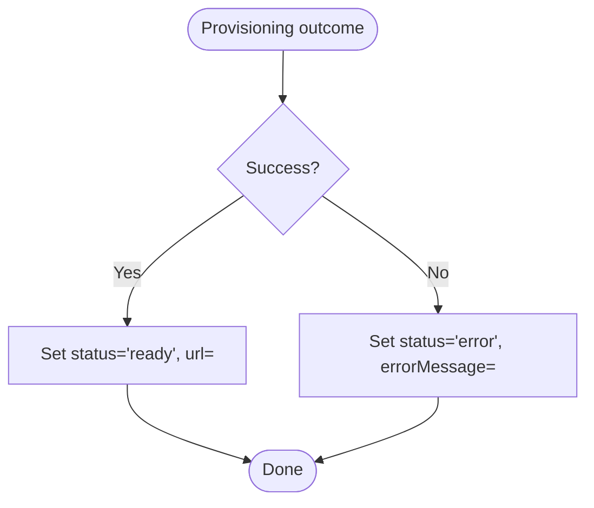
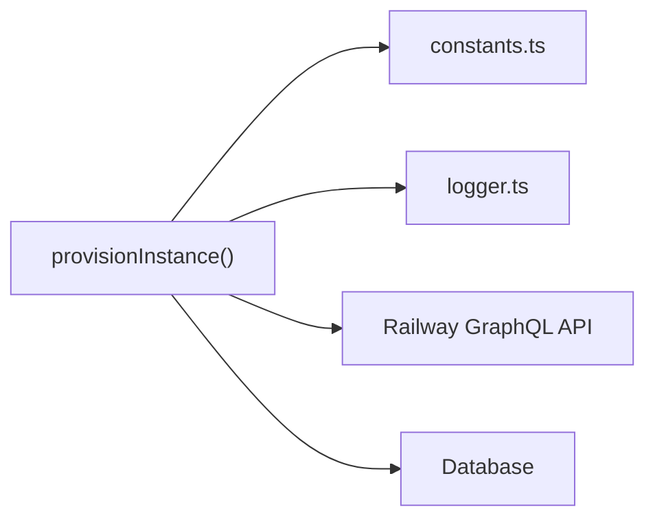

# Error Handling and Recovery

<cite>
**Referenced Files in This Document**
- [railway.ts](file://packages/api/src/services/railway.ts)
- [constants.ts](file://packages/shared/src/constants.ts)
- [logger.ts](file://packages/api/src/lib/logger.ts)
- [PRD.md](file://PRD.md)
</cite>

## Table of Contents
1. [Introduction](#introduction)
2. [Project Structure](#project-structure)
3. [Core Components](#core-components)
4. [Architecture Overview](#architecture-overview)
5. [Detailed Component Analysis](#detailed-component-analysis)
6. [Dependency Analysis](#dependency-analysis)
7. [Performance Considerations](#performance-considerations)
8. [Troubleshooting Guide](#troubleshooting-guide)
9. [Conclusion](#conclusion)
10. [Appendices](#appendices)

## Introduction
This document explains the error handling and recovery mechanisms for the instance provisioning system that deploys OpenClaw on Railway. It covers retry logic with exponential backoff, error categorization, propagation through the retry loop, fallback polling when direct domain assignment fails, error state management, timeout handling, administrative recovery procedures, logging strategies, and edge cases such as partial deployments and cleanup.

## Project Structure
The provisioning logic resides in the API package and relies on shared constants and logging utilities:
- Provisioning service: packages/api/src/services/railway.ts
- Constants (retry and polling configuration): packages/shared/src/constants.ts
- Logging utility: packages/api/src/lib/logger.ts
- Product Requirements and flow details: PRD.md

**Diagram sources**
- [railway.ts](file://packages/api/src/services/railway.ts#L277-L390)
- [constants.ts](file://packages/shared/src/constants.ts#L25-L27)
- [logger.ts](file://packages/api/src/lib/logger.ts#L10-L33)

**Section sources**
- [railway.ts](file://packages/api/src/services/railway.ts#L1-L391)
- [constants.ts](file://packages/shared/src/constants.ts#L1-L28)
- [logger.ts](file://packages/api/src/lib/logger.ts#L1-L34)
- [PRD.md](file://PRD.md#L131-L167)

## Core Components
- Retry loop with exponential backoff controlled by INSTANCE_PROVISION_MAX_RETRIES
- Fallback polling strategy controlled by INSTANCE_POLL_INTERVAL_MS and INSTANCE_POLL_MAX_ATTEMPTS
- Error propagation preserving the last error message
- Error state management updating instance status to "error" and storing errorMessage
- Structured logging for debugging and monitoring

Key behaviors:
- Maximum 3 retries for transient Railway API errors
- Exponential backoff: wait 2^attempt seconds between retries (with base unit of 1 second)
- If domain creation does not immediately yield a domain, poll for up to 60 seconds (6 attempts every 10 seconds)
- On exhaustion, set instance status to "error" and persist the last error message

**Section sources**
- [railway.ts](file://packages/api/src/services/railway.ts#L277-L390)
- [constants.ts](file://packages/shared/src/constants.ts#L25-L27)
- [PRD.md](file://PRD.md#L164-L166)

## Architecture Overview
The provisioning flow orchestrates Railway API calls, domain assignment, and fallback polling. Errors are caught, logged, retried with exponential backoff, and finally recorded as instance errors.

**Diagram sources**
- [railway.ts](file://packages/api/src/services/railway.ts#L277-L390)
- [constants.ts](file://packages/shared/src/constants.ts#L25-L27)

## Detailed Component Analysis

### Retry Logic with Exponential Backoff
- Retry count is bounded by INSTANCE_PROVISION_MAX_RETRIES (default 3)
- Backoff uses Math.pow(2, attempt) seconds between retries
- Errors thrown inside the loop are caught and logged; the last error is preserved for final persistence
- Successful outcomes short-circuit the loop and update the instance accordingly

**Diagram sources**
- [railway.ts](file://packages/api/src/services/railway.ts#L277-L390)
- [constants.ts](file://packages/shared/src/constants.ts#L25-L27)

**Section sources**
- [railway.ts](file://packages/api/src/services/railway.ts#L277-L390)
- [constants.ts](file://packages/shared/src/constants.ts#L25-L27)

### Error Categorization
- Transient errors: Network failures, temporary Railway API unavailability, rate limiting, or intermittent GraphQL errors. These cause retries with exponential backoff.
- Permanent failures: Invalid configuration (e.g., missing environment variables), invalid Railway project/environment, or unsupported states. These surface as unrecoverable errors after retries.
- Timeout conditions: Deployment polling timeout when a domain does not become ready within the configured attempts and interval.

The implementation catches exceptions during provisioning steps and logs them with the current attempt number. The last error is stored when retries are exhausted.

**Section sources**
- [railway.ts](file://packages/api/src/services/railway.ts#L277-L390)
- [logger.ts](file://packages/api/src/lib/logger.ts#L10-L33)

### Error Propagation Through the Retry Loop
- Each iteration captures the thrown error and logs it with structured metadata including instanceId and error message.
- The loop preserves the last error across iterations to ensure the most recent failure reason is persisted upon exhaustion.
- After the final retry, the system writes the error state to the database.

**Diagram sources**
- [railway.ts](file://packages/api/src/services/railway.ts#L277-L390)

**Section sources**
- [railway.ts](file://packages/api/src/services/railway.ts#L277-L390)

### Fallback Polling Strategy
- When immediate domain creation does not return a domain, the system adds a custom domain and polls for readiness.
- Polling interval and maximum attempts are governed by INSTANCE_POLL_INTERVAL_MS (10 seconds) and INSTANCE_POLL_MAX_ATTEMPTS (6).
- The polling checks the DNS verification status; upon readiness, the instance is marked ready and the URL is stored.

**Diagram sources**
- [railway.ts](file://packages/api/src/services/railway.ts#L338-L363)
- [constants.ts](file://packages/shared/src/constants.ts#L25-L27)

**Section sources**
- [railway.ts](file://packages/api/src/services/railway.ts#L338-L363)
- [constants.ts](file://packages/shared/src/constants.ts#L25-L27)

### Error State Management
- On successful provisioning, the instance URL and status are updated to "ready".
- On failure after all retries, the instance status is set to "error" and the errorMessage field is populated with the last observed error message.
- The database update includes a timestamp to reflect the latest state change.

**Diagram sources**
- [railway.ts](file://packages/api/src/services/railway.ts#L314-L361)
- [railway.ts](file://packages/api/src/services/railway.ts#L379-L387)

**Section sources**
- [railway.ts](file://packages/api/src/services/railway.ts#L314-L361)
- [railway.ts](file://packages/api/src/services/railway.ts#L379-L387)

### Timeout Handling and Graceful Degradation
- Deployment completion timeout occurs when the polling loop exceeds INSTANCE_POLL_MAX_ATTEMPTS (6 attempts) with 10-second intervals.
- The system throws a descriptive timeout error and proceeds to the retry loop’s error handling path.
- The retry loop applies exponential backoff before marking the instance as "error".

**Section sources**
- [railway.ts](file://packages/api/src/services/railway.ts#L365-L377)
- [constants.ts](file://packages/shared/src/constants.ts#L25-L27)

### Administrative Recovery Procedures
- Manual intervention steps:
  - Inspect the instance record in the database for status, error message, and timestamps.
  - Trigger a retry by invoking the provisioning function again with the same instance identifier.
  - Investigate external causes (Railway API availability, rate limits, environment configuration).
  - Optionally escalate to alerting channels as described in the PRD.
- Cleanup processes:
  - If partial resources were created (e.g., Railway service), administrators should remove them manually and reset the instance status to a clean state before re-provisioning.
  - The PRD outlines acceptable states and manual overrides for recovery scenarios.

**Section sources**
- [PRD.md](file://PRD.md#L305-L315)

## Dependency Analysis
The provisioning module depends on shared constants for timing and retry limits, and on the logging utility for structured logs. It interacts with the Railway GraphQL API and persists state to the database.

**Diagram sources**
- [railway.ts](file://packages/api/src/services/railway.ts#L1-L12)
- [constants.ts](file://packages/shared/src/constants.ts#L1-L28)
- [logger.ts](file://packages/api/src/lib/logger.ts#L1-L34)

**Section sources**
- [railway.ts](file://packages/api/src/services/railway.ts#L1-L12)
- [constants.ts](file://packages/shared/src/constants.ts#L1-L28)
- [logger.ts](file://packages/api/src/lib/logger.ts#L1-L34)

## Performance Considerations
- Exponential backoff reduces load on external APIs during transient failures.
- Polling interval and maximum attempts balance responsiveness with resource usage.
- Logging is structured and minimal to avoid overhead while retaining diagnostic value.

[No sources needed since this section provides general guidance]

## Troubleshooting Guide
- Check logs for the last attempted provisioning step and the recorded error message.
- Verify environment variables and Railway project configuration.
- Confirm that the retry loop did not exceed INSTANCE_PROVISION_MAX_RETRIES.
- For domain provisioning timeouts, inspect custom domain DNS verification status and retry.
- If the system remains in "error" state, reset the instance and re-run provisioning after addressing root causes.

**Section sources**
- [logger.ts](file://packages/api/src/lib/logger.ts#L10-L33)
- [railway.ts](file://packages/api/src/services/railway.ts#L277-L390)
- [constants.ts](file://packages/shared/src/constants.ts#L25-L27)

## Conclusion
The provisioning system implements robust error handling with bounded retries, exponential backoff, and a fallback polling strategy. Errors are propagated with preserved messages, and the system transitions to an "error" state with detailed diagnostics. Administrators can intervene manually, and logging supports ongoing monitoring and debugging.

[No sources needed since this section summarizes without analyzing specific files]

## Appendices

### Configuration Reference
- INSTANCE_PROVISION_MAX_RETRIES: Maximum retry attempts for transient errors
- INSTANCE_POLL_INTERVAL_MS: Polling interval for domain readiness
- INSTANCE_POLL_MAX_ATTEMPTS: Maximum number of polling attempts before timeout

**Section sources**
- [constants.ts](file://packages/shared/src/constants.ts#L25-L27)

### Edge Cases and Cleanup
- Partial deployments: If a Railway service was created but domain assignment failed, administrators should remove orphaned resources and reset the instance before re-provisioning.
- Cleanup procedures: Remove Railway service and custom domain entries, then reset instance status to allow a fresh provisioning run.

**Section sources**
- [PRD.md](file://PRD.md#L305-L315)