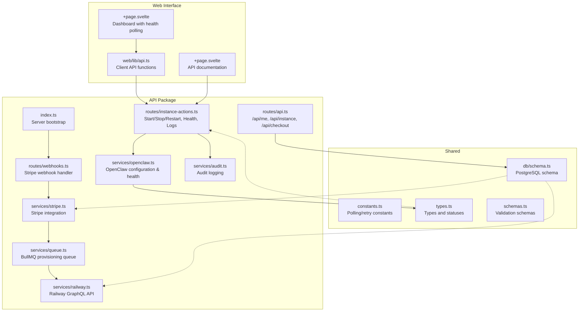
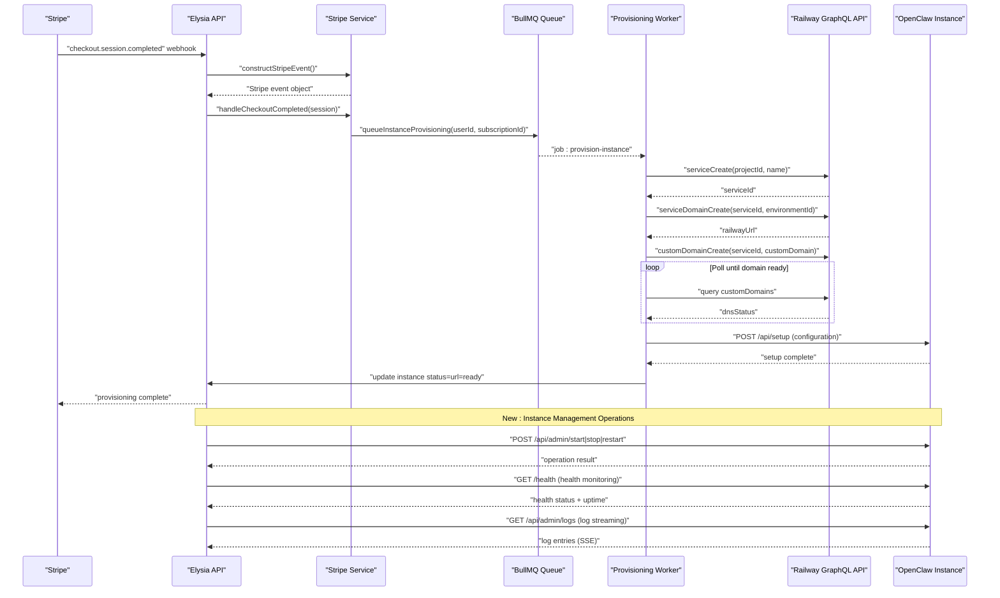
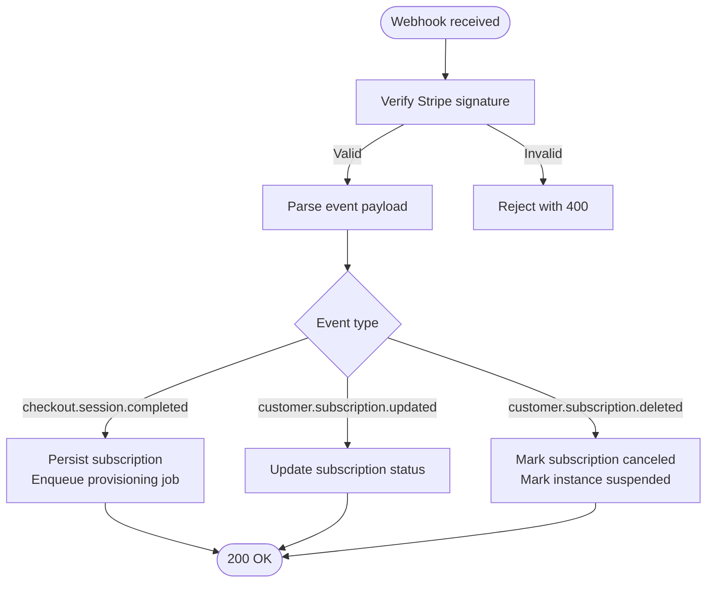
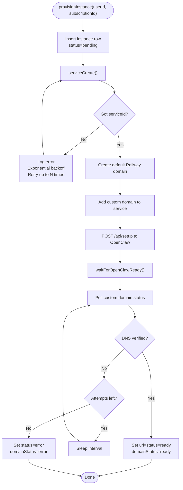
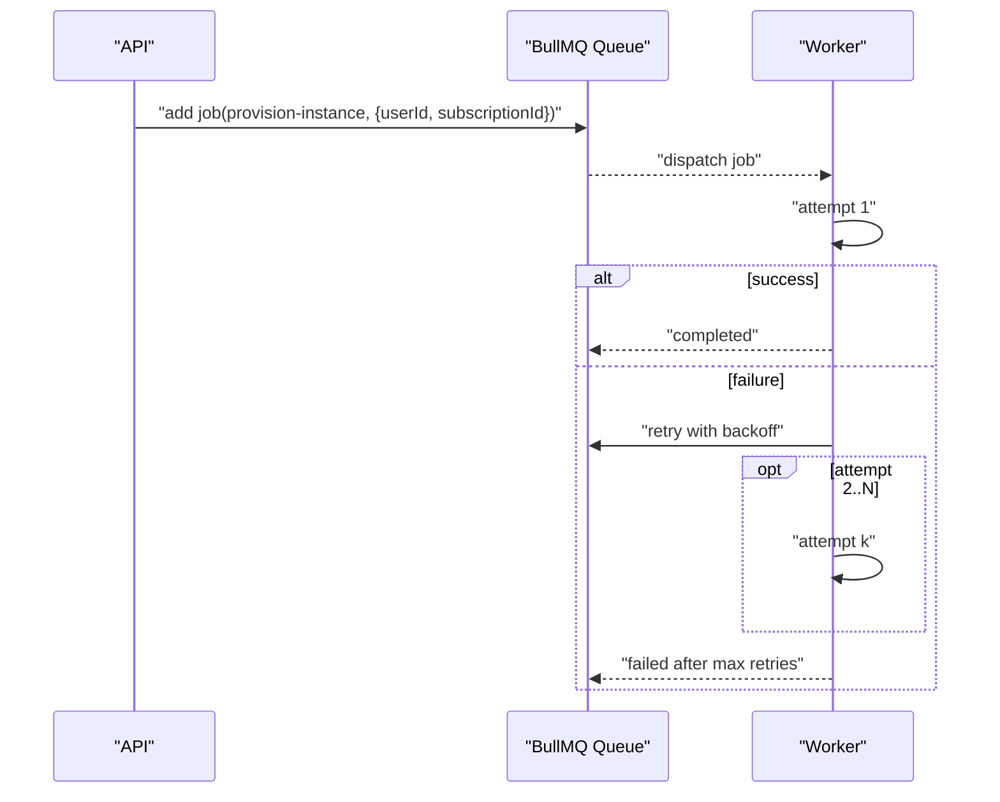
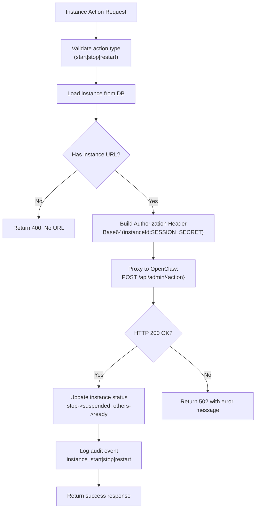
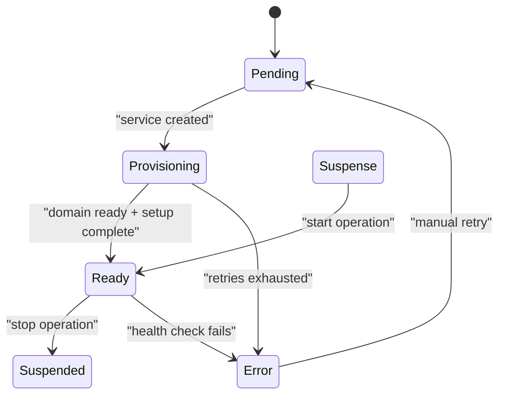
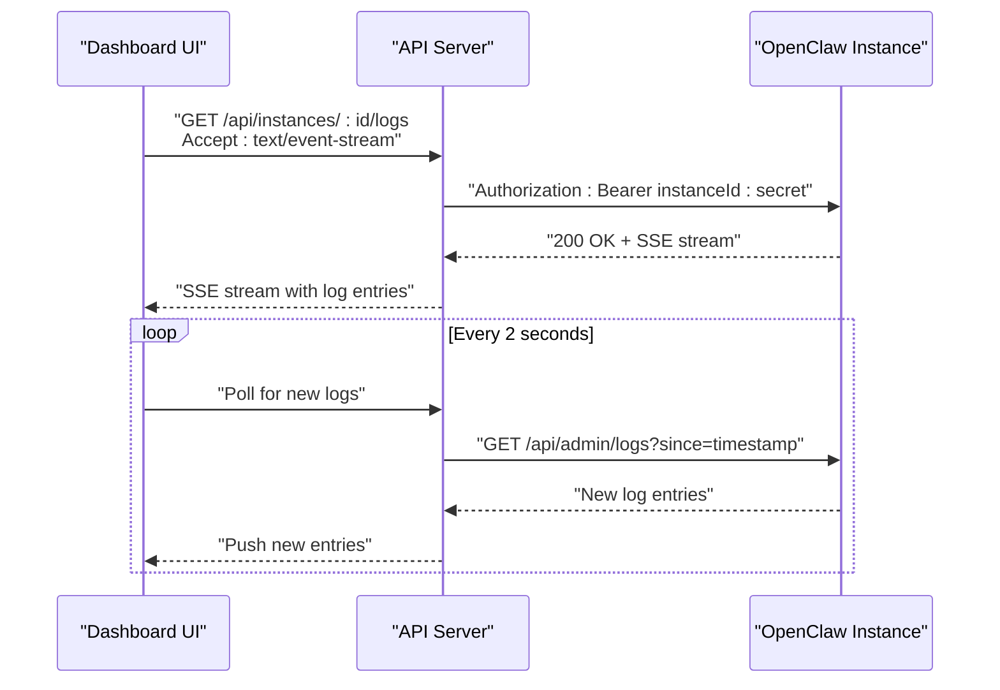
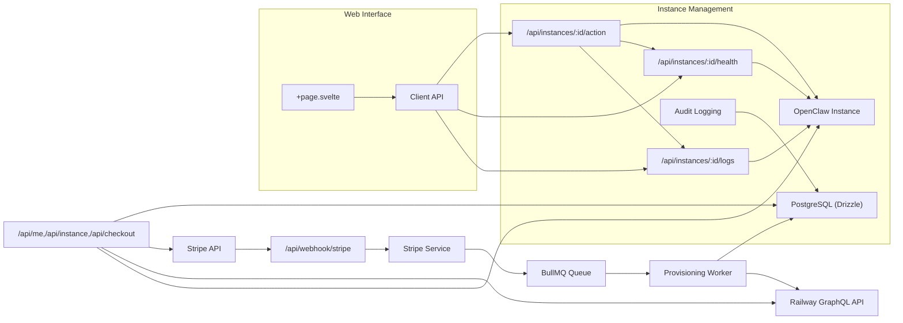

# Instance Provisioning

<cite>
**Referenced Files in This Document**
- [PRD.md](file://PRD.md)
- [packages/api/src/index.ts](file://packages/api/src/index.ts)
- [packages/api/src/routes/webhooks.ts](file://packages/api/src/routes/webhooks.ts)
- [packages/api/src/services/stripe.ts](file://packages/api/src/services/stripe.ts)
- [packages/api/src/services/railway.ts](file://packages/api/src/services/railway.ts)
- [packages/api/src/services/queue.ts](file://packages/api/src/services/queue.ts)
- [packages/api/src/routes/api.ts](file://packages/api/src/routes/api.ts)
- [packages/api/src/routes/instance-actions.ts](file://packages/api/src/routes/instance-actions.ts)
- [packages/api/src/services/openclaw.ts](file://packages/api/src/services/openclaw.ts)
- [packages/api/src/services/audit.ts](file://packages/api/src/services/audit.ts)
- [packages/shared/src/constants.ts](file://packages/shared/src/constants.ts)
- [packages/shared/src/types.ts](file://packages/shared/src/types.ts)
- [packages/shared/src/schemas.ts](file://packages/shared/src/schemas.ts)
- [packages/shared/src/db/schema.ts](file://packages/shared/src/db/schema.ts)
- [packages/web/src/lib/api.ts](file://packages/web/src/lib/api.ts)
- [packages/web/src/routes/dashboard/[id]/+page.svelte](file://packages/web/src/routes/dashboard/[id]/+page.svelte)
- [packages/web/src/routes/docs/api/+page.svelte](file://packages/web/src/routes/docs/api/+page.svelte)
</cite>

## Update Summary
**Changes Made**
- Added comprehensive instance management capabilities including start/stop/restart operations
- Implemented health monitoring with detailed status tracking and uptime metrics
- Integrated OpenClaw proxy functionality for administrative operations
- Enhanced dashboard with real-time health polling and log streaming
- Added audit logging for all instance management actions
- Expanded API documentation with new endpoints for instance operations

## Table of Contents
1. [Introduction](#introduction)
2. [Project Structure](#project-structure)
3. [Core Components](#core-components)
4. [Architecture Overview](#architecture-overview)
5. [Detailed Component Analysis](#detailed-component-analysis)
6. [Dependency Analysis](#dependency-analysis)
7. [Performance Considerations](#performance-considerations)
8. [Troubleshooting Guide](#troubleshooting-guide)
9. [Conclusion](#conclusion)
10. [Appendices](#appendices)

## Introduction
This document explains SparkClaw's OpenClaw instance provisioning system with enhanced instance management capabilities. The system now supports complete lifecycle management including start/stop/restart operations, health monitoring, and administrative proxy functionality. It covers the end-to-end workflow from Stripe payment confirmation to Railway service creation, environment variable configuration, status tracking, and the new operational management features including real-time health monitoring and log streaming.

## Project Structure
The provisioning system spans the API package (Elysia + BullMQ), shared data models and constants, and the Stripe/Railway integrations. The runtime is a long-running Bun/Elysia server that exposes routes for authentication, checkout, webhooks, and comprehensive instance management operations, along with a background worker to provision instances.

**Diagram sources**
- [packages/api/src/index.ts](file://packages/api/src/index.ts#L1-L25)
- [packages/api/src/routes/webhooks.ts](file://packages/api/src/routes/webhooks.ts#L1-L49)
- [packages/api/src/services/stripe.ts](file://packages/api/src/services/stripe.ts#L1-L107)
- [packages/api/src/services/railway.ts](file://packages/api/src/services/railway.ts#L1-L291)
- [packages/api/src/services/queue.ts](file://packages/api/src/services/queue.ts#L1-L101)
- [packages/api/src/routes/api.ts](file://packages/api/src/routes/api.ts#L1-L86)
- [packages/api/src/routes/instance-actions.ts](file://packages/api/src/routes/instance-actions.ts#L1-L170)
- [packages/api/src/services/openclaw.ts](file://packages/api/src/services/openclaw.ts#L1-L111)
- [packages/api/src/services/audit.ts](file://packages/api/src/services/audit.ts#L1-L50)
- [packages/shared/src/constants.ts](file://packages/shared/src/constants.ts#L1-L28)
- [packages/shared/src/types.ts](file://packages/shared/src/types.ts#L1-L311)
- [packages/shared/src/schemas.ts](file://packages/shared/src/schemas.ts#L1-L214)
- [packages/shared/src/db/schema.ts](file://packages/shared/src/db/schema.ts#L1-L146)
- [packages/web/src/lib/api.ts](file://packages/web/src/lib/api.ts#L1-L363)
- [packages/web/src/routes/dashboard/[id]/+page.svelte](file://packages/web/src/routes/dashboard/[id]/+page.svelte#L127-L173)

**Section sources**
- [packages/api/src/index.ts](file://packages/api/src/index.ts#L1-L25)
- [packages/api/src/routes/webhooks.ts](file://packages/api/src/routes/webhooks.ts#L1-L49)
- [packages/api/src/services/stripe.ts](file://packages/api/src/services/stripe.ts#L1-L107)
- [packages/api/src/services/railway.ts](file://packages/api/src/services/railway.ts#L1-L291)
- [packages/api/src/services/queue.ts](file://packages/api/src/services/queue.ts#L1-L101)
- [packages/api/src/routes/api.ts](file://packages/api/src/routes/api.ts#L1-L86)
- [packages/api/src/routes/instance-actions.ts](file://packages/api/src/routes/instance-actions.ts#L1-L170)
- [packages/api/src/services/openclaw.ts](file://packages/api/src/services/openclaw.ts#L1-L111)
- [packages/api/src/services/audit.ts](file://packages/api/src/services/audit.ts#L1-L50)
- [packages/shared/src/constants.ts](file://packages/shared/src/constants.ts#L1-L28)
- [packages/shared/src/types.ts](file://packages/shared/src/types.ts#L1-L311)
- [packages/shared/src/schemas.ts](file://packages/shared/src/schemas.ts#L1-L214)
- [packages/shared/src/db/schema.ts](file://packages/shared/src/db/schema.ts#L1-L146)
- [packages/web/src/lib/api.ts](file://packages/web/src/lib/api.ts#L1-L363)
- [packages/web/src/routes/dashboard/[id]/+page.svelte](file://packages/web/src/routes/dashboard/[id]/+page.svelte#L127-L173)

## Core Components
- Stripe integration: constructs events, creates checkout sessions, and triggers provisioning upon successful payment.
- Railway integration: provisions OpenClaw via GraphQL mutations and queries, manages domains, and polls for readiness.
- Background job system: queues provisioning tasks and retries with exponential backoff.
- Data model: stores user, subscription, and instance state with statuses and timestamps.
- API routes: expose protected endpoints for user info, instance status, checkout initiation, and comprehensive instance management operations.
- **New**: Instance management: start/stop/restart operations with OpenClaw proxy integration.
- **New**: Health monitoring: detailed health status, uptime tracking, and channel-specific monitoring.
- **New**: Audit logging: comprehensive tracking of all instance management actions.

Key implementation references:
- Stripe webhook handler and provisioning trigger: [packages/api/src/routes/webhooks.ts](file://packages/api/src/routes/webhooks.ts#L1-L49), [packages/api/src/services/stripe.ts](file://packages/api/src/services/stripe.ts#L45-L72)
- Railway GraphQL calls and provisioning loop: [packages/api/src/services/railway.ts](file://packages/api/src/services/railway.ts#L177-L291)
- Background queue and worker: [packages/api/src/services/queue.ts](file://packages/api/src/services/queue.ts#L1-L101)
- Instance management routes: [packages/api/src/routes/instance-actions.ts](file://packages/api/src/routes/instance-actions.ts#L21-L170)
- OpenClaw health checking: [packages/api/src/services/openclaw.ts](file://packages/api/src/services/openclaw.ts#L73-L110)
- Audit logging: [packages/api/src/services/audit.ts](file://packages/api/src/services/audit.ts#L26-L28)
- Dashboard integration: [packages/web/src/routes/dashboard/[id]/+page.svelte](file://packages/web/src/routes/dashboard/[id]/+page.svelte#L158-L173)

**Section sources**
- [packages/api/src/routes/webhooks.ts](file://packages/api/src/routes/webhooks.ts#L1-L49)
- [packages/api/src/services/stripe.ts](file://packages/api/src/services/stripe.ts#L45-L72)
- [packages/api/src/services/railway.ts](file://packages/api/src/services/railway.ts#L177-L291)
- [packages/api/src/services/queue.ts](file://packages/api/src/services/queue.ts#L1-L101)
- [packages/api/src/routes/instance-actions.ts](file://packages/api/src/routes/instance-actions.ts#L21-L170)
- [packages/api/src/services/openclaw.ts](file://packages/api/src/services/openclaw.ts#L73-L110)
- [packages/api/src/services/audit.ts](file://packages/api/src/services/audit.ts#L26-L28)
- [packages/web/src/routes/dashboard/[id]/+page.svelte](file://packages/web/src/routes/dashboard/[id]/+page.svelte#L158-L173)

## Architecture Overview
The provisioning workflow begins when Stripe notifies the backend of a successful checkout. The webhook handler persists subscription data and enqueues a provisioning job. The worker provisions a Railway service, sets up a custom domain, and polls until the domain is ready. The system updates instance status and URL accordingly. **New operations include** comprehensive instance lifecycle management through OpenClaw proxy integration, real-time health monitoring, and detailed operational insights.

**Diagram sources**
- [packages/api/src/routes/webhooks.ts](file://packages/api/src/routes/webhooks.ts#L24-L36)
- [packages/api/src/services/stripe.ts](file://packages/api/src/services/stripe.ts#L45-L72)
- [packages/api/src/services/queue.ts](file://packages/api/src/services/queue.ts#L75-L93)
- [packages/api/src/services/railway.ts](file://packages/api/src/services/railway.ts#L177-L291)
- [packages/api/src/services/openclaw.ts](file://packages/api/src/services/openclaw.ts#L17-L71)
- [packages/api/src/routes/instance-actions.ts](file://packages/api/src/routes/instance-actions.ts#L21-L170)

**Section sources**
- [packages/api/src/routes/webhooks.ts](file://packages/api/src/routes/webhooks.ts#L1-L49)
- [packages/api/src/services/stripe.ts](file://packages/api/src/services/stripe.ts#L45-L72)
- [packages/api/src/services/queue.ts](file://packages/api/src/services/queue.ts#L1-L101)
- [packages/api/src/services/railway.ts](file://packages/api/src/services/railway.ts#L177-L291)
- [packages/api/src/services/openclaw.ts](file://packages/api/src/services/openclaw.ts#L17-L71)
- [packages/api/src/routes/instance-actions.ts](file://packages/api/src/routes/instance-actions.ts#L21-L170)

## Detailed Component Analysis

### Stripe Webhook Integration
- Verifies signatures and dispatches to handlers for checkout completion, subscription updates, and deletion.
- On checkout completion, persists subscription metadata and fires a fire-and-forget provisioning job.

**Diagram sources**
- [packages/api/src/routes/webhooks.ts](file://packages/api/src/routes/webhooks.ts#L6-L48)
- [packages/api/src/services/stripe.ts](file://packages/api/src/services/stripe.ts#L45-L106)

**Section sources**
- [packages/api/src/routes/webhooks.ts](file://packages/api/src/routes/webhooks.ts#L1-L49)
- [packages/api/src/services/stripe.ts](file://packages/api/src/services/stripe.ts#L1-L107)

### Railway GraphQL Integration and Provisioning Loop
- Creates a Railway service within a predefined project.
- Generates a custom domain and attaches it to the service.
- Polls for DNS verification readiness with bounded attempts and intervals.
- Updates instance URL and status to ready upon success; otherwise marks error after retries.
- **New**: Configures OpenClaw instance with gateway token, LLM settings, and default channels.

**Diagram sources**
- [packages/api/src/services/railway.ts](file://packages/api/src/services/railway.ts#L177-L291)
- [packages/api/src/services/openclaw.ts](file://packages/api/src/services/openclaw.ts#L17-L71)
- [packages/shared/src/constants.ts](file://packages/shared/src/constants.ts#L25-L28)

**Section sources**
- [packages/api/src/services/railway.ts](file://packages/api/src/services/railway.ts#L1-L291)
- [packages/api/src/services/openclaw.ts](file://packages/api/src/services/openclaw.ts#L17-L71)
- [packages/shared/src/constants.ts](file://packages/shared/src/constants.ts#L25-L28)

### Background Job Processing and Retry Logic
- Uses BullMQ with Redis to persist jobs across server restarts.
- Jobs are retried up to three times with exponential backoff.
- Worker processes jobs concurrently with logging for completed and failed events.

**Diagram sources**
- [packages/api/src/services/queue.ts](file://packages/api/src/services/queue.ts#L17-L63)

**Section sources**
- [packages/api/src/services/queue.ts](file://packages/api/src/services/queue.ts#L1-L101)

### Instance Management Operations
**New**: Comprehensive instance lifecycle management through OpenClaw proxy integration.

- **Start Operation**: Sends POST request to `/api/admin/start` with authorization header containing instance ID and session secret.
- **Stop Operation**: Sends POST request to `/api/admin/stop` and updates instance status to "suspended".
- **Restart Operation**: Sends POST request to `/api/admin/restart` and maintains "ready" status.
- **Authorization**: Uses Base64-encoded `${instanceId}:${SESSION_SECRET}` for secure proxy access.
- **Timeout Handling**: 15-second timeout for instance operations to prevent hanging requests.

**Diagram sources**
- [packages/api/src/routes/instance-actions.ts](file://packages/api/src/routes/instance-actions.ts#L21-L60)
- [packages/api/src/services/audit.ts](file://packages/api/src/services/audit.ts#L26-L28)

**Section sources**
- [packages/api/src/routes/instance-actions.ts](file://packages/api/src/routes/instance-actions.ts#L21-L60)
- [packages/api/src/services/audit.ts](file://packages/api/src/services/audit.ts#L26-L28)

### Health Monitoring and Status Tracking
**New**: Comprehensive health monitoring with detailed status tracking and uptime metrics.

- **Health Endpoint**: GET `/api/instances/:id/health` provides detailed instance health status.
- **API Health**: Checks `/health` endpoint with 5-second timeout.
- **Channel Monitoring**: Validates each enabled channel via `/api/channels/{type}/status` with 3-second timeout.
- **Uptime Tracking**: Extracts uptime from health response if available.
- **Status Mapping**: Returns combined health status with individual component checks.
- **Dashboard Integration**: Automatic 30-second polling for health updates.

**Diagram sources**
- [packages/shared/src/types.ts](file://packages/shared/src/types.ts#L67-L77)
- [packages/api/src/routes/instance-actions.ts](file://packages/api/src/routes/instance-actions.ts#L61-L101)
- [packages/web/src/routes/dashboard/[id]/+page.svelte](file://packages/web/src/routes/dashboard/[id]/+page.svelte#L153-L156)

**Section sources**
- [packages/shared/src/types.ts](file://packages/shared/src/types.ts#L67-L77)
- [packages/api/src/routes/instance-actions.ts](file://packages/api/src/routes/instance-actions.ts#L61-L101)
- [packages/web/src/routes/dashboard/[id]/+page.svelte](file://packages/web/src/routes/dashboard/[id]/+page.svelte#L153-L156)

### Log Streaming and Real-time Monitoring
**New**: Real-time log streaming with Server-Sent Events (SSE) support.

- **SSE Streaming**: Accepts `text/event-stream` header for real-time log updates.
- **Polling Mode**: Falls back to regular JSON response for static log retrieval.
- **Authorization**: Uses the same Base64-encoded `${instanceId}:${SESSION_SECRET}` scheme.
- **Connection Management**: 5-second polling interval with automatic cleanup on disconnect.
- **Dashboard Integration**: Live log streaming with auto-scrolling and connection status indicators.

**Diagram sources**
- [packages/api/src/routes/instance-actions.ts](file://packages/api/src/routes/instance-actions.ts#L102-L170)
- [packages/web/src/routes/dashboard/[id]/+page.svelte](file://packages/web/src/routes/dashboard/[id]/+page.svelte#L218-L273)

**Section sources**
- [packages/api/src/routes/instance-actions.ts](file://packages/api/src/routes/instance-actions.ts#L102-L170)
- [packages/web/src/routes/dashboard/[id]/+page.svelte](file://packages/web/src/routes/dashboard/[id]/+page.svelte#L218-L273)

### Audit Logging and Security
**New**: Comprehensive audit logging for all instance management operations.

- **Audit Actions**: Tracks `instance_start`, `instance_stop`, and `instance_restart` events.
- **Metadata Logging**: Records user ID, instance ID, IP address, and action details.
- **Non-blocking Design**: Audit logging failures don't affect main operation flow.
- **Security**: All audit events include proper authorization context and timestamps.

**Section sources**
- [packages/api/src/services/audit.ts](file://packages/api/src/services/audit.ts#L26-L28)

### Template-Based Deployment and Environment Variables
- The system provisions a Railway service using a predefined project and template.
- Environment variables are injected at deployment time (e.g., user identifiers, Prism base URL and API key).
- **New**: OpenClaw configuration includes gateway token, LLM provider settings, and default channel setup.
- The PRD specifies pinning OpenClaw Docker image versions and injecting environment variables from secrets.

References:
- [PRD.md](file://PRD.md#L131-L154)
- [packages/api/src/services/railway.ts](file://packages/api/src/services/railway.ts#L45-L63)
- [packages/api/src/services/openclaw.ts](file://packages/api/src/services/openclaw.ts#L17-L71)

**Section sources**
- [PRD.md](file://PRD.md#L131-L154)
- [packages/api/src/services/railway.ts](file://packages/api/src/services/railway.ts#L45-L63)
- [packages/api/src/services/openclaw.ts](file://packages/api/src/services/openclaw.ts#L17-L71)

### Error Handling and Recovery
- Transient Railway API errors are retried with exponential backoff.
- Timeout during domain provisioning transitions to error state with stored error message.
- **New**: Instance operation timeouts use 15-second limit to prevent hanging requests.
- **New**: Health check timeouts use 5-second limit for API and 3-second for channel checks.
- Manual intervention is supported by marking instance status and triggering a retry.
- **New**: Log streaming handles connection errors gracefully with automatic retry logic.

References:
- [packages/api/src/services/railway.ts](file://packages/api/src/services/railway.ts#L198-L277)
- [packages/api/src/routes/instance-actions.ts](file://packages/api/src/routes/instance-actions.ts#L37-L47)
- [packages/api/src/services/openclaw.ts](file://packages/api/src/services/openclaw.ts#L74-L84)
- [PRD.md](file://PRD.md#L305-L315)

**Section sources**
- [packages/api/src/services/railway.ts](file://packages/api/src/services/railway.ts#L198-L277)
- [packages/api/src/routes/instance-actions.ts](file://packages/api/src/routes/instance-actions.ts#L37-L47)
- [packages/api/src/services/openclaw.ts](file://packages/api/src/services/openclaw.ts#L74-L84)
- [PRD.md](file://PRD.md#L305-L315)

### Dashboard UI Representations
- Empty state: prompt to choose a plan.
- Pending: spinner with "We're spinning up your OpenClaw instance…".
- Ready: instance URL and action buttons to open setup and console.
- Error: failure message with optional error details.
- Suspended: indicates canceled subscription.
- **New**: Health monitoring with status indicators, uptime display, and real-time log streaming.
- **New**: Action buttons for start/stop/restart operations with loading states.

References:
- [PRD.md](file://PRD.md#L168-L192)
- [packages/web/src/routes/dashboard/[id]/+page.svelte](file://packages/web/src/routes/dashboard/[id]/+page.svelte#L189-L215)

**Section sources**
- [PRD.md](file://PRD.md#L168-L192)
- [packages/web/src/routes/dashboard/[id]/+page.svelte](file://packages/web/src/routes/dashboard/[id]/+page.svelte#L189-L215)

## Dependency Analysis
The provisioning system depends on external services and internal modules. The following diagram highlights key dependencies and data flow.

**Diagram sources**
- [packages/api/src/routes/webhooks.ts](file://packages/api/src/routes/webhooks.ts#L1-L49)
- [packages/api/src/services/stripe.ts](file://packages/api/src/services/stripe.ts#L1-L107)
- [packages/api/src/services/queue.ts](file://packages/api/src/services/queue.ts#L1-L101)
- [packages/api/src/services/railway.ts](file://packages/api/src/services/railway.ts#L1-L291)
- [packages/api/src/routes/api.ts](file://packages/api/src/routes/api.ts#L1-L86)
- [packages/api/src/routes/instance-actions.ts](file://packages/api/src/routes/instance-actions.ts#L1-L170)
- [packages/api/src/services/audit.ts](file://packages/api/src/services/audit.ts#L1-L50)
- [packages/shared/src/db/schema.ts](file://packages/shared/src/db/schema.ts#L1-L146)
- [packages/web/src/lib/api.ts](file://packages/web/src/lib/api.ts#L246-L264)

**Section sources**
- [packages/api/src/routes/webhooks.ts](file://packages/api/src/routes/webhooks.ts#L1-L49)
- [packages/api/src/services/stripe.ts](file://packages/api/src/services/stripe.ts#L1-L107)
- [packages/api/src/services/queue.ts](file://packages/api/src/services/queue.ts#L1-L101)
- [packages/api/src/services/railway.ts](file://packages/api/src/services/railway.ts#L1-L291)
- [packages/api/src/routes/api.ts](file://packages/api/src/routes/api.ts#L1-L86)
- [packages/api/src/routes/instance-actions.ts](file://packages/api/src/routes/instance-actions.ts#L1-L170)
- [packages/api/src/services/audit.ts](file://packages/api/src/services/audit.ts#L1-L50)
- [packages/shared/src/db/schema.ts](file://packages/shared/src/db/schema.ts#L1-L146)
- [packages/web/src/lib/api.ts](file://packages/web/src/lib/api.ts#L246-L264)

## Performance Considerations
- Provisioning time targets are documented in the PRD; the system uses bounded polling and exponential backoff to balance responsiveness and reliability.
- Database connections leverage connection pooling and keep-alive strategies to minimize cold starts.
- **New**: Health monitoring uses 30-second polling interval to balance real-time updates with resource efficiency.
- **New**: Log streaming uses 2-second polling interval with 5-second connection timeouts for optimal responsiveness.
- **New**: Instance operations have 15-second timeouts to prevent blocking the API layer.
- Recommendations:
  - Monitor provisioning latency and adjust polling intervals and retry counts based on observed Railway API performance.
  - Consider parallelizing independent provisioning jobs while respecting downstream API rate limits.
  - **New**: Implement connection pooling for OpenClaw proxy requests to handle concurrent operations efficiently.

## Troubleshooting Guide
Common issues and resolutions:
- Provisioning stuck in pending:
  - Check webhook delivery and signature verification.
  - Verify Redis connectivity for the queue and worker.
- Railway API errors:
  - Inspect logs for Railway GraphQL errors and HTTP status codes.
  - Confirm Railway API token and project/environment IDs.
- Domain provisioning timeout:
  - Validate DNS propagation and custom domain configuration.
  - Review polling attempts and intervals.
- Dashboard shows error:
  - Retrieve the stored error message from the instance record.
  - Manually re-run provisioning after correcting the underlying cause.
- **New**: Instance operation failures:
  - Check OpenClaw proxy connectivity and authorization headers.
  - Verify SESSION_SECRET environment variable is properly configured.
  - Review instance operation logs for detailed error information.
- **New**: Health monitoring issues:
  - Verify OpenClaw instance is reachable and responding to `/health` endpoint.
  - Check network connectivity between API server and OpenClaw instance.
  - Review health check timeouts and retry logic.
- **New**: Log streaming problems:
  - Ensure SSE-compatible browser or client is used.
  - Check for network interruptions affecting long-lived connections.
  - Verify authorization header format and instance ID.

References:
- [packages/api/src/routes/webhooks.ts](file://packages/api/src/routes/webhooks.ts#L1-L49)
- [packages/api/src/services/queue.ts](file://packages/api/src/services/queue.ts#L65-L72)
- [packages/api/src/services/railway.ts](file://packages/api/src/services/railway.ts#L266-L289)
- [packages/api/src/routes/instance-actions.ts](file://packages/api/src/routes/instance-actions.ts#L37-L47)
- [packages/api/src/services/openclaw.ts](file://packages/api/src/services/openclaw.ts#L74-L84)

**Section sources**
- [packages/api/src/routes/webhooks.ts](file://packages/api/src/routes/webhooks.ts#L1-L49)
- [packages/api/src/services/queue.ts](file://packages/api/src/services/queue.ts#L65-L72)
- [packages/api/src/services/railway.ts](file://packages/api/src/services/railway.ts#L266-L289)
- [packages/api/src/routes/instance-actions.ts](file://packages/api/src/routes/instance-actions.ts#L37-L47)
- [packages/api/src/services/openclaw.ts](file://packages/api/src/services/openclaw.ts#L74-L84)

## Conclusion
SparkClaw's provisioning system integrates Stripe and Railway to deliver a reliable, automated OpenClaw instance lifecycle with comprehensive operational management capabilities. The system employs background job processing with exponential backoff, bounded polling, and clear status tracking. **New features include** complete instance lifecycle management through OpenClaw proxy integration, detailed health monitoring with uptime tracking, real-time log streaming with SSE support, and comprehensive audit logging. The enhanced dashboard communicates progress, health status, and operational insights to users. Future enhancements include persistent job queues, advanced monitoring/alerting, improved operational controls, and expanded instance management capabilities.

## Appendices

### API Usage Examples
- Create a Stripe checkout session:
  - Endpoint: POST /api/checkout
  - Request body: { plan: "starter" | "pro" | "scale" }
  - Response: { url: "https://checkout.stripe.com/..." }
  - Reference: [packages/api/src/routes/api.ts](file://packages/api/src/routes/api.ts#L76-L85), [packages/api/src/services/stripe.ts](file://packages/api/src/services/stripe.ts#L28-L43)

- Retrieve user and instance details:
  - Endpoint: GET /api/me
  - Endpoint: GET /api/instance
  - Reference: [packages/api/src/routes/api.ts](file://packages/api/src/routes/api.ts#L34-L75)

- **New**: Instance management operations:
  - Start instance: POST /api/instances/:id/action { action: "start" }
  - Stop instance: POST /api/instances/:id/action { action: "stop" }
  - Restart instance: POST /api/instances/:id/action { action: "restart" }
  - Get health status: GET /api/instances/:id/health
  - Get logs: GET /api/instances/:id/logs
  - Stream logs: GET /api/instances/:id/logs (Accept: text/event-stream)
  - Reference: [packages/api/src/routes/instance-actions.ts](file://packages/api/src/routes/instance-actions.ts#L21-L170), [packages/web/src/lib/api.ts](file://packages/web/src/lib/api.ts#L246-L264)

- Stripe webhook endpoint:
  - Endpoint: POST /api/webhook/stripe
  - Reference: [packages/api/src/routes/webhooks.ts](file://packages/api/src/routes/webhooks.ts#L6-L48)

**Section sources**
- [packages/api/src/routes/api.ts](file://packages/api/src/routes/api.ts#L34-L85)
- [packages/api/src/routes/webhooks.ts](file://packages/api/src/routes/webhooks.ts#L6-L48)
- [packages/api/src/routes/instance-actions.ts](file://packages/api/src/routes/instance-actions.ts#L21-L170)
- [packages/api/src/services/stripe.ts](file://packages/api/src/services/stripe.ts#L28-L43)
- [packages/web/src/lib/api.ts](file://packages/web/src/lib/api.ts#L246-L264)

### Monitoring and Alerting
- Recommended:
  - Capture provisioning logs and attach instance/job IDs for correlation.
  - Alert on repeated provisioning failures and webhook processing errors.
  - Track domain provisioning timeouts and Railway API latency.
  - **New**: Monitor instance operation success rates and response times.
  - **New**: Track health check failures and log streaming connection issues.
  - **New**: Alert on audit logging failures and security incidents.

### Administrative Controls
- Manual intervention:
  - Update instance status and URL for remediation.
  - Requeue provisioning jobs for failed instances.
  - **New**: Force instance operations (start/stop/restart) for emergency situations.
  - **New**: Clear audit logs and reset instance state for debugging.
- References:
  - [PRD.md](file://PRD.md#L305-L315)
  - [packages/api/src/services/queue.ts](file://packages/api/src/services/queue.ts#L75-L93)
  - [packages/api/src/services/audit.ts](file://packages/api/src/services/audit.ts#L30-L49)

**Section sources**
- [PRD.md](file://PRD.md#L305-L315)
- [packages/api/src/services/queue.ts](file://packages/api/src/services/queue.ts#L75-L93)
- [packages/api/src/services/audit.ts](file://packages/api/src/services/audit.ts#L30-L49)

### Scaling Considerations
- Horizontal scaling:
  - Run multiple API replicas behind a load balancer.
  - Ensure Redis availability for BullMQ persistence.
  - **New**: Scale OpenClaw instances independently for high-traffic scenarios.
- Backlog management:
  - Tune worker concurrency and queue depth.
  - Consider separate queues for different instance sizes or regions.
  - **New**: Implement connection pooling for OpenClaw proxy requests.
  - **New**: Use circuit breakers for health monitoring and log streaming.

### Roadmap Improvements
- Reliability:
  - Persistent job queues with dead-letter handling.
  - Health checks and auto-healing for failed instances.
  - **New**: Circuit breaker pattern for OpenClaw proxy operations.
  - **New**: Graceful degradation for health monitoring under load.
- Observability:
  - Structured logs and metrics for provisioning latency and error rates.
  - Incident management and on-call rotation.
  - **New**: Distributed tracing for instance management operations.
  - **New**: Real-time dashboards for operational metrics.
- Operational controls:
  - Admin console for manual overrides and re-provisioning.
  - Mission control view with activity timelines.
  - **New**: Bulk instance operations for administrative tasks.
  - **New**: Advanced filtering and search capabilities for instance management.
- **New**: Enhanced security features including rate limiting, input validation, and audit trail improvements.

References:
- [PRD.md](file://PRD.md#L732-L789)

**Section sources**
- [PRD.md](file://PRD.md#L732-L789)