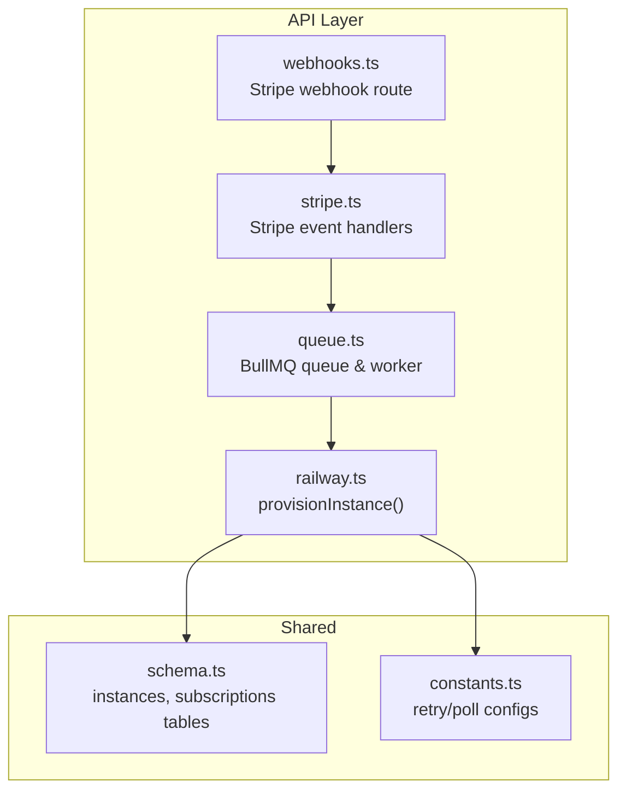
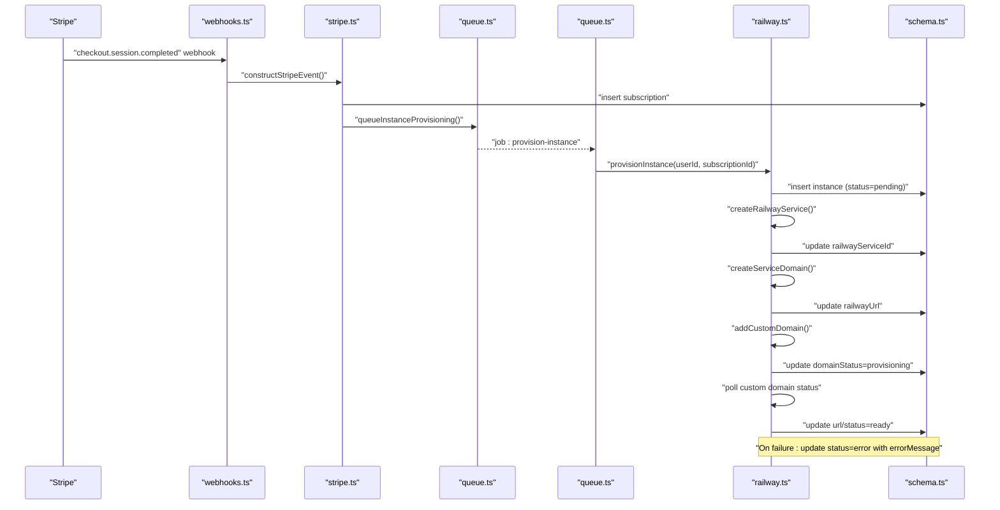
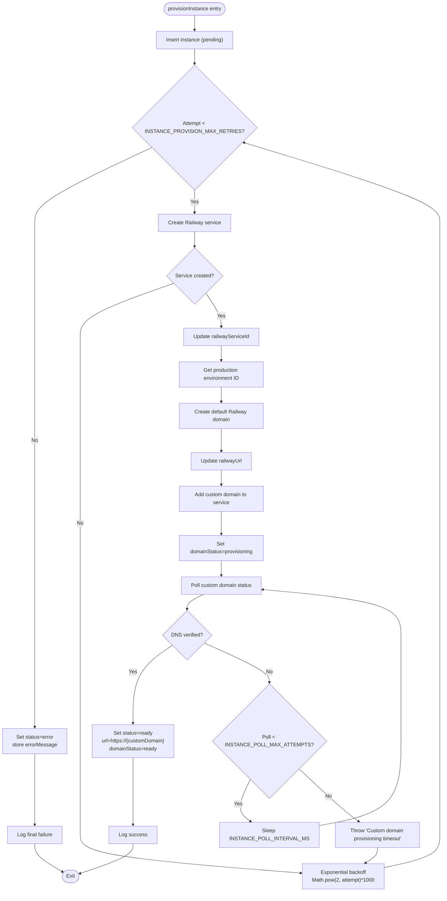
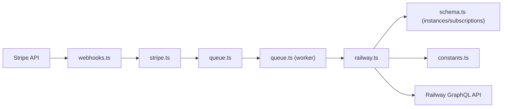

# Provisioning Workflow

<cite>
**Referenced Files in This Document**
- [webhooks.ts](file://packages/api/src/routes/webhooks.ts)
- [stripe.ts](file://packages/api/src/services/stripe.ts)
- [railway.ts](file://packages/api/src/services/railway.ts)
- [queue.ts](file://packages/api/src/services/queue.ts)
- [schema.ts](file://packages/shared/src/db/schema.ts)
- [constants.ts](file://packages/shared/src/constants.ts)
- [index.ts](file://packages/api/src/index.ts)
</cite>

## Table of Contents
1. [Introduction](#introduction)
2. [Project Structure](#project-structure)
3. [Core Components](#core-components)
4. [Architecture Overview](#architecture-overview)
5. [Detailed Component Analysis](#detailed-component-analysis)
6. [Dependency Analysis](#dependency-analysis)
7. [Performance Considerations](#performance-considerations)
8. [Troubleshooting Guide](#troubleshooting-guide)
9. [Conclusion](#conclusion)

## Introduction
This document explains the complete OpenClaw instance provisioning workflow from Stripe webhook receipt to a fully operational instance. It covers the end-to-end flow triggered by a successful checkout, the orchestration performed by the provisionInstance function, database state transitions, retry/backoff behavior, fallback polling, and error handling/logging. Administrative recovery procedures are also included.

## Project Structure
The provisioning workflow spans three primary areas:
- Webhook routing and event dispatch
- Stripe event handling and job queuing
- Instance provisioning, Railway service creation, and domain assignment with retry and fallback polling

**Diagram sources**
- [webhooks.ts](file://packages/api/src/routes/webhooks.ts#L5-L48)
- [stripe.ts](file://packages/api/src/services/stripe.ts#L45-L72)
- [queue.ts](file://packages/api/src/services/queue.ts#L17-L93)
- [railway.ts](file://packages/api/src/services/railway.ts#L177-L290)
- [schema.ts](file://packages/shared/src/db/schema.ts)
- [constants.ts](file://packages/shared/src/constants.ts)

**Section sources**
- [webhooks.ts](file://packages/api/src/routes/webhooks.ts#L1-L49)
- [stripe.ts](file://packages/api/src/services/stripe.ts#L1-L107)
- [queue.ts](file://packages/api/src/services/queue.ts#L1-L101)
- [railway.ts](file://packages/api/src/services/railway.ts#L1-L291)
- [schema.ts](file://packages/shared/src/db/schema.ts)
- [constants.ts](file://packages/shared/src/constants.ts)

## Core Components
- Stripe webhook endpoint validates signatures and routes events to handlers.
- Stripe handlers persist subscription data and enqueue provisioning jobs.
- The provisioning worker executes provisionInstance, which creates a Railway service, assigns domains, and tracks state.
- Database schema defines instances and subscriptions tables with appropriate fields for status tracking.

Key responsibilities:
- Webhook routing: [webhooks.ts](file://packages/api/src/routes/webhooks.ts#L5-L48)
- Stripe event handling: [stripe.ts](file://packages/api/src/services/stripe.ts#L45-L72)
- Queue and worker: [queue.ts](file://packages/api/src/services/queue.ts#L17-L93)
- Provisioning orchestration: [railway.ts](file://packages/api/src/services/railway.ts#L177-L290)
- Schema definitions: [schema.ts](file://packages/shared/src/db/schema.ts)
- Configuration constants: [constants.ts](file://packages/shared/src/constants.ts)

**Section sources**
- [webhooks.ts](file://packages/api/src/routes/webhooks.ts#L5-L48)
- [stripe.ts](file://packages/api/src/services/stripe.ts#L45-L72)
- [queue.ts](file://packages/api/src/services/queue.ts#L17-L93)
- [railway.ts](file://packages/api/src/services/railway.ts#L177-L290)
- [schema.ts](file://packages/shared/src/db/schema.ts)
- [constants.ts](file://packages/shared/src/constants.ts)

## Architecture Overview
The provisioning workflow follows a webhook-to-database-to-cloud pipeline with asynchronous job processing and robust retry logic.

**Diagram sources**
- [webhooks.ts](file://packages/api/src/routes/webhooks.ts#L24-L36)
- [stripe.ts](file://packages/api/src/services/stripe.ts#L45-L72)
- [queue.ts](file://packages/api/src/services/queue.ts#L75-L93)
- [railway.ts](file://packages/api/src/services/railway.ts#L177-L290)
- [schema.ts](file://packages/shared/src/db/schema.ts)

## Detailed Component Analysis

### Stripe Webhook Endpoint
- Validates presence of stripe-signature header.
- Constructs Stripe event using configured webhook secret.
- Routes to handler based on event type.
- Logs and returns appropriate HTTP status.

Operational notes:
- Missing signature returns 400.
- Invalid signature returns 400.
- Unhandled events are logged but do not error the endpoint.
- Errors during processing return 500 and log details.

**Section sources**
- [webhooks.ts](file://packages/api/src/routes/webhooks.ts#L6-L47)

### Stripe Event Handlers
- checkout.session.completed:
  - Persists subscription record with derived fields.
  - Enqueues provisioning job via queueInstanceProvisioning.
  - Errors are caught and logged; webhook continues to avoid retransmit risk.
- customer.subscription.updated:
  - Updates subscription status and period end.
- customer.subscription.deleted:
  - Marks subscription as canceled.
  - Suspends associated instance(s).

**Section sources**
- [stripe.ts](file://packages/api/src/services/stripe.ts#L45-L106)

### Queue and Worker
- Queue configuration:
  - Name: "instance-provisioning"
  - Default attempts: 3
  - Backoff: exponential with base delay
  - Cleanup: removes completed/failed jobs after a bounded window
- Worker:
  - Processes jobs with concurrency 2.
  - Calls provisionInstance and logs outcomes.
  - Re-throws errors to trigger BullMQ retry/backoff.
- Deduplication:
  - Jobs are deduplicated by subscriptionId to prevent concurrent runs.

**Section sources**
- [queue.ts](file://packages/api/src/services/queue.ts#L17-L63)
- [queue.ts](file://packages/api/src/services/queue.ts#L75-L93)

### Provisioning Orchestration (provisionInstance)
The provisionInstance function orchestrates end-to-end provisioning:

1. Database record creation
   - Inserts a new instance with status=pending and domainStatus=pending.
   - Stores railwayProjectId and generated customDomain.

2. Service creation attempts
   - Creates a Railway service via GraphQL mutation.
   - Updates instance with railwayServiceId upon success.

3. Domain assignment
   - Retrieves production environment ID.
   - Creates a default Railway service domain for internal use.
   - Updates instance with railwayUrl.
   - Adds custom domain to the service.

4. Status tracking and readiness
   - Sets domainStatus=provisioning.
   - Polls custom domain status until verified or timeout.

5. Retry mechanism with exponential backoff
   - Uses Math.pow(2, attempt) * 1000 timing between retries.
   - Retries up to INSTANCE_PROVISION_MAX_RETRIES.

6. Fallback polling strategy
   - If immediate domain assignment does not return a value, polls for service domain availability.
   - Polls up to INSTANCE_POLL_MAX_ATTEMPTS with INSTANCE_POLL_INTERVAL_MS interval.

7. Final state transitions
   - On success: sets status=ready, url=https://{customDomain}, domainStatus=ready.
   - On exhaustion: sets status=error, domainStatus=error, stores errorMessage.

8. Error handling and logging
   - Logs detailed context per attempt and final outcome.
   - Propagates errors to the worker to trigger BullMQ backoff.

**Diagram sources**
- [railway.ts](file://packages/api/src/services/railway.ts#L177-L290)
- [constants.ts](file://packages/shared/src/constants.ts)

**Section sources**
- [railway.ts](file://packages/api/src/services/railway.ts#L177-L290)
- [constants.ts](file://packages/shared/src/constants.ts)

### Database Schema and Fields
The instances table captures provisioning state and outcomes. Relevant fields include:
- status: pending → ready/error
- domainStatus: pending/provisioning/ready/error
- railwayServiceId: service identifier
- railwayUrl: internal Railway URL
- url: public custom domain URL
- customDomain: generated subdomain
- errorMessage: captured error message on failure
- timestamps for createdAt/updatedAt

The subscriptions table holds Stripe subscription metadata and links to instances via foreign keys.

**Section sources**
- [schema.ts](file://packages/shared/src/db/schema.ts)

## Dependency Analysis
The provisioning workflow depends on external systems and internal modules:

**Diagram sources**
- [webhooks.ts](file://packages/api/src/routes/webhooks.ts#L1-L49)
- [stripe.ts](file://packages/api/src/services/stripe.ts#L1-L107)
- [queue.ts](file://packages/api/src/services/queue.ts#L1-L101)
- [railway.ts](file://packages/api/src/services/railway.ts#L1-L291)
- [schema.ts](file://packages/shared/src/db/schema.ts)
- [constants.ts](file://packages/shared/src/constants.ts)

**Section sources**
- [webhooks.ts](file://packages/api/src/routes/webhooks.ts#L1-L49)
- [stripe.ts](file://packages/api/src/services/stripe.ts#L1-L107)
- [queue.ts](file://packages/api/src/services/queue.ts#L1-L101)
- [railway.ts](file://packages/api/src/services/railway.ts#L1-L291)
- [schema.ts](file://packages/shared/src/db/schema.ts)
- [constants.ts](file://packages/shared/src/constants.ts)

## Performance Considerations
- Concurrency: The worker processes two jobs concurrently, balancing throughput and resource usage.
- Backoff strategy: Exponential backoff reduces load on downstream systems during transient failures.
- Polling cadence: INSTANCE_POLL_INTERVAL_MS controls polling frequency; tune for DNS propagation latency.
- Queue cleanup: Completed and failed jobs are pruned to keep Redis memory bounded.

[No sources needed since this section provides general guidance]

## Troubleshooting Guide

Common failure modes and recovery steps:
- Stripe webhook signature invalid
  - Verify webhook secret and endpoint configuration.
  - Check logs for signature-related errors.
  - Section sources
    - [webhooks.ts](file://packages/api/src/routes/webhooks.ts#L8-L21)

- Subscription persisted but provisioning job not enqueued
  - Confirm queue connection and Redis availability.
  - Check for exceptions thrown during queueInstanceProvisioning.
  - Section sources
    - [stripe.ts](file://packages/api/src/services/stripe.ts#L69-L71)
    - [queue.ts](file://packages/api/src/services/queue.ts#L75-L93)

- Provisioning stuck in pending
  - Inspect instance records for pending status and missing railwayServiceId.
  - Restart worker to reprocess the job.
  - Section sources
    - [railway.ts](file://packages/api/src/services/railway.ts#L184-L194)
    - [queue.ts](file://packages/api/src/services/queue.ts#L37-L63)

- Service creation failures
  - Review Railway API response and logs for GraphQL errors.
  - Retry is automatic via BullMQ exponential backoff.
  - Section sources
    - [railway.ts](file://packages/api/src/services/railway.ts#L198-L277)
    - [queue.ts](file://packages/api/src/services/queue.ts#L19-L27)

- Custom domain not becoming ready
  - Verify DNS configuration and propagation.
  - Increase INSTANCE_POLL_MAX_ATTEMPTS or INSTANCE_POLL_INTERVAL_MS if needed.
  - Section sources
    - [railway.ts](file://packages/api/src/services/railway.ts#L238-L263)
    - [constants.ts](file://packages/shared/src/constants.ts)

- Final error state
  - Instances with status=error and errorMessage indicate failed provisioning.
  - Administrators can requeue provisioning or investigate errorMessage.
  - Section sources
    - [railway.ts](file://packages/api/src/services/railway.ts#L279-L289)

Administrative recovery procedures:
- Requeue provisioning for a subscription:
  - Call queueInstanceProvisioning with the same subscriptionId to deduplicate.
  - Section sources
    - [queue.ts](file://packages/api/src/services/queue.ts#L75-L93)

- Manually inspect instance state:
  - Query instances by subscriptionId and check status/domainStatus.
  - Section sources
    - [schema.ts](file://packages/shared/src/db/schema.ts)

- Force domain verification:
  - If DNS is confirmed externally, administrators can manually update url/status after verifying custom domain.
  - Section sources
    - [railway.ts](file://packages/api/src/services/railway.ts#L246-L254)

## Conclusion
The OpenClaw provisioning workflow integrates Stripe webhooks, asynchronous job processing, and Railway service orchestration with robust retry and fallback mechanisms. The provisionInstance function ensures idempotent state transitions, comprehensive logging, and clear error propagation. Administrators can monitor and recover provisioning outcomes through database inspection and job requeuing.