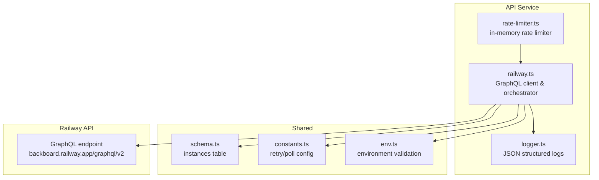
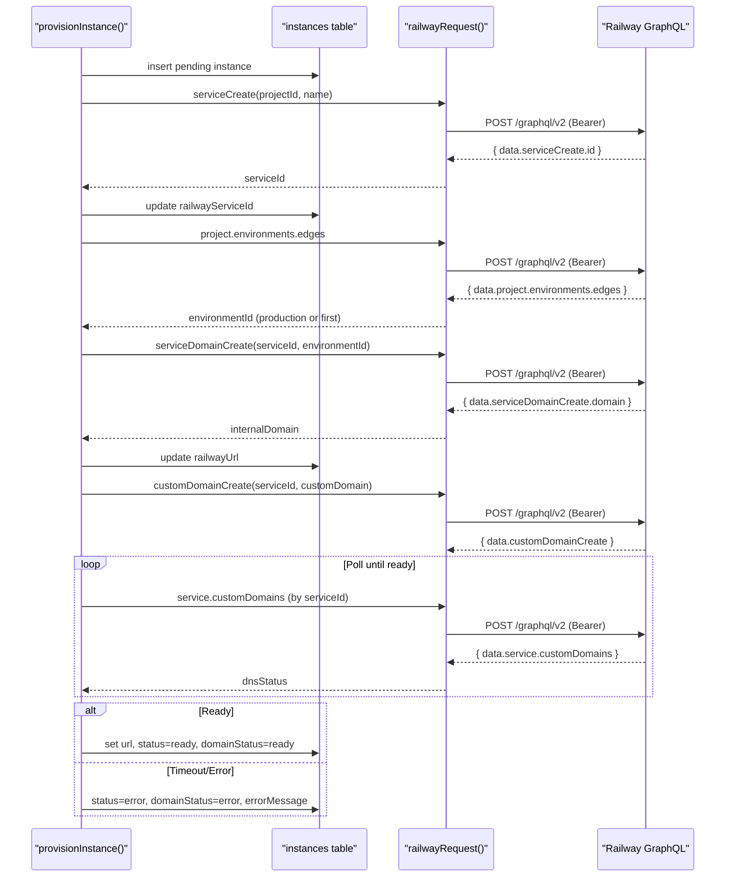
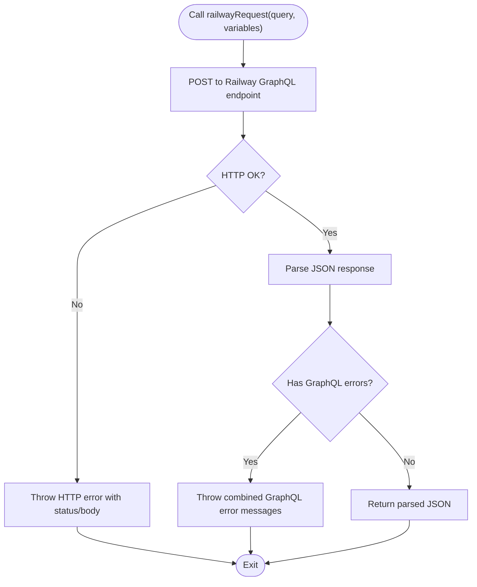
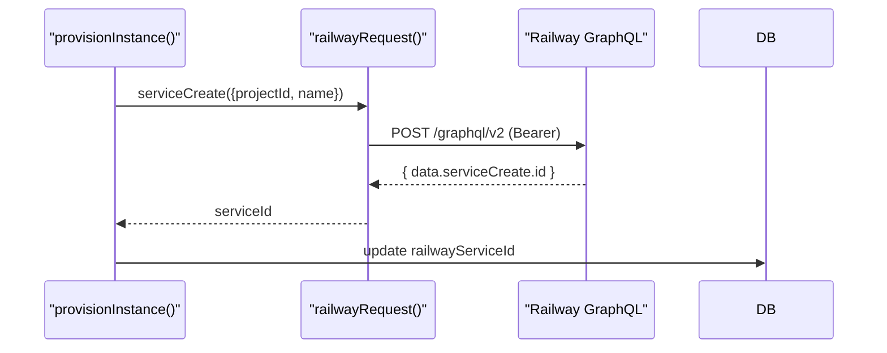
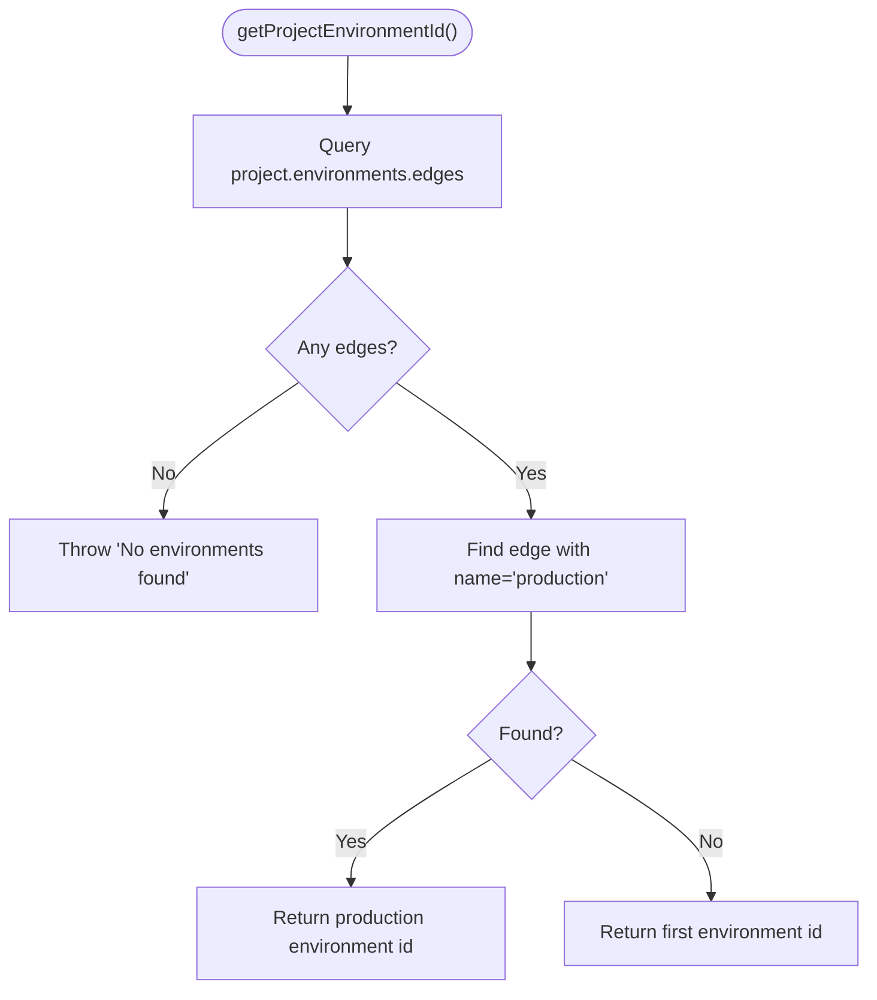
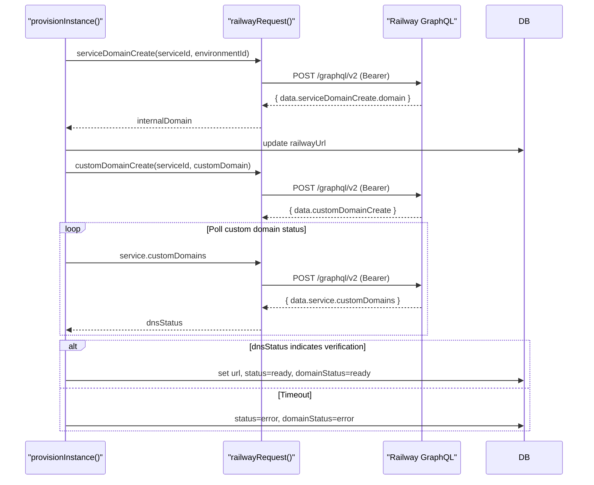
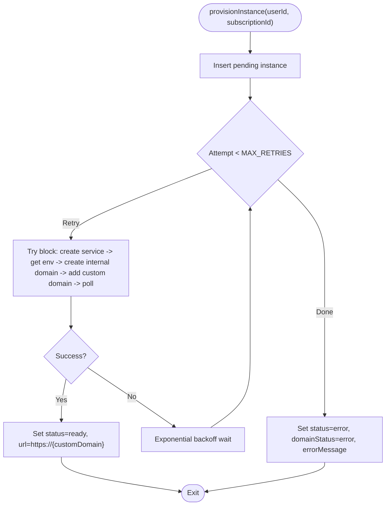
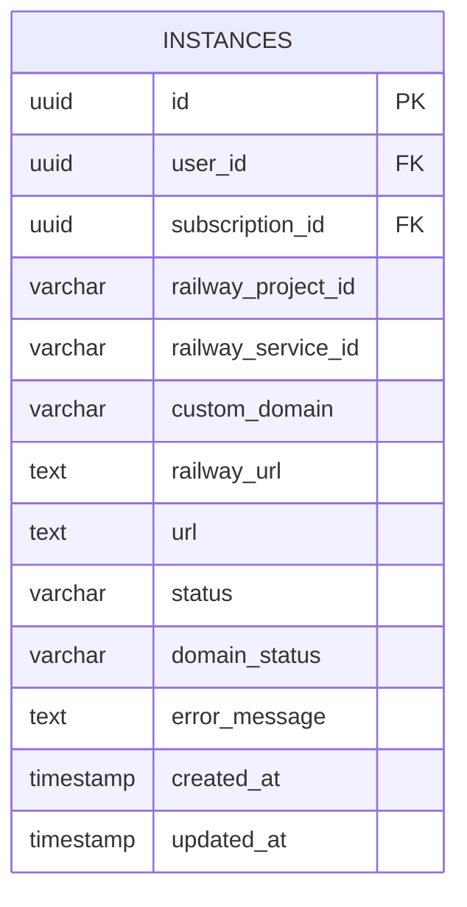
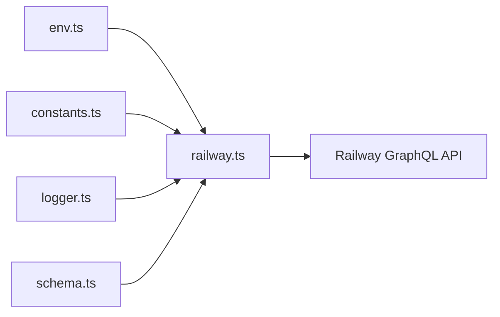

# Railway API Integration

<cite>
**Referenced Files in This Document**
- [railway.ts](file://packages/api/src/services/railway.ts)
- [schema.ts](file://packages/shared/src/db/schema.ts)
- [constants.ts](file://packages/shared/src/constants.ts)
- [env.ts](file://packages/shared/src/env.ts)
- [logger.ts](file://packages/api/src/lib/logger.ts)
- [rate-limiter.ts](file://packages/api/src/lib/rate-limiter.ts)
- [PRD.md](file://PRD.md)
</cite>

## Table of Contents
1. [Introduction](#introduction)
2. [Project Structure](#project-structure)
3. [Core Components](#core-components)
4. [Architecture Overview](#architecture-overview)
5. [Detailed Component Analysis](#detailed-component-analysis)
6. [Dependency Analysis](#dependency-analysis)
7. [Performance Considerations](#performance-considerations)
8. [Troubleshooting Guide](#troubleshooting-guide)
9. [Conclusion](#conclusion)

## Introduction
This document explains SparkClaw's integration with the Railway GraphQL API. It covers authentication via Bearer tokens, query and mutation construction for service creation, domain management, and environment discovery. It documents the railwayRequest helper function with robust error handling for HTTP status codes and GraphQL errors, the service creation workflow using the serviceCreate mutation, domain assignment via serviceDomainCreate and customDomainCreate, and domain retrieval via service queries. It also details environment ID discovery for production deployments with fallback mechanisms, plus examples of GraphQL operations, error scenarios, rate limiting considerations, API response validation, and security practices for token management.

## Project Structure
The Railway integration is implemented in a dedicated service module and supported by shared infrastructure:
- Railway service module: GraphQL client, helpers, and provisioning orchestration
- Shared database schema: persistent state for instances, URLs, statuses, and error messages
- Shared constants: retry and polling configuration for provisioning
- Environment validation: strict schema for required API tokens and project identifiers
- Logging and rate limiting utilities: operational observability and request throttling

**Diagram sources**
- [railway.ts](file://packages/api/src/services/railway.ts#L1-L291)
- [schema.ts](file://packages/shared/src/db/schema.ts#L105-L137)
- [constants.ts](file://packages/shared/src/constants.ts#L25-L28)
- [env.ts](file://packages/shared/src/env.ts#L3-L22)
- [logger.ts](file://packages/api/src/lib/logger.ts#L1-L34)
- [rate-limiter.ts](file://packages/api/src/lib/rate-limiter.ts#L1-L59)

**Section sources**
- [railway.ts](file://packages/api/src/services/railway.ts#L1-L291)
- [schema.ts](file://packages/shared/src/db/schema.ts#L105-L137)
- [constants.ts](file://packages/shared/src/constants.ts#L25-L28)
- [env.ts](file://packages/shared/src/env.ts#L3-L22)
- [logger.ts](file://packages/api/src/lib/logger.ts#L1-L34)
- [rate-limiter.ts](file://packages/api/src/lib/rate-limiter.ts#L1-L59)

## Core Components
- railwayRequest: HTTP client for Railway GraphQL with Bearer authentication, HTTP status validation, and GraphQL error extraction
- Provisioning orchestration: end-to-end flow for service creation, internal Railway domain assignment, and custom domain provisioning with polling
- Domain management: Railway service domain creation and custom domain addition with status polling
- Environment discovery: project environment selection preferring production with fallback to first environment
- Persistence: instance records with status tracking, error messaging, and URL storage
- Validation and configuration: environment variable schema enforcement and constants for retry/backoff behavior

**Section sources**
- [railway.ts](file://packages/api/src/services/railway.ts#L13-L34)
- [railway.ts](file://packages/api/src/services/railway.ts#L177-L290)
- [railway.ts](file://packages/api/src/services/railway.ts#L65-L81)
- [railway.ts](file://packages/api/src/services/railway.ts#L84-L129)
- [railway.ts](file://packages/api/src/services/railway.ts#L148-L171)
- [schema.ts](file://packages/shared/src/db/schema.ts#L105-L137)
- [constants.ts](file://packages/shared/src/constants.ts#L25-L28)
- [env.ts](file://packages/shared/src/env.ts#L3-L22)

## Architecture Overview
The Railway integration follows a controlled provisioning pipeline:
- Validate environment configuration
- Insert a pending instance record
- Create a Railway service
- Determine environment ID (prefer production)
- Assign an internal Railway domain to the service
- Add a custom domain to the service
- Poll for custom domain readiness
- Update instance status and URLs upon success or record error on failure

**Diagram sources**
- [railway.ts](file://packages/api/src/services/railway.ts#L177-L290)
- [railway.ts](file://packages/api/src/services/railway.ts#L13-L34)
- [railway.ts](file://packages/api/src/services/railway.ts#L45-L63)
- [railway.ts](file://packages/api/src/services/railway.ts#L148-L171)
- [railway.ts](file://packages/api/src/services/railway.ts#L65-L81)
- [railway.ts](file://packages/api/src/services/railway.ts#L84-L129)
- [schema.ts](file://packages/shared/src/db/schema.ts#L105-L137)

## Detailed Component Analysis

### railwayRequest Helper Function
- Purpose: Unified HTTP client for Railway GraphQL requests
- Authentication: Bearer token from environment variable
- Error handling:
  - Throws on non-OK HTTP responses with status and body text
  - Throws on GraphQL-level errors extracted from response
- Returns: Parsed JSON payload containing data and/or errors

**Diagram sources**
- [railway.ts](file://packages/api/src/services/railway.ts#L13-L34)

**Section sources**
- [railway.ts](file://packages/api/src/services/railway.ts#L13-L34)

### Service Creation Workflow (serviceCreate)
- Mutation: Creates a new Railway service under the configured project
- Input: projectId and a generated service name derived from instanceId
- Output: serviceId stored in the instance record
- Validation: Uses environment validation to ensure projectId availability

**Diagram sources**
- [railway.ts](file://packages/api/src/services/railway.ts#L45-L63)
- [railway.ts](file://packages/api/src/services/railway.ts#L13-L34)
- [schema.ts](file://packages/shared/src/db/schema.ts#L105-L137)

**Section sources**
- [railway.ts](file://packages/api/src/services/railway.ts#L45-L63)
- [env.ts](file://packages/shared/src/env.ts#L10-L11)

### Environment Discovery (Production Preference)
- Query: project(id: $projectId) with environments.edges
- Logic: Selects environment named "production" if present; otherwise falls back to the first environment
- Output: environmentId used for domain assignment

**Diagram sources**
- [railway.ts](file://packages/api/src/services/railway.ts#L148-L171)

**Section sources**
- [railway.ts](file://packages/api/src/services/railway.ts#L148-L171)

### Domain Assignment and Retrieval
- Internal Railway domain:
  - Mutation: serviceDomainCreate(serviceId, environmentId)
  - Stores returned internal domain in railwayUrl
- Custom domain:
  - Mutation: customDomainCreate(serviceId, customDomain)
  - Polls service.customDomains for dnsStatus until verified
  - On success, sets url to https://{customDomain}, status to ready, and domainStatus to ready

**Diagram sources**
- [railway.ts](file://packages/api/src/services/railway.ts#L65-L81)
- [railway.ts](file://packages/api/src/services/railway.ts#L84-L129)
- [railway.ts](file://packages/api/src/services/railway.ts#L131-L146)
- [railway.ts](file://packages/api/src/services/railway.ts#L13-L34)
- [schema.ts](file://packages/shared/src/db/schema.ts#L105-L137)

**Section sources**
- [railway.ts](file://packages/api/src/services/railway.ts#L65-L81)
- [railway.ts](file://packages/api/src/services/railway.ts#L84-L129)
- [railway.ts](file://packages/api/src/services/railway.ts#L131-L146)

### Instance Provisioning Orchestration
- Inserts a pending instance with railwayProjectId and generates a custom domain
- Retries provisioning up to a configured maximum with exponential backoff
- Updates instance status and URLs based on outcomes

**Diagram sources**
- [railway.ts](file://packages/api/src/services/railway.ts#L177-L290)
- [constants.ts](file://packages/shared/src/constants.ts#L25-L28)

**Section sources**
- [railway.ts](file://packages/api/src/services/railway.ts#L177-L290)
- [constants.ts](file://packages/shared/src/constants.ts#L25-L28)

### Data Model: Instances
The instances table persists provisioning state and URLs:
- Fields include user and subscription linkage, Railway identifiers, custom domain, internal Railway URL, public URL, status, domain status, and error message
- Indexes support efficient lookups by user, subscription, status, and domain

**Diagram sources**
- [schema.ts](file://packages/shared/src/db/schema.ts#L105-L137)

**Section sources**
- [schema.ts](file://packages/shared/src/db/schema.ts#L105-L137)
- [PRD.md](file://PRD.md#L489-L504)

## Dependency Analysis
- railway.ts depends on:
  - Shared database schema for persistence
  - Shared constants for retry and polling configuration
  - Environment validation for Railway tokens and project ID
  - Logger for structured operational logs
- No circular dependencies observed among the analyzed components

**Diagram sources**
- [railway.ts](file://packages/api/src/services/railway.ts#L1-L11)
- [env.ts](file://packages/shared/src/env.ts#L3-L22)
- [constants.ts](file://packages/shared/src/constants.ts#L25-L28)
- [logger.ts](file://packages/api/src/lib/logger.ts#L1-L34)
- [schema.ts](file://packages/shared/src/db/schema.ts#L105-L137)

**Section sources**
- [railway.ts](file://packages/api/src/services/railway.ts#L1-L11)
- [env.ts](file://packages/shared/src/env.ts#L3-L22)
- [constants.ts](file://packages/shared/src/constants.ts#L25-L28)
- [logger.ts](file://packages/api/src/lib/logger.ts#L1-L34)
- [schema.ts](file://packages/shared/src/db/schema.ts#L105-L137)

## Performance Considerations
- Retry and backoff: Provisioning retries with exponential backoff reduce pressure on the Railway API during transient failures
- Polling cadence: Controlled polling interval and maximum attempts balance responsiveness with API usage
- Request batching: Group related operations (e.g., environment discovery, domain creation) to minimize round trips
- Logging overhead: Structured logging avoids expensive string interpolation and reduces I/O

[No sources needed since this section provides general guidance]

## Troubleshooting Guide
Common error scenarios and handling:
- HTTP-level errors: Non-OK responses raise explicit errors with status and body text
- GraphQL errors: Combined error messages from the GraphQL response surface API issues
- Missing environments: Environment discovery throws when no environments are found
- Provisioning timeouts: Exceeding polling attempts or retries leads to error status and stored error message
- Token or configuration issues: Environment validation ensures required variables are present and correctly formatted

Operational checks:
- Verify environment variables are loaded and validated
- Confirm Railway API token and project ID are correct
- Monitor logs for structured entries indicating provisioning attempts and outcomes
- Use rate limiter to avoid overwhelming downstream APIs

**Section sources**
- [railway.ts](file://packages/api/src/services/railway.ts#L23-L31)
- [railway.ts](file://packages/api/src/services/railway.ts#L166-L168)
- [railway.ts](file://packages/api/src/services/railway.ts#L265-L276)
- [env.ts](file://packages/shared/src/env.ts#L28-L39)
- [logger.ts](file://packages/api/src/lib/logger.ts#L10-L27)
- [rate-limiter.ts](file://packages/api/src/lib/rate-limiter.ts#L17-L34)

## Security Considerations
- Token management:
  - Railway API token is supplied via Bearer authentication header
  - Ensure tokens are stored securely and rotated regularly
  - Restrict token scope to the minimal required permissions
- Request signing:
  - No additional request signing is implemented in the current integration
  - Consider adding signature verification if Railway supports it
- Secrets protection:
  - Keep tokens out of client-side code and logs
  - Use environment-specific secrets management
- Network security:
  - Use HTTPS endpoints only
  - Validate TLS certificates and monitor for certificate issues

[No sources needed since this section provides general guidance]

## Conclusion
SparkClaw’s Railway API integration provides a robust, observable, and resilient provisioning pipeline. It leverages Bearer authentication, structured error handling, environment-aware domain management, and configurable retry/backoff policies. The integration is anchored by a clear data model for instance state and supported by environment validation and logging utilities. By following the documented patterns and security practices, teams can confidently operate Railway-backed deployments at scale.