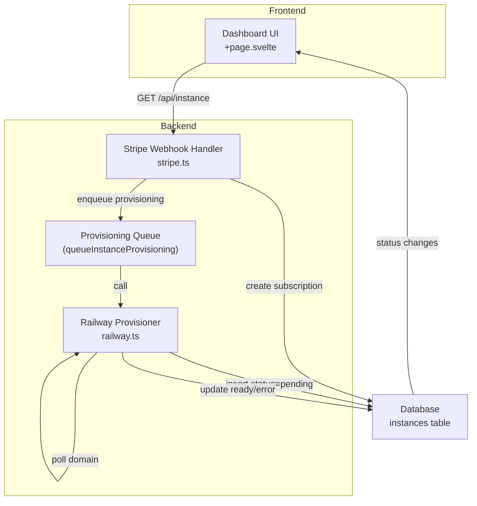
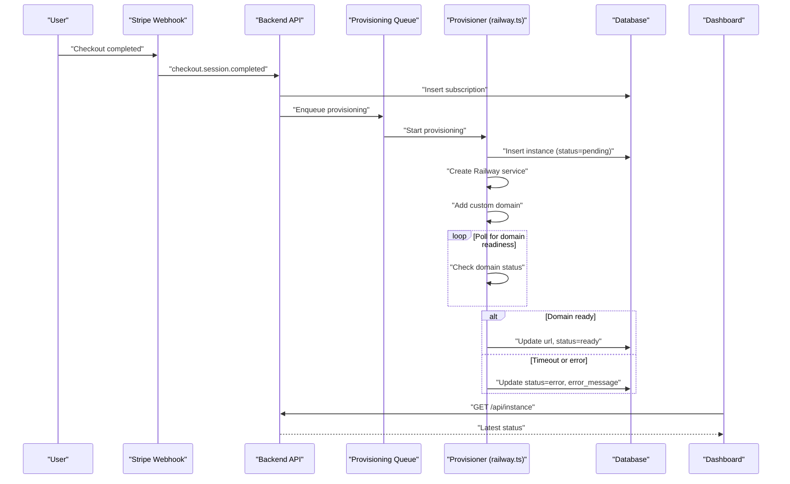
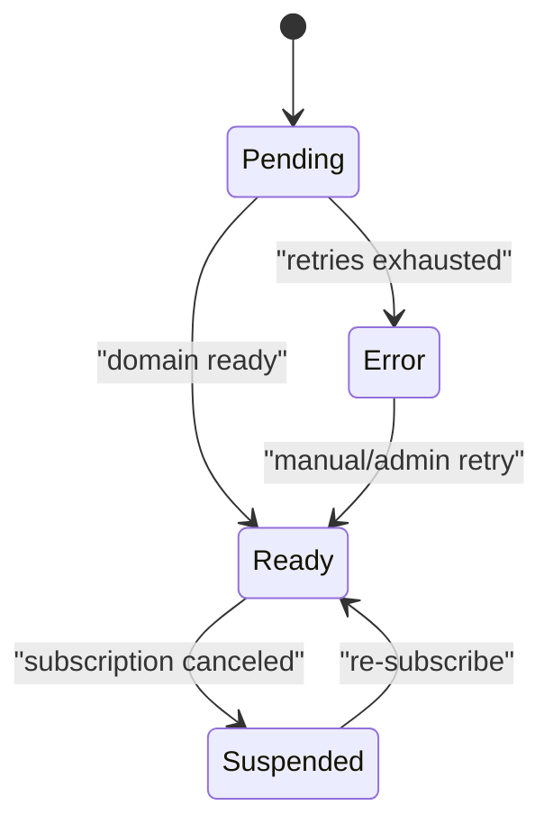
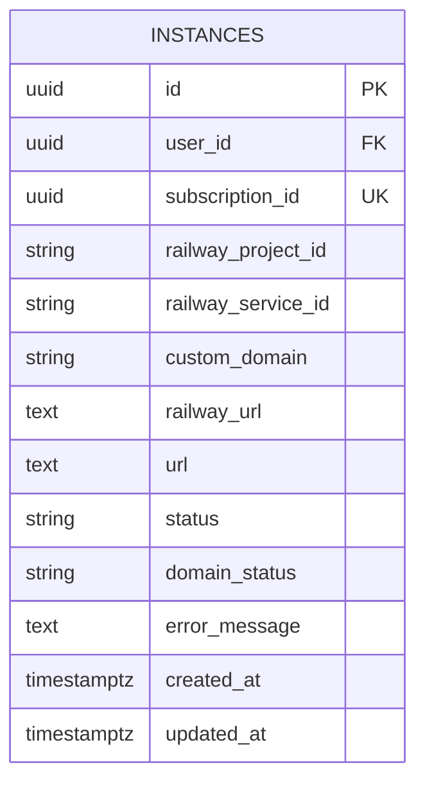
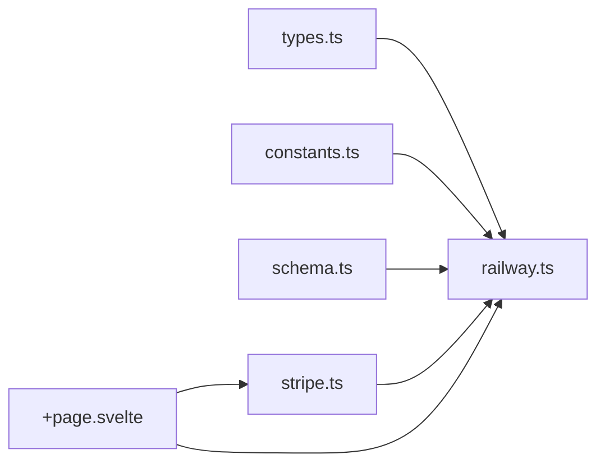

# Status Management

<cite>
**Referenced Files in This Document**
- [PRD.md](file://PRD.md)
- [railway.ts](file://packages/api/src/services/railway.ts)
- [stripe.ts](file://packages/api/src/services/stripe.ts)
- [constants.ts](file://packages/shared/src/constants.ts)
- [schema.ts](file://packages/shared/src/db/schema.ts)
- [types.ts](file://packages/shared/src/types.ts)
- [+page.svelte](file://packages/web/src/routes/dashboard/+page.svelte)
</cite>

## Table of Contents
1. [Introduction](#introduction)
2. [Project Structure](#project-structure)
3. [Core Components](#core-components)
4. [Architecture Overview](#architecture-overview)
5. [Detailed Component Analysis](#detailed-component-analysis)
6. [Dependency Analysis](#dependency-analysis)
7. [Performance Considerations](#performance-considerations)
8. [Troubleshooting Guide](#troubleshooting-guide)
9. [Conclusion](#conclusion)

## Introduction
This document explains the instance status management system in SparkClaw. It covers the four status states (pending, ready, error, suspended), their meanings and triggers, the provisioning pipeline that updates statuses, the database schema for tracking, the polling mechanism, UI updates in the dashboard, error handling and recovery, status transitions, administrative controls, and monitoring/alerting recommendations for stuck or recurring failures.

## Project Structure
The status lifecycle spans three layers:
- Backend provisioning service orchestrates creation, polling, and state updates.
- Database persists instance state with createdAt/updatedAt and status fields.
- Frontend dashboard polls and renders status with automatic refresh while pending.

**Diagram sources**
- [railway.ts](file://packages/api/src/services/railway.ts#L177-L291)
- [stripe.ts](file://packages/api/src/services/stripe.ts#L69-L71)
- [schema.ts](file://packages/shared/src/db/schema.ts#L103-L146)
- [+page.svelte](file://packages/web/src/routes/dashboard/+page.svelte#L47-L66)

**Section sources**
- [PRD.md](file://PRD.md#L138-L167)
- [constants.ts](file://packages/shared/src/constants.ts#L25-L27)

## Core Components
- Status states: pending, ready, error, suspended.
- Provisioning pipeline: creates instance row with pending, then deploys via Railway, polls for readiness, and sets ready or error.
- Database schema: instances table with status, url, error_message, and timestamps.
- Dashboard polling: auto-refreshes while pending; stops when ready or error.
- Administrative controls: subscription deletion triggers suspension; manual overrides are part of future scope.

**Section sources**
- [types.ts](file://packages/shared/src/types.ts#L28-L31)
- [schema.ts](file://packages/shared/src/db/schema.ts#L103-L146)
- [railway.ts](file://packages/api/src/services/railway.ts#L177-L291)
- [+page.svelte](file://packages/web/src/routes/dashboard/+page.svelte#L47-L66)
- [stripe.ts](file://packages/api/src/services/stripe.ts#L87-L106)

## Architecture Overview
The provisioning flow begins after a successful Stripe checkout. The webhook handler creates a subscription and enqueues asynchronous provisioning. The provisioner inserts an instance with status pending, creates a Railway service, assigns a domain, and polls until ready or error. The dashboard reflects real-time status changes.

**Diagram sources**
- [PRD.md](file://PRD.md#L138-L154)
- [stripe.ts](file://packages/api/src/services/stripe.ts#L69-L71)
- [railway.ts](file://packages/api/src/services/railway.ts#L177-L291)
- [schema.ts](file://packages/shared/src/db/schema.ts#L103-L146)
- [+page.svelte](file://packages/web/src/routes/dashboard/+page.svelte#L47-L66)

## Detailed Component Analysis

### Status States and Meanings
- pending: Instance row exists; provisioning started; waiting for Railway service and domain assignment.
- ready: Instance deployed and reachable; url is assigned; UI shows instance URL and actions.
- error: Provisioning failed after retries; error_message stored; UI shows error message.
- suspended: Subscription canceled; instance marked suspended; UI shows suspension notice.

**Section sources**
- [types.ts](file://packages/shared/src/types.ts#L28-L31)
- [schema.ts](file://packages/shared/src/db/schema.ts#L124-L126)
- [PRD.md](file://PRD.md#L178-L186)

### Status Transition Triggers
- Initial: Insert instance row with status pending upon enqueueing provisioning.
- Success: On successful domain provisioning, set status ready and assign url.
- Failure: After retries exhausted, set status error and store error_message.
- Suspension: On Stripe subscription deleted, set instance status suspended.

**Diagram sources**
- [railway.ts](file://packages/api/src/services/railway.ts#L184-L194)
- [railway.ts](file://packages/api/src/services/railway.ts#L246-L262)
- [railway.ts](file://packages/api/src/services/railway.ts#L279-L287)
- [stripe.ts](file://packages/api/src/services/stripe.ts#L87-L106)

**Section sources**
- [railway.ts](file://packages/api/src/services/railway.ts#L177-L291)
- [stripe.ts](file://packages/api/src/services/stripe.ts#L87-L106)

### Status Update Mechanisms During Provisioning
- Insert instance with status pending and domainStatus pending.
- Create Railway service and record serviceId.
- Assign internal railwayUrl and add custom domain.
- Poll custom domain status; on success, set url, status ready, domainStatus ready.
- On failure or timeout, set status error with error_message.

**Section sources**
- [railway.ts](file://packages/api/src/services/railway.ts#L184-L194)
- [railway.ts](file://packages/api/src/services/railway.ts#L238-L263)
- [railway.ts](file://packages/api/src/services/railway.ts#L279-L287)

### Database Schema for Status Tracking
- instances table includes:
  - status: pending, ready, error, suspended
  - url: public URL assigned when ready
  - error_message: detailed error text for error state
  - domainStatus: extended tracking for custom domain provisioning
  - createdAt, updatedAt: timestamps updated on state changes
- Indexes on status and domainStatus enable efficient filtering.

**Diagram sources**
- [schema.ts](file://packages/shared/src/db/schema.ts#L103-L146)

**Section sources**
- [schema.ts](file://packages/shared/src/db/schema.ts#L103-L146)

### Polling Mechanism for Status Verification
- Constants:
  - INSTANCE_POLL_INTERVAL_MS: interval between checks
  - INSTANCE_POLL_MAX_ATTEMPTS: maximum polling cycles
  - INSTANCE_PROVISION_MAX_RETRIES: retries for transient Railway API errors
- Behavior:
  - Provisioner polls custom domain status until ready or timeout.
  - Dashboard auto-refreshes every 5 seconds while status is pending.

**Section sources**
- [constants.ts](file://packages/shared/src/constants.ts#L25-L27)
- [railway.ts](file://packages/api/src/services/railway.ts#L238-L263)
- [+page.svelte](file://packages/web/src/routes/dashboard/+page.svelte#L56-L61)

### Relationship Between Status Changes and UI Updates
- Dashboard fetches instance details and starts polling when status is pending.
- UI renders:
  - pending: spinner and hint text with auto-refresh
  - ready: URL and action buttons
  - error: error message and optional detail
  - suspended: suspension notice and re-subscribe CTA

**Section sources**
- [+page.svelte](file://packages/web/src/routes/dashboard/+page.svelte#L47-L66)
- [+page.svelte](file://packages/web/src/routes/dashboard/+page.svelte#L148-L186)

### Error State Handling and Recovery
- Storage: error_message captures the last failure reason.
- Recovery:
  - Manual retry via administrative controls (future scope)
  - Re-subscribe to restore suspended instances

**Section sources**
- [railway.ts](file://packages/api/src/services/railway.ts#L279-L287)
- [PRD.md](file://PRD.md#L305-L315)
- [stripe.ts](file://packages/api/src/services/stripe.ts#L87-L106)

### Administrative Controls for Forced State Changes
- Current: subscription deletion triggers instance suspension.
- Planned: manual override to force ready/error for remediation.

**Section sources**
- [stripe.ts](file://packages/api/src/services/stripe.ts#L87-L106)
- [PRD.md](file://PRD.md#L743-L744)

### Monitoring and Alerting for Stuck Pending States and Recurring Errors
- Recommendations:
  - Alert on pending instances exceeding threshold time
  - Alert on recurring error conditions
  - Track provisioning latency and failure rates
  - Integrate with incident management for manual intervention

**Section sources**
- [PRD.md](file://PRD.md#L744-L746)

## Dependency Analysis
- Provisioner depends on Railway GraphQL API and Drizzle ORM.
- Stripe webhook handler enqueues provisioning and updates subscription status.
- Dashboard depends on API for instance status and polls automatically.

**Diagram sources**
- [types.ts](file://packages/shared/src/types.ts#L28-L31)
- [constants.ts](file://packages/shared/src/constants.ts#L25-L27)
- [schema.ts](file://packages/shared/src/db/schema.ts#L103-L146)
- [stripe.ts](file://packages/api/src/services/stripe.ts#L69-L71)
- [railway.ts](file://packages/api/src/services/railway.ts#L177-L291)
- [+page.svelte](file://packages/web/src/routes/dashboard/+page.svelte#L47-L66)

**Section sources**
- [types.ts](file://packages/shared/src/types.ts#L28-L31)
- [constants.ts](file://packages/shared/src/constants.ts#L25-L27)
- [schema.ts](file://packages/shared/src/db/schema.ts#L103-L146)
- [stripe.ts](file://packages/api/src/services/stripe.ts#L69-L71)
- [railway.ts](file://packages/api/src/services/railway.ts#L177-L291)
- [+page.svelte](file://packages/web/src/routes/dashboard/+page.svelte#L47-L66)

## Performance Considerations
- Provisioning retries use exponential backoff to reduce pressure on external APIs.
- Dashboard polling interval balances responsiveness with client-server load.
- Database indexing on status and domainStatus supports efficient queries.

**Section sources**
- [railway.ts](file://packages/api/src/services/railway.ts#L273-L276)
- [+page.svelte](file://packages/web/src/routes/dashboard/+page.svelte#L56-L61)
- [schema.ts](file://packages/shared/src/db/schema.ts#L130-L136)

## Troubleshooting Guide
- Pending state remains too long:
  - Verify Railway API connectivity and rate limits.
  - Check custom domain DNS propagation.
- Error state with repeated failures:
  - Inspect error_message for root cause.
  - Trigger manual retry via administrative controls (future scope).
- Suspension after cancellation:
  - Re-subscribe to restore instance.

**Section sources**
- [railway.ts](file://packages/api/src/services/railway.ts#L266-L276)
- [railway.ts](file://packages/api/src/services/railway.ts#L279-L287)
- [stripe.ts](file://packages/api/src/services/stripe.ts#L87-L106)

## Conclusion
The status management system provides a robust lifecycle for instance provisioning, clear state transitions, and responsive UI updates. The combination of database-driven state, polling mechanisms, and administrative controls ensures reliable operation and recoverability. Monitoring and alerting further strengthen operational visibility for stuck or recurring issues.