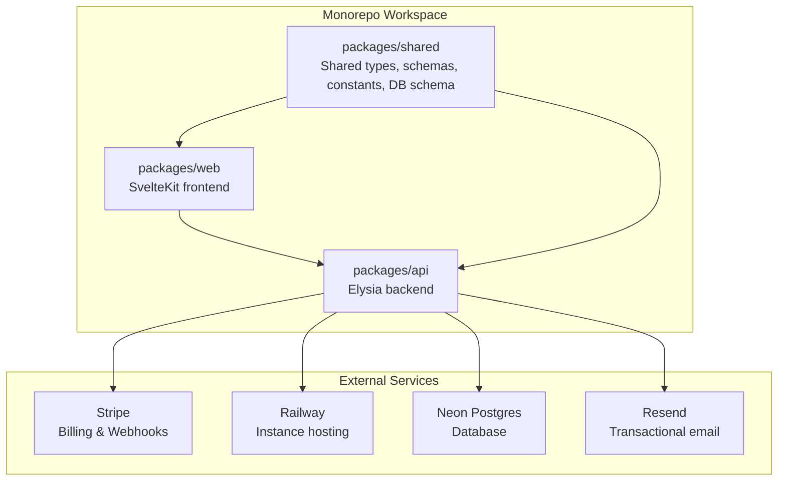
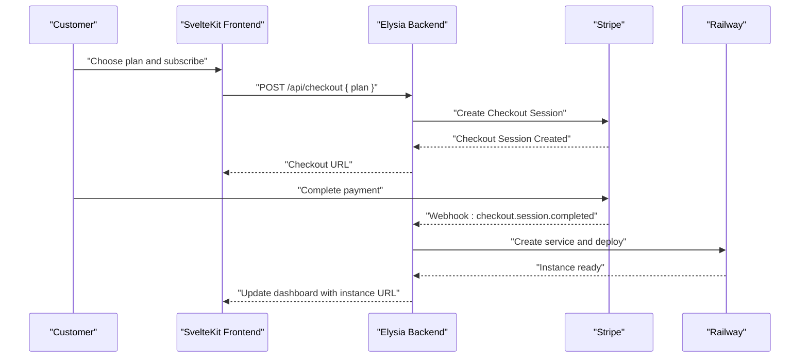
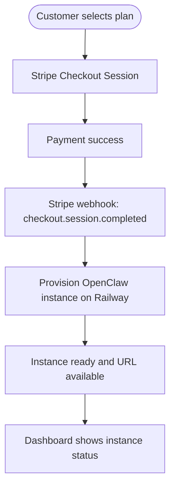
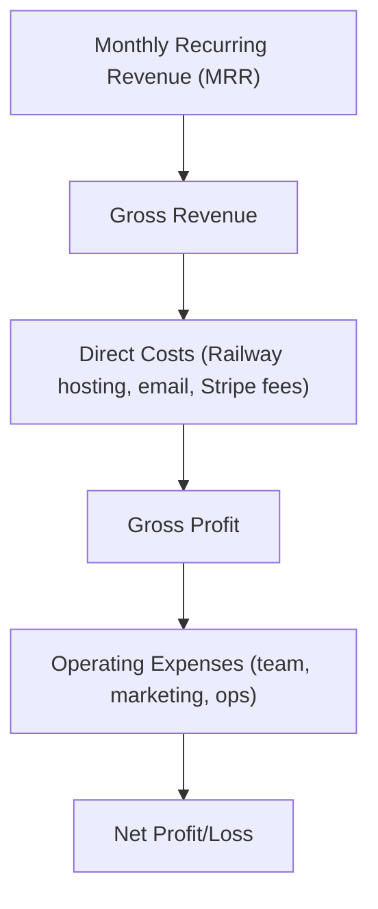
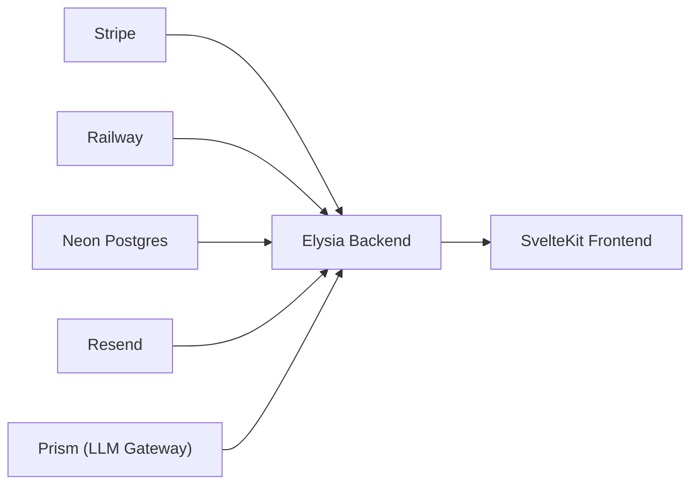

# Business Model

<cite>
**Referenced Files in This Document**
- [PRD.md](file://PRD.md)
- [package.json](file://package.json)
- [types.ts](file://packages/shared/src/types.ts)
- [constants.ts](file://packages/shared/src/constants.ts)
- [schemas.ts](file://packages/shared/src/schemas.ts)
- [schema.ts](file://packages/shared/src/db/schema.ts)
- [2026-03-07-quality-10-plan.md](file://docs/plans/2026-03-07-quality-10-plan.md)
- [2026-03-07-quality-10-design.md](file://docs/plans/2026-03-07-quality-10-design.md)
</cite>

## Table of Contents
1. [Introduction](#introduction)
2. [Project Structure](#project-structure)
3. [Core Components](#core-components)
4. [Architecture Overview](#architecture-overview)
5. [Detailed Component Analysis](#detailed-component-analysis)
6. [Dependency Analysis](#dependency-analysis)
7. [Performance Considerations](#performance-considerations)
8. [Troubleshooting Guide](#troubleshooting-guide)
9. [Conclusion](#conclusion)
10. [Appendices](#appendices)

## Introduction
This document details the SparkClaw business model with a focus on revenue generation and value delivery mechanisms. SparkClaw offers a managed hosting solution for OpenClaw, eliminating infrastructure complexity for customers. Revenue is primarily derived from a subscription-based pricing model with three tiers (Starter, Pro, Scale), complemented by optional usage-based add-ons and future monetization expansions such as premium features and enterprise licensing.

## Project Structure
SparkClaw is a monorepo organized around a shared workspace with three packages:
- packages/web: SvelteKit frontend for landing, authentication, and dashboard
- packages/api: Elysia backend handling authentication, checkout, webhooks, and provisioning
- packages/shared: Shared types, schemas, constants, and database schema used across the stack



**Diagram sources**
- [package.json](file://package.json#L1-L23)
- [PRD.md](file://PRD.md#L209-L238)

**Section sources**
- [package.json](file://package.json#L1-L23)
- [PRD.md](file://PRD.md#L209-L238)

## Core Components
- Subscription-based pricing with three tiers: Starter ($19/mo), Pro ($39/mo), Scale ($79/mo)
- Stripe-powered checkout and recurring billing with hosted checkout pages
- Automated instance provisioning on Railway triggered by Stripe webhooks
- Predictable monthly pricing with optional usage-based add-ons planned for Phase 2+
- Operational efficiency model: SparkClaw manages DevOps complexity, enabling customers to focus on building AI applications

**Section sources**
- [PRD.md](file://PRD.md#L75-L83)
- [PRD.md](file://PRD.md#L100-L125)
- [PRD.md](file://PRD.md#L131-L166)
- [constants.ts](file://packages/shared/src/constants.ts#L10-L14)

## Architecture Overview
The business model architecture centers on a seamless customer journey from sign-up to a ready-to-use OpenClaw instance, with Stripe managing billing and Railway hosting instances.



**Diagram sources**
- [PRD.md](file://PRD.md#L107-L125)
- [PRD.md](file://PRD.md#L138-L154)
- [PRD.md](file://PRD.md#L572-L596)

## Detailed Component Analysis

### Subscription-Based Pricing Model
- Three-tier plans with predictable monthly pricing
- Stripe Checkout hosted pages for seamless payment experience
- Webhook-driven subscription lifecycle management



**Diagram sources**
- [PRD.md](file://PRD.md#L107-L125)
- [PRD.md](file://PRD.md#L138-L154)

**Section sources**
- [PRD.md](file://PRD.md#L75-L83)
- [PRD.md](file://PRD.md#L100-L125)
- [constants.ts](file://packages/shared/src/constants.ts#L10-L14)

### Value-Delivery Mechanism
Customers receive managed hosting services rather than infrastructure ownership:
- Zero DevOps: SparkClaw provisions and maintains OpenClaw instances
- Instant setup: From signup to a running instance in under five minutes
- Predictable pricing: Transparent monthly plans with optional usage add-ons

**Section sources**
- [PRD.md](file://PRD.md#L24-L30)
- [PRD.md](file://PRD.md#L276-L295)

### Operational Efficiency Model
SparkClaw abstracts DevOps complexity:
- Automatic instance provisioning via Railway GraphQL API
- Background job architecture for provisioning tasks
- Retry logic and error handling for resilience
- Reduced operational risk through managed infrastructure

**Section sources**
- [PRD.md](file://PRD.md#L131-L166)
- [2026-03-07-quality-10-plan.md](file://docs/plans/2026-03-07-quality-10-plan.md#L780-L871)

### Competitive Advantages
- Elimination of infrastructure management
- Reduced operational risk
- Simplified scaling through managed hosting
- Open-source engine (OpenClaw) with community backing
- Line support as a first-class feature in targeted markets

**Section sources**
- [PRD.md](file://PRD.md#L1227-L1253)

### Financial Projections and Unit Economics
- Cost per instance estimate: $6–$13 per month (Railway hosting plus minimal operational costs)
- Gross margins by plan:
  - Starter: ~$12 (63%)
  - Pro: ~$30 (77%)
  - Scale: ~$68 (86%)
- Phase 2+ margin uplift through LLM usage billing (estimated 20–40% markup on token cost)
- Assumptions: Railway Hobby plan costs ~$5–$10 per service/month; average LLM cost per 1,000 tokens ~$0.003–$0.01; Stripe fees ~2.9% + $0.30 per transaction



**Diagram sources**
- [PRD.md](file://PRD.md#L1190-L1224)

**Section sources**
- [PRD.md](file://PRD.md#L1190-L1224)

### Roadmap for Monetization Expansion
- Phase 2: Usage-based billing via Prism (included credits per plan, hard caps, optional pay-per-use)
- Premium features and templates
- App integrations (Tier 1–4) with potential revenue sharing
- Enterprise licensing and advanced control panels
- Developer APIs for programmatic access

**Section sources**
- [PRD.md](file://PRD.md#L894-L901)
- [PRD.md](file://PRD.md#L1022-L1065)
- [PRD.md](file://PRD.md#L1358-L1402)

### Data Model Implications for Business Metrics
The database schema enforces one-to-one relationships between users, subscriptions, and instances, aligning with the subscription model and simplifying revenue tracking and churn analysis.

```mermaid
erDiagram
USERS {
uuid id PK
string email UK
timestamp created_at
timestamp updated_at
}
SUBSCRIPTIONS {
uuid id PK
uuid user_id FK
string plan
string stripe_customer_id
string stripe_subscription_id UK
string status
timestamp current_period_end
timestamp created_at
timestamp updated_at
}
INSTANCES {
uuid id PK
uuid user_id FK
uuid subscription_id FK UK
string railway_project_id
string railway_service_id
string custom_domain
string railway_url
string url
string status
string domain_status
text error_message
timestamp created_at
timestamp updated_at
}
USERS ||--o{ SUBSCRIPTIONS : "has"
SUBSCRIPTIONS ||--o{ INSTANCES : "controls"
```

**Diagram sources**
- [schema.ts](file://packages/shared/src/db/schema.ts#L14-L19)
- [schema.ts](file://packages/shared/src/db/schema.ts#L71-L96)
- [schema.ts](file://packages/shared/src/db/schema.ts#L105-L137)

**Section sources**
- [schema.ts](file://packages/shared/src/db/schema.ts#L71-L96)
- [schema.ts](file://packages/shared/src/db/schema.ts#L105-L137)

### Concrete Examples of Value Creation
- For customers: Launch a production-grade OpenClaw instance in minutes without managing infrastructure, reducing time-to-market and operational overhead
- For stakeholders: Predictable MRR growth, high gross margins, and scalable unit economics driven by managed hosting costs and optional usage billing

**Section sources**
- [PRD.md](file://PRD.md#L24-L30)
- [PRD.md](file://PRD.md#L1190-L1224)

## Dependency Analysis
The business model relies on integrated dependencies across the stack:
- Stripe for billing and subscription lifecycle
- Railway for instance hosting and provisioning
- Neon Postgres for data persistence
- Resend for transactional email
- Prism for LLM gateway and future usage billing



**Diagram sources**
- [PRD.md](file://PRD.md#L193-L207)
- [PRD.md](file://PRD.md#L853-L893)

**Section sources**
- [PRD.md](file://PRD.md#L193-L207)
- [PRD.md](file://PRD.md#L853-L893)

## Performance Considerations
- Instance provisioning targets < 5 minutes (p95) to ensure rapid customer onboarding
- API response targets < 200ms for reads and < 500ms for writes
- OTP delivery targets < 30 seconds (p95)
- Frontend UX includes loading states, polling, and error handling for smooth user experience

**Section sources**
- [PRD.md](file://PRD.md#L389-L397)
- [2026-03-07-quality-10-design.md](file://docs/plans/2026-03-07-quality-10-design.md#L72-L93)

## Troubleshooting Guide
Common operational issues and mitigations:
- Provisioning failures: Retry logic with exponential backoff, manual override capability, and structured logging
- Webhook delivery delays: Idempotent handlers, signature verification, and manual replay via Stripe dashboard
- Rate limiting: In-memory sliding window for OTP endpoints to prevent abuse
- Error visibility: Structured JSON logging across backend services

**Section sources**
- [PRD.md](file://PRD.md#L654-L674)
- [2026-03-07-quality-10-plan.md](file://docs/plans/2026-03-07-quality-10-plan.md#L582-L647)
- [2026-03-07-quality-10-design.md](file://docs/plans/2026-03-07-quality-10-design.md#L15-L29)

## Conclusion
SparkClaw’s business model combines a subscription-first approach with managed hosting to deliver predictable value to customers while achieving strong unit economics. The roadmap for monetization expansion—usage-based billing, premium features, and enterprise licensing—positions the company for sustainable growth and scalability. The operational efficiency model reduces customer friction and operational risk, enabling focus on building AI applications rather than infrastructure management.

## Appendices
- Pricing tiers and Stripe integration details are defined in shared constants and schemas
- Database schema enforces relationships that support subscription-based revenue tracking

**Section sources**
- [constants.ts](file://packages/shared/src/constants.ts#L10-L14)
- [schemas.ts](file://packages/shared/src/schemas.ts#L7-L20)
- [schema.ts](file://packages/shared/src/db/schema.ts#L71-L96)