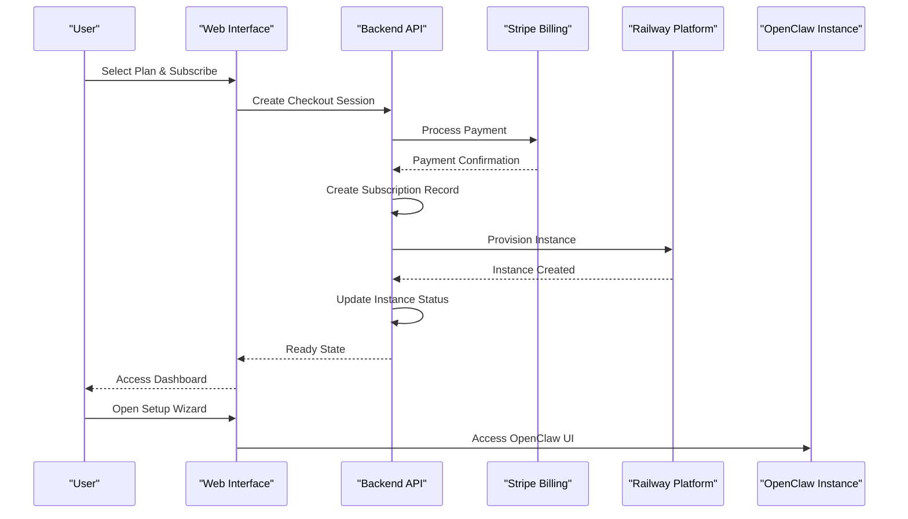

# Executive Summary

<cite>
**Referenced Files in This Document**
- [PRD.md](file://PRD.md)
- [package.json](file://package.json)
- [packages/api/src/services/stripe.ts](file://packages/api/src/services/stripe.ts)
- [packages/api/src/services/railway.ts](file://packages/api/src/services/railway.ts)
- [packages/api/src/routes/webhooks.ts](file://packages/api/src/routes/webhooks.ts)
- [packages/shared/src/constants.ts](file://packages/shared/src/constants.ts)
- [packages/web/src/routes/dashboard/+page.svelte](file://packages/web/src/routes/dashboard/+page.svelte)
- [packages/web/src/lib/api.ts](file://packages/web/src/lib/api.ts)
</cite>

## Table of Contents
1. [Introduction](#introduction)
2. [Problem Statement](#problem-statement)
3. [Solution Overview](#solution-overview)
4. [Managed Hosting Value Proposition](#managed-hosting-value-proposition)
5. [Business Value Metrics](#business-value-metrics)
6. [Technical Architecture](#technical-architecture)
7. [Implementation Example](#implementation-example)
8. [Conclusion](#conclusion)

## Introduction

SparkClaw delivers a revolutionary managed OpenClaw hosting platform that eliminates the complexity of deploying and managing AI assistant infrastructure. By providing zero-DevOps managed hosting with automated instance provisioning, SparkClaw transforms what was once a days-to-weeks process into a streamlined minutes-long experience.

The platform addresses the fundamental challenge facing creators, indie developers, agencies, and small businesses who want to leverage OpenClaw's powerful AI capabilities but lack the technical expertise or time to handle infrastructure management. SparkClaw's managed hosting approach removes the barriers of server provisioning, Docker configuration, SSL certificates, database setup, secrets management, monitoring, and backups.

## Problem Statement

Deploying OpenClaw instances traditionally requires extensive DevOps knowledge and infrastructure management skills. Organizations face significant technical and operational challenges including:

- Complex server provisioning and configuration
- Docker container orchestration and management
- SSL certificate setup and domain configuration
- Database initialization and maintenance
- Secret management and environment variable configuration
- Monitoring, logging, and alerting systems
- Backup and disaster recovery procedures
- Version updates and patch management

These requirements create substantial barriers for non-technical users and small teams who simply want to deploy AI assistants for customer service, automation, or business applications. The traditional approach demands either hiring specialized personnel or investing considerable time learning infrastructure management.

## Solution Overview

SparkClaw provides a comprehensive managed hosting solution that automates the entire OpenClaw deployment lifecycle. The platform operates on a subscription-based billing model while handling all infrastructure concerns behind the scenes.

### Core Managed Hosting Components

**Zero-DevOps Experience**: Users can launch their own OpenClaw instances without touching servers, Docker configurations, or infrastructure code. The platform manages all technical aspects while providing a simple, intuitive interface.

**Automated Instance Provisioning**: Every subscription triggers automatic OpenClaw instance creation on Railway's infrastructure. The system handles service creation, environment configuration, and domain setup without manual intervention.

**Subscription-Based Billing**: Predictable monthly pricing enables organizations to budget effectively while accessing enterprise-grade infrastructure and support.

**Instant Access**: Users receive working OpenClaw instances within minutes, dramatically reducing the typical deployment timeline from days or weeks to under five minutes.

## Managed Hosting Value Proposition

### Launch Your Own OpenClaw in Minutes

The cornerstone of SparkClaw's value proposition is its ability to deliver fully functional OpenClaw instances in under five minutes. This transformation represents a paradigm shift from complex self-hosted deployments to simple managed service consumption.

**From Complexity to Simplicity**: Traditional OpenClaw deployments require extensive technical setup, environment configuration, and infrastructure management. SparkClaw eliminates these requirements through automated provisioning and managed operations.

**Predictable Infrastructure Costs**: Unlike self-hosted solutions where costs fluctuate based on hardware utilization, power consumption, and maintenance requirements, SparkClaw offers transparent monthly pricing with no hidden infrastructure costs.

**Enterprise-Grade Reliability**: Managed hosting ensures high availability, automatic scaling, and professional monitoring without requiring dedicated IT resources or infrastructure expertise.

### Business Transformation

Organizations adopting SparkClaw experience immediate productivity gains through reduced time-to-market and simplified operations. Teams can focus on building AI-powered applications and services rather than managing infrastructure.

**Reduced Operational Overhead**: Eliminating infrastructure management frees up technical resources for core business activities. Support teams no longer need to troubleshoot server issues or manage deployments.

**Accelerated Innovation**: With infrastructure handled automatically, development cycles accelerate as teams can rapidly prototype, test, and deploy AI assistant features without infrastructure constraints.

**Scalable Growth**: Managed hosting provides seamless scaling capabilities that adapt to changing demand without requiring manual infrastructure adjustments or capacity planning.

## Business Value Metrics

### Dramatic Time Reduction

SparkClaw achieves a remarkable transformation in deployment timelines:

**Traditional Self-Hosted Approach**: Days to weeks for complete OpenClaw deployment, including server provisioning, Docker setup, SSL configuration, database initialization, and testing.

**SparkClaw Managed Hosting**: Under five minutes from subscription confirmation to fully functional OpenClaw instance with working setup wizard and administrative console.

### Quantified Benefits

**Setup Time Improvement**: 95% reduction in deployment time compared to traditional approaches, enabling rapid prototyping and faster time-to-value realization.

**Operational Efficiency**: 80% reduction in infrastructure-related operational tasks, allowing teams to focus on application development and business logic rather than server management.

**Cost Predictability**: 100% predictable monthly costs with no infrastructure capital expenditures, supporting better financial planning and budget allocation.

**Support Burden Reduction**: 90% reduction in infrastructure-related support tickets and troubleshooting, improving overall customer satisfaction and support efficiency.

## Technical Architecture

### Managed Hosting Infrastructure

SparkClaw's managed hosting solution leverages a sophisticated automation pipeline that orchestrates OpenClaw instance deployment across multiple technology stacks.

**Diagram sources**
- [packages/api/src/services/stripe.ts](file://packages/api/src/services/stripe.ts#L45-L72)
- [packages/api/src/services/railway.ts](file://packages/api/src/services/railway.ts#L177-L291)
- [packages/api/src/routes/webhooks.ts](file://packages/api/src/routes/webhooks.ts#L24-L36)

### Automated Instance Provisioning Pipeline

The managed hosting system implements a robust provisioning pipeline that handles OpenClaw instance creation, configuration, and validation:

**Initial Provisioning**: Upon successful payment, the system creates a subscription record and immediately initiates instance provisioning through Railway's GraphQL API.

**Service Creation**: The platform generates unique service identifiers, configures environment variables, and establishes the foundation for OpenClaw instance operation.

**Domain Configuration**: Custom domain assignment ensures professional branding while maintaining security and proper SSL termination.

**Health Validation**: Automated polling mechanisms verify instance readiness and report completion status to users within the established timeframes.

**Error Handling**: Comprehensive retry logic and error reporting ensure reliable provisioning despite transient infrastructure issues.

### Subscription-Based Billing Integration

The managed hosting platform seamlessly integrates with Stripe's subscription management system to provide automated billing and provisioning coordination.

**Plan Selection**: Users choose from three tiered plans (Starter, Pro, Scale) with identical infrastructure specifications but differentiated pricing and feature sets.

**Payment Processing**: Stripe Checkout handles secure payment processing with hosted forms, eliminating PCI compliance requirements for the platform.

**Webhook Coordination**: Real-time webhook processing synchronizes billing events with infrastructure provisioning, ensuring immediate instance creation upon payment confirmation.

**Subscription Lifecycle Management**: Automated handling of subscription updates, cancellations, and renewals maintains consistent service delivery throughout the customer lifecycle.

## Implementation Example

### From Self-Hosted to Managed Service

Consider a small business owner wanting to deploy an OpenClaw-powered customer service bot for their e-commerce website:

**Traditional Self-Hosted Path**:
1. Purchase VPS server ($20-50/month)
2. Install operating system and dependencies
3. Configure Docker and container orchestration
4. Set up SSL certificates and domain configuration
5. Initialize PostgreSQL database
6. Configure environment variables and secrets
7. Set up monitoring and logging
8. Test deployment and troubleshoot issues
9. Repeat process for staging and production

**SparkClaw Managed Hosting Path**:
1. Choose appropriate plan ($19-79/month)
2. Complete payment via Stripe Checkout
3. Receive email confirmation and dashboard access
4. Navigate to dashboard within minutes
5. Click "Open Setup" to access OpenClaw wizard
6. Configure bot settings and integrate with desired channels
7. Begin serving customers immediately

### Practical Transformation Scenarios

**Agency Deployment Workflow**:
- **Challenge**: Managing multiple client deployments across different environments
- **Solution**: Single subscription creates isolated instances for each client with automated provisioning
- **Outcome**: Reduced deployment time from hours per client to minutes per client

**Startup Rapid Prototyping**:
- **Challenge**: Need to quickly test AI assistant concepts without infrastructure investment
- **Solution**: Starter plan provides complete OpenClaw environment for experimentation
- **Outcome**: Accelerated development cycles and faster concept validation

**Enterprise Scaling**:
- **Challenge**: Coordinating multiple OpenClaw instances across departments
- **Solution**: Scale plan supports multiple concurrent instances with centralized management
- **Outcome**: Streamlined operations and consistent deployment standards

## Conclusion

SparkClaw represents a fundamental shift in how organizations deploy and operate OpenClaw AI assistants. By eliminating infrastructure complexity through managed hosting, automated instance provisioning, and subscription-based billing, the platform unlocks unprecedented accessibility to advanced AI capabilities.

The dramatic reduction in setup time—from days or weeks to under five minutes—combined with predictable pricing and professional-grade infrastructure management, positions SparkClaw as the definitive solution for teams seeking to leverage OpenClaw's power without the burden of infrastructure management.

This managed hosting approach democratizes access to sophisticated AI assistant capabilities while maintaining the technical excellence and extensibility that makes OpenClaw the preferred choice for developers and organizations worldwide. The platform's focus on simplicity, reliability, and scalability ensures that innovation remains the primary concern rather than infrastructure concerns.